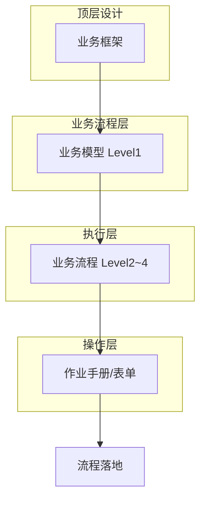
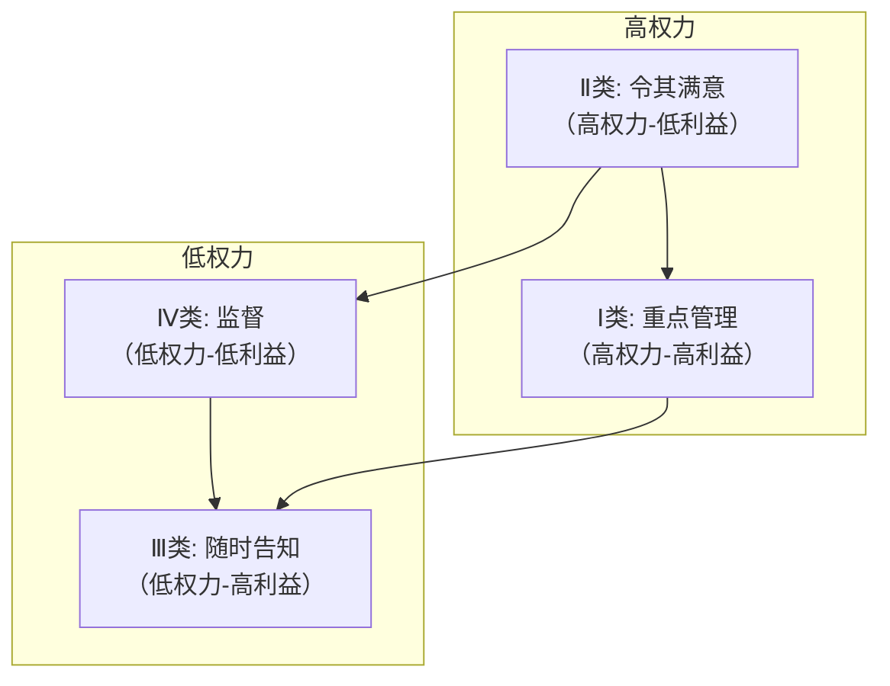
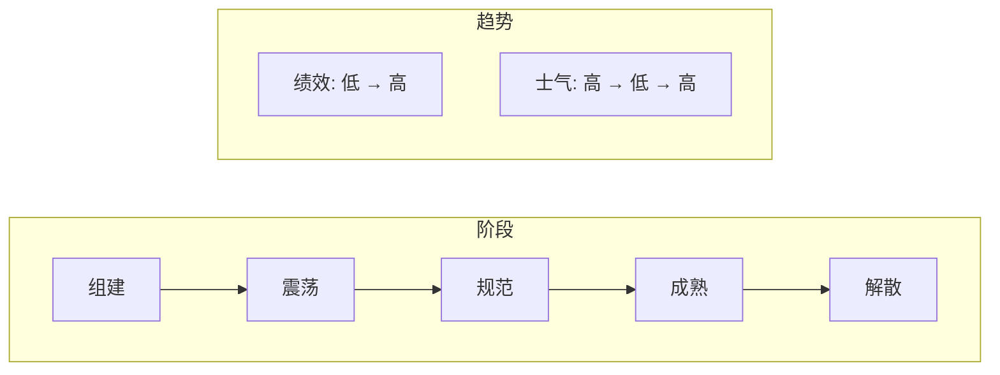
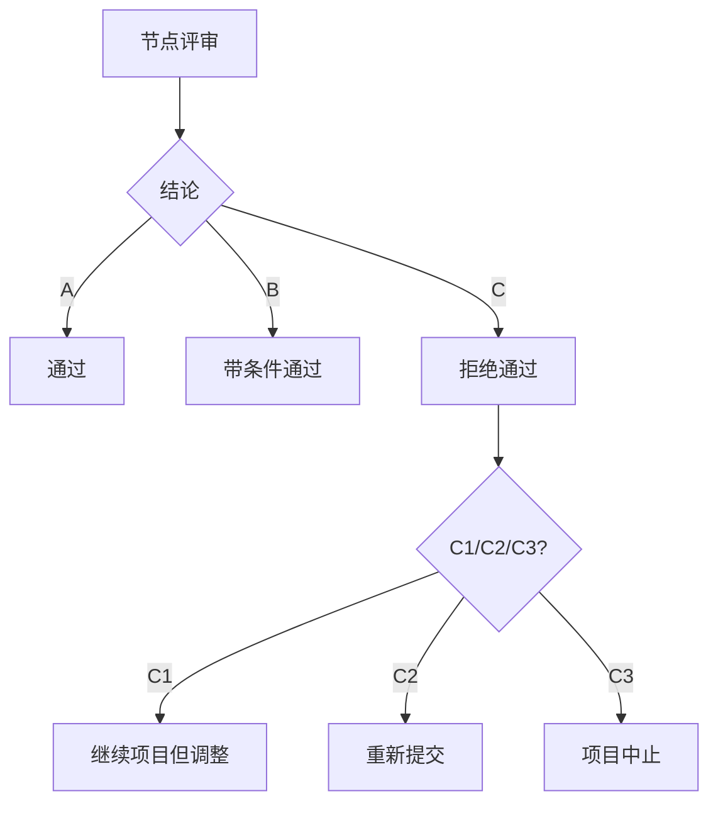
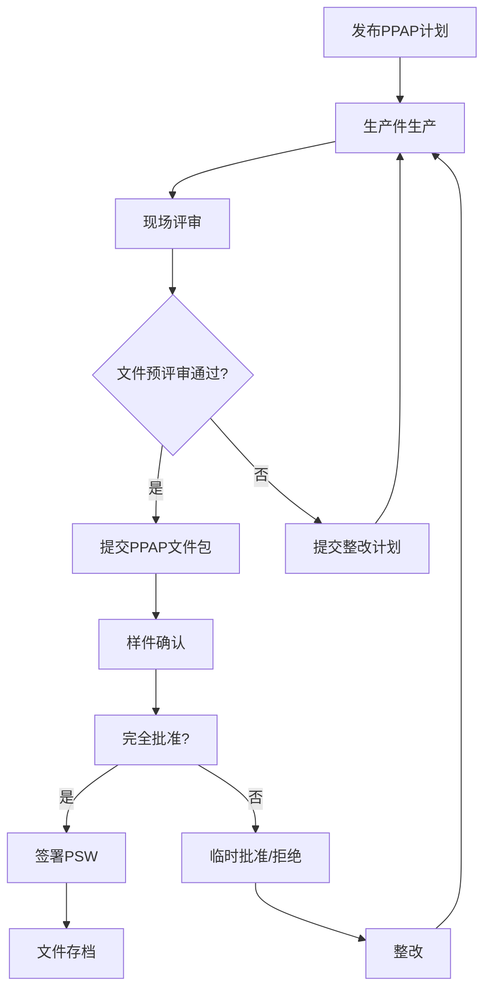
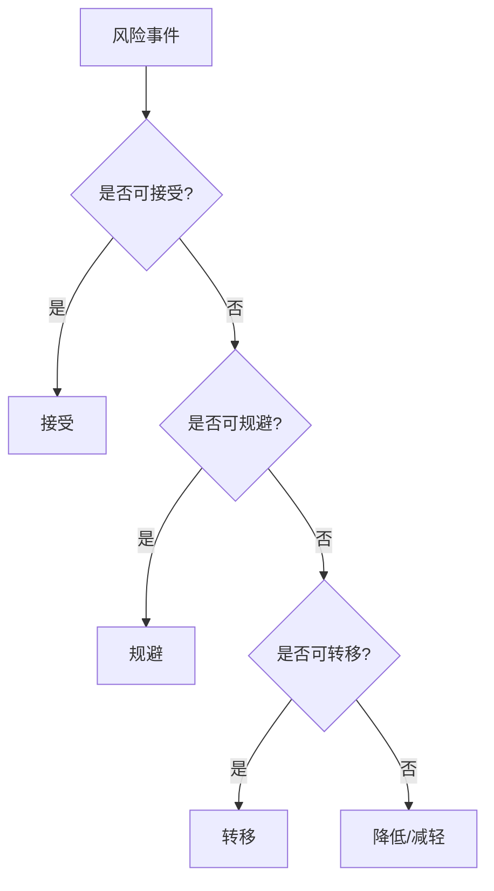
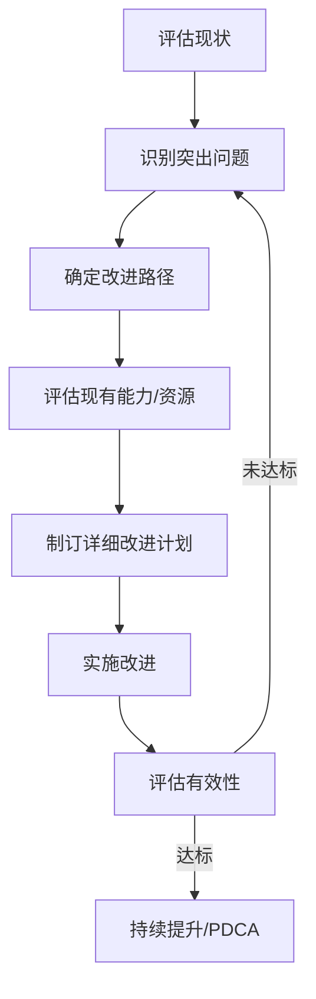
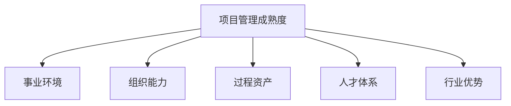

# 《产品开发项目管理》章节总结

## 书籍信息
- **书名**：产品开发项目管理
- **作者**：尹义法（Kevin Yin）
- **PDF 状态**：完整（基于 mobi 转换文本，内容可识别）
- **OCR 状态**：良好，文本可读，图表以占位符形式标注

## 目录说明
- **目录识别情况**：完整识别，全书共 12 章，含推荐语、作者简介、赞誉、推荐序、前言及参考文献
- **章节对应依据**：严格按原书目录顺序输出
- **OCR 修复说明**：部分图表以 `!(images/xxx.jpg)` 形式标注，无法直接渲染，已按原文逻辑重建 Mermaid 流程图；无页码信息，引用不标注页码

## 全书核心主题
本书是一本面向制造业（尤其汽车行业）产品开发领域的项目管理实战指南。作者基于近 20 年行业经验，系统阐述了从项目规划、启动、团队管理、进度与财务管理、质量与沟通管理，到风险控制、收尾及项目管理办公室（PMO）建设的完整方法论。

核心观点包括：
1. **项目管理是“智力创造”与“行动实践”的一致性管理**。
2. **产品开发流程如道路，项目管理如交规**，流程与项目需匹配。
3. **质量与成本由设计决定**，需前置管理。
4. **项目管理的终极目标是相关方满意与项目收益**。
5. **组织需构建适宜的项目治理环境**，PMO 是关键推动者。

---

## 第1章：项目管理概述

### 1. 核心论点
- **问题**：什么是项目管理？它从何而来？对个人和组织有何价值？如何有效学习？
- **观点**：项目管理起源于20世纪40年代，是一门新兴学科；其本质是让“智力创造”与“行动实践”两个过程受控且趋于一致；对组织而言，项目管理是实现战略、提升成功率的关键；学习上倡导“先干后学”。

### 2. 关键概念/事件
- **项目定义（PMI）**：为创造独特产品、服务或成果而进行的临时性工作（三属性：独特性、临时性、不确定性）。
- **项目定义（PRINCE2）**：按照批准的商业论证，为交付商业产品而创建的临时性组织（五属性：增加变革性、跨职能性）。
- **项目管理知识体系三大流派**：PMBOK（美国，知识体系）、PRINCE2（英国，方法论）、ICB（国际，人员能力）。
- **项目管理成熟度阶梯**：初始阶段(L1) → 发展阶段(L2) → 成熟阶段(L3) → 典范阶段(L4)。
- **中国式项目管理的困境**：“人治”文化（权力驱动） vs “法治”文化（流程驱动），导致专业认证难以落地。

### 3. 逻辑推演
本章从历史起源讲起，对比三大知识体系，指出全球认证人数众多但中国企业应用水平普遍偏低（多数处于L1-L2）。原因包括持证人员占比低、持证者与资深项目经理群体错位、以及中国式“人治”文化排斥流程管理。进而重新定义项目与项目管理，强调项目目标的三层次（交付结果、商业价值、相关方满意），最后提出“先干后学”的实践导向学习方法，并给出项目经理能力模型（整合战略与团队）。

### 4. 经典金句/数据
> “什么都是项目，什么都可以成为项目，项目管理无处不在。”
> “项目管理的本质是，让‘智力创造’和‘行动实践’两个过程受控且趋于一致。”
> 数据：PMP全球认证超100万人，中国超30万人；企业项目管理成熟度：多数企业达不到第Ⅱ代受控型水平。

---

## 第2章：产品开发流程

### 1. 核心论点
- **问题**：如何根据产品复杂程度设计合理的开发流程？
- **观点**：产品开发流程如道路，项目管理如交规。不同复杂度产品（大型复杂、中型复杂、小型简单、快速迭代）应匹配不同的流程结构，且需分层设计（流程总图→阶段流程→支持流程→模板）。

### 2. 关键概念/事件
- **华为IPD框架**：市场管理(MM)、需求管理(RM)、产品开发(IPD)、研发项目管理(RDPM)等，强调“研发是投资行为”、“结构化开发流程”。
- **整车开发流程（3阶段12节点）**：产品定义与方案、设计开发与验证、生产启动与投产（节点：KO→P10→P9→P8→P7→P6→P5→P4→P3→P2→P1）。
- **APQP（产品质量先期策划）**：5阶段（计划→产品设计开发→过程设计开发→产品和过程确认→反馈评定），适用于小型简单产品/零部件。
- **技术开发流程**：剪裁自产品开发流程，更注重预研与应用转化。

### 3. 逻辑推演
从公司全局流程（战略、业务、支持）切入，以华为为标杆，指出业务流程需定制化。然后分四类产品给出具体流程模型：大型复杂（整车）、中型复杂（发动机）、小型简单（APQP）、快速迭代（IPD）。最后讨论如何构建企业流程体系（五步法：体系规划→设计→实施→审计→优化），强调“先僵化、后优化、再固化”。

### 4. 流程图重建

#### 典型整车产品开发流程（简化）

#### 企业流程体系构建方法

> 说明：原书包含多张复杂流程图，此处重建核心逻辑。

---

## 第3章：项目规划与选择

### 1. 核心论点
- **问题**：如何确保“做正确的事”？如何从战略高度筛选和评估项目？
- **观点**：选对方向比努力更重要。所有项目应来源于组织战略目标，并通过市场竞争分析和项目价值评估双重筛选。

### 2. 关键概念/事件
- **OPM3（组织级项目管理成熟度模型）**：项目最终支撑愿景/使命和战略目标。
- **市场竞争评估矩阵**：两个维度——市场引力 vs 竞争地位。
- **$APPEALS分析法**：从价格、可获得性、包装、性能、易用性、保证、生命周期成本、社会接受程度8个维度评估产品竞争力。
- **项目价值评估雷达图**：从经济回报、战略符合度、战略力度、商业成功概率、技术成功概率5维度评估项目价值。

### 3. 逻辑推演
从企业战略规划（“向前展望，向后推理”）出发，引入市场竞争分析工具（PESTEL、波特五力、7S法），进而提出项目评估的双重维度：产品竞争力（$APPEALS）与项目价值（雷达图），最终形成项目优先级排序，指导立项决策。

### 4. 经典金句/数据
> “战略管理是‘向前展望，向后推理’。”
> 产品竞争力案例：$APPEALS 八个维度详细拆解（如汽车行业的零整比、生命周期成本）。

---

## 第4章：项目启动

### 1. 核心论点
- **问题**：如何正式、规范地启动一个项目？
- **观点**：良好的开端是成功的一半。启动阶段需完成立项审批、制定项目目标（区分项目目标与产品目标）、任命项目经理、召开启动会，并营造良好的项目环境。

### 2. 关键概念/事件
- **立项申请书 vs 项目任务书**：前者为论证过程（含背景、可行性），后者为结果宣告（明确范围与目标）。
- **项目目标 vs 产品目标**：项目目标对企业负责（进度、质量、成本、收益等）；产品目标对用户负责（功能、性能等）。
- **项目经理任命四步法**：物色人选 → 拟定人选 → 确定人选 → 正式任命。
- **事业环境因素 vs 组织过程资产**：外部/内部约束条件 vs 流程/知识库。

### 3. 逻辑推演
明确立项审批步骤（7步），给出立项申请书内容模板。重点区分项目目标与产品目标（案例：项目规格书 vs 产品规格书），强调目标体系FQCDS。然后详解项目经理任命的时机与流程，强调“公开授权”。最后解析项目环境的两个组成部分（事业环境因素、组织过程资产），并给出知识库建设建议。

### 4. 经典金句/数据
> “项目目标的三个层次：交付结果、商业价值、相关方要求。”
> 项目目标书案例：含进度、质量、预算、成本、收益五大类指标。

---

## 第5章：项目团队管理

### 1. 核心论点
- **问题**：如何构建和管理高绩效的项目团队？如何管理相关方？
- **观点**：没有完美的个人，只有完美的团队。需根据组织特点选择职能型、矩阵型或项目型组织，并通过系统流程组建团队、管理相关方、运营团队及实施绩效管理。

### 2. 关键概念/事件
- **组织类型**：职能型、弱/平衡/强/混合矩阵型、项目型。
- **团队发展五阶段**：组建 → 震荡 → 规范 → 成熟 → 解散（布鲁斯·塔克曼模型）。
- **相关方管理四步法**：识别、规划、管理、监督。核心工具：权力-利益矩阵。
- **六种领导风格**：专制型、权威型、关系型、民主型、领跑型、教练型。
- **项目绩效三层次**：项目管理部门评项目经理、项目经理评职能部门、项目经理评项目组成员。

### 3. 逻辑推演
先比较不同组织模式优劣，推荐强矩阵/混合矩阵。然后分解项目团队角色与职责（项目管理委员会、项目经理、子经理层），给出团队组建9步流程。引入相关方管理（诸葛亮安居平五路案例），强调“越早越好，越全越好”。接着讨论团队运营（区别于群体），最后给出项目绩效管理的具体案例（三层次评价体系）。

### 4. 流程图重建

#### 相关方权力-利益矩阵

#### 团队发展五阶段与绩效/士气关系

### 5. 经典金句/数据
> “相关方管理遵循‘越早越好，越全越好’。”
> 数据：Standish Group 研究显示，团队组织问题导致项目失败比例高达23%。
> 案例：诸葛亮“安居平五路”作为相关方管理典范。

---

## 第6章：项目进度管理

### 1. 核心论点
- **问题**：如何制定可执行的进度计划并有效管控？
- **观点**：任何事情都需要进行构思和实施，进度管理能够保障两者一致。计划需分层、分类、滚动制订，监控需深入到活动层级。

### 2. 关键概念/事件
- **项目管理计划 vs 项目进度计划**：前者是各类计划统称，后者是具体时间表。
- **计划分类**：按表现形式（同步图、列表、网络图）、按时长（全周期、阶段、节点）、按层级（0~4级）、按制订方式（滚动波）。
- **计划制订七字方针**：裁、拆、分、讨、留、全、省。
- **节点评审技术**：公司级、项目级、业务级三级评审，决策通道（A通过/B有条件通过/C拒绝，C再分C1/C2/C3）。

### 3. 逻辑推演
先澄清概念（项目管理计划 ≠ 进度计划），然后详细介绍计划分类与分层方法（0~4级）。针对计划制订，批评企业常用的“类比法”，推荐PMBOK标准法结合实践“以终为始”倒排法。给出计划制订8步流程（策划层级→确定形式→WBS→活动排序→确认时间→匹配资源→可视化→承诺机制）。最后讨论进度监控（三环线、四层楼）和保障措施（解题文化、获取认同等）。

### 4. 流程图重建

#### 节点评审决策通道

### 5. 经典金句/数据
> “项目管理计划如道路，进度计划如导航路线。”
> 数据：IBM统计，2/3以上缺陷在需求和设计阶段引入。

---

## 第7章：项目财务管理

### 1. 核心论点
- **问题**：如何管理项目预算、产品成本及最终收益？
- **观点**：项目的终极目标是赚取项目收益。需区分项目预算（一次性投入）与产品成本（单位成本），通过正向成本核算和价值工程分析，实现目标成本控制。

### 2. 关键概念/事件
- **项目预算 vs 产品成本 vs 项目收益**：预算=开发投入；成本=生产制造成本；收益=价格×销量 - 成本 - 预算。
- **成本估算方法**：经验法、类比法、参数法、三点估算法、供方评估法。
- **挣值管理（EVM）**：PV（计划值）、AC（实际成本）、EV（挣值），计算SV、CV、SPI、CPI。
- **产品成本管理模型**：销售价格 = 竞品价格 + 功能价差 + 品牌溢价；目标成本 = 出厂价格 - 税费 - ROS。
- **项目收益提升六策略**：合理支出、需求弹性定价、市场区间投放、产品组合拳、功能价值加价、品牌包装溢价。

### 3. 逻辑推演
先澄清财务概念（预算、成本、收益），对比PMBOK与企业实践差异。然后详解预算制定流程（自下而上 vs 自上而下），介绍五种估算方法，并批评挣值管理在制造业的局限性，推荐“迭代燃尽法”。接着重点分析产品成本管理：构成模型、管理流程（制定目标→分解→监控）、原价核算（材料费、劳务费等）。最后讨论项目收益管理，给出敏感性分析案例。

### 4. 经典金句/数据
> “产品的质量是设计出来的，同样，产品的成本是设计决定的。”
> 数据：某车企设计变更率从46.1%降至15%-20%；零整比案例：奔驰GLC达667.04%。

---

## 第8章：产品质量管理

### 1. 核心论点
- **问题**：如何系统管理产品质量，尤其是设计阶段的质量？
- **观点**：质量是由设计决定的。需构建质量管理体系，通过质量策划、前期质量管理（FMEA、虚拟分析、技术评审）、实物质量管理和交付质量管理，实现从“符合性”到“愉悦性”的跃迁。

### 2. 关键概念/事件
- **KANO模型**：基本质量、期望质量、魅力质量。
- **质量管理四阶段**：检验出来 → 生产出来 → 设计出来 → 体系保障。
- **特殊特性管理**：KPC（关键产品特性）、KCC（关键控制特征）。
- **质量问题管理**：QTM（质量问题跟踪表），11道质量墙。
- **PPAP（生产件批准程序）**：供应商证明能力的流程（6过程23项活动）。

### 3. 逻辑推演
从质量定义的三层次（符合性、适应性、愉悦性）出发，回顾质量管理百年历程（检验→生产→设计→体系），指出当前企业普遍处于低水平。然后提出解决方案：构建基于过程方法的端到端质量管理体系。在项目层面，重点讲解质量策划（目标分解、质量管理计划）、前期质量（多方案、FMEA、虚拟分析、技术评审）、实物质量（问题管理、AUDIT、综合匹配、OTS认可、变更管理、PPAP）及交付质量（专项检查、一致性审核、早期遏制）。

### 4. 流程图重建

#### PPAP生产件批准流程（简化）

### 5. 经典金句/数据
> “质量是由设计决定的，设计过程决定了产品的基因。”
> 数据：整车产品约80%质量问题来源于零部件；某自主品牌设计变更率46.1%。

---

## 第9章：项目沟通管理

### 1. 核心论点
- **问题**：如何提升项目中的团队沟通效率？
- **观点**：沟通是信息的交互，而不是情感的表达。项目沟通是群体沟通，需系统设计（识别对象、需求、模式、计划、控制），并遵循“减少触点，降低位差”的核心理念。

### 2. 关键概念/事件
- **沟通效果四层级**：信息层 → 认知层 → 反应层 → 行为层。
- **沟通障碍**：位差效应（领导层信息仅20-25%被下级正确理解）。
- **沟通设计五步**：识别对象 → 识别需求 → 定义模式 → 制订计划 → 实施控制。
- **会议管理“12345”法则**：1个核心理念（议而决、决而行、行而果）；2个基本要求；3个法则；4种禁止；5个步骤。
- **职场沟通“一五一十”定律**：1个核心（减少触点降低位差）；5大定律（换位思考、平等尊重、把握尺度、善用技巧、检查反馈）；10种禁忌。

### 3. 逻辑推演
重新定义沟通（信息交互，非情感表达），指出项目经理75%-90%时间用于沟通。然后从群体沟通视角，给出五步设计法。接着重点讲解项目会议管理（四类会议）和职场沟通技巧，引入人物性格分类（PDP：老虎、孔雀、考拉、猫头鹰、变色龙）及相应相处之道。最后讨论冲突管理（托马斯·基尔曼模型），强调适度冲突有益组织绩效。

### 4. 经典金句/数据
> “沟通的主体是信息，而不是人。”
> 数据：哈佛大学研究，82%被解雇者因人际沟通不良；项目经理沟通时间占75%-90%。
> 位差效应：来自领导层的信息仅20-25%被下级正确理解。

---

## 第10章：项目风险控制

### 1. 核心论点
- **问题**：如何系统识别、评估和应对项目风险？
- **观点**：事情如果有变坏的可能，不管可能性多小，它总会发生（墨菲定律）。风险管理需贯穿始终，通过识别、评估、规划应对、处置、跟踪五步法，将不确定性控制在可接受范围。

### 2. 关键概念/事件
- **风险定义**：不确定的一个或一系列事件一旦发生，将对目标产生影响（包含威胁与机会）。
- **风险分类**：按属性（商业/技术/管理）、按区域（内部/外部）、按概率影响（低/中/高）、按了解程度（YY/YN/NN）。
- **风险评估**：风险度 \(VaR = P \times X\)（概率×影响度），常用九宫格或五级标定。
- **风险应对策略**（PRINCE2）：规避威胁/开拓机会、降低威胁/强化机会、转移、共享、接受。
- **风险跟踪**：风险登记册，红黄绿状态标识。

### 3. 逻辑推演
先定义风险与相关术语（触发因素、弹回计划、次生风险等），指出企业普遍风险管理薄弱（原因：难见成绩、经验不足）。然后按五步法展开：识别（PESTEL、检查清单等）→ 评估（定性为主，定量为辅，如EMV、敏感度）→ 规划应对（五策略）→ 处置（按逻辑顺序：接受→规避→转移→降低）→ 跟踪（风险登记册、审计）。

### 4. 流程图重建

#### 风险处置逻辑顺序

### 5. 经典金句/数据
> “事情如果有变坏的可能，不管这种可能性有多小，它总会发生。”——墨菲定律
> “做好了风险管理很难看到成绩。”

---

## 第11章：项目收尾管理

### 1. 核心论点
- **问题**：如何规范、完整地结束一个项目？
- **观点**：项目隆重地开始，也要庄严地结束。收尾不仅是形式，更是知识积累、团队解散、成果移交的关键节点，需提前规划，明确中止条件，完成产品验收、项目总结、项目验收及善后工作。

### 2. 关键概念/事件
- **项目收尾四大作用**：管理节点、知识积累、沟通契机、宣传契机。
- **项目中止条件**：战略不符、市场萎缩、竞争力丧失、内部能力不足、资源需释放。
- **产品验收 vs 项目验收**：前者验收产品目标（客户视角），后者验收项目目标（企业视角）。
- **红/黑色案例库**：红色=成功经验，黑色=失败教训。
- **国际卓越项目管理评估模型**：2部分、9项指标、22项评价标准。

### 3. 逻辑推演
先强调收尾的价值（非“虎头蛇尾”），给出项目中止的五种情形。然后详解收尾流程：产品验收（依据产品规格书）→ 项目总结（主动式总结，红/黑色案例）→ 项目验收（依据项目目标书）→ 团队解散。最后讨论善后工作：成果申报、知识产权保护、项目移交、项目后评价（国际卓越模型）。

### 4. 经典金句/数据
> “项目成功的标准是达成项目目标，不是产品成功。”
> 数据：需求定义不准确导致项目失败的比例占43%。

---

## 第12章：项目管理办公室

### 1. 核心论点
- **问题**：如何构建和运营PMO，推进组织级项目管理？
- **观点**：一株植物的成长，不仅需要一颗饱满的种子，还需要湿润的土壤。PMO的职责包括能力建设、规划职能、交付职能，需根据组织成熟度选择支持型、控制型、指令型、顾问型或战略型风格。

### 2. 关键概念/事件
- **PMO三大职能**：交付职能（监控、评审、变更）、规划职能（项目组合、资源管理）、能力建设（流程、人才、知识库）。
- **项目管理五种风格**：支持型、控制型、指令型、顾问型、战略型。
- **项目治理架构**：IRB（投资评审委员会）→ IPMT（集成组合管理团队）→ PDT（产品开发团队）。
- **流程体系五步法**：体系规划 → 流程设计 → 流程实施 → 流程审计 → 流程优化。
- **项目经理能力金字塔**：基本素养 + 专业技术 + 领导力（管人、理事、驭人）。

### 3. 逻辑推演
从PMO职责框架出发，讨论五种管理风格的选择依据。然后以华为项目治理架构为例，说明矩阵式管理下的IRB/IPMT/PDT结构。接着详解PMO核心业务：流程体系构建（五步法）、项目人才培养（能力评估+行动学习）、项目规划与选择、管理项目（站在“筐”外）。最后讨论如何推进组织项目管理：现状诊断（VDA6.3等成熟度模型）→ 提升路径（优先级分析热图）→ 评估与持续改进（PDCA，工匠精神）。

### 4. 流程图重建

#### 项目管理提升路径图

#### 项目管理成熟度评价维度

### 5. 经典金句/数据
> “流程再造不是优化，是重新设计。”
> 数据：华为导入IPD（1999）到提出“日落法”固化（2016），历时17年。
> VDA6.3审核标准中项目管理条款摘选。

---

**文档结束**