# 《产品经理方法论：构建完整的产品知识体系（第2版）》章节总结

## 书籍信息
- 书名：产品经理方法论：构建完整的产品知识体系（第2版）
- 作者：赵丹阳
- PDF 状态：完整识别（基于提供的文本）
- OCR 状态：良好，可提取主要结构

## 目录说明
- 目录识别情况：完整，包含前言、推荐序、第1章至第16章、后记、致谢、资源与支持
- 章节对应依据：按页面顺序提取标题与内容
- OCR 修复说明：部分图表描述不完整，但文字逻辑清晰

## 全书核心主题
本书系统构建了产品经理所需的知识体系，涵盖从用户、需求、产品的基本概念，到文档撰写、流程图/时序图/原型图/架构图绘制、用户研究与分析、需求管理、产品设计、数据分析、技术理解、项目管理、行业与商业分析等完整模块。作者强调以“学者心态”学习产品知识，通过规范化、模型化、方法论化的方式实现职业进阶。本书既是入门指南，也是职业成长的参考框架。

---

## 推荐序一
### 核心论点
问题：产品经理如何高效成长？  
观点：构建并持续完善个人知识体系是成长核心，知识体系可传递、可协同，做事有章法能提高团队协同力。

### 关键概念
- 知识体系：专业知识+广博知识面+高度概括，具有可复制性。
- 成长宝典：记录想法、工作感悟，持续优化。
- 协同力：共同产品理念、工作方法和流程，形成团队整体战斗力。

### 逻辑推演
作者何文彬从学习数学的“公式思维”引出知识体系的重要性。指出产品经理不是技能型岗位，而需要体系化能力。通过“成长宝典”的公开与内化、知识体系的可传递性、团队协同力的提升，论证了完整知识体系对产品经理成长的关键作用。

### 经典金句
> “一个人的成长并不是一蹴而就的……谁能够更好地把知识串起来，把所有的知识形成图谱，谁就能更好地应用这些知识。”
> “知识体系并不是什么神秘的东西，产品经理的整个工作过程都可以用本书的内容解释。”

---

## 推荐序二
### 核心论点
问题：产品新人如何快速搭建知识体系？  
观点：行业内长期缺乏统一标准的知识体系指导书，本书填补了这一空白，能帮助新人绕开弯路，加速职业进阶。

### 关键概念
- 产品策划/产品运营：腾讯公司对产品经理职位的规范化命名。
- 职业准入门槛：未来产品经理将需要严格的知识体系、技能要求和能力模型。

### 逻辑推演
作者詹涵分享了自己作为产品新人时迷茫、缓慢的成长经历，指出行业缺乏系统性知识体系。随着“人人都是产品经理”口号被扭曲，行业回归理性，对专业能力要求提高。本书的系统性内容让他看到了行业规范化的希望。

### 经典金句
> “本书在一定程度上可以让读者绕开我曾经走过的弯路，为产品知识体系的搭建以及职业道路上的进阶节省更多时间。”
> “人人都是产品经理的时代结束了，整个行业逐渐恢复理性。”

---

## 前言
### 核心论点
问题：产品经理职业成长存在哪些学习需求？本书如何满足？  
观点：产品经理需要构建完整知识体系、掌握学习方法、清晰职业进阶路径。本书围绕这三大需求，以“学者心态”写成，希望推动“产品学”向学科化发展。

### 关键概念
- 工人心态 vs 学者心态：前者注重经验拼凑，后者注重知识体系完整性与原理证明。
- 产品学：作者设想的未来学科，以用户、需求、产品为元概念。

### 逻辑推演
作者因乔布斯“指挥家”比喻入行，工作后积累文章，受读者鼓励写书。分析产品经理三大学习需求后，确定全书框架。对比工人心态和学者心态，倡导读者以学者心态阅读。展望未来“产品学”成为高校课程的可能性。

### 经典金句
> “如果你不能把一件事情用最简洁的语言描述清楚，说明你还没有理解它。”
> “希望正在读本书的产品经理和想成为产品经理的读者重视产品思维和产品观，以学者心态作为学习和成长的武器，让优秀成为一种常态。”

---

## 致谢
### 核心论点
感谢家人、行业前辈、编辑、同事在写作过程中的支持与帮助。

### 经典金句
（无）

---

## 资源与支持
### 核心论点
提供配套资源（思维导图、VIP会员）、勘误提交方式、联系邮箱、异步社区介绍。

---

## 第1章：产品的基本概念
### 核心论点
问题：产品知识体系的元概念是什么？如何定义好产品？  
观点：用户、需求、产品是三大元概念，引入“人/群体”打破循环论证。好产品必须同时具备有用、好用、可持续三要素。

### 关键概念
- 用户-需求-产品关系模型：用户产生需求，产品基于需求设计，服务于用户。
- 人/群体-用户-需求-产品关系模型：以“人/群体”为起点定义需求、产品、用户。
- 有用：产品基于真实需求。
- 好用：强调用户体验，超出预期。
- 可持续：商业逻辑闭环，包括成本、收益、市场等。
- 产品价值矩阵：使用价值（有用）、体验价值（好用）、商业价值（可持续）。

### 逻辑推演
首先指出元概念的重要性。定义用户、需求、产品时遇到循环论证，故引入“人/群体”打破循环。接着分析好产品的三个要素，并以Lisa计算机为例说明违背商业逻辑的后果。最后构建产品价值矩阵，为日常工作提供价值论证工具。

### 流程图/模型图
#### 用户-需求-产品关系模型
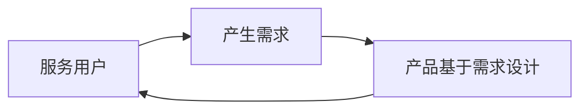

#### 人/群体-用户-需求-产品关系模型
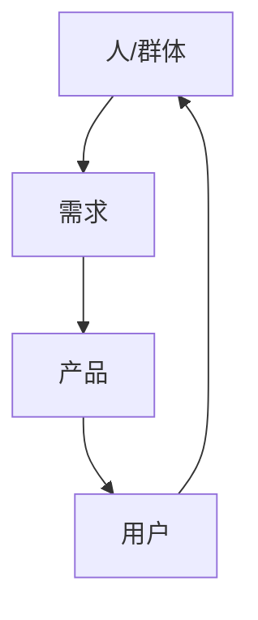

#### 好产品的3个基本要素
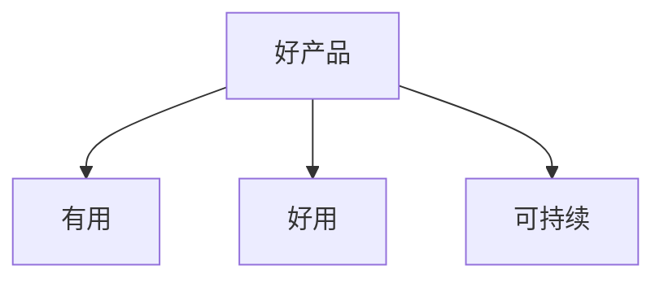

#### 产品价值矩阵
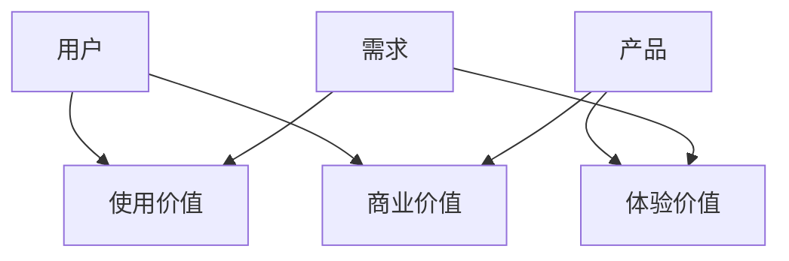

### 经典金句
> “需求决定了产品从哪里来，而用户决定了产品到哪里去。”
> “物美价廉，‘物美’突出了产品的‘好用’和‘有用’，‘价廉’则需要一系列的商业闭环的支撑。”
> “好产品必须具备三大基本要素——有用、好用、可持续，三者缺一不可。”

---

## 第2章：如何撰写产品文档
### 核心论点
问题：如何规范、高效地撰写产品文档？  
观点：采用“定范围→选模板→规范化”三步法，针对BRD、MRD、PRD不同文档采用不同模板和输出形式。

### 关键概念
- 定范围：明确文档标题、目的、阅读对象、创建/更新时间等。
- 选模板：使用标准模板（BRD用PPT，PRD用Word）。
- 规范化：命名规范、表达规范、版本号规范（VX.Y.Z）。
- BRD（商业需求文档）：面向高层，描述商业模式闭环，解决“做什么”。
- MRD（市场需求文档）：面向市场/运营，描述市场格局、用户画像，解决“为谁做”。
- PRD（产品需求文档）：面向研发，描述功能逻辑，解决“怎么做”。

### 逻辑推演
先介绍文档撰写三步骤。然后分别展开BRD、MRD、PRD的定义、作用和具体撰写模板。BRD包含方案背景、方案预测、产品规划、盈利模式、收益与成本、风险与对策。MRD包含市场说明、用户说明、产品说明、竞品说明。PRD包含基本规范、文档概述、产品说明、功能需求、非功能需求、附录。最后强调版本号规范。

### 流程图/模型图
#### 撰写产品文档的基本方法
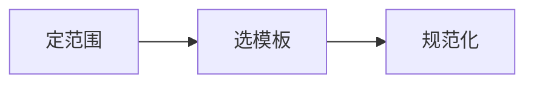

#### 版本号规范
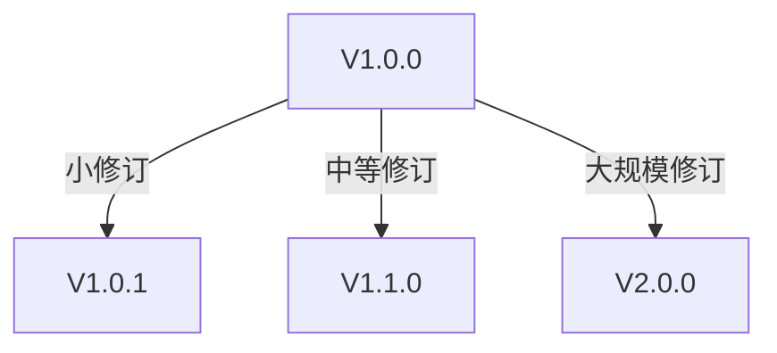

### 经典金句
> “写作本质上是把自己的思考进行文本化表达的过程。”
> “命名规范、表达规范、版本号规范是产品经理专业化的基本要求。”

---

## 第3章：如何画好流程图和时序图
### 核心论点
问题：流程图和时序图在产品工作中的作用及画法？  
观点：流程图将活动逻辑可视化，时序图描述对象间消息交互顺序；掌握基本结构和画法能提升逻辑表达和沟通效率。

### 关键概念
- 流程图 = 流程 + 图：活动逻辑关系的可视化。
- 泳道流程图：区分多个活动主体（泳道）。
- 时序图：描述对象间发送消息的时间顺序，含角色、对象、生命线、控制焦点、消息。
- 三种基本结构：顺序、选择、循环。
- 四种基本画法：选择、并行、合并、汇合。

### 逻辑推演
从UML活动图引出流程图定义，分类（按主体、表现形式、复杂度）。介绍标准符号和画图工具。说明画流程图的好处：思路清晰、避免遗漏、知识传承等。绘制四步骤：调研、梳理呈现、评审确认、发布归档。然后分别以便利店购物为例展示一般流程图和泳道流程图。最后介绍时序图的组成元素、结构和画法，并以微信支付为例。

### 流程图/模型图
#### 流程图三种基本结构
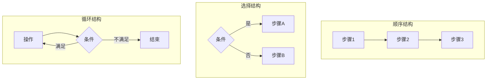

#### 一般流程图示例（便利店购物）
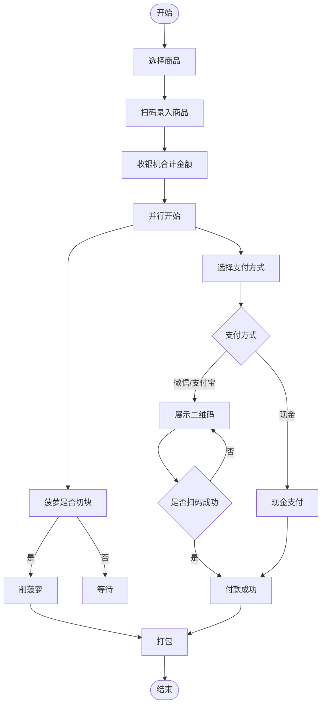

#### 时序图元素
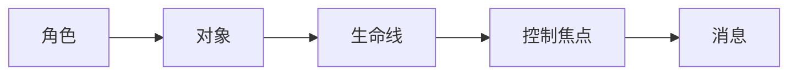

### 经典金句
> “流程图能让产品经理的思路更清晰、逻辑更清楚，有助于程序的逻辑实现并有效解决实际问题。”
> “如果你不能把一件事情用最简洁的语言描述清楚，说明你还没有理解它。”

---

## 第4章：如何画好产品原型图
### 核心论点
问题：如何规范、高效地输出产品原型图？  
观点：建立目录结构规范、交互设计规范、注释规范，并掌握实用技巧和设计经验，可提升原型质量与效率。

### 关键概念
- 原型图：将抽象需求转化为具象产品方案的可视化载体。
- 线框图：低保真，勾勒布局轮廓。
- 视觉稿：高保真静态设计图。
- 常用工具：Axure RP、墨刀、Mockplus、Justinmind等。
- 原型目录结构：项目简介、版本信息、流程图、全局设计规范、快捷入口、原型页面、附录。
- 原型注释规范：需求逻辑、功能逻辑、交互逻辑、视觉逻辑、技术逻辑、补充说明。

### 逻辑推演
先介绍原型图定义及其承上启下作用，对比线框图和视觉稿。列举常见原型工具。然后详细说明原型目录结构的各个模块，强调全局设计规范（临时画布、交互设计自查表）。介绍原型注释规范（控件级别描述）。最后总结实用技巧（母版、元件库、动态面板等）、设计经验（高保真输出时机、多文件版本等）和注意事项。

### 流程图/模型图
#### 原型目录结构范例
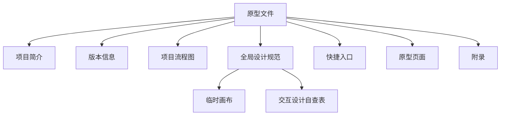

### 经典金句
> “绘制原型图最大的优点在于，可以有效地避免重要元素被忽略，将需求逻辑可视化。”
> “产品经理可以根据个人习惯选择自己擅长的设计工具。”

---

## 第5章：如何画好产品架构图
### 核心论点
问题：产品架构图的类型及画法？  
观点：产品架构图包括业务架构图、功能架构图、信息架构图、混合架构图，绘制步骤为确定对象、拆解架构、挖掘关系、表达输出。

### 关键概念
- 业务架构图：描述产品所涉及的业务逻辑。
- 功能架构图：描述产品功能模块及关系。
- 信息架构图：描述产品信息结构。
- 混合架构图：综合业务、功能、信息、技术、商业模式等。
- 四种元素关系：同级并列、父子包含、辅助支撑、底层支撑。

### 逻辑推演
首先定义产品架构图，强调其抽象程度高。说明画架构图的三点价值：梳理思路、确定边界、作为地基。绘制四步骤：确定对象、拆解架构、挖掘关系、表达输出。然后分别以贷款产品为例画业务架构图，以微信为例画功能架构图，并介绍信息架构图和混合架构图（如CRM系统）。

### 流程图/模型图
#### 贷款产品业务架构图
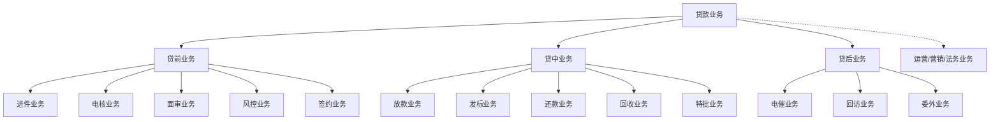

#### 微信功能架构图（简化）
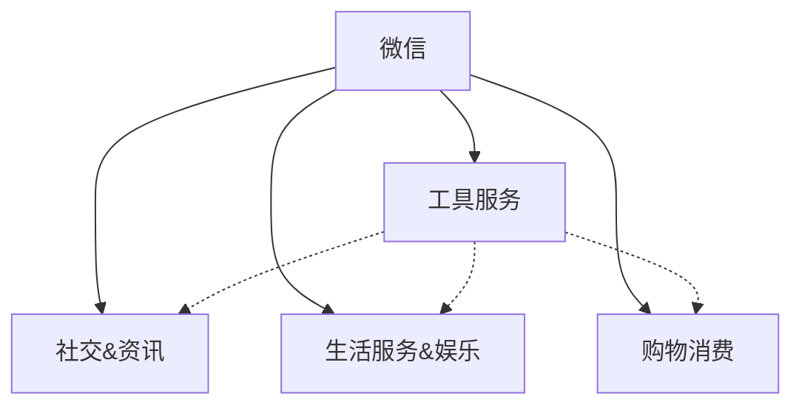

### 经典金句
> “产品架构图的形式最简单，但抽象程度最高，对产品经理抽象能力的要求也是最高的。”
> “如果你不能用简单的图形通过排列组合的方式把一个复杂的产品结构描述清楚，说明你还没有真正理解你要做的产品。”

---

## 第6章：如何进行用户研究与分析
### 核心论点
问题：如何通过问卷调研、用户访谈和用户画像进行用户研究？  
观点：问卷调研需设计合理结构（头部、甄别、主体、背景），遵循六大原则；用户访谈要设计提纲并善用延展技巧；用户画像通过标签化建模还原真实用户特征。

### 关键概念
- 问卷调研结构：头部（介绍语）、甄别（筛选）、主体（核心问题）、背景（统计信息）。
- 封闭式提问 vs 开放式提问。
- 问卷设计六原则：合理性、一般性、逻辑性、明确性、非诱导性、便于整理分析。
- 用户访谈延展：关于原因、流程、细节、比较的延展（五问法）。
- 用户画像：基于数据标签化建模（性别、年龄、地区、偏好等）。

### 逻辑推演
先介绍问卷调研的定义和基本结构，详细说明各部分内容。列举封闭式和开放式提问的优缺点。给出问卷设计六原则和注意事项。然后介绍用户访谈与普通聊天的区别，提出提纲设计和四种延展技巧，并以丰田五问法为例。最后介绍用户画像的构建步骤：定性分析初期画像 → 数据积累 → 标签化建模 → 贴标签 → 输出画像报告。

### 经典金句
> “用户访谈和普通聊天在形式上相似，但在本质上有很大的区别。”
> “连续问五次‘为什么’，才能找到问题的真正原因。”
> “好的用户画像可以帮助企业进行市场洞察、预估市场规模、制定阶段性目标。”

---

## 第7章：如何做好需求管理
### 核心论点
问题：如何挖掘真实需求、评估需求价值与优先级、管理需求全流程？  
观点：用户提出的往往是解决方案，需多问“为什么”挖掘真实需求；需求价值从用户、研发、商业维度评估；优先级综合价值、紧急、难易、上级指示、时间等维度；通过需求池、父子需求拆分、评审会、项目流等规范管理。

### 关键概念
- 挖掘真实需求：引导用户陈述事实、表达感受、说出期望，而非直接接受解决方案（福特与更快的马案例）。
- 需求价值评估：用户维度（刚需/非刚需）、研发维度（投入产出比、成本、风险）、商业维度（用户规模、市场规模、频度、稀缺性）。
- 需求优先级：价值权重、紧急程度、实现难易、上级指示、先后顺序。
- 需求评审会：评审前准备物料、邀请人员；评审中介绍背景、方案、讨论细节、评估排期；评审后输出纪要、修改方案、交付开发。
- 需求池：收集所有需求，通过流出阀筛选流入需求列表。
- 父需求与子需求：最小可独立交付的拆分原则。

### 逻辑推演
先以福特案例说明如何挖掘真实需求。然后从三个维度评估需求价值，指出并非所有真实需求都应满足。接着介绍优先级评估的多个维度。详细说明需求评审会的三个阶段。介绍需求池框架（流入、流出、需求列表）。解释父需求拆分为子需求的好处（独立交付、风险可控、价值最大化）。最后说明需求研发过程中和上线后产品经理的工作（进度跟踪、变更同步、撰写使用说明书、项目复盘、收集反馈等）。

### 流程图/模型图
#### 挖掘用户真实需求的过程
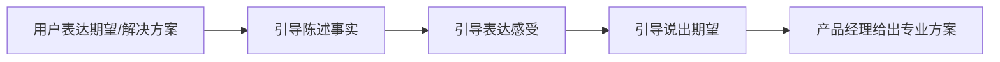

#### 需求价值评估维度
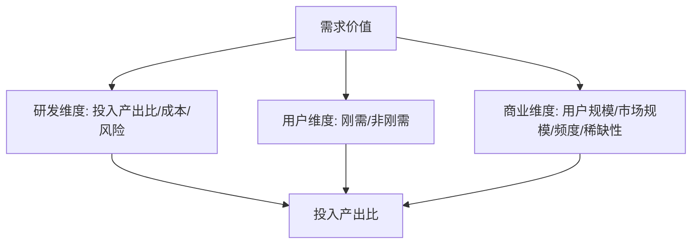

#### 需求优先级评估维度
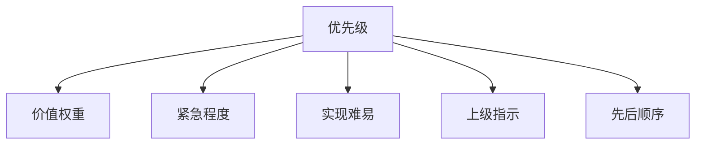

#### 产品需求池基本框架
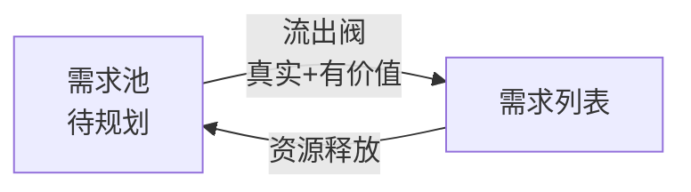

#### 父子需求拆分框架
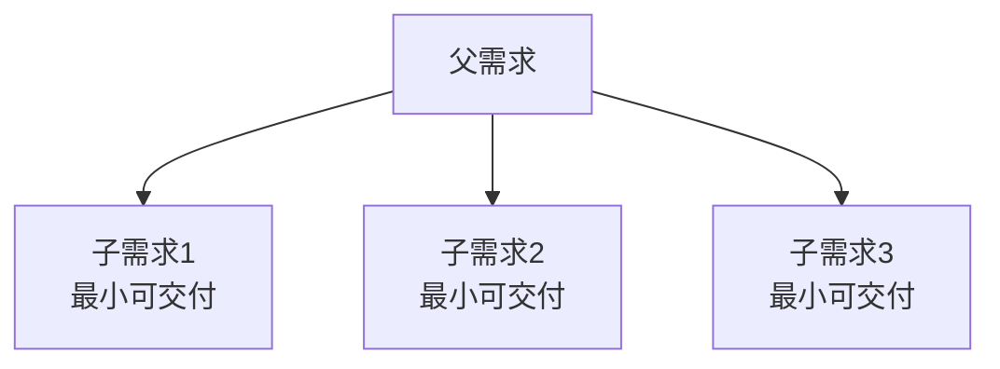

### 经典金句
> “用户的真实需求往往并不会直接表达出来，产品经理要运用有效的方法，不断地引导用户说出自己的真实需求。”
> “并不是用户所有的真实需求都应该满足，有价值的需求才有必要满足。”
> “没有哪个产品一上线就是完美的，产品需要不断地迭代优化才能变得更好。”

---

## 第8章：产品设计、分析与体验
### 核心论点
问题：如何系统地进行产品设计、分析与体验优化？  
观点：构建产品设计模型库（基础系统、公共体系、通用功能），遵循完整性、高内聚低耦合原则，应用交互设计七大定律和尼尔森原则，通过产品分析框架（市场、用户、产品）和用户体验五要素提升设计质量。

### 关键概念
- 产品设计模型库：基础系统（CRM、权限等）、公共体系（账户、会员等）、通用功能（登录注册、分享等）。
- 交互设计自查表：任务流程、框架布局、页面交互、页面元素、组件和控件、特殊场景。
- 完整性：功能结构、信息结构、交互设计完整。
- 高内聚低耦合：模块内部紧密，模块间独立（RBAC模型示例）。
- 交互设计七大定律：菲茨定律、希克定律、7±2法则、接近法则、防错原则、复杂度守恒定律、奥卡姆剃刀原则。
- 尼尔森交互设计原则：状态可见、环境贴切、用户可控、一致性、易用、灵活高效、优美简约、容错、人性化帮助。
- 产品分析框架：市场分析（发展、现状、前景）、用户分析（需求、画像）、产品分析（商业逻辑、业务逻辑、功能逻辑）。
- 用户体验五要素：战略层、范围层、结构层、框架层、表现层。

### 逻辑推演
从需求到产品的桥梁是设计模型库，介绍三类通用方案。然后给出交互设计自查表作为查漏补缺工具。强调完整性原则（功能、信息、交互）。介绍高内聚低耦合并以RBAC模型和商品打折活动设计为例。详细解释交互设计七大定律（每个定律配案例）。接着介绍尼尔森十大原则（每个配案例）。最后说明如何输出产品分析报告（市场、用户、产品）和用户体验五要素框架。

### 流程图/模型图
#### 从需求到产品的桥梁
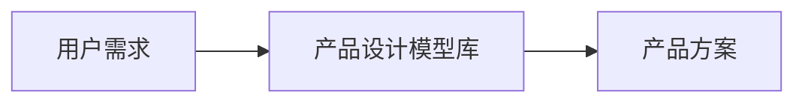

#### RBAC权限模型
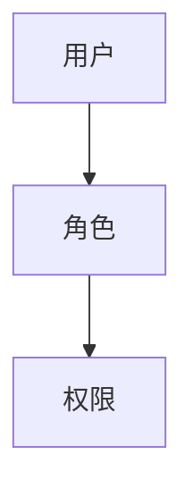

#### 用户体验五要素
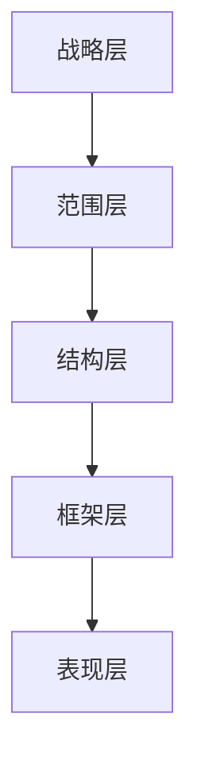

### 经典金句
> “菲茨定律：按钮等控件的可单击区域越大，越容易操作。”
> “希克定律：一个人面临的选择越多，他做决定需要的时间就越长。”
> “7±2法则：人类头脑在最好的状态下能记忆7±2项信息块。”
> “防错原则：大部分的意外并不是人为的操作疏忽引起的，而是产品的设计缺陷导致的。”
> “复杂度守恒定律：每一个过程都有其固有的复杂度，只能将固有的复杂度从一个地方转移到另外一个地方。”
> “奥卡姆剃刀原则：如无必要，勿增实体。”
> “广义的用户体验包含了产品需求本身的合理性。”

---

## 第9章：如何进行数据分析
### 核心论点
问题：数据分析的方法、常用指标、模型及埋点技术？  
观点：数据分析六步法（明确目标、获取数据、处理数据、展现数据、分析数据、输出报告），常用指标（PV、UV、DAU等）和维度（时间、地区、性别等），漏斗模型（AIDA→AIDMA→AISAS→用户行为漏斗），AARRR与RARRA模型，埋点与无埋点技术对比。

### 关键概念
- 数据分析六步：明确目标、获取数据、处理数据、展现数据、分析数据、输出报告。
- 常用指标：PV、UV、VV、IP、DAU、MAU、留存率、打开率、下载量等。
- 常用维度：时间、地区、性别、年龄、职业、渠道、设备、版本等。
- 漏斗模型：AIDA（注意→兴趣→欲望→行动），AIDMA（+记忆），AISAS（+搜索+分享），用户行为漏斗（量化每步转化率）。
- AARRR模型：获取→激活→留存→收益→传播。
- RARRA模型：留存→激活→推荐→收益→获取（强调留存优先）。
- 埋点：基础代码（HTTP交互）和事件代码（特殊交互）。
- 无埋点：全部采集，按需选取，门槛低但采集深度有限。

### 逻辑推演
先定义数据与数据分析分类。详细介绍六步法，强调数据展现的规范性和避免欺骗（数据源、处理、分析、图表拉伸、坐标轴等）。列举常用指标和维度。讲解漏斗模型演变史，重点介绍用户行为漏斗（电商案例）。对比AARRR和RARRA模型，指出二者适用产品生命周期不同阶段。最后介绍埋点与无埋点的原理、优缺点。

### 流程图/模型图
#### 数据分析六步
```mermaid
graph LR
    A[明确目标] --> B[获取数据]
    B --> C[处理数据]
    C --> D[展现数据]
    D --> E[分析数据]
    E --> F[输出报告]
```

#### AARRR模型
```mermaid
graph LR
    A[用户获取] --> B[用户激活]
    B --> C[用户留存]
    C --> D[获得收益]
    D --> E[推荐传播]
    E --> A
```

#### RARRA模型
```mermaid
graph LR
    R1[用户留存] --> R2[用户激活]
    R2 --> R3[用户推荐]
    R3 --> R4[获得收益]
    R4 --> R5[用户拉新]
```

### 经典金句
> “数据分析的核心目标是得出对产品或者业务决策有指导意义的结论。”
> “指标是衡量事物发展程度的单位，维度是事物本身所具有的某种特征或属性。”
> “AARRR模型专注于获客，RARRA模型突出了用户留存的重要性。”

---

## 第10章：如何理解技术
### 核心论点
问题：产品、业务与技术的关系，产品思维与技术思维的差异，产品经理如何学习技术知识并更好地与技术沟通协作？  
观点：产品=业务+技术，双向驱动；产品思维关注需求/用户/体验，技术思维关注实现/效率/成本；产品经理需懂基本技术知识，培养技术思维，并通过“想要→引导”沟通法和技术人员协作。

### 关键概念
- 产品=业务+技术：任何产品都可拆分为业务逻辑和技术实现。
- 产品思维 vs 技术思维：前者关心“为什么做”，后者关心“怎么做”。
- 学习技术途径：阅读技术文档、与技术人员沟通、阅读通俗技术书籍。
- 沟通方法：“想要”阶段用产品语言表达需求，“引导”阶段用技术知识引导技术人员给出方案。
- 原则问题 vs 非原则问题：原则问题靠制度，非原则问题靠协作关系。

### 逻辑推演
从宏观视角说明产品、业务、技术的关系（人/群体→需求→业务→技术→产品）。对比产品思维和技术思维的差异。给出三条学习技术知识的途径（阅读文档、沟通、读书）。详细阐述“想要→引导”的两阶段沟通法，并以页面打开速度为例。最后区分原则问题与非原则问题，强调非原则问题依赖良好协作关系。

### 流程图/模型图
#### 产品、业务、技术关系
```mermaid
graph LR
    People[人/群体] --> Needs[需求]
    Needs --> Biz[业务]
    Biz --> Tech[技术]
    Tech --> Product[产品]
    Product --> People
```

#### 产品思维 vs 技术思维
```mermaid
graph LR
    PM[产品思维] --> Focus1[需求满足/产品设计/用户体验]
    Tech[技术思维] --> Focus2[技术实现/效率/成本]
```

#### 沟通方法：“想要”与“引导”
```mermaid
graph TD
    Start[产品经理表达需求] --> Want[“想要”阶段：产品语言]
    Want -->|达成共识| OK[解决方案]
    Want -->|未达成| Guide[“引导”阶段：技术知识+提问]
    Guide --> TechPro[技术人员给出专业方案]
    TechPro --> OK
```

### 经典金句
> “产品经理要具备技术思维，技术人员要具备产品思维。”
> “产品经理对技术的‘懂’应该是一种‘引导力’，而不是一种‘对抗力’。”
> “大量的协作问题是非原则问题，非原则问题才是产品经理真正需要花时间和精力来解决的问题。”

---

## 第11章：如何进行项目管理
### 核心论点
问题：产品经理为何需要项目管理能力？如何管理项目？  
观点：产品经理常兼任项目经理，需掌握瀑布模型与敏捷模型，设计完整的项目流（从待规划到稳定运行），利用TAPD等工具进行需求规划、迭代管理、进度跟踪、测试与发布，并掌握跨部门协作技巧。

### 关键概念
- 瀑布模型：阶段分明、文档驱动、难以应对需求变化。
- 敏捷模型（Scrum）：拥抱变化、以人为核心、迭代交付。
- 完整需求涉及内容：需求名称、来源、类型、描述、优先级、处理人、开发/测试人员、时间等。
- 项目流状态：待规划、规划中、关闭、挂起、待评审、评审中、待实现、实现中、待测试、测试中、待验收、验收中、待发布、已上线、稳定运行。
- TAPD功能：需求规划、发布计划、迭代计划、任务分配、故事墙、燃尽图、甘特图、测试管理、缺陷跟踪、发布追踪、回顾沉淀。
- 跨部门协作流程：明确目标→传递目标→表达需求→确定方案→落地执行。

### 逻辑推演
先说明产品经理需要项目管理能力的原因（中小公司无专职项目经理）。对比瀑布模型和敏捷模型，指出各自适用场景。然后介绍创建一个完整需求所需的各种字段。详细设计项目流的15个状态及其流转逻辑。介绍TAPD工具的核心功能（需求单、发布计划、迭代、故事墙、燃尽图、甘特图、缺陷等）。最后讨论跨部门协作的流程和常见问题（能力不足、边界模糊、配合不足），以及利益和权力层面的推动技巧。

### 流程图/模型图
#### 瀑布模型
```mermaid
graph LR
    A[需求分析] --> B[方案设计]
    B --> C[实施/编码]
    C --> D[测试/评估]
    D --> E[运营/维护]
```

#### 敏捷模型
```mermaid
graph LR
    A[产品待办列表] --> B[迭代规划]
    B --> C[2-4周迭代]
    C --> D[可交付产品增量]
    D --> A
```

#### 项目流框架
```mermaid
graph TD
    Planning[待规划] -->|开始分析| InPlanning[规划中]
    InPlanning -->|真实且有价值| PendingReview[待评审]
    InPlanning -->|伪需求/无价值| Closed[关闭]
    InPlanning -->|临时搁置| Suspended[挂起]
    PendingReview -->|开始评审| Reviewing[评审中]
    Reviewing -->|评审通过| PendingImpl[待实现]
    Reviewing -->|不通过| Closed
    PendingImpl -->|开始开发| Implementing[实现中]
    Implementing -->|开发完成| PendingTest[待测试]
    PendingTest -->|开始测试| Testing[测试中]
    Testing -->|测试通过| PendingAccept[待验收]
    Testing -->|测试不通过| Implementing
    PendingAccept -->|开始验收| Accepting[验收中]
    Accepting -->|验收通过| PendingRelease[待发布]
    Accepting -->|验收不通过| Testing
    PendingRelease -->|发布| Released[已上线]
    Released -->|稳定观察| Stable[稳定运行]
    Suspended -->|重启| Planning
```

### 经典金句
> “瀑布模型在早期目标和方案明确的大型项目中有优势，敏捷模型更适用于需要不断迭代试错的中小型项目。”
> “规则之内强调的是技术，规则之外强调的是艺术，只有技艺结合，才能让产品研发和项目管理更好地进行。”

---

## 第12章：如何进行行业分析和商业分析
### 核心论点
问题：如何系统地进行行业分析和商业分析？  
观点：行业分析回答“游戏规则”，包含行业发展、规模、市场特征、商业模式、产业链、竞争格局、趋势、融资、评价等九大模块；商业分析回答“如何成为赢家”，使用商业闭环设计策略仪表盘（十大模块、四大闭环）。

### 关键概念
- 行业分析九模块：行业发展（生命周期）、行业规模、市场特征（统一/开放/竞争/有序）、商业模式、产业链分析、竞争格局、发展趋势、融资案例、行业评价。
- 商业闭环设计策略仪表盘：十大模块（用户需求、解决方案、目标用户、传播方式、用户关系、收入类型、合作伙伴、核心竞争力、重要业务、成本类型），四大闭环（方案闭环、价值闭环、资源闭环、财务闭环）。

### 逻辑推演
首先强调行业分析对高级产品经理的重要性。介绍获取行业信息的三种方式（行业报告、意见领袖、垂直媒体）。然后详细展开行业分析九大框架，以第三方支付行业为例说明。接着用三国比喻行业与商业的关系，以Lisa计算机为例说明商业思维的重要性。最后详细介绍商业闭环设计策略仪表盘的十大模块和四大闭环。

### 流程图/模型图
#### 行业分析框架
```mermaid
graph TD
    Industry[行业分析] --> Develop[行业发展]
    Industry --> Scale[行业规模]
    Industry --> Feature[市场特征]
    Industry --> BizModel[商业模式]
    Industry --> Chain[产业链分析]
    Industry --> Comp[竞争格局]
    Industry --> Trend[发展趋势]
    Industry --> Finance[融资案例]
    Industry --> Eval[行业评价]
```

#### 商业闭环设计策略仪表盘
```mermaid
graph TD
    subgraph 十大模块
        A[用户需求] --> B[解决方案]
        B --> C[目标用户]
        C --> D[传播方式]
        D --> E[用户关系]
        E --> F[收入类型]
        F --> G[合作伙伴]
        G --> H[核心竞争力]
        H --> I[重要业务]
        I --> J[成本类型]
    end
    subgraph 四大闭环
        K[方案闭环] --> L[价值闭环]
        L --> M[资源闭环]
        M --> N[财务闭环]
    end
```

### 经典金句
> “行业分析让我们了解游戏规则，商业分析则让我们定位好自己的角色，玩好游戏成为赢家。”
> “别让自己成为一个只会画原型、实现功能的产品经理。”

---

## 第13章：产品设计实践
### 核心论点
问题：账号体系、CRM系统、权限体系、会员体系、支付体系的核心设计思路是什么？  
观点：这些体系都是通用框架，不随行业变化；账号体系核心是UID与多种登录要素组合；CRM体系基于用户-客户-业务关系；权限体系从ACL演进到RBAC及变种；会员体系围绕成长值、等级、权益；支付体系需理解信息流、资金流、支付渠道与方式。

### 关键概念
- 账号体系：UID、用户名、密码、昵称、第三方登录（Openid），注册/登录要素组合（用户名+密码、邮箱+密码、手机号+验证码、第三方登录）。
- 找回密码：手机验证、邮箱验证、人工审核。
- 风控设计：禁止暴力操作、短信限制、IP限制等。
- 账号通行证：单点登录，打通多产品账号。
- CRM系统：运营型、分析型、协作型；核心是用户、客户、业务关系。
- 权限体系：ACL模型（用户直连权限）→ RBAC模型（用户-角色-权限），变种包括用户-组织-角色-权限、用户-组织-角色-角色组-权限。
- 会员体系：准入规则、成长值、会员等级、权益规则、风控规则（RFM模型）。
- 支付体系：信息流、资金流、支付规则；支付渠道（第三方、银联、第四方）；支付方式（网银、认证、快捷、账户、代扣、协议）；支付类型（付款码、JSAPI、Native、App、H5、应用内）；支付媒介（银行卡、余额、零钱、积分、代币）。

### 逻辑推演
分别介绍五大通用体系的设计框架。账号体系从身份证类比出发，说明注册/登录要素的优劣势对比，给出找回密码、风控、通行证整合方案。CRM体系以连锁便利店业务员管理为例，展示从框架到具体架构的设计过程。权限体系从ACL演进到RBAC，并扩展组织、角色组等变种。会员体系以RFM模型为例，说明成长值与等级权益。支付体系则从信息流、资金流切入，详细列举渠道、方式、类型、媒介，并给出对接第三方支付公司的四阶段流程。

### 流程图/模型图
#### 账号体系基础框架
```mermaid
graph TD
    Account[账号体系] --> Elements[要素：身份/用户名/密码/昵称/账号]
    Account --> Activities[活动：注册/登录/找回密码]
```

#### RBAC模型
```mermaid
graph TD
    User[用户] --> Role[角色]
    Role --> Permission[权限]
```

#### 会员体系设计框架
```mermaid
graph TD
    Membership[会员体系] --> Access[准入规则]
    Membership --> Growth[成长值规则]
    Membership --> Level[会员等级]
    Membership --> Rights[权益规则]
    Membership --> Risk[风控规则]
```

#### 支付体系对接流程
```mermaid
graph LR
    A[选择支付公司] --> B[商务对接]
    B --> C[进件开户]
    C --> D[技术对接&测试上线]
```

### 经典金句
> “产品设计就像盖大楼，系统框架的设计过程就是设计大楼的地基和结构的过程。”
> “账号体系让每个用户有了身份标识。”
> “会员体系本质上是一套基于用户运营目的的营销规则。”

---

## 第14章：产品学习方法和职业进阶
### 核心论点
问题：产品经理如何高效学习并实现职业进阶？  
观点：培养多元化设计能力（T字形人才），采用“山”字学习模型（全面基础+方法论+交叉学科），遵循工具学习曲线（不追求精通所有工具），建立产品知识库，培养封装与调用能力，区分常识/技术/艺术三层次，并建立三大方法论（知识学习、能力培养、职业进阶）。

### 关键概念
- T字形人才：一横代表知识广度，一竖代表知识深度。
- “山”字学习模型：底横（全面知识体系）、中竖（方法论）、两侧短竖（交叉学科）。
- 工具学习曲线：快速成长期后进入滞缓期，不必精通所有工具。
- 产品知识库：包含知识模块、模板工具、历史工作资料。
- 封装与调用能力：专业领域封装输出，非专业领域调用现有知识。
- 常识→技术→艺术：50分靠常识，50-90分靠技术，90分以上靠艺术。
- 三大方法论：产品知识学习方法论、产品能力培养方法论、产品职业进阶方法论。

### 逻辑推演
先强调培养多元化产品设计能力（前端、后端、支付、小程序等），提出T字形人才目标。引入“山”字学习模型，分三个阶段进阶。用工具学习曲线说明不必精通所有工具，应有投入产出比意识。建议建立产品知识库（使用印象笔记等）。介绍封装思维（如通用组件）和调用思维（如搜索技能）。区分常识、技术、艺术三层，说明技术可复制、可批量输出。最后要求建立三大基础方法论。

### 流程图/模型图
#### “山”字学习模型
```mermaid
graph TD
    subgraph 交叉学科
        Left[运营/设计/技术]
        Right[心理学/经济学/管理学]
    end
    Center[方法论：学习方法化/技能专业化/能力全面化]
    Base[产品知识体系全面了解]
    Base --> Center
    Center --> Left
    Center --> Right
```

#### 工具学习曲线
```mermaid
graph LR
    Time[学习时间] --> Progress[进步]
    Progress -->|快速增长| Plateau[滞缓期]
```

### 经典金句
> “为学当如群山式，一峰突起众峰环。”
> “任何时候抛开成本谈质量都是不合理的。”
> “封装思维与调用思维有利于产品经理培养专业知识的封装能力和非专业知识的调用能力。”
> “产品做到50分靠常识，从50分做到90分靠技术，从90分做到100分靠艺术。”

---

## 第15章：产品经理的职业成长
### 核心论点
问题：产品经理的进阶路径、各阶段要求及转行/求职/管理瓶颈如何应对？  
观点：进阶路径为产品助理→产品经理→高级产品经理→产品总监；各阶段有明确能力要求；转行需具备能力、心态、方法；求职需系统准备（行业选择、简历、面试、心态）；了解新公司需从行业格局、组织架构、业务架构、规则四方面入手；专业化和职业化是核心；成为组织中的结构洞；管理瓶颈需提前培养产品管理、人事管理、目标管理能力。

### 关键概念
- 产品助理：辅助工作，学习文档、原型、项目跟踪。
- 产品经理：独立完成产品设计、项目管理、商业负责。
- 高级产品经理：垂直深耕，把控宏观项目，具备领域经验。
- 产品总监：产品线管理、团队管理、目标管理、战略管理。
- 转行三条件：能力、心态、方法（内部转岗/社招）。
- 求职指南：选择行业/公司、撰写简历、面试准备、面试话术、心态、录用通知选择。
- 了解新公司四维度：行业格局、组织架构、业务架构、规章制度。
- 专业化+职业化：完整知识、熟练技能、全面能力。
- 结构洞：产品经理天然处于连接业务、技术、设计、运营等的位置，应扩大优势。
- 管理瓶颈：需提前培养产品管理、人事管理、目标管理能力。

### 逻辑推演
先列出产品经理职业成长路径和各阶段招聘要求，逐阶段给出职业建议。然后说明转行做产品经理的三条件（能力、心态、方法）。接着提供详细的求职面试指南（六部分）。介绍快速了解新入职公司的四方面。强调专业化和职业化的三个维度（知识完整、技能熟练、能力全面）。引入结构洞理论，说明产品经理应如何扩大结构洞优势。最后分析从产品经理到产品总监的管理瓶颈，指出管理能力的复杂性，并给出提前培养三大管理能力的建议。

### 流程图/模型图
#### 产品经理成长阶梯
```mermaid
graph TD
    Assistant[产品助理] --> PM[产品经理]
    PM --> Senior[高级产品经理]
    Senior --> Director[产品总监]
```

#### 结构洞
```mermaid
graph TD
    PM[产品经理] --> Biz[业务]
    PM --> Tech[技术]
    PM --> Design[设计]
    PM --> Test[测试]
    PM --> Ops[运营]
    PM --> Finance[财务]
    PM --> Legal[法务]
    PM --> Market[市场]
```

### 经典金句
> “产品经理是CEO的学前班。”
> “所谓门槛，跨过去就是门，跨不过去就是槛。”
> “管理是一种复杂的能力，依靠具体的理论和方法是做不好管理的。”

---

## 第16章：产品之外
### 核心论点
问题：如何在学习与成长中平衡秩序与混乱、克服知识焦虑、甄别优质学习资料、避免成为“油腻”产品经理？  
观点：先规范学习，再自由创造（毕加索画牛启示）；通过底层知识+精学体系+泛学体系克服知识焦虑；从目录、评价、作者甄别好书好课；避免“油腻”特征（失去热爱、不坚持原则等）；优秀产品经理特质：专业职业化、学习力成长力、作品意识目标意识。

### 关键概念
- 秩序与混乱：先驾驭规范，再引入创造性混乱。
- 知识焦虑根源：没有知识安全感。解法：建立知识学习体系（底层知识、精学体系、泛学体系）。
- 底层知识：基石性、普适性、可迁移性（哲学、数学、经济学等）。
- 甄别图书/课程：看目录（完整性、渐进性）、看评价、看作者。
- “油腻”产品经理特征：失去对用户的忠诚、不热爱产品、不坚持原则。
- 优秀产品经理特质：专业化和职业化、学习力和成长力、作品意识和目标意识。

### 逻辑推演
以毕加索画牛和波洛克画作为例，说明“先规范学习，再自由创造”的必然路径。分析知识焦虑的根源，给出构建知识学习体系的三层结构（底层、精学、泛学）。提供甄别优秀图书和课程的三种方法。列举“油腻”产品经理的特征与危害。最后总结优秀产品经理的三大特质，并鼓励在日常工作中保持初心。

### 经典金句
> “在限制中，大师得以施展，能给我们自由的唯有规律。”
> “除非有更好的选择，否则就遵从标准。”
> “知识体系承载的是结构化的知识，而结构化的知识培养的是我们标准化、规范化以及方法论化的工作习惯。”
> “勿忘初心，方得始终。”

---

## 后记
### 核心论点
问题：如何正确看待“人人都是产品经理”这一口号？  
观点：并非人人都是产品经理，成为合格产品经理需要完整的知识体系和专业门槛。本书旨在为入行者提供结构化学习路径，推动产品经理职业的专业化、学术化发展。

### 经典金句
> “并非人人都是产品经理，致依然在需求分析和产品设计中奋力拼搏的产品经理，与君共勉！”
> “知识体系承载的是结构化的知识，而结构化的知识培养的是我们标准化、规范化以及方法论化的工作习惯。”