# 《产品经理认证（NPDP）知识体系指南（第二版）》章节总结

## 书籍信息
- **书名**：产品经理认证（NPDP）知识体系指南（第二版）
- **作者**：美国产品开发与管理协会（PDMA）著；楼政 译；陈劲、王小刚 审校
- **出版**：电子工业出版社，2022年4月第2版
- **PDF状态**：扫描版，文本可识别，部分页码和图表有识别偏移但内容基本完整
- **OCR状态**：可读性良好，少量识别错漏不影响核心信息提取

## 目录说明
- 目录识别情况：完整识别，原书目录涵盖前言、7个主章节、术语表、附录等
- 章节对应依据：按原书页码顺序和目录标题逐章整理
- OCR修复说明：部分图表文字识别有缺漏，已根据上下文补充；无法完全恢复的图表已标注说明

## 全书核心主题
本书是美国产品开发与管理协会（PDMA）为产品经理认证（NPDP）考试编写的官方知识体系指南（第二版）。全书系统阐述了产品创新与产品管理的核心知识领域，共分为七个主题：**战略、组合管理、产品创新流程、产品设计与开发工具、产品创新中的市场调研、文化团队与领导力、产品创新管理**。书中强调，成功的产品创新需要“做正确的事”（选择正确的产品）和“正确地做事”（运用正确的流程、工具和方法），并通过宏观视角和项目视角的框架整合人员、流程、战略和绩效度量。本书适用于各类组织（商业、私营、非营利）的产品和服务创新活动。

---

## 前言与导论

### 1. 核心论点
- **问题**：产品创新的本质是什么？本书的结构和用途是什么？
- **观点**：创新是将创意转化为价值；产品创新包括从战略、创意到商业化的全过程。本书为NPDP认证提供标准教材，涵盖七个主题，并强调可持续性、设计思维、敏捷方法等新增内容。

### 2. 关键概念
- **产品创新**：创造产品或服务并将其商业化，包括全新产品或改进现有产品。
- **宏观视角**：成功的产品创新 = 选择正确的产品（做正确的事） + 运用正确的流程/工具/方法（正确地做事）。
- **项目视角**：始于问题/机遇 → 识别目标市场 → 定义产品层次（核心利益、有形特性、增强特性） → 识别相关方 → 运用系统化流程 → 同步制定营销策略。
- **NPDP认证**：需满足学历和经验条件（本科+4年经验/2年产品创新经验；或大专+8年经验/5年产品创新经验），完成40小时培训，通过200题考试（正确率≥75%）。

### 3. 逻辑推演
前言首先定义了“产品创新”的广义概念，并说明第2版相对于第1版的更新内容（调整章节顺序、融入可持续性、增加设计思维和混合流程、更新市场调研工具等）。然后从宏观视角（图0.1）和项目视角（图0.2）展示产品创新框架。接着说明产品创新在组织中的重要性（引用惠普、乔布斯、贝佐斯等观点）。最后介绍PDMA协会和NPDP认证的价值、考试内容分布及本书结构。

### 4. 经典金句/数据
> “创新就是把创意转化为价值。”
> “成功的产品创新是选择正确的产品（做正确的事），并运用正确的流程、方法和工具来开发产品（正确地做事）。”
> “在困难时期投资开发新产品和增加产品种类，既是难事也是要事。”——比尔·休利特、戴维·帕卡德
> NPDP考试试题分布：战略（20题，10%）、组合管理（20题，10%）、产品创新流程（30题，15%）、产品设计与开发工具（30题，15%）、市场调研（30题，15%）、文化团队与领导力（20题，10%）、产品创新管理（50题，25%）。

---

## 第1章：战略

### 核心论点
- **问题**：如何为产品创新和管理设定方向与目标？
- **观点**：战略是组织生存和发展的核心。创新战略为产品创新提供方向和框架，必须与公司战略、经营战略及各职能战略（技术、营销、平台、知识产权、能力等）保持一致。

### 关键概念
- **战略定义**：实现未来理想的方法或计划；波特认为战略是“定义并体现组织的独特定位，说明如何通过整合资源、技能与能力以获得竞争优势”。
- **战略层级**：公司战略 → 经营战略 → 创新战略 → 职能战略（技术、营销、制造等）。
- **组织身份/愿景/使命/价值观**：愿景是组织最期望的未来状态；使命是组织纲领和信念；价值观是坚守的精神准则。
- **创新战略框架**：波特竞争战略（成本领先、差异化、细分市场）；迈尔斯和斯诺（探索者、分析者、防御者、回应者）；延续式 vs 颠覆式创新；皮萨诺创新景观图（常规型、颠覆型、激进型、架构型）。
- **支持战略**：产品平台战略、技术战略（含技术S曲线）、知识产权战略（被动→主动→战略→优化）、营销战略（4P、产品三个层次、波士顿矩阵）、能力战略（核心竞争力、资源、能力盘点）、数字化战略（数字化转型、物联网、敏捷门径混合流程）。
- **开放式创新**：通过联盟、合作主动从外部寻求知识，分为人站式和出站式。
- **可持续创新**：三重底线（利润、人类、地球）；可持续性成熟度模型（初始→改进→成功→领先）；循环经济原则。

### 逻辑推演
本章从战略的基本定义出发，说明战略在产品创新中的重要性（引用PDMA 2012年研究：78%的最佳公司制定了新产品战略）。然后阐述组织方向（愿景、使命、价值观）。接着区分经营战略与公司战略，并说明制定战略前的分析工具（SWOT、PESTLE、德尔菲、商业模式画布）。重点介绍创新战略及其与经营战略的整合，对比多种创新战略框架。最后详细展开创新支持战略（平台、技术、知识产权、营销、能力、数字化），以及开放式创新和可持续创新。

### 流程图

#### 战略层级图 (基于图1.1/1.2)

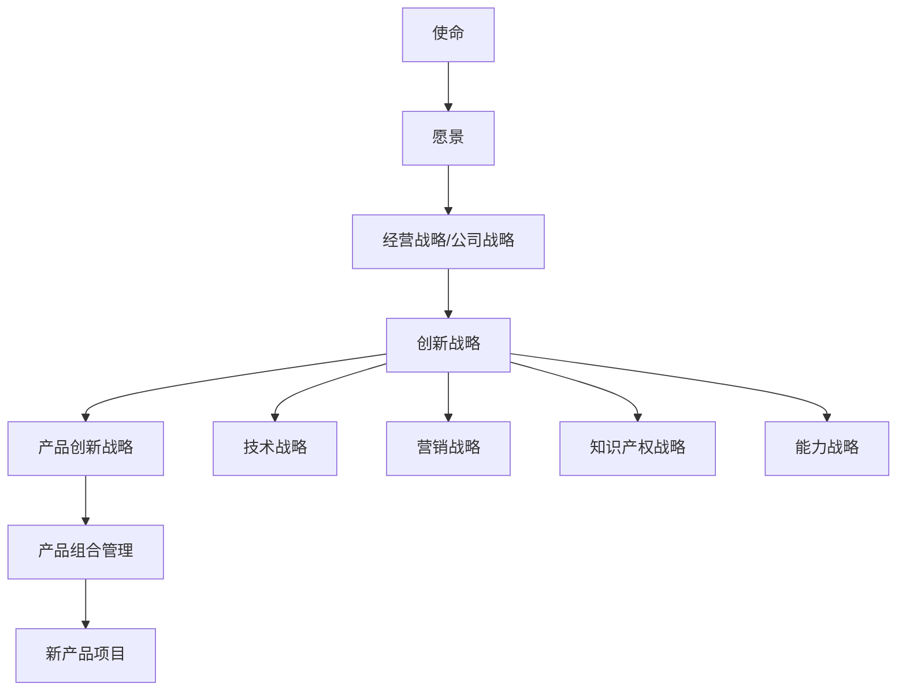

#### 创新景观图 (基于图1.12)

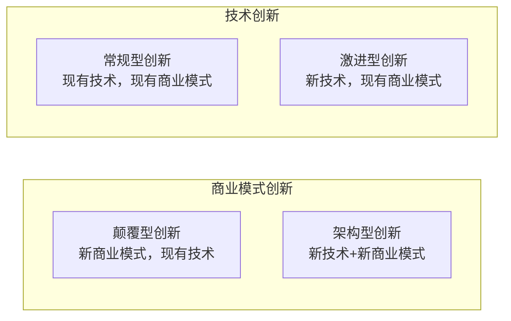

### 经典金句/数据
> “战略就是做到与众不同。”——波特
> “78%的‘最佳公司’制定了新产品战略，并用战略指导和整合公司所有产品创新项目。”（Markham和Lee，2013年）
> “技术创新并不能确保商业成功，还要进行商业模式创新。”——Treece
> “在艰难时期，创新战略是进行产品创新和实现持续增长的必备工具。”——库珀和艾杰特
> 波士顿矩阵：明星产品（高增长/高份额）、问题产品（高增长/低份额）、现金牛产品（低增长/高份额）、瘦狗产品（低增长/低份额）。

---

## 第2章：组合管理

### 核心论点
- **问题**：如何选择和平衡产品创新项目，使其与战略和资源保持一致？
- **观点**：组合管理是实现“做正确的项目”的核心活动。通过价值最大化、项目平衡、战略一致、管道平衡、盈利充分五个目标，确保产品组合与经营战略及创新战略紧密链接。

### 关键概念
- **产品组合**：组织正在投资并进行战略权衡的一组项目或产品。
- **组合管理五个目标**（库珀等，2015年）：价值最大、项目平衡、战略一致、管道平衡、盈利充分。
- **项目类型**：突破型（高风险/新技术）、平台型（共用架构）、衍生型（由现有产品衍生）、支持型（增量改进，低风险）。
- **战略连接方法**：自上而下法（战略桶）、自下而上法（从项目清单筛选）、二者结合法。
- **评估方法**：定性（通过/失败法、评分法、战略一致性、技术可行性等）；定量（净现值NPV、内部收益率IRR、投资回收期、投资回报率ROI）。
- **平衡组合工具**：气泡图（风险-回报、市场风险-技术风险、市场新颖度-产品新颖度）。
- **资源配置**：基于项目资源需求或基于新经营目标的方法；资源信息收集流程；资源供需矩阵。
- **组合绩效度量**：确定性水平、战略价值、财务价值等趋势分析。

### 逻辑推演
本章首先定义产品组合与组合管理，并明确组合管理的五个目标。然后阐述如何将组合与战略连接（三种方法：自上而下、自下而上、结合）。接着详细介绍新产品机会的评估与选择，包括定性方法（通过/失败、评分法）和定量方法（财务分析指标）。再讨论如何平衡组合（使用气泡图等可视化工具）。资源配置部分强调了资源规划和管理的挑战与解决方案。最后介绍组合管理系统的应用准则（意外结果、变更管理、评估标准重叠、评分规则、更新周期等）及组合绩效度量指标。

### 流程图

#### 组合管理流程 (基于图2.1)

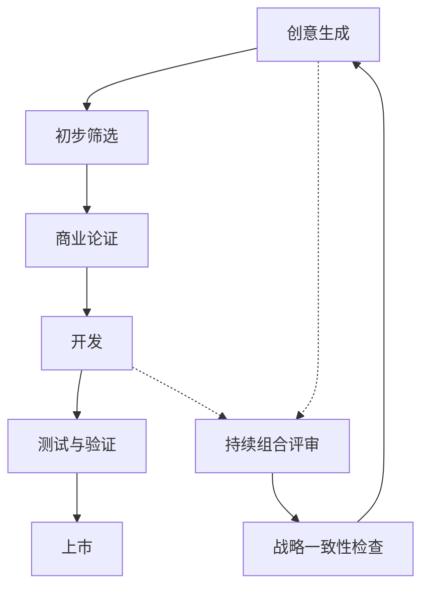

#### 气泡图示例 (基于图2.7/2.8)

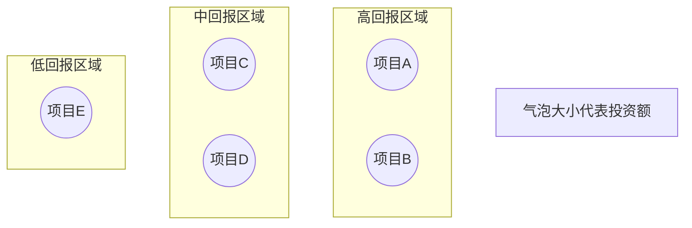

### 经典金句/数据
> “企业可以通过两种途径实现新产品成功：做正确的项目和正确地做项目。组合管理就是做正确的项目。”——Belliveau等，2002年
> “没有组合管理方法就没有选择项目的战略依据，所选项目也就没有战略方向。”——库珀等，2001年
> 2012年PDMA研究显示：最佳公司使用组合管理技术的比例明显高于其他公司。
> 产品新颖度与市场新颖度平衡示例：现有产品改进30%，产品线延伸15%，降低成本25%，新生产线10%，重新定位15%，世界级新产品5%。

---

## 第3章：产品创新流程

### 核心论点
- **问题**：组织应采用何种系统化流程来开发新产品或改进现有产品？
- **观点**：没有一种流程适用于所有组织。需要根据具体情境选择或组合使用门径流程、集成产品开发、精益方法、敏捷方法、系统工程、设计思维或混合流程。流程的核心是管理风险与回报。

### 关键概念
- **产品创新流程定义**：一系列活动、工具和技术，从战略制定到产品交付。
- **风险与回报过程**：随着不确定性降低逐渐增加投资（“如果不确定性高，就少下赌注”）。
- **模糊前端（FFE）**：产品创新早期阶段，概念不清晰，成本低但决策关键。
- **产品创新章程（PIC）**：关键战略文件，包含背景、聚焦领域、总体目标、特别准则、可持续性。
- **主要流程模型**：
  - 门径流程（Stage-Gate）：阶段（发现→筛选→商业论证→开发→测试→上市）+ 关口决策。
  - 集成产品开发（IPD）/并行工程：跨职能并行设计，考虑全生命周期。
  - 精益方法：消除浪费（Muda），以丰田生产系统为基础，13项原则。
  - 敏捷方法：迭代、冲刺、Scrum、产品待办列表、产品负责人、敏捷教练。
  - 系统工程：系统思维，从一般到具体分析问题。
  - 设计思维：以人为本，非线性迭代（移情→定义→创建→评估）。
  - 精益创业：开发-测量-学习循环、商业模式画布、最小可行产品（MVP）、转型。

### 逻辑推演
本章首先说明产品创新是风险与回报的博弈，强调管理不确定性和成本随阶段上升。然后介绍产品创新章程的构成。接着逐一详细讲解七种主要流程模型，包括每种模型的起源、核心步骤、优缺点及适用情境。之后比较敏捷与精益、敏捷与门径、集成产品开发与其他流程的关系，指出它们互补而非排斥。最后讨论产品创新流程的治理与控制（项目集治理框架），强调战略一致性、度量指标和持续改进。

### 流程图

#### 门径流程基本框架 (基于图3.4)

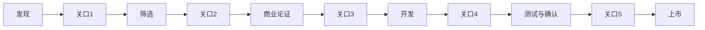

#### 敏捷Scrum流程 (基于图3.10/3.11)

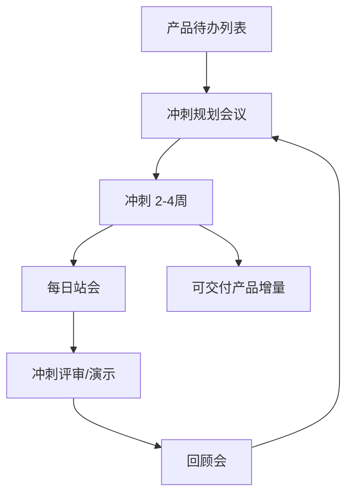

#### 开发-测量-学习循环 (基于图3.13)

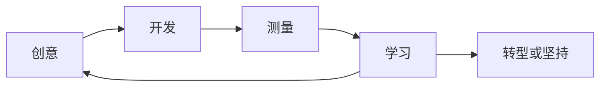

### 经典金句/数据
> “最佳公司的新产品成功率为82%，其他公司为59%。”（2012年PDMA研究）
> “敏捷方法和门径流程不是互相取代的关系。相反，敏捷方法是一种有效的微观规划工具，可以用于门径流程中以加快某些阶段。”——库珀，2015年
> 精益创业“转型”包括10种方式：放大式转型、缩小式转型、客户细分市场转型、客户需求转型、平台转型、商业架构转型、价值获取转型、增长引擎转型、渠道转型、技术转型。

---

## 第4章：产品设计与开发工具

### 核心论点
- **问题**：在产品从创意到制造再到市场化的各阶段，有哪些有效的设计和开发工具？
- **观点**：使用适当的工具是产品创新成功的关键。创意生成、概念设计、实体化设计、详细设计、制造装配等各阶段都有特定工具，应用这些工具可以减少不确定性，确保满足客户需求和技术规格。

### 关键概念
- **设计流程**：从创意到制造，考虑消费者需求、外观、功能、材料、成本、竞争、可制造性、环境影响。
- **创意生成工具**：SCAMPER法、头脑风暴、思维导图、故事板、头脑书写法、六顶思考帽、德尔菲技术、人种学方法、生命中的一天、移情分析、用户画像、用户体验地图。
- **概念设计工具**：概念工程、卡诺模型（基本需求/期望需求/兴奋需求；魅力/期望/必备/无差异属性）、形态分析、概念场景、TRIZ（发明问题解决理论，40个发明原理）。
- **实体化设计工具**：联合分析（补偿模型/非补偿模型）、功能分析（基本功能/次要功能）、FAST技术图（如何-为什么逻辑）、逆向工程。
- **详细设计与规格工具**：质量功能展开（QFD/质量屋）、稳健设计（田口方法、信噪比）、情感化设计（感性工学、情感分析、神经网络、微软反应卡）。
- **制造与装配工具**：原型法（纸质、功能、可体验、阿尔法、贝塔、试生产、虚拟、快速原型/3D打印）、六西格玛设计（DFSS/DMAIC/IDOV）、可持续性设计（三重底线、产品可持续性指数、生命周期评估LCA、环境质量功能展开QFDE、生命周期成本LCC）。

### 逻辑推演
本章按产品设计的时间顺序展开：从创意生成开始，介绍多种激发创意的思维技术；然后进入概念设计阶段，说明如何将模糊创意转化为清晰概念（概念工程、卡诺模型、TRIZ等）；接着是实体化设计，聚焦于将概念转化为可制造的方案（联合分析、功能分析、FAST、逆向工程）；再进入详细设计与规格阶段，介绍质量功能展开和田口方法等确保设计质量；最后是制造与装配阶段，涵盖原型法、六西格玛设计和可持续性设计工具。每个工具都说明了其适用情境、基本步骤和优缺点。

### 流程图

#### 质量屋结构 (基于图4.8)

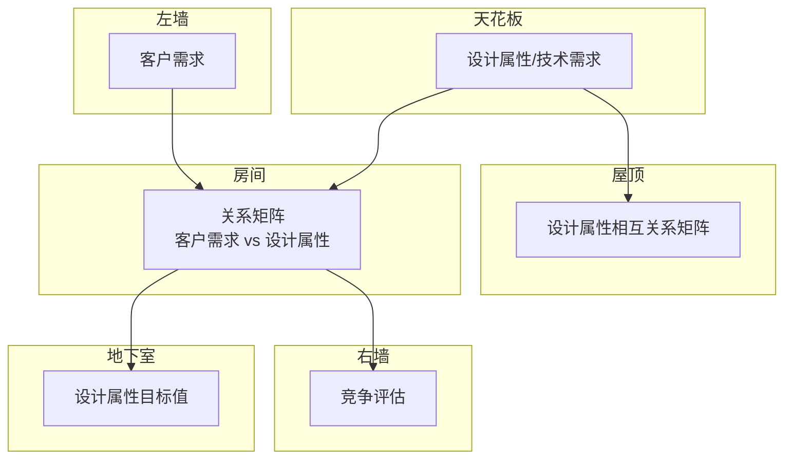

#### 生命周期评估流程 (基于图4.19)

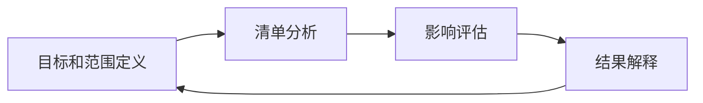

### 经典金句/数据
> “2012年PDMA比较绩效评价研究表明，在使用研发与设计工具方面，最佳公司比其他公司高出30%～50%。”（Markham & Lee, 2013年）
> 卡诺模型：魅力属性（A）——有则满意，无则无不满意；期望属性（O）——越多越满意；必备属性（M）——必须有，无则不满意；无差异属性（I）——有无均可。
> TRIZ 40个发明原理示例：分割、局部质量、多用性、嵌套、空间维度变化等。

---

## 第5章：产品创新中的市场调研

### 核心论点
- **问题**：如何为战略制定、组合管理和产品创新决策提供可靠的市场数据和信息？
- **观点**：市场调研是在整个产品创新生命周期中减少不确定性的关键。需要根据决策风险和成本选择适当的方法（定性 vs 定量；一级 vs 二级），并在不同阶段使用不同的调研工具。

### 关键概念
- **客户之声（VOC）**：通过结构化深度访谈提炼客户需求。
- **市场调研六步骤**：定义问题 → 定义准确度 → 收集数据 → 分析与解读 → 得出结论 → 实施。
- **一级 vs 二级市场调研**：一级为专门收集的一手信息（定性/定量）；二级基于已有数据（成本低但可能过时）。
- **定性方法**：焦点小组（8-12人）、深度访谈、人种学方法（家外/家中调研）、客户现场访问（尤其B2B）、社交媒体/社交倾听。
- **定量方法**：问卷调查、消费者测评组（训练/未训练）、概念测试与分类、感官检验（三点检验、快感检验）、眼动追踪、生物特征反馈（fMRI、脑电图、心电图、面部编码）、大数据（3V：大量、高速、多样）、众包。
- **多变量方法**：因子分析、多维尺度分析、联合分析、A/B测试、多元回归、TURF分析。
- **产品使用测试**：阿尔法测试（内部）、贝塔测试（外部用户）、伽马测试（最终发布前）、虚拟现实/增强现实测试。
- **试销与市场测试**：销售波调研、模拟试销、受控试销。

### 逻辑推演
本章首先定义市场调研在产品创新中的价值（提供信息、减少不确定性）。然后区分一级和二级调研，以及定性与定量的区别，并说明样本量和抽样方法的重要性。接着按顺序详细介绍各种定性方法（焦点小组、深度访谈、人种学、客户现场访问、社交媒体）和定量方法（问卷调查、消费者测评组、概念测试、感官检验、眼动追踪、生物反馈、大数据、众包）。再介绍多变量研究方法及其在产品设计中的应用。最后总结产品使用测试、试销与市场测试，并给出一个综合表格：不同产品创新阶段应使用的市场调研方法。

### 流程图

#### 市场调研在产品创新各阶段的应用 (基于图5.3)

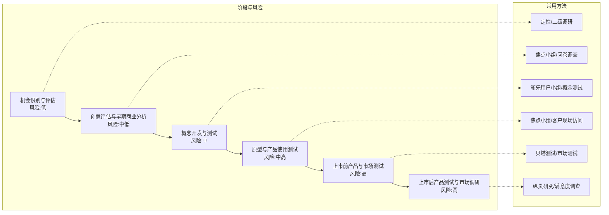

### 经典金句/数据
> “定性市场调研用于了解消费者购买产品的原因，而定量市场调研则用于了解购买产品的人数。”
> 麦当劳通过社交倾听分析推出全天早餐菜单；Brita Stream根据千禧一代抱怨设计新产品。
> 大数据分析市场2027年预计达1030亿美元（复合年增长率11%）。
> 乐高众包平台：超过1万支持者的创意提交给评审委员会，创作者获得1%版税。

---

## 第6章：文化、团队与领导力

### 核心论点
- **问题**：如何创建和维护支持产品创新的环境、团队结构和领导力？
- **观点**：战略、流程和工具固然重要，但归根结底“人”才是成功的关键。创新文化、高绩效团队、合适的团队结构（职能型、轻量型、重量型、自治型）以及高情商领导力是产品创新成功的基石。

### 关键概念
- **文化与氛围**：文化是共同信念和价值观的集合；氛围是特定工作环境的局部特征。成功创新文化的要素包括清晰战略、允许失败、认可奖励、多元化、建设性冲突等。
- **管理职责**：战略层面（高级管理层制定愿景/使命）、流程层面（流程倡导者、流程负责人、流程经理、项目经理）、产品管理层面（产品经理）。
- **团队结构**（Wheelwright & Clark, 1992）：职能型（松散协调，适合低风险改进）、轻量型（有项目经理但无正式权限）、重量型（全职项目经理，跨职能核心团队）、自治型（独立团队，颠覆性创新）。
- **团队发展**：塔克曼五阶段（形成、震荡、规范、成熟、解散）；工作风格评估（DISC：支配、影响、稳健、谨慎）；创新Z模型（开创者→推进者→规划者→执行者）；托马斯冲突模型（回避、包容、折中、竞争、合作）。
- **领导力**：情商（自我认知、自我调节、激励、移情、社交技能）；服务型领导。
- **虚拟团队**：虚拟团队模式（启动与组建、沟通、会议、知识管理、领导力五个要素，十六个实践活动）。
- **可持续性与团队**：五大最佳实践（利用可持续性推动创新、高级管理层承诺、纳入现有流程、可测量结果负责、投资能力）。
- **度量指标**：创新激励（长期合同、股票期权、容忍失败）；平衡计分卡（学习与成长维度）；创新健康状况评估。

### 逻辑推演
本章首先强调文化和氛围对创新的重要性，引用PDMA研究说明只有5%的员工有较高创新积极性。然后详细阐述各级管理者的职责（战略、流程、产品）。接着介绍四种团队结构及其适用情境，比较优缺点。再讨论如何打造高绩效团队（塔克曼阶段、DISC工作风格、Z模型生命周期、冲突管理）。领导力部分聚焦情商和沟通。虚拟团队部分给出完整的五个要素和十六个实践活动。最后将可持续性、度量指标与团队领导力结合。

### 流程图

#### 高绩效团队框架 (基于图6.7)

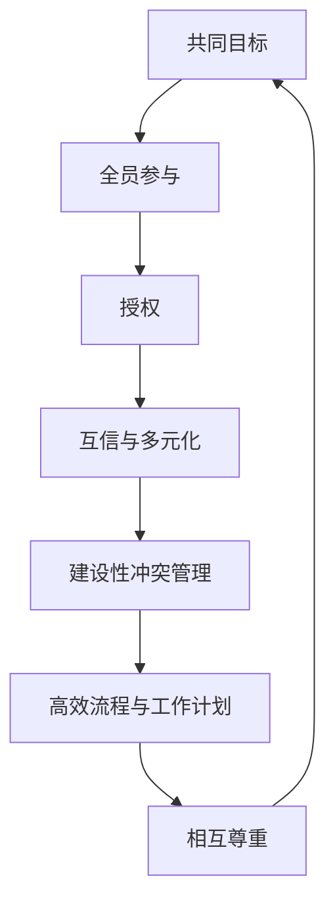

#### 托马斯冲突模型 (基于图6.9)

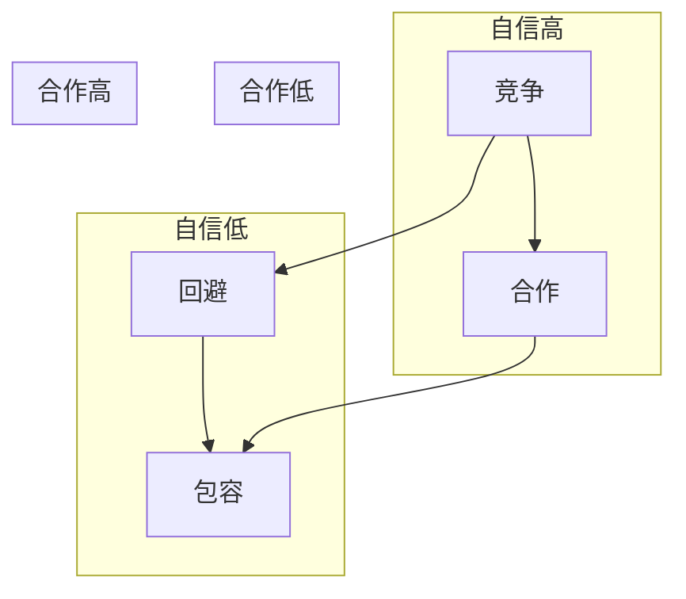

### 经典金句/数据
> “只有5%的受访者有较高的创新积极性，75%以上的受访者反映他们的创意没有得到很好评估和分析。”（Denning, 2015年）
> “优秀的领导者情商都很高。”——Goleman, 1988年
> 托马斯模型五种冲突管理方法：回避、包容、折中、竞争、合作。
> 虚拟团队模式包括16个实践活动（招聘合适的人、个人领导力、团队形成、共同目标、使用电子邮件、语言习俗、鼓励多元化、会议形式、严格计划、质量标准、系统工程、协作工具、经验教训、任务导向、现场访问、80/20倾听）。

---

## 第7章：产品创新管理

### 核心论点
- **问题**：如何在整个产品生命周期中有效管理产品创新并实现收益最大化？
- **观点**：产品创新管理分为三个部分：产品创新的作用与成功因素；产品生命周期各阶段的创新战略（引入、成长、成熟、衰退）及跨越“鸿沟”；关键管理工具（可行性分析、财务分析、项目管理、风险管理、度量指标与持续改进）。

### 关键概念
- **关键成功因素**（项目层面：独特卓越的产品、市场导向、开发前准备、明确产品定义、上市规划；人员与环境：团队组织、文化氛围、高层支持；战略：创新战略、核心能力、有吸引力的市场、组合管理、资源）。
- **产品管理 vs 项目管理**：项目管理聚焦开发（进度、预算），产品管理聚焦市场成功（战略、愿景、利润、增长）。
- **产品生命周期（PLC）**：开发、引入、成长、成熟、衰退。各阶段营销组合（产品、价格、分销、促销）策略不同。
- **鸿沟（Chasm）**：从引入到成长阶段的断层，需要满足可衡量优势、一致性、简单性、易试性、可见结果才能跨越。
- **走向市场战略**：新式迭代流程（出售什么、出售给谁、推向目标市场、促销地点）。抢滩战略。
- **路线图**：产品路线图、技术路线图、平台路线图。
- **可行性分析要素**：市场潜力、财务潜力、技术能力、营销能力、制造能力、知识产权、法规影响、投资需求。
- **需求预测**：巴斯模型（创新系数p、模仿系数q）、ATAR模型（知晓-试用-购买-复购）、购买意向法。
- **财务分析**：固定成本、可变成本、资本支出；净现值（NPV）、内部收益率（IRR）、投资回收期、折现系数。
- **项目管理**：三重约束（范围、进度、成本）；关键路径、赶工、快速跟进。
- **风险管理**：风险识别、定性/定量分析、应对（规避、转移、减轻、接受）；决策树。
- **度量指标**：平衡计分卡（财务、客户、内部流程、学习与成长）；活力指数（新产品销售额占比）；对标与持续改进；附录7A评估问卷。

### 逻辑推演
本章分为三部分。第一部分介绍产品创新管理的作用，对比最佳公司与其他公司的成功因素，区分产品经理与项目经理。第二部分聚焦产品生命周期，详细描述各阶段特点及相应的营销策略，重点讲解“跨越鸿沟”和新式“走向市场”八步法（出售什么→价值主张→整体解决方案→出售给谁→准确定位目标市场→抢滩战略→推向目标市场→渠道战略→促销→定位声明）。第三部分介绍关键管理工具：可行性分析、需求/销售预测（巴斯、ATAR）、财务分析（NPV/IRR/回收期）、项目管理（三重约束、关键路径）、风险管理（决策树）、度量指标与平衡计分卡，最后提供自我评估问卷。

### 流程图

#### 产品生命周期阶段 (基于图7.4/7.6)

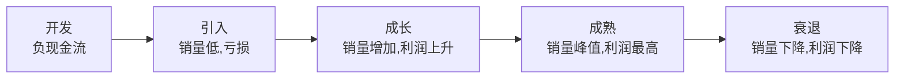

#### 跨越鸿沟 (基于图7.9)

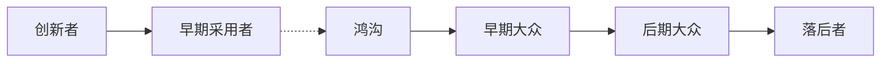

#### 新式走向市场战略四象限 (基于图7.11)

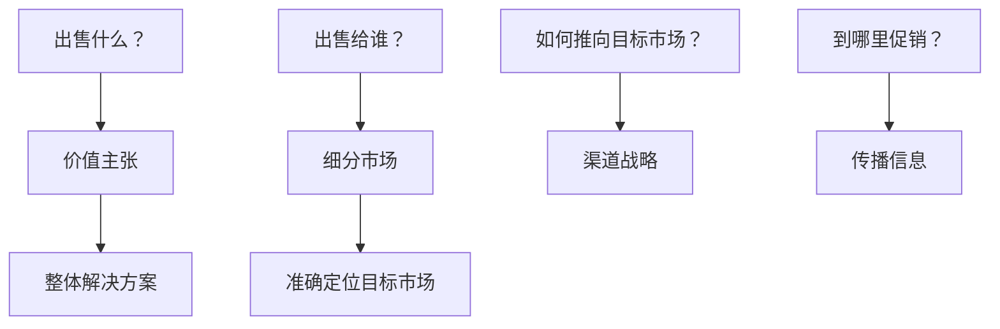

### 经典金句/数据
> “产品经理的工作是发现有价值、有用并且可行的产品。”——Marty Cagan
> 产品上市失败率在70%～90%。（Schneider和Hall, 2011年）
> Glassdoor 2019年美国最佳工作排行榜，产品管理名列第五。
> ATAR模型示例：300万购买单位 × 40%知晓率 × 20%试用率 × 40%购买率 × 50%复购率 × 1.5次/年 = 72,000件销量。
> 平衡计分卡四个维度：财务、客户、内部流程、学习与成长。

---

## 附录与术语表

### 附录7A：《组织产品创新管理实践与流程评估问卷》
- **内容**：五部分自我评估问卷（开展正确的产品创新、正确地开展产品创新、文化与氛围组织、度量指标），每部分多项选择题，按1-4分打分，总分250分。用于识别优势、劣势和改进机会。

### 附录7B：产品创新方法在不同类型产品中的应用
- **表格对比**：快速消费品、耐用消费品、消费电子产品、软件、医药五个领域在战略规划、组合管理、产品创新流程、文化与团队、设计工具、市场调研、产品创新管理等方面的差异。

### 术语表
- **内容**：按英文排序（A-Z）和中文排序两部分，收录书中关键术语的定义，如敏捷产品创新、门径流程、净现值、卡诺模型、质量功能展开、设计思维、开放式创新、三重底线等。

---

> 说明：本总结基于PDF可识别文本整理。部分图表（如气泡图原图颜色、部分复杂矩阵）无法完全重现，已用Mermaid或结构化列表呈现核心逻辑。原书页码因扫描偏移未完整保留，但内容忠实于原文。