# 《产品结构设计提升篇：真实案例设计过程全解析》章节总结

## 书籍信息
- **书名**：产品结构设计提升篇：真实案例设计过程全解析
- **作者**：黎恢来
- **PDF状态**：完整，基于电子版文件（mobi格式转换）识别
- **OCR状态**：文本清晰，结构完整

## 目录说明
- **目录识别情况**：完整识别全书目录，共7个主章节
- **章节对应依据**：严格按原书目录顺序
- **内容说明**：全书通过7个真实产品案例，系统讲解产品结构设计的完整流程

## 全书核心主题

本书是作者黎恢来继《产品结构设计实例教程》后的进阶之作。作者拥有近20年产品结构设计及项目管理经验，本书精选其工作中7款真实、成功上市的产品案例，涵盖TWS蓝牙耳机、移动电源、智能笔、旅行充电器、数据线、私人云盘、三防产品等不同行业。每章按统一的结构展开：从产品概述、ID效果图分析，到拆件分析、模具初步分析，再到建模要点、结构设计详解，最后是功能检查、问题总结和知识点归纳。本书强调“自顶向下”的设计理念和实战经验，旨在帮助有一定基础的结构设计工程师提升复杂产品的设计能力。

---

## 写在前面的话——如何学习本书内容

### 核心论点

本章解决“如何高效学习本书内容”的问题。作者认为：有基础的读者应先独立分析ID效果图、自主构思设计方案，再对照书中讲解进行对比总结，这样才能最大化学习效果。

### 关键概念/事件

- **自顶向下设计理念**：先做骨架（控制整体尺寸和外形），再拆分零件，便于后期修改
- **实战学习法**：根据ID效果图独立思考拆件、模具、结构设计思路，再对照本书
- **分层学习策略**：初学者需先学习作者前作《产品结构设计实例教程》打下基础，再学习本书

### 逻辑推演/叙事脉络

作者回顾了2013年出版前作后的读者反馈，说明本书的写作缘起和七年积累过程。强调本书案例的“真实性”和“挑战性”，并给出两类读者的学习方法：初学者需两步走（先基础后提升），有基础者应“先思考后对照”。最后提供与作者交流的微信和邮箱渠道。

### 经典金句/数据

> “授人以鱼不如授渔”——本书不仅告诉读者如何进行产品结构设计，还告诉读者为什么要这样设计，讲解有过程，更有方法与技巧。

> “书是有价的，但技术是无价的，这些经验不能用金钱来衡量。”

> 作者从业近20年，设计产品数百款，申请专利数百个（其中发明专利及实用新型专利占大多数）

---

## 第1章：TWS蓝牙耳机结构设计全解析

### 1. 核心论点

本章解决“TWS（真无线立体声）蓝牙耳机如何进行精密结构设计”的问题。作者认为：TWS耳机是声学与电子技术结合的高科技产品，其结构设计核心在于紧凑空间的精密配合、磁吸系统的合理布置、声学器件的密封处理，以及充电盒与耳机之间复杂的联动结构设计。

### 2. 关键概念/事件

- **TWS技术**：True Wireless Stereo，真正的无线立体声，让耳机彻底摆脱线材束缚
- **半入耳式耳机**：此款产品形态，整机尺寸44.50×22.00×53.00mm
- **磁吸系统**：充电盒与耳机共使用11个磁铁，实现闭合、开盖手感、霍尔检测
- **POGO PIN（弹簧顶针）**：充电盒与耳机的连接方式，由针头、弹簧、针管组成
- **入耳检测**：采用电容式感应传感器，检测耳机是否佩戴，实现音乐自动播放/暂停
- **霍尔元件**：用于开盖检测，检测磁场变化传递信号

### 3. 逻辑推演/叙事脉络

本章从产品概述开始，明确TWS耳机的功能需求（Type-C接口、触摸控制、磁吸、入耳检测等）。然后分析ID效果图，拆解出充电盒（主体+翻盖）和耳机（面壳+杆壳+尾塞+装饰件）两大组成部分。接着分析材料选择（PC+ABS，防火V2）、固定方式（卡扣+胶水）、模具分型。建模部分讲解充电盒和耳机“骨架”构建要点，强调拔模角度设计（翻盖1°、主体0.5°）。间隙设计是本章重点，详细列出各配合面间隙值（如耳机与翻盖内壳间隙≥0.35mm）。结构设计部分逐一讲解耳机面壳与杆壳的环形卡扣、喇叭兼容设计（1422和1029两种规格）、电池固定（451010型号，30mAh）、触摸片、充电五金件等。充电盒部分讲解合页连接、旋转轴定位（给出具体数值）、磁铁布置、PCBA固定、LED遮光导光结构。最后检查功能需求并总结易出问题（段差、夹水线、接触不良等）及解决方案。

### 4. 流程图

#### TWS蓝牙耳机产品构成图

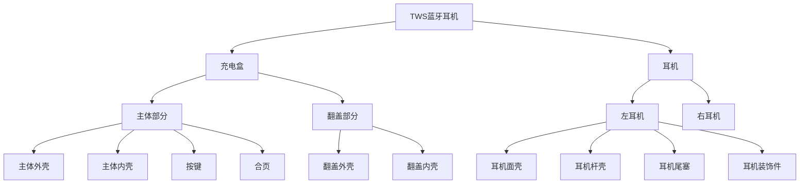

#### 耳机面壳与杆壳卡扣设计截面

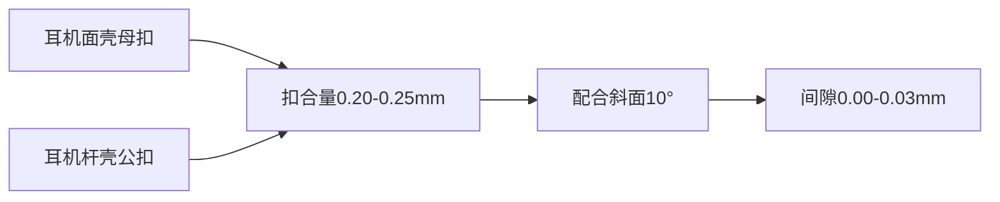

### 5. 经典金句/数据

> “TWS蓝牙耳机是比较精致的产品，其外形尺寸不大，结构固定方式的选择很关键。一般来说，尽量不采用螺钉固定，卡扣固定与胶水固定是TWS蓝牙耳机主要的固定方式。” (1.3.2)

> “耳机面壳与耳机杆壳的环形卡扣扣合量为0.20～0.25mm，并预留0.10mm左右的加胶空间。”(1.5.1)

> “此款TWS蓝牙耳机中使用了11个磁铁。” (1.6.2)

> 耳机电池采用451010型号，容量30mAh；充电盒电池采用702030型号，容量400mAh。

> 喇叭出音孔面积建议为喇叭本身面积的8%～15%。(1.5.2)

---

## 第2章：翻盖式移动电源结构设计全解析

### 1. 核心论点

本章解决“如何将手机支架功能集成到移动电源中”的创新结构设计问题。作者认为：通过前支架和后支架的双重翻转结构、侧盖板的包覆式卡扣设计、以及隐藏式数码管显示，可以实现“充电+观影”的双重功能，且外观不受影响。

### 2. 关键概念/事件

- **翻盖式手机支架**：前支架翻开90°，后支架翻开55°，实现手机支撑
- **隐藏式数码管**：通过半透黑色上壳实现电量显示，熄灭时不可见内部
- **反扣设计**：上壳与下壳采用内扣（反扣），公扣宽≥4mm，扣合量≥0.5mm
- **卡点设计**：圆球形卡点过盈0.20mm，提供旋转手感
- **模内嵌件注塑**：前支架和后支架模内注塑铁片，与磁铁配合吸合

### 3. 逻辑推演/叙事脉络

本章从产品创新点出发（自带手机支架），分析ID效果图拆解出前支架、主体（上壳+下壳+左右盖板）、后支架。材料选择PC+ABS（防火V1），表面处理有高光和磨砂两种效果。固定方式分析：前支架通过左右盖板夹持、后支架通过旋转轴和压块固定、上下壳通过16个卡扣固定。建模部分讲解骨架构建（产品尺寸138×70×14.5mm）和拆件料厚（前支架1.4mm、上下壳1.8mm）。间隙设计重点：前支架与上壳间隙0.20-0.25mm（考虑喷涂厚度）。结构设计核心：前支架旋转轴心定位、圆圈骨位夹持、圆球形卡点提供手感；后支架旋转轴直径1.6mm、压块固定、弹性骨位过盈0.35mm提供手感。最后检查功能需求并总结易出问题（段差、拔模影响外观、磁力不足等）。

### 4. 流程图

#### 翻盖式移动电源结构拆解

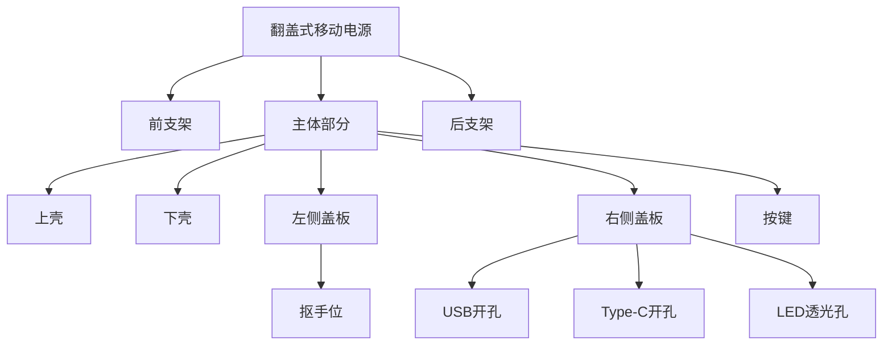

#### 后支架旋转结构

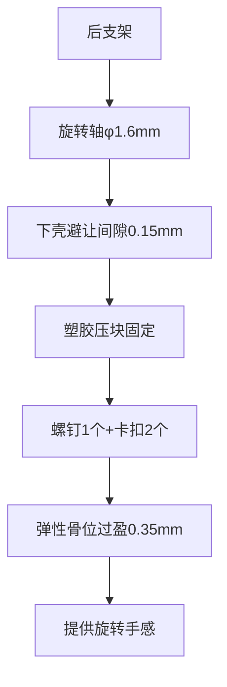

### 5. 经典金句/数据

> “没有采用螺钉固定的产品，整机布12～16个卡扣，卡扣分布要尽量均匀，两个卡扣之间的距离最好控制在30.00mm左右。” (2.5.2)

> “卡扣采用内扣，内扣是反扣的一种，上壳做公扣，下壳做母扣，公扣宽度不小于4.00mm，扣合量不小于0.50mm。” (2.5.2)

> 整机尺寸：138.00mm×70.00mm×14.50mm
> 电芯容量：10000mAh（型号9858102）
> 前支架翻转角度：90°，后支架翻转角度：55°

---

## 第3章：多功能智能笔结构设计全解析

### 1. 核心论点

本章解决“如何在极小的笔形空间内集成光线检测、坐姿检测、笔芯自动伸缩等复杂功能”的结构设计问题。作者认为：通过微型电动机驱动、三级齿轮减速、曲柄滑块机构、以及精巧的零件拆分策略，可以在直径13.5mm、长度158mm的笔形空间内实现所有智能功能。

### 2. 关键概念/事件

- **三级齿轮减速机构**：蜗杆（模数0.20）+大齿轮（18齿）+小齿轮（9齿）+大齿轮（28齿）+小齿轮（9齿）+大齿轮（40齿），总减速比约240:1
- **曲柄滑块机构**：将电动机圆周运动转化为笔芯直线伸缩运动
- **笔芯互换设计**：支持钢笔、铅笔、圆珠笔、可擦笔四种笔芯互换
- **黑色半透镜片**：隐藏显示屏，点亮时可见内容，熄灭时不可见内部
- **FPC柔性电路板**：适应笔形内部空间，连接各电子元器件

### 3. 逻辑推演/叙事脉络

本章从学生智能笔的功能需求出发（光线/坐姿/握笔检测、笔芯自动伸缩、语音提示等），分析ID效果图拆解出笔帽、笔杆（笔盖+上笔杆+下笔杆+镜片+透光件+握笔铜片）、笔尖三大部分。材料选择强调：笔杆用PC+ABS喷涂、镜片用透明ABS、握笔位用铜片电镀。固定方式分析：小零件多用卡扣+胶水、上笔杆与下笔杆用胶水固定。模具分析：上笔杆横放分模、下笔杆竖放分模、两侧大行位。建模部分讲解异形曲面构建技巧（纵向三条线、横向多条线控制）。结构设计核心：笔芯伸缩机构——微型电动机（φ9×16mm，24000r/min）经三级减速至约97r/min，通过曲柄滑块驱动笔芯内套，实现伸缩行程控制。笔芯互换通过可抽出式笔芯内套实现。最后检查功能需求并总结知识点。

### 4. 流程图

#### 笔芯伸缩机构三级减速传动链

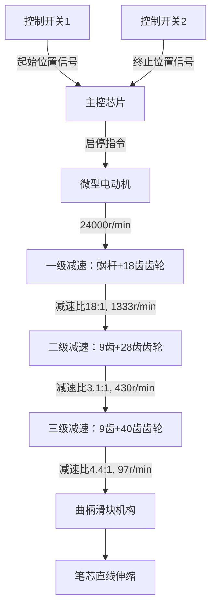

#### 智能笔结构拆解

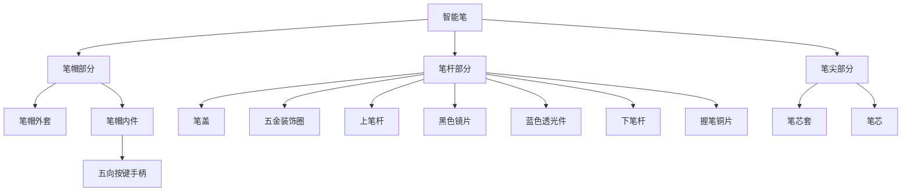

### 5. 经典金句/数据

> “电动机的种类与型号也很多，如何选择呢？根据产品设计的需求，尽量选用市场上通用的种类及规格。” (3.5.4)

> “对于小产品而言，结构上所说的限位，主要起导向作用，相互之间的间隙一般设计为0.05mm～0.10mm。” (3.5.2)

> 整机尺寸：158.00mm×13.50mm×13.50mm
> 电动机规格：直径9mm，长度16mm，转速24000r/min
> 三级减速后转速：约97r/min
> 电池容量：30mAh（未明示，根据常规推断）

---

## 第4章：多功能旅行充电器结构设计全解析

### 1. 核心论点

本章解决“多国插头互换+车充功能+USB输出的多功能旅行充电器如何进行防拆安全设计”的问题。作者认为：通过超声焊接实现防拆、通过弹片预压实现电气连接、通过多国插头组件内的五金弹片与主体美规插脚过盈配合实现可靠接触，可以在保证安全的前提下实现插头互换功能。

### 2. 关键概念/事件

- **超声焊接**：防拆主要手段，配合双止口和虚线式超声线
- **双止口结构**：凹形母止口+公止口，配合间隙0.05mm
- **多国插头互换**：欧规、英规、澳规三种插头组件，通过弹片预压与主体美规插脚连接
- **车充组件**：可打开135°，每隔20°可停顿，旋转轴中空穿线
- **虚线式超声线**：切断的超声线，防止焊接时溢胶

### 3. 逻辑推演/叙事脉络

本章从产品功能需求（多国插头互换、车充、3USB输出）出发，分析ID效果图拆解出主体（上壳+下壳+镜片+美规插头）、车充组件、多国插头组件（欧/英/澳规）。材料选择强调防火等级V0（充电器为强电产品）。固定方式分析：超声焊接为主（防小孩拆卸），卡扣辅助。模具分析：主体上壳USB孔用隧道滑块（外观无夹线）。建模部分讲解骨架和拆件料厚（主体上下壳2.0-2.3mm）。间隙设计：超声焊接产品间隙0.00mm，运动部件间隙初始0.20mm（遵循“加胶容易减胶难”原则）。结构设计核心：双止口+超声线具体尺寸（提供完整参数表）、导光柱加光扩散剂实现均匀发光、美规插头旋转轴定位、五金弹片预压连接（闭合预压2.5mm，打开预压0.5mm）、车充旋转轴中空穿线、多国插头通过弹片预压(0.70mm)和长公扣(扣合1.00mm)实现互换。最后检查功能需求并总结易出问题（段差、旋转无手感、弹片卡顿等）。

### 4. 流程图

#### 双止口+超声线防水结构

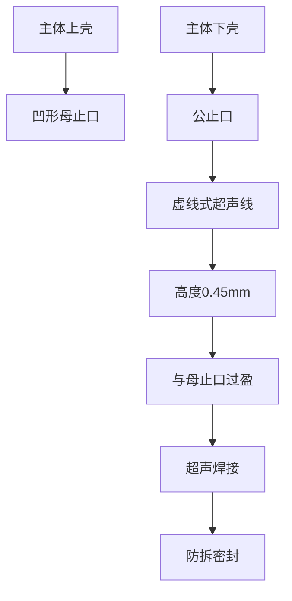

#### 多国插头互换结构

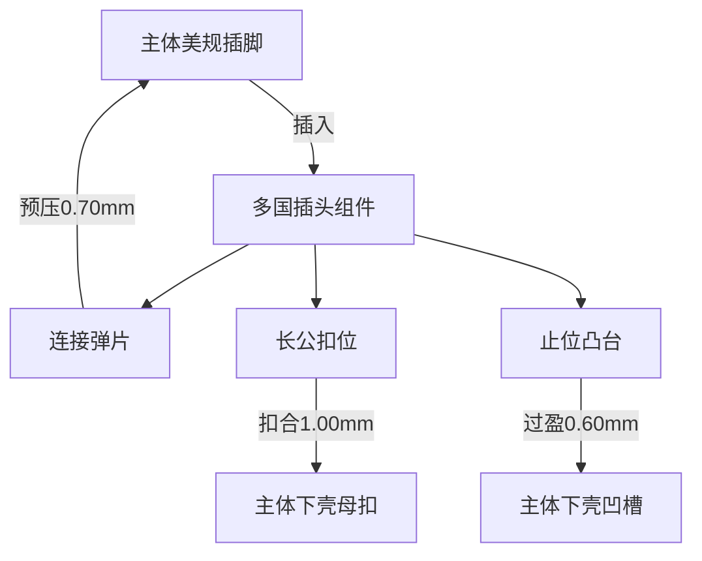

#### 车充组件旋转停顿结构

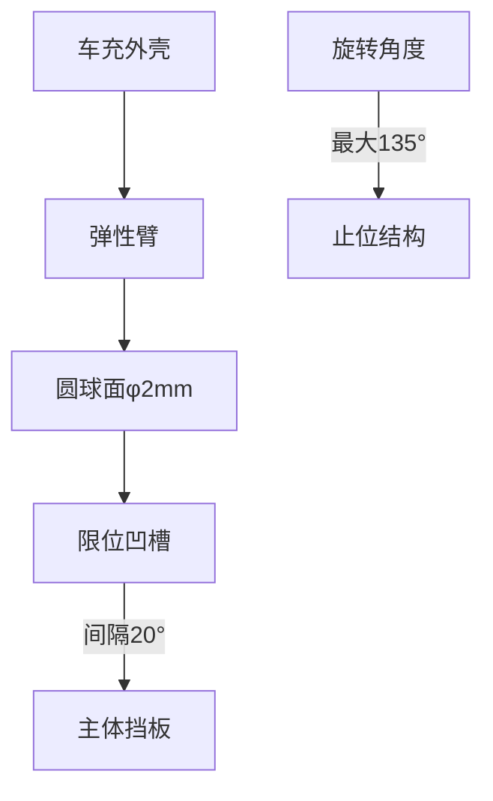

### 5. 经典金句/数据

> “加胶容易减胶难”——产品加胶而模具上就是减钢料，产品减胶而模具上就是加钢料，加钢料需要烧焊，不仅难度大，还有损坏模具的风险。(4.4.3)

> “对于需要运动的塑胶零件，如果设计时很难预估运动状况，建议将间隙初始值设计大一点，后续根据实配情况再加胶调整。” (4.4.3)

> 整机尺寸：68.00mm×57.00mm×31.00mm
> 主体外壳拔模：1.5°
> 车充打开角度：135°
> 美规插脚打开角度：90°
> 超声线尺寸：宽0.40mm，高0.40mm
> 主体电源插头打开及回弹次数要求：不少于1500次

---

## 第5章：多功能数据线结构设计全解析

### 1. 核心论点

本章解决“lightning+Micro-USB二合一多功能数据线如何进行紧凑收纳和可靠电气连接”的问题。作者认为：通过大外壳滑动收纳、lightning接口内藏转接头、以及卡扣+胶水的组合固定方式，可以实现一条线兼容两种接口且便于携带。

### 2. 关键概念/事件

- **MFi认证**：Apple公司对外设配件的认证标准，lightning公头外露长度要求6.47-6.75mm
- **TPE线材**：热塑性弹性体，手感舒适、韧性好，用于高端线材
- **内膜注塑**：焊点保护工艺，防止拉扯导致脱落
- **强制脱模卡扣**：扣合量0.15mm，适用于空间不够做斜顶的场合
- **弧形面条式线材**：宽7.30mm，厚2.20mm，5条芯线

### 3. 逻辑推演/叙事脉络

本章从产品功能（lightning+Micro-USB二合一、数据传输+充电）出发，分析ID效果图拆解出Type-A组件、lightning组件、Micro-USB组件、大外壳、线材五部分。材料选择：外壳用纯PC（强度高、韧性好），线材外皮用TPE。固定方式分析：外壳与装饰件用卡扣+胶水、大外壳与Type-A装饰件用卡点。模具分析：大外壳拔模0.5°（高度方向投影差0.45mm满足出模）。间隙设计：运动部件间隙0.15-0.20mm。结构设计核心：线材规格——5芯线（红V+、黑V-、绿D+、白D-、黄AP+），22-24AWG，铝箔屏蔽；各插头组件采用止口+卡扣固定（公扣强脱模、母扣行位出模）；lightning组件内部为转接头（lightning公头+Micro-USB母座焊接），加不锈钢片激光焊接加固；大外壳滑动收纳，内设长骨位限位。最后检查功能需求并总结易出问题（lightning外露长度不足、外壳断裂、段差等）。

### 4. 流程图

#### 多功能数据线收纳原理

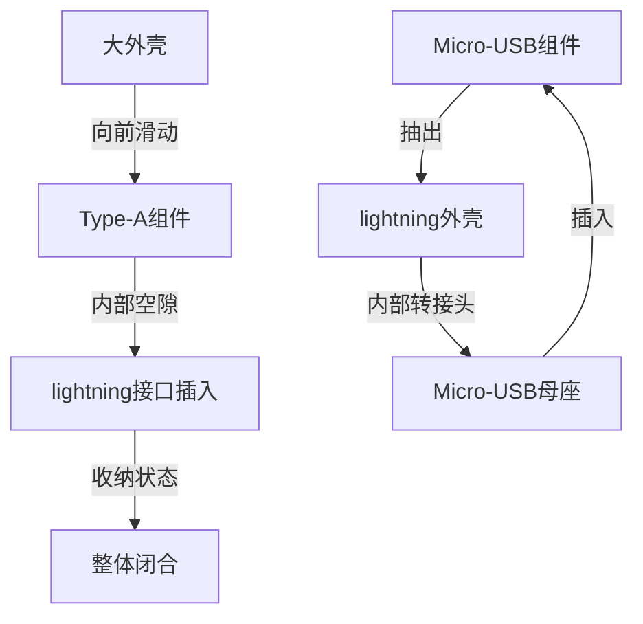

#### 数据线芯线结构

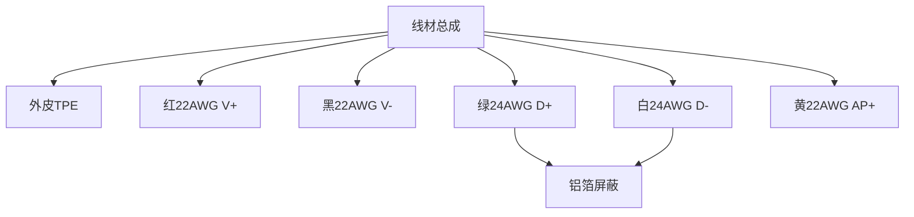

### 5. 经典金句/数据

> “在进行线材设计时，尽量选用市场上通用的线材，通用的线材意味着市场上有现存的货源，缩短了线材设计及研发时间，同时还没有库存的压力。” (5.5.1)

> “MFi是‘Made for iPhone/iPod/iPad’的英文缩写，是苹果公司对其授权配件厂商生产的外置配件的一种标识使用许可。” (5.5.4)

> 总长：300mm，收纳后尺寸：73.80mm×18.60mm×11.60mm
> 线材规格：宽7.30mm×厚2.20mm，5芯线
> lightning公头外露长度要求：6.47-6.75mm，建议6.60mm
> Micro-USB公头外露长度：不小于6.00mm
> Type-A公头外露长度：不小于12.00mm
> 卡扣扣合量：0.15mm，预留0.10mm调整空间

---

## 第6章：多功能私人云盘结构设计全解析

### 1. 核心论点

本章解决“铝合金与塑胶结合的多功能私人云盘如何进行异种材料连接和紧凑内部布局”的问题。作者认为：通过塑胶上壳加长穿过铝合金内部、螺钉+塑胶压板夹紧固定的方式，可以有效防止接合处断裂和段差；同时通过SSD硬盘加固、电池限位、导光柱热熔等设计，实现在12.6mm厚度内集成Wi-Fi传输、移动电源、移动硬盘三重功能。

### 2. 关键概念/事件

- **铝合金6063-T5**：挤压成型，表面氧化，适合精密加工和高表面要求
- **挤压型材**：每个横截面相同，无需拔模角度
- **SSD硬盘**：100G容量，通过连接器+螺钉双重固定
- **CNC高光切亮边**：氧化后在高光机切出银色亮边，提升美观度
- **3M9495MP双面胶**：PET基材，耐温121-149℃，用于粘贴底面盖板

### 3. 逻辑推演/叙事脉络

本章从产品三重功能（Wi-Fi传输、移动硬盘、移动电源）出发，分析ID效果图拆解出铝合金外壳、塑胶上壳、塑胶下壳、按键、导光柱、底面盖板。材料选择：铝合金6063-T5氧化金色哑光、塑胶PC+ABS喷涂黑色。固定方式分析：铝合金通过塑胶上壳加长穿过+塑胶压板+螺钉固定、塑胶上下壳用卡扣（死扣0.60mm）。模具分析：塑胶上壳两侧行位出模、铝合金挤压成型。结构设计核心：塑胶上壳加长穿过铝合金内部（四周间隙0.10mm），设计限位骨位（零间隙）和防呆结构；铝合金加工流程详解（挤压→锯断→CNC→抛光→喷砂→氧化→高光切边）；塑胶下壳拆分策略（尺寸比开孔大0.50mm）；PCB固定（2个螺钉+圆柱限位）；电池固定（双面胶+EVA泡棉，四周间隙0.10mm）；SSD硬盘加固（螺钉固定）；按键（裙边0.80mm+悬臂梁厚0.70mm）；导光柱（热熔固定+遮光骨位防止串光）。最后检查功能需求并总结易出问题（段差、利边刮手、电池松动、SSD读取失败等）。

### 4. 流程图

#### 铝合金外壳与塑胶连接结构

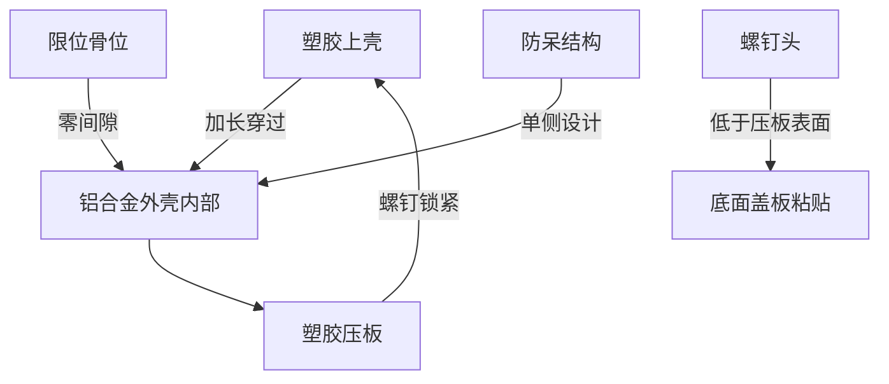

#### 铝合金型材加工流程

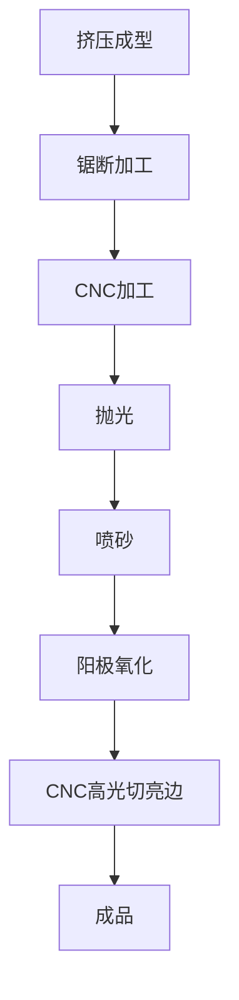

#### 电池固定结构

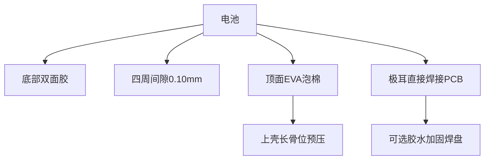

### 5. 经典金句/数据

> “铝合金6063-T5通过模具挤压成型，挤压的是半成品铝合金型材，后续再进行切割、抛光等处理工艺。” (6.3.1)

> “双面胶的主要作用是防止电池移动，虽然双面胶尺寸大一些可使固定更牢固，但在实际生产中，固定电池的双面胶尺寸不宜过大，因为在生产中经常需要返修，双面胶粘太紧电池很难取下来，容易造成电池损坏、报废。” (6.6.2)

> 整机尺寸：129.80mm×71.80mm×12.60mm
> 电池容量：6000mAh（型号906090）
> SSD硬盘容量：100G
> 铝合金外壳料厚：1.20mm
> PCB厚度：0.80mm
> 按键悬臂梁厚度：0.70mm（建议0.60-0.80mm）

---

## 第7章：三防产品设计全解析

### 1. 核心论点

本章解决“如何系统设计达到IP67防护等级的三防产品”的问题。作者认为：三防设计的核心思路是“堵”与“导”结合，通过硅胶防水圈预压、二次注塑软硬结合、防水泡棉双面胶粘贴、螺钉塞密封等多重手段，可以实现消费级产品的IP67防水防尘要求。

### 2. 关键概念/事件

- **IP67防护等级**：6代表完全防尘，7代表短时浸水（水深1m，30分钟）
- **“堵”与“导”**：堵——隔离水汽，导——引导水流快速排走
- **硅胶防水圈**：截面方形1.25×1.0mm，硬度40度，预压过盈0.30mm
- **二次注塑**：软胶（TPU）+硬胶（PC+ABS）一体成型，用于按键防水
- **纳米防水涂层**：荷叶效应，PCB表面形成超疏水层
- **防水透声膜**：用于声学器件，透声阻水

### 3. 逻辑推演/叙事脉络

本章从三防概念（防水、防尘、防震）出发，说明灰尘和水的危害。然后详细介绍IPXX防护等级（防尘IP1-6，防水IPX1-9）及实验方法（垂直滴水、淋水、溅水、喷水、浸水等）。接着讲解防水思路——“堵”与“导”，以及四种防水方法：压缩软性材料（O形圈、硅胶）、覆盖防水层（纳米涂层）、灌封胶、粘贴/点胶（防水泡棉、防水透声膜）。以iPhone为例分析壳体防水（粘胶）、侧键防水（预压硅胶）、声学器件防水（透声膜+硅胶）、接插件防水（连接器本身+硅胶）、电路防水（纳米膜）。案例部分：三防移动电源（IP67），详细讲解上壳下壳双止口+硅胶防水圈（双止口间隙0.05mm，硅胶过盈0.30mm）、螺钉防水（螺钉塞+凸台过盈0.15mm）、镜片防水（泡棉双面胶，最窄宽度≥3mm）、按键防水（二次注塑TPU，变形槽0.5-0.6mm）、导光柱防水（二次注塑+内部导光件）、USB连接器防水（侧盖板TPU，凸台过盈0.15mm）。

### 4. 流程图

#### 三防产品防水结构总览

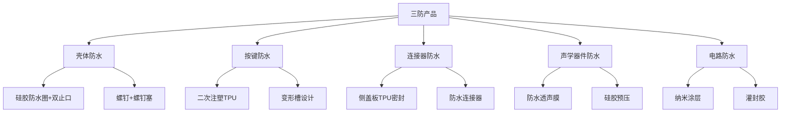

#### 上壳下壳双止口防水结构

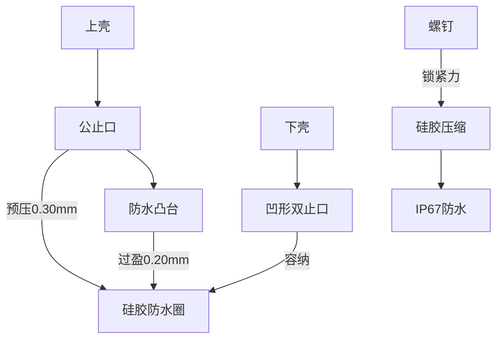

#### IP防护等级体系

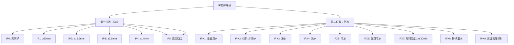

### 5. 经典金句/数据

> “防水的主要思路是‘堵’与‘导’。‘堵’就是将水及水汽隔离在产品的外部，‘导’主要是将水沿着斜面、导流槽或者泄流孔快速地排走。” (7.3)

> “对于大部分产品，生活防水就足够，选用防水等级IPX4即可。但对于需要在水下使用的产品，如防水相机等，防水等级要达到IPX8。” (7.1.2)

> “双止口与硅胶防水圈配合尺寸：公止口与硅胶过盈量0.10mm，公止口上再设计凸台与硅胶过盈量0.20mm，总体过盈量0.30mm。硅胶硬度为40度左右。” (7.7.1)

> “镜片防水建议防水泡棉双面胶最窄宽度不小于3.00mm。” (7.7.4)

> 此款三防移动电源尺寸：146.00mm×84.00mm×20.00mm，容量10000mAh，防护等级IP67
> 防水实验条件：IPX7——浸水箱，样品底部距水面至少1m，顶部距水面至少0.15m，时间30min

---

## 全书总结

本书通过7个真实产品案例，系统展示了产品结构设计的完整方法论：

1. **设计理念**：坚持“自顶向下”设计，先做骨架后拆件
2. **分析流程**：ID效果图分析→拆件分析→模具初步分析→建模→间隙设计→详细结构设计
3. **固定方式**：卡扣、胶水、超声焊接、螺钉各有适用场景，TWS耳机和充电器多用卡扣+胶水，三防产品多用螺钉+硅胶圈
4. **间隙设计**：精密产品间隙0.00-0.10mm，运动部件预留0.20mm初始间隙（“加胶容易减胶难”）
5. **材料选择**：PC+ABS最常用，防火等级V0-V2；纯PC用于高强度需求；铝合金6063-T5用于高端外观
6. **运动机构**：齿轮减速、曲柄滑块、旋转轴设计提供详细参数
7. **三防设计**：“堵”与“导”结合，硅胶预压过盈0.30mm可达IP67

作者强调：结构设计是相通的，不管什么行业、什么产品，设计方法及设计思路大同小异。读者应学会“举一反三”，而非仅模仿具体案例。