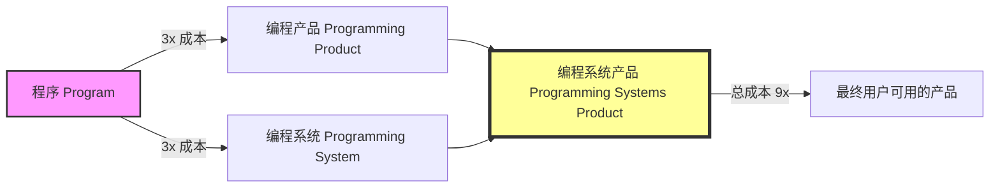
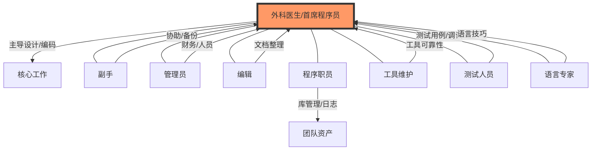
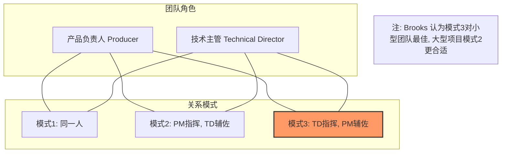
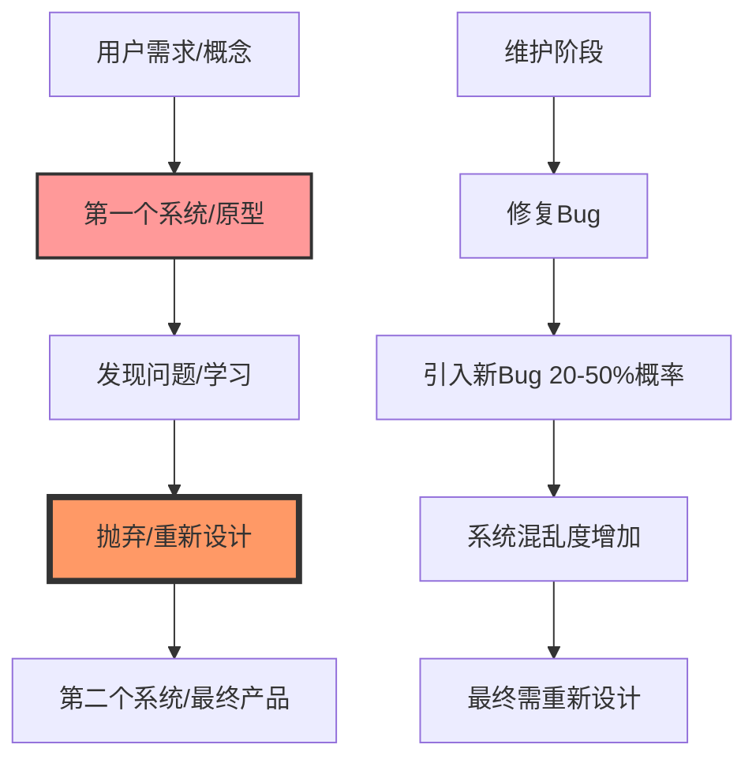

# 《人月神话》章节总结

## 书籍信息
- **书名**：人月神话 (The Mythical Man-Month)
- **作者**：Frederick P. Brooks, Jr.
- **译者**：Adams Wang
- **PDF 状态**：完整文本提取（基于提供的 OCR/文本内容）
- **版本说明**：包含1975年第一版内容及1995年二十周年纪念版新增章节（第16-19章及回顾）。

## 目录说明
- **目录识别情况**：目录结构清晰，包含原书15章及纪念版新增4章。
- **章节对应依据**：严格遵循提供的文本目录顺序，从“焦油坑”到“结束语”，再到纪念版序言及新增章节。
- **OCR 修复说明**：文本内容完整，部分图表描述已转化为 Mermaid 流程图或文字描述。

## 全书核心主题

《人月神话》是软件工程领域的经典著作，基于作者在 IBM System/360 和 OS/360 项目管理中的经验。全书核心观点围绕软件项目的管理困境展开，指出大型软件项目之所以困难，是因为其本质上的复杂性、一致性、可变性和不可见性。

书中提出了著名的“人月神话”概念，即认为向进度落后的项目中增加人手只会使进度更加落后（Brooks 法则）。作者强调“概念完整性”是系统设计最重要的因素，主张通过“外科手术队伍”式的团队结构、严格的体系结构设计、以及为变更而计划（包括抛弃原型）来应对软件开发的挑战。

在二十周年纪念版中，Brooks 重申了“没有银弹”的观点，即没有任何单一技术或管理方法能在十年内使软件生产率提高一个数量级，因为软件的根本困难在于其概念结构的构建，而非次要的实现细节。全书旨在为软件项目经理提供实用的管理建议和对软件本质的深刻洞察。

---

## 二十周年纪念版序言

### 核心论点
作者回顾了《人月神话》出版20年后的影响，确认了核心观点（如概念完整性、没有银弹）的有效性，并引入了对新技术（如面向对象、重用）的评估。

### 关键概念/事件
- **没有银弹**：预言十年内无技术能带来数量级的生产率提升。
- **根本问题 vs 次要问题**：区分软件固有的概念复杂性（根本）与实现细节（次要）。
- **观点更新**：承认在信息隐藏方面 Parnas 是正确的，而瀑布模型是错误的。

### 逻辑推演/叙事脉络
Brooks 解释了为何准备纪念版，列举了仍然坚持的观点和改变的观点。他特别提到了《没有银弹》一文的争议，并介绍了新增章节的目的：回应批评、更新观点、列出经过时间检验的命题。

### 经典金句/数据
> “令我惊奇和高兴的是，《人月神话》在 20年后仍然继续流行... 人们经常问，我在 1975年提出的观点和建议，哪些是我仍然坚持的，哪些是已经改变观点的？”

---

## 第一版序言

### 核心论点
管理软件项目与其他工程既有相似之处又有巨大差异。本书旨在系统阐述这些管理经验，特别是维持产品“概念完整性”的重要性。

### 关键概念/事件
- **OS/360 的经验**：作为失败但富有教训的项目案例。
- **概念完整性**：大型项目管理的核心需求。
- **目标读者**：职业程序员、职业经理，特别是程序员的职业经理。

### 逻辑推演/叙事脉络
作者简述了自己的背景（从硬件到 OS/360 经理），说明了写作动机：回答 Tom Watson 关于编程难以管理的问题。他强调了书中中心论点：大型项目因人员分工导致管理问题不同，关键在于维持概念完整性。

---

## 第1章：焦油坑 (The Tar Pit)

### 核心论点
软件开发是一个充满乐趣但也充满苦恼的职业，如同巨兽在焦油坑中挣扎。编程系统产品的成本远高于独立程序，因为其需要通用性、系统集成和测试。

### 关键概念/事件
- **编程系统产品 (Programming Systems Product)**：成本是独立程序的9倍（3倍用于产品化，3倍用于系统集成）。
- **职业的乐趣**：创造的快乐、对他人有用、魔术般的力量、学习的乐趣、易于驾驭的介质。
- **职业的苦恼**：追求完美、依赖他人、寻找琐碎 Bug、产品过时。

### 逻辑推演/叙事脉络
通过比喻（焦油坑）引入软件开发的困境。分析从“程序”到“编程系统产品”的演进过程及其成本倍增原因。接着探讨程序员的心理状态：乐趣来源与固有苦恼，为后续管理讨论奠定人性基础。

### 流程图/图表重建



### 经典金句/数据
> “过去几十年的大型系统开发就犹如这样一个焦油坑，很多大型和强壮的动物在其中剧烈地挣扎。”
> “相同功能的编程产品的成本，至少是已经过测试的程序的三倍。”
> “编程系统构件的成本至少是独立程序的三倍。”
> “编程系统产品... 它的成本高达九倍。”

---

## 第2章：人月神话 (The Mythical Man-Month)

### 核心论点
缺乏合理的时间进度是项目滞后的主要原因。用人月作为衡量工作规模的单位是危险的神话，因为人员和时间不可互换。向进度落后的项目增加人手只会使进度更落后（Brooks 法则）。

### 关键概念/事件
- **人月神话**：错误地假设人员和时间可以互换。
- **Brooks 法则**：向进度落后的项目中增加人手，只会使进度更加落后。
- **乐观主义**：程序员倾向于假设一切顺利，导致估算偏差。
- **系统测试时间**：应占总进度的1/2（1/4构件测试+1/4系统测试）。

### 逻辑推演/叙事脉络
首先指出进度滞后的五大原因（估算、人月混淆、缺乏信心、缺乏监督、盲目加人）。接着论证人月的谬误：沟通成本随人数非线性增长（n(n-1)/2）。通过案例演示加人导致的培训、重新划分任务等额外负担，最终导出 Brooks 法则。

### 流程图/图表重建

```mermaid
graph TD
    subgraph 任务类型
    A[完全可分解任务] -->|人员时间可互换| B[割小麦]
    C[不可分解任务] -->|人员时间不可互换| D[孕育生命]
    E[需沟通的可分解任务] -->|沟通成本抵消增益| F[软件开发]
    end
    
    F --> G[沟通成本 = 培训 + 交流]
    G --> H[交流复杂度 n(n-1)/2]
    H --> I[加人导致进度更慢]
    
    style I fill:#f96,stroke:#333,stroke-width:2px
```

### 经典金句/数据
> “向进度落后的项目中增加人手，只会使进度更加落后。（Adding manpower to a late software project makes it later）”
> “无论多少个母亲，孕育一个生命都需要十个月。”
> “1/3计划，1/6编码，1/4构件测试和早期系统测试，1/4系统测试。”

---

## 第3章：外科手术队伍 (The Surgical Team)

### 核心论点
为解决大型系统需要多人协作与保持概念完整性之间的矛盾，建议采用类似外科手术的团队结构：由一名“首席程序员”（外科医生）负责核心设计和编码，其他人提供支持。

### 关键概念/事件
- **首席程序员 (Surgeon)**：负责定义、设计、编码、测试和文档。
- **副手 (Copilot)**：后备，参与设计讨论，了解所有代码。
- **支持角色**：管理员、编辑、秘书、程序职员、工具维护人员、测试人员、语言专家。
- **概念完整性**：通过少数人（1-2人）思考保证。

### 逻辑推演/叙事脉络
指出优秀程序员与差劲程序员的生产率差异巨大（10:1）。传统大团队沟通成本高且概念不一致。引入 Mills 的建议：外科手术队伍。详细描述各角色职责，论证这种结构如何既保证概念完整性（由外科医生主导）又利用多人生产力（支持角色）。

### 流程图/图表重建



### 经典金句/数据
> “如果一个 200人的项目中，有 25个最能干和最有开发经验的项目经理，那么开除剩下的 175名程序员，让项目经理来编程开发。”
> “ efficiencies and conceptual integrity are best achieved by a small number of people.”

---

## 第4章：贵族专制、民主政治和系统设计

### 核心论点
概念完整性是系统设计最重要的因素。为了获得概念完整性，设计必须由一个人或少数默契的人完成（贵族专制），而与具体实现分离。

### 关键概念/事件
- **概念完整性**：反映一致的设计思路，牺牲不规则特性以换取易用性。
- **体系结构 vs 实现**：体系结构陈述“发生了什么”，实现描述“如何实现”。
- **贵族专制**：结构师拥有技术权威，确保设计一致性。

### 逻辑推演/叙事脉络
通过兰斯大教堂的例子说明概念一致性的价值。论证易用性取决于功能与理解复杂度的比值，而这需要概念完整性。提出解决矛盾的方法：分离设计与实现。反驳“民主设计”的观点，认为结构师的专制是必要的，但实现过程同样具有创造性。

### 经典金句/数据
> “概念完整性是系统设计中最重要的考虑因素。”
> “如果要得到系统概念上的完整性，那么必须控制这些概念。这实际上是一种无需任何歉意的贵族专制统治。”
> “体系结构陈述的是发生了什么，而实现描述的是如何实现。”

---

## 第5章：画蛇添足 (The Second-System Effect)

### 核心论点
设计师在设计第二个系统时，倾向于过分设计，添加第一个系统中被谨慎推迟的功能，导致系统过于复杂和低效。结构师需自律，项目经理需警惕。

### 关键概念/事件
- **第二个系统效应**：过度设计，添加修饰功能。
- **OS/360 案例**：作为第二个系统的典型，包含了过多不必要的功能（如复杂的链接编辑器）。
- **自律准则**：为每个功能分配字节和微秒的预算。

### 逻辑推演/叙事脉络
分析结构师的心理：第一个系统谨慎简洁，第二个系统自信满满导致过度设计。列举 OS/360 中的例子（链接编辑器、TESTRAN、调度程序）说明这种倾向的危害。提出避免方法：结构师的自我约束（功能预算）和项目经理的监督。

### 经典金句/数据
> “第二个系统是设计师们所设计的最危险的系统。”
> “OS/360是典型的第二次开发（second-system effect）的例子，是软件行业的 Stretch系统。”

---

## 第6章：贯彻执行 (Passing the Word)

### 核心论点
为确保大型团队理解并实现结构师的决策，需要多种沟通机制：手册、形式化定义、会议、电话日志和独立测试。

### 关键概念/事件
- **手册**：外部规格说明，由少数人编写以保持一致性。
- **形式化定义**：精确但难懂，需与记叙性文字结合。
- **周例会与年度大会**：解决决策和积压问题。
- **独立产品测试**：作为用户的代理人，查找缺陷。

### 逻辑推演/叙事脉络
提出问题：如何在大团队中贯彻设计？逐一介绍工具：手册（精确、一致）、形式化定义（辅助精确）、直接整合（代码级强制）、会议（周例会决策，年度大会清理）、电话日志（快速澄清）、多重实现（强制兼容）、独立测试（客观验证）。

### 经典金句/数据
> “项目经理最好的朋友就是他每天要面对的敌人——独立的产品测试机构/小组。”
> “如果起初至少有两种以上的实现，那么（体系结构）定义会更加整洁，会更加规范。”

---

## 第7章：为什么巴比伦塔会失败？

### 核心论点
巴比伦塔的失败源于交流缺乏和组织混乱。大型软件项目同样面临交流灾难，需要通过项目工作手册和良好的组织架构来管理交流。

### 关键概念/事件
- **交流障碍**：左手不知道右手在做什么。
- **项目工作手册**：所有文档的结构化集合，实时更新，全员共享。
- **组织架构**：树状管理结构 vs 网状交流结构。
- **双重领导**：产品负责人（管理）与技术主管（技术）。

### 逻辑推演/叙事脉络
从巴比伦塔故事引出交流的重要性。分析大型项目中的交流问题。提出解决方案：非正式交流、会议、项目工作手册（详细描述了 OS/360 的手册管理机制）。讨论组织架构，指出树状结构的局限性，提出产品负责人和技术主管的三种组合模式。

### 流程图/图表重建



### 经典金句/数据
> “巴比伦塔项目的失败是因为缺乏交流，以及交流的结果——组织。”
> “项目工作手册不是独立的一篇文档，它是对项目必须产出的一系列文档进行组织的一种结构。”

---

## 第8章：胸有成竹 (Calling the Shot)

### 核心论点
软件估算非常困难，小型程序的数据不能外推到大型系统。生产率随系统复杂度显著变化，高级语言可提高生产率。

### 关键概念/事件
- **估算误区**：编码仅占1/6，不能仅凭编码估算。
- **生产率数据**：操作系统约 600-800 指令/人年，编译器约 2000-3000 指令/人年。
- **高级语言优势**：Corbato 数据显示 PL/I 生产率约为汇编的 5 倍（按语句计）。

### 逻辑推演/叙事脉络
批评简单的估算方法。引用 Portman、Aron、Harr、OS/360 和 Corbato 的数据，展示不同任务类型的生产率差异。指出复杂度对生产率的影响（操作系统 > 编译器 > 应用）。强调高级语言带来的生产率提升。

### 经典金句/数据
> “编译器的复杂度是批处理程序的三倍，操作系统复杂度是编译器的三倍。”
> “使用适当的高级语言，编程的生产率可以提高 5倍。”

---

## 第9章：削足适履 (Ten Pounds in a Five-Pound Sack)

### 核心论点
程序空间是主要成本之一。必须进行规模控制，包括内存和磁盘访问预算。数据的表现形式是编程的根本，战略突破常来自数据的重新表达。

### 关键概念/事件
- **规模预算**：不仅包括内存，还包括磁盘访问次数。
- **空间-时间折衷**：用空间换速度，或用功能换空间。
- **数据表现形式**：重构数据结构往往比优化算法更有效。

### 逻辑推演/叙事脉络
论述程序空间的经济成本。分享 OS/360 的教训：必须对所有资源（内存、磁盘访问）做预算，且预算需与功能定义绑定。讨论缩小程序规模的技巧：功能交换、空间-时间折衷、公共库。最后强调数据表现形式的重要性，举例说明重新表达数据带来的战略突破。

### 经典金句/数据
> “数据的表现形式是编程的根本。”
> “战略上突破常来自数据或表的重新表达——这是程序的核心所在。”

---

## 第10章：提纲挈领 (The Documentary Hypothesis)

### 核心论点
少数关键文档是项目经理的主要工具。书面记录决策、沟通策略和监控状态至关重要。

### 关键概念/事件
- **关键文档**：目标、技术说明、进度、预算、组织机构图、工作空间分配。
- **文档的作用**：明确决策、沟通渠道、状态检查列表。
- **Conway 定律**：设计系统的组织架构受到产品的约束限制，生产出的系统是这些组织机构沟通结构的映射。

### 逻辑推演/叙事脉络
提出假设：少数文档是管理枢纽。对比计算机硬件、大学科系和软件项目的文档需求，发现其相似性（目标、产品、时间、资金、地点、人员）。阐述正式文档的三个理由：记录决策、沟通、状态监控。

### 经典金句/数据
> “在一片文件的汪洋中，少数文档形成了关键的枢纽，每件项目管理的工作都围绕着它们运转。”
> “设计系统的组织架构受到产品的约束限制，生产出的系统是这些组织机构沟通结构的映射。”

---

## 第11章：未雨绸缪 (Plan to Throw One Away)

### 核心论点
第一个系统通常是不合用的，必须计划将其抛弃。变化是永恒的，系统和组织架构都必须为变更而设计。维护成本高昂，且会引入新 Bug。

### 关键概念/事件
- **抛弃原型**：第一个系统用于学习，应计划丢弃，而非发布。
- **为变更设计**：模块化、高级语言、版本控制。
- **为变更组建团队**：双晋升阶梯（管理/技术），人员互换性。
- **维护的熵增**：修复 Bug 引入新 Bug，系统随维护逐渐混乱。

### 逻辑推演/叙事脉络
类比化学工程的试验工厂，指出软件也需要“试验性系统”。论证第一个系统必然存在缺陷，应计划抛弃。讨论如何应对变化：技术上（模块化、高级语言），组织上（双晋升阶梯、外科手术队伍）。分析维护阶段的“前进两步，后退一步”现象，指出系统熵增不可避免，最终需重新设计。

### 流程图/图表重建



### 经典金句/数据
> “为舍弃而计划，无论如何，你一定要这样做。”
> “缺陷修复总会以（20－50）%的机率引入新的 bug。”
> “系统软件开发是减少混乱度（减少熵）的过程，所以它本身是处于亚稳态的。软件维护是提高混乱度（增加熵）的过程...”

---

## 第12章：干将莫邪 (Sharp Tools)

### 核心论点
工欲善其事，必先利其器。需要为目标机器和辅助机器配置合适的工具，包括高级语言、交互式编程、仿真器、程序库和文档系统。

### 关键概念/事件
- **目标机器 vs 辅助机器**：目标机器用于最终测试，辅助机器用于开发支持。
- **高级语言**：提高生产率和调试效率（PL/I 推荐）。
- **交互式编程**：缩短调试周转时间，生产率至少翻倍。
- **程序库管理**：私有开发库、系统集成子库、发布版本分离。

### 逻辑推演/叙事脉络
批评个人化工具，提倡通用工具与专业工具结合。分类讨论所需工具：目标机器（时间块分配）、辅助机器（仿真器、编译器、程序库、调试工具、文档系统、性能仿真器）。特别强调高级语言和交互式编程的巨大优势，引用数据证明其生产率提升。

### 经典金句/数据
> “只有懒散和惰性会妨碍高级语言和交互式编程的广泛应用。”
> “交互式编程的生产率至少是原来的两倍。”

---

## 第13章：整体部分 (The Whole and the Parts)

### 核心论点
系统集成调试是出乎意料的困难部分。应采用自顶向下设计、结构化编程、经过调试的构件、充分的测试平台和受控的集成过程。

### 关键概念/事件
- **自顶向下设计**：逐步细化，避免系统级 Bug。
- **结构化编程**：避免 GOTO，使用控制结构。
- **系统集成策略**：一次添加一个构件，使用伪构件和微缩文件，控制变更（紫色线束手法）。

### 逻辑推演/叙事脉络
讨论如何构建可运行的系统。首先是通过详尽的体系结构设计和自顶向下方法预防 Bug。接着讨论调试演进：本机调试 -> 内存转储 -> 快照 -> 交互式调试。重点阐述系统集成调试的困难，提出策略：使用完好构件、搭建测试平台、控制变更（紫色线束）、一次添加一个构件、阶段化变更。

### 经典金句/数据
> “许许多多的失败完全源于那些产品未精确定义的地方。”
> “拒绝诱惑！这正是系统测试所关注的方面。”

---

## 第14章：祸起萧墙 (Hatching a Catastrophe)

### 核心论点
项目延迟是由无数微小的日常延误累积而成的。需要通过明确的里程碑、PERT 图和独立的计划控制小组来监控进度，防止“地毯下的污垢”积累。

### 关键概念/事件
- **里程碑**：具体、可度量的事件，防止自欺欺人。
- **PERT 图**：识别关键路径，管理依赖关系。
- **计划与控制小组**：独立于项目经理，负责收集和报告真实状态。
- **状态 vs 行动**：区分状态检查会议和问题解决会议，鼓励诚实汇报。

### 逻辑推演/叙事脉络
指出项目延迟的本质：一天一天的累积。讨论里程碑的重要性（具体、明确）。介绍 PERT 技术用于识别关键路径和缓解“其他部分会落后”的借口。分析一线经理隐瞒进度的心理（角色冲突），提出解决办法：老板区分状态和行动信息，建立独立的计划与控制小组进行客观监控。

### 经典金句/数据
> “项目是怎样延迟了整整一年的时间？... 一次一天。”
> “里程碑必须是具体的、特定的、可度量的事件，能够进行清晰定义。”

---

## 第15章：另外一面 (The Other Face)

### 核心论点
程序文档与代码同等重要。提倡“自文档化”程序，将文档整合到源代码中，通过命名、格式和段落注释来提高可读性和可维护性。

### 关键概念/事件
- **文档类型**：用户文档（目的、环境、范围等）、测试用例、修改者文档（内部结构、算法）。
- **流程图的局限**：过时，高级语言下不再必要。
- **自文档化**：合并代码与文档，利用名称、声明、格式、段落注释。

### 逻辑推演/叙事脉络
强调文档对用户的价值。列出用户和修改者所需的具体文档内容。批评流程图的过度使用和过时。提出“自文档化”方案：将文档嵌入代码，通过良好的命名、格式、段落注释来减少独立文档的负担，并利用高级语言特性。

### 经典金句/数据
> “对于软件编程产品来说，程序向用户所呈现的面貌和提供给机器识别的内容同样重要。”
> “流程图是被吹捧得最过分的一种程序文档。”

---

## 第16章：没有银弹－软件工程中的根本和次要问题

### 核心论点
软件任务的根本困难在于构建复杂的概念结构（复杂度、一致性、可变性、不可见性）。次要困难是实现细节。过去生产率的提升主要来自解决次要困难（高级语言、分时、统一环境）。未来十年内，没有单一技术（银弹）能带来数量级的生产率提升。

### 关键概念/事件
- **根本困难 (Essence)**：概念结构的构建。
- **次要困难 (Accident)**：将概念映射到机器语言。
- **潜在银弹评估**：Ada、面向对象、AI、专家系统、自动编程、图形化编程、程序验证、环境/工具。结论：均无法带来数量级提升。
- **颇有前途的方法**：购买而非开发、需求精炼与快速原型、增量开发、卓越设计人员。

### 逻辑推演/叙事脉络
定义根本困难（亚里士多德的本质与偶然）。分析软件的四个内在特性：复杂度、一致性、可变性、不可见性。回顾过去解决次要困难的突破（高级语言、分时、Unix环境）。逐一评估当时的热门技术（Ada, OOP, AI等），指出它们主要解决次要困难或提升有限。提出真正有希望的方向：复用（购买）、原型、增量开发、培养卓越设计师。

### 经典金句/数据
> “没有任何技术或管理上的进展，能够独立地许诺十年内使生产率、可靠性或简洁性获得数量级上的进步。”
> “软件实体可能比任何由人类创造的其他实体要复杂... 软件的复杂度是必要属性，不是次要因素。”

---

## 第17章：再论《没有银弹》

### 核心论点
回应《没有银弹》的批评。澄清“次要”的含义。承认面向对象和重用有价值，但非银弹。强调软件包（塑料薄膜包装软件）的巨大影响。

### 关键概念/事件
- **澄清误解**：“Accidental”指附带的，非偶然的。
- **面向对象**：铜质子弹，前期投入大，收益滞后。
- **重用**：困难在于查找和理解，而非编写。
- **软件包**：大众市场软件是真正的生产力提升来源。

### 逻辑推演/叙事脉络
回应批评者，澄清术语。讨论 Harel、Cox 等人的观点。承认面向对象和重用的价值，但指出其局限性和实施困难（前期成本、词汇学习）。特别强调“塑料薄膜包装的成品软件”（Shrink-wrapped software）对生产率的巨大提升，因为它消除了根本的开发成本。

### 经典金句/数据
> “存在着银弹－就在这里！... 购买计算机软件和硬件时，我喜欢听取那些真正使用过产品并感到满意的用户的推荐。”
> “面向对象技术不会加快首次或第二次的开发，产品族中第五个项目的开发才会异乎寻常的迅速。”

---

## 第18章：《人月神话》的观点：是或非？

### 核心论点
对1975年版书中的命题进行回顾和验证。大部分观点仍然成立，部分观点因技术进步而过时或被修正（如 Parnas 的信息隐藏优于 Brooks 的全员共享）。

### 关键概念/事件
- **成立的观点**：概念完整性、Brooks 法则、第二个系统效应、文档重要性、自顶向下设计等。
- **修正的观点**：Parnas 的信息隐藏是正确的，Brooks 之前的全员共享观点是错误的。
- **过时的观点**：PL/I 的地位、某些具体的硬件限制。

### 逻辑推演/叙事脉络
逐章列出原书命题，并给出20年后的评价。使用 [方括号] 标注更新或修正。特别指出在信息隐藏问题上，Parnas 的观点被证实更优越。确认 Brooks 法则、概念完整性等核心观点的持久价值。

### 经典金句/数据
> “关于信息隐藏，Parnas是正确的，我是错误的。”
> “Brooks准则有多准确？... 我还是坚持这个简单的陈述，作为真理的最佳近似。”

---

## 第19章：20年后的人月神话

### 核心论点
总结20年来的变化。微型计算机革命和成品软件产业是最大的新事物。瀑布模型是错误的，增量开发和每晚重建更佳。放弃权力、授权团队能提高生产率。

### 关键概念/事件
- **瀑布模型的错误**：假设一次性构建，忽视反馈。
- **增量开发**：构建可运行的框架，逐步精化。
- **每晚重建 (Build-every-night)**：Microsoft 的实践，保持系统始终可运行。
- **微型计算机革命**：改变了软硬件经济学，成品软件兴起。
- **放弃权力**：授权团队，准自治单元，提高士气和生产率。

### 逻辑推演/叙事脉络
回顾《人月神话》为何依然相关。讨论核心观点（概念完整性、结构师）的持久性。批判瀑布模型，推崇增量开发和快速原型。介绍 Microsoft 的“每晚重建”方法。讨论 Parnas 的信息隐藏和面向对象。回顾 Boehm 的数据支持人月神话。强调“人就是一切”。介绍微型计算机革命和成品软件产业的兴起。最后讨论组织管理上的“放弃权力”和授权团队的好处。

### 流程图/图表重建


### 经典金句/数据
> “没有构建舍弃原型——瀑布模型是错误的！”
> “最令人惊讶的新事物是什么？数百万的计算机。”
> “放弃权力的力量... 通过权力委派，中心的权威实际上是得到了加强。”

---

## 结束语：令人向往、激动人心和充满乐趣的五十年

### 核心论点
作者回顾了自己五十年的计算机生涯，表达了对计算机技术的热爱和对未来的期待。软件工程虽不成熟，但充满希望。

### 关键概念/事件
- **个人历史**：从 Mark I 到 Stretch 再到 Macintosh Powerbook。
- **学科发展**：软件工程类似早期的化学工程，正在走向成熟。
- **未来展望**：持续的发展，使用更大的要素，新工具，良好判断，谦卑。

### 逻辑推演/叙事脉络
Brooks 回忆早年接触计算机的经历，感叹技术的飞速发展（速度、成本、数量）。对比化学工程的发展历程，认为软件工程目前处于类似1945年化学工程的阶段，虽不成熟但充满希望。最后呼吁从业者保持谦卑，持续学习。

### 经典金句/数据
> “我实在无法想像还有哪种生活会比热爱计算机更加激动人心...”
> “软件工程的焦油坑在将来很长一段时间内会继续地使人们举步维艰，无法自拔。”