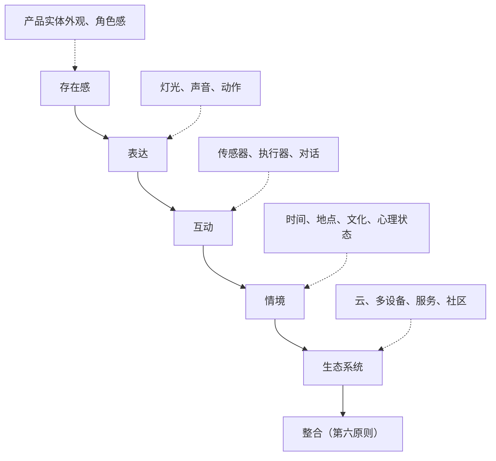
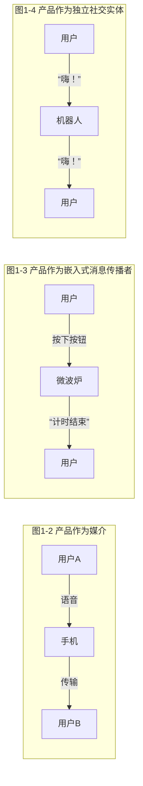
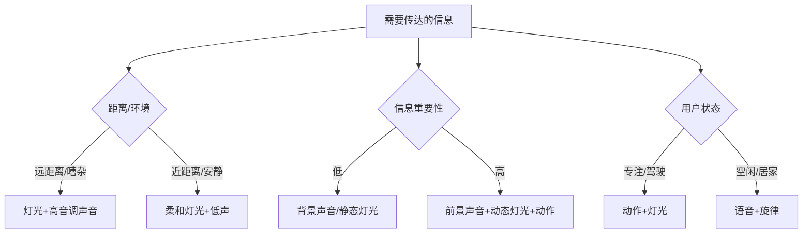
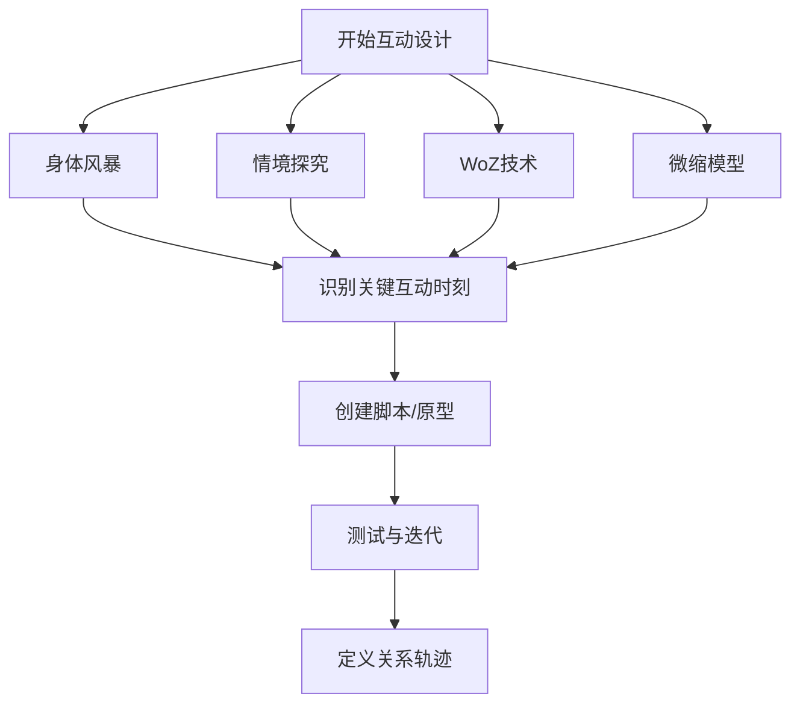
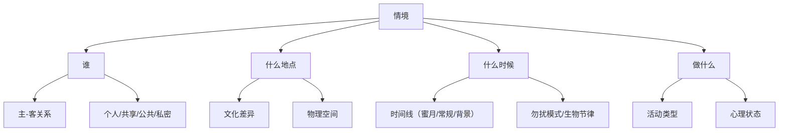
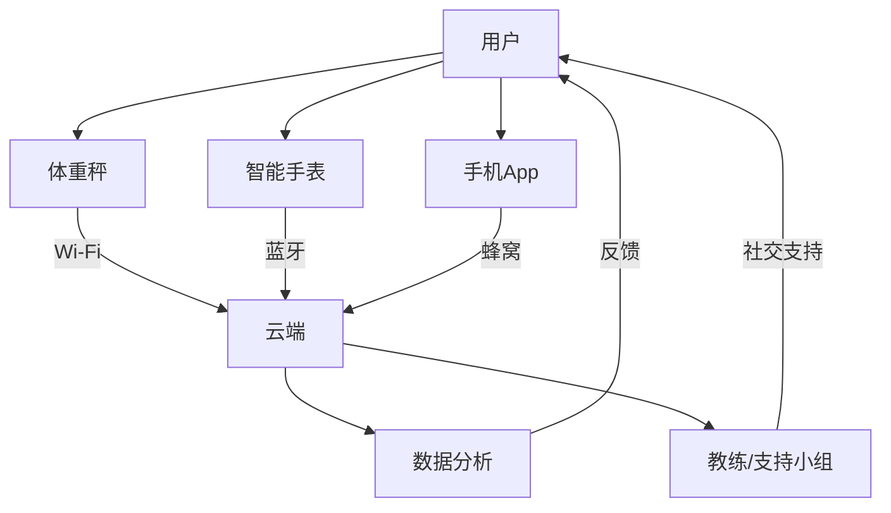
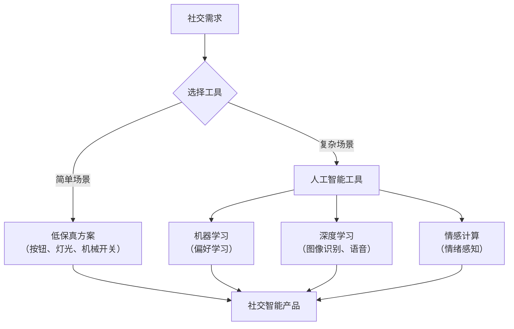

# 《人本智能产品设计6原则》章节总结

## 书籍信息
- 书名：人本智能产品设计6原则
- 作者：[美] 卡拉·黛安娜（Carla Diana）
- PDF 状态：基于 OCR 文本提取，可识别主体内容，部分图表/页码可能不完整
- OCR 状态：正文可读，存在少量识别偏差（如个别字符错误），但整体可恢复章节结构与核心论点

## 目录说明
- 目录识别情况：从文本中可提取完整章节层级，包括：推荐序、引言、第1章（从响应智能到共情智能）、第2章（存在感）、第3章（表达）、第4章（互动）、第5章（情境）、第6章（链接）、第7章（整合）、结语、致谢、注释。
- 章节对应依据：依据正文标题与页码边界进行恢复。
- OCR 修复说明：部分图表未能完整还原，但核心逻辑可通过 Mermaid 重建；个别错字/漏字已根据上下文合理推断，未虚构内容。

## 全书核心主题
本书提出“人本智能”设计理念，强调智能产品不应仅追求技术炫技，而应以人类社交规范、情感模式和行为习惯为核心，成为真正贴合生活的协同者。作者构建了“产品社交生活框架”的五环模型（存在感→表达→互动→情境→生态系统），并在此基础上提出第六原则“整合”。全书通过大量案例（如西蒙机器人、莫克西医疗机器人、埃利Q、Nest摄像头等）论证：优秀的智能产品设计需要从“响应智能”走向“共情智能”，在技术狂奔中寻找人性温度。

---

## 推荐序 从“表达自我”到“接近人类”，重构人与智能产品的“双向关系”
### 核心论点
问题：AI 技术快速发展，但人与智能产品的关系往往被简化为单向的“响应—服务”。  
作者观点（徐元春）：必须重构人与智能产品的“双向关系”，让智能产品以人类感知世界的方式为核心去表达自我、接近人类，从而在和谐的生态中与人类共生。

### 关键概念/事件
- 双向关系：用户与产品之间不再是单向指令，而是相互感知、相互反应。
- 小冰 AI 诗集：《阳光失了玻璃窗》作为人类历史上第一本 AI 创作诗集，标志着 AI 创造时代的开启。
- 数字员工：作为“契约化”数字劳动力的最小单元，正从工具属性变为商业新生态的基础设施。

### 逻辑推演
推荐序从小冰科技的实践出发，指出 AI 不仅需要智商（IQ），更需要情商（EQ）。通过列举 ChatGPT 等大模型的发展，序言认为技术已具备基础，但真正的挑战在于让 AI 理解人类的社交规范。作者以“树影压在秋天的报纸上”等诗意表达，引出对“双向关系”的呼唤，并认为《人本智能产品设计6原则》提供了从关系出发审视设计的全新视角。

> “观念改变思维，思维决定行动。”

---

## 引言 有情商，能社交，智能时代的人本产品设计革命
### 核心论点
问题：市场上许多“智能”产品像“卑躬屈膝的表弟”，难以建立亲近关系，甚至粗鲁地响应。  
作者观点：只有当智能产品感知用户行为并做出适当反应时，人与产品之间的社会联系才会被放大。解决方案不是更多技术，而是更好的人性化设计和社交设计。

### 关键概念/事件
- 鲁姆巴（Roomba）现象：消费者给机器人吸尘器起名、与之交谈，将其视为社会实体。
- “神经病”产品：指那些完全不智能、不遵守社交规范的产品（如自动门突然打开、Alexa 偷听）。
- 社交可提供性（Social Affordances）：产品在设计上提供的、能够触发用户社交反应的属性。
- 产品“社交五环”框架：存在感、表达、互动、情境、生态系统（后续章节展开）。
- 新冠疫情的影响：人们被迫依赖技术进行社交，凸显了具有社交能力的产品的价值。

### 逻辑推演
引言从鲁姆巴的用户评论入手，证明人类天生倾向于将物体社交化。接着批判当前“响应式产品”在社交功能上的失败（如自动门的尴尬互动）。作者提出，真正的智能产品需要“有情商”，能够理解并采用人类日常社交的规范、价值和协议。最后，作者介绍了自己的背景（机械工程师→交互设计→西蒙机器人→勤奋机器人公司）和本书的结构——以“五环”框架逐层深入。

### 流程图（产品社交生活框架的五环）

> “只有当智能产品感知了人们的行为，并做出适当反应的时候，人们与产品之间的社会联系才会被放大。”

---

## 第1章：从响应智能到共情智能，在技术狂奔中寻找人性温度
### 核心论点
问题：如何从技术主导的“响应式”交互转向以人类社交规范为基础的“共情式”交互？  
作者观点：与智能产品进行情感交流所带来的强大感觉是产品设计的灵感来源。互动智能（而非单纯的人工智能）是设计具有社交功能产品的基础。

### 关键概念/事件
- 西蒙机器人（Simon）：上半身人形机器人，通过耳朵的转动、发光等非语言线索进行社交沟通。其耳朵没有机械功能，只用于社交表达。
- 社交可提供性的4大方面：亲密程度、外观、动态行为、对话元素。
- 互动智能 vs. 人工智能：人工智能负责模式识别和数据处理，互动智能负责让产品像人一样进行社交互动。
- 嵌套设计方法：从物理特性（存在感）→动态行为（表达）→对话（互动）→环境敏感性（情境）→生态系统。

### 逻辑推演
作者从自己与笔记本电脑的“亲密关系”出发，引出人类与产品之间自然发生的社交互动。然后以西蒙机器人为例，详细说明如何通过刻意设计的物理特征（如耳朵）来传递社交线索。作者区分了“互动智能”与“人工智能”，强调技术只是工具，真正的核心是让产品能够理解并回应人类的社交行为。最后，作者提出了贯穿全书的嵌套框架，并绘制了三种互动模型（产品作为媒介、作为嵌入式消息传播者、作为独立社交实体）。

### 流程图（三种互动模型）

> “与智能产品进行情感交流所带来的强大感觉就是产品设计的灵感来源。”

---

## 第2章：决胜原则一 存在感——建立角色感，所见即所需
### 核心论点
问题：产品的实体外观如何影响用户与产品之间的社交关系？  
作者观点：优秀的智能产品设计，其黄金标准就是产品本身可以沟通表达它的使用方法，而不需要依赖用户复述说明书。外观需跟着需求走。

### 关键概念/事件
- 具身化（Embodiment）：给软件智能体设置一个物理存在（“身体”），从四方面发挥作用（关键部件、人体工程学、空间象征、关联性）。
- 埃利Q（ElliQ）：为老年人设计的社交机器人，通过头部转动、发光和语音引导用户完成视频通话，降低认知负担。
- 产品语义学（Product Semantics）：通过产品的外观（形状、颜色、材料）传达使用方法和象征属性。
- Flip Mino 摄像机：以大红色按钮为核心，简化操作，成为“口袋中的摄像机”。
- Nest 户外摄像头：去掉传统的“警察帽”（保护罩），使其更平易近人，减少威胁感。
- 社会角色的三种属性：关联性（产品扮演的角色：假肢、工具、助手等）、情感性（图腾、护身符、徽章、纪念品）、条件性（产品在不同状态下的行为）。

### 逻辑推演
本章以作者母亲因阿尔茨海默病失去使用传统设备能力的感人故事开篇，引出具身化的重要性。接着通过埃利Q、Nest摄像头、Flip摄像机等案例，论证产品的外观不仅决定功能可用性，更塑造了社会角色。作者引入“产品语义学”和“心智模型”理论，强调可见性和映射性。最后提出设计师需从关联性、情感性、条件性三个维度构建产品特征，并警示隐藏传感器（如麦克风、摄像头）会引发隐私焦虑，应通过物理形态明确传达状态。

> “产品的实体结构奠定了智能产品的基调，并确立了用户与智能产品之间关系的本质。”

### 人本智能产品设计实验室案例
- Nest 户外摄像头：去掉“警察帽”，降低威胁感。
- Clikbrik 鼓棒节拍器：通过鼓棒操作，让鼓手保持舞台存在感。

---

## 第3章：决胜原则二 表达——最简单的符号，胜过最复杂的指令
### 核心论点
问题：智能产品如何通过非语言的方式（灯光、声音、动作）高效传递信息？  
作者观点：就像我们能从宠物身上读到微妙的线索一样，我们也能从智能产品身上读到信息和情感。最简单的符号（一闪一闪的灯光、一连串的音调、一个手势）往往胜过最复杂的指令。

### 关键概念/事件
- 产品的“肢体语言”：灯光、声音、动作构成了产品的非语言表达系统。
- 灯光作为动态材料：可改变产品整体外观，如 Nanoleaf 面板、苹果电脑呼吸灯、达什机器人（Dash）的环形 LED 眼睛。
- 动作表达：动画专业中的“面粉袋练习”证明细微动作可传递复杂情感；Clocky 落跑闹钟通过滚动动作强制唤醒用户。
- 声音表达：鸡尾酒会效应（选择性注意）、前景/背景声音设计、品牌声音（音色）。
- Jambox 音箱：通过“已连接”语音和标志性声音反馈配对状态。
- Neato 扫地机器人：与作曲家合作，将“人类语言”翻译为旋律、提醒和输入反馈三种声音层级。

### 逻辑推演
本章从作者与宠物狗的默契沟通出发，类比智能产品可以通过非语言方式快速传递信息。作者详细拆解灯光、动作、声音各自的优点与局限，并通过大量案例说明如何组合使用。特别强调声音不是装饰，而是产品核心和灵魂的反映。最后提出“极简符号优先”原则：能用一闪一闪的灯光传递信息，就不必用完整句子。

### 方法流程图（表达方式选择）

> “就像我们能从宠物身上读到微妙的线索一样，我们也能从智能产品身上读到信息和情感。”

### 人本智能产品设计实验室案例
- 发光帽（Glow Caps）：通过发光和语音提醒服药时间。
- Clocky 落跑闹钟：通过滚动动作强制用户起床。
- Jambox 蓝牙音箱：通过语音确认“我连接了！”
- Neato 扫地机器人：用旋律表达“开始工作”，用提醒音表达“我被卡住了”。

---

## 第4章：决胜原则三 互动——惊喜总是来自反馈
### 核心论点
问题：如何设计用户与智能产品之间来回往复的互动对话？  
作者观点：互动是产品社交生活框架的核心和灵魂。设计师最重要的工作是设计将要发生的对话，用输入和输出来取代单词和短语。惊喜总是来自恰当的反馈。

### 关键概念/事件
- 传感器与执行器：输入（按钮、旋钮、触摸、倾斜、语音、视觉）和输出（灯光、声音、动作、屏幕信息）。
- 按钮 vs. 旋钮：离散控制（开关）与连续控制（范围）。
- 零界面交互（ZeroUI）：通过传感器让用户无须手动操作，但需谨慎设计隐性输入。
- WoZ 技术（Wizard of Oz）：通过幕后人员远程控制原型，研究用户对机器人行为的反应。
- 机械脚凳（Mechanical Ottoman）：通过移动和盖板开合表达邀请意图，研究用户解读。
- 身体风暴（Bodystorming）：通过角色扮演实时、实景探索交互场景。
- 关系轨迹（Relationship Trajectory）：产品与用户的关系随时间演变（蜜月期→常规期→背景化）。

### 逻辑推演
作者以自己与西蒙机器人互动的“魔法时刻”开篇，说明即便深谙技术原理也会被精心设计的社交互动打动。接着从技术层面介绍传感器和执行器，并类比人类五感。作者强调互动设计需要从“产品作为媒介”转向“产品作为独立社交实体”。本章重点介绍了多种设计研究方法：身体风暴、情境探究、WoZ技术、微缩模型、视频原型等，并强调随着时间推移，产品与用户的关系应趋向成熟，从新奇过渡到低调可靠。

### 方法流程图（互动设计研究方法）

> “用户与产品的关系在很大程度上由他们之间发生的对话来定义。”

### 对话安德烈娅·托马斯
- 服务型机器人需具备社交规范模型，即使不说话也要有社交智能。
- 视线聚焦、简短语音反馈（“嗯”“好”）是关键的交互确认信号。
- 医院环境中，机器人需感知何时何地发出声音是合适的。

---

## 第5章：决胜原则四 情境——随机应变，像“人”一样思考
### 核心论点
问题：智能产品如何感知和适应不同的社交环境（时间、地点、文化、心理状态）？  
作者观点：设计团队不仅要考虑设计的方方面面，还要考虑智能产品所处的社交环境如何影响关键的设计决策。随机应变，像“人”一样思考。

### 关键概念/事件
- 莫克西机器人（Moxi）的走廊互动：经过人群时说“不好意思”，侵占个人空间时说“打扰一下”。
- 主-客关系隐喻：汽车内饰设计中，将司机视为主人，乘客为客人，设计可自助的环境。
- 用户画像二维矩阵：横轴（传统-现代），纵轴（参与度低-高），用于定位目标用户。
- 围裙警报（Apron Alert）：通过围裙扣子闭合触发“开始做饭”消息，简单有效地感知情境。
- 谷歌眼镜的失败：未考虑佩戴者之外的人的社交感受，引发敌意。
- 文化差异：红色在中国象征喜庆，在西方象征危险。
- 时间线设计：Neato 扫地机器人从“蜜月期”的教程模式过渡到“常规期”的背景化表达。

### 逻辑推演
作者以莫克西机器人在医院走廊的社交设计为例，说明情境敏感性是产品获得信任的关键。接着引入帆船航行的类比：伟大的船长需同时监测风速、水流、船只等多重因素。作者提出情境设计需考虑：谁（主-客关系）、什么地点（文化、物理空间）、什么时候（时间线、勿扰模式）、做什么（活动变化）。通过身体风暴和模拟医院环境，团队发现门口通道的设计需要调整。最后强调，即便是老练的设计师也容易忽略情境，需不断检查。

### 方法流程图（情境设计考虑维度）

> “我们不认为她是一台机器，她是莫克西！”—— 护士对莫克西机器人的评价

### 人本智能产品设计实验室案例
- 围裙警报：通过扣子触发“开始做饭”消息。
- 锤头一号自行车车把导航系统：用30个 LED 灯显示方向，适应骑行环境。
- 聪明的衣架：感知有人靠近时显示天气信息。

---

## 第6章：决胜原则五 链接——建立生态，万物互联
### 核心论点
问题：如何通过云、多设备和服务构建产品生态系统，增强社交体验？  
作者观点：生态系统是产品社交生活的核心，它可以让用户的产品体验不仅仅局限于使用产品本身，还包括分布在多个对象中的实时数据、社交联系和社交体验。

### 关键概念/事件
- 云机器人（Cloud Robotics）：机器人可借助云端共享知识（如识别杯子和碗的区别），而不必自己学习一切。
- IFTTT 平台：通过“如果……就……”的小程序连接不同设备和服务（如收到邮件时闪烁灯泡）。
- Tile 蓝牙追踪器：利用社区网络帮助找回丢失物品。
- Citi Bike 共享单车：整体生态系统包括服务亭、应用程序、自行车天使积分、无线射频钥匙。
- 社交物联网：所有追踪器和用户彼此连接，形成社区帮助网络。
- 众包数据：Strava 健身应用的热力地图泄露军事基地位置；日本福岛后的 Safecast 项目让公民自制盖革计数器收集辐射数据。
- 可穿戴设备：身体互联网（心率、运动数据与其他设备联动）。

### 逻辑推演
作者以自己通过 Withings 体重秤、Noom 服务和智能手表联动减肥的个人经历，引出生态系统的价值。然后解释云机器人如何让莫克西等设备利用全球共享知识。通过 Tile、Citi Bike、亚马逊无人超市等案例，论证生态系统可将单一产品体验扩展为社区参与的社交网络。作者强调，多个传感器组合工作（多传感器融合）可以实现“零界面”的无缝体验。最后指出，统一的设计语言（存在感、表达、互动、情境、生态系统）可以强化品牌价值，如 Withings 的柔和简约风格贯穿所有产品。

### 方法流程图（生态系统数据流）

> “生态系统是产品社交生活的核心。”

### 人本智能产品设计实验室案例
- 工作场所设计：通过可旋转方块和灯光颜色表达“忙碌/空闲”状态，跨办公室共享。

---

## 第7章：决胜原则六 整合——融合工具，在持续社交中提升AI体验
### 核心论点
问题：如何整合人工智能工具（机器学习、深度学习、情感计算）来增强产品的社交智能？  
作者观点：设计一件聪明的社交智能产品，其方法是要承认界面的局限性，而不是急于尝试复制人类可能做的事情。不要沉迷于人工智能可以解决一切问题的炒作。

### 关键概念/事件
- Phonekerchief 手帕：用银纤维制成，盖上手机表示“此刻为你关机”，是一种社交信号。
- 社交智能 vs. 人工智能：人工智能是工具，社交智能是产品对社交情境的恰当响应。
- 通用人工智能（AGI）：尚未实现，且可能被误导。当前应做“窄领域”的社交智能。
- 谷歌 Duplex：能模仿人类预订餐厅，但引发欺骗担忧。
- 情感计算（Affective Computing）：通过面部表情、生理指标、语音分析感知用户情绪。Affectiva 公司产品可识别高兴、困惑、惊讶等。
- Nest 恒温器：通过机器学习用户习惯，自动调节温度。
- 量化自我（Quantified Self）：通过数据追踪改善健康行为。
- 倾听桌（Listening Table）：纽约时报实验室产品，用于会议记录，通过发光环提示监听状态，4周后自动删除数据。

### 逻辑推演
本章以 Phonekerchief 手帕这一看似反技术的产品开篇，指出社交价值有时比技术性能更重要。作者详细区分了人工智能、机器学习、深度学习、通用人工智能和社交智能，警告不要被炒作迷惑。通过谷歌 Duplex 和特斯拉自动驾驶的案例说明当前人工智能的局限（缺乏常识、场景狭隘）。作者主张设计应聚焦于特定情境的社交智能，而非追求万能的通用人工智能。最后介绍情感计算和深度学习的前沿应用，但强调“低保真解决方案”（如门鼠标实验）往往同样有效且更可靠。

### 方法流程图（人工智能工具在社交设计中的定位）

> “不要沉迷于人工智能可以解决一切问题的炒作。人工智能所展示出的所有方面都来自软件工具的使用，这需要设计师进行深思熟虑的精心设计。”

### 对话乔纳森·福斯特（微软小娜）
- 小娜的性格设计基于私人助理研究，强调“好心”“敏感”。
- 面对“我爱你”或恶言恶语，小娜的回答很简单：“不”或“酷，我是人工智能”。
- 小娜不试图扮演人类，而是“像人类一样”，因为用户的情感是真实投入的。

---

## 结语 协作性、创造性和社交性，开启AI情商新时代
### 核心论点
问题：社交智能产品的未来发展应遵循何种价值观？  
作者观点：成为协作性、创造性和社交性的生物，并共同努力让生活变得更好一点。与其寻找下一个最好产品，不如将现在的产品做到最好。产品创造者掌握着关键：是让机器人替代人类接触，还是丰富人类关系？

### 关键概念/事件
- 新冠疫情下的机器人应用：中国开设全机器人病房、非接触式配送。作者对此感到“苦乐参半”，担忧机器人成为人类接触的廉价替代品。
- 帕罗（Paro）海豹机器人：用于失智症治疗，可减轻压力、增强动力。
- 隐私问题：摄像头作为“万能传感器”带来巨大隐患，设计师应提供透明的状态提示。
- 道德责任：社交产品可能影响易受影响群体（儿童、认知障碍者），设计师需围绕使用考虑更多问题。
- TEDxBrussels 演讲：作者展示了增强社交洗衣机、遛狗无人机、机器人保姆等概念，观众对机器人保姆反应强烈。

### 逻辑推演
作者回顾全书五个原则和第六原则的整合，总结社交智能设计应服务于人类协作、创造和社交的本性。但作者也表达了对技术滥用的担忧：在新冠疫情期间，机器人被用于“避免人类接触”，这背离了社交智能的初衷。作者呼吁产品创造者承担责任，通过透明的设计（如指示灯、音调）告知用户数据收集状态，保护隐私。最后强调：与其追逐下一个新技术，不如将现有产品做到最好，让技术真正丰富人际关系，而非替代它。

> “未来就在这里”，就技术进步而言，这只是最接近理想化的愿景。

---

## 致谢（实质性信息提取）
作者感谢了交互设计导师温迪·朱、安德烈娅·托马斯（勤奋机器人公司CEO）、机器人心理学播客联合主持人汤姆·瓜列洛，以及 Smart Design、克兰布鲁克艺术学院4D设计学院等机构的同事和学生。致谢部分体现了本书跨学科（设计、工程、心理学、音乐）合作的背景。

---

## 注释与参考文献
书中引用了大量学术论文、专利、行业报告和新闻文章，主要涉及人机交互、社交机器人、情感计算、产品语义学等领域。关键参考文献包括：唐纳德·诺曼的《日用品设计》、温迪·朱的《隐性交互设计》、辛西娅·布雷齐尔的社交机器人研究等。

> 说明：该部分 PDF 识别不完整，具体参考文献页码未完全保留。以上为基于可见文本整理的关键来源。