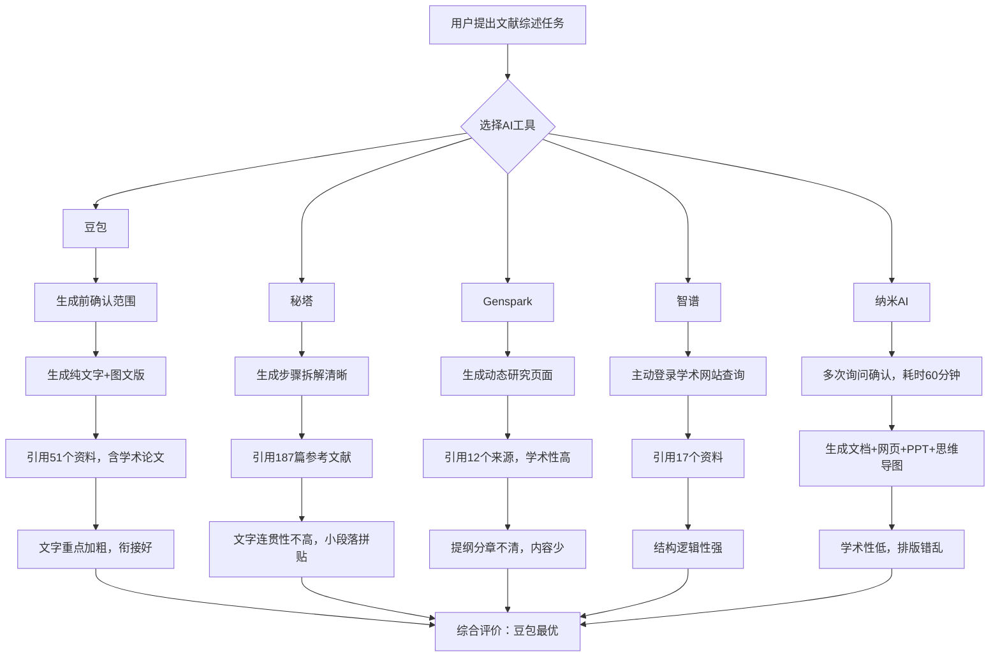
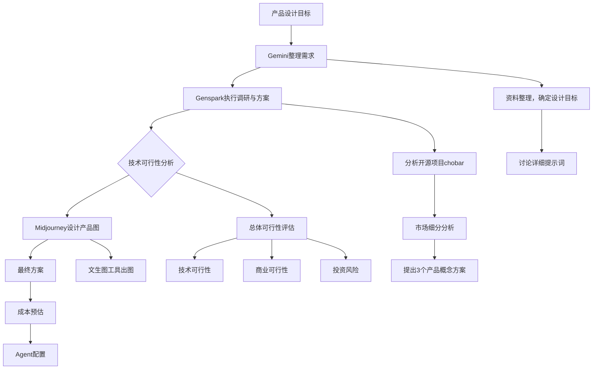
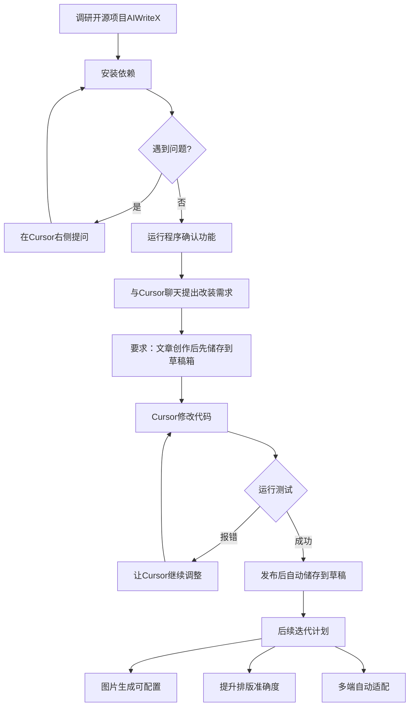
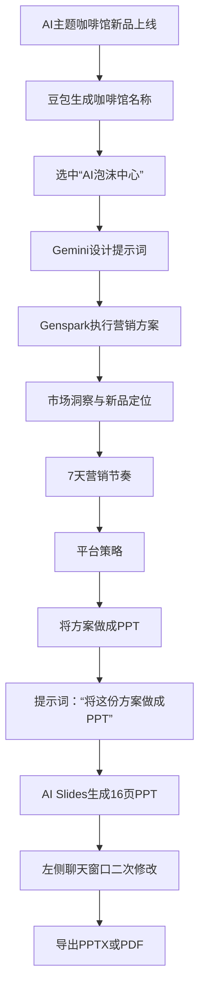

# 《从AI工具到“最佳拍档”》章节总结

## 书籍信息
- **书名**：从AI工具到“最佳拍档”——面向场景实战的AI Agent工具协同指南
- **作者**：AI肖睿团队（吴寒、张惠军、李娜、李晴）
- **发布方**：北大青鸟人工智能研究院、北大计算机学院、北大教育学院学习科学实验室
- **PDF状态**：讲座材料/演示文稿，非传统书籍
- **OCR状态**：文本可识别，部分页面含图片残留（如助理微信号、图片坐标标记等），已忽略非正文内容

## 目录说明
- **目录识别情况**：基于PDF“内容目录”（Page 3）及正文结构识别
- **章节对应依据**：严格按照原PPT的Part结构（Part 01-05）组织，每个Part下含多个子任务场景
- **OCR修复说明**：部分页面（如第6、17、18、23页等）存在图片坐标残留或重复文字（“AI背睿团队”应为“AI肖睿团队”），已按语义修正

## 全书核心主题
本讲座材料以“完成任务”为核心主线，跳出单纯讲解AI工具的技术圈子，深入分析工作和学习中的四大高频场景（知识探索与深度研究、行业洞察与时机分析、内容创作与媒体制作、创意设计与成果转化）。通过对比11个AI Agent产品（Manus、Skywork、Genspark、COZE空间、纳米AI、Perplexity、KIMI、豆包、秘塔AI、MiniMax-Agent、智谱等）在实战任务中的表现，展示AI Agent在任务分解、信息整合及流程优化中的强大潜力，强调“选择的关键不在于完美，而在于适配”，最终目标是解锁人机协作的全新效能。

---

## Part 01: AI工具全景概览

### 核心论点
**问题 → 观点**：用户面对众多AI工具时如何选择？作者认为：AI已从零散工具进化为协同伙伴，其核心价值在于以“任务”为纽带。无论是通用Agent（如Manus）的自主执行，还是垂直领域工具的深度研究，选择的关键不在于“完美”，而在于“适配”。

### 关键概念/事件
- **通用Agent**：具备自主规划、信息整合、多步执行能力的AI智能体，如Manus、Perplexity、Skywork、KIMI、Genspark、豆包、扣子空间、秘塔AI、纳米AI、MiniMax-Agent。
- **垂直领域Agent**：在特定领域（如高质量文生图）表现更优的工具，如Midjourney。
- **“任务为核心”的协同策略**：不再单独讲解工具，而是围绕四大高频场景，让多种Agent协同工作。
- **自主执行型Agent**：如Manus，采用云端虚拟环境，避免与用户本地电脑争夺控制权，主动规划并自主操作。

### 逻辑推演
材料先给出AI工具全景概览（Part 01），然后分类介绍核心Agent工具（Manus、Skywork、Genspark、扣子空间、纳米AI、Perplexity、KIMI、豆包、秘塔AI、MiniMax-Agent），每个工具都明确其核心定位、核心技术、适合场景及使用链接。接着通过小结强调：AI已从零散工具进化为协同伙伴，核心价值在于以“任务”为纽带，打破技术壁垒。理解工具的分类与特性，是构建高效人机协作的第一步，而组合使用则能释放“1+1>2”的乘数效应。

### 经典金句/数据
> “AI 已从零散工具进化为协同伙伴，其核心价值在于以‘任务’为纽带，打破技术壁垒。” (p.26)

> “选择的关键不在于‘完美’，而在于‘适配’。” (p.26)

> “组合使用则能释放‘1+1>2’的乘数效应。” (p.26)

---

## Part 02: 知识探索与深度研究

### 核心论点
**问题 → 观点**：传统学习中信息过载、知识零散、研究繁重、写作瓶颈如何解决？作者认为：AI可以快速进行知识内化，通过智能信息提炼、自动生成学习路径与思维导图、打破语言壁垒、辅助论文撰写等方式，帮助用户从学习单个知识点到掌握整个知识体系，再到完成学术研究与调研报告。

### 关键概念/事件
- **“今天学点啥”功能（秘塔AI）**：将网页链接、文件、论文等复杂内容自动转化为个性化互动课程，包括PPT和语音讲解，支持多种讲解风格和难度设置。
- **Sparkpage（Genspark）**：针对用户查询自动生成包含摘要、关键点、对比表格、深度分析和相关链接的综合性研究页面。
- **长文本处理（KIMI）**：支持20万-200万汉字上下文窗口，一次性上传几十个文件进行阅读、整理和问答。
- **知识图谱构建（COZE空间）**：基于低代码平台打造个性化知识图谱，实现精准学习路径规划。
- **多工具协同学习流程**：如学习Python时，先与KIMI讨论学习计划，再借助“通义灵码”解答问题。

### 逻辑推演
本模块分为四个子任务：
1. **学习具体某个知识点**：以“BERT”、“LangChain”、“界面设计”、“论文解读”为例，展示使用秘塔AI的“搜索→追问→讲解”流程，以及“今天学点啥”功能的互动课程生成。
2. **学习某个知识系统**：以“Python从入门到精通”为例，展示先与KIMI讨论学习计划，再借助AI编程工具练习；以“初中数学个性化知识点梳理”为例，展示在COZE空间输入年级、范围、学习情况，生成学习计划和思维导图。
3. **学术研究——文献综述**：以“乡村旅游开发的文献综述”为题，对比豆包、秘塔、Genspark、智谱、纳米AI五个工具的表现。综合评价推荐顺序：豆包 → 秘塔 → Genspark → 智谱 → 纳米。
4. **学术调研报告**：以“浙江庾村乡村旅游开发中多主体参与情况”为题，对比Genspark、豆包、天工、智谱、秘塔、纳米、Manus、Perplexity八个工具的表现。综合评价推荐顺序：豆包 → 天工 → 秘塔 → 纳米 → Genspark → 智谱 → Manus → Perplexity。

### 流程图（重建：多工具文献综述评估流程）

### 经典金句/数据
> “豆包就是你的梦中情‘AI’！” (p.43)

> “如果你想要参考资料全是学术文章、生成出图文并茂的网页界面，那么秘塔一定是你的心之所向！” (p.43)

> “如果你想要‘监视’AI操作你的电脑进行学术查询，那么智谱就是你的首选！” (p.43)

> 文献综述场景综合评价表：豆包（5分）、秘塔（4分）、Genspark（4分）、智谱（3分）、纳米（2分）——基于信息源质量、深度研究能力、结构化与逻辑构建等维度。

---

## Part 03: 行业洞察与时机分析

### 核心论点
**问题 → 观点**：如何快速了解新技术、新行业、热点事件及商机？作者认为：AI可以实现全天候信息监控、快速聚合与总结、深度趋势分析、即时生成报告，帮助用户从海量信息中精准识别商业机会。

### 关键概念/事件
- **多工具协同产品设计流程**：Gemini整理需求 → Genspark执行设计调研及产品设计方案 → 技术可行性分析 & Midjourney设计产品图 → 最终方案。
- **Deep Research（Gemini）**：深度搜索分析功能，可自动调研市场并生成预测报告。
- **Manus的“傻瓜清单”**：针对低空经济，将政策补贴、空域审批和真实盈利模型做成可操作的清单，让普通人（如社区宝妈）也能成为“飞手”老板。
- **Genspark的热点事件分析**：以Labubu爆火为例，从产品、运营、社交媒体等维度深度分析原因及普通人可参与的IP潮玩机会。

### 逻辑推演
本模块分为三个子任务：
1. **快速了解某个新技术**：以“AIoT情感陪伴AI玩具”为例，展示Gemini整理需求 → Genspark执行设计调研及技术可行性分析 → Midjourney设计产品图的完整流程。最终输出包括技术可行性评估、市场细分分析、产品概念设计（如“光合精灵”）、程序架构建议。
2. **快速了解某个行业**：以“低空经济”为例，展示Manus一键拉齐行业全貌，生成包含政策补贴、空域审批、盈利模型的网站；以“跨境电商”为例，展示Gemini讨论选品类别 → 生成Genspark提示词 → Genspark执行市场调研及选品策略制定。
3. **快速了解热点事件及商机**：以“Labubu爆火”为例，对比Genspark（深度分析）和MiniMax（排版美观）的表现。

### 流程图（重建：AIoT新产品研发多工具协同流程）

### 经典金句/数据
> “Genspark这样的通用智能体，最适合快速调研新技术，并给我们提供技术建议。” (p.56)

> “虽然目前Agent工具给我们带来了很多便利，但在探索类任务上，还需要借助多个工具，达到相对最佳的效果。” (p.57)

> “从Manus的分析可以看出低空经济为普通人提供了包括政策补贴、空域审批和多元盈利模式在内的广阔机会。” (p.63)

---

## Part 04: 内容创作与媒体制作

### 核心论点
**问题 → 观点**：如何持续进行高质量内容创作（公众号、播客、测评报告、美食教程）？作者认为：AI可以无限激发灵感、自动化生成初稿、跨媒体适配内容、提升优化效率，将创作者从“0到1”的困境中解放出来。

### 关键概念/事件
- **开源项目改装（Cursor）**：以“AIWriteX”开源项目为例，通过Cursor进行代码改装，将“一键发布”改为“先储存到微信公众号草稿箱”，实现公众号日更。
- **一站式播客制作（扣子空间）**：通过ima搜索热点确定选题，利用扣子空间一站式生成播客内容。
- **数码产品横向测评报告**：对比Genspark、豆包、秘塔、纳米、Manus、Gemini、MiniMax七个工具在“预算6000-8000元手机选购”任务中的表现。综合评价推荐顺序：豆包 → Gemini → Manus → Genspark → 纳米 → 秘塔 → MiniMax。
- **小红书美食教程（Genspark）**：输入提示词，生成包含图、文、制作过程视频的完整食谱。

### 逻辑推演
本模块分为四个子任务：
1. **公众号日更计划**：调研开源项目AIWriteX → 安装依赖 → 借助Cursor改装：将发布功能改为先储存到微信公众号“草稿箱” → 运行测试 → 后续迭代计划（图片生成可配置、提升排版准确度、多端适配）。
2. **一站式制作播客**：通过ima搜索热点确定选题 → 利用扣子空间一站式生成播客。
3. **数码产品横向测评报告**：详细对比7个工具在手机选购任务中的推荐结果、测评深度、时效性、价格符合度、图面效果、交互体验。Genspark尝试三次才勉强符合要求；豆包成功推荐最佳机型但价格符合度低；Gemini时效性最佳但信息需挖掘；Manus设计精良但无最新型号；MiniMax设计卓越但严重滞后。
4. **小红书美食教程**：使用Genspark生成“番茄虾”食谱，包含图、文、制作过程视频。

### 流程图（重建：开源项目改装实现公众号日更流程）

### 经典金句/数据
> “对于自媒体博主，高频更新一定是提升流量的基础，但高质量的内容需要长时间创作。” (p.70)

> “Tips：涉及一点点代码，但Cursor完全能搞定。” (p.70)

> 数码产品横向测评报告综合评价表：豆包（推荐结果明确，测评深度最强但价格忽略）、Gemini（时效性最佳，信息需挖掘）、Manus（价格最优，设计精良）、Genspark（静态展示，深度不足）、纳米（时效/价格优，但体验差）、秘塔（功能缺失，可靠性低）、MiniMax（设计卓越但严重滞后）。

---

## Part 05: 创意设计与成果转化

### 核心论点
**问题 → 观点**：如何将创意灵感转化为完整作品（品牌营销、周边设计、知识转化）？作者认为：AI可以快速视觉化呈现、降低设计门槛与成本、重组知识形态、提升成果复用价值，帮助用户将想法变成可落地的作品。

### 关键概念/事件
- **品牌营销设计协同流程**：豆包生成咖啡馆名称 → Gemini设计Genspark提示词 → Genspark执行营销方案 → Genspark将方案做成PPT（可导出PPTX或PDF）。
- **星流（Lovart中文版）平面设计**：输入提示词即可生成6张不同版式的夏日水彩画风格海报，文字完全准确，体验“不用抽卡”。
- **星流IP设计流程**：生成4条设计方向 → 选择深化 → 生成三视图和3D模型（可配合Trip0d3dAI）。
- **快速知识转化（纳米AI）**：输入“一分钟看完长安荔枝”，一站式输出口播稿、思维导图、情节发展流程图、深度解读、扩展阅读、可下载的PPT。

### 逻辑推演
本模块分为三个子任务：
1. **品牌营销设计**：以“AI主题咖啡馆新品‘燕麦拿铁’上线预热”为例，展示豆包生成咖啡馆名称（选中“AI泡沫中心”）→ Gemini设计Genspark提示词 → Genspark执行营销方案 → Genspark将方案做成PPT（16页，现代简约设计，包含市场洞察、7天营销节奏、平台策略等）→ 导出PPTX或PDF。
2. **果茶周边设计**：以“桃气茶果茶夏日海报”为例，展示星流生成6张水彩画风格海报（文字完全准确）；以“果茶品牌IP设计”为例，展示星流生成4条设计方向（清风泳池派对、热带果园探险、仲夏日落茶摊、雨后花园午茶）→ 选择深化 → 生成三视图和3d模型。
3. **快速知识转化**：以“一分钟看完长安荔枝并输出口播稿”为例，展示纳米AI的“AI搜索”功能一站式完成，输出口播稿、思维导图、情节发展流程图、深度解读、扩展阅读、可下载的PPT。

### 流程图（重建：品牌营销设计多工具协同流程）

### 经典金句/数据
> “星流在平面设计海报任务上，完成的很棒，文字也是准确的。” (p.93)

> “在星流体验到了‘不用抽卡’的快乐。” (p.95)

> “知识获取和转化是AI时代的必备技能。” (p.97)

> 星流IP设计4条方向：清风泳池派对、热带果园探险、仲夏日落茶摊、雨后花园午茶。

---

## 总结：与AI共赴高效新未来

### 核心论点
**问题 → 观点**：AI工具在未来的价值是什么？作者认为：AI工具已从“可选辅助”进化为“必备伙伴”，无论是学习新知识、处理复杂任务，还是优化日常琐事，多样化的AI Agent正以“任务为核心”重塑我们的工作与学习模式。保持好奇，持续探索——真正的“最佳拍档”永远是人与不断进化的AI共同成长的默契。

### 关键概念/事件
- **从“零散工具”到“协同伙伴”**：AI不再只是单个工具，而是可以协同工作的伙伴系统。
- **“任务为核心”的协作范式**：以完成任务为纽带，打破技术壁垒，组合使用不同Agent释放乘数效应。
- **多样化Agent生态**：从Manus的自主执行到豆包的普惠陪伴，从Genspark的深度研究到低代码开发。

### 经典金句/数据
> “在信息爆炸与节奏加速的时代，AI 工具已从‘可选辅助’进化为‘必备伙伴’。” (p.99)

> “保持好奇，持续探索——真正的‘最佳拍档’，永远是人与不断进化的 AI 共同成长的默契。” (p.99)

> “让我们以工具为桥，在效率与创意的平衡中，解锁更多可能性。” (p.99)

---

> 说明：本总结基于PDF可识别文本，部分页面（如第7、11、17、18、23页等）存在图片坐标残留或重复文字，已忽略非正文内容。所有工具名称、链接、评价均来自原文，未添加主观判断。