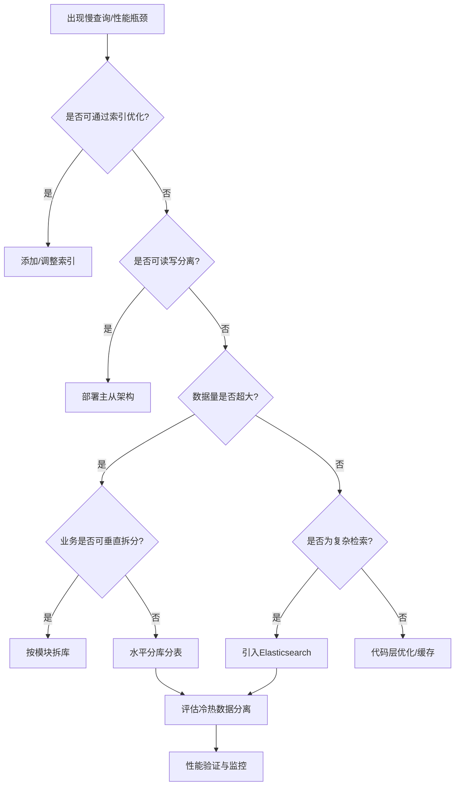
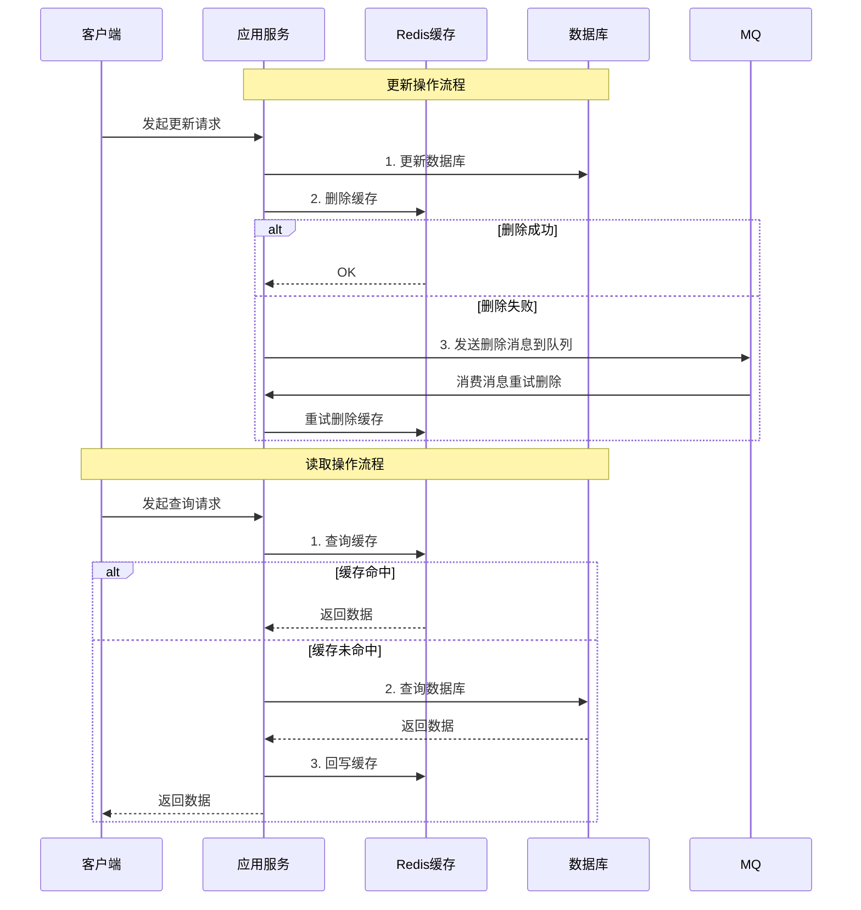
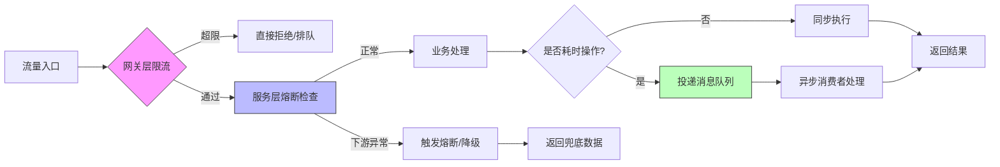
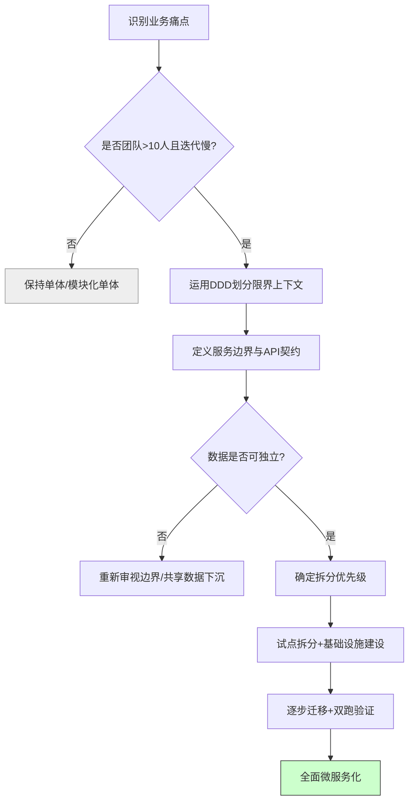

# 《从程序员到架构师：大数据量、缓存、高并发、微服务、多团队协同等核心场景实战》章节总结

## 书籍信息
- **书名**：从程序员到架构师：大数据量、缓存、高并发、微服务、多团队协同等核心场景实战
- **作者**：王伟杰
- **文件状态**：EPUB 电子书格式
- **内容识别状态**：文本内容完整，目录结构清晰，无 OCR 识别错误

## 目录说明
- **目录识别情况**：已完整识别全书章节层级，包含基础篇、进阶篇、实战篇及案例篇。
- **章节对应依据**：严格遵循 EPUB 原生导航目录（NCX）顺序进行结构化提取。
- **特殊说明**：本书为实战类技术书籍，重点在于“问题-方案-落地”的闭环，总结时侧重于架构决策逻辑与工程化实践细节。

## 全书核心主题
本书旨在解决技术人员从“代码实现者”向“系统架构师”转型过程中面临的思维与技术双重瓶颈。作者并未堆砌纯理论，而是基于真实互联网业务场景，围绕**大数据量处理、缓存设计、高并发应对、微服务治理、多团队协同**五大核心痛点展开。全书强调架构设计的本质是“权衡（Trade-off）”，通过大量一线实战案例，阐述了如何根据业务发展阶段选择合适的技术栈，如何在性能、成本、复杂度之间寻找平衡点，以及如何将技术架构与组织架构、业务流程对齐。它不仅是一本技术手册，更是一份架构师的成长方法论指南，帮助读者建立体系化的架构思维，掌握应对复杂系统的核心能力。

---

## 前言：架构师的成长之路

### 1. 核心论点
本章探讨了程序员向架构师转型的核心障碍与必备素质。
作者认为：架构师不是单纯的技术专家，而是能够利用技术手段解决复杂业务问题、并能协调多方资源达成目标的“技术领导者”；转型的关键在于从“关注局部实现”转向“关注全局价值与权衡”。

### 2. 关键概念/事件
-   **架构师画像**：具备技术深度、业务理解力、沟通协调能力、抽象建模能力及抗压能力的复合型人才。
-   **思维转变**：从确定性思维（代码逻辑）转向不确定性思维（业务变化、系统演进）；从追求完美转向追求合适。
-   **成长路径**：初级开发 → 高级开发 → 技术经理/架构师 → 首席架构师/CTO，每个阶段对软技能和硬技能的要求不同。
-   **实战导向**：脱离业务场景谈架构是空中楼阁，架构能力必须在解决实际问题的过程中习得。

### 3. 逻辑推演/叙事脉络
作者首先指出当前技术圈普遍存在的“唯技术论”误区，即过分追求新技术而忽视业务价值。接着，通过对比优秀与平庸架构师的行为差异，引出架构师的核心胜任力模型。随后，结合自身从一线开发成长为架构师的经历，说明了“在战争中学习战争”的重要性。最后，明确了本书的写作初衷：提供一套可复制的、基于真实场景的架构实战方法论，填补理论与实践之间的鸿沟。

### 4. 经典金句/数据
> “架构设计没有银弹，只有最适合当前业务阶段的解决方案。”
> “优秀的架构师不仅要懂技术，更要懂业务、懂人、懂组织。”
> “所有的架构演进，本质上都是为了解决业务规模增长带来的复杂性。”

---

## 第1章：大数据量场景下的存储与查询优化

### 1. 核心论点
本章解决海量数据存储与高效检索的性能瓶颈问题。
作者观点：面对大数据量，不能仅依赖单一数据库扩容，而应通过分库分表、读写分离、索引优化、数据归档等组合策略，结合业务特性进行分层治理。

### 2. 关键概念/事件
-   **垂直拆分 vs 水平拆分**：垂直按业务模块拆分库表；水平按数据维度（如用户ID、时间）拆分以解决单表容量上限。
-   **分片键选择**：需综合考虑查询频率、数据分布均匀性、扩容便利性，避免热点与跨片查询。
-   **冷热数据分离**：将高频访问的热数据与低频的历史冷数据物理隔离，降低主库压力与存储成本。
-   **深分页优化**：针对 `LIMIT offset, size` 性能问题，采用延迟关联、游标分页或搜索引擎替代方案。
-   **ES 异构索引**：利用 Elasticsearch 构建倒排索引，解决复杂多维查询与全文检索需求，弥补关系型数据库短板。

### 3. 逻辑推演/叙事脉络
从单表千万级数据引发的慢查询问题切入，分析 B+树索引失效的根本原因。接着介绍垂直拆分作为第一步解耦手段，再深入讲解水平拆分的策略选型与常见坑点（如分布式事务、全局ID）。随后引入读写分离架构及其数据一致性挑战。针对历史数据堆积问题，提出冷热分离与归档方案。最后，对于非主键维度的复杂查询，论证了引入 ES 作为异构数据源的必要性，并给出了双写与异步同步的实现要点。

### 4. 经典金句/数据
> “分库分表是核武器，不到万不得已不要轻易使用，因为它的运维成本和业务侵入性极高。”
> “索引不是越多越好，每一个索引都是有写入和空间成本的，要基于查询模式精准设计。”
> “当单表数据量超过 500 万或容量超过 10GB 时，就应开始规划拆分或归档方案。”

### 方法流程图：大数据量查询优化决策

---

## 第2章：缓存架构设计与高可用实践

### 1. 核心论点
本章解决高并发下数据库被击穿及响应延迟问题。
作者观点：缓存是提升性能的利器，但也是系统不稳定之源；必须系统性解决缓存穿透、击穿、雪崩、一致性等经典难题，并根据业务容忍度选择合适的一致性策略。

### 2. 关键概念/事件
-   **缓存三剑客**：穿透（查不存在的数据）、击穿（热点Key过期）、雪崩（大量Key同时过期），各有针对性防御方案（布隆过滤器、互斥锁、随机TTL）。
-   **Cache Aside Pattern**：旁路缓存模式，先更新DB再删缓存，配合重试机制保障最终一致性。
-   **多级缓存**：本地缓存（Caffeine/Guava）+ 分布式缓存（Redis），减少网络IO，但需处理节点间数据同步问题。
-   **缓存预热与降级**：大促前主动加载热点数据；缓存故障时自动降级至DB或返回兜底数据。
-   **BigKey/HotKey 治理**：通过扫描与监控发现异常Key，采用拆分、异步删除、本地缓存等手段化解风险。

### 3. 逻辑推演/叙事脉络
从接口响应时间过长引出缓存引入的动机。首先讲解缓存的基本使用模式与常见失效场景的攻防策略。接着深入探讨最棘手的一致性问题，对比 Cache Aside、Read/Write Through、Write Behind 等模式的优劣，推荐适合大多数互联网业务的“删缓存+重试”方案。然后扩展到多级缓存架构的设计要点与本地缓存同步方案。最后，从运维稳定性角度，阐述 BigKey/HotKey 的发现、预防与应急处理流程，强调监控告警的重要性。

### 4. 经典金句/数据
> “缓存的本质是用空间换时间，用一致性换可用性。”
> “不要试图保证缓存与数据库的强一致性，除非你的业务真的需要，否则最终一致性才是王道。”
> “一个 BigKey 足以拖垮整个 Redis 集群，上线前必须进行 Key 规格审查。”

### 方法流程图：缓存一致性保障机制

---

## 第3章：高并发系统设计与流量治理

### 1. 核心论点
本章解决突发流量导致系统崩溃的风险。
作者观点：高并发设计不仅是技术选型，更是容量规划、限流熔断、异步削峰、弹性伸缩的系统工程；核心思想是“保护系统不被压垮，而非无限承载所有请求”。

### 2. 关键概念/事件
-   **QPS/TPS 估算**：基于业务峰值、用户行为模型、二八法则进行科学预估，作为容量设计基准。
-   **限流算法**：计数器、滑动窗口、漏桶、令牌桶，各有适用场景；分布式限流需借助 Redis + Lua。
-   **熔断降级**：当下游服务不可用时快速失败，防止级联故障；Hystrix/Sentinel 是主流实现。
-   **异步化**：通过消息队列解耦耗时操作，将同步调用转为异步处理，提升吞吐量与响应速度。
-   **弹性伸缩**：基于 CPU/内存/QPS 指标自动扩缩容，应对流量波动，节约成本。

### 3. 逻辑推演/叙事脉络
从一次线上宕机事故复盘出发，揭示缺乏流量防护的严重后果。首先讲解如何科学评估系统容量，避免拍脑袋决策。接着详细介绍四种限流算法的原理与选型建议，以及分布式环境下的实现难点。然后引入熔断降级机制，说明其与限流的区别与配合方式。随后论述异步化改造的典型场景与消息可靠性保障。最后，结合云原生基础设施，讲解如何实现自动化弹性伸缩，形成完整的高并发防御体系。

### 4. 经典金句/数据
> “限流不是为了拒绝用户，而是为了保护系统能继续为部分用户提供正常服务。”
> “任何同步调用都可能成为系统瓶颈，能异步的一定要异步。”
> “容量规划不是一次性工作，而是随着业务发展持续迭代的动态过程。”

### 方法流程图：高并发流量治理体系

---

## 第4章：微服务架构设计与治理

### 1. 核心论点
本章解决单体应用膨胀导致的研发效率低下与部署困难问题。
作者观点：微服务不是万能药，拆分粒度应以“业务边界”而非“技术组件”为依据；服务化后必须配套完善的治理体系，否则分布式复杂度会吞噬拆分带来的收益。

### 2. 关键概念/事件
-   **DDD 领域驱动设计**：通过限界上下文划分服务边界，确保服务内聚、低耦合。
-   **服务拆分原则**：单一职责、高内聚低耦合、独立部署、数据私有化；避免过早拆分与过度拆分。
-   **API 网关**：统一入口，负责路由、鉴权、限流、协议转换，屏蔽内部服务细节。
-   **服务注册发现**：Nacos/Eureka/Consul，实现服务实例的动态管理与负载均衡。
-   **配置中心**：集中管理多环境配置，支持动态刷新，避免重启生效。
-   **链路追踪**：SkyWalking/Jaeger，可视化调用链，快速定位性能瓶颈与故障点。

### 3. 逻辑推演/叙事脉络
从单体应用的“泥球”困境说起，引出微服务的动机与代价。首先强调 DDD 在服务拆分中的指导作用，批判按技术层拆分的错误做法。接着详解拆分的具体步骤与注意事项，特别是数据拆分与事务处理。然后逐一介绍微服务基础设施的核心组件（网关、注册中心、配置中心、链路追踪）及其选型考量。最后，讨论微服务下的数据一致性挑战，对比 Saga、TCC、本地消息表等分布式事务方案的适用场景。

### 4. 经典金句/数据
> “微服务拆分的黄金法则是：如果两个功能经常一起修改，它们就应该在同一个服务里。”
> “没有完善的监控和治理，微服务就是分布式灾难。”
> “分布式事务能不用就不用，优先通过业务补偿和最终一致性解决。”

### 方法流程图：微服务拆分决策流程

---

## 第5章：多团队协同与架构落地

### 1. 核心论点
本章解决技术方案在组织中难以推进、跨团队协作效率低下的问题。
作者观点：架构不仅是技术问题，更是组织问题；康威定律决定了系统架构必然反映组织结构；架构师必须具备影响力、谈判能力和项目管理能力，才能推动架构真正落地。

### 2. 关键概念/事件
-   **康威定律**：系统设计受限于组织沟通结构，逆康威重构需先调整组织。
-   **架构评审机制**：建立标准化的评审流程与 checklist，确保方案质量与共识达成。
-   **技术债务管理**：显式记录、定期评估、纳入迭代计划偿还，避免隐性积累。
-   **跨团队协作模式**：明确接口契约、SLA、责任边界；采用联合项目组、虚拟团队等灵活组织形式。
-   **架构文档化**：ADR（架构决策记录）、C4 模型、API 文档，确保知识传承与新人上手。

### 3. 逻辑推演/叙事脉络
从一个失败的架构升级案例切入，揭示忽视组织因素的后果。首先阐释康威定律的现实意义，说明为何“技术正确”不等于“能落地”。接着介绍如何建立有效的架构评审与决策机制，让各方利益相关者参与并达成共识。然后讨论技术债务的量化与管理方法，使其可见、可控。随后分享跨团队协作的最佳实践，包括契约先行、定期对齐、冲突解决技巧。最后，强调文档化的重要性，并提供实用的模板与工具推荐。

### 4. 经典金句/数据
> “架构师最大的挑战不是设计系统，而是说服别人接受你的设计。”
> “技术债不可怕，可怕的是你不知道自己欠了多少债。”
> “好的架构文档不是写给现在的自己看的，而是写给三个月后的自己和接手的人看的。”

### 方法流程图：架构落地推进路径

---

## 附录：架构师工具箱与学习资源

### 1. 核心论点
本章提供架构师日常工作的实用工具与持续学习路径。
作者观点：善用工具能极大提升架构设计与沟通效率；学习应聚焦底层原理与思维模型，而非追逐短期热门框架。

### 2. 关键概念/事件
-   **建模工具**：Draw.io、PlantUML、Mermaid，用于绘制各类架构图与流程图。
-   **文档工具**：Notion、Confluence、Markdown，用于知识管理与协作。
-   **性能测试**：JMeter、Gatling、wrk，用于容量验证与瓶颈定位。
-   **监控告警**：Prometheus + Grafana、ELK、SkyWalking，构建可观测性体系。
-   **必读书单**：《企业应用架构模式》《凤凰架构》《设计数据密集型应用》《领域驱动设计》等经典著作。

### 3. 逻辑推演/叙事脉络
按架构师工作流分类整理工具：设计阶段、验证阶段、运维阶段、文档阶段。每类工具给出推荐理由与使用技巧。学习资源部分区分入门、进阶、高阶，涵盖书籍、博客、开源项目、会议。强调“输入-思考-输出”的学习闭环，鼓励写博客、做分享、参与开源来深化理解。

### 4. 经典金句/数据
> “工具是为思维服务的，不要沦为工具的奴隶。”
> “读十本畅销书不如精读一本经典，追十个新框架不如吃透一个底层原理。”
> “最好的学习方式是教别人，最快的成长路径是解决真实世界的复杂问题。”