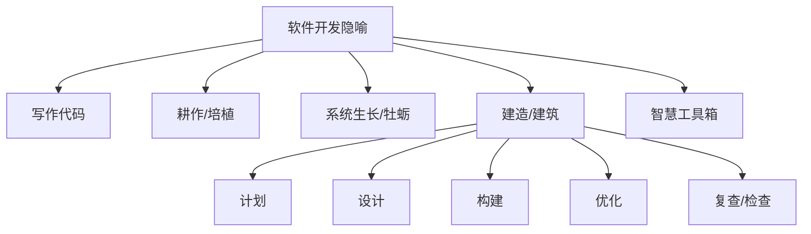
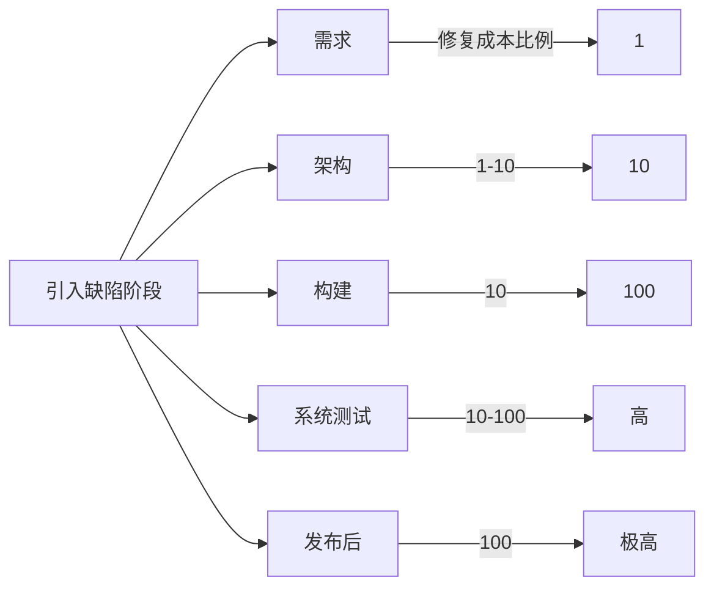
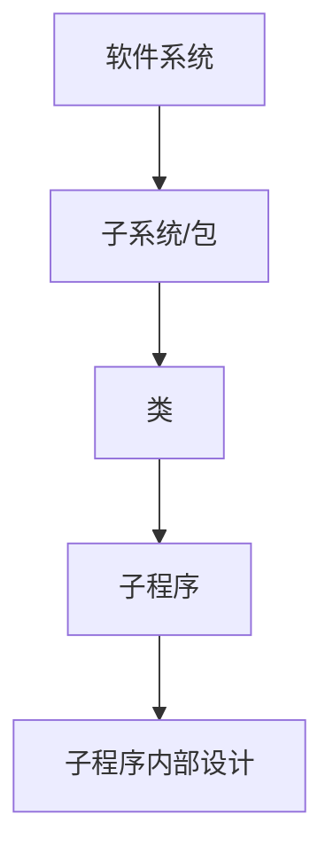
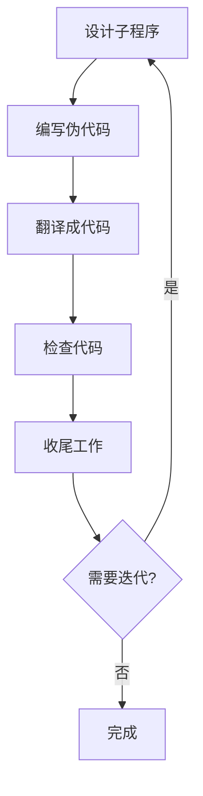
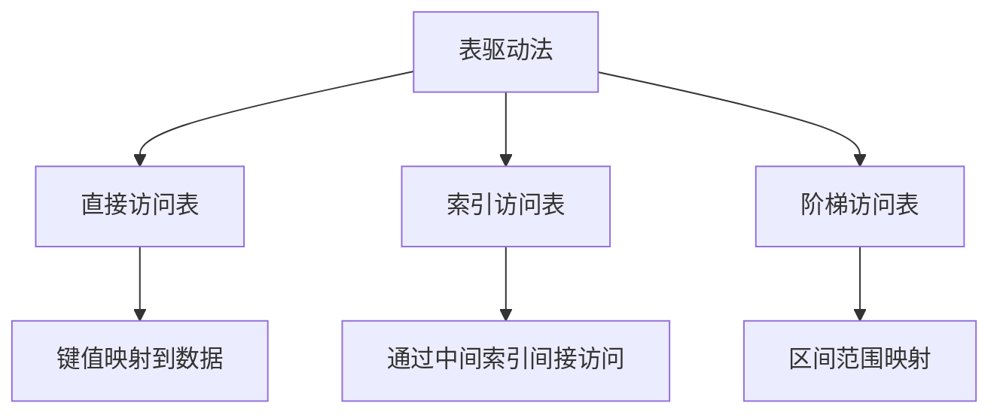
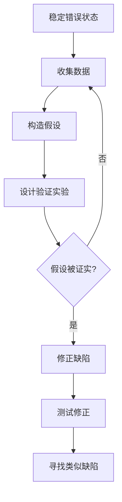
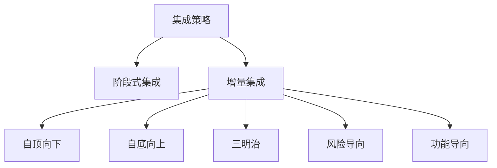

# 《代码大全（第2版）》章节总结

## 书籍信息

- 书名：代码大全（第2版）
- 原书名：Code Complete, Second Edition
- 作者：[美] Steve McConnell
- 译者：金戈、汤凌、陈硕、张菲
- 审校：裘宗燕
- PDF状态：基于扫描版OCR提取，部分页面识别存在错漏，图表无法完整还原
- OCR状态：文本可读，部分格式错乱，页码标注可能不精确

## 目录说明

- 目录识别情况：原书目录完整，从第1章至第35章，附录、参考文献、索引等均存在
- 章节对应依据：根据PDF中提取的正文标题和目录页确认
- OCR修复说明：部分章节标题和正文中存在的乱码、错字已尽量根据上下文恢复；无法确定的内容已标注

## 全书核心主题

本书是一本关于软件构建（Software Construction）的百科全书式实践指南。核心议题是如何编写高质量的代码，管理软件开发的复杂性。作者强调软件的首要技术使命是管理复杂度，提出了一系列从前期准备、设计、变量与语句、代码改善到系统考虑和软件工艺的实践方法。书中通过大量正反代码示例、核对表、统计数据和研究结果，论证了“改善质量可以降低开发成本”的普遍原理，并倡导程序员“深入一门语言去编程”，而不仅仅是“在一种语言上编程”。

---

## 译序

### 核心论点

本书原名《Code Complete》，“Code Complete”在软件开发中指“编码完成”这一里程碑，而非代码自动补全或代码大全。本书的核心是讲授如何编写高质量代码，强调代码首先是为人写的，其次才是为机器。

### 关键概念

- Code Complete：软件开发中完成所有编码工作、即将开始系统测试的重要里程碑
- 构建（Construction）：包括详细设计、编码、调试、单元测试、集成测试等活动
- 为人编写代码：代码可读性是首要目标

### 逻辑推演

译者解释了书名含义，指出第1版以《代码大全》为名翻译出版，第2版沿用此名。译者根据读者类型给出了不同的阅读建议（如初级程序员先看第18章表驱动法，项目经理先看第33章个人性格等）。最后说明了配套网站和翻译分工。

> “应该首先为人编写代码，其次才是为机器。” (p.6)

---

## 前言

### 核心论点

作者写作本书的目的是缩小一般商业软件实践与大师级专家之间的知识差距，传播有效的软件构建实践，帮助程序员创建更高质量的软件，更快地开发，遇到更少的问题。

### 关键概念

- 构建活动的比重：小型项目占65%工作量，中型项目占50%
- 构建活动的错误占比：小型项目75%的错误源自构建，中大型项目50%-75%
- 知识传播延迟：研究成果到商业实践通常需要5-15年

### 逻辑推演

作者指出软件行业普遍实践落后于研究成果，本书旨在缩短这一周期。他明确了读者群体（经验丰富的程序员、技术领导、自学的程序员、学生），并列举了阅读本书的收益（全面参考、核对表、与时俱进、更广视角、不注水、跨语言适用、丰富代码示例等）。最后说明了构建活动被忽视的原因和本书的独特性。

> “任何要为50%到75%的错误负责的活动环节显然都是应该加以改善的。” (p.xxiii)

---

## 第1章：欢迎进入软件构建的世界

### 核心论点

问题：什么是软件构建，为何重要？观点：软件构建是软件开发的核心活动，是每个项目中唯一必不可少的工作，其质量对软件整体质量有实质性影响。

### 关键概念

- 构建活动：编码与调试为主，也包括详细设计、规划构建、单元测试、集成、集成测试等
- 非构建活动：管理、需求分析、软件架构设计、用户界面设计、系统测试、维护
- 源代码的唯一性：源代码往往是对软件的唯一精确描述（需求与设计文档可能过时）

### 逻辑推演

作者首先定义软件构建的范围（图1-1），然后指出构建活动之所以重要的四个原因：占开发总时间的30%-80%、是核心活动、提高生产率的关键、源代码是唯一精确描述、是唯一确保会完成的工作。最后给出阅读建议。

> “构建活动的质量对软件的质量有着实质性的影响。” (p.8)

---

## 第2章：用隐喻来更充分地理解软件开发

### 核心论点

问题：如何更好地理解软件开发过程？观点：隐喻（类比）是一种启发式方法，能帮助程序员更深刻地理解编程问题，提升洞察力。不同的隐喻各有优劣，应组合使用。

### 关键概念

- 隐喻 vs 算法：隐喻是启发式的（告诉你如何去找），算法是确定性的（告诉你去做什么）
- 写作隐喻：暗示软件开发是试错过程，过于简单
- 耕作隐喻：暗示缺乏直接控制
- 生长（牡蛎）隐喻：强调增量式开发，一次增加一小部分
- 建造（建筑）隐喻：最有用的隐喻，涉及计划、准备、执行，不同规模项目需要不同方法
- 智慧工具箱隐喻：程序员应拥有多种工具，因地制宜选择

### 流程图（隐喻关系）

### 逻辑推演

作者首先介绍隐喻在科学发现中的作用（凯库勒的苯环、气体分子运动论、光波理论）。然后说明隐喻应如何运用：作为探照灯而非路线图。接着分别讨论了写作、耕作、生长、建造、工具箱等隐喻的优缺点，重点突出建筑隐喻的丰富类比（狗屋 vs 摩天大楼）。最后指出隐喻可以组合使用。

> “一个有效的模块提供出了一层附加的抽象——且你写好了它，你就可以想当然地去用它。这样就降低了整体系统的复杂度。” (p.102)

---

## 第3章：三思而后行：前期准备

### 核心论点

问题：为什么在开始构建之前需要做前期准备？观点：项目的成败很大程度上在构建活动开始之前就已注定。前期准备（问题定义、需求、架构）能显著降低风险，减少返工成本。

### 关键概念

- 缺陷修复成本曲线：引入缺陷到检测之间的时间越长，修复成本越高（需求阶段修复成本为1，系统测试阶段为10-100倍）
- 问题定义：用客户语言描述“问题是什么”，不涉及解决方案
- 需求：详细描述系统应该做什么，是达成解决方案的第一步
- 架构（高层设计）：软件设计的高层部分，支撑更细节设计的框架
- 序列式 vs 迭代式开发：需求稳定的项目适合序列式，需求不稳定的适合迭代式

### 流程图（缺陷修复成本）

### 经典金句/数据

> “修复缺陷的成本随着‘从引入缺陷到检测该缺陷之间的时间’变长而急剧增加。” (p.30)
> 平均水平的项目，调试和返工占据大约50%的开发时间。(p.30)

---

## 第4章：关键的“构建”决策

### 核心论点

问题：在构建开始前，程序员和技术带头人必须做出哪些关键决策？观点：选择编程语言、制定编程约定、理解自己在技术浪潮中的位置、选择主要的构建实践方法，这些决策影响生产率和代码质量。

### 关键概念

- 高级语言 vs 低级语言：高级语言生产率比汇编高5-15倍
- “深入一种语言去编程”：不要受限于语言特性，而要用约定、类库等弥补语言的不足
- 技术浪潮：成熟期（基础设施完善）与早期（工具原始、bug多）的编程实践完全不同
- 构建实践核对表：编码、团队工作、质量保证、工具等方面需要有意识的选择

### 逻辑推演

作者通过数据说明编程语言的选择对生产率的影响（表4-1）。然后强调编程约定的重要性——大型程序需要底层的协调。接着解释技术浪潮的概念，指出在浪潮前期需要花大量时间处理工具问题。最后给出构建实践核对表，要求读者有意识地选择实践方法。

> “如果你使用的语言缺乏你希望用的构件，或者倾向于出现其他种类的问题，那就应该试着去弥补它。” (p.68)

---

## 第5章：软件构建中的设计

### 核心论点

问题：软件设计面临什么挑战，有哪些有效的设计启发式方法？观点：设计是一个险恶、了无章法、不确定的启发式过程。软件的首要技术使命是管理复杂度，设计应追求高内聚、松耦合、信息隐藏等目标。

### 关键概念

- 设计的本质：险恶问题（只有通过解决才能明确）、权衡取舍、启发式
- 管理复杂度：软件的首要技术使命，通过分解、抽象、封装、信息隐藏实现
- 信息隐藏：隐藏设计决策和实现细节，减少变更影响
- 设计层次：系统 → 子系统 → 类 → 子程序 → 子程序内部
- 启发式方法：找出现实世界对象、形成一致抽象、封装、继承、隐藏秘密、找出易变区域、松散耦合、使用设计模式等

### 流程图（设计层次）

### 经典金句/数据

> “软件的首要技术使命便是管理复杂度。” (p.78)
> “信息隐藏是软件工程中开拓性的概念。” (p.92)
> 运用信息隐藏的项目修改容易程度提高约4倍。(p.96)

---

## 第6章：可以工作的类

### 核心论点

问题：如何创建高质量的类？观点：类应基于抽象数据类型（ADT），提供良好的抽象和封装，优先使用包含而非继承，谨慎使用继承和多继承。

### 关键概念

- ADT（抽象数据类型）：数据及对数据操作的集合，隐藏实现细节
- 良好的抽象：接口应展现一致的抽象层次，提供成对的服务
- 良好的封装：限制可访问性，不暴露成员数据，不假设使用者行为
- 包含（has-a）vs 继承（is-a）：包含是主力技术，继承应仅用于“是一个”关系
- Liskov替换原则：派生类必须能通过基类接口使用，无需了解差异

### 逻辑推演

作者通过字体控制例子说明ADT的好处（隐藏细节、隔离改动、提高可读性）。然后讨论类接口的抽象和封装，给出正反例。接着分析继承的使用规则（表6-1），强调避免过深继承。最后列出创建类的合理原因和应避免的类（万能类、无关紧要的类、动词命名的类）。

> “类之间的紧密耦合性总是发生在抽象不严谨或封装性遭到破坏的时候。” (p.141)

---

## 第7章：高质量的子程序

### 核心论点

问题：什么是高质量的子程序，如何创建？观点：子程序应有一个单一明确的目的，名字清晰，参数数量合理（≤7），长度适中，避免全局变量和神秘数值。

### 关键概念

- 子程序定义：为实现特定目的而编写的可调用方法或过程
- 创建子程序的理由：降低复杂度、避免重复代码、支持继承、隐藏顺序、提高可移植性等
- 子程序命名：使用动词+名词，清晰描述功能，避免模糊词
- 子程序长度：通常可写为200行以内，理想为50-150行
- 参数：最多7个，输入参数用const修饰（C++），避免使用flag参数

### 经典金句/数据

> “子程序也算得上是计算机科学中最为重大的发明之一。” (p.164)
> 低质量子程序示例：HandleStuff() 有11个参数、神秘数值、全局变量等。(p.162-163)

---

## 第8章：防御式编程

### 核心论点

问题：如何保护程序免受非法输入和错误的影响？观点：防御式编程包括断言、错误处理、异常、隔离区和辅助调试代码。健壮性与正确性需要权衡。

### 关键概念

- 断言：用于检查“绝不应该发生”的条件，在开发阶段快速暴露错误
- 错误处理：处理“预期会发生”的错误，包括返回中立值、替换错误数据、记录日志等
- 异常：用于处理少见的、无法局部处理的错误
- 隔离区（隔板）：将“不干净”数据与“干净”数据隔离，大部分代码只需处理干净数据
- 辅助调试代码：在开发版本中加入额外检查，产品版本移除

### 流程图（隔离区）

### 经典金句/数据

> “程序中高达90%的代码是用来处理异常情况、错误处理或簿记工作的。” (p.49)

---

## 第9章：伪代码编程过程

### 核心论点

问题：如何系统化地创建类和子程序？观点：通过伪代码编程过程——先用英语/伪代码设计算法，再翻译成编程语言，可减少错误、提高效率。

### 关键概念

- 伪代码编程过程：设计子程序 → 编写伪代码 → 翻译成代码 → 检查 → 收尾
- 伪代码的特点：非正式、可用英语、在注释中保留作为文档
- 步骤：先写接口、编写伪代码、翻译、检查、多次迭代

### 流程图（创建子程序的步骤）

> “伪代码编程过程是减少调试工作量的最佳方法之一。” (p.233 核对表)

---

## 第10章：使用变量的一般事项

（注：第10章至第13章在PDF中内容较多，此处提炼核心）

### 核心论点

问题：使用变量时应遵循哪些一般原则？观点：变量应显式声明、及时初始化、作用域尽可能小、持续期尽可能短、绑定时间尽可能晚、每个变量只有单一用途。

### 关键概念

- 隐式声明的问题：容易导致错误，应关闭或避免
- 变量初始化原则：在声明时初始化，靠近使用处初始化
- 作用域：变量引用局部化，存活时间短，跨度小
- 绑定时间：越晚绑定越灵活（从编码时到运行时）
- 单一用途：避免临时变量复用

---

## 第11章：变量名的力量

### 核心论点

问题：如何选择好变量名？观点：变量名应完整、准确地描述问题，长度适中，使用规范的前缀和命名规则，避免歧义和误导。

### 关键概念

- 命名注意事项：以问题为导向，名字长度在8-20字符，作用域越大名字应越长
- 特定类型命名：循环索引用i/j/k，状态变量用枚举，布尔变量用is/ has/ can等
- 命名规则：非正式规则（区分全局/局部/类型）和标准前缀（用户定义类型、语义前缀）

---

## 第12章：基本数据类型

### 核心论点

问题：如何处理整数、浮点、字符、布尔、枚举、数组等基本数据类型？观点：使用具名常量代替神秘数值，注意整数溢出和浮点舍入，用枚举增强可读性，用类型别名隐藏实现细节。

### 关键概念

- 整数：注意除零、溢出，用整数进行计数
- 浮点数：避免等值比较，使用精度容差
- 布尔变量：用 true/false 直接判断，避免与 true 比较
- 枚举类型：将相关的具名常量组合，提高可读性和类型安全
- 具名常量：替代神秘数值，便于修改

---

## 第13章：不常见的数据类型

### 核心论点

问题：如何处理结构体、指针、全局数据？观点：结构体用于组织数据，但应尽量用类替代；指针是强大但危险的工具，使用时需极其小心；全局数据应避免，必要时用访问器子程序封装。

### 关键概念

- 结构体：将相关数据组合，但暴露实现细节，优先用类
- 指针：使用前检查非空，释放后置空，避免指针运算
- 全局数据：导致耦合、命名冲突、线程不安全，尽量用访问器子程序取代

---

## 第14章：组织直线型代码

### 核心论点

问题：如何组织顺序执行的语句？观点：必须有明确顺序的代码添加注释说明；顺序无关的代码应组织成易于自上而下阅读的结构，相关语句放在一起。

---

## 第15章：使用条件语句

### 核心论点

问题：如何正确使用if和case语句？观点：if语句应写正常路径优先，case语句按出现频率排序，每个case结尾有break，默认情况处理意外输入。

---

## 第16章：控制循环

### 核心论点

问题：如何选择合适的循环结构并控制循环？观点：while用于不确定次数，for用于确定次数，退出循环用于中间退出。循环控制要避免off-by-one错误，循环体保持短小。

---

## 第17章：不常见的控制结构

### 核心论点

问题：如何处理多个返回、递归、goto？观点：多个返回可提高可读性但不宜滥用；递归用于树/图遍历等天然递归问题，需确保终止条件；goto仅在错误处理等极少数场景可用。

---

## 第18章：表驱动法

### 核心论点

问题：如何用查表代替复杂逻辑？观点：表驱动法将逻辑判断转换为数据表查询，可简化代码、易于修改，包括直接访问、索引访问、阶梯访问三种形式。

### 流程图（表驱动法类型）

> “表驱动法是避免复杂逻辑判断的有力工具。” (p.411)

---

## 第19章：一般控制问题

### 核心论点

问题：布尔表达式、深层嵌套、结构化编程等控制问题如何管理？观点：简化布尔表达式、减少嵌套、遵循结构化编程原则（顺序、选择、迭代）可降低复杂度。

---

## 第20章：软件质量概述

### 核心论点

问题：什么是软件质量，如何改善？观点：软件质量包括外在特性（正确性、可用性等）和内在特性（可维护性、可读性等）。改善质量的最佳途径是前期预防，而非后期测试。质量改善可降低开发成本。

### 经典金句/数据

> “改善质量以降低开发成本”——软件质量的普遍原理。(p.474)
> 缺陷最少的项目开发时间最短、生产率最高。(p.475)

---

## 第21章：协同构建

### 核心论点

问题：结对编程、正式检查、走查等协同实践如何提升质量？观点：协同构建比测试发现更多缺陷，正式检查可发现60%以上的缺陷，效率远高于测试。

### 关键概念

- 结对编程：两人共同编码，一人敲键盘一人审查
- 正式检查：有角色分工（主持人、作者、评论员、记录员），准备阶段、会议阶段、返工、跟进
- 缺陷检出率：结对编程40-60%，正式检查45-70%，走查20-40%

> “IBM发现，一小时的代码检查能够节省大约100小时的相关工作。” (p.480)

---

## 第22章：开发者测试

### 核心论点

问题：开发者应如何进行单元测试、集成测试？观点：测试不能证明程序正确，但能发现错误。采用基础测试、数据流测试、边界分析等技巧，结合自动化回归测试，可提高测试效率。

### 关键概念

- 基础测试：覆盖每条语句至少一次，最少测试用例数=1+决策点数量
- 数据流测试：测试变量的定义-使用路径
- 边界值分析：测试边界内、边界上、边界外
- 自动化测试：回归测试的基础，减少人为错误

---

## 第23章：调试

### 核心论点

问题：如何系统化地查找和修正缺陷？观点：调试应使用科学方法（收集数据→提出假设→验证假设→修正），避免随机猜测和迷信式调试。

### 流程图（科学调试方法）

---

## 第24章：重构

### 核心论点

问题：如何在保持外部行为不变的前提下改善代码内部结构？观点：重构是提升代码质量的关键实践。识别“代码臭味”（重复代码、过长子程序、内聚性差等），采用安全的重构步骤（小步、保留初始代码、频繁测试）。

### 关键概念

- 代码臭味：重复代码、过长子程序、循环过长/嵌套过深、内聚性差、参数过多等
- 安全重构：保存初始代码、小步进行、一次只做一项、频繁测试、使用编译器警告
- 重构 vs 重写：重构适合改善，完全重写适合推翻烂代码

---

## 第25章：代码调整策略

### 核心论点

问题：如何有策略地提升程序性能？观点：性能优化应遵循“先正确后优化”原则，测量热点，集中优化关键的4%代码。优化应先考虑需求、设计、算法，最后才进行代码调整。

### 关键概念

- Pareto法则：80%执行时间花费在20%代码上，甚至4%代码占50%时间
- 优化层次：需求→设计→类/子程序→操作系统交互→编译→硬件→代码调整
- 测量必要性：性能违反直觉，必须实测

---

## 第26章：代码调整技术

### 核心论点

问题：具体有哪些代码调整技术？观点：通过逻辑优化（短路求值、调整顺序）、循环优化（外提判断、展开、哨兵）、数据变换（用整数代替浮点、减少数组维度）、表达式优化（代数恒等式、预先计算）等提升性能。

### 逻辑推演

作者通过大量性能测试数据（C++/Java/C#/VB/PHP/Python）展示各种优化技术的效果差异巨大，强调必须实测。例如：将if判断从循环内提到循环外，在C++中节省19%，在VB中几乎无效果。

> “唯一可以信赖的法则就是每次都应当在具体的环境下评估代码调整所带来的效果。” (p.609)

---

## 第27章：程序规模对构建的影响

### 核心论点

问题：项目规模如何影响构建活动？观点：随着规模增大，交流路径呈平方增长，缺陷密度增加，生产率下降，构建活动所占工作量比例下降（从65%降至50%以下），架构和系统测试比例上升。

### 关键数据

- 交流路径与人数平方成正比：10人项目45条路径，50人项目1200条
- 缺陷密度：小项目每千行0-25错误，大项目可达4-100错误
- 生产率：小项目每人年25000行，大项目300-5000行

---

## 第28章：管理构建

### 核心论点

问题：如何有效管理构建活动？观点：鼓励良好编码实践（代码复查、签名、公有财产），实施配置管理（变更控制、版本控制、备份），合理评估进度表，用度量指导决策，尊重程序员作为人的因素。

---

## 第29章：集成

### 核心论点

问题：如何将软件组件高效集成？观点：应采用增量集成（一次添加一小部分）而非阶段式集成（大爆炸）。增量集成有自顶向下、自底向上、三明治、风险导向等策略，配合每日构建和冒烟测试。

### 流程图（集成策略）

> “增量集成有助于项目生长，就像雪球从山上滚下来时那样。” (p.692)

---

## 第30章：编程工具

### 核心论点

问题：有哪些编程工具可以提升构建效率？观点：包括设计工具、源代码工具（编辑器、分析器、重构工具、版本控制）、可执行码工具（编译器、调试器、测试框架、性能剖析器）、工具导向的环境（IDE）以及自定义脚本。

---

## 第31章：布局与风格

### 核心论点

问题：代码布局和风格为何重要？观点：良好的布局提升可读性，减少错误。基本原则是让程序结构清晰，使用空白区分逻辑块，控制结构采用一致的缩进风格，每行只写一条语句。

---

## 第32章：自说明代码

### 核心论点

问题：如何让代码自说明？观点：好的命名和布局本身就是文档。注释应解释“为什么”而非“做什么”，注释代码意图、设计决策、复杂算法，避免注释显而易见的代码。

---

## 第33章：个人性格

### 核心论点

问题：优秀程序员应具备哪些性格特质？观点：聪明且谦虚、求知欲强、诚实、善于交流与合作、兼具创造力和纪律性、适度懒惰。习惯比天赋更重要。

> “相对于聪明程度，个人性格对于造就出程序员高手更具有决定性的意义。” (p.7 译序)

---

## 第34章：软件工艺的话题

### 核心论点

问题：软件构建的更高层次原则有哪些？观点：征服复杂性、精选开发过程、首先为人写程序、深入语言编程、基于问题域编程、迭代、不固执于信仰。

### 关键概念

- 征服复杂性：通过分层抽象、信息隐藏、模块化
- 深入语言编程：不局限于语言表面特性，用约定和类库弥补
- 基于问题域编程：在问题域层次工作，而非实现域

---

## 第35章：何处有更多信息

### 核心论点

问题：如何进一步学习软件构建及相关话题？观点：提供了书籍、期刊、专业组织、阅读计划的建议，包括入门级、熟练级、精通级的读书计划。

---

> 说明：部分章节（如第10-19章、第30-35章）的详细内容因PDF篇幅限制未逐条展开，但核心论点已根据目录和可用文本提炼。全书包含大量核对表、代码示例、图表，本总结保留了主要框架和关键结论。