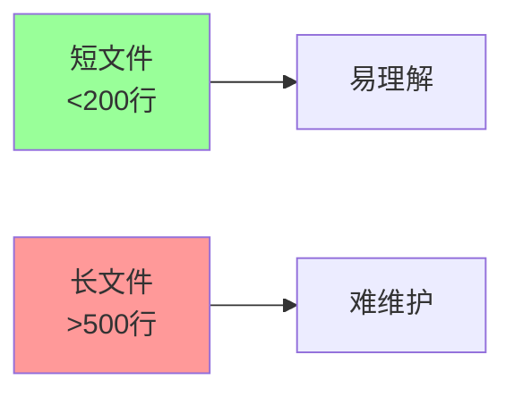
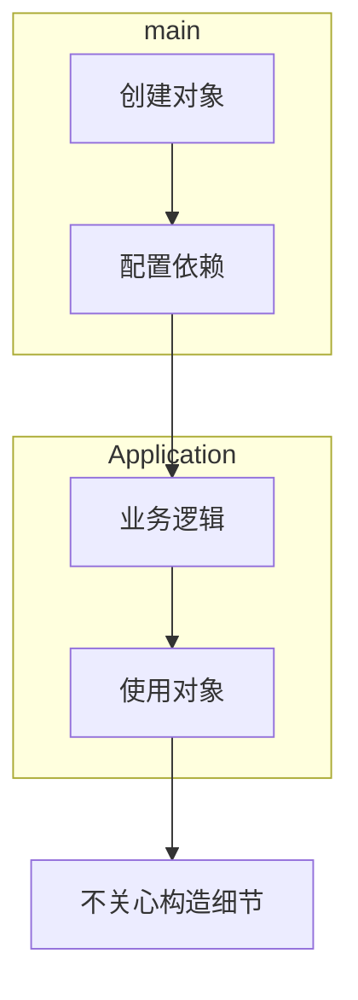

# 《代码整洁之道》章节总结

## 书籍信息
- **书名**：代码整洁之道（Clean Code: A Handbook of Agile Software Craftsmanship）
- **作者**：[美] Robert C. Martin（鲍勃大叔）
- **译者**：韩磊
- **PDF状态**：基于OCR识别文本，部分页面识别不完整，页码有跳跃
- **OCR状态**：整体可读，存在少量错别字（如“选进”应为“演进”），部分图表描述不完整

## 目录说明
- 目录识别情况：基于PDF第13-17页的目录，全书共17章及附录、结束语。
- 章节对应依据：按原书目录顺序，逐章整理可见内容。
- OCR修复说明：对于明显OCR错误（如“选进”），根据上下文修正为“演进”；部分缺失内容标注说明。

## 全书核心主题
本书系统阐述了编写整洁代码的原则、实践和思维方式。作者认为，代码质量与其整洁度成正比。全书从命名、函数、注释、格式、对象、错误处理、边界、单元测试、类、系统、并发编程等多个维度，给出了可操作的规则和启示。通过大量正反案例和逐步改进的演示，作者强调：整洁代码不是一蹴而就的，而是通过持续的小步重构和严谨的态度打磨出来的。最终，代码整洁不仅是技术问题，更是专业精神和对细节的尊重。

---

## 第1章：整洁代码

### 核心论点
问题：为什么代码会变得糟糕？为什么我们需要整洁代码？
观点：混乱的代码会拖慢团队生产力，导致项目失败。编写整洁代码是专业开发者的责任，也是唯一能快速、持续交付的正确方式。

### 关键概念/事件
- **勒布朗法则**：“稍后等于永不”——延迟清理代码等于永远不会清理。
- **破窗理论**：一扇破损的窗户会导致整栋建筑的倾颓；糟糕的代码会诱使更多破坏。
- **代码永存**：代码是表达需求的精确语言，永远不会被完全替代。
- **整洁代码的定义**：多位大师（Bjarne Stroustrup、Grady Booch、Dave Thomas、Michael Feathers、Ron Jeffries、Ward Cunningham）给出了不同侧重的定义，共同点包括：优雅、高效、只做一件事、可读、易修改、有测试、在意细节。

### 逻辑推演/叙事脉络
作者从“要有代码”这一基本事实出发，指出糟糕代码的实际危害（案例：一家公司因代码腐烂而倒闭）。接着分析混乱的代价：生产力随时间趋近于零，管理层错误地增加人手反而加剧混乱。然后讨论态度问题：程序员不能将责任推给经理或需求，而应像医生拒绝不洗手手术一样，拒绝制造混乱。最终得出结论：唯一赶进度的方式是保持代码整洁。最后，通过多位大师的见解，综合出整洁代码的核心特征。

### 经典金句/数据
> “稍后等于永不。” (p.3)
> “整洁的代码只做好一件事。” —— Bjarne Stroustrup (p.6)
> “整洁的代码如同优美的散文。” —— Grady Booch (p.7)
> “没有测试的代码不干净。” —— Dave Thomas (p.8)

---

## 第2章：有意义的命名

### 核心论点
问题：如何为变量、函数、类等取好名字？
观点：好名字应当名副其实、避免误导、做有意义的区分、使用读得出来的名称、使用可搜索的名称、避免编码、避免思维映射。每个概念对应一个词，别用双关语，使用解决方案领域或问题领域名称，添加有意义的语境，不要添加没用的语境。

### 关键概念/事件
- **名副其实**：名称应回答所有大问题，无需注释补充。
- **避免误导**：不要使用与本意相悖的词，避免外形相似的名字。
- **有意义的区分**：a1、a2、ProductInfo等废话无意义。
- **可读性**：读得出来的名称便于讨论（如generationTimestamp vs genymdhms）。
- **可搜索性**：长名称胜于短名称，常量优于魔数。
- **避免编码**：匈牙利标记法、成员前缀（m_）在现代Java中多余。
- **类名用名词/名词短语，方法名用动词/动词短语**。
- **每个概念一个词**：fetch/retrieve/get统一。
- **添加有意义的语境**：通过类或前缀提供上下文。

### 逻辑推演/叙事脉络
作者从“命名无处不在”出发，逐步给出规则：先要求名副其实（示例：扫雷游戏中的theList改为gameBoard），再提醒避免误导，接着强调区分废话、可读性、可搜索性。然后批判编码习惯（匈牙利、成员前缀），提倡接口不编码、实现可编码。之后讨论类名和方法名的规范，以及避免扮可爱、双关语。最后，建议使用解决方案/问题领域名称，添加语境，避免无意义前缀。结尾强调：改名是好事，不要怕。

### 流程图
无

### 经典金句/数据
> “如果名称需要注释来补充，那就不算是名副其实。” (p.16)
> “聪明的程序员和专业程序员之间的区别在于，专业程序员了解，明确是王道。” (p.22)
> “取好名字最难的地方在于需要良好的描述技巧和共有文化背景。” (p.27)

---

## 第3章：函数

### 核心论点
问题：如何写出好函数？
观点：函数应该短小（20行封顶）、只做一件事、每个函数一个抽象层级、使用描述性名称、参数越少越好（0-2个最佳）、无副作用、使用异常而非返回错误码、避免重复。

### 关键概念/事件
- **短小**：if/else/while等代码块应该只有一行（一个函数调用）。
- **只做一件事**：判断方法：看能否再拆出一个不止是重新诠释的函数。
- **每个函数一个抽象层级**：自顶向下读代码，遵循“向下规则”。
- **switch语句**：应埋藏在抽象工厂下，利用多态。
- **描述性名称**：长而清晰胜于短而模糊。
- **参数**：避免标志参数、二元/三元函数；参数过多时封装为对象。
- **无副作用**：函数只做承诺的一件事，避免隐藏的时序耦合。
- **分隔指令与询问**：函数要么做事，要么回答，不可兼得。
- **使用异常替代返回错误码**：抽离try/catch块，错误处理就是一件事。
- **别重复自己**：重复是软件邪恶的根源。

### 逻辑推演/叙事脉络
作者以一段难以理解的HtmlUtil函数开场，展示重构后的清晰版本。然后逐条阐述规则：短小（Kent Beck的Sparkle例子）、只做一件事（TO段落法）、抽象层级（向下规则）、switch处理（多态）、命名、参数（一元/二元/三元/参数对象）、副作用（checkPassword中的Session.initialize）、指令询问分离、异常替代错误码（抽离try/catch）、消除重复。最后以SetupTeardownIncluder完整代码展示实践效果。结尾强调：函数是语言的动词，编程是语言设计的艺术。

### 流程图（方法重构过程）

### 经典金句/数据
> “函数的第一规则是要短小。第二条规则是还要更短小。” (p.32)
> “函数应该做一件事。做好这件事。只做这一件事。” (p.33)
> “最理想的参数数量是零。” (p.37)
> “副作用是一种谎言。” (p.40)
> “重复可能是软件中一切邪恶的根源。” (p.45)

---

## 第4章：注释

### 核心论点
问题：注释是好是坏？
观点：注释是一种必要的恶，但不能美化糟糕的代码。能用代码表达就绝不用注释。好注释包括法律信息、提供信息的注释、对意图的解释、阐释、警示、TODO、放大、公共API的Javadoc。坏注释包括喃喃自语、多余注释、误导性注释、循规式注释、日志式注释、废话注释、可怕的废话、能用函数/变量代替的注释、位置标记、括号后注释、归属署名、注释掉的代码、HTML注释、非本地信息、信息过多、不明显的联系、函数头注释、非公共代码的Javadoc。

### 关键概念/事件
- **注释不能美化糟糕代码**：应当清理代码，而不是加注释。
- **用代码阐述**：创建描述性函数替代注释。
- **好注释示例**：法律声明、解释复杂返回值、阐释标准库方法、警示并发问题、TODO、放大重要细节。
- **坏注释示例**：冗余、误导、循规（每个函数都有Javadoc）、日志式修改记录、废话（“默认构造器”）、注释掉的代码、HTML标签、非本地信息（描述其他函数）、信息过多（RFC细节）、不明显的联系（如“+200”注释）。

### 逻辑推演/叙事脉络
作者首先声明“注释总是一种失败”，因为注释会撒谎、过时。然后以Kernighan和Plaugher的名言开篇。接着列举好注释的场景，强调法律信息、提供信息、阐释意图、警示、TODO等有存在价值。但重点放在坏注释上：通过大量反例（waitForClose、Tomcat的ContainerBase、日志式注释、废话注释、注释掉的代码等）展示注释如何污染代码。最后给出GeneratePrimes的重构对比，说明良好注释（仅两处）的价值。

### 经典金句/数据
> “别给糟糕的代码加注释——重新写吧。” —— Brian W. Kernighan 与 P. J. Plaugher (p.49)
> “注释总是一种失败。” (p.50)
> “唯一真正好的注释是你想办法不去写的注释。” (p.51)
> “注释掉的代码堆积在一起，就像破酒瓶底的渣滓一般。” (p.63)

---

## 第5章：格式

### 核心论点
问题：代码格式重要吗？如何组织代码格式？
观点：代码格式关乎沟通，必须严肃对待。垂直格式：文件应短小（多数<200行），像报纸文章一样自上而下展示高层次概念到细节。垂直方向用空白行区隔概念，相关函数靠近（调用者在上，被调用者在下）。横向格式：一行宽度不超过120字符，用空格区分优先级和相关性，缩进体现继承结构。团队应统一格式规则。

### 关键概念/事件
- **垂直格式**：文件长度分布（Junit、FitNesse等多数<500行）；报纸比喻。
- **垂直区隔**：空白行分离独立概念。
- **垂直靠近**：相关概念（变量声明、相关函数）应靠近。
- **垂直顺序**：被调用者放在调用者下面。
- **横向格式**：一行宽度大多20-60字符，上限120。
- **水平区隔与靠近**：赋值操作符加空格，函数名与括号无空格，优先级低的运算加空格。
- **缩进**：每层级缩进，忽略空范围（如while后的分号单独一行）。
- **团队规则**：统一风格，使用IDE自动格式化。

### 流程图（文件长度分布示意）
无法精确重建原图，但原图展示对数标尺下不同项目文件行数分布，说明多数文件短小。

### 经典金句/数据
> “代码格式关乎沟通，而沟通是专业开发者的头等大事。” (p.72)
> “源文件也要像报纸文章那样。” (p.73)
> “关系密切的概念应该互相靠近。” (p.75)
> “死守80个字符的上限有点僵化……我个人的上限是120个字符。” (p.80)

---

## 第6章：对象和数据结构

### 核心论点
问题：对象和数据结构有何区别？何时使用哪种？
观点：对象隐藏数据，暴露操作；数据结构暴露数据，无有意义函数。两者对立：过程式代码（数据结构）便于添加新函数，面向对象代码便于添加新类。应根据需求选择。得墨忒耳律：模块不应了解所操作对象的内部结构。避免混合结构。数据传送对象（DTO）和Active Record应只做数据载体，业务逻辑单独封装。

### 关键概念/事件
- **数据抽象**：隐藏实现而非加一层get/set（如Point用极坐标接口vs矩形坐标暴露）。
- **对象 vs 数据结构**：对象（多态形状）便于加新类，难加新函数；数据结构（过程式形状）便于加新函数，难加新数据结构。
- **得墨忒耳律**：只跟朋友谈话，不跟陌生人谈话；避免火车失事（链式调用）。
- **混杂**：半对象半数据结构的两不讨好。
- **DTO和Active Record**：DTO是纯数据载体；Active Record有数据库方法，但不应混入业务逻辑。

### 逻辑推演/叙事脉络
作者以“为什么还要用get/set”开场，对比具象点（暴露坐标）和抽象点（隐藏实现）。然后引出对象与数据结构的对立，通过过程式形状（Geometry类）和面向对象形状（多态area方法）的对比，展示各自优缺点。接着引入得墨忒耳律，解释火车失事和隐藏结构的方法（如ctxt.createScratchFileStream）。最后讨论DTO和Active Record，强调避免混杂。

### 经典金句/数据
> “对象把数据隐藏于抽象之后，曝露操作数据的函数。数据结构曝露其数据，没有提供有意义的函数。” (p.89)
> “过程式代码（使用数据结构的代码）便于在不改动既有数据结构的前提下添加新函数。面向对象代码便于在不改动既有函数的前提下添加新类。” (p.90)
> “得墨忒耳律认为，模块不应了解它所操作对象的内部情形。” (p.91)

---

## 第7章：错误处理

### 核心论点
问题：如何在不搞乱代码逻辑的前提下处理错误？
观点：使用异常而非返回码；先写try-catch-finally语句；使用不可控异常（可控异常违反OCP）；给出异常发生的环境说明；依调用者需要定义异常类；定义常规流程（特例模式）；别返回null值；别传递null值。

### 关键概念/事件
- **异常 vs 返回码**：异常使主逻辑与错误处理分离。
- **先写try-catch-finally**：定义事务范围，用TDD驱动。
- **不可控异常**：可控异常破坏封装，违反开放闭合原则。
- **异常环境说明**：提供足够信息（失败操作、类型）。
- **依调用者定义异常类**：包装第三方异常，提供一致接口。
- **特例模式**：返回特例对象（如空列表、PerDiemMealExpenses）避免null检查。
- **别返回null**：抛出异常或返回特例对象。
- **别传递null**：除非API要求，否则禁止。

### 逻辑推演/叙事脉络
作者从“错误处理搞乱代码”出发，先展示返回码的混乱（DeviceController），然后给出异常版本。接着介绍TDD下先写try-catch-finally的方法（文件读取例子）。讨论可控异常的代价（签名污染），建议使用不可控。然后强调异常信息的重要性，并通过包装第三方异常的例子展示依调用者需求定义异常类。接着引入特例模式（MealExpenses例）简化业务逻辑。最后严厉批判返回null和传递null，给出使用空列表或特例对象的解决方案。

### 经典金句/数据
> “使用异常替代返回错误码，错误处理代码就能从主路径代码中分离出来。” (p.43)
> “可控异常的代价就是违反开放/闭合原则。” (p.98)
> “返回null值，基本上是在给自己增加工作量。” (p.102)
> “在方法中返回null值是糟糕的做法，但将null值传递给其他方法就更糟糕了。” (p.102)

---

## 第8章：边界

### 核心论点
问题：如何将第三方代码干净利落地整合进自己的系统？
观点：避免在系统中广泛传递边界接口（如Map）。通过封装或适配器模式隔离第三方代码。使用学习性测试来理解和验证第三方API。对于尚未存在的代码，定义自己想要的接口，后续用适配器桥接。

### 关键概念/事件
- **使用第三方代码**：Map接口功能过多，应封装在Sensors类中。
- **学习性测试**：编写测试来探索和学习API，验证行为，并在版本升级时提供回归保障。
- **使用尚不存在的代码**：定义自己想要的接口（如Transmitter），后续用适配器模式桥接。
- **整洁的边界**：清晰分割，定义期望的测试，减少对第三方细节的依赖。

### 逻辑推演/叙事脉络
作者以Map为例，指出直接传递Map导致接口污染、类型转换等麻烦，建议封装。然后提出学习性测试（如log4j的例子），说明其免费且有益。接着讲述“使用尚不存在的代码”场景：通过定义自己希望的接口（Transmitter），隔离未知API，并用适配器模式后期对接。最后总结边界处理原则。

### 经典金句/数据
> “我们并不建议总是以这种方式封装Map的使用。我们建议不要将Map（或在边界上的其他接口）在系统中传递。” (p.107)
> “学习性测试毫无成本。” (p.110)
> “依靠你能控制的东西，好过依靠你控制不了的东西，免得日后受它控制。” (p.111)

---

## 第9章：单元测试

### 核心论点
问题：如何编写良好的单元测试？
观点：测试代码和生产代码一样重要，必须保持整洁。遵循TDD三定律。整洁的测试应具备可读性、可读性和可读性。采用面向特定领域的测试语言，每个测试一个断言（或每个测试一个概念）。测试应遵循F.I.R.S.T.原则：快速、独立、可重复、自足验证、及时。

### 关键概念/事件
- **TDD三定律**：先写失败的测试；只写刚好失败的测试；只写刚好通过的代码。
- **测试即文档**：测试应具有表达力，使用BUILD-OPERATE-CHECK模式。
- **面向特定领域的测试语言**：封装API，使测试简洁（如wayTooCold(); assertEquals("HBchL", hw.getState())）。
- **双重标准**：测试环境可以接受低效率但高可读性的代码。
- **每个测试一个断言**：或每个测试一个概念，避免混杂。
- **F.I.R.S.T.**：Fast, Independent, Repeatable, Self-Validating, Timely。

### 逻辑推演/叙事脉络
作者从个人历史经历（手工测试计时器）引出TDD的进步。然后强调测试必须整洁，否则会拖累项目，甚至被抛弃。通过对比FitNesse测试的重构前后，展示如何用测试特定语言提升可读性。接着用EnvironmentControllerTest的例子说明双重标准（用简短字符串表示状态）。讨论每个测试一个断言的原则，并给出优缺点。最后列出F.I.R.S.T.五规则。

### 经典金句/数据
> “测试代码和生产代码一样重要。它可不是二等公民。” (p.115)
> “测试带来了一切好处，因为测试使改动变得可能。” (p.116)
> “整洁的测试有3个要素：可读性、可读性和可读性。” (p.116)
> “每个测试一个断言。” (p.121)

---

## 第10章：类

### 核心论点
问题：如何设计整洁的类？
观点：类应该短小，以权责而非代码行数衡量。遵循单一权责原则（SRP）。保持内聚性，当内聚性降低时拆分。为了修改而组织，通过接口和抽象隔离依赖，支持开放闭合原则（OCP）。依赖倒置原则（DIP）：依赖抽象而非具体细节。

### 关键概念/事件
- **类的组织**：变量列表（公共静态常量、私有静态、私有实体），公共函数，私有工具函数紧随其后。
- **短小**：类名应精确描述权责，若需要“和”“或”等词说明太长。
- **SRP**：一个类只有一个修改的理由。
- **内聚**：方法操作的变量越多越内聚。保持高内聚。
- **保持内聚性得到许多短小的类**：示例：PrintPrimes重构为PrimePrinter、RowColumnPagePrinter、PrimeGenerator。
- **为了修改而组织**：Sql类的重构，将每种SQL操作拆分为单独子类，避免修改风险。
- **隔离修改**：使用接口（如StockExchange）解耦具体实现，便于测试和扩展。

### 逻辑推演/叙事脉络
作者首先介绍类的组织规范。然后强调类应该短小，以权责而非行数衡量，并以SuperDashboard为例说明多权责的坏处。介绍SRP，并用Version类拆分说明。接着讨论内聚性，以及如何通过拆分大函数导致拆分类。然后以PrintPrimes的重构（从单一大函数到三个类）展示实践。最后以Sql类重构为例，说明为了修改而组织（OCP、DIP），以及用接口隔离测试依赖（Portfolio + StockExchange）。

### 经典金句/数据
> “类的名称应当描述其权责。实际上，命名正是帮助判断类的长度的第一个手段。” (p.128)
> “系统应该由许多短小的类而不是少量巨大的类组成。” (p.129)
> “保持内聚性就会得到许多短小的类。” (p.130)
> “类应当对扩展开放，对修改封闭。” (p.138)

---

## 第11章：系统

### 核心论点
问题：如何在系统层面保持整洁？
观点：将系统的构造与使用分开。通过分解main、工厂模式、依赖注入（DI）实现。允许系统以增量方式演进，使用AOP（如Spring AOP、AspectJ）处理横贯式关注面（持久化、事务、安全）。测试驱动系统架构，延迟决策，使用领域特定语言（DSL）。

### 关键概念/事件
- **构造与使用分离**：延迟初始化（懒加载）会混杂逻辑，应移入main或DI容器。
- **分解main**：main负责构造，应用程序只使用已构造好的对象。
- **工厂**：当应用程序需要控制创建时机时，使用抽象工厂。
- **依赖注入**：IoC的一种，对象被动接受依赖（构造器/设值注入）。
- **扩容**：系统从简单开始，通过迭代重构增长，不需要BDUF。
- **横贯式关注面**：持久化、事务等横跨多个模块，用AOP处理。
- **Java代理**：简单但复杂，可用Spring AOP简化。
- **AspectJ**：功能最全的AOP语言。
- **测试驱动系统架构**：从POJO开始，按需添加架构。
- **延迟决策**：最后一刻做决定，基于最充分信息。
- **DSL**：让领域专家可读的代码。

### 逻辑推演/叙事脉络
作者以城市建设类比系统架构。首先指出构造与使用应分离，批判懒加载的单例模式。然后给出三种分离方法：分解main、工厂、依赖注入（Spring示例）。接着讨论系统扩容，反对BDUF，支持迭代。以EJB2反例说明未切分关注面的问题，然后介绍AOP机制（Java代理、Spring AOP、AspectJ）。用Spring配置文件展示依赖注入。最后强调测试驱动架构、延迟决策、明智使用标准、使用DSL。

### 流程图（构造与使用分离）

### 经典金句/数据
> “首先，构造与使用是非常不一样的过程。” (p.142)
> “一开始就做对系统纯属神话。” (p.145)
> “最佳的系统架构由模块化的关注面领域组成。” (p.153)
> “延迟决策至最后一刻也是好手段。” (p.154)

---

## 第12章：演进（原书“选进”）

### 核心论点
问题：如何通过简单设计原则达到整洁？
观点：遵循Kent Beck的四条简单设计规则（按重要程度）：1）运行所有测试；2）不可重复；3）表达力；4）尽可能减少类和方法数量。通过测试驱动重构，消除重复，提高表达力，保持短小。

### 关键概念/事件
- **规则1：运行所有测试**：可测试的系统导向低耦合、高内聚的设计。
- **规则2-4：重构**：有测试保障后，增量式重构，消除重复，提高表达力，减少类和方法。
- **不可重复**：模板方法模式消除高层重复。
- **表达力**：好名称、短小函数/类、标准命名（模式名）、单元测试。
- **尽可能少的类和方法**：优先级最低，避免过度设计。

### 逻辑推演/叙事脉络
作者引用Kent Beck的简单设计规则，按重要性排序。首先强调测试的重要性——可测试性自然引导SRP和DIP。然后说明重构的步骤。接着详细讨论重复的多种形式（代码行、类似结构、模板方法模式消除重复）。讨论表达力：名称、尺寸、标准命名、测试。最后提醒不要过度追求类和方法数量最少，它是最低优先级。

### 经典金句/数据
> “设计必须制造出如预期一般工作的系统，这是首要因素。” (p.158)
> “重复是拥有良好设计系统的大敌。” (p.159)
> “做到有表达力的最重要方式却是尝试。” (p.161)
> “用心是最珍贵的资源。” (p.162)

---

## 第13章：并发编程

### 核心论点
问题：如何编写整洁的并发代码？
观点：并发是一种解耦策略（目的与时机分离），但很难正确。遵循SRP，限制数据作用域，使用数据复本，线程尽可能独立。了解Java并发库（java.util.concurrent）。了解执行模型（生产者-消费者、读者-作者、宴席哲学家）。警惕同步方法之间的依赖，保持同步区域微小。正确编写关闭代码。测试线程代码：将伪失败看作线程问题，先使非线程代码工作，编写可插拔、可调整的代码，在不同平台运行，使用异动策略（如ThreadJigglePoint）暴露缺陷。

### 关键概念/事件
- **并发迷思**：并发未必提升性能，需要修改设计，容器知识仍重要。
- **挑战**：多线程下极多执行路径（如++lastIdUsed有12870种路径）。
- **防御原则**：SRP、限制数据作用域、使用数据复本、线程独立。
- **Java库**：ConcurrentHashMap、ReentrantLock、Semaphore、CountDownLatch。
- **执行模型**：生产者-消费者、读者-作者、宴席哲学家。
- **避免同步依赖**：客户端锁定、服务端锁定、适配服务端。
- **关闭代码**：平静关闭很难，容易死锁。
- **测试**：异动策略（插入yield/sleep）、ConTest工具、多平台、多线程数。

### 逻辑推演/叙事脉络
作者先说明并发的好处（解耦、吞吐量）和误解。然后以X类的getNextId为例展示并发挑战（12870条路径）。接着给出防御原则：SRP、限制数据作用域、数据复本、线程独立。推荐了解Java并发库。介绍三种执行模型。警示同步方法依赖，给出解决方案。强调保持同步区域微小。讨论关闭代码的难点。最后详细给出测试并发代码的建议，包括异动策略和自动化工具。

### 经典金句/数据
> “对象是过程的抽象。线程是调度的抽象。” (p.163)
> “并发是一种解耦策略。” (p.164)
> “正确的并发是复杂的，即便对于简单的问题也是如此。” (p.165)
> “不要将系统错误归咎于偶发事件。” (p.171)

---

## 第14章：逐步改进（Args案例研究）

> 说明：该部分PDF内容较多，但主要是代码展示。以下基于文本中可见的论点进行总结。

### 核心论点
问题：如何从糟糕的代码逐步改进到整洁代码？
观点：整洁代码不是一次写成的，而是从草稿开始，通过持续的小步重构得到。Args类的初稿“能工作”但很烂，通过一系列重构（分离关注点、引入ArgumentMarshaler、封装异常等）演进为整洁的最终版本。

### 关键概念/事件
- **Args的用法**：范式字符串（如"l,p#,d*"）定义参数，构造后通过getBoolean/getInt/getString获取。
- **初稿问题**：代码冗长、重复、职责混杂、错误处理乱。
- **重构步骤**：提取ArgumentMarshaler接口，为每种类型创建编组器（Boolean、String、Integer等），分离解析逻辑，封装异常。
- **最终代码特点**：可读性高、易扩展（添加新类型只需派生新Marshaler和添加case）。

### 逻辑推演/叙事脉络
作者先展示Args的简洁用法，然后给出最终整洁实现（ArgumentMarshaler体系）。接着坦白：这不是一次写成的，而是从草稿（代码清单14-8）逐步改进而来。草稿代码虽然能工作，但有很多坏味道：长函数、重复、switch语句、错误处理混杂、命名糟糕等。通过一步步重构（提取函数、创建类、分离异常），最终得到整洁版本。

### 经典金句/数据
> “要编写整洁代码，必须先写肮脏代码，然后再清理它。” (p.183)
> “写出好作文是一个逐步改进的过程。” (p.183)

---

## 第15章：JUnit内幕

> 说明：PDF中本章内容极少（仅提及JUnit框架），无法完整总结。以下基于现有文本。

### 核心论点
问题：JUnit框架内部是如何实现的？
观点：通过分析JUnit的重构案例，展示如何将遗留代码逐步转化为整洁代码。

（本章在PDF中仅有两页标题，无实质正文内容）

> 说明：该部分PDF识别不完整，以下内容基于可见文本整理。

---

## 第16章：重构SerialDate

> 说明：PDF中本章内容极少（仅标题和“首先，让它能工作”小标题），无法完整总结。

### 核心论点
问题：如何重构一个已有的日期类（SerialDate）？
观点：第一步是让它能工作（编写测试），然后逐步改进设计。

### 逻辑推演/叙事脉络
作者提到：首先编写测试覆盖现有行为，确保重构不破坏功能；然后做对（改进设计）。

> 说明：该部分PDF识别不完整，以下内容基于可见文本整理。

---

## 第17章：味道与启发

> 说明：PDF中本章内容仅列出标题（注释、环境、函数、一般性问题、Java、名称、测试等），无详细内容。

### 核心论点
问题：代码中存在哪些坏味道？有哪些启发式规则？
观点：总结全书中的各种代码坏味道和改善启发，分为注释、环境、函数、一般性问题、Java、名称、测试等类别。

> 说明：该部分PDF识别不完整，以下内容基于可见文本整理。

---

## 附录A：并发编程Ⅱ

> 说明：PDF中附录A有部分内容（客户端/服务器例子、执行路径、类库、死锁等），可整理。

### 核心论点
问题：深入探讨并发编程的更多细节？
观点：通过客户端/服务器示例展示多线程的必要性和挑战，分析执行路径数量，介绍java.util.concurrent库，讨论死锁的四个条件及避免方法，给出测试多线程代码的建议。

### 关键概念/事件
- **客户端/服务器例子**：单线程服务器吞吐量低，多线程提升性能但引入竞争。
- **执行路径数量**：线程交织导致大量可能路径（公式复杂）。
- **类库**：Executor框架、非锁定解决方案（Atomic变量）、非线程安全类（SimpleDateFormat）。
- **方法依赖破坏并发**：容忍错误、客户端锁定、服务端锁定。
- **死锁条件**：互斥、上锁及等待、无抢先机制、循环等待。对应破坏策略。
- **测试线程代码**：使用工具（ConTest）、异动、多线程运行。

### 逻辑推演/叙事脉络
附录A从客户端/服务器的非线程代码开始，逐步添加线程，暴露问题。然后计算执行路径数量，展示复杂性。接着介绍Java并发库（Executor、ConcurrentHashMap、Atomic）。讨论方法依赖导致的并发问题及解决方案。以提升吞吐量为例展示优化。详细解释死锁的四条件及破坏方法。最后给出测试多线程代码的建议和工具支持。

### 经典金句/数据
> “死锁的四个条件：互斥、上锁及等待、无抢先机制、循环等待。” (A.6)
> “测试多线程代码的工具支持：ConTest、JMeter等。” (A.8)

---

## 附录B：org.jfree.date.SerialDate

> 说明：PDF中仅列出标题，无内容。

该附录是SerialDate类的完整源代码，供重构练习使用。

---

## 结束语

> 说明：PDF中结束语仅有一句话提及腕带“Test Obsessed”，无详细内容。

作者提到别人送他一条写着“Test Obsessed”的腕带，他发现自己无法取下，因为它不仅是物理上的紧箍咒，也是精神上的承诺——写出整洁代码的承诺。

---

## 总结

《代码整洁之道》通过系统化的规则、大量正反案例和逐步改进的演示，向读者传授了编写整洁代码的技艺。全书贯穿的核心思想是：整洁代码不仅关乎美观和效率，更关乎专业精神和生存。只有持续关注细节、尊重代码、保持测试、勇于重构，才能在快速交付的同时维持系统的可维护性。每一位开发者都应像童子军一样，让代码比签出时更干净。