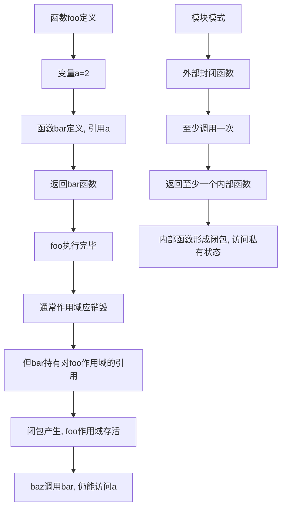
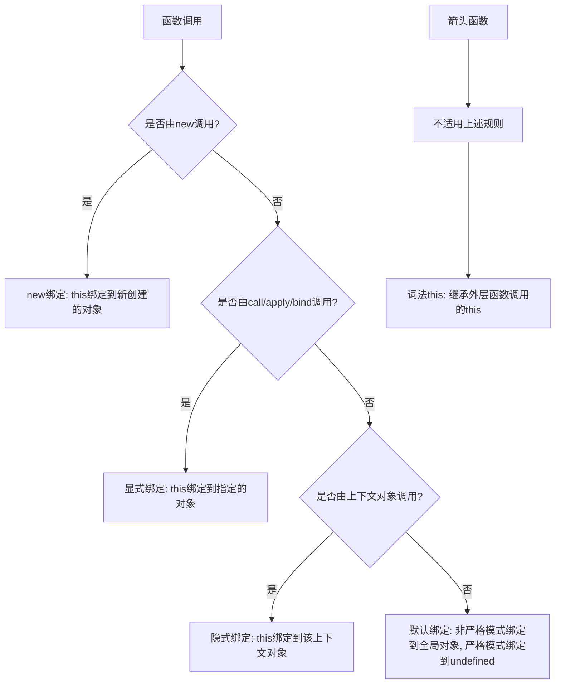
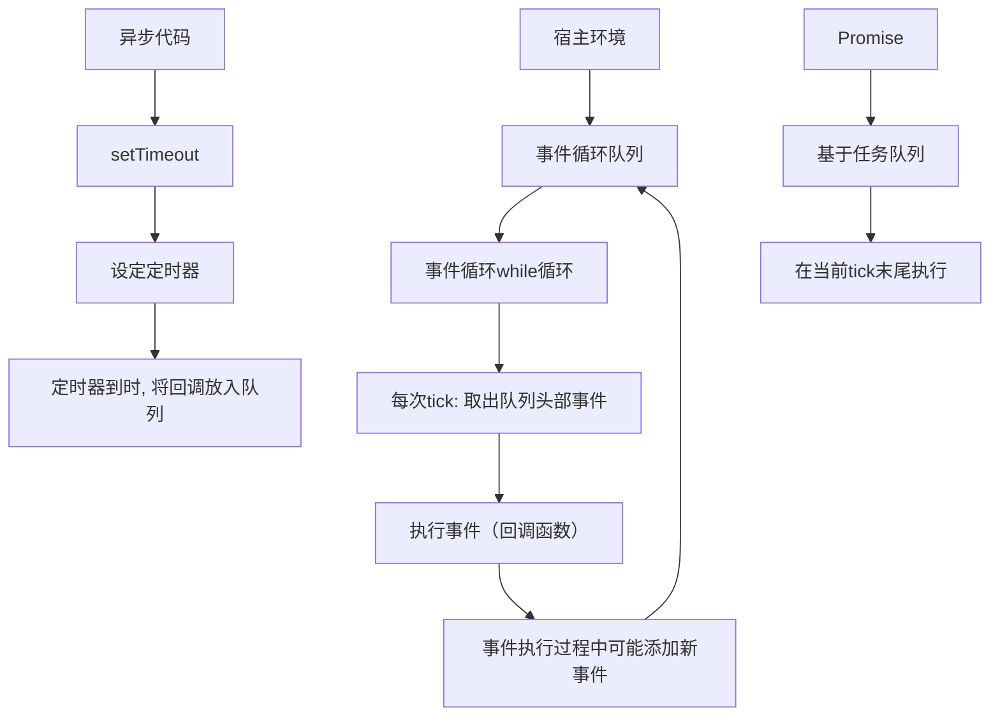
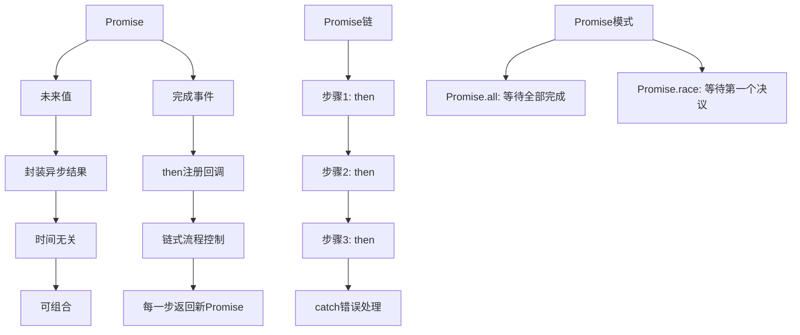
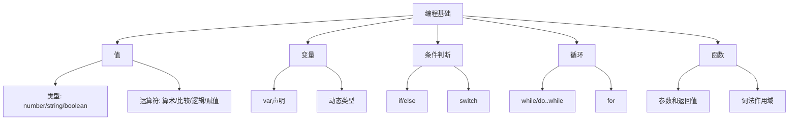
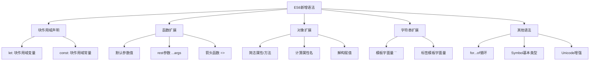
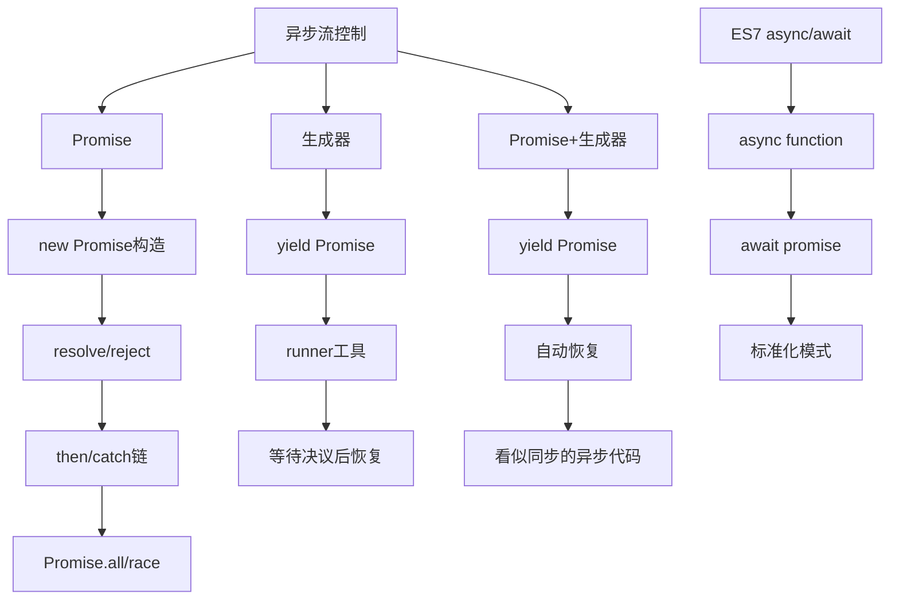
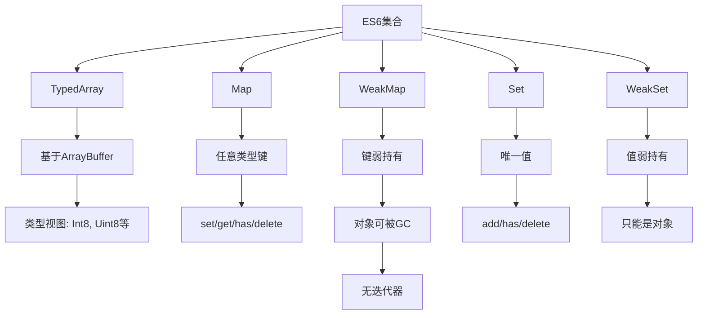

# 《你不知道的JavaScript》系列丛书章节总结

## 书籍信息
- 书名：你不知道的JavaScript（上卷、中卷、下卷）
- 作者：Kyle Simpson
- 译者：赵望野、梁杰（上卷）；单业、姜南（中卷）；单业（下卷）
- 出版社：人民邮电出版社 / O'Reilly Media
- PDF状态：三卷完整PDF，包含完整目录和正文
- OCR状态：可识别，部分页面存在图像标注但文本层完整

## 目录说明
- 目录识别情况：三卷目录完整可识别
- 章节对应依据：严格按原书目录顺序整理
- OCR修复说明：部分页眉页脚存在重复标记，正文内容完整

## 全书核心主题

“你不知道的JavaScript”系列丛书旨在深入探究JavaScript语言的核心机制，直面开发者“不求甚解”的普遍现象。上卷聚焦于**作用域与闭包**、**this绑定与对象原型**两大主题，解释了变量查找规则、函数作用域、闭包的实质、this的四条绑定规则以及原型委托机制。中卷涵盖**类型与语法**、**异步与性能**，深入剖析了JavaScript的类型系统、强制类型转换、回调缺陷、Promise、生成器以及性能优化策略。下卷则展望**ES6及更新版本**，详细介绍了新增语法、迭代器、生成器、模块、类、Promise、代理、集合、元编程等特性，并对JavaScript的未来发展方向进行了展望。

该系列的核心主张是：JavaScript并非一门“难以理解”的语言，而是开发者往往只学习了其“容易的部分”。真正掌握JavaScript需要深入理解其底层机制，包括词法作用域、闭包、原型委托（而非类继承）、类型转换的合理运用、Promise的可信任性以及生成器的顺序异步表达等。作者倡导“拥抱整个JavaScript”，而非只停留在“好的部分”。

---

# 上卷：作用域与闭包 + this和对象原型


## 第一部分：作用域和闭包

### 序

#### 核心论点

本部分旨在帮助读者深入理解JavaScript的作用域和闭包机制，认识到即使日常使用JavaScript多年，也可能并未真正理解其内部运行原理。作者希望读者能够像孩子拆解玩具一样，对代码的运行机制充满好奇。

#### 关键概念/事件

- **求知欲**：作者将编程学习比作拆解收音机的孩童，强调探究“为什么”的重要性。
- **ES6时机**：本书出版恰逢ES6稳定期，新特性（如let、const）为作用域提供了更好的介绍场景。
- **批判性思考**：鼓励读者对JavaScript的每一个细节进行批判性思考，并将其渗透到日常工作中。

---

### 第1章：作用域是什么

#### 核心论点

本章解决“变量存储在哪里、程序如何找到它们”的问题。作者提出：**作用域是一套规则，用于确定在何处以及如何查找变量**。JavaScript是编译语言，其作用域规则在编译阶段确定。

#### 关键概念/事件

- **编译原理**：传统编译流程包含分词/词法分析、解析/语法分析（生成AST）、代码生成三个阶段。JavaScript编译发生在代码执行前的几微秒内。
- **LHS查询**：赋值操作左侧的查询，目的是找到变量的容器本身（赋值的目标）。
- **RHS查询**：非赋值操作（如取值）的查询，目的是获取变量的值（赋值的源头）。
- **作用域嵌套**：当前作用域找不到变量时，会向外层嵌套作用域继续查找，直到全局作用域。
- **异常区分**：RHS查询失败抛出`ReferenceError`；LHS查询失败在非严格模式下会创建全局变量，严格模式下抛出`ReferenceError`；对结果进行非法操作抛出`TypeError`。

#### 逻辑推演

作者通过“引擎、编译器、作用域”三位角色的对话，模拟了`var a = 2;`的执行过程：
1. 编译器询问作用域是否已存在变量`a`，若无则要求在当前作用域声明。
2. 编译器生成运行时代码，引擎执行时通过LHS查询找到`a`并赋值。
3. 通过`function foo(a)`的例子，展示了隐式参数赋值的LHS查询。
4. 引入嵌套作用域概念，通过建筑比喻说明查找过程。
5. 区分LHS和RHS的重要性在于未声明变量时的不同行为：RHS失败报错，LHS失败（非严格模式）创建全局变量。

#### 经典金句/数据

> “变量的赋值操作会执行两个动作，首先编译器会在当前作用域中声明一个变量（如果之前没有声明过），然后在运行时引擎会在作用域中查找该变量，如果能够找到就会对它赋值。” (p.22)

> “作用域是一套规则，用于确定在何处以及如何查找变量（标识符）。” (p.27)

---

### 第2章：词法作用域

#### 核心论点

本章解决“作用域规则由什么决定”的问题。作者提出：**词法作用域是由函数声明的位置决定的编译阶段作用域模型**，与动态作用域（由调用栈决定）相对。同时介绍了两种欺骗词法作用域的机制（eval和with）及其性能代价。

#### 关键概念/事件

- **词法阶段**：作用域在词法分析阶段确定，由代码书写时变量和块作用域的位置决定。
- **遮蔽效应**：多层嵌套作用域中可定义同名标识符，内部标识符“遮蔽”外部标识符。
- **eval**：接受字符串参数并将其当作代码执行，可以在运行时修改书写期的词法作用域。
- **with**：将对象的属性当作作用域中的标识符处理，凭空创建一个新的词法作用域。
- **性能**：eval和with会导致引擎无法在编译时进行优化，使代码运行变慢。

#### 逻辑推演

1. 通过嵌套函数气泡图说明词法作用域的静态特性：作用域由函数声明位置决定，与调用位置无关。
2. 解释查找规则：从最内部作用域开始，逐级向外，找到第一个匹配即停止。
3. 演示`eval`如何动态创建变量，修改所在作用域。
4. 演示`with`如何将对象属性视为标识符，并解释其导致全局变量泄露的副作用。
5. 指出这两种机制的性能危害：引擎无法进行静态分析优化。

#### 经典金句/数据

> “词法作用域就是定义在词法阶段的作用域。换句话说，词法作用域是由你在写代码时将变量和块作用域写在哪里来决定的。” (p.29)

> “eval(..)和with会在运行时修改或创建新的作用域，以此来欺骗其他在书写时定义的词法作用域。” (p.35)

---

### 第3章：函数作用域和块作用域

#### 核心论点

本章解决“什么会生成新的作用域气泡”的问题。作者提出：**函数是JavaScript中最常见的作用域单元**，但ES3的`try/catch`、ES6的`let`和`const`也提供了块作用域。函数作用域遵循“最小暴露原则”，用于隐藏内部实现。

#### 关键概念/事件

- **函数作用域**：属于该函数的全部变量在整个函数范围内可用，外部无法访问。
- **最小特权原则**：最小限度地暴露必要内容，将其他内容“隐藏”起来。
- **规避冲突**：避免同名标识符冲突，可使用函数作用域或模块管理。
- **IIFE**：立即执行函数表达式，通过`(function(){..})()`形式创建独立作用域并自动执行。
- **块作用域**：`let`和`const`关键字将变量绑定到所在的`{..}`块中，不会提升。

#### 逻辑推演

1. 论证函数作用域的“隐藏”价值：将私有内容封装在函数内部，避免外部意外访问。
2. 对比匿名函数表达式和具名函数表达式的优缺点（调试、递归、可读性）。
3. 介绍IIFE的多种形式：传统`(function(){..})()`、带参数传递、倒置运行顺序（UMD模式）。
4. 揭示块作用域的必要性：`for`循环中的`i`不应污染外部作用域。
5. 介绍ES6的`let`和`const`：`let`将变量绑定到任意`{..}`块，不会提升，有TDZ；`const`创建不可修改的常量。
6. 说明块作用域的实用场景：垃圾回收（让大对象及时被回收）、`for`循环迭代重新绑定。

#### 流程图

```mermaid
graph TD
    A[全局作用域] --> B[函数foo作用域]
    B --> C[函数bar作用域]
    C --> D[标识符a,b,c,bar]
    D --> E[bar内部可访问a,b,c]
    E --> F[全局无法访问a,b,c,bar]
    B --> G[IIFE: 匿名/具名]
    G --> H[自动执行, 不污染]
    B --> I[块作用域 let/const]
    I --> J[绑定到{..}块]
    J --> K[不会提升, 有TDZ]
```

#### 经典金句/数据

> “函数是JavaScript中最常见的作用域单元。本质上，声明在一个函数内部的变量或函数会在所处的作用域中‘隐藏’起来，这是有意为之的良好软件的设计原则。” (p.36)

> “let关键字可以将变量绑定到所在的任意作用域中（通常是{ .. }内部）。换句话说，let为其声明的变量隐式地劫持了所在的块作用域。” (p.47)

---

### 第4章：提升

#### 核心论点

本章解决“声明与赋值的顺序关系”问题。作者提出：**包括变量和函数在内的所有声明都会在任何代码执行前被首先处理**，这个过程称为“提升”。只有声明本身会被提升，赋值和其他运行逻辑会留在原地。

#### 关键概念/事件

- **提升**：变量和函数声明从代码中出现的位置被“移动”到了各自作用域的最顶端。
- **先有声明后有赋值**：`var a = 2;`被看作`var a;`（编译阶段）和`a = 2;`（执行阶段）。
- **函数优先**：函数声明会首先被提升，然后才是变量声明；重复的`var`声明被忽略。
- **函数表达式不提升**：`var foo = function()..`只提升`var foo`，赋值仍留在原地。

#### 逻辑推演

1. 通过`a = 2; var a; console.log(a);`输出2，证明声明在赋值之前。
2. 通过`console.log(a); var a = 2;`输出`undefined`，证明变量已提升但未赋值。
3. 解释编译器和引擎的分工：编译阶段找到所有声明并关联作用域，执行阶段处理赋值。
4. 演示函数声明提升：`foo(); function foo(){..}`正常工作。
5. 演示函数表达式不提升：`foo(); var foo = function(){..}`抛出`TypeError`。
6. 展示函数优先原则：函数声明提升到普通变量之前，后面的函数声明会覆盖前面的。

#### 经典金句/数据

> “只有声明本身会被提升，而赋值或其他运行逻辑会留在原地。” (p.53)

> “函数声明和变量声明都会被提升。但是一个值得注意的细节……是函数会首先被提升，然后才是变量。” (p.55)

---

### 第5章：作用域闭包

#### 核心论点

本章解决“闭包是什么、如何工作”的问题。作者提出：**闭包是函数可以记住并访问所在词法作用域的自然结果**，即使函数在当前词法作用域之外执行。闭包无处不在，模块模式是其最重要的应用。

#### 关键概念/事件

- **闭包定义**：当函数可以记住并访问所在的词法作用域时，就产生了闭包，即使函数是在当前词法作用域之外执行。
- **模块模式**：必须有外部的封闭函数（至少调用一次），且必须返回至少一个内部函数，形成闭包。
- **循环与闭包**：`for`循环中使用`var`会导致所有回调共享同一个`i`，需要使用IIFE或`let`为每次迭代创建新作用域。
- **现代模块机制**：模块依赖加载器本质上封装了模块定义，核心是`modules[name] = impl.apply(impl, deps)`。
- **ES6模块**：基于文件的独立模块，API静态且稳定，编译期检查引用是否存在。

#### 逻辑推演

1. 通过`function foo(){ var a=2; function bar(){console.log(a);} return bar;}`演示闭包：`bar()`在`foo()`执行后仍能访问`a`，因为`bar()`持有对`foo()`内部作用域的引用。
2. 解释闭包的普遍性：定时器、事件监听器、Ajax请求等所有回调函数都在使用闭包。
3. 区分IIFE与闭包：IIFE在定义时所在作用域执行，不是严格意义上的闭包观察。
4. 解决循环问题：使用IIFE为每次迭代创建新作用域，或使用`let`（每次迭代重新绑定）。
5. 构建模块模式：通过返回对象字面量暴露内部函数，隐藏私有状态。
6. 展望ES6模块：`import`和`export`关键字，基于文件，静态决议。

#### 流程图



#### 经典金句/数据

> “当函数可以记住并访问所在的词法作用域时，就产生了闭包，即使函数是在当前词法作用域之外执行。” (p.59)

> “模块有两个主要特征：（1）为创建内部作用域而调用了一个包装函数；（2）包装函数的返回值必须至少包括一个对内部函数的引用，这样就会创建涵盖整个包装函数内部作用域的闭包。” (p.72)

---

### 附录A：动态作用域

#### 核心论点

附录解决“动态作用域与词法作用域的区别”问题。作者指出：**JavaScript是词法作用域，但`this`机制在某种程度上很像动态作用域**。动态作用域关心函数从何处调用（调用栈），而词法作用域关心函数在何处声明。

#### 关键概念/事件

- **动态作用域**：作用域链基于调用栈，而非代码中的作用域嵌套。
- **对比**：词法作用域关注函数在何处声明；动态作用域关注函数从何处调用。
- **`this`关联**：`this`机制与动态作用域关系紧密，因为`this`关注函数如何调用。

---

### 附录B：块作用域的替代方案

#### 核心论点

附录解决“ES6之前如何实现块作用域”的问题。作者提出：**可以使用`try/catch`的`catch`分句模拟块作用域**，通过工具（如Traceur）将ES6代码转换为ES5兼容代码。

#### 关键概念/事件

- **catch块作用域**：`catch`分句中的变量仅在`catch`内部有效。
- **Traceur**：Google的ES6代码转换工具，将ES6代码转换为ES5。
- **let-er**：作者开发的工具，专门处理`let`声明的转换。
- **性能考量**：`try/catch`性能曾被认为糟糕，但TC39已要求浏览器改进。

---

### 附录C：this词法

#### 核心论点

附录解决“箭头函数如何处理`this`”的问题。作者提出：**箭头函数不使用`this`的四条标准绑定规则，而是根据外层（函数或全局）作用域决定`this`**，即词法`this`。箭头函数`this`绑定无法被修改（包括`new`）。

#### 关键概念/事件

- **箭头函数**：使用`=>`定义的函数，放弃所有普通`this`绑定规则。
- **词法`this`**：箭头函数“继承”外层函数调用的`this`绑定。
- **对比**：`var self = this`和箭头函数都是否定`this`机制的方式，不应混用两种风格。
- **bind方法**：使用`bind(this)`是更靠得住的`this`绑定方式。


## 第二部分：this和对象原型

### 序

#### 核心论点

本部分衔接“作用域和闭包”，进一步介绍`this`关键字和原型——使用JavaScript进行编程的基础。作者认为，绝大多数Web开发者可能从未真正创建过JavaScript对象，而本书将帮助他们掌握创建、关联和扩展对象的方法。

#### 关键概念/事件

- **Google Maps启示**：2005年谷歌地图的出现展示了JavaScript作为真正编程语言的潜力。
- **15年反思**：作者后悔早期未给予JavaScript足够重视，认为本书能帮助读者少走弯路。

---

### 第1章：关于this

#### 核心论点

本章解决“`this`到底是什么”的问题。作者澄清了两个常见误解：**`this`既不指向函数自身，也不指向函数的词法作用域**。`this`是在运行时绑定的，其上下文取决于函数调用时的各种条件。

#### 关键概念/事件

- **`this`的作用**：提供更优雅的隐式“传递”对象引用方式，使API设计更简洁。
- **误解一：指向自身**：函数内部`this.count++`不会增加函数对象的`count`属性，可能意外创建全局变量。
- **误解二：指向作用域**：`this`在任何情况下都不指向函数的词法作用域。
- **运行时绑定**：`this`的绑定和函数声明的位置无关，只取决于函数的调用方式。
- **执行上下文**：函数调用时会创建包含调用栈、调用方法、传入参数的活动记录，`this`是其中的一个属性。

#### 逻辑推演

1. 通过`identify.call(me)`和`speak.call(you)`示例，说明`this`使函数可在不同上下文对象中复用。
2. 指出无`this`时需要显式传入上下文对象，代码会变得混乱。
3. 用`foo.count = 0; foo()`例子反驳“`this`指向自身”的误解：`this.count`添加的是全局`count`而非`foo.count`。
4. 用`this.bar()`例子反驳“`this`指向作用域”的误解：无法通过`this`引用词法作用域内部的变量。
5. 总结：`this`在函数被调用时绑定，指向完全取决于调用位置。

#### 经典金句/数据

> “this实际上是在函数被调用时发生的绑定，它指向什么完全取决于函数在哪里被调用。” (p.96)

> “`this`既不指向函数自身也不指向函数的词法作用域。” (p.95)

---

### 第2章：this全面解析

#### 核心论点

本章解决“如何判断`this`绑定对象”的问题。作者提出**四条绑定规则**（默认、隐式、显式、`new`绑定）及其优先级，并介绍了绑定例外（如被忽略的`this`、间接引用）和ES6箭头函数的词法`this`。

#### 关键概念/事件

- **调用位置**：函数在代码中被调用的位置（而非声明位置），是分析`this`绑定的起点。
- **默认绑定**：独立函数调用，应用默认绑定，`this`指向全局对象（非严格模式）或`undefined`（严格模式）。
- **隐式绑定**：调用位置有上下文对象，`this`绑定到该上下文对象。但存在“隐式丢失”问题。
- **显式绑定**：通过`call`、`apply`、`bind`强制指定`this`绑定对象。硬绑定可解决丢失问题。
- **`new`绑定**：使用`new`调用函数时，会创建新对象并绑定到`this`。
- **优先级**：`new`绑定 > 显式绑定 > 隐式绑定 > 默认绑定。
- **箭头函数**：不使用上述四条规则，根据外层作用域决定`this`（词法`this`）。

#### 逻辑推演

1. 介绍如何通过调试工具找到调用栈和真正的调用位置。
2. 分别演示四种绑定规则的代码示例。
3. 解释“隐式丢失”：`var bar = obj.foo; bar();`应用了默认绑定。
4. 解释“硬绑定”：`var bar = function(){ foo.call(obj); };`解决了丢失问题。
5. 通过优先级测试得出：`new`绑定 > 显式绑定 > 隐式绑定 > 默认绑定。
6. 介绍绑定例外：传入`null`/`undefined`会应用默认绑定（不安全），可使用`Object.create(null)`创建DMZ对象。
7. 介绍箭头函数：`() => {}`，`this`继承自外层函数，无法被修改（包括`new`）。

#### 流程图



#### 经典金句/数据

> “如果要判断一个运行中函数的this绑定，就需要找到这个函数的直接调用位置。” (p.101)

> “箭头函数不使用this的四种标准规则，而是根据外层（函数或者全局）作用域来决定this。” (p.114)

---

### 第3章：对象

#### 核心论点

本章解决“对象是什么、如何工作”的问题。作者介绍了对象的语法、类型、内容（属性）、属性描述符、不变性、Getter/Setter、存在性和遍历等核心概念。

#### 关键概念/事件

- **语法**：文字形式`var myObj = { key: value }`和构造形式`new Object()`。
- **内置类型**：`string`、`number`、`boolean`、`null`、`undefined`、`object`、`symbol`。
- **内置对象**：`String`、`Number`、`Boolean`、`Object`、`Function`、`Array`、`Date`、`RegExp`、`Error`。
- **属性描述符**：`value`、`writable`、`enumerable`、`configurable`。
- **不变性**：`Object.preventExtensions()`、`Object.seal()`、`Object.freeze()`。
- **Getter/Setter**：通过`get`和`set`定义访问描述符，覆盖默认的`[[Get]]`和`[[Put]]`操作。
- **存在性**：`in`操作符检查原型链，`hasOwnProperty()`只检查自身属性。

#### 逻辑推演

1. 区分基本类型和对象子类型（函数、数组）。
2. 解释属性访问（`.`）和键访问（`[]`）的区别：后者支持任意UTF-8/Unicode字符串。
3. 介绍ES6可计算属性名：`[prefix + "bar"]: "hello"`。
4. 反驳“属性访问返回函数就是方法”的说法：函数永远不会真正“属于”一个对象。
5. 介绍`Object.assign()`浅复制方法。
6. 详细解释属性描述符的四个特性及其作用。
7. 介绍四种不变性级别及其区别。
8. 解释`[[Get]]`和`[[Put]]`的内部运作机制。
9. 演示`getter`/`setter`的用法。
10. 区分属性存在性检查方法：`in`、`hasOwnProperty()`、`propertyIsEnumerable()`、`Object.keys()`、`Object.getOwnPropertyNames()`。
11. 介绍ES6的`for..of`循环和`@@iterator`。

---

### 第4章：混合对象“类”

#### 核心论点

本章解决“JavaScript中如何模拟类”的问题。作者指出：**类是一种可选的设计模式，但JavaScript的机制和类完全不同**。类意味着复制，而JavaScript不会自动创建对象的副本。混入（显式和隐式）是模拟类复制行为的常用方法，但会带来复杂性和隐患。

#### 关键概念/事件

- **类理论**：类/继承描述代码组织结构，强调数据和操作行为的封装。
- **多态**：父类的通用行为可被子类用更特殊的行为重写（相对多态）。
- **JavaScript的“类”**：只是近似类的语法元素（如`new`、`instanceof`、ES6的`class`），底层仍是原型机制。
- **混入**：模拟类的复制行为，分为显式混入和隐式混入。
- **显式伪多态**：通过`OtherObj.methodName.call(this, ...)`实现，增加了维护成本。
- **寄生继承**：复制父类定义，混入子类定义，然后构建实例。

#### 逻辑推演

1. 介绍类理论的核心概念：实例化、继承、多态。
2. 指出JavaScript与类的本质区别：无复制，只有对象关联。
3. 演示`mixin()`函数实现显式混入。
4. 分析显式混入的问题：函数引用复制而非真正复制，存在对象引用共享。
5. 演示隐式混入：通过`Something.cool.call(this)`借用函数。
6. 总结：在JavaScript中模拟类是得不偿失的，会埋下更多隐患。

#### 经典金句/数据

> “类意味着复制。” (p.155)

> “JavaScript并不会（像类那样）自动创建对象的副本。” (p.155)

> “在JavaScript中模拟类是得不偿失的，虽然能解决当前的问题，但是可能会埋下更多的隐患。” (p.156)

---

### 第5章：原型

#### 核心论点

本章解决“JavaScript的原型机制是什么”的问题。作者指出：**JavaScript中只有对象，没有类**。`[[Prototype]]`机制是对象之间的内部链接，用于属性查找的备用。`.prototype`和`.constructor`是容易造成误解的命名，更准确的术语是“委托”。

#### 关键概念/事件

- **`[[Prototype]]`**：对象的内部属性，指向另一个对象的引用。
- **`Object.prototype`**：所有普通`[[Prototype]]`链的顶端。
- **屏蔽**：如果属性在对象自身和原型链上层都存在，自身属性会“屏蔽”上层属性。
- **“类”函数**：所有函数默认拥有`prototype`属性，指向一个对象。`new Foo()`会将新对象的`[[Prototype]]`关联到`Foo.prototype`。
- **`instanceof`**：检查对象的整条`[[Prototype]]`链中是否有指向`Foo.prototype`的对象。
- **`isPrototypeOf`**：判断两个对象之间的`[[Prototype]]`关联关系。
- **`Object.create()`**：创建一个新对象并将其`[[Prototype]]`关联到指定对象。
- **`__proto__`**：非标准但广泛支持的原型链访问器属性。

#### 逻辑推演

1. 通过`Object.create()`演示`[[Prototype]]`链的属性查找机制。
2. 解释`Object.prototype`是所有普通对象的原型链终点。
3. 详细分析属性设置时的三种情况及其是否产生屏蔽。
4. 批判将`Foo.prototype`称为“原型”的误导性，建议理解为“被贴上‘Foo点prototype’标签的对象”。
5. 反驳“构造函数”误解：`a.constructor === Foo`是因为委托，而非`a`由`Foo`构造。
6. 演示正确的原型继承：`Bar.prototype = Object.create(Foo.prototype)`。
7. 对比错误做法：`Bar.prototype = Foo.prototype`（直接引用）和`Bar.prototype = new Foo()`（有副作用）。
8. 介绍内省方法：`instanceof`、`isPrototypeOf`、`Object.getPrototypeOf()`、`__proto__`。
9. 强调“委托”比“继承”更准确地描述JavaScript的对象关联机制。

#### 流程图

```mermaid
graph TD
    A[构造函数Foo] --> B[Foo.prototype对象]
    B --> C[.constructor指向Foo]
    D[new Foo()] --> E[新对象a]
    E --> F[a的内部[[Prototype]]链接到Foo.prototype]
    F --> G[a可以访问Foo.prototype上的方法]
    
    H[正确的原型继承] --> I[Bar.prototype = Object.create(Foo.prototype)]
    I --> J[Bar.prototype的[[Prototype]]链接到Foo.prototype]
    J --> K[Bar的实例可以访问Foo.prototype的方法]
    
    L[对象关联] --> M[Object.create(foo)]
    M --> N[新对象bar的[[Prototype]]链接到foo]
    N --> O[bar可以委托foo的行为]
```

#### 经典金句/数据

> “在JavaScript中，类无法描述对象的行，（因为根本就不存在类！）对象直接定义自己的行为。再说一遍，JavaScript中只有对象。” (p.161)

> “继承意味着复制操作，JavaScript（默认）并不会复制对象属性。相反，JavaScript会在两个对象之间创建一个关联，这样一个对象就可以通过委托访问另一个对象的属性和函数。” (p.163)

> “`instanceof`回答的问题是：在a的整条`[[Prototype]]`链中是否有指向`Foo.prototype`的对象？” (p.171)

---

### 第6章：行为委托

#### 核心论点

本章解决“如何更自然地使用`[[Prototype]]`”的问题。作者提出：**行为委托是比类继承更适合JavaScript的设计模式**。对象之间是兄弟关系，互相委托，而不是父类和子类的关系。对象关联（OLOO）风格代码比模拟类的代码更简洁、更清晰。

#### 关键概念/事件

- **行为委托**：对象在找不到属性或方法引用时，把这个请求委托给另一个对象。
- **OLOO**：对象关联到其他对象（Objects Linked to Other Objects），一种编码风格。
- **委托理论 vs 类理论**：委托强调对象之间的协作关系，而非垂直的父类-子类继承。
- **控件类 vs 委托控件对象**：对比传统的“类”式UI控件实现和委托式实现。
- **内省**：`Foo.prototype.isPrototypeOf(a)`比`a instanceof Foo`更简洁清晰。

#### 逻辑推演

1. 对比类理论和委托理论的思维模型：类强调实体及实体间的关系（复杂），委托强调对象之间的关联关系（简洁）。
2. 用`Task`和`XYZ`的委托示例展示OLOO风格。
3. 对比UI控件（Widget/Button）的类实现和委托实现。
4. 分析登录验证场景（`LoginController`/`AuthController`）的两种设计。
5. 指出委托式设计的优势：无需`Controller`基类、无需实例化、无需合成、避免多态。
6. 介绍内省的改进：`Foo.isPrototypeOf(b1)`比`b1 instanceof Foo`更直观。
7. 强调行为委托是`[[Prototype]]`机制的本质，拥抱它比模拟类更有价值。

#### 经典金句/数据

> “行为委托认为对象之间是兄弟关系，互相委托，而不是父类和子类的关系。JavaScript的`[[Prototype]]`机制本质上就是行为委托机制。” (p.187-188)

> “当你只用对象来设计代码时，不仅可以让语法更加简洁，而且可以让代码结构更加清晰。” (p.188)

---

### 附录A：ES6中的Class

#### 核心论点

附录解决“ES6的`class`是否解决了JavaScript类的问题”的争议。作者认为：**`class`是语法糖，并未解决本质问题，反而加深了对`[[Prototype]]`的误解**，带来了新的陷阱（如静态绑定`super`、属性屏蔽等）。作者建议抵制这种设计模式。

#### 关键概念/事件

- **`class`语法糖**：只是现有`[[Prototype]]`委托机制的语法糖，不会在声明时静态复制行为。
- **`extends`和`super`**：提供相对多态语法，但`super`是静态绑定（声明时绑定），而非动态绑定。
- **陷阱**：修改父类方法会影响子类和所有实例；`super`绑定可能不符合预期；需要手动`toMethod()`修复。
- **无法定义类成员属性**：只能定义方法，共享状态仍需使用丑陋的`.prototype`语法。
- **静态大于动态**：`class`不赞成动态修改，强制使用静态语法，与JavaScript的动态性背道而驰。

#### 经典金句/数据

> “class基本上只是现有`[[Prototype]]`（委托！）机制的一种语法糖。” (p.206)

> “class加深了过去20年中对于JavaScript中‘类’的误解，在某些方面，它产生的问题比解决的多，而且让本来优雅简洁的`[[Prototype]]`机制变得非常别扭。” (p.210)


# 中卷：类型和语法 + 异步和性能


## 第一部分：类型和语法

### 序

#### 核心论点

本部分介绍JavaScript的核心基础知识——类型、强制类型转换、原生构造函数等，这些是无法从“复制粘贴”和工具库中学到的内容。作者强调，掌握语言的基础知识对于正确使用工具库至关重要。

#### 关键概念/事件

- **“复制粘贴”式学习**：许多开发人员通过复制粘贴代码学习，但未真正理解本质。
- **工具库的作用**：jQuery等库功能强大，是因为开发者理解语言的本质和优点。
- **基础知识的重要性**：学会使用工具库大有裨益，同时掌握语言的基础知识也十分重要。

---

### 第1章：类型

#### 核心论点

本章解决“JavaScript中类型是什么”的问题。作者提出：**类型是值的内部特征，定义了值的行为**。JavaScript有七种内置类型（`null`、`undefined`、`boolean`、`number`、`string`、`object`、`symbol`），变量没有类型，只有值才有类型。

#### 关键概念/事件

- **类型定义**：对语言引擎和开发人员来说，类型是值的内部特征，定义了值的行为。
- **内置类型**：七种内置类型，除`object`外统称“基本类型”。
- **`typeof`运算符**：返回类型的字符串值，但`typeof null === "object"`是一个bug。
- **`undefined` vs `undeclared`**：`undefined`是已声明但未赋值；`undeclared`是未声明。`typeof`对二者都返回`"undefined"`，这是安全防范机制。
- **安全防范**：通过`typeof`检查未声明变量不会报错，可用于polyfill和全局变量检查。

#### 逻辑推演

1. 定义类型：类型是值的内部特征，定义了值的行为。
2. 列举七种内置类型及`typeof`返回值。
3. 指出`typeof null`的bug及其无法修复的原因。
4. 说明函数和数组是`object`的子类型。
5. 强调变量无类型，值有类型。
6. 区分`undefined`和`undeclared`，并通过`typeof`演示安全防范机制。

#### 经典金句/数据

> “JavaScript中的变量是没有类型的，只有值才有。” (p.27)

> “undefined和undeclared在JavaScript中完全是两回事。” (p.28)

---

### 第2章：值

#### 核心论点

本章解决“JavaScript中的数组、字符串、数字等值类型的细节”问题。作者详细介绍了数组的特殊性、字符串与数组的异同、数字类型的精度问题、特殊数值（`NaN`、`Infinity`、`-0`）以及值和引用的赋值/传递规则。

#### 关键概念/事件

- **数组**：可容纳任何类型值，可包含字符串键值（但不影响`length`），类数组可通过`Array.from()`转换。
- **字符串**：不可变，数组方法（如`reverse()`）不能直接用于字符串，需先`split()`再`join()`。
- **数字**：基于IEEE 754双精度浮点数，`0.1 + 0.2 !== 0.3`。整数安全范围是`2^53 - 1`。
- **特殊数值**：`NaN`（唯一不等于自身的值）、`Infinity`、`-0`。
- **值引用**：简单基本类型通过值复制赋值/传递；复合值（对象、数组）通过引用复制赋值/传递。

#### 逻辑推演

1. 展示数组的灵活性和稀疏数组的陷阱。
2. 演示字符串与数组的转换技巧（`split`/`join`）。
3. 解释`0.1 + 0.2`精度问题及解决方案（`Number.EPSILON`）。
4. 介绍整数安全范围和检测方法（`Number.isInteger()`、`Number.isSafeInteger()`）。
5. 详细分析`NaN`的特性及检测方法（`Number.isNaN()`）。
6. 解释`-0`的产生和检测方法。
7. 介绍`Object.is()`处理特殊等式的用法。
8. 用图示说明值引用和引用复制的区别。

#### 经典金句/数据

> “简单基本类型值（字符串和数字等）通过值复制来赋值/传递，而复合值（对象等）通过引用复制来赋值/传递。” (p.53)

---

### 第3章：原生函数

#### 核心论点

本章解决“原生函数是什么、如何使用”的问题。作者介绍了`String()`、`Number()`、`Boolean()`、`Array()`、`Object()`、`Function()`、`RegExp()`、`Date()`、`Error()`、`Symbol()`等原生函数。强调应优先使用字面量形式，避免使用构造函数（除非必要）。

#### 关键概念/事件

- **原生函数作为构造函数**：创建的是封装对象，而非基本类型值。
- **内部`[[Class]]`**：通过`Object.prototype.toString.call()`查看，基本类型值会被自动封装。
- **封装对象**：基本类型值自动包装为对象，以访问属性和方法。
- **拆封**：通过`valueOf()`获取封装对象中的基本类型值。
- **`Array`构造函数的陷阱**：只带一个数字参数时创建稀疏数组（空单元），而非包含该值的数组。
- **`Symbol`**：ES6新增基本类型，不能使用`new`，具有唯一性。
- **原生原型**：`String.prototype`等包含对应子类型的方法，不应扩展原生原型。

#### 经典金句/数据

> “一般情况下，我们不需要直接使用封装对象。最好的办法是让JavaScript引擎自己决定什么时候应该使用封装对象。” (p.57)

> “永远不要创建和使用空单元数组。” (p.61)

---

### 第4章：强制类型转换

#### 核心论点

本章解决“强制类型转换是什么、如何正确使用”的争议问题。作者认为：**强制类型转换不是设计缺陷，而是有用的特性**。显式强制类型转换让代码更清晰；隐式强制类型转换可提高可读性，但需要掌握规则。关键在于区分“显式”和“隐式”，并在合适的场景使用。

#### 关键概念/事件

- **显式强制类型转换**：`String(42)`、`Number("42")`、`!!a`、`+c`等，代码中明显可见的类型转换。
- **隐式强制类型转换**：`a + ""`、`if(a)`等，操作副作用的类型转换。
- **抽象操作**：`ToString`、`ToNumber`、`ToBoolean`、`ToPrimitive`。
- **真值/假值**：假值列表（`undefined`、`null`、`false`、`+0`、`-0`、`NaN`、`""`），其他都是真值。
- **`==` vs `===`**：`==`允许强制类型转换，`===`不允许。正确的区分不是“值vs值和类型”，而是“是否允许类型转换”。
- **抽象关系比较**：`a < b`的强制类型转换规则。

#### 逻辑推演

1. 定义值类型转换与强制类型转换的区别。
2. 介绍`ToString`、`ToNumber`、`ToBoolean`的抽象操作规则。
3. 演示显式转换的各种方法：`String()`、`Number()`、`!!`、`+`。
4. 介绍`parseInt()`与`Number()`的区别：解析允许非数字字符，转换不允许。
5. 演示隐式转换：`a + ""`（字符串拼接）、`a - 0`（数字减法）、`if(a)`（布尔值上下文）。
6. 解释`||`和`&&`的“操作数选择器”行为：返回两个操作数中的一个，而非布尔值。
7. 详细分析`==`的抽象相等比较算法，包括字符串与数字、布尔值与其他类型、`null`与`undefined`、对象与非对象。
8. 列出`==`的7个“坑”并给出规避原则。
9. 分析抽象关系比较`<`的规则。

#### 流程图

```mermaid
graph TD
    A[强制类型转换] --> B[显式强制类型转换]
    A --> C[隐式强制类型转换]
    
    B --> B1[String/Number/Boolean工厂函数]
    B --> B2[一元运算符 + / - / !]
    B --> B3[parseInt/parseFloat]
    B --> B4[!!双重否定]
    
    C --> C1[字符串拼接 a + ""]
    C --> C2[数字运算 a - 0]
    C --> C3[布尔值上下文 if/for/while]
    C --> C4[逻辑运算符 || / &&]
    
    D[相等比较] --> E["== (宽松相等)"]
    D --> F["=== (严格相等)"]
    E --> G[允许类型转换]
    F --> H[不允许类型转换]
```

#### 经典金句/数据

> “`==`允许在相等比较中进行强制类型转换，而`===`不允许。” (p.98)

> “如果两边的值中有true或者false，千万不要使用`==`。” (p.109)

> “强制类型转换不是设计缺陷，而是有用的特性。” (p.91)

---

### 第5章：语法

#### 核心论点

本章解决“JavaScript语法中的细微差别和陷阱”问题。作者详细介绍了语句与表达式的区别、运算符优先级、自动分号插入（ASI）、早期错误、函数参数、`try..finally`、`switch`等语法细节。

#### 关键概念/事件

- **语句结果值**：语句都有一个结果值，可通过`eval()`或`do{}`表达式获取（但不推荐）。
- **表达式的副作用**：`++`、`--`、`delete`、`=`等运算符有副作用。
- **上下文规则**：`{}`在不同上下文中的含义不同（代码块、对象常量、解构赋值、命名函数参数）。
- **运算符优先级**：决定表达式的执行顺序，`&&`优先级高于`||`，`||`优先级高于`?:`。
- **短路**：`&&`和`||`从左到右执行，能决定结果时就忽略右侧操作数。
- **ASI**：自动分号插入是纠错机制，应在需要的地方加上分号，而非依赖ASI。
- **早期错误**：编译阶段发现的错误（如语法错误、严格模式下的参数重名），无法用`try..catch`捕获。
- **TDZ**：暂时性死区，`let`和`const`声明前不能访问变量。
- **`try..finally`**：`finally`中的代码总是执行，即使`try`中有`return`。

#### 逻辑推演

1. 区分语句（句子）和表达式（短语）。
2. 演示语句的结果值（如赋值表达式返回赋的值）。
3. 分析表达式的副作用：`a++`、`delete`、`=`等。
4. 解释`{}`在不同上下文的不同含义。
5. 详细介绍运算符优先级和关联性，通过复杂表达式`a && b || c ? c || b ? a : c && b : a`演示计算过程。
6. 讨论ASI的争议：是否依赖它自动补充分号。
7. 介绍早期错误和TDZ。
8. 分析函数参数的微妙之处：`arguments`数组与命名参数的关联（非严格模式）或不关联（严格模式）。
9. 演示`try..finally`的执行顺序：`finally`在`return`之后、函数返回之前执行。
10. 介绍`switch`的使用技巧：`switch(true)`实现基于`==`的匹配。

#### 经典金句/数据

> “代码块的结果值就如同一个隐式的返回，即返回最后一个语句的结果值。” (p.115)

> “永远不要在代码中使用`eval(..)`。” (p.116)

> “ASI是一个语法纠错机制。若将换行符作为有意义的字符来对待，就会遇到很多问题。” (p.134)


## 第二部分：异步和性能

### 序

#### 核心论点

本部分旨在帮助读者掌握JavaScript的异步编程核心技能，包括回调、Promise、生成器，并展望异步的未来发展。作者强调，面试中判断候选人对JavaScript的掌握程度，关键在于考察闭包和异步的理解。

#### 关键概念/事件

- **回调**：异步编程的基础，但不足以满足当代需求。
- **Promise**：JavaScript和DOM提供异步返回值的正式方法，所有未来的异步DOM API都会使用。
- **生成器**：与Promise合作可提高可读性和可维护性。
- **未来展望**：本书涵盖的功能让开发者对异步有越来越多的控制。

---

### 第1章：异步：现在与将来

#### 核心论点

本章解决“异步是什么、如何工作”的问题。作者提出：**程序分块运行，现在运行的部分和将来运行的部分之间的关系就是异步编程的核心**。JavaScript引擎本身没有时间概念，通过宿主环境提供的事件循环机制调度代码块的执行。

#### 关键概念/事件

- **分块的程序**：最常见的块单位是函数，现在执行的部分和将来执行的部分之间存在间隙。
- **事件循环**：宿主环境提供的机制，用于处理程序中多个块的执行调度。每轮称为一个tick。
- **并行线程**：异步不等于并行。并行是同时执行，异步是时间间隙。JavaScript是单线程，不会跨线程共享数据。
- **完整运行**：由于单线程，函数一旦开始运行就会运行到结束，不会被其他代码中断。
- **并发**：两个或多个“进程”在同一段时间内同时运行（任务级并行），但事件循环中一次只能处理一个事件。
- **协作**：将长期运行的“进程”分割成多批任务，让其他“进程”有机会插入运行。
- **任务队列**：ES6新增概念，挂载在事件循环队列的每个tick之后，Promise的异步基于任务队列。

#### 逻辑推演

1. 通过`ajax`例子展示异步的“分块”特性。
2. 解释`setTimeout`不会把回调直接放入事件循环队列，而是设定定时器，到时后放入队列。
3. 区分异步（时间间隙）和并行（同时执行）。
4. 演示单线程的“完整运行”特性如何消除多线程的不确定性。
5. 介绍并发（任务级并行）和竞态条件。
6. 展示协作式并发的实现方式（将长期任务分批处理）。
7. 介绍任务队列及其与事件循环的关系。

#### 流程图



#### 经典金句/数据

> “事实上，JavaScript程序总是至少分为两个块：第一块现在运行；下一块将来运行，以响应某个事件。” (p.180)

> “并发是指两个或多个事件链随时间发展交替执行，以至于从更高的层次来看，就像是同时在运行。” (p.181)

---

### 第2章：回调

#### 核心论点

本章解决“回调的核心缺陷是什么”的问题。作者指出回调有两个主要缺陷：**1）不符合大脑的顺序计划方式（非线性、非顺序）；2）控制反转导致信任问题**（被调用的次数、时机、参数等不可控）。

#### 关键概念/事件

- **continuation**：回调函数封装了程序的延续。
- **顺序的大脑**：大脑是单任务执行者（快速上下文切换），计划是同步的，但回调表达异步的方式是非线性的。
- **回调地狱**：真正的问题不是嵌套缩进，而是控制流难以追踪、错误处理脆弱。
- **控制反转**：把程序执行控制交给第三方（回调接受者），破坏了信任链。
- **信任问题列表**：调用过早、过晚、次数过少或过多、未能传递参数、吞掉错误。
- **Zalgo**：同步/异步不确定性的隐喻，“不要放出Zalgo”——永远异步调用回调。

#### 逻辑推演

1. 通过`ajax`例子展示回调函数封装continuation。
2. 对比大脑计划和代码执行的不匹配。
3. 演示嵌套回调（回调地狱）和链式回调，分析其难以追踪的原因。
4. 以“信用卡被刷五次”的故事展示控制反转的信任问题。
5. 列出五个信任问题及可能的解决方案（分离回调、error-first风格、超时、asyncify）。
6. 强调这些解决方案增加了代码复杂度，需要通用机制。

#### 经典金句/数据

> “不理解自己的代码才是地狱。回调就是主要元凶之一。” (p.186)

> “回调最大的问题是控制反转，它会导致信任链的完全断裂。” (p.194)

---

### 第3章：Promise

#### 核心论点

本章解决“如何解决回调的信任和顺序问题”的问题。作者提出：**Promise把控制反转再反转回来**，通过可信任的语义提供未来值和完成事件。Promise使代码更可预测、更可组合，解决了回调的核心缺陷。

#### 关键概念/事件

- **未来值**：Promise作为未来值的占位符，把现在和将来归一化。
- **完成事件**：Promise作为流程控制机制，侦听完成事件，决定下一步。
- **thenable**：具有`then()`方法的对象/函数，通过鸭子类型识别Promise。
- **信任重建**：Promise解决了调用过早/过晚、未调用、次数过多/过少、未传递参数、吞掉错误等问题。
- **链式流**：`then()`自动创建新Promise，返回值被设置为链接Promise的完成。
- **错误处理**：Promise错误可被捕获，但默认会吞掉未处理的拒绝（需要`catch`或`done()`）。
- **Promise模式**：`Promise.all()`（门）、`Promise.race()`（门闩/竞态）。
- **局限性**：顺序错误处理、单一值、单决议、惯性、无法取消。

#### 逻辑推演

1. 通过“芝士汉堡订单”类比解释未来值概念。
2. 用`add`函数示例对比基于回调的未来值处理和基于Promise的处理。
3. 通过“事件侦听”类比解释完成事件概念。
4. 介绍thenable鸭子类型检测及其潜在问题。
5. 逐一分析Promise如何解决五个信任问题。
6. 展示Promise链式流程控制的强大：每一步可等待异步完成。
7. 演示错误处理机制及未捕获拒绝的问题。
8. 介绍`Promise.all()`和`Promise.race()`的用法。
9. 讨论Promise的局限性（惯性、无法取消等）。

#### 流程图



#### 经典金句/数据

> “Promise是一种封装和组合未来值的易于复用的机制。” (p.183)

> “根据定义，Promise只能被决议一次。” (p.193)

> “Promise非常好，请使用。” (p.233)

---

### 第4章：生成器

#### 核心论点

本章解决“如何以同步顺序的方式表达异步流程”的问题。作者提出：**生成器可以在运行中暂停和恢复，通过`yield`/`next()`双向消息传递，使异步代码看似同步**。生成器与Promise结合是最佳实践。

#### 关键概念/事件

- **打破完整运行**：生成器可一次或多次启动和停止，不必运行到结束。
- **双向消息传递**：`yield`发出值并等待恢复值，`next()`启动/恢复并传入值。
- **迭代器**：生成器执行返回迭代器，通过`next()`控制生成器。
- **生产者**：生成器可作为值的生产者，通过`yield`产出值。
- **异步迭代生成器**：`yield`暂停等待异步操作完成，实现看似同步的异步代码。
- **生成器+Promise**：`yield`一个Promise，让迭代器控制代码等待Promise决议后恢复生成器。
- **生成器委托**：`yield *`把迭代控制委托给另一个生成器或iterable。
- **形实转换程序**：thunk是封装函数调用的函数，可被`yield`，但Promise是更好的选择。

#### 逻辑推演

1. 演示生成器的基本用法：`function *foo() { yield; }`。
2. 解释`yield`和`next()`的双向消息传递。
3. 展示多个迭代器实例的交替执行。
4. 介绍生成器作为值生产者的用法（迭代器接口）。
5. 用Ajax请求示例展示生成器如何让异步代码看似同步。
6. 演示`run(..)`工具（支持Promise的生成器运行器）。
7. 介绍生成器中的Promise并发（`Promise.all`）。
8. 展示`yield *`委托的用法和好处。
9. 讨论thunk作为Promise的替代。
10. 介绍ES6之前生成器的transpile实现。

#### 流程图

```mermaid
graph TD
    A[生成器函数] --> B[function* foo()]
    B --> C[执行返回迭代器it]
    C --> D[it.next() 启动/恢复]
    D --> E[遇到yield暂停]
    E --> F[it.next(value) 恢复并传值]
    F --> G[yield表达式完成, 赋值]
    
    H[生成器+Promise异步模式] --> I[生成器内yield Promise]
    I --> J[run工具接收Promise]
    J --> K[Promise决议后恢复生成器]
    K --> L[看似同步的异步代码]
    
    M[yield*委托] --> N[yield *foo()]
    N --> O[把迭代控制委托给foo()]
    O --> P[foo()完成后回归]
```

#### 经典金句/数据

> “生成器为异步代码保持了顺序、同步、阻塞的代码模式，这使得大脑可以更自然地追踪代码。” (p.286)

> “获得Promise和生成器最大效用的最自然的方法就是yield出来一个Promise，然后通过这个Promise来控制生成器的迭代器。” (p.254)

---

### 第5章：程序性能

#### 核心论点

本章解决“如何进一步提高JavaScript性能”的问题。作者介绍了三种程序级性能优化机制：**Web Worker**（任务并行）、**SIMD**（数据并行）、**asm.js**（高度优化的JavaScript子集）。

#### 关键概念/事件

- **Web Worker**：独立线程运行JavaScript程序，通过事件消息通信，不共享作用域。
- **Worker环境**：不能访问DOM，可进行网络操作、定时器，有`navigator`、`location`等本地复本。
- **数据传输**：结构化克隆（复制）和Transferable对象（所有权转移，更高效）。
- **共享Worker**：多个页面实例共享的中心Worker，通过端口通信。
- **SIMD**：单指令多数据，CPU级并行数学运算，对数据密集型应用（图形、信号分析）性能提升明显。
- **asm.js**：JavaScript的高度优化子集，通过类型提示（如`|0`）让引擎进行激进优化。通常是其他工具（如Emscripten）的编译目标。

#### 逻辑推演

1. 介绍Web Worker的创建和通信机制。
2. 区分专用Worker和共享Worker。
3. 讨论数据传输的两种方式及其性能差异。
4. 简要介绍SIMD的API和用途。
5. 介绍asm.js的优化原理：类型提示、堆声明、严格命名空间。

#### 经典金句/数据

> “Web Worker让你可以在独立的线程运行一个JavaScript文件，使用异步事件在线程之间传递消息。” (p.298)

> “asm.js并不是对任意程序都适用的通用优化手段。它的目标是对特定的任务处理提供一种优化方法，比如数学运算。” (p.298)

---

### 第6章：性能测试与调优

#### 核心论点

本章解决“如何正确进行性能测试”的问题。作者强调：**简单的`Date`计时不可靠，应使用Benchmark.js等统计有效的工具**。微观性能差异（如`++x` vs `x++`）通常无关紧要，应关注关键路径上的宏观性能。

#### 关键概念/事件

- **性能测试误区**：`new Date()`计时不可靠（精度、环境干扰、过度优化）。
- **Benchmark.js**：统计有效的性能测试库，处理了所有复杂性。
- **jsPerf.com**：众包性能测试平台，可在多种环境中收集结果。
- **环境为王**：微观性能测试结果通常虚假，引擎优化复杂且不可预测。
- **写好测试**：避免无意的区别，测试实际代码而非无关紧要的代码。
- **微性能**：`++x` vs `x++`、`for`循环缓存`length`等差异通常无关紧要，不应沉迷。
- **尾调用优化（TCO）**：ES6要求实现的优化，尾调用可重用栈帧，解决递归栈溢出问题。

#### 逻辑推演

1. 批判简单`Date`计时方法的不可靠性。
2. 介绍Benchmark.js的正确用法。
3. 强调测试环境的重要性：不同浏览器、设备、电量下结果不同。
4. 分析jsPerf上常见测试的陷阱（不必要循环、在线函数表达式、不同输出）。
5. 讨论微观性能的无意义性（纳秒级差异，人类无法感知）。
6. 强调关注关键路径而非细节优化。
7. 介绍尾调用优化（TCO）及其对递归的重要性。

#### 经典金句/数据

> “花费在优化关键路径上的时间不是浪费，不管节省的时间多么少；而花在非关键路径优化上的时间都不值得，不管节省的时间多么多。” (p.315)

> “不要试图和JavaScript引擎比谁聪明。对性能优化来说，你很可能会输。” (p.312)


# 下卷：起步上路 + ES6及更新版本


## 第一部分：起步上路

### 序

#### 核心论点

本部分帮助初学者理解编程的基本概念，并熟悉JavaScript编程风格。作者强调，学习编程的最好方法是编写代码，本书将帮助读者从模糊变得清晰，从恐惧变得自信。

#### 关键概念/事件

- **学习新技能的过程**：从恐惧、模糊到清晰、顿悟。
- **正确的方法**：讲授Web标准、语义标记、最佳实践，理解代码而非复制粘贴。
- **作品 vs 工作**：努力理解代码后，代码不再只是工作，而是作品。

---

### 第1章：深入编程

#### 核心论点

本章介绍编程的基本概念，包括代码、表达式、实践、运算符、值与类型、注释、变量、块、条件判断、循环、函数等。目的是为初学者建立编程基础知识框架。

#### 关键概念/事件

- **代码**：一组特定的指令，指示计算机执行任务。语句是执行任务的一组单词、数字和运算符。
- **表达式**：对变量或值的引用，或一组值和变量与运算符的组合。
- **输出**：`console.log()`（打印到终端）和`alert()`（弹出对话框）。
- **输入**：`prompt()`接收用户输入。
- **运算符**：赋值（`=`）、算术（`+`、`-`、`*`、`/`）、复合赋值（`+=`等）、递增/递减（`++`、`--`）、对象属性访问（`.`）、相等（`==`、`===`）、比较（`<`、`>`等）、逻辑（`&&`、`||`）。
- **类型**：`number`、`string`、`boolean`，以及数组、对象、函数。
- **变量**：`var`声明，动态类型。
- **块**：`{...}`组织语句。
- **条件判断**：`if`、`else`、`switch`。
- **循环**：`while`、`do..while`、`for`。
- **函数**：可复用代码段，有作用域（词法作用域）。

#### 流程图



---

### 第2章：深入JavaScript

#### 核心论点

本章介绍JavaScript的核心机制，包括值与类型、变量、条件判断、严格模式、作为值的函数、`this`标识符、原型、旧与新（polyfilling/transpiling）、非JavaScript（宿主对象）。为后续深入学习打下基础。

#### 关键概念/事件

- **值与类型**：七种内置类型，`typeof`运算符，`null`的bug。
- **对象**：属性访问（`.`和`[]`），数组（数字索引），函数（可调用对象）。
- **内置类型方法**：自动封箱，如`"hello".toUpperCase()`。
- **类型转换**：显式（`Number()`）和隐式（`a * 1`）。
- **真值/假值**：假值列表（`undefined`、`null`、`false`、`+0`、`-0`、`NaN`、`""`）。
- **相等**：`==`（允许类型转换）vs `===`（不允许）。
- **变量作用域**：函数作用域，提升（hoisting），嵌套作用域，`let`块作用域。
- **严格模式**：`"use strict"`，更安全、更易优化。
- **函数作为值**：函数表达式，IIFE，闭包，模块模式。
- **`this`标识符**：四种绑定规则。
- **原型**：`[[Prototype]]`链，`Object.create()`，行为委托。
- **旧与新**：polyfilling（API兼容）和transpiling（语法转换）。

#### 经典金句/数据

> “闭包是JavaScript中一个非常重要，且经常被误解的概念。” (p.65)

> “JavaScript中这个机制（原型）的本质就是对象之间的关联关系。” (p.69)

> “现在就开始习惯严格模式，而不是一直往后推。” (p.63)

---

### 第3章：深入“你不知道的JavaScript”系列

#### 核心论点

本章作为本系列其余部分的概览，介绍各卷/部分的核心主题：作用域和闭包、`this`和对象原型、类型和语法、异步和性能、ES6及更新版本。

#### 关键概念/事件

- **作用域和闭包**：词法作用域是理解闭包的基础，模块模式是闭包的重要应用。
- **`this`和对象原型**：`this`根据函数执行方式动态绑定，有四条规则。原型不是类，行为委托是更合适的设计模式。
- **类型和语法**：强制类型转换是可以学习的有用工具。
- **异步和性能**：Promise和生成器解决了回调的核心缺陷。
- **ES6及更新版本**：解构、默认参数值、符号、箭头函数、块作用域、Promise、生成器、迭代器、模块、代理等。

---

## 第二部分：ES6及更新版本

### 序

#### 核心论点

本部分介绍ES6及JavaScript未来的发展方向。作者Kyle Simpson是一位“缜密的务实主义者”，能够把JavaScript编程语言的各个层次梳理清楚，以含义丰富且易于理解的形式呈现。

#### 关键概念/事件

- **ECMAScript 2015**：在本书写作时还没有正式发布，Kyle已经深入学习了相关内容。
- **Rick Waldron**：Bocoup公司开源Web开发者，Ecma/TC39 jQuery代表，为本书作序。

---

### 第1章：ES? 现在与未来

#### 核心论点

本章解决“如何应对JavaScript快速演进”的问题。作者提出：**版本标签不再重要，应基于单个特性而非版本编写代码**。通过transpiling（代码转换）和polyfilling（API填充），现在就可以使用未来特性。

#### 关键概念/事件

- **版本演进**：ES3 → ES5 → ES6（ES2015）→ 年度版本（ES2016等）。
- **特性粒度**：JavaScript将变成按单个特性演进，而非批量版本。
- **transpiling**：将ES6代码转换为等价的ES5代码（如Babel、Traceur）。
- **polyfilling**：为旧环境填补缺失的API（如ES6-Shim）。

#### 经典金句/数据

> “现在就开始接受并习惯这个新现实吧。” (p.85)

> “如果你还要保持现状，等着所有浏览器都支持某个特性才开始应用这个特性，那么你就已经落后了。” (p.85)

---

### 第2章：语法

#### 核心论点

本章详细介绍ES6新增的语法特性，包括块作用域声明（`let`、`const`）、spread/rest（`...`）、默认参数值、解构、对象字面量扩展、模板字面量、箭头函数、`for..of`循环、正则表达式扩展、数字字面量扩展、Unicode支持、符号（Symbol）。

#### 关键概念/事件

- **`let`**：块作用域变量，不提升，有TDZ。`for`循环中为每次迭代重新绑定。
- **`const`**：块作用域常量，值不可变但引用内容可变。
- **spread/rest**：`...`展开数组/收集参数。
- **默认参数值**：`function foo(x = 2)`，惰性求值。
- **解构**：数组`[a, b] = [1, 2]`和对象`{x, y} = {x: 1, y: 2}`。
- **对象字面量扩展**：简洁属性（`{x}`）、简洁方法（`foo() {}`）、计算属性名（`[prefix + "bar"]`）、`__proto__`设置、`super`对象。
- **模板字面量**：`` `Hello ${name}` ``，支持多行和表达式插入。标签模板字面量可自定义处理。
- **箭头函数**：`(x) => x * 2`，词法`this`，不能用于需要命名引用的场景。
- **`for..of`**：迭代iterable的值（而非键）。
- **正则表达式**：`u`标识（Unicode）、`y`标识（定点/sticky）、`flags`属性。
- **数字字面量**：二进制（`0b1010`）、八进制（`0o52`）。
- **Unicode**：码点转义（`\u{1D11E}`），字符串运算支持Unicode。
- **Symbol**：新基本类型，唯一性，可作为对象属性键。

#### 流程图



#### 经典金句/数据

> “箭头函数不使用this的四种标准规则，而是根据外层（函数或者全局）作用域来决定this。” (p.128)

> “`class`语法确实解决了典型原型风格代码中许多显而易见的（语法）问题和缺点。” (p.190)

---

### 第3章：代码组织

#### 核心论点

本章介绍ES6中用于代码组织的四个新特性：**迭代器**（结构化数据提取）、**生成器**（暂停/恢复的函数）、**模块**（基于文件的代码封装）、**类**（原型语法的语法糖）。

#### 关键概念/事件

- **迭代器接口**：`next()`返回`{value, done}`，`return()`和`throw()`可选。
- **Iterable接口**：`[Symbol.iterator]()`返回迭代器。
- **自定义迭代器**：实现接口即可与`for..of`、`...`等互操作。
- **生成器**：`function*`声明，`yield`暂停，`next()`恢复。双向消息传递。
- **生成器委托**：`yield*`委托给另一个生成器或iterable。
- **模块**：基于文件的单例，`export`导出，`import`导入。API静态，编译时决议。
- **类**：`class`、`extends`、`super`、`static`。是原型委托的语法糖，不是真正的类。

#### 流程图

```mermaid
graph TD
    A[代码组织] --> B[迭代器]
    A --> C[生成器]
    A --> D[模块]
    A --> E[类]
    
    B --> B1[next()方法]
    B1 --> B2[IteratorResult: {value, done}]
    B --> B3[for...of消费]
    
    C --> C1[function*]
    C1 --> C2[yield暂停]
    C2 --> C3[next()恢复]
    C3 --> C4[双向消息传递]
    
    D --> D1[export导出]
    D1 --> D2[import导入]
    D2 --> D3[基于文件, 单例, 静态]
    
    E --> E1[class语法糖]
    E1 --> E2[extends继承]
    E2 --> E3[super调用父类]
```

---

### 第4章：异步流控制

#### 核心论点

本章介绍Promise和生成器组合的异步模式。作者提出：**Promise+生成器是JavaScript异步编程的最有效模式**，`yield` Promise，让生成器运行器（runner）恢复生成器。ES7的`async/await`将把这一模式标准化。

#### 关键概念/事件

- **Promise构造**：`new Promise((resolve, reject) => {})`，`then()`和`catch()`。
- **thenable**：有`then()`方法的对象，可作为Promise使用。
- **Promise API**：`Promise.resolve()`、`Promise.reject()`、`Promise.all()`、`Promise.race()`。
- **生成器+Promise**：`yield` Promise，runner工具等待决议后恢复生成器。
- **`run(..)`工具**：支持Promise的生成器运行器。
- **ES7 async/await**：`async function`和`await`关键字，将生成器+Promise模式标准化。

#### 流程图



---

### 第5章：集合

#### 核心论点

本章介绍ES6新增的集合数据结构：**TypedArray**（类型数组）、**Map**（键值对）、**WeakMap**（弱持有键）、**Set**（唯一值集合）、**WeakSet**（弱持有值）。

#### 关键概念/事件

- **TypedArray**：`Int8Array`、`Uint8Array`、`Int16Array`、`Uint16Array`、`Int32Array`、`Uint32Array`、`Float32Array`、`Float64Array`等，基于`ArrayBuffer`。
- **大小端（Endianness）**：多字节数字的字节顺序，可通过`DataView`检测。
- **Map**：任意值作为键，`set()`/`get()`/`has()`/`delete()`/`clear()`，`size`属性。
- **WeakMap**：键弱持有（对象可被GC），没有`size`和`clear()`，不暴露迭代器。
- **Set**：唯一值集合，`add()`/`has()`/`delete()`/`clear()`，`size`属性。
- **WeakSet**：值弱持有，只能是对象。

#### 流程图



---

### 第6章：新增API

#### 核心论点

本章介绍ES6为内置原生类型（`Array`、`Object`、`Math`、`Number`、`String`）新增的静态方法和原型方法。

#### 关键概念/事件

- **Array**：`Array.of()`（避免单参数陷阱）、`Array.from()`（类数组转数组）、`copyWithin()`、`fill()`、`find()`、`findIndex()`、`entries()`/`values()`/`keys()`。
- **Object**：`Object.is()`（处理`NaN`和`-0`）、`Object.getOwnPropertySymbols()`、`Object.setPrototypeOf()`、`Object.assign()`（浅复制）。
- **Math**：`Math.cbrt()`、`Math.clz32()`、`Math.hypot()`、`Math.imul()`、`Math.sign()`、`Math.trunc()`等。
- **Number**：`Number.EPSILON`、`Number.MAX_SAFE_INTEGER`、`Number.MIN_SAFE_INTEGER`、`Number.isNaN()`、`Number.isFinite()`、`Number.isInteger()`、`Number.isSafeInteger()`。
- **String**：`String.fromCodePoint()`、`String.raw()`、`String#repeat()`、`String#startsWith()`、`String#endsWith()`、`String#includes()`。

---

### 第7章：元编程

#### 核心论点

本章介绍ES6的元编程特性：**函数名称推导**、**元属性**（`new.target`）、**公开符号**（`Symbol.iterator`等）、**代理（Proxy）**、**Reflect API**、**特性测试**、**尾调用优化（TCO）**。

#### 关键概念/事件

- **函数名称**：ES6定义了函数`name`属性的推导规则。
- **`new.target`**：元属性，在构造器中指向`new`直接调用的构造器。
- **公开符号**：`Symbol.iterator`、`Symbol.toStringTag`、`Symbol.hasInstance`、`Symbol.species`、`Symbol.toPrimitive`、`Symbol.isConcatSpreadable`等，用于定制语言行为。
- **代理（Proxy）**：创建代理对象，可拦截`[[Get]]`、`[[Set]]`等基本操作。
- **Reflect API**：与代理处理函数一一对应的静态方法，用于执行元编程任务。
- **特性测试**：通过`new Function()`测试语法特性是否可用。
- **尾调用优化（TCO）**：ES6要求实现，尾调用重用栈帧，使递归无栈深度限制。

#### 流程图

```mermaid
graph TD
    A[元编程] --> B[Proxy代理]
    A --> C[Reflect API]
    A --> D[公开符号]
    A --> E[TCO]
    
    B --> B1[new Proxy(target, handlers)]
    B1 --> B2[拦截操作: get/set/has等]
    
    C --> C1[与代理处理函数对应]
    C1 --> C2[Reflect.get/set/has等]
    
    D --> D1[Symbol.iterator]
    D1 --> D2[Symbol.toStringTag]
    D2 --> D3[Symbol.hasInstance]
    D3 --> D4[Symbol.species]
    
    E --> E1[尾调用优化]
    E1 --> E2[重用栈帧]
    E2 --> E3[递归无栈深度限制]
```

---

### 第8章：ES6之后

#### 核心论点

本章展望ES6之后的JavaScript发展方向，介绍尚在提案阶段的特性：**异步函数**（`async/await`）、**`Object.observe()`**（对象变化观测）、**幂运算符**（`**`）、**对象展开/收集**（`...`）、**`Array#includes()`**、**SIMD**、**WebAssembly（WASM）**。

#### 关键概念/事件

- **`async/await`**：生成器+Promise的语法糖，使异步代码更简洁。但存在无法取消的问题。
- **`Object.observe()`**：侦听对象变化，用于数据绑定。已从ES7中移除。
- **幂运算符**：`a ** 4`等价于`Math.pow(a, 4)`，`**=`赋值形式。
- **对象展开**：`{ ...obj1, ...obj2 }`（提案中）。
- **`Array#includes()`**：`[1,2,3].includes(2)`返回布尔值，能处理`NaN`。
- **SIMD**：单指令多数据，并行数学运算。
- **WebAssembly（WASM）**：浏览器运行二进制代码的新路径，不经过JavaScript解析。高性能应用可编译为WASM，JavaScript继续作为主体语言。

#### 经典金句/数据

> “WebAssembly（WASM）的成功将意味着JavaScript的设计可以免于被不现实的需求撕裂的压力。” (p.263)

> “JavaScript的未来是光明的！本系列已经把挑战放在了读者的面前。你还在等什么？是时候开始学习和探索了！” (p.264)


## 致谢（三卷综合）

作者感谢：
- 妻子Christen Simpson和两个孩子Ethan、Emily，容忍作者长期坐在电脑前工作。
- O'Reilly的编辑Simon St.Laurent和Brian MacDonald，以及全体编辑和营销人员。
- 所有提供修改建议和纠错的朋友（Shelley Powers、Tim Ferro、Evan Borden等）。
- JavaScript社区的TC39委员会成员（John-David Dalton、Juriy "kangax" Zaytsev、Mathias Bynens等）。
- Kickstarter上近500名支持者，没有他们就没有本系列丛书。
- GitHub提供的社区协作功能。