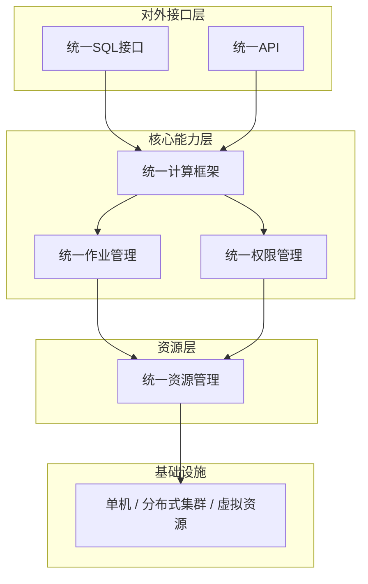

# 《信息技术 大数据 批流融合计算技术要求》（GB/T 44216-2024）章节总结

## 书籍信息
- **书名**：信息技术 大数据 批流融合计算技术要求（GB/T 44216-2024）
- **发布机构**：国家标准化管理委员会
- **归口单位**：全国信息技术标准化技术委员会（SAC/TC28）
- **起草单位**：阿里云计算有限公司、中国电子技术标准化研究院、浪潮电子信息产业股份有限公司、华为技术有限公司等（详见前言）
- **主要起草人**：朱松、陈守元、许洁、王峰等
- **PDF 状态**：可识别文本内容完整，页码有少量重复标记但不影响阅读
- **OCR 状态**：良好，可正常提取

## 目录说明
- **目录识别情况**：完整识别第3页的目次，包含前言、引言、1范围、2规范性引用文件、3术语和定义、4缩略语、5系统架构、6技术要求（含6.1~6.6）、7扩展性要求、8兼容性要求、9性能指标、附录A、附录B、参考文献。
- **章节对应依据**：按照PDF实际页码顺序组织，前言和引言作为独立章节处理，正文按数字编号章节输出。
- **OCR 修复说明**：无实质性错漏，页码标记（如第1页、第2页等）为扫描页码，不影响内容理解。

## 全书核心主题
本文件是国家标准，规定了大数据批流融合计算系统的技术要求。随着大数据发展，批计算（适合离线、全量数据）和流计算（适合实时、增量数据）通常需要协同工作，但直接叠加两个独立框架会导致开发维护成本高、结果合并复杂。为解决这一问题，本标准提出了**统一的批流融合计算技术架构**，包括统一资源管理、统一计算框架、统一SQL接口、统一API、统一作业管理和统一权限管理六大能力。同时明确了扩展性、兼容性和性能指标要求。适用于批流融合计算系统的设计、开发和部署，也可作为产品评估参照依据。

---

## 前言
### 核心论点
本前言说明标准的起草规则、专利免责声明、归口单位、起草单位和主要起草人。核心观点：该标准由全国信息技术标准化技术委员会提出并归口，按照GB/T 1.1—2020规则起草，旨在规范大数据批流融合计算技术。

### 关键概念/事件
- **起草规则**：GB/T 1.1—2020《标准化工作导则 第1部分：标准化文件的结构和起草规则》
- **归口单位**：SAC/TC28（全国信息技术标准化技术委员会）
- **专利免责**：文件发布机构不承担识别专利的责任
- **起草单位**：包括阿里云、中国电子技术标准化研究院、华为、浪潮、腾讯等40余家单位

### 逻辑推演
标准编制遵循国家标准制定程序，由归口单位组织多家企业和研究机构共同起草，最终形成统一的批流融合计算技术要求。

> “请注意本文件的某些内容可能涉及专利。本文件的发布机构不承担识别专利的责任。”

---

## 引言
### 核心论点
问题：批计算和流计算有迥异的编程模型和接口，适用于不同场景（批计算适合需访问全套记录的工作，流计算适合处理实时变化数据）。实际应用中两者常需协同工作，但简单叠加两个引擎会导致开发维护成本高、结果需手工合并。观点：统一的批流融合计算技术成为大数据领域重要发展趋势。

### 关键概念
- **批计算技术**：适合需访问全套记录才能完成的计算工作
- **流式计算技术**：适合处理变动或峰值响应、关注一段时间内变化趋势的数据
- **批流融合**：用一个统一框架同时支持批处理和流处理，降低开发和维护成本

### 逻辑推演
从现实需求出发：两种计算模式各有优势，但实际场景常需同时使用 → 简单叠加两个独立框架的问题（重复逻辑、手工合并结果、改动成本高） → 提出统一批流融合计算技术作为解决方案。

> “在实际应用中，经常会遇到两种计算技术共同工作的情况。将两种计算框架进行简单的叠加，则需要在两个不同的引擎上实现相同的执行逻辑，还需要手工合并不同引擎的输出结果。……这会极大地增加工程的开发和维护成本。因此，统一的批流融合计算技术成为了大数据领域的重要发展趋势。”

---

## 第1章：范围
### 核心论点
本章规定大数据批流融合计算的技术要求、扩展性要求、兼容性要求、性能指标。适用于系统的设计、开发和部署，以及用户理解、采用、建设批流融合计算技术和产品评估。

### 关键概念
- **适用范围**：设计、开发、部署、评估
- **规定内容**：技术要求、扩展性要求、兼容性要求、性能指标

---

## 第2章：规范性引用文件
### 核心论点
列出构成本文件必不可少的引用文件：GB/T 35295—2017《信息技术 大数据 术语》。注日期的仅该版本适用，不注日期的适用最新版本。

### 关键概念
- **GB/T 35295—2017**：信息技术 大数据 术语

---

## 第3章：术语和定义
### 核心论点
本章定义了批流融合计算相关的核心术语，包括批处理、流处理、批流融合计算、分散-聚集、租户、多租户、作业、数据倾斜。其中部分术语来源于GB/T 35295—2017和GB/T 32400—2015。

### 关键概念
- **批处理**：将一个大型作业分解为多个任务由多个节点分别处理，再汇总结果的计算框架。
- **流处理**：针对高速并发且时效性要求高的大规模计算场景，对流式数据进行实时处理的计算框架。
- **批流融合计算**：能够同时支持批处理和流处理的计算框架。
- **分散-聚集（Map-Reduce）**：计算划分并分布在多个节点上，整体结果由各节点结果合并而成的大数据集处理形式。示例：MapReduce。
- **租户**：对一组物理和虚拟资源进行共享访问的一个或多个云服务用户。
- **多租户**：通过资源分配保证多个租户及其计算和数据彼此隔离和不可访问。
- **作业**：一次数据处理操作步骤的完成。
- **数据倾斜**：分布式缓存数据分散度不够，大量数据集中到一台或几台服务节点上的现象。

> “批流融合计算 integrated batch and streaming computing：能够同时支持批处理和流处理等的计算框架。”

---

## 第4章：缩略语
### 核心论点
列出文件中使用的缩略语及其全称。

### 关键概念
| 缩略语 | 全称 |
|--------|------|
| API | 应用程序编程接口 |
| CEP | 复杂事件处理 |
| CPU | 中央处理器 |
| DAG | 有向无环图 |
| GPU | 图形处理器 |
| SQL | 结构化查询语言 |

---

## 第5章：系统架构
### 核心论点
本章给出批流融合计算的总体架构，要求系统具备五大核心能力：统一资源管理、统一计算框架、统一API和SQL能力、统一作业管理、统一权限管理。应用场景参见附录A。

### 关键概念
- **统一资源管理**：支持单机、分布式集群、虚拟资源等多种基础设施的调度管理。
- **统一计算框架**：进行批流融合计算的核心能力。
- **统一API和SQL**：对外提供高阶抽象，支持CEP、机器学习、图计算等作业管理。
- **统一作业管理**：通过相同客户端提交、管理、停止批流作业。
- **统一权限管理**：提供统一的租户管理和鉴权能力。

### 流程图

> 说明：图1 批流融合计算框架图（根据文本描述重建）

---

## 第6章：技术要求
### 第6.1节：统一资源管理
#### 核心论点
批流融合计算技术应具备统一的资源调度和分配能力，支持资源共享、异构资源、优先级调度、动态分配、多级队列、资源隔离与抢占等。

#### 关键概念
- **异构资源调度**：支持CPU、内存、GPU等
- **任务优先级调度**：高优先级可抢占低优先级资源
- **静态/动态资源分配**：支持两种策略
- **多级队列资源管理**：匹配组织层次结构
- **队列资源严格隔离**：不超过分配上限
- **弹性资源抢占**：空闲时可超配使用，繁忙时可被抢占
- **作业级资源隔离**：CPU、内存、GPU等
- **运行模式**：本地模式、集群模式
- **独立部署模式**（宜支持）

#### 逻辑推演
统一资源管理是融合计算的基础 → 需要支持多种硬件资源 → 需要优先级和动态分配提高利用率 → 需要隔离和抢占保证服务质量 → 最后给出具体功能要求（a~k项）。

> “应支持CPU、内存、GPU等异构资源调度和配置。”
> “应支持弹性资源抢占：当有空闲资源时，租户可以使用超过其配置资源，以提高系统资源整体的利用率。”

---

### 第6.2节：统一计算框架
#### 核心论点
统一计算框架需支持批流计算，具备反压机制、状态管理、容错、窗口切分、水印、触发器、并行度设置、CEP、事件驱动、DAG编排等能力，并宜支持机器学习、图计算、乱序处理、迭代处理。

#### 关键概念
- **反压机制**：数据量超出处理能力时，通过限流、缓冲、自然反压等方式防止崩溃和数据丢失
- **状态管理与容错**：支持状态数据恢复，不影响性能
- **数据完整性操作**：至少处理一次、恰好处理一次
- **窗口切分**：按事件时间、处理时间（入口时间）
- **水印操作**：处理事件时间相关操作
- **触发器**：处理事件时间相关操作
- **算子并行度设置**：支持SQL/JAR任务各算子并行度
- **CEP复杂事件**：支持流式CEP模式匹配
- **事件驱动**
- **DAG作业流程编排**
- **多种时间定义**：事件时间、处理时间、入口时间
- **机器学习/图计算**（宜支持）
- **乱序处理/迭代处理**（宜支持）
- **统一容错策略**（宜支持）

#### 逻辑推演
计算框架需统一处理批流场景 → 必须应对数据过载（反压）→ 必须保证状态可靠（容错）→ 必须支持时间语义（窗口、水印）→ 必须提供灵活的执行控制（并行度、DAG）→ 可选高级能力（机器学习、图计算）。

---

### 第6.3节：统一SQL接口
#### 核心论点
应使用统一的SQL描述批流两类作业，支持标准SQL、常用数据类型、DDL、筛选、投影、聚合、连接、集合操作、排序、Top N、去重、结果归档、自定义函数和系统函数。

#### 关键概念
- **标准SQL支持**
- **数据类型**：VARCHAR, BYTE, BOOLEAN, INT, BIGINT, FLOAT, DOUBLE, DECIMAL, DATE, TIMESTAMP, ARRAY, ROW
- **DDL**：定义引用存储系统
- **聚合操作**：窗口聚合（滚动、滑动、会话、累积窗口）和非窗口聚合
- **连接操作**：任意关联条件连接、时间区间连接、维表连接（静态/动态）、窗口连接；内连接、左外连接、右外连接、全外连接
- **集合操作**：UNION, UNION ALL, INTERSECT, EXCEPT, IN, NOT IN, EXISTS, NOT EXISTS
- **排序与限制**：ORDER BY, LIMIT
- **Top N记录**：基于窗口或普通字段
- **去重**：保留最新或最老数据
- **自定义函数**：UDF, UDTF, UDAF
- **系统函数**：字符串、时间、数学处理

#### 逻辑推演
统一SQL接口降低用户学习成本 → 需覆盖批流数据集合的常见操作 → 从数据类型、基础查询、聚合、连接、集合、排序、去重到函数扩展，逐层完善。

---

### 第6.4节：统一API
#### 核心论点
应提供同一套API描述批流两类作业，内置常用数据类型、支持自定义类型、对接多种存储系统、支持过滤、变换、聚合、连接、排序、窗口操作、自定义算子等。

#### 关键概念
- **内置数据类型**：BYTE, BOOLEAN, INT, LONG, FLOAT, DOUBLE等
- **自定义数据类型**
- **存储系统对接**：消息队列、键值存储、复杂数据结构存储、关系型数据库、搜索引擎、分布式文件系统
- **自定义连接器**
- **数据操作**：过滤、一对一变换、一对多变换、聚合、分裂、多路连接、排序
- **窗口操作**：滚动窗口、滑动窗口、会话窗口、全局窗口
- **用户自定义算子**（支持辅助工具）
- **复合数据类型**（宜支持）

---

### 第6.5节：统一作业管理
#### 核心论点
应具备统一的作业管理能力，包括配置管理、批流作业增删改查/启停、监控（输入输出、耗时、延时、QPS、调度信息、数据倾斜）、统一度量指标上报、支持一个作业中先批后流的无缝切换，以及定时/一次调度（宜支持）。

#### 关键概念
- **统一配置管理**
- **批流作业统一管理**：编辑、启停
- **统一监控**：作业级别指标、数据倾斜监控
- **统一度量指标上报**：支持自定义监控
- **批流任务状态无缝切换**：先批任务计算存量初始化状态，再流任务消费无界数据
- **定时调度**（宜支持）：计划任务、固定时间间隔、执行一次

#### 逻辑推演
作业管理需统一面向批流 → 从配置、编辑、启停到监控 → 关键是批流状态无缝切换（存量+增量一体化）→ 可选定时调度。

> “应支持在一个作业中执行批流任务，先通过批任务计算存量数据，初始化状态，再通过流任务消费无界数据，支持批流任务状态无缝切换。”

---

### 第6.6节：统一权限管理
#### 核心论点
应具备统一的租户管理和鉴权能力，包括多租户管理（成员、资源、隔离）、统一权限验证、身份鉴别、作业间资源完全隔离、统一监控（CPU、内存、GPU、硬盘、网络）、API获取监控信息、操作审计（宜支持）。

#### 关键概念
- **多租户管理**：租户成员管理、租户资源管理（CPU、内存）、租户隔离（资源与数据互不可见）
- **统一权限管理**：系统内操作权限验证
- **身份鉴别**
- **作业间资源完全隔离**：CPU、内存、GPU，支持分配和回收
- **统一计算资源监控**：节点资源总量/消耗量，按作业和租户统计
- **API监控信息获取**
- **操作审计**（宜支持）：事件名称、操作人、时间、操作名称

> “应支持租户隔离，不同租户之间相互不可知不可见，租户间的资源和数据相互隔离，且互不影响。”

---

## 第7章：扩展性要求
### 核心论点
批流融合计算技术应具备弹性扩展能力，包括任务均衡、资源动态调整、集群在线扩缩容。

### 关键概念
- **任务均衡**：平衡接入节点的计算压力
- **资源动态调整**（宜支持）：运行时资源不足时动态新增资源
- **集群在线扩容**（应支持）：性能随扩展提升
- **集群在线缩容**（宜支持）：资源富裕时缩减资源节约成本

---

## 第8章：兼容性要求
### 核心论点
应具备兼容多种存储系统和部署模式的能力。

### 关键概念
- **存储兼容**：分布式列存储数据库、关系型数据库、全文检索、内存式数据库、分布式文件系统
- **部署兼容**：物理机集群模式（应支持）、容器部署（宜支持）、边缘设备（宜支持）、跨集群部署任务（宜支持）

---

## 第9章：性能指标
### 核心论点
从吞吐量、事件处理速率、调度性能、单作业并发量、单作业DAG深度、故障切换性能六个角度衡量批流融合计算系统。

### 关键概念
- **吞吐量**：特定条件下集群吞吐量
- **每秒处理事件数**
- **调度性能**：不同并发度下作业调度耗时、支持的任务并发度
- **单作业并发量**
- **单作业深度**：支持DAG深度较大的复杂作业，大流量时稳定性
- **故障切换性能**：无状态数据、少量状态数据、大量状态数据三种情况下的恢复耗时

> 说明：原文第9条中e) 单作业深度出现了重复编号，按原文整理。

---

## 附录A（资料性）：批流融合计算应用场景
### A.1 金融行业
- **场景**：金融交易监控（欺诈/异常交易检测）
- **流式数据源**：实时交易记录、信用卡支付
- **批式数据源**：历史交易记录、黑名单列表
- **融合价值**：提高检测准确率，降低误报率

### A.2 智能制造行业
- **场景**：工厂生产过程监控
- **流式数据源**：传感器实时数据
- **批式数据源**：定期统计分析的工艺参数、质量指标
- **融合价值**：评估生产效率、预测设备故障

### A.3 物联网
- **场景**：物联网系统状态监控
- **数据源**：传感器实时数据 + 云端历史设备状态数据
- **融合价值**：更准确把握系统状态和趋势

### A.4 航空航天
- **场景**：运载器（飞机、卫星）设备监测与故障诊断
- **数据源**：实时传感器数据 + 历史数据
- **融合价值**：提高设备监测和故障诊断的准确率和效率

---

## 附录B（资料性）：字符类型及操作中英文对照表

| 中文名称 | 英文名称 |
|----------|----------|
| 可变长字符串 | VARCHAR |
| 字节型 | BYTE |
| 布尔型 | BOOLEAN |
| 整型 | INT |
| 大整型 | BIGINT |
| 单精度浮点型 | FLOAT |
| 双精度浮点型 | DOUBLE |
| 小数 | DECIMAL |
| 日期 | DATE |
| 时间戳 | TIMESTAMP |
| 数组 | ARRAY |
| 行 | ROW |
| 聚合 | Group By |
| 滚动窗口 | Tumble Window |
| 滑动窗口 | Hop Window |
| 会话窗口 | Session Window |
| 累积窗口 | Cumulative Window |
| 连接 | JOIN |
| 内连接 | INNER JOIN |
| 左外连接 | LEFT OUTER JOIN |
| 右外连接 | RIGHT OUTER JOIN |
| 全外连接 | FULL OUTER JOIN |
| 合并 | UNION |
| 合并所有 | UNION ALL |
| 取交集 | INTERSECT |
| 取差集 | EXCEPT |
| 包含 | IN |
| 不包含 | NOT IN |
| 存在 | EXISTS |
| 不存在 | NOT EXISTS |
| 排序 | ORDER BY |
| 限制 | LIMIT |
| 最大N条记录 | TOP N |
| 插入 | INSERT |

---

## 参考文献
- GB/T 32400—2015 信息技术 云计算 概览与词汇

> 说明：PDF中参考文献仅列出1条。