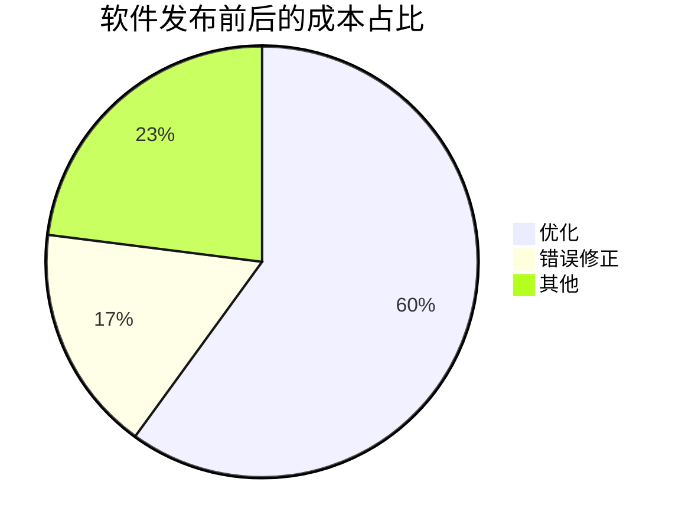
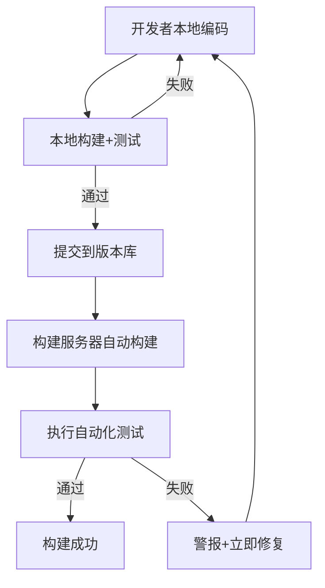
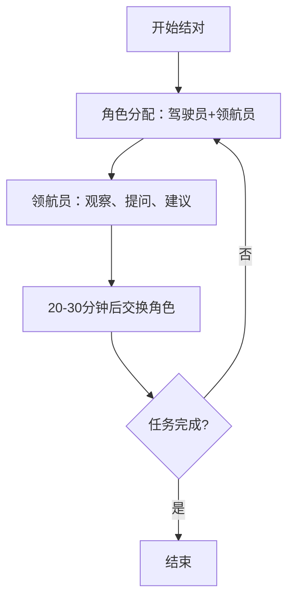
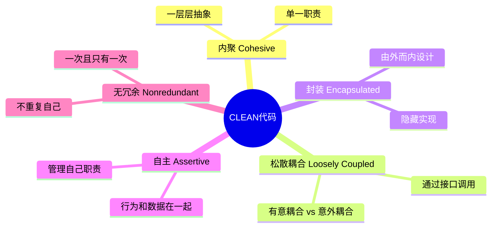
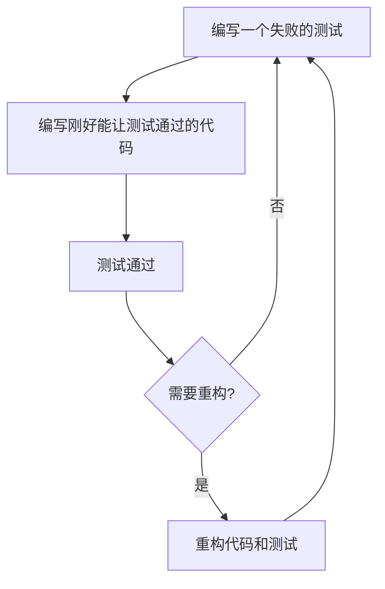
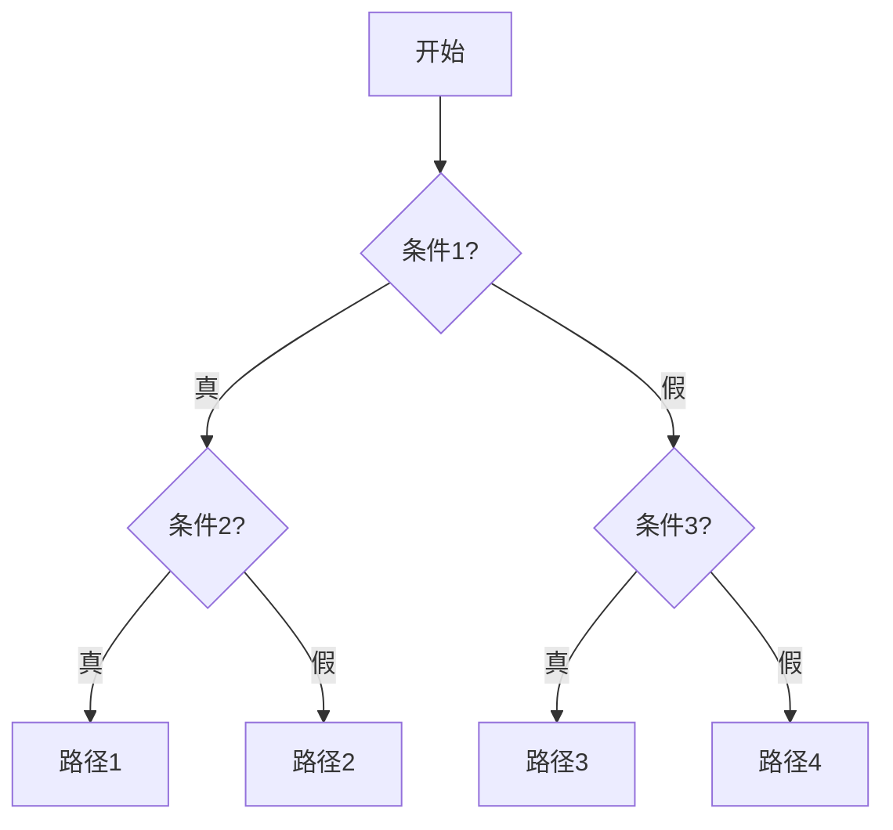
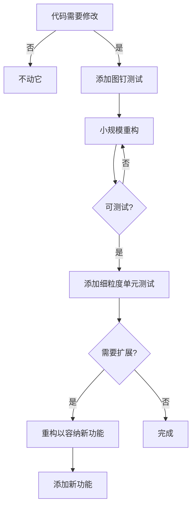

# 《修改软件的艺术》章节总结

## 书籍信息
- **书名**：修改软件的艺术：构建易维护代码的9条最佳实践
- **英文名**：Beyond Legacy Code: Nine Practices to Extend the Life (and Value) of Your Software
- **作者**：[美] David Scott Bernstein
- **译者**：李满庆
- **出版社**：人民邮电出版社（图灵程序设计丛书）
- **出版年份**：2017年10月第1版

## PDF 状态
- **OCR 状态**：可识别，文本完整度较高
- **页码覆盖**：1-198
- **目录识别**：完整，与正文对应
- **图表识别**：部分图表需要基于描述性文本重建

## 目录说明
本书分为两大部分：
- **第一部分：遗留代码危机**（第1-3章）—— 分析问题
- **第二部分：延续软件生命（和价值）的9种实践方法**（第4-14章）—— 提供解决方案

共包含9个核心实践，分别在第5-13章详细阐述。

## 全书核心主题

本书旨在帮助降低构建与维护软件的成本。作者认为，绝大多数生产环境下的软件都是“遗留代码”——难以修正、改进和使用的代码。软件产业长期以来轻视可维护性，导致企业花在维护代码上的成本远超最初编写代码的成本。

作者提出，问题的根源在于传统的瀑布模型开发方式——先分别开发功能再组装发布，这种方式让风险在项目后期集中爆发。作为替代方案，作者从极限编程（XP）、Scrum和精益等敏捷方法论中提炼出9个实践方法。

核心观点是：如果软件被使用，它就需要被修改；因此必须编写出可修改的软件。这9个实践旨在帮助开发者构建易修改、可测试、高内聚、低耦合的CLEAN代码，从而避免软件演变成遗留代码。

---

## 序：遗产（Ward Cunningham 作）

### 核心论点

软件之所以称为“软”，是因为它由思想而生、通过代码表达。但讽刺的是，代码在编写完成后比硬件还难修改。敏捷的真正含义是组织能够迅速适应变化的能力。

### 关键概念

- **遗留代码**：已经失去活力但依旧运行的代码，过去的决策持续影响着深陷其中的人
- **名义上的敏捷**：采用了敏捷书中描述的实践，却收效甚微的组织
- **多语言程序员**：能够在敏捷组织之外获得欣赏的开发者

### 逻辑推演

Ward Cunningham指出，敏捷宣言虽然重要，但存在两方面欠缺：一是过于短小，让读者以为只是一般性观点而非具体建议；二是“开发”一词让读者以为仅适用于新项目。他认为，受雇的开发者有义务让交付的软件持续产生价值。本书的核心价值在于解释敏捷实践为何会起作用，而不仅仅是描述这些实践本身。

### 经典金句

> “遗产是已经死亡的事物存留下的依旧影响着世界的那部分。”(p.8)

> “讽刺的是，代码在编写完成脱离开发者之后变得比硬件还难修改。”(p.8)

---

## 引言

### 核心论点

问题：每天因遗留代码损失时间、金钱和机遇。作者30年经验总结：效率极高的开发者和一般开发者之间的差别巨大，而这些技能都是可以后天习得的。

### 关键概念

- **遗留代码**：格外难以修正、改进和使用的代码
- **瀑布模型**：系统分别按照设计、构建、测试的阶段开发
- **极限编程（XP）**：一种敏捷开发方法论，包括测试驱动开发和重构等实践

### 逻辑推演

作者回顾了自己从传统瀑布式开发到极限编程的转变。在从业头二十年，他发现规划软件开发的方式充满了不可预见的问题。但在尝试极限编程后，放弃试图在一开始把所有事情想明白，而是循序渐进地做，每次只设计、构建、测试一小部分软件。作者通过一个将40多页代码缩减到5页的个人经历，说明同一问题的不同解决方式之间存在巨大的效率差别。

### 本书使用方法

本书面向5类人群：软件开发者、软件开发和IT经理、软件购买者、产品经理和项目经理、其他对技术感兴趣的人。第一部分直面软件产业问题，第二部分提供9个可操作的实践方法。

### 经典金句

> “软件开发与且只与一个东西一样，那就是软件开发。”(p.11)

---

# 第一部分：遗留代码危机

## 第1章：有些事情不对劲

### 核心论点

问题：传统的瀑布模型开发方式导致代码难以维护。作者认为瀑布模型从制造业和建筑业借鉴而来，但软件开发不是制造业流程，先分别开发功能再组装发布是高风险、高成本的。

### 关键概念

- **瀑布模型7阶段**：需求分析 → 设计 → 实现 → 集成 → 测试 → 安装 → 维护
- **Bug**：一行代码的问题就可能造成整个程序崩溃
- **软件考古学**：由Dave Thomas和Andy Hunt在2002年提出的概念，用于研究难以理解的遗留代码
- **食谱 vs 配方**：软件开发应像食谱（允许调整）而非配方（必须严格遵循）

### 逻辑推演

作者首先通过一个公司濒临倒闭的真实故事引出问题：组织内部毫无信任，繁重的流程处处碍事，代码脆弱且难以使用。然后解释瀑布模型为何不管用：它将开发和测试分离，鼓励开发者不认真关注自己的工作。作者指出，“找出错误并非我的工作；创造错误才是”成了许多开发者的潜规则。

接着，作者分析了现代管理技术的问题——管理者倾向于通过提高生产率或强制执行复杂计划来应对，但这往往适得其反。软件开发本质上是一个创造过程，流程无法支配创造力。

最后，作者提出软件产业被称为“外行人产业”的原因：没有广泛接受的共识知识体系，没有类似希波克拉底誓言那样的指导原则。

### 经典金句

> “如果你也和我一样，那么大抵会联想到错综复杂的、难以理清的结构，需要改变然而实际上又根本无法理解的代码。”(p.6)

> “整个软件开发的‘地狱之路’都是由良好的初衷所铺筑的。”(p.9)

> “开发者有三种状态：已完成，未开始，快完事了。”(p.10)

---

## 第2章：逃出混乱

### 核心论点

问题：低效的软件开发方式每年造成数百亿美元损失。作者通过斯坦迪什咨询集团的“混乱报告”和其他研究，揭示软件产业面临的危机。

### 关键概念

- **混乱报告**：斯坦迪什咨询集团对3.4万个软件项目的研究，分为成功（按时、按预算、按需求）、遇到困难（有妥协）、失败（被取消）三类
- **1994年数据**：16%成功，53%遇到困难，31%失败
- **2012年数据**：39%成功，18%失败
- **三个失败核心因素**：(1)代码变更 (2)bug修复 (3)复杂度控制
- **技术债**：Ward Cunningham提出的概念，指代码中欠缺考虑导致的问题积累

### 逻辑推演

作者首先展示混乱报告的数据，但随即指出其定义的局限性——按照斯坦迪什的定义，一个在发布后一个月崩溃的项目也会被归为“成功”。接着，作者驳斥了研究的片面性，指出真正的问题在于：代码变更成本高、bug泛滥成灾、复杂性危机。

美国国家标准与技术研究所（NIST）2002年的报告显示，80%的开发成本花在“排查与修复”上。斯坦迪什的研究还表明，只有20%的功能被经常使用，45%从未被使用。

作者引用多项研究说明损失的规模：美国国家标准与技术研究所估计约600亿美元/年，Dan Galorath的研究认为在500-800亿美元/年。80%的软件开销花在初始发布之后，维护成本可能是开发成本的5倍。

### 流程图



### 经典金句

> “这里十几亿，那里十几亿，很快你就面临着天文数字了。”——参议员埃弗里特·德克森(p.22)

> “信息技术产业面临着崩溃。”(p.23)

---

## 第3章：聪明人，新想法

### 核心论点

问题：虽然敏捷方法论提供了替代方案，但许多组织只实施了表面实践（如站立式会议和两周冲刺），却未理解其背后的技术实践。作者认为追求技术卓越才是敏捷成功的关键。

### 关键概念

- **敏捷宣言**（2001年）：由17位软件开发者共同签署
- **W. Edwards Deming**：将“精益”概念引入日本，关注持续质量改进
- **半成品（WIP）**：精益理论中软件的浪费形式
- **技术采用周期**：创新者 → 早期实践者 → 多数派先行者 → 多数派后行者 → 滞后者
- **跨越鸿沟**：Geoffrey A. Moore提出的概念，指创新从早期实践者传入多数派先行者的关键阶段

### 逻辑推演

作者追溯敏捷的起源：从Deming在日本战后推动精益生产，到丰田采纳精益理念，再到敏捷软件开发方法论的形成。作者指出，许多Scrum团队知道有“产品负责人”和“时间盒子”，但这些实践仅当使用得当且与其他实践配合时才有价值。

作者批评了“名义上的敏捷”——只做了站立式会议和两周冲刺，却依然保留独立质量保证过程、推迟集成的做法。这本质上还是瀑布模型。

在敏捷宣言十周年时，Jeff Sutherland指出“追求技术卓越”是采用敏捷的第一成功要素。作者强调，编写代码需要客观性技能，软件开发需要主观艺术创造性，二者必须平衡。

### 技术采用周期图


### 经典金句

> “精益理论认为，软件的浪费是所有已经开展但尚未完成的任务，是半成品。”(p.27)

> “单纯去掉需求说明文档而没有用软件开发者和产品负责人之间的交流取代，并不是敏捷的初衷。”(p.28)

---

# 第二部分：延续软件生命（和价值）的9种实践方法

## 第4章：9个实践

### 核心论点

问题：如何区分卓越开发者与普通开发者？作者认为关键在于理解原则与实践的区别，以及掌握“守-破-离”的学习阶段。

### 关键概念

- **守-破-离**：日本合气道的精通三阶段——守（基本架势）、破（理解理论）、离（融会贯通）
- **首要原则**：可引申出其他原则的基础法则，如单一职责原则、开闭原则
- **单一职责原则**：修改某个类的原因有且只有一个
- **开闭原则**：软件实体应该对扩展开放，对修改关闭
- **CLEAN代码特质**：内聚(Cohesive)、松散耦合(Loosely Coupled)、封装(Encapsulated)、自主(Assertive)、无冗余(Nonredundant)

### 9个实践列表

1. 在问如何做之前先问做什么、为什么做、给谁做
2. 小批次构建
3. 持续集成
4. 协作
5. 编写整洁的代码
6. 测试先行
7. 用测试描述行为
8. 最后实现设计
9. 重构遗留代码

### 逻辑推演

作者提出，专家级开发者与普通开发者的差异在于：他们关注技术实践和代码质量，明白什么是重要的。令人惊讶的是，编码速度最快的人也是最整洁的程序员——他们不是因为不顾代码质量而快，而是因为保持高质量才能保持快速编码。

作者引入“守-破-离”框架：先从规则开始学习（守），然后理解理论（破），最后融会贯通（离）。Malcolm Gladwell在《异类》中提出需要一万小时练习才能精通——软件开发也不例外。

原则（做什么）和实践（怎么做）相辅相成。原则是目标，实践是达成目标的方法。例如，“低价买，高价卖”是原则，“成本平均法”是实践。

关于软件中的“好”，作者提出应从内部质量（可修改性）而非仅外部质量（无bug、速度快）来定义。如果软件被使用，它就需要被修改——这是好事，意味着用户找到了更多价值。

### 经典金句

> “如果软件有人用，那么它便需要被修改；所以必须编写出可修改的软件。”(p.34)

> “专家级软件开发者对自身的要求比我们严格。”(p.35)

---

## 第5章：实践1——在问如何做之前先问做什么、为什么做、给谁做

### 核心论点

问题：传统项目中高达50%的开发时间花在需求收集上，且需求以“如何做”的方式描述，束缚了开发者的手脚。作者提出用“用户故事”取代需求文档，关注“做什么”而非“如何做”。

### 关键概念

- **用户故事**：描述“什么”（功能）、“为什么”（目的）、“给谁做”（用户）的一句话
- **产品负责人（PO）**：对产品全权负责的人，沟通中枢，决定优先级
- **验收测试**：定义行为完成的标准，可自动化
- **快乐路径**：假设什么事情都不可能出错的理想场景
- **边界情况**：异常路径、错误路径、次要路径

### 逻辑推演

作者指出，客户与客户服务经理都不应指挥开发者“如何做”——因为只有开发者知道如何实现。传统需求文档像“传声游戏”，从客户到分析师到开发者，信息逐渐失真。

用户故事是“沟通的保障”（Alistair Cockburn语），写在3×5卡片上，限制书写内容，迫使通过对话而非文档来沟通。用户故事是有限的、可测试的——知道什么时候算完成可以防止过度开发（近半数功能从未被使用）。

作者强调产品负责人的重要性：必须是特定领域专家，在开发过程中持续探索，及时回答问题，支持重构。验收标准应该自动化，使用Gherkin等工具以“环境-条件-结果”格式编写。

### 验收测试格式示例

```gherkin
Feature: 在线购票
  Scenario: 成功购票
    Given 用户已登录
    When 用户选择电影并支付
    Then 系统生成电子票
```

### 经典金句

> “描述你想要什么，而不是怎么做。”(p.52)

> “用户故事并非构建一组开发者并不需要而且最好不要的指令，而是让我们把精力放在工作上。”(p.49)

---

## 第6章：实践2——小批次构建

### 核心论点

问题：大的任务难以预估、实现和测试。作者提出将任务分解为可在4小时内完成的小批次，每个任务都有可观察的结果和明确的验收标准。

### 关键概念

- **时间盒子**：用固定时间周期执行任务的实践（Scrum中的冲刺）
- **范围盒子**：不管时间，完成一个完整用户故事
- **铁三角**：范围、时间、资源——在软件中范围最容易变通
- **最小可市场化功能集（MMF）**：产品可用且有价值所必需的功能集合
- **利特尔法则**：周期时间 = 任务数量 / 吞吐率
- **看板**：限制正在工作的项目数量，没有冲刺概念

### 逻辑推演

作者以电影拍摄类比：一个镜头一个镜头拍，而非一次拍完整部电影。发布周期越短效率越高——如果所有任务需1周完成，1周发布周期效率100%，6个月发布周期效率仅2.6%。

越小越好的四个原因：更容易理解、预估、实现、测试。分而治之的策略将复合型故事拆分为组件，将复杂型故事分离已知和未知。

作者引用Hakan Forss的利特尔法则：减少待办列表中的任务数量，周期时间变短，反馈更快。理想的任务是约4小时完成——在一个8小时工作日中，只有约4小时“理想工作小时”。

作者批评许多声称“敏捷”的组织只用了站立式会议和迭代，但只有13%用了持续集成，其中只有37%每天集成——这依然是瀑布模型。

### 发布周期效率表

| 发布周期 | 平均等待 | 效率 |
|---------|---------|------|
| 1周 | 1.5周 | 100% |
| 2周 | 3周 | 50% |
| 1个月 | 1.5个月 | 23% |
| 6个月 | 9个月 | 2.6% |

### 经典金句

> “更小的谎言”——敏捷的本质是我们设立更小的目标，用小的谎言自我欺骗。(p.56)

> “两点之间的最快路径不总是笔直的。”(p.62)

---

## 第7章：实践3——持续集成

### 核心论点

问题：将集成推迟到发布前会集中爆发未知风险。作者提出持续集成——在构建时期而非发布前进行集成，将其作为“项目的心跳”。

### 关键概念

- **持续集成**：每次代码提交后自动构建整个系统、执行自动化测试
- **完成 vs 完整完成 vs 完美完成**：完美完成 = 正常工作 + 经过集成 + 清晰健壮
- **持续部署**：可以随时发布到生产环境（发布是商业决定，非开发决定）
- **构建服务器**：自动检测代码变更、触发构建的专用机器

### 逻辑推演

作者将持续集成比作“项目的心跳”——在后台自动运行，永不停息。所有代码、构建脚本、配置文件、数据库模型、测试代码、第三方库都应纳入版本管理。

构建应在10分钟内完成（James Shore和Shane Warden），作者认为本地构建应在1-2秒内完成。构建失败必须立即修复——作者举例一个团队在构建服务器旁放消防头盔，构建失败者必须戴上头盔立即修复。

持续集成的核心价值：尽早消除bug、学习编写更容易集成的代码、降低发布前修改成本。如果集成不痛苦，就应随时集成——每小时甚至更频繁。

作者警告：如果实施双周迭代但每个团队在自己的分支上开发，年末才集成——这依然是瀑布模型。应使用“功能标识”而非分支来控制未完成的功能。

### 持续集成流程图



### 经典金句

> “持续集成仅仅是基础设施而已。”(p.72)

> “一个健康的构建版本是一个健康项目的核心。”(p.77)

---

## 第8章：实践4——协作

### 核心论点

问题：软件开发是一项社会性活动，但许多开发者习惯于独自工作。作者提出结对编程是最有价值的协作实践，能将知识在团队中迅速传播。

### 关键概念

- **结对编程**：两个开发者在一台计算机前执行同一任务（驾驶员+领航员）
- **伙伴编程**：独自工作，每天最后1小时与伙伴进行代码审查
- **穿刺（Spike）**：2个以上开发者在规定时间内研究未知问题
- **群战**：整个团队（或2人以上）同时处理同一问题
- **围攻**：整个团队针对同一用户故事工作
- **代码集体所有权**：团队中每个人可以维护任意部分的代码

### 逻辑推演

作者回忆在IBM做合同工时被安排在“牛棚”（大房间开放式办公），效率反而比有私人办公室的正式员工更高——因为可以协作。

结对编程的研究数据：Alistair Cockburn和Laurie Williams发现结对编程节省15%总编程时间，编写的代码缺陷更少、代码量更少。结对时不易被打扰，不易开小差。

结对方式：驾驶员（键盘前）+ 领航员（观察、交流）。每20-30分钟交换角色。乒乓结对：一人编写测试，另一人让测试通过并编写下一个测试。

谁应该结对？三种方式：(1)强弱项互补 (2)最有经验+最少经验 (3)随机配对。作者推荐随机配对——和所有人合作才能学到最多。

作者强调：结对编程不能由管理者强制实施，团队必须自己发现价值。

### 结对编程流程图



### 经典金句

> “我们最宝贵的资源就是彼此。”(p.81)

> “诲人不倦且不耻下问。”(p.92)

---

## 第9章：实践5——编写整洁的代码

### 核心论点

问题：什么是“好代码”？作者提出CLEAN框架：代码应具备内聚、松散耦合、封装良好、自主、无冗余5种特质。

### 关键概念

- **内聚（Cohesive）**：每个代码片段只关注一件事，单一职责
- **松散耦合（Loosely Coupled）**：保持对象间关系有意义且清晰
- **封装（Encapsulated）**：隐藏实现细节，“做什么”隐藏“如何做”
- **自主（Assertive）**：管理自己的职责，不互相干预
- **无冗余（Nonredundant）**：不重复自己（DRY原则）
- **组合**：用多个小类组合成复杂类（如“人类”由走路、交流、吃饭等类组合）
- **意外耦合 vs 有意耦合**：意外耦合是糟糕的，有意耦合是必要的

### 逻辑推演

作者逐一解释5种特质：
- **内聚**：作者承认自己最初不理解——看到将近50个类的程序觉得“疯了”，后来才明白优秀的面向对象程序像洋葱一样是一层一层的
- **松散耦合**：通过抽象层（接口）调用服务，日后可用模拟对象替换
- **封装**：默认封装，必要时再暴露。“面向接口编程，而不是面向实现编程”（设计模式原则）
- **自主**：行为应和它所依赖的数据放在一起（如打印文档应由“文档类”还是“打印机类”控制？答案是“文档类”）
- **无冗余**：95%的冗余可轻易识别，剩下的5%也值得处理。“冗余是对意图的重复”

可测试性成为衡量设计质量的标尺：需要很多测试→内聚性不足；很多依赖→耦合过多；测试依赖实现→封装有问题。

作者引用Ward Cunningham的“技术债”：关注代码质量会在将来提高开发速度。快速的工作就是整洁的工作——如专业厨师的工作台永远干净。

### CLEAN代码特质图



### 经典金句

> “上帝对象……在试图修改它的时候会惊呼‘我的上帝啊’。”(p.98)

> “谁都能满足一个需求，但优秀的程序员也能封装他们的代码以获得最大的灵活性。”(p.102)

---

## 第10章：实践6——测试先行

### 核心论点

问题：测试驱动开发（TDD）被一些人声称“已死”，因为他们编写了过多或依赖实现的测试，导致“测试引入的损伤”。作者提出正确的TDD方式：只针对要构建的行为编写测试，编写刚好能让测试通过的代码。

### 关键概念

- **测试先行开发**：先编写测试（作为假设），再实现功能让测试通过
- **验收测试** = 客户测试：定义用户故事的行为
- **单元测试** = 开发者测试：测试相对更小的行为单元
- **“单元”的真正含义**：行为的单元，而非代码的单元
- **测试感染者**：发现TDD价值后非得使用不可的开发者
- **质量保证测试**：集成测试、功能测试、性能测试、安全测试等

### 逻辑推演

作者区分三类测试：验收测试（客户测试）、单元测试（开发者测试）、质量保证测试（其他）。TDD不能取代质量保证——质量保证关注特殊情况，而TDD关注行为描述。

“这不是测试”——在编写实现前编写测试时，还没有可测试的东西，所以这是一个“假设”（对需求理解的假设）。代码实现后，它才变成真正的测试。

“单元”不是方法、类、模块——而是“行为的单元”：独立、可验证、可观察的行为。如果行为不变，测试不应变化。

作者回应管理者的质疑：“我不关心开发者是不是进行测试先行开发，我关心的是他们编写出可测试的代码，而TDD是最有效的方式。”

当无法编写测试时，说明设计有问题——这是个“难度开关”，可以调到“极度简单”模式。

TDD失败的原因：测试中有大量冗余、测试针对实现而非接口、测试依赖外部系统（如数据库）。单元测试应仅测试自己的代码单元，外部依赖用模拟对象替代。

### TDD流程



### 经典金句

> “你也许在一本老书或者上过的计算机课中听过这些代码特质……我发现这些想法是许多优秀的软件的核心。”(p.107)

> “TDD不会替你做出设计，但是可以提供基本框架，用来支持可以产生优质设计的自然而然的思想方式。”(p.117)

---

## 第11章：实践7——用测试描述行为

### 核心论点

问题：如何知道需要编写多少测试？作者提出：把测试当作标准（活的文档），测试应该描述行为而非实现。

### 关键概念

- **红条-绿条-重构**：TDD的三个阶段
- **存根代码**：让测试通过编译的最小实现
- **仪表法**：使用有意义的变量名而非硬编码值
- **模拟对象（Mock）**：测试环境下替代真实对象的假对象
- **工作流测试**：测试一系列正确顺序的调用
- **圈复杂度**：代码中路径的数量，影响所需测试数量

### 逻辑推演

作者通过Person类的完整示例演示TDD流程：
1. 编写测试（创建Person，设置name和age）
2. 创建存根类让测试通过编译
3. 执行测试得到红条
4. 实现代码得到绿条
5. 添加年龄限制的测试（边界情况：MIN_AGE-1、MIN_AGE、MAX_AGE+1）
6. 实现异常处理

测试就是标准——对于线性区间（如1-200），仅需3个断言即可完整定义（边界下、边界内、边界上）。每个测试应唯一，失败的测试应有唯一原因。

bug是缺失的测试——修复bug的方式是编写代表该bug的失败测试，修复后测试通过，保证永不复发。

作者引用Capers Jones的研究：开发者通常花费一半以上时间修订之前所做的决定。TDD针对此问题。

### 测试示例代码结构

```java
@Test
public void testCreatePersonWithNameAndAge() {
    Person p = new Person("Bob", 21);
    assertEquals("Bob", p.getName());
    assertEquals(21, p.getAge());
}

@Test(expected = AgeBelowMinimumException.class)
public void testConstructorThrowsWhenAgeBelowMinimum() {
    Person p = new Person("Bob", 0);
}
```

### 经典金句

> “红条、绿条、重构……那是一首旋律，就像歌曲中的鼓点一样。”(p.124)

> “防护网是精神上的保护，它给尝试新事物提供了信心。”(p.136)

---

## 第12章：实践8——最后实现设计

### 核心论点

问题：传统开发先设计后编码，但作者提出在有了可运行代码和全面测试之后进行设计更高效。这是对传统顺序的颠覆。

### 关键概念

- **演化式设计**：从单一可测试行为开始，持续改善直到演化出设计
- **意图导向编程**：所有代码在同一抽象层次，public方法只委托不实现
- **圈复杂度**：McCabe于1976年提出，代表代码中路径数量
- **多态**：可在不知道实现细节的情况下工作
- **将创建和使用分离**：用工厂封装new关键字

### 逻辑推演

作者列出阻碍代码修改的实践：缺乏封装、滥用继承、僵化的实现、内联代码、依赖、使用你创建的对象或创建你使用的对象。

编写可持续代码的5个注意事项：删除死代码、保持名称更新、集中决策、抽象、对类进行组织。

“软件被阅读的次数是编写次数的十倍”——为读者（他人）编写代码，而非为自己。

意图导向编程：所有public API中的代码都应委托给其他方法，保持同一抽象层次。如待办列表写“到银行还车贷”而非“拿到车钥匙，穿上鞋……”

圈复杂度：无if语句=1，1个if=2，2个if=4，3个if=8（指数增长）。应尽量降低圈复杂度，用多态替代条件语句。

将创建和使用分离是面向对象编程的基本技巧之一。创建对象的对象叫“工厂”。这样做可以解耦、提高可测试性。

### 圈复杂度示例



### 经典金句

> “第二次做好。”(p.158)

> “优秀的面向对象代码是通过封装良好的实体构建的，这些实体对要解决的问题进行了准确建模。”(p.148)

---

## 第13章：实践9——重构遗留代码

### 核心论点

问题：遗留代码需要修改时如何安全操作？作者提出重构是在不改变外部行为的前提下改进内部结构，应只在需要修改的代码上进行重构。

### 关键概念

- **重构**：在不改变外部行为的前提下修改内部结构
- **技术债**：与财务债一样，利息会把你拖垮
- **图钉测试**：粗粒度测试，覆盖成百上千行代码的单一行为
- **依赖注入**：框架替我们将对象注入到代码中
- **系统扼杀**：用新服务包裹旧服务，一点点替换直到旧服务被扼杀
- **抽象分支**：提取接口，用功能开关控制新旧实现切换
- **开闭原则**：对扩展开放，对修改关闭

### 逻辑推演

重构降低四方面成本：日后理解代码、添加单元测试、容纳新功能、日后重构。

作者用财务公司案例说明：软件是核心资产，和其他资产一样需要维护。技术债和财务债一样，利息会拖垮你。作者自称技术债“铁公鸡”——总是全额还款。

重构策略：只重构需要修改的代码。“东西没坏，就别去修。”

重构技巧：图钉测试提供落脚点；依赖注入解耦对象和服务；系统扼杀保持系统持续可用；抽象分支消除版本分支依赖。

以开闭原则为目的重构分为两步：第一步重构代码以容纳新功能（不添加功能）；第二步添加新功能。只添加代码，不修改现有代码（更安全）。

作者引用谚语：“第二次做好”——在两个用例的辅助下比只通过一个用例更容易推导出真正的算法。

### 重构决策流程图



### 经典金句

> “重构是在不改变外部行为的前提下对代码的内部结构进行重组或重新包装。”(p.151)

> “软件是软的，利用这个特性我们可以更轻松地构建出更优质、更灵活的代码。”(p.159)

---

## 第14章：从遗留代码中学习

### 核心论点

问题：如何让整个软件行业提升专业水平？作者认为需要分享知识、建立规范、追求技术卓越。

### 关键概念

- **量化研究数据**：TDD团队的缺陷率比平均值低30%-50%
- **IBM团队**：TDD后缺陷率降低40%
- **微软团队**：TDD后缺陷率降低60%-90%
- **福莱特公司**：采用XP后时间减少5个月，质量提高2倍，节省780万美元
- **开源项目研究**：TDD项目内聚性高21.33%，复杂度低30.98%

### 逻辑推演

作者汇总研究数据证明TDD和XP的有效性。量化软件管理协会研究发现高度成熟的XP/Scrum团队缺陷率比平均值低30%-50%。微软研究发现TDD项目代码质量提高超过两倍。

效率提高并不意味着牺牲质量——Layman、Williams、Cunningham研究发现，采用XP两年后效率提升50%，发布前质量提升65%，发布后质量提升35%。

作者呼吁提升整个软件行业：需要分享知识和互相学习，建立类似其他工程领域的通用标准。软件开发是独一无二的，“优秀软件是具象化的理解”。

作者希望未来有比本书更优秀的想法超越这些实践——“这是变革的本质，也是我们追求的。”

### 研究数据汇总表

| 研究机构/作者 | 研究对象 | 主要发现 |
|--------------|---------|---------|
| QSM协会 | XP/Scrum团队 | 缺陷率低30%-50% |
| Nagappan等 | IBM团队 | 缺陷率降低40% |
| Nagappan等 | 微软团队 | 缺陷率降低60%-90% |
| George & Williams | 小型Java程序 | TDD测试通过率高18% |
| Layman等 | XP采用前后对比 | 效率+50%，质量+65% |
| Hilton | 开源项目 | 内聚+21%，复杂度-31% |

### 经典金句

> “优秀软件是具象化的理解。”(p.170)

> “软件是纯粹的思想产物。它源自我们的大脑，通过我们的手指，输入到计算机中。而它掌控着一切。”(p.170)

> “在我们探索星空之前，必须先脚踏实地。”(p.171)

---

## 致谢

作者感谢妻子Staci Bernstein和迷你杜宾犬Nicki。感谢Ward Cunningham为本书作序。感谢所有审阅者，包括Scott Bain、Heidi Helfand、Ron Jeffries、Jim Fiolek、Stas Svinyatskovsky等。感谢过去三十年中参加过作者课程的数千名软件开发者。

---

## 参考文献

主要引用文献包括：
- Beck, K. (2000). *Extreme Programming Explained*
- Beck, K. (2002). *Test Driven Development: By Example*
- Brooks, F. (1995). *The Mythical Man-Month*
- Feathers, M. (2004). *Working Effectively with Legacy Code*
- Fowler, M. et al. (1999). *Refactoring*
- Gamma, E. et al. (1995). *Design Patterns*
- Gladwell, M. (2008). *Outliers*
- Schwaber, K. & Beedle, M. (2001). *Agile Software Development with Scrum*