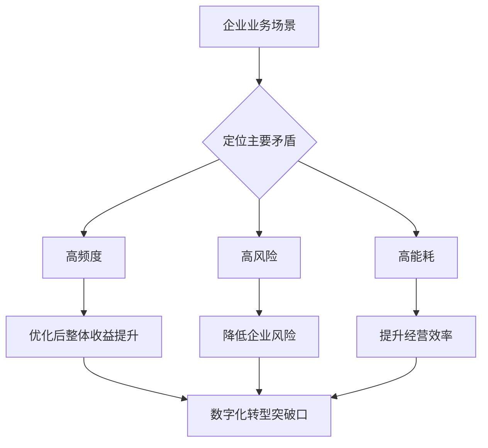
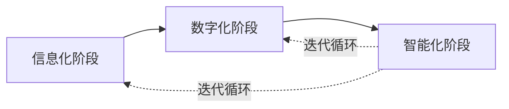
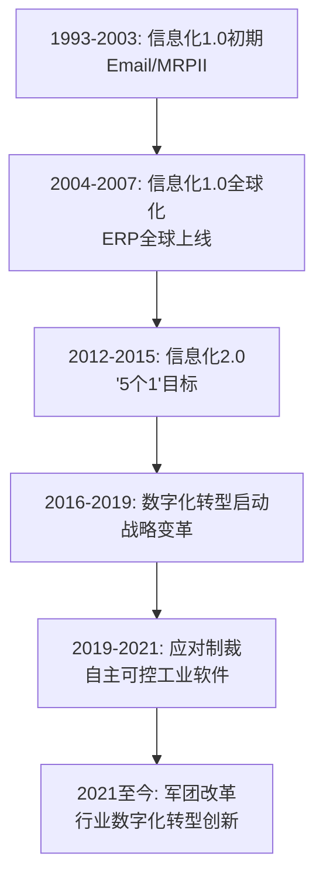
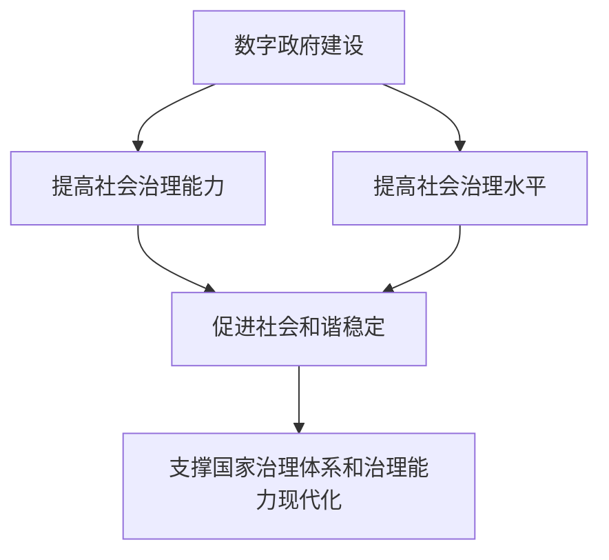

# 《做AI时代的高手：数字化生存极简法则》章节总结

## 书籍信息
- **书名**：做AI时代的高手：数字化生存极简法则
- **作者**：胡荣丰；秦添
- **出版社**：电子工业出版社
- **出版时间**：2025年4月
- **ISBN**：9787121499937
- **字数**：96千字
- **PDF/OCR状态**：基于提供的文本内容（含图片引用，无真实图片），可完整识别目录和正文。图片未提供，但根据描述重建部分流程图。

## 目录说明
- **目录识别情况**：完整识别前言及6个主要章节（NO.1～NO.6），每个章节包含5个子主题。
- **章节对应依据**：严格按原文标题和层级输出。
- **OCR修复说明**：部分图表仅文字描述，已根据描述重建Mermaid流程图；图片引用已忽略，仅保留逻辑关系。

## 全书核心主题
本书旨在帮助个人和企业理解数字化背后的本质、规律和趋势，在AI时代找到生存与发展之道。作者从数字时代的生活与工作方式变革入手，分析数字技术（云、大、智、物、移）的核心作用，探讨数字经济带来的机遇与风险，强调创新作为企业生存的必选项，并系统阐述数字化转型的战略、方法与实践。最后，本书展望了智能世界、元宇宙、数字能源和星际移民等未来图景，引导读者思考人类何去何从。核心观点包括：AI是生产力革命，数字化转型是持续对抗熵增的变革，企业需以客户为中心并建立天道、商道、人道统一的价值观。

---

## 前言

### 核心论点
**问题**：在AI快速发展的时代，个体面临失业焦虑，企业面临“不转型就死”的风险，如何理解和应对数字化浪潮？
**观点**：数字时代赋予人类前所未有的连接性、信息爆炸和快速变化，我们需要保持清醒，不断学习，通过揭示数字化背后的本质和规律，找到自己的位置和价值。

### 关键概念/事件
- **萝卜快跑**：百度自动驾驶出行服务平台，其无人驾驶出租车引发网约车司机对失业的担忧。
- **码头工人罢工**：美国东海岸和墨西哥湾沿岸约4.5万名码头工人反对港口机械设备自动化。
- **ChatGPT与DeepSeek**：近三年AI技术的惊艳崛起，标志着AI从辅助工具向智能体的演进。
- **《SDBE数字化战略到落地》**：作者前作，系统描绘企业数字化转型蓝图，本书为其通俗化补充读本。

### 逻辑推演
作者首先指出数字技术已渗透生活细节，但同时也带来人力替代和焦虑。然后提出本书的六个维度（数字时代、数字技术、数字经济、数字创新、数字化转型、数字未来），通过生动的场景和案例揭示数字时代的三大真相：高度连接性、信息爆炸、变化迅猛。最后强调技术是人类智慧的产物，需警惕风险，保持学习和合作。

### 经典金句/数据
> “我们无法否定数字时代的存在，也无法阻止数字时代的前进，就像我们无法对抗大自然的力量一样。” ——尼葛洛庞帝

> “截至2024年6月，中国网民规模近11亿人，互联网普及率达78%。”（第54次《中国互联网络发展状况统计报告》）

---

## NO.1 数字时代：重新定义生活和工作

### 1. 一切皆可数字化，全新的生活方式不断涌现

#### 核心论点
**问题**：数字技术如何具体改变日常生活？
**观点**：扫码支付、智能驾驶等应用正在重塑出行、购物等基础场景，但同时也带来“数字鸿沟”和治理挑战。

#### 关键概念/事件
- **扫码支付**：王越将二维码技术引入移动支付，马云推动支付宝普及，微信支付通过“红包”引爆市场。支付宝与微信支付合计占移动支付超90%的市场。
- **无现金社会误读**：部分商家拒收现金引发争议。2023年有家长给现金报名被拒，反映出数字鸿沟问题。正确方向是提供多元化支付方式，而非消灭现金。
- **智能驾驶**：由环境感知、决策规划、控制执行三部分组成。特斯拉FSD V12采用端到端架构，华为ADS 3.0实现车位到车位全栈贯通。
- **“AI与规则”之辨**：余承东使用问界M9智驾时因法规限制手不能长时间离开方向盘，两次被禁用。类比1865年英国《机动车法案》，说明技术进步需要社会治理规则同步更新。

#### 逻辑推演
从扫码支付成为“新四大发明”之一，引出其背后的技术和商业竞争；然后讨论“无现金社会”的误读，强调不能剥夺现金使用者的权利；接着转向智能驾驶的技术架构和国内外进展，并以余承东事件说明法规滞后于技术。最后点出智能驾驶的普及依赖于社会治理的突破。

#### 经典金句/数据
> “无现金社会不应消灭现金，而应积极推进银行卡、二维码支付、NFC、票据等多种支付工具的应用。”

> 特斯拉云端算力为35EFLOPS，预计2024年底提升至100EFLOPS。

### 2. 高效率的“打工人”VS机器里的“幽灵”

#### 核心论点
**问题**：数字化工具（如即时通信、监控软件）如何影响员工的工作与生活边界？
**观点**：数字化虽然提高了效率，但也模糊了工作与生活的界限，甚至催生了“幽灵工作”——隐藏在AI背后的数字化零工，他们缺乏保障且被算法无情对待。

#### 关键概念/事件
- **即时通信捆绑生活**：微信等软件导致员工24小时在线，与国外使用邮件划分工作生活形成对比。知乎高赞回答比喻：用微信像“皇帝与奴才”，用邮件像“皇帝与大臣”。
- **职场监控**：企业安装上网监控软件、智能坐垫监测工位、厕所计时器等引发争议。法律允许企业在告知员工的前提下监控公司电脑。
- **幽灵工作**：玛丽·格雷和西达尔特·苏里《销声匿迹》揭示的“自动化最后一英里悖论”——AI永远需要人类来处理边界任务。网约车司机、外卖骑手等数字化零工被平台定义为“用户”，缺乏劳动法保护。
- **外卖算法困境**：配送系统未考虑天气、骑手身体状况等因素，导致超时惩罚和酬金降低。

#### 逻辑推演
首先指出即时通信提高效率但压缩个人空间，然后列举职场监控的几种形式及企业解释（防滥用、保机密、保安全），最后深入“幽灵工作”概念：AI背后隐藏着大量人工劳动，这些数字化零工被隐匿、缺乏保障，并以外卖骑手为例说明算法冷酷。结论是需要适配的劳动保障法规。

#### 经典金句/数据
> “自动化的最大悖论在于‘使人类免于劳动的愿望总是给人类带来新的任务’。”

> “截至2023年12月，我国网络支付用户规模达9.54亿人，占网民整体的87.3%。”

### 3. 数字游民：“反内卷”的自由主义先驱者

#### 核心论点
**问题**：数字游民生活方式是否能真正实现“反内卷”和自由？
**观点**：数字游民依靠互联网创造收入，实现地理位置自由，但代价是收入不稳定、社交关系淡薄、缺乏保障，并非世外桃源。

#### 关键概念/事件
- **数字游民定义**：完全依靠互联网创造收入，打破工作地点强关系，全球移动生活的人群。主要出发点：旅行看世界、降低生活成本、逃离内卷。
- **案例**：2022年“女子逃离大城市去鹤岗全款1.5万元买房”引发热议；95后自由撰稿人离开北京去海南日月湾当岛民，最终因收入不稳定重返大厂。
- **数字灵工**：依靠网络进行创意劳动的零工，没有全职工作，缺乏医疗和失业保险。大理等地聚集大量数字灵工。
- **FIRE运动**：财务自由，提早退休，不少年轻人希望通过攒钱离开大城市。

#### 逻辑推演
从“逃离大城市”的社会现象引出数字游民概念，说明其两种出发点。然后以真实案例展示数字游民面临的挑战：需要高度自律、社交关系弱化、收入向下流动。最后点明“自由职业是一种工作方式，数字游民是一种生活方式”，天下没有毫无代价的自由。

#### 经典金句/数据
> “天下没有毫无代价的自由生活，数字游民只不过选择了更轻的枷锁。”

> 《2021年中国旅居度假白皮书》：超六成年轻人渴望选择办公地点不固定的工作方式。

### 4. 电能转变成智能，百年一遇的生产力革命

#### 核心论点
**问题**：为什么说AI是百年一遇的生产力革命？企业应如何把握？
**观点**：AI能将电能转换成通用智力，实现“机器围着人转”，其意义不亚于蒸汽机。算力是核心驱动力，企业一把手必须亲自抓AI，利用内部数据构建核心竞争力。

#### 关键概念/事件
- **ChatGPT的出现**：第一款真正理解人类语言逻辑的AI软件，智商测试达155，超越绝大多数人类。
- **大模型与大算力**：大模型（参数千亿级）需要大算力支撑。任正非认为第四次工业革命的基础就是大算力。华为目标打造中国算力底座，做厚“黑土地”。
- **企业AI战略**：一把手需学习AI基本原理，踏实做好行业落地的“最后一公里”，企业内部数据是核心竞争力。
- **孟晚舟观点**：算力大小决定着AI迭代与创新的速度。

#### 逻辑推演
对比蒸汽机将热能转为动能，指出AI将电能转为脑力。然后解释大模型原理和算力的重要性，引用任正非、孟晚舟的论述。接着给企业建议：一把手亲抓、学习原理、聚焦应用场景、利用私有数据。最后强调AI不是替代人，而是让人更强大。

#### 经典金句/数据
> “ChatGPT的出现是百年一遇的大趋势，是可以将电能转换成脑力和通用智力的一场生产力革命。”

> 2023年华为研发费用1647亿元，约占全年收入的23.4%。2013-2023年累计研发投入超11100亿元。

> “算力的大小决定着AI迭代与创新的速度，也影响着经济发展的速度。” ——孟晚舟

### 5. AI时代，面对技术冲击，人类该如何自洽？

#### 核心论点
**问题**：在AI不断取代工作岗位的背景下，个体如何自洽和生存？
**观点**：取代你的不是AI，而是会使用AI的人。主动学习、用价值牵引自身成长、培养创造力和情感理解力，才能不被淘汰。

#### 关键概念/事件
- **原画师裁员**：2023年3月，游戏团队砍掉原画外包，一家公司一个月内将38个原画师裁到18个，效率提升50%以上。
- **Resume Builder调查**：1000多家美国企业中近50%已使用ChatGPT，用于写代码、文案、客服等。
- **萝卜快跑威胁**：2024年7月，无人驾驶网约车引发司机担忧。
- **冒险家精神**：张一鸣凭借算法推荐技术开辟新赛道，字节跳动成为独角兽。数字世界属于冒险家。

#### 逻辑推演
先指出AI必然加速淘汰初阶脑力工作者，以原画师和ChatGPT使用数据为例。然后反驳“抵制AI”的观点，强调主动学习的重要性。接着提出“用价值牵引成长”——领导衡量员工在于价值而非工作量，人类独有的创造力、判断力、情感理解力是优势。最后鼓励冒险精神，并以张一鸣为例说明数字世界属于敢于冒险的人。

#### 经典金句/数据
> “未来的世界不是AI取代人类，而是会用AI的人取代不会用AI的人。”

> “勇敢的人先享受世界……数字世界属于冒险家。”

> “冒险家不一定是数字世界的赢家，但数字世界必定是属于冒险家的。”

---

## NO.2 数字技术：是“革命”还是革“命”

### 1. 技术，应该是为了让人类超越“更好”

#### 核心论点
**问题**：技术究竟造福人类还是超越人类？其功过如何衡量？
**观点**：技术的本质是让人类自由地做自己。技术的好处（51%）与问题（49%）之间只有2%的差别，但正是这微小的进步累积，推动人类持续向前。

#### 关键概念/事件
- **X射线、放射性元素、核能**：从伦琴到居里夫妇到索迪，核能开发最终导致原子弹。爱因斯坦哀叹：“技术已经超越了我们的人性。”
- **原子弹 vs 核电**：同一技术有两种完全相反的应用——抹杀可能 vs 拓展可能。
- **《超人类密码》**：卡洛斯·莫雷拉和戴维·弗格森批判技术可能成为“现代的科学怪人”，但认为我们仍能控制故事的结局。
- **51% vs 49%**：作者提出的衡量技术功过的比例，强调微小进步长期累积的效果。

#### 逻辑推演
从石器时代到数字时代，技术从实物变为无形力量。接着以核能为例，既造出原子弹也提供电力，说明技术好坏取决于使用方式。然后提出51%-49%的差值概念，指出人们容易关注负面新闻，但历史长河中人类寿命更长、世界更安全。最后结论：技术应优先考虑人性，让人类自由地做自己。

#### 经典金句/数据
> “技术的本质应该是让人类自由地做自己。”

> “让我害怕的是，我们的技术已经超越了我们的人性，这一点已经变得非常明显。” ——爱因斯坦

> “如果用百分比来衡量的话，科技所带来的好处占比为51%，而引发的问题占比为49%。”

### 2. 第四次工业革命为何是地球最后一次工业革命？

#### 核心论点
**问题**：什么是第四次工业革命（工业4.0）？为什么有人说是最后一次？
**观点**：工业4.0以智能制造为主导，通过数字化、智能化重塑制造业，但“制造”的本质不会消失。谁抢先完成工业升级，谁就在未来竞争中占据优势。

#### 关键概念/事件
- **工业4.0三大主题**：智能工厂、智能生产、智能物流。
- **各国战略**：德国“工业4.0”、美国“制造USA”、日本“社会5.0”、韩国“I-Korea 4.0”。
- **最后一次工业革命的争论**：部分学者认为制造业将被信息取代，但作者反驳——制造业只是向“轻制造”和“服务中心”转变，本质不会消失。
- **中国迎头赶上的必要性**：前两次工业革命缺席，第三次只抓住尾巴，第四次必须领先。

#### 逻辑推演
定义第四次工业革命（以互联网+、AI、大数据等为驱动），介绍各国应对战略。然后讨论“最后一次”的说法：学者认为物质产品会被信息取代，但作者认为这是误解，制造业将更智能、更自动化，但“制造”本质永存。最后强调中国必须迎头赶上。

#### 经典金句/数据
> “谁抢先完成了这一次工业升级，谁就能在未来世界竞争中占据领先优势。”

> “工业4.0背景下的产业变迁是一个从‘重制造’向‘轻制造’，从‘制造中心’向‘服务中心’转变的过程。”

### 3. 云、大、智、物、移，构建万物感知、互联和智能的未来

#### 核心论点
**问题**：数字化世界的技术基础有哪些？华为的“云、管、端”架构是什么？
**观点**：云计算、大数据、AI、物联网、移动互联是五大技术基石。华为提出“云、管、端”三位一体解决方案，通过创新架构联合合作伙伴，共同构建万物智能的未来。

#### 关键概念/事件
- **云计算**：基于互联网的新型计算模式，超大规模、虚拟化、按需服务。
- **大数据**：具有5V特点（大量、高速、多样、低价值密度、真实性），需要新处理模式。
- **人工智能**：研究模拟和延伸人的智能，包括机器人、语音识别、自然语言处理等。
- **物联网**：将日常用品与网络连接，实现智能化识别和管理，是数字世界的神经末梢。
- **移动互联**：移动互联网，改变生活方式，催生新产业。
- **华为“云、管、端”**：云（云计算和云服务）、管（网络连接和管理）、端（终端设备）。在智能汽车领域，华为推出智能车云、智能网联、智能驾驶、智能电动、智能座舱五大业务板块。

#### 逻辑推演
分别解释云、大、智、物、移的定义和特点，然后引出华为的“云、管、端”架构，并以智能汽车领域的具体应用为例，说明该架构如何联合产业链上下游实现协同。最后展望万物感知、万物互联、万物智能的未来。

#### 经典金句/数据
> “物联网可以看作数字世界的神经末梢，它在数字世界与物理世界之间架起桥梁。”

> 华为围绕车联网推出：智能车云（昇腾AI芯片）、智能网联（5G+C-V2X）、智能驾驶（激光雷达+高算力芯片）、智能电动（BMS/MCU）、智能座舱（鸿蒙）。

---

## NO.3 数字经济：是风口，也是险滩

### 1. 重温《数字化生存》与“打不死的华为”

#### 核心论点
**问题**：《数字化生存》的预言如何与现实交融？华为创始人任正非与作者尼葛洛庞帝的对话有何洞见？
**观点**：尼葛洛庞帝关于数字化生存的预言绝大部分已实现，任正非认为AI是人的能力延伸，不会取代人；数字世界需要开放心态和持续学习。

#### 关键概念/事件
- **《数字化生存》的预言**：个人化报纸、KOL、推荐算法、订阅与打赏机制等已成为现实。读者评价：“20年前读是科幻书，现在读是历史书。”
- **任正非与乔治·吉尔德、尼葛洛庞帝对谈**（2019年6月17日）：任正非强调AI会使人能力更强；吉尔德指出人脑连接组容量达1ZB，功耗仅12-14瓦；尼葛洛庞帝畅想未来可通过内部突破学习语言。
- **预测未来的最好办法就是把它创造出来**：书中金句。

#### 逻辑推演
首先回顾《数字化生存》中的预言与现实对比，说明该书从科幻变为历史。然后详细记录三位思想家的对话内容，展现他们对AI和数字未来的不同视角但共同信心。最后强调尽管存在挑战，但个人和社会应对数字化未来张开怀抱。

#### 经典金句/数据
> “预测未来的最好办法就是把它创造出来。” ——尼葛洛庞帝

> “人脑的连接组容量高达1ZB，但只消耗12～14瓦的能量。” ——乔治·吉尔德

### 2. 数字经济——重塑人类生产与生活面貌

#### 核心论点
**问题**：数字经济的定义、结构和对第四次工业革命的引领作用是什么？
**观点**：数字经济以数字化的知识和信息为关键生产要素，分为数字产业化、产业数字化、数字治理化和数据价值化。产业数字化是主引擎，双轮驱动产业发展。

#### 关键概念/事件
- **数字经济定义演化**：从1995年唐·塔普斯科特提出，到G20杭州峰会定义，再到中国信通院2024年定义。
- **数字产业化 vs 产业数字化**：数字产业化是基础部分（电子信息制造、软件等）；产业数字化是融合部分（工业互联网、智能制造等）。2022年产业数字化占数字经济比重81.7%。
- **华为2025十大趋势**：14%家庭有机器人管家，97%大企业使用AI，全球部署650万个5G基站等。
- **中国数字经济规模**：2023年首次突破53.9万亿元，同比增长7.39%，对GDP增长贡献率达66.45%。

#### 逻辑推演
先给出数字经济的官方定义和“四化框架”（数字产业化、产业数字化、数字治理化、数据价值化）。然后展示中国数字经济规模数据和内部结构，指出产业数字化与发达国家差距大，是未来重点。接着列出《“十四五”数字经济发展规划》的八个部署，以及产业数字化转型的四个驱动（替代、连接、数据、智能）。最后总结双轮驱动的作用。

#### 经典金句/数据
> “2023年我国数字经济规模首次突破53.9万亿元，数字经济增长对GDP增长的贡献率达66.45%。”

> “产业数字化部分，中国为31.2%，发达国家为46.9%，差距明显。” ——华为原企业BG总裁丁耘

### 3. 危机四伏的商业丛林，如何寻找最优解

#### 核心论点
**问题**：在数字经济时代，企业如何通过业务模式更迭和数字化转型构建核心竞争力？
**观点**：商业的本质是效率与成本之争。企业必须紧跟数字化潮流，通过管理变革和数字化转型建立核心竞争力，案例包括美的和华为。

#### 关键概念/事件
- **商业本质**：效率与成本之争。提升效率是商业进步的主要方向。
- **美的数字化转型**：2012年启动，重构流程和IT系统；2015年双智战略；2016年数字化转型2.0（以销定产）；2018年产品智能化；2020年升级四大战略主轴。转型十年投入上百亿元，营收增长超150%，净利润增长333%。
- **华为数字化转型历程**：1998年与IBM合作IPD、ISC；2006年IFS财经变革；2007年CRM项目群；2016年明确数字化转型为唯一变革目标。任正非总结：“基本建立了集中统一的管理平台和较完整的管理流程。”

#### 逻辑推演
引用达尔文“适者生存”，点出商业本质是效率与成本。然后说明数字时代企业必须跟上数字化潮流，以美的为例详细拆解其十年转型的四个阶段和成果。再以华为为例介绍其从1998年开始的一系列管理变革。结论：转型成功的企业在竞争中获胜。

#### 经典金句/数据
> “商业的本质就是效率与成本之争。”

> 美的转型期间营业收入增长超过150%，净利润增长333%，资产总额从926亿元提升为3879亿元。

> “华为利用20年的持续努力，基本建立了集中统一的管理平台和较完整的管理流程。” ——任正非

### 4. 物竞天择，数字时代的天道、商道和人道三统一

#### 核心论点
**问题**：华为文化中的天道、商道、人道假设是什么？如何在数字时代实现三统一？
**观点**：天道（企业与环境关系）要求市场机制导入内部；商道（企业存在意义）要求以客户为中心，追求长期价值；人道（企业与利益相关者关系）要求建立利益共享机制。三者统一是企业长期生存的基石。

#### 关键概念/事件
- **天道假设**：企业是社会器官，需将市场压力传递到内部。华为干部培训自费停薪，引入市场机制，“治中求乱，乱中求治”。
- **商道假设**：创造客户。客户价值优先于股东价值；竞争力优先于增值；利润是经营的结果。华为坚持每年投入10%-15%营收于研发，2023年研发费用1647亿元（占23.4%）。谷歌眼镜因忽视用户隐私而失败。
- **人道假设**：人性“有欲则刚”。华为不避讳谈利益，建立员工持股制度。2024年拟分配股利770.95亿元，人均分红约51万元。信任以不信任和制度约束为基础。
- **数字化转型的人道层面**：始于技术，终于组织，需激活人力资源。

#### 逻辑推演
首先解释天道、商道、人道三者的含义。天道部分以华为干部培训收费为例说明市场机制导入；商道部分以谷歌眼镜失败和华为高研发投入为例说明客户价值优先和长期主义；人道部分以华为员工持股和高分红说明利益共同体。最后总结：天道传递压力，商道聚焦客户，人道激发潜能。

#### 经典金句/数据
> “天下熙熙，皆为利来；天下攘攘，皆为利往。”

> 2023年华为研发费用1647亿元，约占全年收入的23.4%。2013-2023年累计研发投入超11100亿元。

> 2024年华为拟向股东分配股利770.95亿元，参与员工约15万人，人均分红约51万元。

### 5. “活下去”是最低纲领，也是最高纲领

#### 核心论点
**问题**：华为如何通过多次危机实现“活下去”？企业如何在数字时代取得长期成功？
**观点**：“活下去”是企业的最高纲领。在正确的主航道上构建能力并尽力奔跑，才能适应市场变化，取得长期成功。

#### 关键概念/事件
- **华为三次断供/危机**：
  - 1989年第一次断供：代理交换机缺货，任正非决定自主研发，推出C&C08程控交换机，1992年销售突破1亿元。
  - 21世纪初“华为的冬天”：CDMA和小灵通判断失误，港湾网络内讧，思科诉讼。通过出售安圣电气获65亿元，收购小公司，开发3G分布式基站打开欧洲市场，2005年海外销售首超国内。
  - 2018年至今的制裁：组建军团（20个），聚焦细分行业。2021年业绩下滑32%，但军团改革力求“多产粮食”。
- **正确主航道的原则**：压强原则，聚焦核心竞争力领域。亚马逊构建物流和数据分析能力，特斯拉快速投入电动汽车研发。

#### 逻辑推演
以“活下去”为主题，详细叙述华为三次重大危机的应对过程：1989年断供促自主研发；2001-2006年冬天通过出售资产、收购、诉讼和解度过；2018年制裁后组建军团。然后引申出企业长期成功的三个要素：找到正确主航道、构建能力、尽力奔跑。案例包括亚马逊和特斯拉。

#### 经典金句/数据
> “只有‘活下去’，才有可能在激烈的市场竞争中立于不败之地！”

> 华为2023年销售收入（未直接给出，但2021年前三季度4558亿元，同比下滑32%）。华为已成立20个军团，涉及智能光伏、智慧公路、电力数字化等。

---

## NO.4 数字创新：不创新就是最大的风险

### 1. 不创新比创新的风险更大

#### 核心论点
**问题**：为什么说在数字时代不创新比创新风险更大？
**观点**：过去是靠正确地做事，现在更重要的是做正确的事（创新）。华为从模仿跟随到客户需求驱动再到愿景驱动，经历了创新1.0、2.0、3.0三个阶段。

#### 关键概念/事件
- **创新1.0：模仿+跟随**：华为早期模仿国外交换机，推出C&C08。腾讯模仿ICQ开发OICQ（后改名为QQ）。
- **创新2.0：客户需求驱动**：2003年引入IPD，以客户为中心，提出“领先半步”理念。华为无线2004年分布式基站打开欧洲市场，2009年销售额破百亿美元。2012实验室成立，专注基础科学。
- **创新3.0：愿景驱动**：进入“无人区”，开放式创新，与大学、研究机构合作。华为战略研究院（2019年成立）探索光计算、DNA存储、原子制造等。
- **任正非名句**：“知识经济时代，企业生存和发展的方式发生了根本变化，过去是靠正确地做事，现在更重要的是做正确的事。”

#### 逻辑推演
先引用任正非的观点：“不创新才是最大的风险”。然后分三个阶段详述华为研发创新历程：从模仿跟随（活下去）到客户需求驱动（领先半步）到愿景驱动（无人区探索）。每个阶段都有具体产品和组织变革案例。最后总结创新是华为的制胜法宝。

#### 经典金句/数据
> “在产品技术创新上，华为要保持技术领先，但只能领先竞争对手半步，领先三步就会成为‘先烈’。”

> 华为战略研究院每年投入3亿美元至大学支持基础研究，其中1亿美元用于前沿技术探索。

### 2. “贸工技”或“技工贸”？数字创新不是简单选择题

#### 核心论点
**问题**：企业应该选择“贸工技”还是“技工贸”路线？
**观点**：两者无所谓对错，只有适合与不适合。企业需要根据自身情况和发展阶段灵活选择或融合。华为早期实际是“贸工技”，后期转向“技工贸”。

#### 关键概念/事件
- **柳倪之争**：联想柳传志主张“贸工技”（先贸易积累资金，再技术研发），倪光南主张“技工贸”（先技术研发）。1995年董事会免去倪光南总工程师职务。
- **华为的路径**：早期代理销售（贸），积累资金后投入研发（工技），最终成为技工贸代表。
- **苹果的“技工贸”**：先技术创新，再产品制造，最后全球销售。
- **比亚迪**：早期电池制造（贸），逐步技术创新，成为新能源汽车领头羊。
- **亚马逊**：从在线书店（贸）到自建物流，再到云计算技术供应商。

#### 逻辑推演
从“柳倪之争”事件切入，解释“贸工技”和“技工贸”的内涵。然后指出两种策略各有优点，华为、苹果、比亚迪、亚马逊的案例说明成功企业往往融合两者或根据阶段调整。结论：不是简单的选择题，需要融会贯通。

#### 经典金句/数据
> “无论‘贸工技’还是‘技工贸’，都只是企业的发展路线问题，无所谓对错，只有适合与不适合。”

### 3. “胜利”或“屈辱”：华为转让5G技术的真相

#### 核心论点
**问题**：华为为何考虑向美国公司转让5G技术？这是胜利还是屈辱？
**观点**：转让5G技术并非投降，而是基于对自身技术和市场前景的信心，同时消除世界对华为5G安全性的疑虑。技术一旦断代，很难再回牌桌。

#### 关键概念/事件
- **何庭波内部信**（2019年5月17日）：海思“备胎”一夜转正，华为进入至暗时刻。
- **任正非表示出售5G技术**（2019年9月）：买家可一次性付费永久使用华为5G专利、代码、蓝图等。胡厚崑解释：促进良性竞争，减少安全疑虑。
- **芯片战背后的启示**：中国科技产业需加大自主研发。华为2019年上半年营收仍增长23%，签订多份5G商用合同。
- **技术断代的代价**：万能充电器被淘汰后无法回归市场。

#### 逻辑推演
从何庭波内部信引出芯片战背景，然后描述任正非宣布出售5G技术的举措，引用胡厚崑的解释说明这是自信和开放。接着讨论技术断代的残酷性，并指出华为在制裁下依然保持增长。最后总结：转让5G技术是复杂博弈中的明智决策。

#### 经典金句/数据
> “在数字创新的路上，技术一旦断代，想要再回到数字经济的牌桌是非常困难的。”

> 华为2019年上半年营收仍以23%的高速增长收官，被列入实体清单后反而签订十几份5G商用合同。

### 4. 现象级故事：华为Mate 60的发布创造了历史

#### 核心论点
**问题**：华为Mate 60系列的发布为何被视为历史性事件？
**观点**：Mate 60搭载麒麟9000S芯片（7nm技术），实现了1万多个零部件基本国产化，标志着华为突破美国技术封锁，是中国科技产业的重大胜利。

#### 关键概念/事件
- **未发先售**：2023年8月29日，华为直接上线Mate 60 Pro，引发抢购热潮。
- **TechInsights拆解**：麒麟9000S采用7nm技术，水平“令人惊叹”，国产零件数占比达98%，价值占比47%。
- **吕廷杰教授观点**：解决了5G智能手机“卡脖子”问题，但与国际先进工艺仍有2-2.5个节点差距，预计中国用“中国速度”3-5年可追上。
- **卫星通话+AI大模型**：Mate 60 Pro是全球首款支持卫星通话的大众智能手机，并接入盘古大模型。
- **央视新闻评价**：“华为突围，说明自主创新大有可为。”

#### 逻辑推演
描述Mate 60未发先售的轰动效应，引用TechInsights拆解报告的结论，说明芯片突破和国产化程度。引用专家观点肯定成绩但也指出差距。最后总结：这不仅是一款手机，更是中国科技产业反攻的象征。

#### 经典金句/数据
> “麒麟9000S的水平是令人惊叹的，让人始料未及，并且肯定也是世界一流的。” ——TechInsights副主席哈切森

> “华为Mate 60 Pro中所使用的一万多种零部件，基本都实现了国产化：国产零件数占比达到98%。”

### 5. 喝杯咖啡，一定能吸收宇宙能量？很可能只想上厕所

#### 核心论点
**问题**：任正非所说的“一杯咖啡吸收宇宙能量”是什么意思？
**观点**：喝咖啡只是形式，本质是开放式创新——通过内部开放和外部合作，与外界交流碰撞，激发创意。华为构建黄大年茶思屋、心声社区等平台，与运营商、竞争对手、大学等广泛合作。

#### 关键概念/事件
- **一杯咖啡吸收宇宙能量**：任正非提倡高级干部多参加国际会议，多喝咖啡，碰撞出火花。
- **黄大年茶思屋**：2022年上线的线上+线下科技交流平台，提供学术热点、咖啡茶话、STW研讨会、技术难题发布等服务。已在华为园区、清华大学、四川大学等地落地。
- **开放式创新**：内部开放（罗马广场、心声社区、宽容失败）、对外开放（与30多家运营商建立联合创新中心、与竞争对手交叉许可专利）。华为与西门子成立合资公司，与沃达丰等合作研发。
- **三角联盟**：华为作为商业领导者，与运营商、SP/CP、上下游企业开展合作研究。

#### 逻辑推演
从作者个人习惯引出任正非的“一杯咖啡吸收宇宙能量”。解释黄大年茶思屋平台的功能和目的。然后系统阐述开放式创新的理念：内部先开放，再对外开放，与竞争对手合作，构建生态。引用任正非“心胸有多宽，天下就有多大”总结。

#### 经典金句/数据
> “一杯咖啡吸收宇宙能量，并不是咖啡因有什么神奇作用。而是利用西方的一些习惯，开放表述、沟通与交流。” ——任正非

> “心胸有多宽，天下就有多大。……封闭的东西迟早都要死亡。” ——任正非

---

## NO.5 数字化转型：不是可选题，而是必选题

### 1. 永恒&无常：数字化是延缓熵增的变革

#### 核心论点
**问题**：熵增定律如何解释企业兴衰？数字化转型为什么是对抗熵增的有效手段？
**观点**：熵增定律导致万物走向无序和死寂。企业通过建立耗散结构（开放系统、引入负熵）可以延缓熵增。数字化转型正是帮助企业建立耗散结构、对抗熵增的关键路径。

#### 关键概念/事件
- **熵增定律**：克劳修斯提出，封闭系统中熵不断增加，事物趋向混乱和无序。国家熵增导致王朝更替，企业熵增导致百年老店不常有。
- **耗散结构**：普里高津提出，开放系统与外界交换物质能量，可形成新的有序结构。人体通过新陈代谢对抗熵增。
- **薛定谔**：“生命以负熵为食。”
- **华为活力引擎模型**：以客户为中心，上方开放入口吸收能量，下方出口吐故纳新，左边耗散结构（熵减），右边熵增。
- **避免路径依赖**：微软纳德拉放弃对Windows的依赖，推出云服务；腾讯推出微信替代QQ；阿里巴巴从B2B扩展到C2C、B2C、新零售。
- **宝洁数字化转型**：业务流程变革（线上化、优化、自动化）、商业模式变革（新产品、新渠道、新供应链）、企业文化变革（提升数商）。2023年净销售额820亿美元，创历史新高。

#### 逻辑推演
先解释熵增定律及其消极含义，然后引入耗散结构和“生命以负熵为食”的概念。接着用华为活力引擎模型说明企业如何引入负熵。举例微软、腾讯、阿里巴巴如何避免路径依赖。最后以宝洁数字化转型案例展示如何通过业务流程、商业模式、文化变革实现熵减，并总结数字化转型是对抗熵增的有效手段。

#### 经典金句/数据
> “生命以负熵为食，人活着本质上就是在对抗熵增定律。” ——薛定谔

> “企业只有长期推行耗散结构，保持开放，才能与外部进行能量交换，吐故纳新，持续地保持活力。” ——任正非

> 宝洁2023年净销售额820亿美元（约5871.2亿元人民币），同比增长2%，创历史新高。

### 2. “机器换人”VS“软件换脑”：技术只是冰山一角

#### 核心论点
**问题**：数字化转型仅仅是“机器换人”或“软件换脑”吗？
**观点**：数字化转型不是简单的技术应用，而是涉及企业战略、文化、运营模式、组织结构、业务流程的系统变革。核心在于“人”——需要全员数字化思维和认知革命。

#### 关键概念/事件
- **机器换人**：用自动化设备替代人工，提高效率。但这是碎片化供给，无法实现全局优化。
- **软件换脑**：用数字化软件和系统替代管理者决策。作者认为过于重视软件同样片面。
- **数字化转型的正确理解**：IDC定义——“利用数字化技术和能力来驱动组织商业模式创新和商业生态系统重构”。技术只是冰山一角，水下是战略、业务、流程、组织、文化的变革。
- **彼得·德鲁克**：“在动荡的时代，最大的威胁不是动荡本身，而是延续过去的逻辑。”
- **认知革命**：企业家和管理层必须有数字化的管理思维，否则看不懂数字化运营图和组织结构。

#### 逻辑推演
先批判“机器换人”的片面思维，引用《数字迁徙》中“软件换脑”的概念但也指出其局限性。然后引用IDC定义强调数字化转型是复杂变革。引用德鲁克的话说明认知转变的重要性，最后指出核心在于“人”——需要培养全员数字化素养和思维。

#### 经典金句/数据
> “数字化转型不仅是一次技术革命，更是一次认知革命。”

> “数字化转型的核心在于‘人’。”

> “我们经常说‘新瓶装旧酒’，但是数字化转型这个新瓶里可不能装旧酒了。”

### 3. 企业转型的数字逻辑：转什么？怎么转？转到哪？

#### 核心论点
**问题**：企业数字化转型具体转什么、怎么转、转到哪？
**观点**：数字化转型需要重构业务流程、客户体验和内部运营。入手点应选择高频度、高风险、高能耗（“三高”）的业务场景。转型是一场只有起点没有终点的旅程。

#### 关键概念/事件
- **数字化转型三大重构**：业务流程重构、客户体验重构、运营重构（数据驱动决策）。
- **京东**：库存周转天数降至33.3天，比亚马逊短一周，得益于数智化供应链。
- **海底捞**：斥资1.5亿元打造无人餐厅，食材加工前置到供应商，智能机器人取代服务员。
- **三高法**：高频度（重复发生的场景）、高风险（人工作业错误率高）、高能耗（影响成本的关键场景）。
- **华为财经大屏**：实现账实相符率从70%多提高到99%以上。功能包括自动发现风险、弹窗提示、发起群聊会议等。
- **数字化转型只有起点没有终点**：企业需不断迭代升级。

#### 逻辑推演
首先说明数字化转型需要对业务、体验、运营三大重构，举例京东和海底捞。然后提出“三高法”作为选择突破口的方法。以华为财经大屏为例详细说明如何应用“三高法”实现账实相符率大幅提升。最后引用变革专家的观点，强调数字化转型是长期迭代的过程。

#### 流程图：三高法

#### 经典金句/数据
> “任何不涉及流程重构的数字化转型，都是在装样子，是在外围打转转，没有触及核心。” ——华为CIO陶景文

> 华为账实相符率从70%多提高到99%以上。

> 京东库存周转天数33.3天，比全球零售巨头亚马逊还要短一个星期。

### 4. 来自数字时代的“新物种”——数字化企业

#### 核心论点
**问题**：传统企业与数字化企业有何差别？华为数字化转型经历了哪些阶段？
**观点**：数字化企业是新的组织形态，以体验优先、技术驱动创新、云化数据底座、察打一体为特征。华为从信息化1.0到信息化2.0再到数字化转型新阶段，走过了30多年。

#### 关键概念/事件
- **传统企业与数字化企业的四大差异**（华为熊康）：
  1. 功能优先 vs 体验优先
  2. IT固化流程 vs 技术驱动创新
  3. 烟囱式数据割裂 vs 云化数据底座
  4. 层层汇报 vs 察打一体
- **企业数字化转型三阶段**：信息化阶段、数字化阶段、智能化阶段（迭代循环）。
- **华为数字化转型历程**：
  - 信息化1.0（1993-2007）：从MRPII到ERP全球上线，海外销售首超国内。
  - 信息化2.0（2012-2015）：“5个1”目标，过渡阶段。
  - 数字化转型新阶段（2016至今）：2017年确立为集团最重要战略变革；2019年“实体清单”后转向自主可控工业软件；2021年参与组建数字化工业软件联盟，成立20大军团。
- **军团组织**：围绕细分场景，整合科学家、专家、销售、交付等，做深做透，为华为多产“粮食”。

#### 流程图：企业数字化转型三阶段

#### 流程图：华为数字化转型历程

#### 经典金句/数据
> “数字化转型它不是信息化的简单升级，而是一个复杂且系统的大工程。”

> 华为每年投入销售收入的2%左右用于信息化系统建设与完善。

> 截至2023年底，鸿蒙生态设备数量已超过8亿台。

### 5. 数字化战略：站在未来看现在，未来与现在互锁

#### 核心论点
**问题**：企业如何制定和执行数字化转型战略？
**观点**：数字化战略需要战略决心和坚强意志，注重执行闭环（战略管理→过程监控→执行评估→落地保障）。战略是站在未来看现在，实现未来与现在互锁。

#### 关键概念/事件
- **战略决心**：美的方洪波立军令状，两年内完成流程、主数据和IT系统建设，否则事业部总经理担责。任正非：“如果你不能正确对待变革，抵制变革，公司就会死亡。”
- **数字化转型战略到执行的闭环管理**：
  1. 战略管理：明确愿景、目标、新商业模式，拆解为可执行小目标。
  2. 过程监控：从人和事两个角度监控执行。
  3. 执行评估：评估执行进度、风险、资源利用情况。
  4. 落地保障：组织保障、人才保障、资金保障、技术保障。
- **中国大唐数字化愿景**：“打造数字大唐，建设世界一流能源企业”。

#### 流程图：数字化转型战略到执行的闭环管理

#### 经典金句/数据
> “夫未战而庙算胜者，得算多也；未战而庙算不胜者，得算少也。” ——《孙子兵法》

> “数字化转型每年投入几十亿元，看不见结果我也很焦虑。” ——方洪波

> “危机的到来是不知不觉的，如果说你们没有宽广的胸怀，就不可能正确对待变革。” ——任正非

---

## NO.6 数字未来：人类何去何从的终极思考

### 1. AI：硅基生命是否会取代碳基生命？

#### 核心论点
**问题**：硅基生命（AI）会取代碳基生命（人类）吗？
**观点**：AI不会完全取代人类，而是与人类共同发展。AI是工具，用于解放和发展生产力。人类应保持乐观态度，同时注重伦理约束和监管。

#### 关键概念/事件
- **碳基生命 vs 硅基生命**：地球生命以碳元素为核心；硅基生命是科学假设，以硅元素取代碳，可能耐高温、具有半导体特性。马斯克预言：“人类社会只是一小段代码，它的存在是为了启动超级数字智能物种的计算机程序。”
- **OpenAI“宫斗”**：保守派与商业派对AI安全性和商业化的分歧。
- **任正非的乐观态度**：AI对工业社会、农业社会的贡献超过98%。湘潭钢铁厂炉前无人化，天津港无人化，山西煤矿用5G+AI减少人员60%-70%。
- **霍金与马斯克的担忧**：霍金认为AI比武器更危险；马斯克创立OpenAI和脑机公司Neuralink以应对风险。

#### 逻辑推演
先介绍硅基生命的概念和马斯克的预言，然后呈现两派观点：霍金和马斯克的担忧 vs 任正非的乐观。作者倾向于华为的立场，认为AI是工具，与人类合作共生。最后强调人类需要监管和伦理约束。

#### 经典金句/数据
> “AI不会完全取代人类，而是会与人类共同发展。”

> “中国的湘潭钢铁厂，从炼钢到轧钢，炉前都无人化了；山西煤矿在地下采用5G+AI后，人员减少了60%～70%。” ——任正非

> 从单细胞到人类用了30亿年，从一维GPT到二维Sora只用了不到一年。

### 2. 虚拟与现实同在，社会该如何治理？

#### 核心论点
**问题**：虚拟世界（如元宇宙）带来哪些道德和法律挑战？如何治理？
**观点**：虚拟世界需要建立秩序规则，包括完善AI法律法规、推动数字政府建设、加强网络虚拟社会治理。虚拟世界不是法外之地。

#### 关键概念/事件
- **“Horizon Worlds”性骚扰事件**：Meta元宇宙平台，女测试者遭口头和肢体骚扰。网友争论虚拟触碰是否算性骚扰。
- **虚拟土地非法集资**：Decentraland平台虚拟土地被高价炒作，可能虚假交易。
- **法规滞后**：尼葛洛庞帝说：“我们的法律就仿佛在甲板上吧嗒吧嗒挣扎的鱼一样。”
- **中国应对**：
  - 2021年《新一代人工智能伦理规范》
  - 2023年《人工智能法示范法1.0（专家建议稿）》
  - 数字政府建设（大数据预测经济、保护弱势群体等）
  - 党的二十大报告：“健全网络综合治理体系，推动形成良好网络生态。”

#### 流程图：建设数字政府的价值

#### 经典金句/数据
> “预计到2035年，25%的人每天至少在虚拟世界中花费一小时。” ——欧洲刑警组织

> “现在的虚拟世界并非法外之地，每个人都要对自己的言行负责。”

### 3. 网络战争如何与传统军事力量相媲美

#### 核心论点
**问题**：网络战争在当代战争中的地位如何？传统“拼刺刀”技能是否过时？
**观点**：网络空间已成为“第五战场”，AI正在推动战争从信息化转向智能化。但传统战斗技能仍是保底手段，战争归根结底是人与人之间的对抗。

#### 关键概念/事件
- **信息支援部队成立**（2024年4月19日）：中国人民解放军全新战略性兵种，统筹网络信息体系建设。
- **俄乌网络战**：黑客组织“匿名者”攻击俄罗斯电视台、克里姆林宫官网等。美国数据分析公司Primer通过AI分析20多亿张图片，导致俄军10多位高级将领阵亡。
- **以色列“薰衣草”系统**：AI识别3.7万个哈马斯目标，锁定目标只用20秒。但未能预测哈马斯奇袭，且导致大量平民死亡（9000多人，含3900名儿童）。
- **《士兵突击》台词**：“飞机终将会被击落，战舰终将会被击沉！……战争的根本还是人和人的对抗。”
- **周鸿祎**：“网络战是现代战争的首选与前战。”

#### 逻辑推演
从中国成立信息支援部队引入，说明网络战争的重要性。以俄乌战争和以色列“薰衣草”系统为例，展示AI在战争中的巨大作用和潜在风险（平民伤亡、预测失败）。然后通过《士兵突击》台词强调人的因素不可替代，传统技能仍是保底手段。最后总结：需未雨绸缪，重视AI军事应用，但不可忽视人的智慧。

#### 经典金句/数据
> “不管是传统战争，还是信息化战争、智能化战争，归根结底还是人与人之间的对抗。”

> “机器执行任务冷酷无情，完成任务变得更加容易。” ——以色列情报官员

> 以军对加沙大规模轰炸已造成9000多人死亡，其中有3900多人是儿童。

### 4. 未来智能世界的畅想：元宇宙、数字能源与星际移民

#### 核心论点
**问题**：未来智能世界将如何发展？元宇宙、数字能源、星际移民会带来什么？
**观点**：元宇宙将带来沉浸式交互但可能割裂现实与虚拟；数字能源将推动“丰饶时代”，物质不再稀缺；星际移民是人类成为跨星球物种的必由之路，但挑战巨大。

#### 关键概念/事件
- **元宇宙**：尼尔·斯蒂芬森《雪崩》提出。2021年“元宇宙元年”：Roblox上市、英伟达Omniverse、字节收购Pico、Facebook更名Meta。特点：沉浸感、参与度、实时互动。风险：身份认同危机、伦理挑战、大数据操控。
- **数字能源**：华为研究团队预测，2030年可再生能源占全球发电总量50%，光伏度电成本低至0.01美元。国际能源署：数字技术可使油气生产成本减少10%-20%。“丰饶时代”：物质唾手可得，无需为金钱忧虑。
- **星际移民**：马斯克计划8年内（2032年前）送人类上火星，到2050年送100万人上火星。背景：“核能150年魔咒”（从发现核能到人类自我毁灭的窗口）。中国“近邻宜居行星巡天计划”探索32光年外宜居行星。
- **AI“复活”案例**：台湾音乐人包小柏AI复活女儿；汤晓鸥以“数字人”形象表演脱口秀。

#### 经典金句/数据
> “未来已来，只是尚未普及。” ——威廉·吉布森

> “预计到2030年，在能源生产侧，风光新能源成为主力电源之一，可再生能源占全球发电总量比例的50%，其中光伏度电成本将低至0.01美元。” ——华为研究团队

> “核能150年魔咒”：从1905年爱因斯坦质能方程算起已近120年，时间紧迫。

> 马斯克计划到2050年把100万人送上火星。

> 说明：本章部分图表（如数字政府价值图）已根据描述重建；原文中图片引用（如images/000018.png等）因无真实图片，已忽略但保留逻辑关系。

--- 

**文档结束**