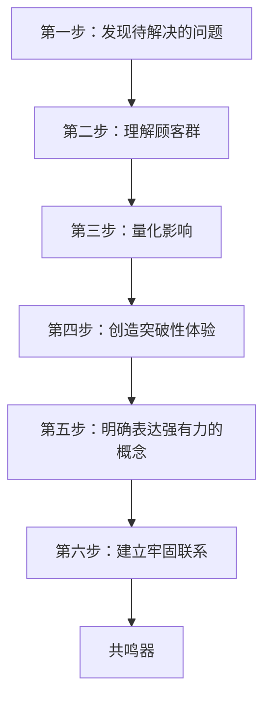
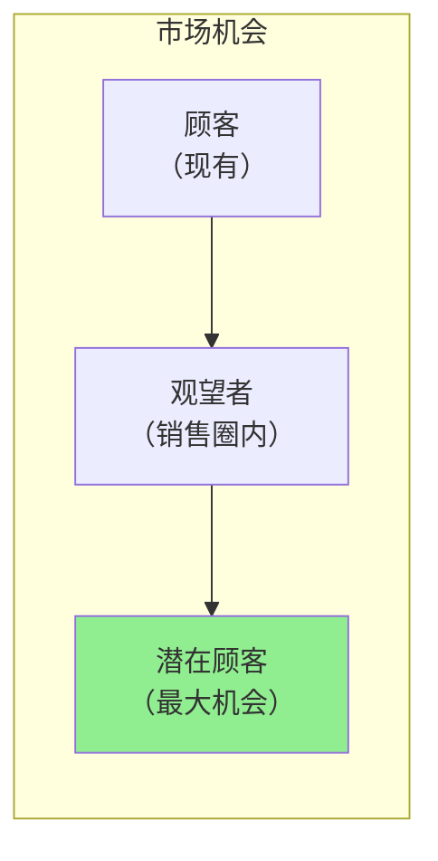
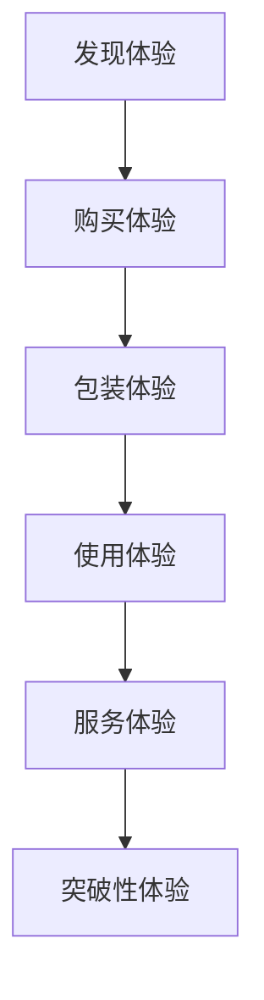
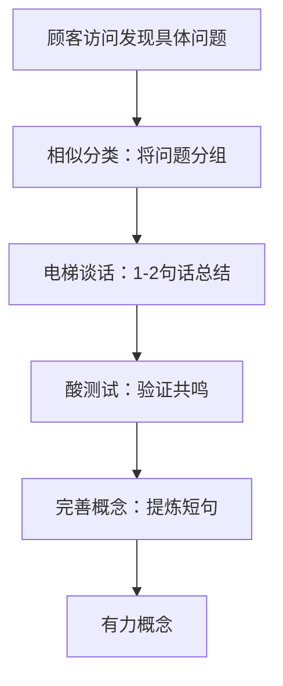
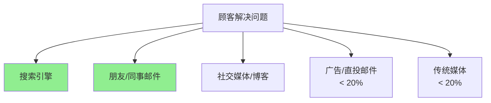
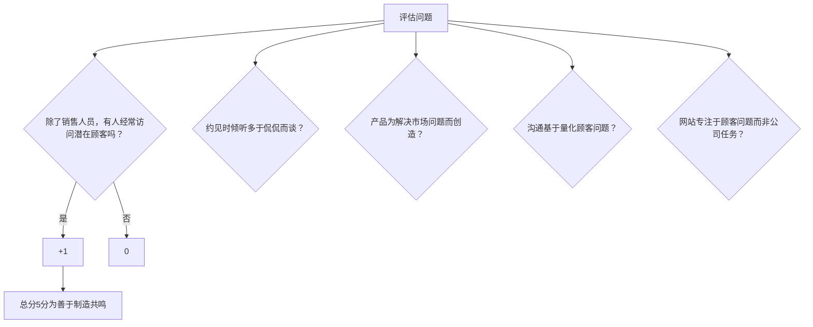

# 《共鸣：打造突破性的产品和服务》章节总结

## 书籍信息
- 书名：共鸣：打造突破性的产品和服务
- 作者：克雷格·斯图尔（Craig Stull）、菲尔·迈尔斯（Phil Myers）、戴维·米克尔（David Meerman Scott）（根据书中第一章信息）
- PDF/OCR状态：基于epub文件提取的文本，识别基本完整，部分章节编号有跳跃（第九章缺失），内容连续。
- 说明：该书由务实营销公司（Pragmatic Marketing）创始人等撰写，系统介绍“共鸣法”六个步骤，通过大量案例说明如何创造顾客愿意购买的突破性产品和服务。

## 目录说明
- 识别到的实际章节：第一章至第八章、第十章、第十一章（第九章在目录中未出现，正文亦缺失）
- 章节对应依据：正文标题和内容
- OCR修复说明：无重大错漏

## 全书核心主题
本书提出“共鸣法”（Resonance Methodology），一套系统的方法论，用于发现市场中人们愿意为之付费的待解决问题，并创造“共鸣器”——顾客能立刻理解其价值、自愿购买并推荐的产品或服务。作者批判了三种常见的失败文化（创新至上、收益至上、现有顾客至上），强调成功的组织应“外部想法内部化”，通过走出办公室、深入访谈潜在顾客，理解其“声明的需求”和“沉默的需求”，然后定义顾客群、量化影响、利用特殊能力创造突破性体验、明确有力的概念并与顾客建立牢固联系。全书以Zipcar、iPod、Nalgene瓶、拉塞尔·萧房地产服务等数十个案例贯穿六步骤，最终呼吁组织培养共鸣文化。

---

## 第一章：共鸣
### 1. 核心论点
问题：为什么有些产品和服务获得巨大成功，而另一些却失败？  
作者观点：成功的关键不是创造力、运气或精明的营销，而是发现并解决顾客愿意为之付费的待解决问题，创造“共鸣器”。

### 2. 关键概念/事件
- **共鸣器**：能完美解决潜在市场问题、让顾客自愿购买的突破性产品和服务（如星巴克、《美国偶像》、谷歌、Zipcar）。
- **内部想法外部化 vs 外部想法内部化**：失败组织在公司内部开会猜测需求；成功组织不断倾听、发现和理解顾客的问题。
- **日本工薪族酒店案例**：酒店经营者发现坐过站的工薪族需要廉价过夜场所，在偏僻终点站建酒店，解决被忽视的市场问题。
- **拉塞尔·萧房地产案例**：通过问卷了解房屋出售者的问题（快速卖房、高价、避免佣金、不签长期合同），创造“无忧房屋代售”服务，佣金仅3%，房子47天内售出（行业平均111天）。

### 3. 逻辑推演
作者从日本工薪族坐过站引出“共鸣”概念。指出大多数组织依靠猜测、假设和昂贵广告推广产品，而成功的组织通过深入访谈了解市场。强调共鸣法六步骤将逐步展开。拉塞尔·萧的成功证明即使在传统行业也能创造共鸣器。作者自称具备多年教学经验，发现市场对指导性书籍的需求，因此写成此书。

### 4. 经典金句/数据
> “我们相信，如果善于制造共鸣的萧能在房地产这样竞争激烈的传统行业中打造共鸣器，你也一定能做到。”
> “在潜在顾客的地盘上（在他们的家里、工作场所甚至大街上）对其进行访问，是创造共鸣器的开始。”
> 拉塞尔·萧2005年卖出620套房屋，业绩惊人。

---

## 第二章：不知道制造共鸣……只是猜测
### 1. 核心论点
问题：为什么大多数组织不能制造共鸣？  
作者观点：三种错误文化——创新就是一切、收益能弥补一切、现有顾客知道一切——导致组织猜测市场需求，而不是真正了解顾客问题。

### 2. 关键概念/事件
- **创新导向神话**：为创新而创新（如网络冰箱、苏珊·安东尼硬币），不解决真实问题，风险巨大。
- **收益导向神话**：专注于销售和广告，迫使销售人员过度承诺，偏离顾客真正需求。
- **顾客导向神话**：仅听取现有顾客意见，导致产品线延伸而非突破性创新（如iPod前的大容量便携播放器）。
- **“重力”**：让团队回到不制造共鸣状态的力量——内部会议中职位最高者或声音最大者获胜，而非数据。
- **“尽管你的意见很有趣，却毫不相关”**：只有顾客意见最重要。

### 3. 逻辑推演
作者以电影《飞越未来》中乔许与保罗的对话开场，讽刺公司用数据自我欺骗。接着剖析Woodstream捕鼠器失败、苏珊·安东尼硬币失败、网络冰箱失败等案例，证明猜测的代价。然后区分四种组织文化，指出共鸣法导向的公司最成功。提出“重力”概念，说明坚持共鸣法如坚持锻炼一样困难。最后给出自测问题，判断组织是否在猜测。

### 4. 经典金句/数据
> “尽管你的意见很有趣，却毫不相关。”
> “善于制造共鸣的公司重视外部想法内部化，而非常见的内部想法外部化。”
> “网络冰箱是一个经典的猜测案例，当事人将内部想法外部化。”
> “Woodstream公司：我们应该花更多时间研究家庭主妇，少去研究老鼠。”

---

## 第三章：制造共鸣
### 1. 核心论点
问题：如何系统地制造共鸣？  
作者观点：通过六步共鸣法——发现待解决问题、理解顾客群、量化影响、创造突破性体验、明确表达有力概念、建立牢固联系。

### 2. 关键概念/事件
- **Zipcar案例**：创始人在柏林了解汽车共享概念后，回到波士顿调查城市居民驾车习惯，发现无车族偶尔需要用车几小时。创造会员制、线上预订、无线开锁的租车服务，引起共鸣。
- **现有租车公司的盲点**：Hertz、Enterprise等大公司专注于服务现有顾客（增加豪华车、导航系统），而未发现城市司机的新问题。
- **共鸣法六步骤**：
  1. 发现待解决的问题
  2. 理解顾客群
  3. 量化影响
  4. 创造突破性体验
  5. 明确表达强有力的概念
  6. 建立牢固联系

### 3. 逻辑推演
作者先从租车行业历史（安飞士机场租车创新）讲起，然后指出大公司成功后回到“不制造共鸣”状态。Zipcar创始人直接调研潜在顾客，而非依赖现有顾客或直觉。她访问了大量无车族，发现他们的积极反馈。接着详细解释六步骤如何应用于Zipcar：定义顾客群（城市居民、大学生、房东等）、量化影响（美国人有车花费占收入16%）、特殊能力（无线技术）、有力概念（“像ATM机一样容易”）、建立联系（车辆本身就是广告牌）。

### 4. 流程图

#### 共鸣法六步骤流程图

### 5. 经典金句/数据
> “Zipcar的成立者了解市场问题，并创造出突破性产品体验来解决这些问题。”
> “市场营销会耗费大量资金，因此我们依靠舆论和公共关系。”——罗宾·蔡斯
> Zipcar 2006年拥有120,000名会员，年收入1亿美元。

---

## 第四章：第一步——发现待解决的问题
### 1. 核心论点
问题：如何确定专注于哪种市场或产品？  
作者观点：最好的方法是走出办公室，在非销售环境下面对面访问潜在顾客，发现他们“声明的需求”和“沉默的需求”。

### 2. 关键概念/事件
- **Magnavox遥控器追踪器**：通过观察和调查发现50%以上美国人每周弄丢遥控器多次，开发出按下电视开关遥控器会发声的解决方案。
- **声明的需求 vs 沉默的需求**：顾客能明确说出的问题（如拉塞尔·萧列出的）vs 顾客自己难以表达的问题（如丢失遥控器）。沉默需求需要通过深入观察和倾听发现。
- **顾客、观望者、潜在顾客**：现有顾客只占市场一小部分；观望者已进入销售圈但不适合深入访谈；潜在顾客是最大机会来源，应花费最多时间。
- **Intuit公司Quicken**：斯科特·库克访问数百个家庭了解如何管理财务，发现主要竞争对手是铅笔，目标是让初学者在15分钟内填好支票。

### 3. 逻辑推演
作者用电器商店买电视的场景引出问题：如何做选择？然后举Magnavox例子说明通过观察发现沉默需求。强调不能依靠销售人员提供待解决问题，因为销售人员擅长说服而非倾听。也不能依靠家人（石油高管否决自助加油的案例）。介绍顾客、观望者、潜在顾客的三分法，指出潜在顾客是重点。最后提供顾客访问清单：开放式问题、在顾客地盘、不谈论自己产品。

### 4. 顾客分类图

### 5. 经典金句/数据
> “重要事件不会发生在办公室里；你要寻找的答案在办公楼外。”
> “超过一半（56%）的接受调查者承认每周弄丢遥控器的次数多达6次。”
> “如果必须选择，13%接受调查的女性和22%接受调查的男性宁可一星期不做爱，也不想一星期没有遥控器用。”

---

## 第五章：第二步——理解顾客群
### 1. 核心论点
问题：如何辨别谁会购买我们的产品？  
作者观点：将顾客分成若干各具特点的顾客群，为每一群命名、建立档案、深入理解其问题，从而创造针对性的解决方案和沟通方式。

### 2. 关键概念/事件
- **Nalgene瓶**：最初为实验室设计，后拓展到野营者、大学生、环保主义者等不同顾客群。同一产品解决不同问题（实验室防碎、大学生个性化、环保者减少塑料瓶）。
- **“神交”（Grok）**：深入而发自内心地理解顾客，达到与他们自己了解自己相同的程度。
- **酒店顾客群细分**：独立商务旅行者、公司差旅部门、会议策划者、度假者、音乐家、婚礼举办者——每个群体有截然不同的问题和需求。
- **“结”婚礼网站**：查理·朗尼和戴维·刘通过了解准新人的压力（预算、家庭矛盾、种族差异等），创造在线策划平台，后拓展到婚姻生活其他阶段。

### 3. 逻辑推演
作者从Nalgene瓶的演变说明同一产品可服务于多个顾客群，每个群的问题不同。强调需要给顾客群命名（如“纳斯卡赛车爸爸”、“保安妈妈”），甚至从杂志上剪下代表照片挂在员工餐厅。GoPro相机案例：冲浪者需要能绑在手腕上的相机，而非普通防水相机。伍德曼直接询问赛车手而非奶奶。最后指出“神交”是持续过程，不能依赖一位“前顾客”内部专家。

### 4. 经典金句/数据
> “顾客群不是没有名字和面容的‘可能成为主顾的人’，而是活生生地在你面前。”
> “与某一顾客群神交意味着，你对他们的了解深入到和他们对自己的了解一样。”
> Nalgene彩色瓶子头几年销量超过100万个。
> “结”网站2006年收入1.55亿美元，每年增长21%。

---

## 第六章：第三步——量化影响
### 1. 核心论点
问题：如何辨别自己是否具有潜在获胜能力？  
作者观点：必须量化三个标准——问题的迫切性、普遍性、顾客愿意为之付费的意愿（“购买性”）。胜利属于拥有最佳数据的人。

### 2. 关键概念/事件
- **StubHub案例**：发现二手票务市场，卖家和买家都有迫切问题。量化方法：门票有面值，可计算市场规模。后被eBay以3.1亿美元收购。
- **迫切性、普遍性、购买性**：三个过滤标准。只有三者都满足才值得开发产品。
- **黑莓（BlackBerry）**：RIM发现商务旅行者迫切需要在路上收发邮件，问题普遍（北美数百万），愿意付费（几百美元+月租）。到2007年拥有800万订购者。
- **影响度表**：让顾客在从“低影响”到“高影响”的标尺上定位产品。可用于定价和决定是否开发。
- **酸测试**：不需要完整产品，用原型或概念向潜在顾客展示，问他们能解决什么问题、有什么好处，并在影响度表上定位。

### 3. 逻辑推演
作者以StubHub为例说明量化二手票务市场的规模。强调不能跳过量化步骤，否则会陷入内部猜测。介绍迫切性、普遍性、购买性三个过滤标准。然后讲解影响度表的使用方法：先让顾客定位已知产品（如Microsoft Word），再定位你的产品。Bill Me Later案例证明量化后能说服投资者。最后建议制定一至两页的“制造共鸣计划书”，包含待解决问题、目标顾客、解决方案、影响和转化方法。

### 4. 影响度表图示

### 5. 经典金句/数据
> “在意见面前，数据总是胜利者。”
> “胜利属于拥有最佳数据的人。”
> StubHub 2006年门票销量达1000万张，2007年初被eBay以31亿美元收购。
> Bill Me Later 2006年利润约710万美元，交易额10亿美元，仅100名员工。

---

## 第七章：第四步——创造突破性体验
### 1. 核心论点
问题：怎样建立竞争优势？  
作者观点：基于你的“特殊能力”（解决竞争者不能或不愿解决问题的独特能力），创造涵盖发现、购买、包装、使用、服务五个环节的突破性体验。

### 2. 关键概念/事件
- **特殊能力 vs 核心竞争力**：核心竞争力是擅长之处，特殊能力是人无我有。FedEx的特殊能力是“可靠性”；沃尔沃是“安全”；国家社区教堂是“技术融入教堂”。
- **国家社区教堂（TheaterChurch.com）**：马克·巴特森了解二十几岁年轻人对传统教堂的抵触，选择在电影院做礼拜，使用视频、播客、博客，每周吸引超过1000人。
- **波音787梦想飞机**：团队访问乘客、空乘、维修工等，发现乘客觉得机舱局促。设计可调灯光、更大行李箱、碳纤维机身。到成稿时已预定677架，金额超过1100亿美元。
- **顾客体验五部分**：发现体验（营销材料）、购买体验（简化流程）、包装体验（如日本精美水果）、使用体验（直觉易用）、服务体验（售后）。

### 3. 逻辑推演
作者用国家社区教堂案例打破“教堂必须有大楼和管风琴”的刻板印象。强调特殊能力是竞争根本。波音案例说明即使价值1.5亿美元的产品也能通过关注“顾客的顾客”创造突破。圣酷石冰淇淋案例：道格·杜西不关注竞争对手，而是专注于“制造快乐”，创造干净环境、积极员工、混合冰激凌的体验。最后提醒：了解特殊能力后，可以决定哪些业务外包。

### 4. 顾客体验五部分图

### 5. 经典金句/数据
> “顾客购买的是总体体验。”
> “如果不了解自己的特殊能力，就不能把自己的产品或服务和大堆类似产品或服务区分开来。”
> 波音787截至成稿时预定677架，金额超1100亿美元。
> 圣酷石拥有1600家连锁店，全美第六大冰淇淋品牌。

---

## 第八章：第五步——明确表达强有力的概念
### 1. 核心论点
问题：怎样建立和顾客相对接的概念？  
作者观点：最有力的概念来自公司的特殊能力，完美解答顾客待解决问题。它不是产品功能描述，而是你想让每个顾客群相信的内容。

### 2. 关键概念/事件
- **“和我谈谈你的生活方式吧”**：一位不太出名的建筑师用这句话赢得了客户的委托，因为他关注客户问题而非自己的设计作品。这成为强有力的概念。
- **四个步骤开发概念**：相似分类（将顾客问题分组）→ 电梯谈话（一两句话总结）→ 酸测试（验证是否引起共鸣）→ 完善概念（提炼简短有力短语）。
- **百万富翁的魔术师**：魔术师斯蒂夫·科恩在定位专家马克·雷力帮助下，从为儿童派对表演每次100美元转变到为超级富豪表演每次10,000-25,000美元，年收入100万美元。
- **HubSpot案例**：营销副总裁迈克·沃尔佩通过大量顾客访问，提炼电梯谈话作为公司指南针。

### 3. 逻辑推演
作者用建筑师面谈的故事生动说明强有力概念如何瞬间引起共鸣。指出大多数公司编造自负的公司宗旨（如拜耳），而有力概念应如苹果“在你的口袋里装1000首歌”、FedEx“必须连夜送达”那样简洁有力。强调要避免远景规划文档和公司宗旨。喜剧演员的例子（杰夫·福克斯沃西）说明了解观众能创造共鸣。最后以总统医疗中心埃莉·玛亚诺博士为例，其概念“给每个病人总统级待遇”渗透到服务每个细节。

### 4. 概念开发流程图

### 5. 经典金句/数据
> “信息表达不明确会让顾客远离你的组织。”
> “百万富翁的魔术师——这一有力概念让科恩的业务发生巨大转变。”
> 总统医疗中心成为菲尼克斯城区发展最快、盈利最高的机构之一。

---

## 第十章：第六步——建立牢固联系
### 1. 核心论点
问题：如何向顾客传达“他们光顾我们是因为我们解决了他们的问题”？  
作者观点：忘记昂贵的干扰式广告和公关，像出版商一样思考，创造顾客愿意消费的线上内容，利用搜索引擎和口口相传（病毒式营销）与顾客直接联系。

### 2. 关键概念/事件
- **明星娃娃 vs 芭比**：明星娃娃了解8-12岁女孩需要社区、名人和时尚，提供虚拟娃娃换装、博客、交友，访问量是Barbie.com的两倍多。
- **蓝色天使飞行表演队**：美国海军通过飞行表演“展示而非灌输”参军价值，吸引年轻人，是营销工具。
- **网络优先**：调查显示80%-100%的人使用搜索引擎和电子邮件征求建议解决问题，只有5%-20%通过广告或直邮。公司应像出版商一样创造内容。
- **VMI网站**：运输设备公司为主页设置四个顾客群入口（年长/成熟型、活跃/独立型、照顾者/助手型、父母型），每个群体看到针对性的解决问题信息。
- **兴康Expert Access**：公关经理斯蒂夫·凯泽尔用幽默（“射中驴子”文章）创造B2B电子杂志，吸引惠普等大公司读者，每月开发5000名潜在顾客，使公司年收入10亿美元。

### 3. 逻辑推演
作者指出不会制造共鸣的公司依赖“买通道路”（广告）和“求人打通道路”（公关），而顾客早已转向网络。调查数据显示搜索引擎和口口相传是主要问题解决途径。要求组织像出版商一样思考：为每个顾客群创建专门的登录页，内容围绕他们的问题，而非公司产品。贝斯以色列女执事医疗中心总裁保罗·利维写博客，增加透明度和员工责任感。西南航空行李超重案例：代理人不收罚金，而是以每个5美元出售粗呢袋子，既解决问题又做品牌。

### 4. 顾客信息获取渠道图

### 5. 经典金句/数据
> “展示，而不是灌输，是与顾客建立联系的最佳方式。”
> “像出版商一样思考。”
> 兴康Expert Access每月开发5000名潜在顾客，让公司在10年内获得10亿美元收入。
> 明星娃娃访问量是Barbie.com的两倍多。

---

## 第十一章：创造你的共鸣器
### 1. 核心论点
问题：怎样才能获得并保持市场领导地位？  
作者观点：任何组织（非营利、政府、摇滚乐队、个人职业）都能应用共鸣法。成功来自系统地遵循六步骤，而不是聪明、资金或运气。

### 2. 关键概念/事件
- **爱迪生 vs 斯旺**：斯旺发明了灯泡，但爱迪生解决了家庭照明的整套问题（包括电力供应），因此成为公认的发明者。
- **多样化案例**：机场手机停车场、感恩而死乐队允许拍摄现场（病毒式营销）、餐厅移动通知系统、美国邮政永久性邮票、小额信贷、农场补助音乐会、荷兰小子油漆塑料容器、ESPN体育娱乐化。
- **共鸣文化十大行动**：走出办公室、发现顾客群、定义特殊能力、数据驱动会议、追寻事实源头、使用影响度表、谈论问题而非功能、网站多用“你们”、摒弃官腔、做思想领导者。
- **求职与招聘**：共鸣简历应聚焦于能为雇主解决什么问题；微软人力资源经理茜瑟·汉密尔顿通过思想领导力吸引人才。

### 3. 逻辑推演
作者以爱迪生与斯旺对比开场，强调解决问题整套体验而非单一发明。然后回应可能的怀疑——“这不适合我们”，列举十几种不同类型组织的成功案例（非营利、乐队、政府、油漆公司、体育频道等）。提供自测问题评估组织是否善于制造共鸣。最后强调“重力”会让组织回到不制造共鸣的状态，但共鸣法如骑自行车，练习后变得自然。苹果公司从牛顿PDA失败到iPod成功的转变证明任何组织都能转变。

### 4. 共鸣文化自测问题（改编为图）

### 5. 经典金句/数据
> “共鸣法对各种组织和各种人群都是有益的，包括你的公司和你本人。”
> “善于制造共鸣的领导者的做法完全不同。最重要的是，这些领导者生活在潜在顾客的世界里。”
> “如果苹果这样大规模公开招股的公司都能突然好转，制造共鸣，你的公司也一样能做到。”
> 苹果股价从2001年1月的每股7美元激增到2007年10月的每股160美元。

---

## 致谢
作者感谢务实营销团队、代理人比尔·格拉德斯通、威利出版集团、吟游诗人出版公司、凯尔·奥立弗等，以及全球产品管理协会和成百上千接受访问的人。