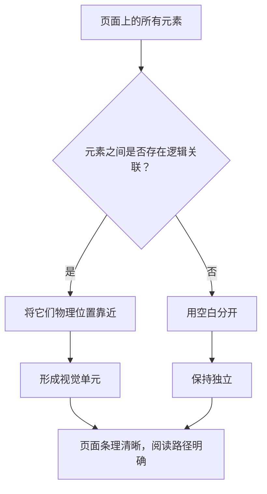
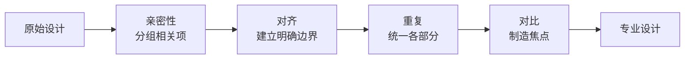
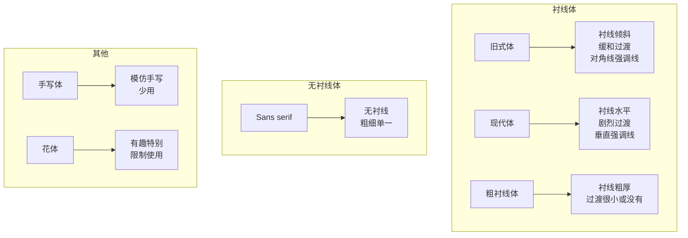
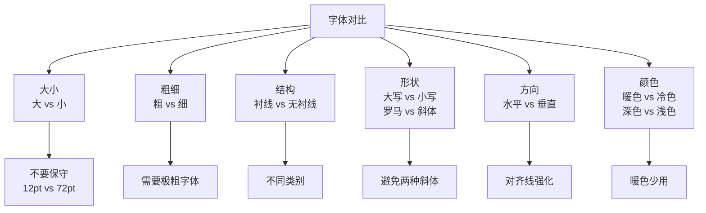
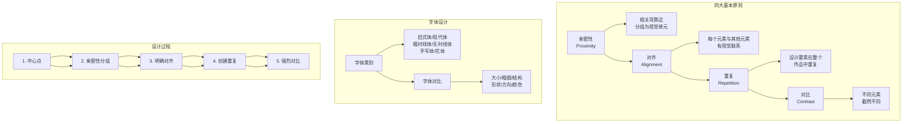

# 《写给大家看的设计书.第4版》章节总结

## 书籍信息
- **书名**：写给大家看的设计书.第4版 (The Non-Designer's Design Book, Fourth Edition)
- **作者**：[美] Robin Williams 著；苏金国 李盼 等 译
- **PDF 状态**：完整（共258页，含封面、版权、正文、附录、索引）
- **OCR 状态**：可识别，文本层可用

## 目录说明
- **目录识别情况**：完整识别原书目录结构（第10-13页）
- **章节对应依据**：严格按照原书目录章节顺序整理
- **OCR 修复说明**：部分页边距、图片位置信息在文本转换中有所简化，核心内容完整保留

## 全书核心主题
本书是世界级设计师Robin Williams为“非设计人员”撰写的设计入门经典。全书核心凝练为**四大基本原则**：亲密性、对齐、重复、对比。作者认为，优秀的设计并非天赋使然，而是可以通过学习明确的规则来掌握。一旦能够“说出”这些原则的名字，就能更容易地发现设计中的问题，并有针对性地改进。本书第一部分详细介绍这四大原则及其应用，并涉及颜色运用；第二部分专门讲解字体设计，包括字体类别、基本规则和对比技巧；第三部分提供测验、答案和资源。全书强调：设计的目标是清晰、有条理地表达信息，而非追求花哨的视觉效果。

---

## 第1章：引言

### 核心论点
本章通过“约书亚树”的故事引出全书的核心观点：**一旦能够说出某种东西的名字，就很容易注意到它，从而掌握它、控制它**。作者明确指出，优秀设计只需掌握四大基本原则，并能识别出自己在哪些方面没有运用这些原则。

### 关键概念
- **约书亚树效应**：在认识一种事物之前，即使它随处可见也会被忽略；一旦知道了它的名字和特征，就会无处不在地注意到它。
- **陈述问题**：将设计问题用文字表述出来，是解决问题的第一步。
- **四大基本原则**：对比、重复、对齐、亲密性——是本书后续章节的基石。

### 逻辑推演
作者先讲述个人经历：收到一本关于识别树木的书，读到约书亚树，认为本地没有，出门却发现邻居家前院到处都是。由此引出类比：设计原则就像这棵树，以前看不见，一旦知道了它们的名字，就会在设计作品中处处发现它们。作者因此提出：学习四大原则 → 认识到自己没有运用它们 → 用文字陈述问题 → 应用原则 → 结果令人惊喜。

### 经典金句
> “一旦能够说出什么东西的名字，就会很容易注意到它。你就会掌握它，拥有它，让它受你所控。” (p.16)

> “优秀的设计就这么容易……学习4大基本原则。它们比你想象的要简单。认识到自己没有运用这些原则。形诸文字——陈述问题。应用基本原则。结果将使你大吃一惊。” (p.17)

---

## 第2章：亲密性

### 核心论点
本章解决的核心问题是：**如何通过物理位置的靠近来组织信息，使页面更清晰、更有条理**。作者的核心观点是：彼此相关的项应当靠近归组在一起，形成一个视觉单元；无关的元素则应分开，用空白表达关系。

### 关键概念
- **亲密性原则**：将相关的项组织在一起，移动它们使其物理位置相互靠近，使它们被视为凝聚为一体的一个组。
- **视觉单元**：当多个项具有很近的亲密性时，它们会形成一个整体，而不是多个孤立的元素。
- **空白截留**：不当的空白放置会将本应靠近的元素分开，造成视觉混乱。
- **段前段后间距**：使用软件的段落间距设置（而非敲击回车）来精确控制元素间的距离。

### 逻辑推演
作者通过多个案例层层递进：
1. 展示一个典型的企业名片：5个孤立元素，眼睛要停5次，不知道从哪里开始读。
2. 通过将相关元素分组（姓名与头衔、联系方式与地址），页面立即变得有条理，阅读路径清晰。
3. 进一步展示传单、菜单、活动广告等案例，对比修改前后的效果。
4. 强调：空白可以表达关系——相似的项之间用较小空白，不同的组之间用较大空白。
5. 指出常见错误：在标题上下使用相同的回车距离，导致标题与上下文的归属不清晰。

### 流程图：亲密性原则应用步骤

### 经典金句
> “如果多个项相互之间存在很近的亲密性，它们就会成为一个视觉单元，而不是多个孤立的元素。这有助于组织信息，减少混乱，为读者提供清晰的结构。” (p.18)

> “空白可以表达关系。” (p.26)

> “要避免的问题：避免一个页面上有太多孤立的元素。不要在元素之间留出同样大小的空白，除非各组同属于一个子集。” (p.37)

---

## 第3章：对齐

### 核心论点
本章解决的核心问题是：**如何通过视觉联系将页面上的元素统一起来**。作者的核心观点是：任何元素都不能在页面上随意安放，每个元素都应当与页面上的另一个元素存在某种视觉联系，形成一条“看不见的线”。

### 关键概念
- **对齐原则**：每个元素都应与页面上的另一个元素有某种视觉联系，建立清晰、精巧的外观。
- **“软”边界 vs “硬”边界**：居中对齐的边界是“软”的，边界线不明确；左对齐或右对齐的边界是“硬”的，能提供更强的视觉力度。
- **单一对齐方式**：初学者应坚持只使用一种对齐方式（全部左对齐、右对齐或居中），避免混合使用。
- **有意识打破对齐**：在明确对齐的基础上，可以有意识地打破规则，但必须表现出“这是有意的”。
- **两端对齐（块对齐）**：要尽力避免，除非行足够长，否则会产生单词之间的难看的空隙。

### 逻辑推演
作者先指出居中对齐是初学者最常用的方式，虽然安全但往往乏味。通过名片案例展示：页面上存在左对齐、右对齐、居中三种方式，缺乏统一。修改为单一右对齐后，信息立刻有条理。进一步通过报告封面、信纸设计、婚帖等案例对比，证明左对齐/右对齐能带来更精美的外观。作者强调：必须强制自己避开居中对齐，直到能“有意识”地选择它。最后指出：对齐是为页面统一且有条理，就像把四处零落的玩具放进箱子。

### 经典金句
> “任何东西都不能在页面上随意安放。每个元素都应当与页面上的另一个元素有某种视觉联系。” (p.18)

> “居中对齐是初学者最常用的对齐方式，这种对齐看起来很安全，感觉上也很舒服……但通常也很乏味。” (p.41)

> “在打破规则之前必须清楚规则是什么。” (p.56)

> “要避免在页面上混合使用多种文本对齐方式（也就是说，不要将某些文本居中，而另外一些文本右对齐）。” (p.59)

---

## 第4章：重复

### 核心论点
本章解决的核心问题是：**如何将设计中独立的部分统一成一个整体**。作者的核心观点是：设计的某些方面需要在整个作品中重复出现，这些重复元素可以是字体、线条、颜色、项目符号、空间关系等，从而增强条理性和统一性。

### 关键概念
- **重复原则**：设计的某些方面需要在整个作品中重复，将各部分连在一起。
- **重复 = 一致性**：重复是有意识地统一设计各个部分的行为，而非自然的巧合。
- **重复的多种形式**：粗字体、粗线、项目符号、颜色、设计要素、格式、空间关系、图片的一部分等。
- **重复与对比的结合**：重复元素可以用作对比的强调，对比元素也可以用作重复。
- **重复的限度**：避免太多地重复一个元素，否则会让人讨厌，混淆重点。

### 逻辑推演
作者用生活中的例子类比：同一队的队员穿着相同的衣服，立即让人看出他们属于一个组织。在企业名片中，重复使用粗字体可以控制读者的视线轨迹，在粗体元素之间来回跳转，延长注意力停留时间。在新闻简报中，所有标题使用同一种粗体无衬线体，所有页码、项目符号、线的粗细一致，使16页看起来属于同一份简报。作者还展示了如何将现有重复元素“加强”——比如将普通的标题字体换成更突出的字体。最后强调：重复不仅限于图形，也可以是空白、线、对齐方式等任何有意识重复的东西。

### 经典金句
> “重复原则指出：设计的某些方面需要在整个作品中重复。重复元素可能是一种粗字体、一条粗线、某个项目符号、颜色、设计要素、某种格式、空间关系等。” (p.60)

> “重复还会为你的作品带来一种专业性和权威性，不管它看起来多有趣。它会使读者感觉有人在负责，因为重复显然是一种经过深思熟虑的设计决策。” (p.72)

> “要避免太多地重复一个元素，重复太多会让人讨厌。” (p.73)

---

## 第5章：对比

### 核心论点
本章解决的核心问题是：**如何让页面引人注目并有效组织信息**。作者的核心观点是：如果两个元素不完全相同，就应当使之截然不同；对比必须强烈，不能畏畏缩缩；对比能吸引眼球、组织信息、清晰层级、指引读者、制造焦点。

### 关键概念
- **对比原则**：要避免页面上的元素太过相似；如果元素不同，就让它们截然不同。
- **对比 vs 冲突**：区别不大时不是对比，而是冲突（如12磅 vs 14磅、0.5磅线 vs 1磅线、深棕 vs 黑色）。
- **对比的多种方式**：大字体 vs 小字体、粗线 vs 细线、暖色 vs 冷色、水平 vs 垂直、间隔宽 vs 间隔紧。
- **对比是“配漆”**：要么完全相同，要么彻底不同，不能“大概”配色。
- **对比与重复结合**：对比元素有时可以用作重复元素。

### 逻辑推演
作者通过新闻简报的对比展示：同样布局，一个平淡，另一个在标题和子标题使用更粗的字体、标题下加黑条，立即更吸引眼球。通过简历案例：原始版职位不清晰、对齐混乱、间距相同；修改后使用加粗标题、清晰层级、强烈对比，信息一目了然。作者强调：不要害怕让一些项很小，这样与更大的项形成对比，还能留出更多空白。最后用“掷蹄铁和手榴弹”的比喻说明：在对比中“几乎击中”不算赢，必须彻底不同。

### 经典金句
> “对比的基本思想是，要避免页面上的元素太过相似。如果元素（字体、颜色、大小、线宽、形状、空间等）不相同，那就干脆让它们截然不同。” (p.18)

> “要想实现有效的对比，对比就必须强烈。千万不要畏畏缩缩。” (p.74)

> “我的祖父（酷爱掷蹄铁游戏）总是说：‘只有在掷蹄铁和手榴弹游戏中‘几乎击中’才算赢。’（在其他方面，仅仅‘几乎达到’是不算数的。）” (p.76)

---

## 第6章：4大基本原则复习

### 核心论点
本章通过一个乏味的报告封面，依次应用亲密性、对齐、重复、对比四个原则，展示从“平庸”到“专业”的完整转变过程。同时提供了两个小测验来检验理解。

### 关键概念
- **不要畏畏缩缩**：不要害怕留白、不对称、大或小的字体、大或小的图片。
- **亲密性应用**：将标题和子标题靠近，作者和日期放远，明确分组关系。
- **对齐应用**：从居中对齐改为左对齐/右对齐，提供明确的边界基准。
- **重复应用**：标题的字体在作者名中重复，虚线作为重复元素。
- **对比应用**：增加黑方框、深红色字体、黑白分明的对比。

### 逻辑推演
作者先展示一个典型的居中报告封面：“Your Attitude is Your Life”加三行文字，各行间隔均匀，看起来像6个孤立主题。第一步应用亲密性：将标题和子标题靠近，作者和日期放远。第二步应用对齐：改为左对齐，使边界明确。第三步应用重复：标题字体在作者名中重复，增加虚线元素。第四步应用对比：增加黑方框、深红色字体、粗体与细体对比。每一步都展示修改前后的效果。最后提供两个小测验（设计原则识别和广告重新设计）引导读者实践。

### 流程图：四大原则应用顺序

### 经典金句
> “不要害怕在设计（或生活）中留有空白，这能让你的眼睛（以及心灵）稍作休息。不要害怕设计是不对称的……不要害怕把单词设置得非常大或非常小……” (p.90)

> “专业的设计人员总是会‘借取’其他理念，他们总在寻找灵感。” (p.99)

---

## 第7章：颜色运用

### 核心论点
本章解决的核心问题是：**如何选择和搭配颜色**。作者介绍了色轮的基本原理、6种颜色关系（互补、三色组、分裂互补、类似色、暗色/亮色、单色），并解释了CMYK与RGB两种颜色模型的区别及适用场景。

### 关键概念
- **三原色**：黄、红、蓝——无法通过混合其他颜色得到。
- **三间色**：绿、紫、橙——原色等量混合得到。
- **第三色**：橙黄、蓝绿等——相邻颜色混合得到。
- **互补色**：色轮上相对的颜色，最佳搭配是一种主色，另一种用于强调。
- **三色组**：彼此等距的三种颜色，如红黄蓝（基色三色组）或绿橙紫（间色三色组）。
- **分裂互补三色组**：选择一种颜色，使用其互补色两侧的颜色，更细致。
- **类似色**：色轮上相邻的颜色，有相同的基础色。
- **暗色**：向色调增加黑色。
- **亮色**：向色调增加白色。
- **单色**：一种色调及其多种亮色和暗色。
- **色质**：颜色的明暗度、深浅度或色调——过于接近会产生视觉抖动。
- **暖色 vs 冷色**：暖色（红/黄）趋进型，冷色（蓝）后退型；冷色适合做背景，暖色要少用。
- **CMYK**：青、品红、黄、黑——用于印刷（图书、杂志等）。
- **RGB**：红、绿、蓝——用于屏幕显示（显示器、电视、手机等）。

### 逻辑推演
作者从色轮基础（黄红蓝三原色）开始，逐步介绍间色、第三色，构建12色色轮。然后分别讲解6种颜色关系，每种给出图示和示例。接着引入暗色和亮色的概念，说明如何建立自己的颜色。通过案例展示单色组合的优雅，以及类似色组合的协调。作者特别提醒注意“色质”问题：色质过于接近的色调放在一起会产生视觉抖动。最后解释暖色与冷色的心理效应：暖色前进，冷色后退。结尾简要对比CMYK（印刷）和RGB（屏幕）两种颜色模型。

### 经典金句
> “暖色不费多大功夫就能产生效果，红色和黄色能立即映入你的眼帘。所以，如果要组合暖色和冷色，一定要少用些暖色。” (p.112)

> “需要印刷的项目应当使用CMYK；需要在屏幕上看的内容则应使用RGB。” (p.117)

---

## 第8章：更多提示与技巧

### 核心论点
本章将四大原则应用到具体的设计项目中：包装/品牌、企业名片、信笺信封、传单、新闻简报、宣传册、明信片、报纸广告、简历。每个项目都提供设计提示和案例对比。

### 关键概念
- **品牌包装**：最重要的特性是重复原则——每件作品中都必须有某个标识性图像或风格。
- **企业名片**：标准尺寸3.5×2英寸；字体通常用7-9磅而非12磅；要去掉“电话”“邮箱”等多余词。
- **信笺信封**：与企业名片一起设计，同属一体；要创建中心点；第二页只放小元素。
- **传单**：最适合使用有趣字体和大胆对比；要有明显的中心点；用有对比的子标题引导扫描。
- **新闻简报**：一致性（重复）最重要；每页应属于整个出版物；避免框套框；不要使用Helvetica/Arial。
- **宣传册**：先折出纸样再设计；注意折痕位置；标准三折本最常见。
- **明信片**：要与众不同、成系列、明确具体、力求简练；对比是最好的朋友。
- **报纸广告**：空白是产生对比的最佳方法；避免反色文字；避免精巧的小衬线体（油墨会散开）。
- **简历**：利用对比让重要元素脱颖而出；重复信息的基本结构；让设计和媒介匹配。

### 逻辑推演
作者依次展示每个项目类型的“常见错误”和“改进方案”，每个案例都明确标注使用了哪些原则。例如：企业名片案例中，通过放大姓名（对比）、重复字体（重复）、右对齐（对齐）、分组信息（亲密性）来改进。传单案例中，强调“大标题或大图画”作为中心点。新闻简报案例中，展示刊头设计、栏格划分、图片突破栏格等技巧。每个项目末尾都有“设计提示”列表，直接给出可操作的规则。

### 经典金句
> “传单设计起来很有意思，因为你可以安全地冲破各种束缚！” (p.130)

> “新手设计的大多数传单存在的最严重的问题是缺少对比，而且信息的表现没有层次。” (p.133)

> “新闻简报最大的问题是缺乏对齐、缺少对比，另外使用了太多的Arial/Helvetica或Times New Roman字体。” (p.137)

---

## 第二部分：字体设计（章节概览）

第二部分专门讨论字体，包括：
- **第9章：字体的基本规则**（标点后一个空格、引号、撇号、连接号、特殊符号、重音符号、大写字母、下划线、字距调整、寡妇/孤儿等）
- **第10章：字体（与人生）**（协调、冲突、对比三种关系）
- **第11章：字体类别**（旧式体、现代体、粗衬线体、无衬线体、手写体、花体）
- **第12章：字体对比**（大小、粗细、结构、形状、方向、颜色）

---

## 第9章：字体的基本规则

### 核心论点
本章解决的核心问题是：**如何避免作品看起来业余**。作者列出专业排字工使用了几百年的基本规则，包括标点后一个空格、使用真正的引号和撇号、正确使用连接号和破折号、避免全大写和下划线、调整字距、避免寡妇和孤儿等。

### 关键概念
- **标点后一个空格**：打字机时代句号后打两个空格，但现在标准是一个空格。
- **引号**：开引号形似双6 (“)，闭引号形似双9 (”)；不要使用打字机引号 (")。
- **撇号**：形状同闭引号（形如9），表示省略字母或所属关系。
- **连字符 (-)**：连接词语或断行。
- **一字线 (–)**：表示持续时间（如10月–12月），长度≈大写N。
- **破折号 (—)**：长度≈大写M，表示思想突然变化，两侧无空格。
- **全大写**：更难阅读（因为失去词的“海岸线”形状），要谨慎使用。
- **下划线**：永远不要使用——可以用斜体或粗体代替。
- **字距调整**：手动调整特定字母组合（如WA、LO）之间的多余空间，字号越大越重要。
- **寡妇**：一段最后一行少于7个字符。
- **孤儿**：一段的最后一行在下一栏或下一页顶部。
- **段落缩进**：标准是1em（即字体磅数），约2个空格，而非5个空格或半英寸。
- **缩进或空行**：二选一，不要同时使用。
- **首段不缩进**：跟随标题后的首段不需要缩进。

### 逻辑推演
作者从打字机与电脑的差异入手：打字机使用等宽字体、无法打斜体、没有粗体、没有特殊符号——这些限制影响了今天的习惯。然后逐一列出规则，每个规则都给出错误和正确示例。例如：“标点后一个空格”中，展示两个空格的段落会出现“大缺口”，阻碍交流。在引号和撇号部分，强调专业与业余的差别：百万美元广告中出现打字机撇号是“难堪的”。最后提供小测验巩固撇号用法，并给出Windows和Mac上的特殊符号输入方法。

### 经典金句
> “这点没什么好争的。把自己归入在句号后打两个空格的人群中并不会增加道德优越感。醒醒吧！” (p.157)

> “不要使用下划线。永远不要用。” (p.167)

> “字距调整完全要靠眼睛完成，电脑无法帮你完成这件事。” (p.168)

---

## 第10章：字体（与人生）

### 核心论点
本章解决的核心问题是：**如何理解字体之间的关系**。作者将字体关系类比为人际关系，分为三种：协调（平和但乏味）、冲突（应避免）、对比（有趣且引人注目）。

### 关键概念
- **协调**：只使用一个字体系列，样式、大小、粗细无太大变化，平和正式但可能乏味。
- **冲突**：使用多种字体，它们在样式、大小、粗细上类似但不相同，造成困扰。
- **对比**：结合多种截然不同的字体，引人注目，亮丽动人。
- **字体对比的6种方式**：大小、粗细、结构、形状、方向、颜色（将在第12章详述）。

### 逻辑推演
作者提出：设计中元素之间会建立动态关系。协调的例子（如婚帖）很平和正式，但不能让人兴奋。冲突的例子（两个相似但不同的字体放在一起）会让人困惑，以为是失误。对比的例子（如粗衬线体与细无衬线体结合）则生动有趣。作者强调：只要将字体结合，就必然产生这三种关系之一。大多数非专业设计是即兴而为，但通过具体指出对比的类型，可以切实把握设计。最后预告第11章（字体类别）和第12章（字体对比）。

### 经典金句
> “如果只使用一种字体，页面上的所有元素都采用同样性质的字体，这种设计就是协调的……大多数协调的设计往往都相当平和正式。” (p.173)

> “如果在同一个页面上设置了两个或多个类似的字体，它们并非完全不同，但也不完全相同，这个设计就是冲突的。……相似性是互相冲突的。” (p.175)

> “这个世界上所有特性都依赖于比较才能显现。如果没有比较，那么根本没有存在的前提。”——Herman Melville (p.177)

---

## 第11章：字体类别

### 核心论点
本章解决的核心问题是：**如何识别和分类字体**。作者将成千上万种字体归纳为6大类（旧式体、现代体、粗衬线体、无衬线体、手写体、花体），每类有相似的结构特征。掌握分类是进行字体对比的基础。

### 关键概念
- **旧式体 (Oldstyle)**：基于手写体，有衬线且衬线有角度，笔划有缓和的粗/细过渡，对角线强调线。可读性最佳，适合大量文本（如Garamond、Palatino、Times）。
- **现代体 (Modern)**：衬线水平且很细，粗/细过渡剧烈，垂直强调线。外观冷酷高雅，但大量文本会“眩目”（如Bodoni、Didot）。
- **粗衬线体 (Slab serif)**：粗/细过渡很小甚至没有，笔划粗重。简洁直接，常用于儿童图书（如Clarendon、Memphis、New Century Schoolbook）。
- **无衬线体 (Sans serif)**：没有衬线，粗细几乎单一。Helvetica/Arial是为屏幕设计，不适合印刷（如Brandon Grotesque、Folio、Myriad）。
- **手写体 (Script)**：模仿手写，像“奶酪蛋糕”要少用，绝不能用于大段文本或全大写。
- **花体 (Decorative)**：有趣、特别，使用要有限制，但可以在意想不到的场合制造惊喜。

### 逻辑推演
作者逐一介绍6类字体的历史渊源和结构特征，每类给出代表性字体和视觉示例。重点强调：旧式体“不可见”——正因为看不出差异，才适合大量文字；现代体如钢铁大桥，结构严格；无衬线体需要引入包含极粗和极细成员的字体系列（而非只有Helvetica）。作者指出：同一类别中的字体有太多相似性，不要放在同一个页面上。最后提供三个小测验（连线、粗/细过渡、衬线类型）来巩固分类知识。

### 方法图：字体类别特征对比

### 经典金句
> “如果你希望人们具体去读某些文字，可以选择设置为旧式体。” (p.181)

> “如果你的字体库中的无衬线体只有Helvetica/Arial和Verdana（这些字体都是为屏幕而设计的，不适用于印刷），要想更好地设计页面，最好的做法就是引入包括一个很粗很黑字体的无衬线体系列。” (p.184)

> “手写体就像奶酪蛋糕，要少用，这样才不会让人觉得恶心。” (p.186)

---

## 第12章：字体对比

### 核心论点
本章解决的核心问题是：**如何结合使用多种字体建立有效的对比**。作者详细讲解6种字体对比方式：大小、粗细、结构、形状、方向、颜色。每种方式都给出具体规则和示例，强调“不要保守”。

### 关键概念
- **大小对比**：12磅vs14磅不够——要截然不同（如12磅vs72磅）；全大写会占更多空间，改用小写可以加大字体。
- **粗细对比**：常规与半粗体不够——要找更粗的字体（如Aachen粗体）；粗细对比是组织信息最有效的方式之一。
- **结构对比**：不同字体类别有不同的结构；不要将同一类别的两种字体放在同一页面；衬线体vs无衬线体是经典组合。
- **形状对比**：全大写vs小写、罗马体vs斜体；手写体和斜体形状类似，不要结合使用。
- **方向对比**：水平行vs瘦高列、扩展字体vs压缩字体；明确的对齐线会加强方向对比。
- **颜色对比**：暖色（红/黄）前进，冷色（蓝/绿）后退；黑白文本也有“颜色”（由粗细、间距、大小等产生）。

### 逻辑推演
作者逐一讲解6种对比方式，每种给出“错误”和“正确”示例。大小对比：12磅与14磅产生冲突，12磅与72磅才是对比。粗细对比：计算机自带字体缺乏极粗字体，必须引入。结构对比：不要在同一页面使用两种旧式体或两种无衬线体。形状对比：全大写矩形难读，大写与小写混合更好。方向对比：水平标题与瘦高列形成有趣反差。颜色对比：暖色只要一点就能抓住眼球，冷色需要大片才能有效。作者强调：大多数有效布局会结合多种对比，要能用语言说清楚问题出在哪里（寻找相似性而非差异）。

### 方法图：字体对比的6种方式

### 经典金句
> “如果你想利用粗细来形成对比，就不要保守。如果对比不强烈，看上去只会像是一个失误。” (p.197)

> “Robin原则：不要把同一个类别中的两种字体放在同一个页面上。它们之间的相似性是无法避免的。” (p.201)

> “试图找出一个更好的解决方案之前，必须发现问题所在。要找出问题，必须努力寻找相似性，而不是差异。” (p.206)

---

## 第13章：你掌握了吗

### 核心论点
本章总结设计过程：从中心点开始 → 将信息分组（亲密性）→ 建立明确对齐 → 创建重复 → 建立强烈对比。提供练习方法（用描图纸重新设计糟糕的广告）和实用建议（打印出来看效果、用“脏”手段说服顽固客户）。

### 关键概念
- **从中心点开始**：确定希望读者最先看什么，创建强烈对比的中心点。
- **信息分组**：按逻辑分组，通过组之间的靠近与否显示关系。
- **建立对齐**：维护明确的对齐边界。
- **创建重复**：找出可以重复的项，加大重复力度。
- **建立对比**：要么黑白分明，要么全不这样做。
- **VIP**：“未经过视觉训练的人”——客户往往属于这类。

### 经典金句
> “如果页面上的所有一切都又大又粗，很华丽，那么根本不存在任何对比！不论通过更大更粗来建立对比，还是通过更小更细形成对比，关键是要有所不同，这样才能引人注目。” (p.214)

> “（告诉你一个方法……如果客户坚持他自己拙劣的设计，展示他的设计时先搞得一团糟。比如（有意）洒点咖啡上去，把边缘弄得参差不齐……展示你认为更棒的设计时则要做得干净漂亮……大多数情况下客户都会考虑你的作品。）” (p.215)

---

## 第14章：测验答案和建议

### 核心论点
本章提供第6章、第7章、第9章、第11章、第12章中所有小测验的答案，以及全书“设计师之眼”练习的建议（标注每个练习中应该找到的改动点及对应的设计原则）。

### 关键内容
- **小测验#1（设计原则）**：答案——去掉边框、标题靠近相关项、去掉双回车、文本单一对齐等。
- **小测验#2（重新设计广告）**：过程在第84-85页。
- **小测验#3（颜色）**：答案——1.类似色 2.互补 3.亮色 4.暗色 5.CMYK 6.RGB。
- **小测验#4（撇号）**：答案——it's / its 的区分，'60s 等。
- **小测验#5（字体类别）**：答案——连线题。
- **小测验#6（粗/细过渡）**：答案——A缓和/B剧烈/C没有。
- **小测验#7（衬线）**：答案——A细水平/B粗平板/C无/D倾斜。
- **小测验#8（对比vs冲突）**：答案——逐个判断。
- **小测验#9（可做与不可做）**：答案——不可做：同一页面两种手写体、两种同类字体、两种斜体/手写体、两个太有意思的字体；可做：不同结构、打破规则等。
- **设计师之眼建议**：每页练习的具体改动点（页码对应）。

---

## 第15章：本书所用字体

### 核心论点
本章列出全书使用的300余种字体及其出现页码，包括正文主体（方正书宋简体）、各章标题（方正大标宋简体）、主标题（方正黑体简体）、图字说明（方正仿宋简体）及各类英文字体（旧式体、现代体、粗衬线体、无衬线体、手写体、花体）的示例。

---

## 附录

### 附录A：迷你术语表和资源
**术语**：分辨率（印刷300dpi/屏幕72ppi）、基线、截留空白、空白、线、项目符号、正文、扩展文本、装饰标志等。
**资源**：B&A设计杂志、CreativeMarket.com、Canva.com、MyFonts.com、FontSquirrel.com、PrintPlace.com等。

### 附录B：我永远是一名教师
Robin Williams的访谈，分享教学理念：用学生能理解的方式解释（如“从编辑菜单选择复制”而非“选择复制”）、写给自己以便理解、从学生身上学习。谈到字体与人生的类比、四大原则的提炼过程、对莎翁作品的热爱。

### 附录C：生活就要设计
作者阐述设计原则如何应用于日常生活：穿着打扮（对比、重复、色轮）、房间装饰（对齐、亲密性）、演讲幻灯片、讲义、产品设计、烙饼等。强调：追求美好的设计丰富了生活的选择。

### 索引
全书术语索引（A-Z），标注页码。

---

## 全书核心方法论框架总结

---

**总结完成**。全书核心信息：设计不是天赋，而是可学习的规则。掌握四大原则（亲密性、对齐、重复、对比）和字体设计的基本知识，任何人都能创建专业、清晰、引人注目的页面。关键在于：**把问题说出来** → **有意识地应用原则** → **不要保守**。