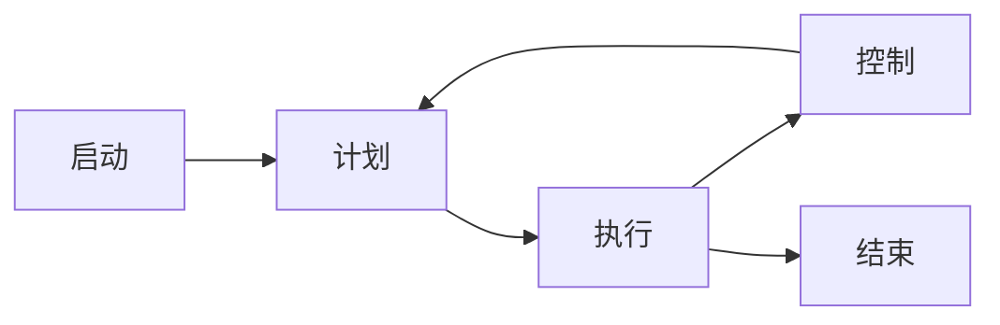
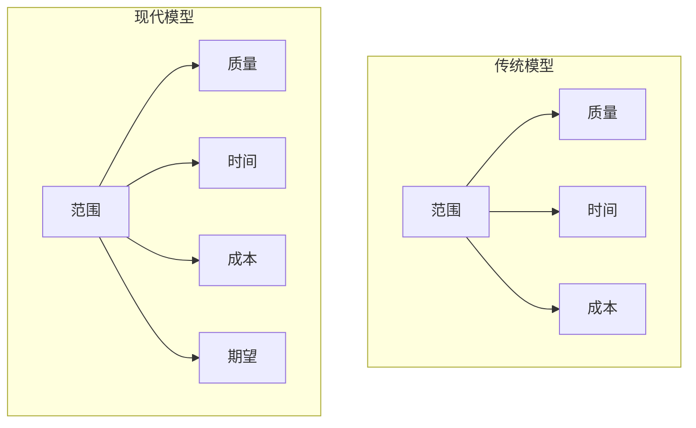
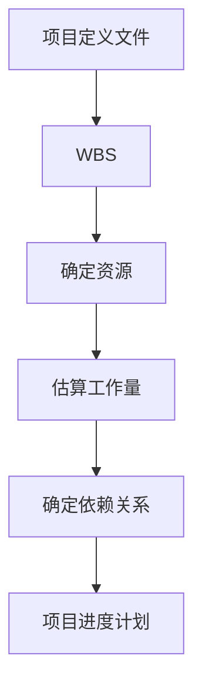
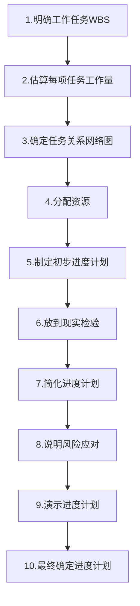
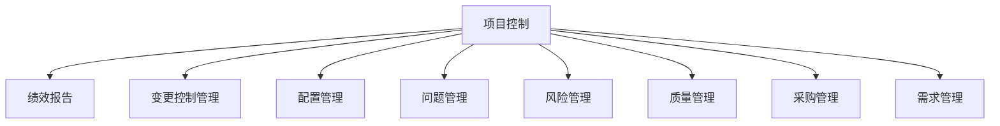
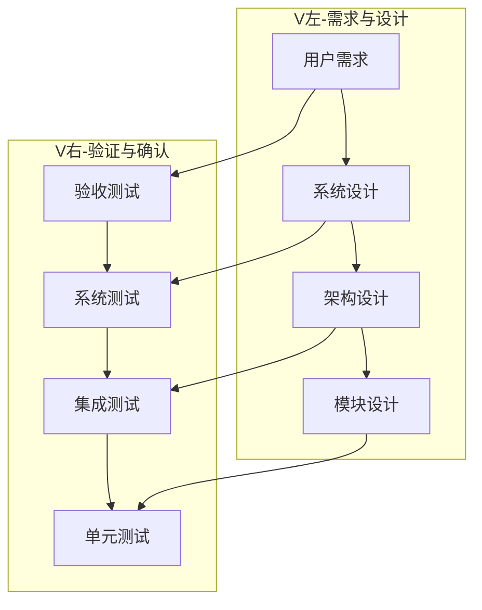
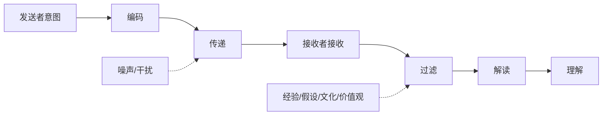
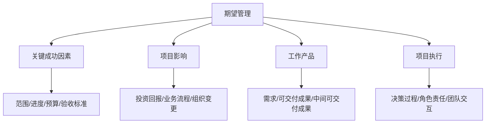

# 《写给大家看的项目管理书（第2版）》章节总结

## 书籍信息
- **书名**：写给大家看的项目管理书（第2版）
- **作者**：[美] Gregory M. Horine
- **译者**：陈彦辛
- **出版社**：人民邮电出版社
- **出版年份**：2011年4月第1版
- **原书名**：Absolute Beginner‘s Guide to Project Management, Second Edition

## PDF 状态
- 来源：图灵社区会员扫描版
- 文本层：可识别（部分页存在图片/图表）
- 页码：正文从第2页（实际页码1）至第270页
- 识别完整性：较高，目录清晰，正文可读

## 目录说明
- 目录识别情况：完整（第9-12页）
- 章节对应依据：按原书五大部分、25章顺序
- OCR修复说明：无需特别修复，图表需根据描述重建

## 全书核心主题

本书是一本面向项目管理初学者的入门指南，系统阐述了项目管理的核心概念、流程、工具和领导技能。作者强调项目管理不仅是“管理”过程，更包括“领导”人的能力。全书分为五部分：项目管理启动（概念、项目经理角色、成功要素）、项目规划（定义、计划、WBS、估算、进度、预算）、项目控制（控制、变更、可交付成果、问题、风险、质量）、项目执行（领导、沟通、期望、团队、差异、厂商、结束项目）以及加快学习进度（MS Project、现实挑战、相关概念）。本书语言通俗，每章末尾有框架图，注重实践和原理结合。

---

## 第一部分：项目管理启动

### 第1章：项目管理概述

#### 核心论点
**问题**：什么是项目管理？为什么它有价值且具有挑战性？  
**观点**：项目管理是运用科学和艺术来计划、组织、实施、领导和控制项目，以实现组织目标。项目是临时性、独特的工作，与日常运营不同。有效的项目管理能为组织和个人带来巨大价值，但面临未知领域、多方期望、平衡矛盾需求等多重挑战。

#### 关键概念/事件
- **项目**：由组织在一段时间内执行并产生独特结果的工作（有明确起点和终点）。
- **项目管理5大流程**（PMI）：启动、计划、执行、控制、结束。
- **9大知识领域**：集成、范围、时间、成本、质量、人力资源、沟通、风险、采购。
- **矛盾需求平衡**：范围、质量、时间、成本之间的相互制约关系（图1-2）。
- **项目管理趋势**：厂商管理、风险管理、质量管理、虚拟团队、PMO、仆人式领导等。

#### 逻辑推演 / 叙事脉络
作者从澄清“什么是项目”和“什么是项目管理”入手，对比项目与日常运营的差异。接着阐述项目管理的价值（对组织和个人的好处），然后分析项目具有挑战性的原因（未知领地、多方期望、交流障碍、平衡矛盾需求、前沿技术、组织影响、合作、估算困难）。最后指出高效项目经理供不应求，并介绍当前项目管理的趋势（外包、风险、质量、虚拟团队、PMO、变革推动者、仆人式领导）。本章为全书奠定基础认知。

#### 流程图（重建）

**图1-1 项目管理流程关系**

**图1-2 矛盾需求平衡（传统与现代模型）**

#### 经典金句/数据
> “项目管理不是‘脑外科手术’。虽然涉及多个学科、多步流程、多项技能还有多种工具，但它的基本原理并不复杂，而且在各个行业都是相同的。” (p.3)

> “全球公认的项目管理标准化组织PMI将项目管理定义为5个流程和9个知识领域。” (p.4-5)

> “在可预见的未来，全球竞争仍是大势所趋，劳动生产率还会不断提高，对成功的项目经理的需求也只会有增无减。” (p.8)

---

### 第2章：项目经理

#### 核心论点
**问题**：项目经理扮演哪些角色？需要什么技能？成功项目经理具备什么素质？  
**观点**：项目经理扮演策划者、组织者、特派员、军需官、促进者、劝说者、解决问题的人、保护伞、教练、监督者、图书管理员、保险代理、警察、推销员等多种角色。关键技能包括项目管理基础知识、企业管理技能、技术知识、沟通技能和领导技能。成功项目经理具备全身心投入、通情达理、面带微笑、暴风中心、客户服务导向、以人为本、时刻瞄准目标、情绪可控、合理的偏执、理解背景、发现隐患等素质。

#### 关键概念/事件
- **项目经理的15种常见错误**：包括未与组织目标对齐、未管理干系人期望、未获得成功标准认可、制定不切实际的进度表、未用变更控制程序等。
- **5类关键技能**：项目管理基础知识、企业管理技能、技术知识、沟通技能、领导技能。
- **主动倾听**：真正的倾听以及专注地、用心地、带着与说话人沟通的欲望来倾听的能力。
- **仆人式领导**：项目经理没有真正的领导权，需通过服务他人来领导。

#### 逻辑推演 / 叙事脉络
作者先列出项目经理扮演的多种角色（从策划者到推销员），然后提出5类关键技能。接着讨论成功项目经理的共同素质（如全身心投入、通情达理等），最后详细列出项目经理最常犯的15种错误。本章旨在帮助新手快速定位自身差距和努力方向。

#### 经典金句/数据
> “做一名成功的项目经理，你并不需要样样精通。关键在于项目经理具备的综合能力要能满足所在项目的需求。” (p.14)

> “项目经理常犯的错误包括：没有清楚地弄明白项目如何与组织目标保持一致……没有利用变更控制程序来管理项目范围。” (p.15)

---

### 第3章：成功项目的基本要素

#### 核心论点
**问题**：什么是成功的项目？麻烦项目的常见原因有哪些？成功项目的共同点是什么？  
**观点**：从理想化角度看，成功项目满足按承诺交付、按时、不超预算、质量符合要求、符合初衷、满足所有干系人期望、维持共赢关系。麻烦项目常因目标不一致、缺乏管理层支持、干系人认可不足、不合格的项目发起人、角色责任不明、缺乏沟通等原因。成功项目具有共同的核心原则：与组织目标一致、有效领导、干系人共识、现实期望、合理计划、清晰角色、精确估算、现实进度、有效沟通、积极解决问题等。

#### 关键概念/事件
- **SMART目标**：具体的、可衡量的、可完成的、值得做的/达成一致的、有时间限制的。
- **项目经理必备工具清单**：项目章程、项目定义文件、需求文件、项目进度安排、状态报告、里程碑图、项目组织图、责任矩阵、沟通计划、质量管理计划、员工管理计划、风险回应计划、项目计划、可交付物汇总、项目日志、变更申请表、项目簿。
- **麻烦项目的常见原因**（表3-1）：目标不一致、缺乏管理层支持、缺乏干系人认可、不合格的项目发起人、项目发起人太多、角色责任不明、缺乏沟通、价格战、资源冲突、不合格的项目经理、低估变更影响、计划不全面、缺乏变更控制、缺乏竣工标准、缺乏进度跟踪、未预料到的技术难点。

#### 逻辑推演 / 叙事脉络
作者先定义“成功项目”的理想标准，然后分析麻烦项目的两大层面原因（组织层面和项目层面），列举表3-1。接着总结成功项目的共同特性（如与组织目标一致、有效领导、共识、现实期望等）。最后列出项目经理必备的工具及其价值。本章为读者提供了评估项目成功与否的框架。

#### 经典金句/数据
> “完全成功的项目应该满足以下所有要求：按承诺交付、按时完成、不超出预算、交付质量符合要求、符合初衷、满足所有项目干系人的期望、维持‘共赢’关系。” (p.18)

> “很多情况下，项目即使没有完全满足教科书上的标准，组织也可能认为它是成功的——如果项目实现了企业或组织的战略目标。” (p.18)

---

## 第二部分：项目规划

### 第4章：项目定义

#### 核心论点
**问题**：为什么正确定义项目是第一步？项目定义文件包含哪些要素？  
**观点**：项目定义是项目管理所有活动的基础。需要在7个基本问题上达成一致：为什么做、支持什么目标、如何与其他项目一致、预期效益、做什么、谁受影响、如何判断成功。项目定义文件（P. D. D.）是核心工具，包含意图、目标、成功标准、背景、依赖项、范围说明、范围外说明、假设、限制、风险、干系人、推荐方法等。

#### 关键概念/事件
- **项目定义7个基本问题**：意图、组织目标、一致性、预期效益、范围、干系人、成功标准。
- **项目定义文件基本要素**：意图、目标与宗旨、成功标准、项目背景、项目依赖项、范围说明、范围外说明、项目假设、项目限制、项目风险、项目干系人、推荐的项目方法。
- **SMART原则**：具体的、可衡量的、可完成的、值得做的/达成一致的、有时间限制的。
- **项目组织结构图**：直观展示干系人角色和报告关系。
- **组合项目管理**：确保项目定义过程投入有助于高层决策投资哪些项目。

#### 逻辑推演 / 叙事脉络
作者先强调正确定义项目的重要性（7个基本问题），然后区分项目定义与项目计划的关联。接着详细介绍项目定义文件的必备要素和可选要素，包括直观范围总结（原型、流程图等）。最后给出项目定义清单（总则、范围、干系人、方法、其他、验收），供读者自查。

#### 经典金句/数据
> “写下来，要求每个人在文件上签字。我们将这份文件称为项目定义文件。” (p.28)

> “创建直观的范围总结无疑要归于项目管理的‘艺术’部分，因为并不是只有一种方法来完成这项工作。” (p.30)

---

### 第5章：项目计划

#### 核心论点
**问题**：项目计划不是一份MS Project文件，它应该包含什么？如何制定？  
**观点**：项目计划是一份全面的文件，根据它来执行和控制项目。它包含WBS、项目进度表、资源计划、沟通计划、风险管理计划等。计划需要多次反复，且项目团队应参与详细工作的定义和估算。项目计划应回答“做什么、谁做、何时做、成本多少、如何控制变更、如何沟通”等问题。

#### 关键概念/事件
- **项目计划关键原则**：意图是制定可执行计划；需要多次反复；不是单一MS Project文件；控制力；有预见性的管理；低层工作（团队参与）。
- **项目计划要回答的问题**：可交付物如何产生？需要什么工作？谁来做？需要哪些资源？何时完工？成本多少？如何控制变更？如何沟通？等。
- **项目计划组件**：变更控制计划、沟通计划、配置管理计划、采购管理计划、质量管理计划、责任矩阵、资源管理计划、风险管理计划、风险回应计划、偏差管理计划。
- **里程碑进度计划汇总范例**（图5-3）：记录项目里程碑及偏差。
- **RASIC责任矩阵**（图5-5）：明确每个角色在任务中的责任等级。

#### 逻辑推演 / 叙事脉络
作者首先澄清项目计划的关键原则（意图、多次反复、非单一软件等），然后列出计划过程中要回答的重要问题。接着逐步讲解制定项目计划的步骤（确认项目定义、确定要做什么、确定资源、估算、制定进度计划、更新角色责任、更新项目组织、确定成本预算、确定控制系统、制定变更计划、信息计划、问题计划、质量计划、沟通计划、团队管理计划、采购计划）。最后补充项目计划组件汇总表（表5-1）和清单。

#### 经典金句/数据
> “项目计划不是项目时间安排或者工作分解结构（WBS），而是一份内容全面的文件，我们可以根据它来控制和执行项目。” (p.35)

> “将要执行项目任务的团队成员应多多参与对具体工作的定义和估计。” (p.36)

> “项目计划文件及其要素都是‘活的’文件，要不断更新，以反映项目中不断变化的环境、问题和需求。” (p.42)

---

### 第6章：制定工作分解结构

#### 核心论点
**问题**：什么是WBS？为什么它是项目经理最重要的工具？  
**观点**：WBS（工作分解结构）是项目要做的“工作”的逻辑分解和层级结构。它不是项目进度计划或项目计划。WBS为定义和组织工作提供了基础，有助于管理被分解的工作、更好的估算、更好的控制、明晰的责任、提早识别风险。制定WBS应注重可交付物、与团队一起制定、涵盖所有工作、底层为工作包（8/80或4/40原则）。

#### 关键概念/事件
- **WBS定义**：工作分解结构，指的是项目要做的“工作”的逻辑分解和表现形式（层级结构）。
- **图解式 vs 大纲式**：图解式适合与高层交流，大纲式适合收集详细信息。
- **WBS与项目进度计划的区别**：WBS没有任务相关性、没有安排任务时间、没有任务分配。
- **其他分解结构**：CWBS（合同工作分解结构）、OBS（组织分解结构）、RBS（资源分解结构）、BOM（物料清单）、PBS（项目分解结构）。
- **8/80和4/40原则**：任务完成时间应在8-80小时或4-40小时之间。

#### 逻辑推演 / 叙事脉络
作者先澄清WBS的概念，纠正常见误解（WBS≠项目进度计划），并解释为什么术语常被混淆（尤其是MS Project的使用）。接着说明WBS为何是项目经理最重要的工具（管理被分解的工作、更好估算、更好控制、明晰责任等）。然后讲解制定WBS的过程（从哪里开始、如何分解、何时结束），提供有效WBS的准则（注重可交付物、与团队一起、涵盖所有工作等）。最后强调WBS是进度计划和大部分计划工作的基础。

#### 流程图（重建）

**图6-3 WBS在制定项目进度计划过程中的地位**

#### 经典金句/数据
> “PMI认为WBS是项目经理最重要的工具。” (p.52)

> “WBS要涵盖项目的所有工作。WBS要‘注重可交付物’。WBS应‘和团队成员一起’制定。” (p.53-54)

> “最常用的尺寸是8/80和4/40。8/80指的是任务完成时间应在8~80小时之间，4/40则指任务完成时间应在4~40小时之间。” (p.55)

---

### 第7章：估算工作

#### 核心论点
**问题**：为什么估算是项目管理的最大挑战？如何提高估算准确性？  
**观点**：估算不准确的头号原因是对要做的工作定义不充分。估算应由做这项工作的人执行或批准，基于WBS的详细工作分解。主要估算技巧包括类似（从上到下）、从下到上、工作分布、启发式、参数、分阶段估算。估算有3个准确性级别：数量级（-25%~+75%）、预算级（-10%~+25%）、最终级（-5%~+10%）。

#### 关键概念/事件
- **估算不准确的常见原因**：工作定义不恰当、由不合适的人员做估算、缺乏沟通、使用的技巧不正确、资源问题、缺少应急措施、管理层决策。
- **估算技巧**（表7-1）：类似估算、从下到上估算、工作分布估算、启发式估算、参数估算、分阶段估算。
- **估算方法**（表7-2）：专家判断、历史信息、加权平均(PERT)、风险因素、团队（一致）估算。
- **PERT公式**：E = (O + 4M + P)/6（乐观+4×最可能+悲观）/6。
- **估算准确性级别**（表7-3）：数量级(-25%~+75%)、预算级(-10%~+25%)、最终级(-5%~+10%)。

#### 逻辑推演 / 叙事脉络
作者先说明估算是进度计划过程的下一步（图7-1），强调估算是风险分析的基础（图7-3）。然后列出估算不准确的常见原因。接着详细介绍主要估算技巧和方法（表7-1、7-2），以及估算准确性级别（表7-3）。最后总结估算的最佳实践：基于WBS、由做事的人执行、参考历史信息、记录假设、使用应急缓冲等。

#### 经典金句/数据
> “做出准确的估算是要花费时间和金钱的。” (p.63)

> “只要不断吸取以往的经验教训，使用什么估算技巧都有助于改进结果。” (p.63)

> “任何项目（或者项目阶段）都应该估算3次，每一次估算都比上一次更加准确。” (p.62)

---

### 第8章：制定进度计划

#### 核心论点
**问题**：如何制定现实可行的项目进度计划？  
**观点**：项目进度计划是项目计划的主要整合点，决定项目预算、资源计划、管理期望、衡量绩效。制定进度计划需要5类关键信息：WBS、工作估算、任务间关系、资源、风险应对。过程包括10个步骤：明确WBS、估算工作量、确定任务关系、分配资源、制定初步进度计划、放到现实检验、简化、说明风险应对、演示、最终确定。关键路径是贯穿网络的最长路径，代表最短完成时间。

#### 关键概念/事件
- **进度计划的5项关键信息**：WBS、工作估算、任务间关系、资源、风险应对。
- **关键路径**：贯穿网络的最长的路径，代表完成项目的最短时间。
- **压缩进度计划的技巧**（表8-1）：赶工（增加资源）、快速跟进（并行执行）、过程提升、适当加班。
- **展示进度计划的方法**（表8-2）：里程碑图、甘特图、网络图、改良的WBS。
- **资源平衡**：删掉不切实际的工作分配，优化资源利用。

#### 逻辑推演 / 叙事脉络
作者先强调进度计划的重要性（决定预算、资源、期望、绩效衡量）。然后列出制定进度计划的5类关键信息，并给出10个步骤（图8-4）。详细讲解确定任务关系（网络图）、制定初步进度计划、放到现实检验（资源平衡）、简化进度计划（压缩关键路径）、演示进度计划、展示进度计划（不同方法）。最后说明进度计划应符合完整、现实可行、令人满意、正式的标准。

#### 流程图（重建）

**图8-4 创建进度计划的10个步骤**

#### 经典金句/数据
> “项目进度计划通常会被误称为‘项目计划’。” (p.67)

> “不切实际的项目进度计划会对资源管理以及项目投资决策产生负面影响。” (p.65)

> “资源过度分配以及日程安排不当，是造成项目进度计划不切实际的最常见原因。” (p.73)

---

### 第9章：确定项目预算

#### 核心论点
**问题**：如何制定现实可行的项目预算？  
**观点**：项目预算估算项目所有成本及产生时间，是项目计划的关键组成部分。预算应分时段、有完整项目周期、全面考虑所有成本来源（劳动力、设备、材料、许可、培训、差旅、经营、清理、日常管理、变更成本），并包含缓冲（管理储备）。制定预算使用从下到上的方法，最好用电子表格软件。

#### 关键概念/事件
- **项目成本来源**（图9-2）：劳动力、设备、材料、许可和费用、培训、差旅、经营、清理、日常管理、变更成本。
- **预算制定的关键原则**：反复循环、完整的周期、分时段、全面、包含缓冲、记录假设。
- **管理储备**：用于处理已知风险、估算不确定因素、隐藏工作等。
- **制定预算的步骤**（图9-1）：从项目定义文件到WBS、估算、资源计划、进度计划，再到预算。
- **常见难题**：基础不可靠、没有成本分类、没有利润率、提前分配预算、没有跟踪劳动力成本。

#### 逻辑推演 / 叙事脉络
作者先说明项目预算的作用（验证计划、绩效衡量、管理期望、现金流量管理、证明投资正确）。然后列出制定有效预算的原则（反复循环、完整周期、分时段、全面、包含缓冲、记录假设）。接着详细讲解创建项目预算的过程：明确成本来源（图9-2）、制定初步预算（使用电子表格）、最终确定预算（确认采购、平衡任务成本和资源成本、确定管理储备）。最后讨论预算过程中常见的难题。

#### 经典金句/数据
> “如果已经很好地完成了其他的计划活动，制定项目预算就是一个非常简单的过程。” (p.83)

> “项目预算在管理各方期望、准确衡量项目绩效以及管理资金流动方面至关重要。” (p.83)

> “WBS、工作估算及项目进度计划为可靠的项目预算提供了基础。” (p.83)

---

## 第三部分：项目控制

### 第10章：项目控制

#### 核心论点
**问题**：什么是项目控制？如何有效监控和调整项目？  
**观点**：项目控制包括信息系统和管理程序，用于了解是否按计划行事、是否在预算内、是否遵守时间安排等。项目控制遵循PDA原则：防范（Prevention）、检测（Detection）、行动（Action）。有效技巧包括小工作包、基准管理、状态审查会、完成标准、审查、里程碑、需求跟踪、正式签收、独立质量审核、V模型、升级临界。挣值管理（EVM）是最佳项目控制技巧。

#### 关键概念/事件
- **PDA原则**：防范（提前预防偏差）、检测（预警系统及早发现偏差）、行动（采取纠正措施）。
- **项目控制组成部分**：绩效报告、变更控制管理、配置管理、问题管理、风险管理、质量管理、采购管理、需求管理。
- **挣值管理（EVM）关键术语**（表10-1）：计划价值(PV)、挣值(EV)、实际成本(AC)、成本偏差(CV)、进度偏差(SV)、成本绩效指数(CPI)、进度绩效指数(SPI)、预算(BAC)、完工估算(EAC)、完工尚需估算(ETC)。
- **升级临界**：提前确定哪些问题和偏差可由项目团队处理，哪些需要高级管理层关照。
- **国防部研究结论**：项目最终成果不会比完成15%时的绩效更好。

#### 逻辑推演 / 叙事脉络
作者先定义项目控制，引入PDA原则。然后列出项目控制的组成部分（图10-1）。接着说明项目控制的管理基本原理（抓住重点、依项目情况而定、预期变更、周密计划等）。详细讲解有效技巧（小工作包、基准、状态审查会、完成标准、审查、里程碑、需求跟踪等）。重点介绍绩效报告（回答3大问题：位置、偏差、预测）和偏差应对措施（纠正措施、视而不见、取消项目、重新设定基准）。最后深入讲解挣值管理（EVM）的概念和应用（图10-3），以及从项目恢复中吸取的教训。

#### 流程图（重建）

**图10-1 与项目控制有关的项目管理过程汇总**

#### 经典金句/数据
> “项目控制的秘诀：防范（Prevention）、检测（Detection）和行动（Action）。” (p.87)

> “国防部自1977年以来对800个项目做了研究，每一次研究都表明，项目的最终成果不会比完成15%时的绩效更好。” (p.90)

> “挣值管理（EVM）是绩效偏差早期检测的最佳项目控制技巧。” (p.94)

---

### 第11章：管理项目变更

#### 核心论点
**问题**：如何有效管理项目变更？  
**观点**：项目变更是关键成功因素（范围、进度、成本、质量、验收标准）的变更。关键是建立项目变更控制系统，包括变更请求表格、唯一识别号码、跟踪日志、变更控制委员会（CCB）。尽量减少范围变更的方法：清楚的项目定义、可靠的需求定义、跟踪需求、正式签收、使用正确的项目方法。项目经理应预期变更、建立系统、让干系人熟悉流程、使用系统、尽量减少范围变更、确保沟通。

#### 关键概念/事件
- **项目变更类型**：范围扩展/缩小、产品特性增减、性能要求变更、质量要求变更、里程碑日期变化、资源成本变化、预算增减、项目目标变更、验收标准变更等。
- **范围蠕变**：不可控的项目范围扩展，会造成项目延期及成本超支。
- **变更控制委员会（CCB）**：由项目干系人组成，审查和批准影响关键成功因素的所有变更请求。
- **变更请求表格推荐字段**（表11-2）：身份识别、请求者信息、变更信息、影响评估、状态信息、批准。
- **配置管理与变更控制的区别**（表11-1）：变更控制管理关注项目关键成功因素；配置管理关注项目可交付物的完整性；组织变更管理关注项目成果对组织的影响。

#### 逻辑推演 / 叙事脉络
作者先澄清“项目变更”不仅仅是范围变更，包括多种类型。然后介绍配置管理和组织变更管理的区别（表11-1）。接着提出管理项目变更的7个关键原则（预期变更、建立系统、让干系人熟悉、使用系统、尽量减少范围变更、沟通、时刻监督）。分析导致计划外范围变更的原因（商业驱动因素、验收标准变化、技术变化、范围说明不充分、需求定义不充分）。最后详细说明项目变更控制系统的关键要素（原则、方针、组成部分），以及尽量减少项目变更的有效方法和常见难题。

#### 经典金句/数据
> “有效管理和控制项目变更的能力是成熟项目经理的标记。” (p.101)

> “范围蠕变是一个常见的术语，用于描述不可控的项目范围扩展。据说范围蠕变会造成项目延期以及成本超支。” (p.101)

> “镀金：由项目团队添加到产品中的、却不是客户要求的附加条件和性能。” (p.108)

---

### 第12章：可交付成果管理

#### 核心论点
**问题**：什么是可交付成果管理（配置管理）？为什么它很重要？  
**观点**：可交付成果管理是控制项目工作成果变更的过程，常用术语是配置管理。三大原则：确定、保护、跟踪。最佳实践包括建立中央储存库、规定审查/更改/批准流程、实施访问控制、设立文件命名约定和版本编号计划、设立基准、备份、使用配置管理工具、制定配置管理计划。

#### 关键概念/事件
- **配置管理**：管理实际工作产品本身的变更，与变更控制系统相关但不同。
- **三大原则**：确定（定义所有要管理的工作产品）、保护（保护工作产品整体性）、跟踪（追踪所有步骤和变更）。
- **配置管理计划应包含的部分**（表12-2）：目标、储存库、目录结构、文件命名约定、工具、流程和程序、角色与责任、报告、审核、与其他计划的关系。
- **可交付跟踪系统**（表12-1）：记录工作产品名称、阶段、版本、状态、责任人、批准人等。
- **隐藏资产（CYA）**：管理项目可交付成果的另一重要原则。

#### 逻辑推演 / 叙事脉络
作者先阐明可交付成果管理的含义（配置管理），解释为什么需要它（文件在哪里、失去生产能力、基准、谁做出变更、灾难恢复等）。然后提出三大原则：确定、保护、跟踪。接着详细介绍最佳实践：建立中央储存库、规定流程、指定守门人、访问控制、目录结构、命名约定、版本编号、基准、标准文件小节、可交付跟踪系统、备份、不同产品类型不同需求、使用配置管理工具、档案文件夹等。最后列出配置管理计划的建议内容和常见难题。

#### 经典金句/数据
> “管理项目工作产品的三大基本原则包括确定、保护和跟踪。” (p.113)

> “管理项目可交付成果也可以概括为另一项重要原则，即隐藏资产（Cover Your Assets, CYA）。” (p.113)

> “不管你使用的是什么样的配置管理工具，一定要保证有一名配置管理专家。” (p.118)

---

### 第13章：问题管理

#### 核心论点
**问题**：如何有效管理项目问题？  
**观点**：项目问题管理的目的是尽早发现问题，识别、记录、跟踪、解决并沟通所有可能影响项目的问题。关键原则包括：在文件中记录问题、跟踪到结束、与项目需求一致、成本-效率方法。项目经理应扮演指挥者、微笑的斗牛犬、钻牛角尖、守门员的角色。问题日志是核心工具，可使用文字处理软件、电子表格、数据库或协作工具。

#### 关键概念/事件
- **问题 vs 风险 vs 缺陷**：问题是不解决就会影响项目的事件；风险是可能产生的问题；缺陷是由质量管理程序引发的问题。
- **问题日志数据点**（表13-1）：问题ID、类型、状态、优先级、细节、潜在影响、提交日期、分配日期、被分配人、目标到期日、解决日期、结束日期、进度说明、相关项。
- **问题日志工具比较**（表13-2）：文字处理软件（低成本但功能有限）、电子表格（过滤报告功能）、数据库（多用户更新）、协作工具（网络使用、自动通知）。
- **升级程序**：定义哪些问题需要提升到更高管理层。
- **最佳实践**：分配唯一ID、分配负责人员、在最低层解决问题、寻找根本原因、在到期日和责任归属方面获得认可、经常审查问题。

#### 逻辑推演 / 叙事脉络
作者先说明项目问题管理的目的（尽早发现问题）和具体目标（识别、记录、跟踪、解决、沟通）。然后阐述管理流程原则（记录、跟踪、与需求一致、成本-效率）和项目经理理念原则（指挥者、微笑的斗牛犬、钻牛角尖、守门员）。接着介绍问题管理系统的主要特征（清楚流程、升级程序、问题日志、管理员、数据点）。比较不同工具（表13-2）。最后列出最佳实践和特殊情况（问题日志透明度、记录重复出现的问题）。

#### 经典金句/数据
> “项目问题管理的目的在于尽早地发现问题。越早发现，越可能在项目的关键成功因素受到影响之前将问题解决掉。” (p.121)

> “最能描述理想的项目经理理念的词有指挥者、微笑的斗牛犬、钻牛角尖以及守门员。” (p.121)

> “问题指的是如果不解决就会对项目成果产生不良影响的事件或状况；风险指的是可能产生的问题；缺陷指的是由项目质量管理程序引发的问题。” (p.125-126)

---

### 第14章：风险管理

#### 核心论点
**问题**：什么是项目风险管理？如何识别和应对风险？  
**观点**：项目管理完全就是风险管理。风险管理的核心原则包括“健全的偏执狂”、系统化、连续识别、不间断、集中处理优先级高的风险。关键流程：识别、确定概率、评估影响、区分优先级、制定应对措施、获得认可、监控。5种风险应对策略：避免、接受、监视和准备、减轻、转移。常见风险来源包括项目规模与复杂度、变更影响、组织、赞助、干系人、进度计划、资金、设施、团队、技术、厂商、外部因素等。

#### 关键概念/事件
- **风险应对措施**（表14-1）：避免（消除风险）、接受（承担结果）、监视和准备（密切监视并制定备用计划）、减轻（减少概率或影响）、转移（转移给第三方）。
- **常见风险来源**（表14-3）：项目规模和复杂度、变更影响、组织、赞助、干系人、进度计划、资金、设施、团队、技术、厂商、外部因素、假设和限制、项目管理。
- **风险预测**：引导识别项目风险因素的问卷或清单。
- **概率/影响矩阵**：将风险因素分为高、中、低三类。
- **风险应对计划 vs 风险管理计划**：前者描述应对策略，后者描述如何构建和执行风险管理流程。

#### 逻辑推演 / 叙事脉络
作者先强调项目管理就是风险管理，提出主要原则（健全的偏执狂、系统化、连续等）。然后详细介绍风险管理的关键流程：识别、确定概率、评估影响、区分优先级、制定应对措施、获得认可、监控。列出5种风险应对措施（表14-1）。接着介绍关键风险管理工具（风险预测、风险评估、风险日志、风险管理计划、风险应对计划、概率/影响矩阵）。分析常见的项目风险来源（表14-3、表14-4）。讨论典型问题（没有检测出的风险、没有确认的风险、流程不足、流程太多）和有效的风险控制策略（首先处理高优先级风险、使用反复分阶段方法、保证计划过程质量、独立质量保证审核）。最后澄清风险相关术语（风险、问题、限制、假设、依赖项、缺陷）。

#### 经典金句/数据
> “项目管理的实质是‘风险管理’。” (p.137)

> “很多时候，项目中有80%以上的风险出自同样的源头。” (p.131)

> “5项风险应对策略包括：接受、避免、减轻、转移和监控。” (p.130)

> “没有识别或者没有确认的项目计划缺陷是未知风险的最常见来源。” (p.137)

---

### 第15章：质量管理

#### 核心论点
**问题**：什么是项目质量？如何管理项目质量？  
**观点**：PMI将质量定义为“符合要求及适用”。项目质量管理注重质量要求、增值要求、产品和过程质量、认证。关键原则：明确目标、计划、调整大小、设立期望、以客户为中心、信任但要确认、由你决定。有效工具：需求跟踪矩阵、清单、模板、审查、完工标准、小工作包、独立审核、标准、V方法、质量管理计划。

#### 关键概念/事件
- **质量定义**：符合要求及适用。
- **项目质量管理独特要素**：注重质量方面的要求、注重增值要求、注重产品和过程质量、注重认证。
- **V模型方法**（图15-1）：V的左边表示目标可交付成果，右边列出验证方法，确保在过程中随时检查质量。
- **质量管理计划**：描述项目质量管理系统的文件，解决范围、标准、方法、工具、跟踪、确认、成本等问题。
- **常见质量难题**：忘了提出问题、没有考虑进度计划、质量管理资源过度分配、镀金、缺乏风险分析。
- **镀金**：做比项目要求更多的事情，添加别的特性，可能引入新质量风险。

#### 逻辑推演 / 叙事脉络
作者先定义项目质量（符合要求及适用），强调项目质量管理与需求、期望、风险、团队、采购管理紧密融合。然后说明项目质量管理的独特之处（注重质量要求、增值、产品和过程、认证）。接着提出7项关键原则（明确目标、计划、调整大小、设立期望、以客户为中心、信任但要确认、由你决定）。详细介绍10种有效工具和方法（需求跟踪矩阵、清单、模板、审查、完工标准、小工作包、独立审核、标准、V方法、质量管理计划）。最后讨论有效的质量管理策略（以客户为中心的方法、从客户角度看问题、提前验证可交付成果、以人为本、利用专业技能）和常见难题。

#### 流程图（重建）

**图15-1 软件开发项目的V方法描述**

#### 经典金句/数据
> “质量就是按你承诺的去做。” (p.145)

> “项目经理要对项目质量负最终责任。” (p.145)

> “历史数据表明，防范措施产生的成本比质量缺陷引发的成本要小得多。” (p.145)

---

## 第四部分：项目执行

### 第16章：领导项目

#### 核心论点
**问题**：为什么项目需要领导而不是仅仅管理？如何提升项目领导能力？  
**观点**：你领导的是人，管理的是流程。项目领导能力与项目管理技能互相交织。提升项目领导能力的12个秘诀：以人为本、明确目标及路径、站在他人角度看、获得信任、赢得尊重、推进项目发展、全身心投入、适应性强、做一名老师、追求卓越、弥补缺点、展现自制力。仆人式领导方法在项目管理中非常实用。

#### 关键概念/事件
- **项目经理的领导角色**：策划者、促进者、劝说者、解决问题的人、保护伞、教练、推销员等（第2章扩展）。
- **成功项目经理的素质**：全身心投入、悟性强、面带微笑、沉着冷静、较强的客户服务导向、以人为本、时刻保持警惕、“情绪可控”、理解处境、发现隐患。
- **涉及项目领导能力的方面**（表16-1）：指导和计划、组织影响、投入、项目干系人期望、促进、沟通点、项目团队、解决冲突、管理业务变更、技术问题。
- **仆人式领导**：服务第一而非我第一的理念，通过服务他人来领导。
- **赢得尊重的4种行为**：表现出尊重、脚踏实地、公平、始终如一。

#### 逻辑推演 / 叙事脉络
作者先强调领导能力与项目管理技能互相交织（图16-1）。然后说明领导项目比管理项目要求更多，回顾第2章中的角色和素质。接着列出项目中需要领导能力的方面（表16-1）。详细讲解提升项目领导能力的12个秘诀（以人为本、明确目标、站在他人角度看、获得信任、赢得尊重、推进项目发展、全身心投入、适应性强、做老师、追求卓越、弥补缺点、展现自制力）。最后介绍仆人式领导方法及其在项目管理中的适用性。

#### 经典金句/数据
> “你领导的是人，管理的是流程。” (p.156)

> “仆人式领导方法在项目管理中是一种实用的、根据经验得来的理念，有助于你成功地完成项目。” (p.155)

> “很多人都没有意识到，他们一直用来管理项目的方法有一个名字，叫做仆人式领导。” (p.154)

---

### 第17章：沟通管理

#### 核心论点
**问题**：为什么项目沟通如此重要？如何有效沟通？  
**观点**：有效沟通是项目成功的关键决定因素，影响管理期望、管理团队、减少冲突、弥补其他不足。有效沟通的5个C：清楚、简洁、礼貌、一贯、令人信服。最重要的沟通技巧是聆听。高效项目沟通者的最佳方法：制定沟通计划、使用推拉策略、保持信息流通、认真对待沟通决策、利用状态报告（前后一致、目标报告、使用项目符号、视觉方式、色标、例外情况法）、有效主持会议、运用人际关系技巧。

#### 关键概念/事件
- **项目沟通包括**：状态报告、进度审查会议、启动会议、问题日志、风险日志、变更请求日志、角色责任矩阵、项目组织结构图、项目可交付成果等，以及日常面对面、电话、邮件、即时通信等。
- **有效沟通面临的障碍**（图17-1）：需要建立联系（接收者状态、噪声、专注力），然后经过接收者的经验、假设、期望、文化、价值观、信仰等过滤。
- **沟通的5个C**：清楚、简洁、礼貌、一贯、令人信服。
- **状态报告最佳方法**：前后一致、目标报告、使用项目符号、视觉方式、色标（绿/黄/红）、例外情况法。
- **会议最佳技巧**：了解计划、公布议程、推进会议、不跑题、做笔记、结束会议、公布会议记录。

#### 流程图（重建）

**图17-1 有效沟通面临的困难**

#### 经典金句/数据
> “沟通是助力项目成功的燃料，处理不好就会成为让项目陷入困境的五大原因之一。” (p.157)

> “有效沟通的5个C是清楚、简洁、礼貌、一贯及令人信服。” (p.161)

> “最重要的沟通技巧是聆听。” (p.166)

---

### 第18章：期望管理

#### 核心论点
**问题**：如何有效管理项目干系人的期望？  
**观点**：期望由现实和认知形成。期望管理不仅是范围管理，包括关键成功因素、项目影响、工作产品、项目执行4个方面。7大原则：获得认可、处理好业务、传达“大局观”、聆听并留心、从别人的角度看、从不假设、理解优先顺序。关键工具：项目定义文件、范围说明、WBS、项目预算、项目进度计划、项目启动会议、状态报告、变更控制、需求管理、完工标准、正式签收等。

#### 关键概念/事件
- **期望的4个关键要素**（图18-2）：关键成功因素、项目影响、工作产品、项目执行。
- **期望管理7大原则**：获得认可、处理好业务、传达“大局观”、聆听并留心、从别人的角度看、从不假设、理解优先顺序。
- **项目启动会议的3个主要目标**：正式通知项目启动、为所有干系人设立共同的期望基准、开始建立关系。
- **需求定义常见问题**：写得不好、需求不完整、未说明的期望、过程不灵活、缺乏确认、缺少讲解。
- **需求管理指导方针**：注重用户经验、理解工作流程、经常问“为什么”、找出未说明的期望、使用唯一ID、使用需求跟踪矩阵(RTM)。

#### 流程图（重建）

**图18-2 期望管理的各个方面**

#### 经典金句/数据
> “在规定时间和规定预算内完成的项目并不一定是成功的项目。” (p.168)

> “期望由现实和认知形成。” (p.169)

> “有效的期望管理并不复杂。期望管理每个方面的成功步骤都相对很简单：现实一点、保持平衡、说到做到。” (p.171)

---

### 第19章：提升项目团队绩效的关键

#### 核心论点
**问题**：如何建立和提升高效项目团队？  
**观点**：高效团队的特点是清楚、投入、专业、协作、信任。10个关键原则：调整管理风格、找到合适的人、以团队形式来计划、让团队成员保持专注、设立明确的期望、提高生产能力、提高市场能力、利用大家的长处、认可和嘉奖、促进团队协作。经过实践证明的方法包括团队启动会议、组合、合理利用会议时间、团队宪章、设立标准、利用专业技能、立即解决冲突、建立项目资源库、制定团队规矩、有效的任务分配、计划方向、插入、分担当领导责任。

#### 关键概念/事件
- **高效团队的5个特点**：清楚、投入、专业、协作、信任。
- **10个关键原则**：调整管理风格、找到合适的人、以团队形式计划、保持专注、设立明确期望、提高生产能力、提高市场能力、利用长处、认可和嘉奖、促进协作。
- **团队宪章**：确定执行任务的方针、程序和原则。
- **定向包**：帮助新成员尽快实现最高工作效率。
- **表现差的人的处理**：确认期望、提供反馈、使成功成为可能、启用备份计划、减少损失。

#### 逻辑推演 / 叙事脉络
作者先描述高效团队的共同特点（清楚、投入、专业、协作、信任）。然后提出10个关键管理原则（调整风格、找到合适的人、团队计划、保持专注、设立期望、提高生产能力、提高市场能力、利用长处、认可嘉奖、促进协作）。接着详细介绍经过实践证明的方法（团队启动会议、组合、合理利用会议时间、团队宪章、设立标准、利用专业技能、立即解决冲突、准备与客户沟通、建立资源库、制定团队规矩、有效任务分配、计划方向、插入、分担当领导责任）。最后讨论特殊情况（表现差的人、难伺候的人员、没有和团队成员一起制定进度计划）。

#### 经典金句/数据
> “找到合适的人，项目已经成功80%了。” (p.181)

> “高效团队的主要特点有：清楚、投入、专业、协作和信任。” (p.181)

> “记住：团队里的其他成员正看着你如何处理这样的情况。你的困难在于既要公平地处理表现差的人，又不能让他们拖了整个团队的后腿。” (p.186)

---

### 第20章：差异管理

#### 核心论点
**问题**：如何管理跨职能、跨文化或虚拟项目？  
**观点**：相同的项目管理原理，但要更加重视。5个关键原则：一样的原理但更重视、正确的领导方法、沟通是王道、确认理解、更多项目管理的工作。跨职能项目要确保项目支持和管治、指定职能领导、承认每个群体的重要性、获得资源管理者承诺、注重工作流程、项目启动会议关键、积极解决问题。跨文化项目要表示尊重、理解文化影响、仔细听、计划更正式。虚拟项目要争取面对面交流、设立团队规范、响应能力、虚拟会议草案、设立明确时区参考、提前验证生产能力。

#### 关键概念/事件
- **5个关键原则**：一样的原理但更重视、正确的领导方法、沟通是王道、确认理解、更多项目管理的工作。
- **跨职能项目常见问题**：忽视具体职能群体、职能领导表现不佳（未履行角色责任、缺乏知识、优先级不一致、不及时完成审核）。
- **跨文化项目注意事项**：考虑不同文化、时区、节假日、工作日安排；注意文化对沟通和团队互动的影响；充分运用积极聆听。
- **虚拟项目团队成功关键**：响应能力、团队规范、虚拟会议草案、明确的时区参考。
- **推荐使用的沟通方法**：使用客户和项目发起人首选的沟通方法。

#### 逻辑推演 / 叙事脉络
作者先指出当今项目越来越跨职能、跨文化或虚拟，即使第一次管理项目也可能遇到。然后提出5个关键原则（一样的原理但更重视、正确的领导方法、沟通是王道、确认理解、更多项目管理的工作）。接着分别详细讲解经过实践证明的领导跨职能项目的方法（指定职能领导、获得资源管理者承诺、注重工作流程、项目启动会议关键等）、领导跨文化项目的方法（表示尊重、理解文化影响、仔细听、计划更正式）、领导虚拟项目的方法（争取面对面交流、设立团队规范、响应能力、虚拟会议草案、设立明确时区参考、提前验证生产能力、使用客户首选沟通方法）。

#### 经典金句/数据
> “沟通是王道。” (p.190)

> “跨职能项目产生问题的主要原因在于忽视了具体的功能领域或群体。要确保每个受到影响的项目干系人群体都有人代表。” (p.190)

> “虚拟项目团队成功的关键在于响应能力。” (p.194)

---

### 第21章：厂商管理

#### 核心论点
**问题**：如何有效管理外包项目和厂商关系？  
**观点**：可靠的项目管理非常重要。厂商管理的10个原则：可靠的项目管理、厂商管理是多方面的、完全领会合同、形式规则、合同复杂程度与风险一致、重要事项写进合同、管理投入是关键、注重双赢、阐明术语和流程、阐明内部角色与责任。给买方的12条建议：统一目标、确保WBS恰到好处、可交付成果先验收后支付、分阶段减少风险、理解资源和流程依赖性、使用项目管理基本原理、整合厂商团队、通过第三方审核、评估厂商估算、寻找长期合作伙伴、试用新厂商、当心各种认证。合同类型包括工料合同(T&M)、固定价格合同(FP)、成本补偿合同(CR)。

#### 关键概念/事件
- **厂商管理的4大要素**：评估和挑选、合同制定、关系管理、交付管理。
- **合同类型**（表21-1）：T&M（工料合同）、FP（固定价格合同）、CR（成本补偿合同，包括CPFF、CPPC、CPIF）。
- **合法合同的条件**：自愿达成、双方考虑事项、合法目的、授权方签字。
- **主要合同要素**：范围说明、时间表、验收标准、各方责任、财务安排、变更控制、问题解决方案、绩效衡量、沟通计划、终止程序、违约责任、所有权、担保、保密。
- **给卖方的7条建议**：通过正式验收、明确验收标准、定义审核过程、控制开发票流程、密切关注资源依赖项、管理沟通、保持透明。

#### 逻辑推演 / 叙事脉络
作者先说明厂商管理的重要性。然后提出厂商管理的10个基本原则（可靠的项目管理、厂商管理多方面、完全领会合同、形式规则、合同复杂度与风险一致、重要事项写进合同、管理投入是关键、注重双赢、阐明术语和流程、阐明内部角色与责任）。接着给买方12条建议和给卖方7条建议。列出改善厂商管理的12个关键项目管理技巧（管理期望、沟通、管理虚拟团队、定义项目、谈判、厂商挑选、人际交往、风险管理、合同知识、管理合同、法律援助、管理变更）。最后介绍合同的基本知识（合法条件、主要合同要素、主要合同类型及每种合同的影响，见表21-1、21-2）。

#### 经典金句/数据
> “可靠的项目管理是外包项目降低风险和提高质量的关键。” (p.204)

> “不要去假设什么。如果对于你或者你所在的组织来说很重要，就将它写进合同里。” (p.205)

> “注重双赢，建立更好的厂商关系。” (p.205)

---

### 第22章：结束项目

#### 核心论点
**问题**：如何妥善结束项目？  
**观点**：成功的项目结束需要从一开始就考虑结果，并妥善承认所有参与者贡献。项目结束清单13个步骤：获得客户认可、将可交付成果交付给所有者、终止合同义务、获取经验教训、更新组织中央信息储存库、发布最终财务状况、关闭账户和收费代码、更新资源安排、执行绩效评估、更新简历、推广项目成果、要求提供参考文件、庆祝。常见难题：赶着开始下一个项目、没人负责、不被视为“增值”活动、没有交付计划、只讲经验不讲教训。

#### 关键概念/事件
- **项目结束清单13个步骤**：客户认可、交付可交付成果、终止合同义务、获取经验教训、更新储存库、最终财务状况、关闭账户、更新资源安排、绩效评估、更新简历、推广成果、要求参考文件、庆祝。
- **项目终止的方法**（表22-1）：完成、取消、替换、崩溃、合并、退化。
- **合同终止的方式**：成功完成、双方一致同意、违反合同条款。
- **经验教训记录**：既包含积极方面也包含消极方面，供未来项目参考。
- **庆祝**：正式认可团队贡献和项目目标实现。

#### 逻辑推演 / 叙事脉络
作者先提出3个关键原则：项目结束是一直努力的结果、从一开始就考虑结果、正式结束项目。然后详细列出项目结束清单的13个重要步骤（获得客户认可、交付可交付成果、终止合同义务、获取经验教训、更新中央储存库、发布最终财务状况、关闭账户、更新资源安排、绩效评估、更新简历、推广成果、要求参考文件、庆祝）。接着讨论结束项目时常见的难题（赶着开始下一个项目、没人负责、不被视为增值活动、没有交付计划、只讲经验不讲教训）。最后介绍合同终止和项目终止的不同方法（表22-1）。

#### 经典金句/数据
> “在大多数人际交往中，开始和结束的方式不同，产生的效果也大不相同。” (p.206)

> “客户应对项目可交付成果进行正式验收并记录在案。” (p.210)

> “一定要庆祝并认可项目成果。” (p.210)

---

## 第五部分：加快学习进度

### 第23章：更好地使用Microsoft Project

#### 核心论点
**问题**：如何更好地使用MS Project来管理项目？  
**观点**：MS Project是一个数据库，任务期限=工作量×资源单位。关键设计原理：日期很重要、多项日程（项目、资源、任务）、计划日程 vs 实际日程 vs 基准日程。不可不知的功能：日历、自定义域、视觉指示符、甘特图格式、任务格式、时间刻度、复制图片、WBS、检测资源过度分配、显示任务（大纲、筛选、分组）、设立基准。新项目最佳实践：设定项目开始日期、设置项目摘要任务、检查默认设置、设置项目日历、设置页眉页脚、输入并组织任务、设立里程碑、设置外部依赖项、获取逻辑依赖项、设置自定义域、输入估算、分配资源。

#### 关键概念/事件
- **MS Project关键设计原理**：是一个数据库；日期很重要；任务期限=工作量×资源单位；多项日程（项目、资源、任务）；计划/实际/基准日程；默认设置。
- **日程类型**（表23-1）：项目日程（默认）、资源日程（特定资源）、任务日程（特定任务）。
- **资源均衡的关键**：使用手动资源均衡、获取任务依赖关系、使用“优先权”列、设置“仅在有效时差中调配”。
- **有效的报告秘诀**：注意基本要素（页眉页脚）、控制显示的域和任务、修改格式、确定是否需要甘特图、修改时间刻度、复制图片、使用页面设置、利用打包的报表、发布多种视图、使用插图编号。
- **基准设立**：保存进度计划基准线，用于比较实际绩效。

#### 逻辑推演 / 叙事脉络
作者先说明MS Project是一个数据库，强调理解支持原则的重要性。然后解释关键设计原理（日期、日程类型、计划vs实际vs基准）。接着列出不可不知的功能（日历、自定义域、视觉指示符、甘特图格式、任务格式、时间刻度、复制图片、WBS、检测资源过度分配、显示任务、设立基准）。详细讲解新项目最佳实践（设定开始日期、设置项目摘要任务、检查默认设置、设置日历、页眉页脚、输入任务、设立里程碑、外部依赖项、逻辑依赖项、自定义域、估算、分配资源）。然后介绍资源均衡的关键（使用优先权列、仅在有效时差中调配）。最后给出有效的报告秘诀和提升进度计划的更多建议。

#### 经典金句/数据
> “MS Project是一个数据库。” (p.215)

> “任务期限=工作量×资源单位。” (p.216)

> “在添加新任务的时候不要输入开始或结束日期。” (p.215)

> “重设进度计划基准时，收集负责变更的事件（问题、延迟、决定）并将其链接到受影响的任务上。” (p.221)

---

### 第24章：当理想遇上现实

#### 核心论点
**问题**：在不重视项目管理、无法制定详细进度计划、有固定里程碑、人员难以调动、人员调整等现实情况下如何管理项目？  
**观点**：在不重视项目管理的环境中，关注核心内容（背景、范围、成功因素、方法、角色、时间表、管理方法），注重沟通、关系和期望管理，只重视增值的可交付成果，使用迭代的敏捷方法。如果不能制定详细进度计划，可设法达到里程碑、实现可交付成果、实现项目各个阶段、制定30/60/90天详细计划。如果必须满足固定里程碑日期，给自己留应急缓冲，在范围管理方面下功夫，注重团队生产能力，认真考虑分阶段实施。

#### 关键概念/事件
- **不重视项目管理环境的应对**：关注核心内容、注重沟通/关系/期望管理、领导项目、重视私下交往、只重视增值可交付成果、调整进度计划方法、调整监管和跟踪程序、尽早生成工作产品、计划多次迭代。
- **无法制定详细进度计划的方法**：详细列出能做的事情、设法达到里程碑、努力实现可交付成果、设法实现项目各个阶段、制定30/60/90天详细计划。
- **固定里程碑日期的应对**：弄清楚制约因素、给自己留应急缓冲、互相矛盾的项目需求、弄清楚怎样才算“完成”、彻底弄清楚“必须具备的”功能、在范围管理方面下功夫、注重团队生产能力、设立测试优先顺序、认真考虑分阶段实施。
- **难以调动的人员处理**：并不是针对你、区分难以调动与与众不同、外粗内秀的人、不要逃避、关注结果、寻求双赢、避免触发问题、分配不重要的任务、角色外包、与管理人员碰头。
- **人员调整应对**：项目历时越长越可能调整、准备好应对、避免触发问题、提高受瞩目程度、分配不重要的任务、通过外包转移风险、是否需要过渡时期、从内部提拔。

#### 逻辑推演 / 叙事脉络
作者针对5种现实场景分别给出建议：1）不重视项目管理的环境；2）无法制定详细进度计划；3）必须满足固定里程碑日期；4）人员难以调动；5）人员调整。每个场景都提供具体、可操作的方法。此外还专门讨论管理选拔过程的诀窍（评估标准、评分流程、最终候选人名单、谈判时间等）和管理测试过程的诀窍（跟踪需求、测试计划、测试类型、客户体验、多次迭代、缺陷跟踪等）。

#### 经典金句/数据
> “不管处在什么样的环境，都要记录并沟通核心的项目定义事项。” (p.234)

> “在不重视项目管理的环境中使用迭代的敏捷方法。” (p.235)

> “如果里程碑日期不能变，范围管理就很关键。” (p.237)

> “选拔过程就是管理风险。” (p.239)

---

### 第25章：与项目管理相关的概念和话题

#### 核心论点
**问题**：敏捷方法、PMO、项目组合管理、关键链项目管理等概念是什么？  
**观点**：敏捷方法的特点是迭代开发、分阶段部署、详细短期进度计划、以客户价值为导向、时间定量、预期变更、计划-执行-审核、注重解决方案、以人为本、协作、注重风险管理。PMO（项目管理办公室）的范围和责任各异，成功PMO的特点是与企业文化一致、获得高级管理层支持、不断演变、注重增值可交付成果、聪明地分配资源。项目组合管理(PPM)注重项目起始阶段、让项目与公司策略一致、监管项目组合绩效。关键链项目管理(CCPM)注重资源限制、使用50%可能性估算、设置缓冲（项目缓冲、补给缓冲、资源缓冲）。思维导图工具促进协作和简化沟通。

#### 关键概念/事件
- **敏捷方法的共同特点**：迭代开发、分阶段部署、详细短期进度计划、以客户价值为导向、时间定量、预期变更、计划-执行-审核、注重解决方案、以人为本、协作、注重风险管理。
- **PMO的常见职责**：项目支持、提供方法、培训、咨询和指导、工具、项目群管理、项目组合管理、资源管理、监控服务等级协议。
- **成功PMO的特点**：与企业文化一致、清楚地传达目的和愿景、获得高级管理层支持、从试点项目获取经验、不断演变、规范基本原理、注重增值可交付成果、提供项目管理支持、集中精力完成项目、保持项目起始阶段流程的客观性、为项目做好最坏的打算、聪明地分配资源、使策略和交付成果相一致。
- **项目组合管理(PPM)**：把项目当作投资组合的一部分来管理，注重项目起始阶段、资源分配、绩效监管。
- **关键链项目管理(CCPM)**：基于制约法，注重关键链而非关键路径，使用50%可能性估算，设置项目缓冲、补给缓冲、资源缓冲。
- **思维导图**：围绕中心主题发散信息碎片的直观工具，用于头脑风暴、记笔记、解决问题。
- **PMP资格认证**：项目管理专业人员资格认证，表明认真对待专业，掌握基本词汇和过程。

#### 逻辑推演 / 叙事脉络
作者依次介绍7个相关概念：1）敏捷方法（迭代、分阶段、时间定量、以人为本等）；2）PMO（范围、职责、成功特点）；3）项目组合管理（与项目群管理的区别、公司管治要素、PPM软件）；4）管治流程（项目组合管理是公司管治的一部分）；5）关键链项目管理（关键链、50%估算、缓冲、资源转移、接力赛跑运动员、池形缓冲的功效）；6）基于网络的项目管理软件（优势、选择要素）；7）思维导图工具（价值、协作性质、整合能力）。最后讨论资格认证的价值和项目管理培训的建议。

#### 经典金句/数据
> “项目管理最棒的地方在于它几乎涵盖了业务、管理以及整个行业的方方面面。” (p.258)

> “持有资格认证并不代表就一定能实现好的项目绩效或项目结果，但是却能说明你掌握了项目管理的常用词汇，并对基本的项目管理过程有了常识性的了解。” (p.257)

> “关键链项目管理注重资源限制和资源生产力。” (p.253)

> “学生综合症：将任务拖延到不能再拖延的时候才来完成的普遍倾向。” (p.254)

---

*注：本书每章末尾均有总结性框架图（思维导图形式），因PDF中为图片无法完全提取文字，但上述结构化总结已涵盖各章核心内容。*