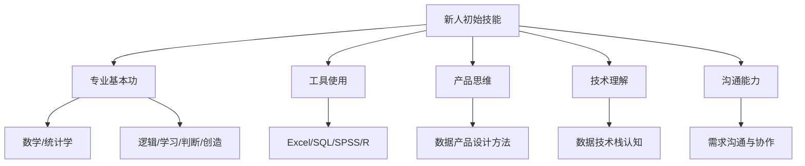
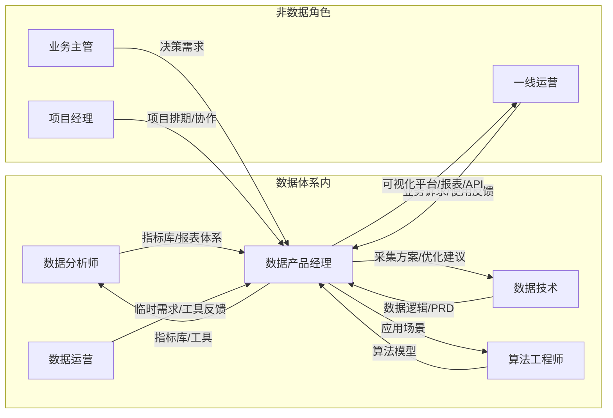
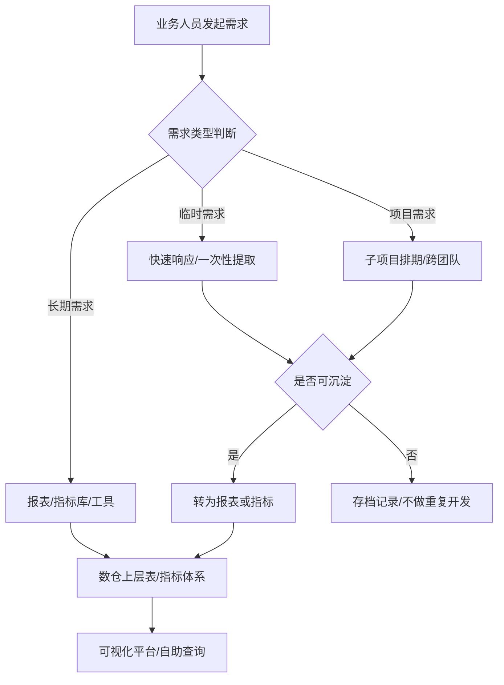
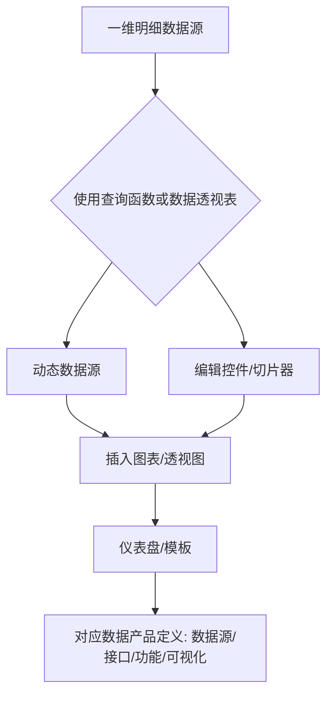
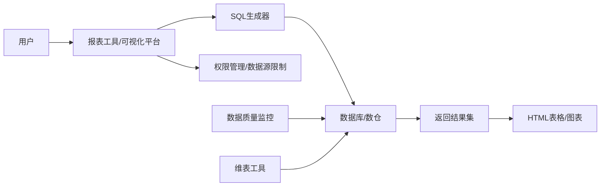
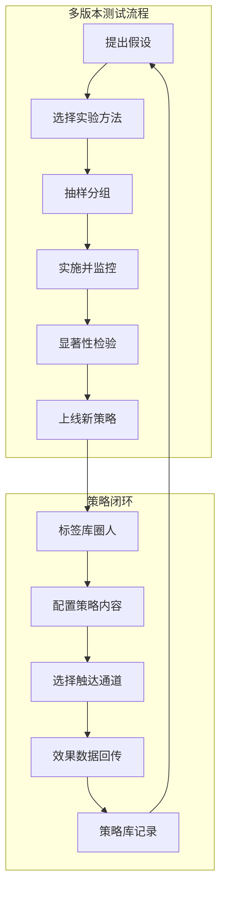
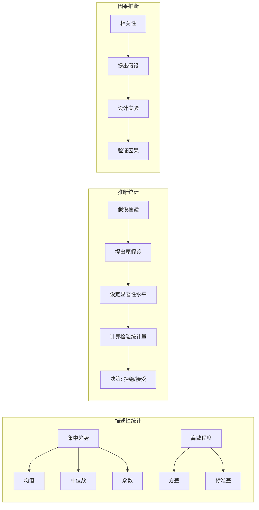
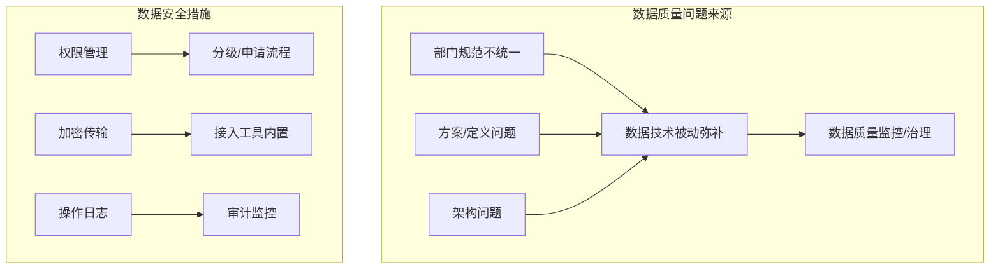

# 《写给数据产品经理新人的工作笔记》章节总结

## 书籍信息
- 书名：写给数据产品经理新人的工作笔记
- 作者：陈文思
- 出版社：电子工业出版社
- 出版时间：2020年10月
- ISBN：9787121397233
- PDF 状态：基于 EPUB 文本转换，内容完整可识别
- OCR 状态：文字清晰，图表描述完整，但部分图片链接（如`images/xxx.jpg`）无法实际展示，文中已保留原始引用

## 目录说明
- 目录识别情况：完整识别，包含前言、10个正式章节、工作笔记、后记性质内容。
- 章节对应依据：依据书中标题层级，从“第1章”至“第10章”顺序。
- OCR 修复说明：无明显错漏，部分内嵌图片引用已保留原始标记，流程图根据文字描述进行 Mermaid 重建。

## 全书核心主题
本书以数据产品经理新人的角色定位与成长路径为起点，系统阐述了数据产品经理在数据体系中的位置、与数据分析师、数据技术、运营等角色的协作关系。核心内容围绕数据需求沟通、指标体系搭建、工具设计（Excel、报表工具、可视化平台）以及数据应用（多版本测试、用户画像、策略库）展开。作者强调：数据产品的核心不是炫酷的可视化，而是逻辑清晰、客观描述业务的指标体系，以及适配组织阶段的基础工具。最后补充了必要的统计学常识、数据技术基础和数据安全红线，为新人提供了一套完整的方法论框架。

---

## 前言：想用一本书写全数据产品经理的知识实在太难了

### 核心论点
问题：数据产品经理知识体系庞杂，新人难以整合。观点：本书旨在提供一个基础的知识框架和通解通法，帮助新人理解数据产品经理的完整工作视野，而不是追求细节的全面覆盖。

### 关键概念/事件
- 写作初衷：个人系统化复盘、为新人提供思路、获得专业反馈。
- 基本思路：第1部分介绍角色创建与技能；第2部分（核心）讲需求分析、指标体系、工具设计；第3部分补充统计学、数据技术常识及常见问题。
- 遗憾：无法写全所有专题（如埋点管理、广告效果分析等）。

### 逻辑推演/叙事脉络
作者回顾自己十年数据领域经验，从数据分析师到数据产品经理的转型，感受到数据角色被“妖魔化”后的迷茫。通过写作重新整理笔记，发现数据产品经理需要关注整个体系的运转逻辑，而非某个具体平台。因此本书从工作视角出发，先讲角色关系，再讲需求沟通、指标体系、工具设计，最后补充基础常识。

### 经典金句/数据
> “想用一本书写全数据产品经理的知识实在太难了”
> “数据产品经理的‘设计’重点在逻辑层面，关注的是所有系统和业务组成的整个体系的运转逻辑。”

---

## 第1章：成为数据产品经理：角色创建和角色转变

### 核心论点
问题：不同背景的新人对数据产品经理角色存在认知差异，如何建立统一的能力模型？观点：没有完美的“高大全”形象，但有一条共同的成长路径，需要具备专业基本功（数学、逻辑、学习力）、沟通能力、产品思维和技术理解，并经历“新手任务”的积累。

### 关键概念/事件
- 数据产品分类（按功能、用户群体、开发者）。
- 数据产品经理“门派”：原生型、分析型、技术型、产品型、神仙型。
- 技能树（雷达图）：专业基本功、代码基础、Excel/SQL/SPSS/R、沟通能力、产品思维、技术理解。
- 从数据分析师转型的难点：视角从解构转向抽象和创造，接受不完美，补充产品设计方法论。
- 从数据技术转型的关键：区分“需求合理性”与“实现难度”，学会挖掘业务真实需求，从具体实现抽象到业务目标。
- 从其他产品经理转型：后台产品经理需理解数据边界=整个业务，前端产品经理需学习数据生产过程和数据分析方法。

### 逻辑推演/叙事脉络
作者通过实习生案例说明琐碎工作（数据校验、临时需求）蕴含大量信息，是理解业务变化的基础。然后构建技能树，对比不同类型转型者的优劣势：分析师熟悉统计学但需转变思维；技术人员懂实现但需学会沟通和需求判断；后台产品经理逻辑相似但数据边界更宽。最后强调“好的”数据产品经理需要向多维度均衡发展。

### 流程图

### 经典金句/数据
> “角色创建初期，你只是对这个角色有一个大概的期待，却无法预见你在这条路上会遇到什么样的难题。”
> “一个合格的数据分析师转型做数据产品经理，只需要补充针对产品设计的方法论和对技术的理解。”
> “需求本身是否合理和现状下是否能实现要分开判断。”

---

## 第2章：数据产品经理和其他角色的关系

### 核心论点
问题：数据产品经理在数据体系中如何与其他角色协作？观点：以指标体系为核心，数据产品经理的输出是方案和工具，其用户包括数据分析师、算法工程师、数据技术人员、数据运营、一线运营人员等，每个角色都有特定的数据问题和输入输出关系。

### 关键概念/事件
- 数据业务模块：采集方案、数仓、基础工具、可视化平台、数据应用等。
- 角色：一线运营、数据分析师、数据技术人员、算法工程师、数据运营、数据产品经理、项目经理。
- 用户分析：针对每个角色的特征、问题、输入、输出、沟通关注点。
- 从平台到中台：平台指技术和服务器，中台是数据方案+指标体系+流程+规范+分析过程，共同构成信息流通系统。
- 公司阶段与数据体系建设：中台战略适用于业务规模化、多业务并存时，初创阶段应避免过度投入。

### 逻辑推演/叙事脉络
先列出数据业务表格，明确各角色关心哪些模块。然后以数据产品经理为中心，画出输入/输出关系图。接着详细分析每个“用户”角色的特点：数据分析师是深度用户，算法工程师需要宽框架的数据，数据开发依赖PRD，数据运营处理临时需求，一线运营需要低门槛工具。最后讨论平台与中台的区别，并提醒根据公司阶段选择合适的投入。

### 流程图

### 经典金句/数据
> “数据产品经理的目标是用数据方法或产品方法解决数据相关角色的数据使用问题。”
> “中台就是一台办公电脑、一个‘小表妹’和Excel裂变而来的。”
> “付出多大成本，搭建什么样的数据体系，要充分考虑公司眼下所处的阶段和状态。”

---

## 第3章：需求沟通过程

### 核心论点
问题：如何识别数据需求表象背后的真实业务问题，并避免陷入永无止境的临时需求？观点：需求分类（时效、场景、输出形态、频率、数据形态）决定实现方式；核心是问自己“业务遇到什么问题？数据怎么定义和描述？数据能否直接解决？”；通过SPIN提问技巧挖掘需求，建立需求沉淀机制和定期复盘。

### 关键概念/事件
- 需求5维度分类：时效（临时/项目/长期）、使用场景（汇报/监控/探索/系统/前端/对外）、输出形态（PPT/Excel/线上报表/可视化页面/API）、输出频率（实时/离线）、数据形态（观点/报告/统计表/算法/文本）。
- 需求实现方式：低配版到高配版（如临时需求用Excel，长期需求用可视化平台）。
- SPIN提问法：背景问题(S)、难点问题(P)、暗示问题(I)、需求确认问题(N)。
- 需求沉淀：从临时需求→探索性研究→报表需求→指标体系→数仓表。
- 复盘方法：记录需求类型、问题类型、相关指标、部门等，定期回顾。

### 逻辑推演/叙事脉络
先列出需求分类表，说明不同需求类型对应的输出形态。然后通过场景案例（业务分析师要求加指标、运营要预测值、一线人员手工VLOOKUP、主管要可视化PPT）演示如何通过“三连问”挖掘本质。接着介绍SPIN技巧用于内部沟通。最后强调建立合作共识（现状、需求管理方式、项目合作方式），并通过记录和复盘将散碎需求沉淀为可复用的数据产品。

### 流程图

### 经典金句/数据
> “业务究竟遇到了什么问题需要解决？数据怎么定义和描述这个问题？这个问题是通过数据能直接解决的，还是数据能够提供一些佐证？”
> “请相信，所有数据需求的背后，永远有一个需要用这个数据去解决的业务问题。”
> “用数据的方法研究数据本身，是一件非常有趣的事。”

---

## 第4章：指标体系搭建

### 核心论点
问题：什么是指标体系？如何搭建才能客观描述业务并支持决策？观点：指标体系是一张“地图”，由相互联系的统计指标组成，具有结构；搭建方法包括确立目标、选择核心指标（量+质量）、保证可执行性和独立性；从客观描述→发现问题→策略沉淀→数据驱动四个阶段演进。

### 关键概念/事件
- 指标体系定义：多个相互联系的指标构成的有机整体，描述客观现象及其关系。
- 搭建方法：确立描述目标 → 选核心指标 → 选质量指标 → 可追踪可比较 → 指标独立。
- 案例：媒体网站指标体系（用户规模、内容质量、广告效果）。
- 指标与维度：指标是数值，维度是观察视角（Group By的字段）。
- 抽象定义 vs 操作定义：操作定义要能写出唯一SQL。
- 计算口径：数据源、计算公式、限制条件、计量单位。
- 宽表设计：统一数据源、提升查询效率，从宽表到报表。
- 迭代与反馈：记录波动归因，建立新监控。

### 逻辑推演/叙事脉络
先从减肥和国民经济指标体系两个例子说明指标体系的结构和作用。然后以媒体网站案例演示具体搭建步骤。接着区分指标和维度，强调操作定义的重要性，解释“口径之争”的来源。之后介绍宽表如何从多张主题表整合，简化报表查询。最后描述从顶层监控到多维度拆解的迭代过程，以及波动归因驱动的指标完善。

### 流程图

### 经典金句/数据
> “指标体系为公司战略和业务运营提供的是一种方向感：有指向、有诊断。”
> “最好的情况是：在同一个指标体系下，同一个指标名称有且只有一个计算口径。”
> “迅速准确的报表系统能够解决业务中90%以上的数据问题。”

---

## 第5章：Excel是最完美的数据产品

### 核心论点
问题：在数据产品经理的工具箱中，Excel处于什么位置？观点：Excel是完美的微型数据产品，适合数据量小、需求频繁调整的场景，更是训练数据产品思维的绝佳工具。通过Excel可以模拟从数据源到可视化平台的全过程。

### 关键概念/事件
- Excel优势与局限：104万行限制，适合本地处理，灵活易用。
- 重点函数：VLOOKUP、OFFSET、MATCH、INDEX。
- 数据透视表+切片器：实现动态图表联动。
- 迷你图与条件格式：轻量直观表达趋势和对比。
- 案例：人员管理Excel迷你动态模板（仪表盘、评分分布、招聘进度等）。
- 对应到数据产品定义：数据源定义、接口准备、功能定义、可视化。

### 逻辑推演/叙事脉络
先讨论工具选择因素（时效、稳定性、数据量、用户能力等），指出Excel是“填缝”利器。然后通过两个案例（查询牛仔裤销量、动态查询近3天销量）演示VLOOKUP+OFFSET组合以及控件实现动态报表。接着用数据透视表+切片器实现类似效果。最后以人员管理模板为例，详细分解仪表盘、评分分布图、子弹图、迷你图的制作过程，并强调这些步骤对应了正式数据产品的设计逻辑。

### 流程图

### 经典金句/数据
> “Excel可以在本地模拟出从数据采集到数据仓库报表，再到数据可视化的全过程。”
> “在可视化方案里，迷你图和条件格式的形式非常值得借鉴。轻盈、直观、节省版面。”
> “用Excel实现一个迷你可视化产品的过程，对于刚刚上手的新人来说，是非常好的训练工具。”

---

## 第6章：不同的工具解决不同的问题

### 核心论点
问题：数据产品经理需要设计哪些基础工具？如何选择报表工具、数据治理工具和自助查询工具？观点：工具的设计要围绕解决特定问题（报表、维表、数据质量监控、自助查询），可视化平台的核心是准确传达信息而非炫酷；第三方工具（Power BI, Tableau）各有优劣，自研需谨慎。

### 关键概念/事件
- 基础工具：通用报表工具（开源/付费/自研）、数据治理工具（维表、数据质量监控）、自助查询工具（SQL编辑器）。
- 报表工具原理：前端配置翻译成SQL → 查询数据库 → 返回HTML/图表。
- 数据质量监控：及时性、完整性、准确性、一致性；表内/表间问题；通过监控规则实现。
- 可视化平台结构：GA式的分类（概览/维度细分/关系），图表类型与数据结构对应（趋势、比例、分布、关系、转化等）。
- Power BI vs Tableau：部署、数据源准备、可视化编辑、学习门槛、费用对比。

### 逻辑推演/叙事脉络
首先指出深度加工的数据对业务往往不够用，因此需要基础工具。然后分别介绍报表工具选型考虑（开源/付费/自研的优缺点）、维表工具的必要性、数据质量监控的分层（及时性/完整性/准确性）。接着介绍自助查询工具（如HUE）的结构。之后重点讲可视化平台：GA的结构、图表类型与数据源的对应关系（折线图、饼图、漏斗图、桑吉图等），强调可视化不是目的而是手段。最后对比Power BI和Tableau，给出选型建议。

### 流程图

### 经典金句/数据
> “可视化是数据的表达方式，而不是目的。为了可视化而可视化，其实是很愚蠢的做法。”
> “在选择和设计报表工具时，需要注意在公司内部使用这一工具的用户的编码能力和数据使用能力。”
> “好的可视化平台能够让用户专注于数据本身。”

---

## 第7章：数据应用和第三方平台

### 核心论点
问题：数据如何融入业务工作流？多版本测试、用户画像、策略库等高级应用的产品形态是什么？观点：数据应用的核心是建立“策略-反馈”闭环，通过AB测试验证因果关系，通过标签库实现精细化运营，通过策略库沉淀经验；第三方平台（如神策、GrowingIO）提供采集和分析方案，但DMP的核心是管理而非可视化。

### 关键概念/事件
- 多版本测试（AB测试）：实验设计（前测/后测、真实验/准实验），工具功能（抽样、分组、配置、监控、显著性检验）。
- 用户画像与标签库：标签是属性和属性值的组合，服务于运营决策（圈人、触达、效果反馈）。
- 策略库：记录“什么时间、对什么人、用什么策略、得到什么效果”，形成可复用的建议。
- 事件埋点：事件类型（浏览/行为/其他），属性分类（公共/用户/事件/业务），埋点vs无埋点。
- DMP本质：数据管理平台，可视化只是冰山一角。
- 第三方平台比较：神策（埋点为主） vs GrowingIO（无埋点为主），各有适用场景。

### 逻辑推演/叙事脉络
先提出数据应用的目标是找到因果关系的“实验室”。然后以UI优化为例，详细拆解AB测试的实验设计流程（提出假设、确认自变量、选择实验方法、数据采集、效果评估），并给出工具设计的线框图。接着讲标签库如何帮助内容运营：圈定人群、投其所好、反馈效果。然后提出策略库的概念，形成闭环。之后解释事件埋点的技术细节和分类，澄清DMP的真实含义。最后对比两类第三方采集分析平台的特点。

### 流程图

### 经典金句/数据
> “DMP的全称是Data Management Platform，核心词是Management——管理，可视化方案的占比可能连十分之一都不到。”
> “标签库，或者说整个数据体系，永远不只关于技术，更关于运营，关于营销本身。”
> “好的多版本测试工具，除了要在数据层面适应各种类型的实验流程，还需要有能力与这些场景相结合。”

---

## 第8章：必须理解的统计学知识

### 核心论点
问题：数据产品经理为什么需要懂统计学？观点：数据辅助决策的本质是统计学方法，理解描述性统计（均值、方差、分布）、相关性与因果关系的区别、假设检验的思维方式，能帮助与数据使用者沟通并避免逻辑谬误。

### 关键概念/事件
- 描述性统计：频数、分布、集中趋势（均值/中位数/众数）、离散程度（方差/标准差）。
- 随机变量：离散变量与连续变量，二项分布与正态分布。
- 均值、中位数、众数的关系：判断分布偏态（左偏/右偏/对称）。
- 标准差与方差：描述曲线的形状，配合均值判断差异。
- 相关性≠因果关系：典型案例（香草冰激凌与汽车熄火），因果推断需要实验和专业知识。
- 贝叶斯法则：后验概率=标准相似度×先验概率，引入主观经验。
- 假设检验：逆向思维，先假设再验证，小概率事件不可能发生。

### 逻辑推演/叙事脉络
首先强调统计学对数据产品经理的重要性（类比厨具与厨师）。然后讲解描述性统计的核心指标：均值、中位数、众数、方差，以及它们如何用于判断数据分布。接着通过“通用汽车香草冰激凌”案例说明相关性和因果关系的区别，以及如何避免“相关性代替因果”的逻辑谬误。最后介绍假设检验的“反人类”但有效的思维方式，鼓励用实验代替无休止的争论。

### 流程图

### 经典金句/数据
> “相关性不等于因果关系——这几乎成为统计学领域的常识。”
> “贝叶斯把主观意愿引入了统计学模型，让认知水平参与了统计学计算。”
> “假设检验为我们提供了一种有效的思维方式：先假设，再实验，用数据验证。”

---

## 第9章：必须了解的数据技术基础知识

### 核心论点
问题：数据产品经理需要了解哪些数据技术？观点：不需要懂代码细节，但要理解数据平台各组件解决什么问题（采集、存储、计算、输出）、数据同步方式（增量/全量、离线/实时）、数仓建模思想（分层+主题），以及SQL的基本作用和团队技术栈的评估方法。

### 关键概念/事件
- 数据平台基础架构：采集（Flume/Kafka）、存储（HDFS/Hbase）、计算（MapReduce/Storm）、输出（接口/自助查询）。
- Hadoop故事化理解：Flume情报员、Kafka信息员、HDFS处长、Hbase档案馆、MapReduce情报分析站。
- 数据源类型：非结构化/结构化；C端采集（JS/SDK） vs 后台系统接入。
- 埋点技术原理：浏览器基于JS，App基于SDK，内嵌H5需传参。
- 数据同步：增量/全量，离线/实时，工具（Sqoop/DataX）。
- 数仓建模：维度建模，分层（ODS→DWD→DWS→ADS），主题（用户/订单/内容）。
- 调度与依赖：定时任务 vs 依赖任务。
- SQL对产品经理的价值：评估难度、沟通无歧义、验收数据。

### 逻辑推演/叙事脉络
先从数据平台需要解决的共性问题出发（采集、存储、计算、输出、安全）。然后用Hadoop情报处的比喻帮助理解组件角色。接着详细讲解用户行为采集的技术细节（JS、SDK、内嵌H5、小程序），以及数据同步的两种类型。之后介绍数仓维度建模的分层思想和主题划分。最后强调产品经理学一点SQL的重要性，以及了解团队技术栈的必要性。

### 流程图

### 经典金句/数据
> “SQL也许不能叫作代码，却不可替代。”
> “数仓建设和‘图书馆’这个专业有着某种内在的联系。这种联系的核心思想就是‘分类’。”
> “永远要记得一件事：我们不是数据的创造者，用户和业务才是。”

---

## 第10章：不得不说的“坑”和红线

### 核心论点
问题：数据产品经理在工作中会遇到哪些典型困境？如何应对数据质量、平衡基础建设与业务输出、保障数据安全？观点：数据质量问题是系统性难题，需要跨部门共识和长期治理；不要企图做“烂好人”，要客观公正；数据安全是红线，需要权限管理、流程规范和产品化落地。

### 关键概念/事件
- 统一名词库的困难：部门规范不一致、方案定义问题、架构问题。
- 第三方数据接入的“魔幻”：设备唯一识别码混乱，对接成本高。
- 埋点维护：不可避免的体力活，需要多部门协作，无法完全自动化。
- 基础建设 vs 业务输出：需要平衡，面对刷数、迁移、校验等痛苦日常。
- 数据安全：权限管理、流程规范、加密传输、操作日志。
- 产品经理能为数据安全做什么：熟悉制度、警惕敏感输出、系统化权限和加密功能。

### 逻辑推演/叙事脉络
先抛出灵魂拷问：工作中最难的部分是什么？然后逐一展开：数据质量问题的三种根源（规范不统一、方案定义、架构缺失），并以埋点维护为例说明这是无法避免的体力活。接着讨论基础建设与业务输出的矛盾，举例大规模迁移校验的恐慌。之后强调不要做“烂好人”，要敢于暴露问题、保持客观。最后讨论数据安全，分析为什么总是在亡羊补牢，以及产品经理在权限管理、流程、系统化方面的职责。

### 流程图

### 经典金句/数据
> “数据质量问题在一个公司里到底是一个什么层级的问题？需要广泛共识、多方配合。”
> “千万不要企图做‘烂好人’。”
> “人总是有一种后验倾向：风险不以实际的损失发生在我们自己头上，便假装它不存在。”

---

## 致谢

### 核心论点
作者感谢了给予帮助的前辈、母亲、编辑、猫以及自己，并鼓励读者继续在数据产品经理的路上“越走越好”。

### 经典金句/数据
> “愿我们在工作中遇到的所有问题，都在意料之中。”
> “感谢我的猫，在我感到非常烦躁时陪在我身边。”