# 《分布式服务架构：原理、设计与实战》章节总结

## 书籍信息
- **书名**：分布式服务架构：原理、设计与实战
- **作者**：李艳鹏、杨彪
- **出版社**：电子工业出版社
- **出版年份**：2017年8月第1版
- **PDF 状态**：完整，分三个部分，OCR 可读性良好
- **OCR 状态**：存在少量错漏（如个别字符识别错误、换行异常），但不影响整体理解

## 目录说明
- 目录识别完整，包含第1章至第8章及前言、推荐语等部分
- 章节对应依据：原书页码与文字标题
- OCR 修复说明：部分图表标注缺失，但逻辑关系可提取；个别命令输出格式错乱，已基于上下文整理

## 全书核心主题
本书系统讲解了分布式服务架构（从 SOA 到微服务）的设计原理、一致性解决方案、容量评估与性能保障、大数据日志系统、调用链跟踪、线上应急与攻关、容器化以及敏捷开发自动化工具。作者结合一线互联网实践，提出了一套可落地的架构方法论和最佳实践，覆盖了大规模、高并发系统从设计到运维的全生命周期。核心思想包括：通过拆分实现高可用与高伸缩，通过最终一致性保证分布式事务，通过日志与调用链实现可观测性，通过容器化与自动化实现敏捷交付。

---

## 前言与推荐部分

### 1. 内容简介
> “本书全面介绍了分布式服务架构的原理与设计，并结合作者在实施微服务架构过程中的实践经验，总结了保障线上服务健康、可靠的最佳方案。”
（来源：内容简介）

### 2. 推荐语要点
- 陈江伟（蓝汛技术总监）：本书案例详实，代码可直接使用。
- 黄福伟（爱奇艺高级技术经理）：提供了互联网架构设计方法论和真实案例。
- 兰博（菜鸟网络架构师）：强调可用性和高性能的实践经验。
- 朱军（华为资深云架构师）：深入浅出，展示服务化架构设计蓝图。
- 张建（12链 CTO）：解决分布式一致性、容量预估、日志、线上应急等痛点。
- 杨辛（北京最猫网络科技 CEO）：书中经验方法可直接应用。
- 岳鹏（成都鱼说科技董事长）：对分布式原理、实践全面分析。
- 李占斌（汽车之家运维开发技术经理）：结合业务特点落地微服务。
- 付红雷（宜信资深大数据工程师）：理论与实践的结晶。

### 3. 推荐序要点
- 姚建东（易宝支付产品 VP）：提供了大量实际操作和命令解析。
- 于立柱（福佑卡车 CTO）：涉及微服务、分布式、一致性、性能与容量、日志系统、调用链、容器、敏捷开发等。
- 杨延峰（开心网副总裁）：架构师需要引领技术，本书是极佳参考。

### 4. 作者前言（自序）
- 写作背景：总结分布式服务架构的经验与模式。
- 感谢编辑、技术小伙伴、英语专业帮助者及家人。
- 强调“开放、分享”的态度。

---

## 第1章：分布式微服务架构设计原理

### 核心论点
**问题**：传统单体架构（JEE/SSH）难以满足互联网海量用户的高并发、高可用、可伸缩需求。  
**观点**：通过服务化（SOA）和微服务架构进行拆分，实现职责单一、独立部署、水平伸缩，并配合去中心化治理、容错模式、团队重构等核心要点。

### 关键概念/事件
- **JEE架构**：Web层、业务逻辑层、数据存取层三层，运行在应用服务器（如 WebLogic）中，单体部署。
- **SSH架构**：Struts + Spring + Hibernate，轻量级但仍是单体。
- **服务化架构（SOA）**：将模块拆分为独立网络服务，通过 Web Service 或 ESB 实现交互。
- **微服务架构**：细粒度服务，独立进程，RESTful API，去中心化治理，每个服务拥有独立数据存储和团队。
- **康威定律**：系统的架构等于组织的沟通结构，微服务要求按业务功能划分团队。

### 逻辑推演
1. 从传统单体架构（JEE）到开源 SSH，虽然分层但仍是单体，导致耦合严重、扩展困难。
2. 互联网高并发压力推动 SOA 服务化，通过 Web Service 和 ESB 实现服务拆分，但 ESB 存在中心化瓶颈。
3. 微服务在 SOA 基础上演进，强调去中心化、独立部署、轻量通信（RESTful）、服务自治。
4. 微服务核心要点包括：职能团队按服务划分、去中心化治理、四种交互模式（读者容错、消费者驱动契约、去数据共享）、六种服务组合模式（代理、聚合、串联、分支、异步、共享数据反模式）、容错模式（舱壁隔离、熔断、限流、失效转移）、粒度控制。
5. Java 平台微服务项目结构：导出层、接口层、实现层，强调不在本地事务中调用远程服务。
6. 技术选型对比：RPC（RMI、Hessian、Spring HTTP Invoker）、服务化（Dubbo、HSF、Thrift、Axis、Mule ESB）、微服务（Spring Boot、Netflix、Spring Cloud Netflix）。

### 流程图（部分重建）

#### 微服务架构与传统单体架构对比

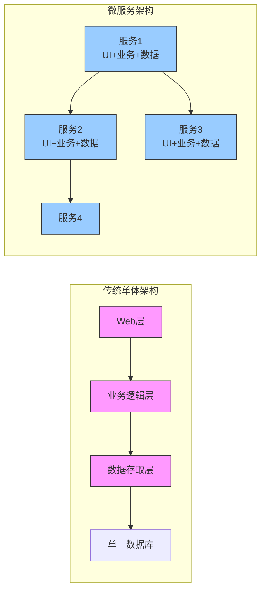

#### 服务代理模式

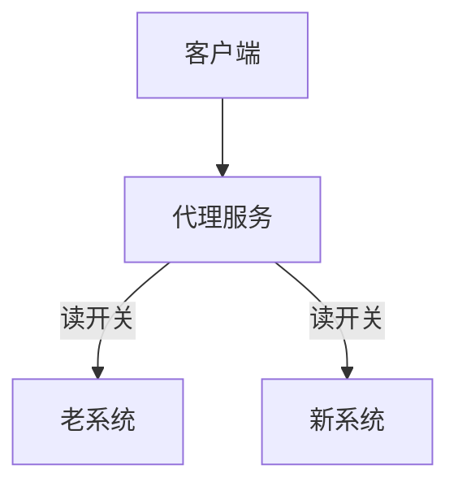

#### 服务聚合模式

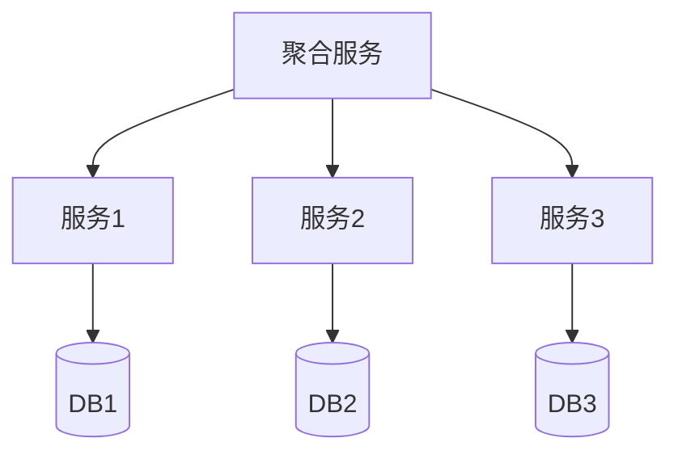

#### 熔断模式状态机

```mermaid
stateDiagram-v2
    [*] --> 关闭(Closed)
    关闭(Closed) --> 打开(Open) : 失败阈值达到
    打开(Open) --> 半开(Half-Open) : 超时后尝试
    半开(Half-Open) --> 关闭(Closed) : 成功
    半开(Half-Open) --> 打开(Open) : 失败
```

### 经典金句/数据
> “微服务架构倡导将软件应用设计成多个可独立开发、可配置、可运行和可维护的子服务。” (p.32)
> “根据康威定律，设计系统的组织时，最终产生的设计等价于组织的沟通结构。” (p.23)
> “如果基础服务一次宕机1台，且调用链中有2层依赖，则需要至少9台机器才能将可用性波动率控制在25%以内。” (p.50)
> “Spring Cloud Netflix 是当前最流行的微服务架构的落地和实现。” (p.71)

---

## 第2章：彻底解决分布式系统一致性的问题

### 核心论点
**问题**：微服务拆分后，通过网络通信导致数据不一致（如下订单与扣库存、同步/异步超时、掉单、缓存不一致等）。  
**观点**：通过 ACID（强一致性）、CAP 与 BASE（最终一致性）理论，结合两阶段/三阶段提交、TCC 协议及查询模式、补偿模式、异步确保模式、定期校对模式、可靠消息模式、缓存一致性模式等，彻底解决一致性问题。

### 关键概念/事件
- **ACID**：原子性、一致性、隔离性、持久性（关系型数据库强一致）。
- **CAP**：一致性、可用性、分区容忍性三者不可兼得。
- **BASE**：基本可用、软状态、最终一致性。
- **两阶段提交（2PC）**：准备阶段 + 提交阶段，存在阻塞、单点故障、脑裂问题。
- **三阶段提交（3PC）**：增加询问阶段和超时机制，减少阻塞。
- **TCC**：Try-Confirm-Cancel，简化版三阶段，需补偿。
- **最终一致性模式**：查询模式、补偿模式（自动/运营/技术）、异步确保模式、定期校对模式、可靠消息模式（消息可靠发送 + 幂等处理）、缓存一致性模式。

### 逻辑推演
1. 提出一致性问题的典型场景（下订单扣库存、同步超时、异步回调超时、掉单、系统间状态不一致、缓存不一致等）。
2. 引入酸碱平衡理论：ACID（酸）用于强一致场景（如核心交易），CAP 证明分布式系统只能满足两点，BASE（碱）通过牺牲强一致获得可用性和最终一致。
3. 分布式一致性协议：2PC、3PC、TCC 的优劣分析，结论是互联网高并发场景下常用 TCC 和最终一致性模式。
4. 详细阐述六种最终一致性模式的适用场景与实现方法。
5. 超时处理模式：针对同步调用、异步调用、消息队列三种交互模式下的超时解决方案，以及超时补偿原则（服务接收方给出明确响应后由其负责，否则调用方负责重试）。
6. 迁移开关设计：推荐使用“订单开关”（在创建订单时固化开关状态），避免全局开关不一致导致重复处理。

### 流程图

#### 两阶段提交协议（成功场景）

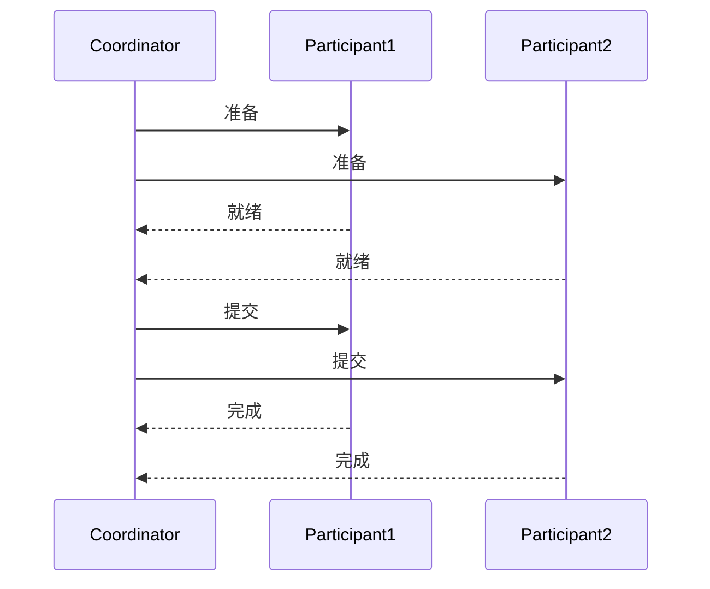

#### 定期校对模式

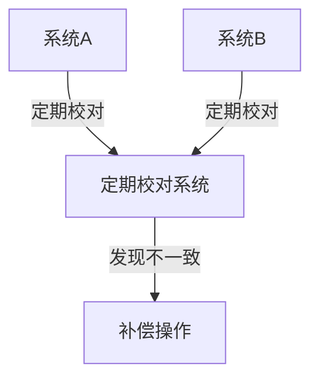

### 经典金句/数据
> “BASE思想满足了CAP原理，通过牺牲强一致性获得可用性。” (p.79)
> “能通过向上扩展（强悍硬件）解决的问题都不是问题。” (p.80)
> “金融系统与社交应用在技术上的本质区别：社交应用在于量大，金融系统在于数据的准确性。” (p.92)
> “迁移比实现新系统更加困难。” (p.107)

---

## 第3章：服务化系统容量评估和性能保障

### 核心论点
**问题**：如何保证微服务系统满足非功能质量（高性能、高可用、可伸缩、可扩展、安全性等）？  
**观点**：通过技术评审方法论、容量和性能评估流程、性能测试（压测）全流程以及常用压测工具，确保系统在设计阶段和上线后都能达到既定性能目标。

### 关键概念/事件
- **非功能质量指标**：高性能（吞吐量、响应时间）、高可用（SLA）、可伸缩（水平扩展）、可扩展（插拔）、安全性、可监控性、可测试性等。
- **技术评审提纲**：现状（业务/技术背景）、需求（业务/性能）、方案描述（概述/详细/性能评估/优缺点）、方案对比、风险评估、工作量评估。
- **性能评估经典案例**：物流系统（用户地址、物流订单）的容量评估，包括读/写吞吐量、数据容量、缓存、消息队列、应用服务器数量计算。
- **性能测试类型**：基准测试、容量测试、负载测试、混合业务测试、稳定性测试、异常测试。
- **加压方式**：瞬间加压、逐渐加压、梯度加压。
- **压测工具**：ab、jmeter、mysqlslap、sysbench、dd、LoadRunner、hprof。

### 逻辑推演
1. 架构设计必须兼顾功能与非功能质量，互联网架构权衡分析（ATAM）是重要方法。
2. 提供详细的非功能质量指标表格，涵盖应用服务器、数据库、缓存、消息队列的部署结构、容量、性能、其他指标。
3. 给出技术评审提纲模板，帮助团队系统化评估架构。
4. 以物流系统为例，演示如何根据业务量级（用户数、订单量）计算读写吞吐量、表容量、机器数量（MySQL、Redis、Kafka、应用服务器），并给出最大性能方案和最小资源方案对比。
5. 介绍性能测试的完整流程：明确目标→设计场景（业务模型、测试类型、加压方式）→准备环境→执行压测→问题修复→优化。
6. 列举常用压测工具及使用示例，包括 ab 对 RESTful API 的压测、jmeter 的复杂场景、mysqlslap 的数据库压测、sysbench 的 CPU/内存/磁盘/数据库压测、dd 的磁盘顺序读写、hprof 的 CPU/内存分析。

### 经典金句/数据
> “容量按照峰值的5倍进行冗余计算。” (p.121)
> “MySQL单端口读：1000/s，单端口写：700/s，单表容量：5000万条。” (p.121)
> “Kafka单机读：30000/s，单机写：5000/s。” (p.122)
> “吞吐量 = (1s/响应时间) × 并发数。” (p.132)
> “线上服务每秒可处理请求数：ab测试Vesta发号器达到3254.33/s，平均响应时间3ms。” (p.143)

---

## 第4章：大数据日志系统的构建

### 核心论点
**问题**：微服务架构下日志分散在不同节点，如何高效收集、处理、存储、搜索和监控？  
**观点**：通过大数据日志系统（典型为 ELK：Elasticsearch + Logstash + Kibana）统一管理日志，结合日志框架优化（异步、合理配置）和最佳实践（级别、大小、切割、格式），实现高并发下的可观测性。

### 关键概念/事件
- **常见日志类型**：Tomcat 存取日志、控制台日志、本地日志、业务应用日志、性能日志、远程调用日志。
- **开源日志框架**：JDK Logger、Apache Commons Logging、Log4j、Slf4j、Logback、Log4j2。
- **Log4j 性能问题**：同步锁导致高并发下线程阻塞，异步 Appender 使用 ArrayBlockingQueue 或 Disruptor RingBuffer 可大幅提升吞吐量。
- **Slf4j**：门面模式，编译时静态绑定底层实现，支持参数化日志。
- **Logback**：性能优于 Log4j，内置异步 Appender。
- **Log4j2**：异步 Logger 使用无锁 Disruptor，吞吐量是 Log4j1.x 的 18 倍以上。
- **日志最佳实践**：开发人员要有日志意识；生产环境用 info 或 error 级别；控制日志大小（单条 ≤1KB）；使用框架原生滚动切割；避免使用 %L、%M 等耗性能的格式；警惕一行日志引发的线上事故（如 toString 抛 NPE 导致连接未释放）。
- **大数据日志系统架构**：日志采集器（Logstash、Fluentd、Flume、Scribe、Rsyslog）→ 缓冲队列（Kafka）→ 日志解析器 → 存储与搜索（Elasticsearch）→ 展示（Kibana）→ 监控报警。
- **ELK 系统**：Elasticsearch（NoSQL 搜索引擎）、Logstash（采集/解析/转换）、Kibana（可视化）。

### 流程图

#### 大数据日志系统通用架构

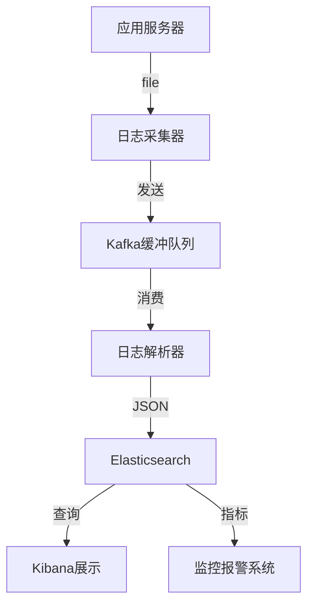

### 经典金句/数据
> “Log4j2 异步 Logger 使用无锁 DisruptorRingBuffer，在64线程下吞吐量是同步 Logger 的68倍。” (p.167)
> “一行日志导致的线上事故：增加日志打印 Map，触发 toString 的 NullPointerException，导致数据库连接未释放，连接池用光。” (p.177)
> “ELK 系统每月有50万下载量，成为最流行的日志管理平台。” (p.190)

---

## 第5章：基于调用链的服务治理系统的设计与实现

### 核心论点
**问题**：微服务架构中调用链复杂，定位故障需要跨多个服务排查，效率低下。  
**观点**：借鉴 Google Dapper 论文，通过 TraceID 和 SpanID 实现调用链跟踪，构建 APM（应用性能管理）系统，快速发现故障节点并恢复调用树。

### 关键概念/事件
- **APM 系统**：Pinpoint（无侵入，低损耗）、Zipkin（Twitter开源）、CAT（美团点评）。
- **TraceID**：全局唯一流水号，标识一次完整请求在分布式系统中的流转。
- **SpanID + ParentSpanID**：恢复调用树形结构。
- **业务链**：通过业务 ID（如订单号）将多个调用链聚合，形成业务视角的森林。
- **调用链系统设计**：采集器（AOP/JavaAgent/Kafka/UDP）→ 处理器（聚合、分析）→ 存储（HBase 宽表）→ 展示（ECharts）。
- **传递机制**：Java 进程内用 ThreadLocal；跨服务用 HTTP Header 或 RPC 扩展字段；多线程用自定义线程池传递；消息队列、缓存、数据库访问需额外封装。

### 流程图

#### 调用链跟踪原理（TraceID 与 SpanID）

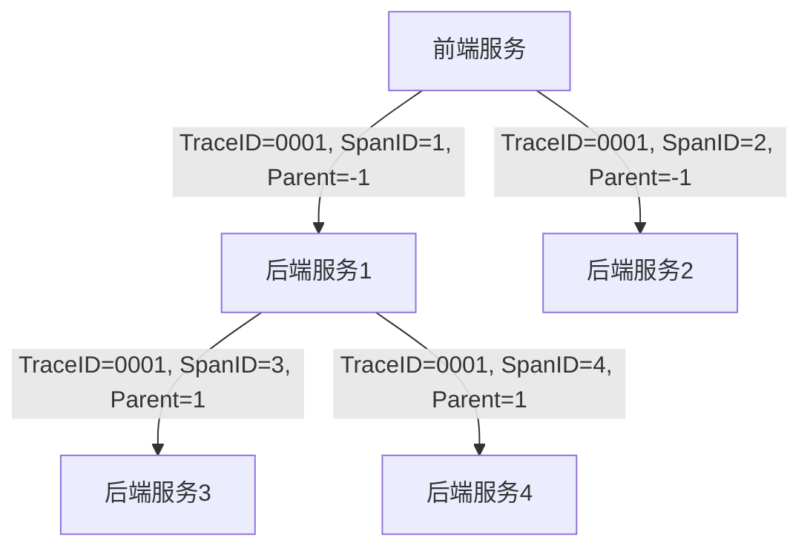

#### 调用链系统整体架构

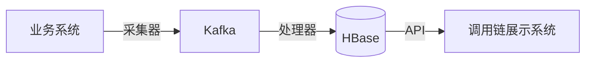

### 经典金句/数据
> “Pinpoint 安装的采集端代理组件对原有服务代码无侵入，只增加约3%的资源利用率。” (p.201)
> “通过全局唯一流水ID可将请求在分布式系统中的流转路径聚合。” (p.211)
> “ConcurrentLinkedQueue 的 size() 方法是 O(n) 的，频繁调用会导致 CPU 100%。” (p.220)

---

## 第6章：Java服务的线上应急和技术攻关

### 核心论点
**问题**：线上服务出现故障（OOM、CPU 100%、超时等）时如何快速定位和恢复？  
**观点**：遵循海恩法则（事故是量积累的结果）和墨菲定律（会出错的一定会出错），建立应急流程（发现问题→定位→解决问题→消除影响→回顾→避免措施），掌握高效脚本、JVM 命令、Linux 命令，通过最小化重现和技术攻关方法论彻底解决。

### 关键概念/事件
- **海恩法则**：每起严重事故背后有29次轻微事故、300起未遂先兆、1000起隐患。
- **墨菲定律**：会出错的事总会出错。
- **应急原则**：第一时间恢复系统（而非彻底解决）、快速止损、升级机制、保留现场。
- **技术攻关流程**：收集现象→最小化复现→定位根源→提出方案→评审→验证→上线。
- **高效脚本**：
  - `show-busiest-java-threads`：查找 CPU 最高的线程。
  - `find-in-jar` / `grep-in-jar`：Jar 包中搜索类或内容。
  - `jar-conflict-detect`：检测 Jar 包冲突。
  - `http-spy`：抓取 HTTP 请求参数。
  - `show-mysql-qps`：查看 MySQL QPS/TPS。
- **JVM 命令**：jad（反编译）、btrace（动态跟踪）、jmap（内存堆转储）、jstat（GC 统计）、jstack（线程堆栈）、jinfo（JVM 参数）。
- **Linux 命令**：grep、find、uptime、lsof、ulimit、curl、scp、vi/vim、awk、ps、top、pidstat、free、pmap、vmstat、mpstat、iostat、netstat、tcpdump、sar、strace、/proc 文件系统等。
- **典型案例**：
  - OOM（unable to create new native thread）：由于日志切割导致 I/O 阻塞，线程池被撑满，超过 ulimit 限制。解决方案：使用 Log4j 原生滚动、调整线程池大小、升级日志框架。
  - CPU 100%：ConcurrentLinkedQueue 的 size() 方法在队列很大时耗时过长。解决方案：使用有界队列或 Disruptor。

### 经典金句/数据
> “在生产环境发生故障时快速恢复服务，避免或减少故障造成的损失。” (p.229)
> “pstack 与 jstack 配合使用可查看 JVM 线程运行的全部状况。” (p.287)
> “ConcurrentLinkedQueue 的 size() 方法复杂度为 O(n)，频繁调用导致 CPU 100%。” (p.220)
> “解决方案：使用环形队列或 Disruptor RingBuffer。” (p.303)

---

## 第7章：服务的容器化过程

### 核心论点
**问题**：传统部署和虚拟机部署存在资源浪费、环境不一致、启动慢等问题。  
**观点**：容器（Docker）通过轻量级隔离、镜像标准化、快速启动，实现应用的一次构建、随处运行，结合 Docker 命令、Compose 编排、Swarm 集群，完成服务的容器化改造。

### 关键概念/事件
- **容器 vs 虚拟机**：容器共享宿主机内核，启动秒级，空间 MB 级；虚拟机包含完整 OS，启动分钟级，空间 GB 级。
- **Docker 架构**：Daemon、REST API、CLI；对象包括镜像、容器、网络、卷、服务。
- **Docker 核心技术**：Namespaces（pid、net、ipc、mnt、uts）、cgroups（资源限制）、UnionFS（分层文件系统）。
- **常用 Docker 命令**：镜像（pull、run、commit、build）、容器（start、stop、logs、exec、rm）、卷（create、inspect、ls、prune、rm）、网络（create、connect、disconnect、ls、prune、rm）、服务（create、ls、inspect、scale、update）、集群（init、join-token、join、leave、update）。
- **Docker Compose**：通过 docker-compose.yml 定义多容器应用，一键启动。
- **容器化示例**：WordPress + MySQL 的 Compose 部署。

### 流程图

#### Docker 架构

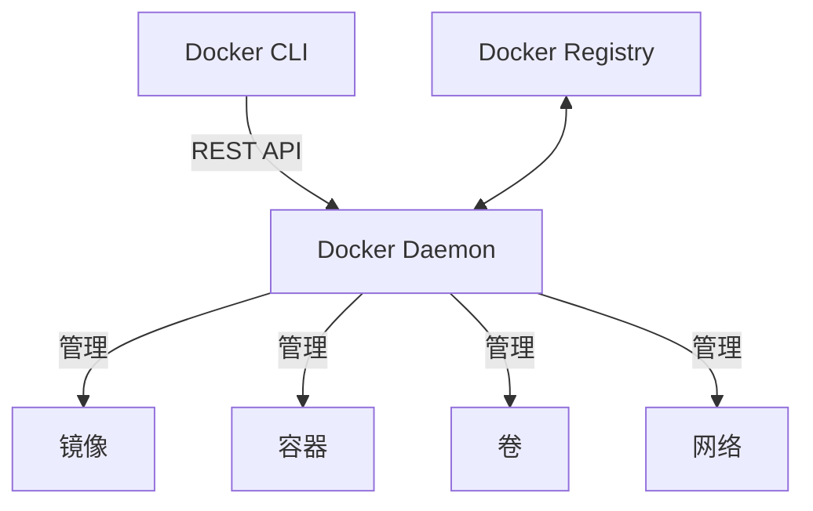

#### Docker Compose 工作流

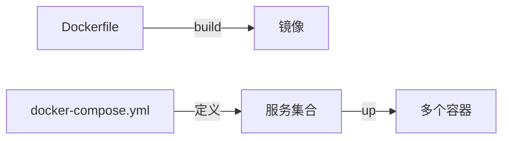

### 经典金句/数据
> “容器被誉为运输业与世界贸易的最重要发明，Docker 将集装箱思想运用到软件打包。” (p.309)
> “Docker 使容器和虚拟机相结合，部署和管理应用更加灵活。” (p.311)
> “使用 docker-compose up -d 即可启动 WordPress 和 MySQL。” (p.382)

---

## 第8章：敏捷开发2.0的自动化工具

### 核心论点
**问题**：传统软件开发模式（瀑布、迭代、螺旋）应对快速变化的需求效率不足。  
**观点**：敏捷开发 2.0 = 敏捷 + DevOps + 持续集成/持续交付 + 微服务 + 容器 + 自动化工具（Git、Jenkins、SaltStack、Docker），通过文化改变和自动化流程实现快速交付、快速反馈。

### 关键概念/事件
- **四种开发模式**：瀑布式（严格阶段）、迭代式（短周期增量）、螺旋式（风险驱动）、敏捷（适应变化）。
- **DevOps**：开发与运维协作，文化 + 自动化工具，公式：文化观念改变 + 自动化工具 = 快速适应市场。
- **敏捷开发2.0**：持续集成（CI）+ 持续交付（CD）+ 微服务 + 容器。
- **持续集成流程**：提交代码 → 静态代码分析 → 部署前测试（单元测试） → 打包部署到测试环境 → 预生产测试。
- **持续交付 vs 持续部署**：交付需人工批准上线，部署全自动上线。
- **自动化工具**：
  - **Git**：分布式版本控制，常用命令（clone、add、commit、push、pull、branch、merge、tag）。
  - **GitLab**：自托管 Git 仓库管理。
  - **Jenkins**：CI/CD 工具，Pipeline 定义（Agent、Stage、Step）。
  - **SaltStack**：基础平台管理（Master/Minion 模式，ZeroMQ 通信）。
  - **Docker**：容器化（结合 Machine、Swarm、Compose）。

### 流程图

#### 持续集成/持续交付流程


#### DevOps 流程

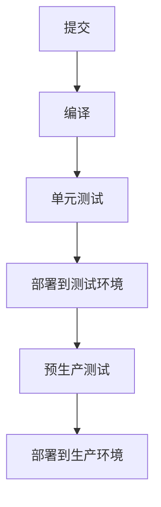

### 经典金句/数据
> “DevOps 的核心价值：更快速地交付，响应市场的变化；更多地关注业务的改进与提升。” (p.391)
> “持续集成要求每人每天至少集成一次。” (p.393)
> “Jenkins  Pipeline 将流程定义为代码（Jenkinsfile），可版本控制。” (p.412)

---

## 结语
本书从原理到实战，系统性地覆盖了分布式服务架构的完整知识体系。无论是一致性、性能、日志、调用链、应急、容器还是敏捷自动化，均提供了可落地的方法、工具和案例。适合软件工程师、架构师、技术管理者及运维人员深入研读。