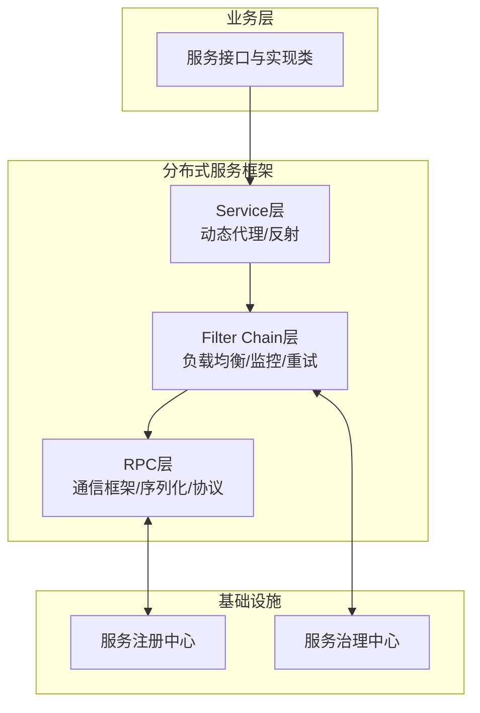
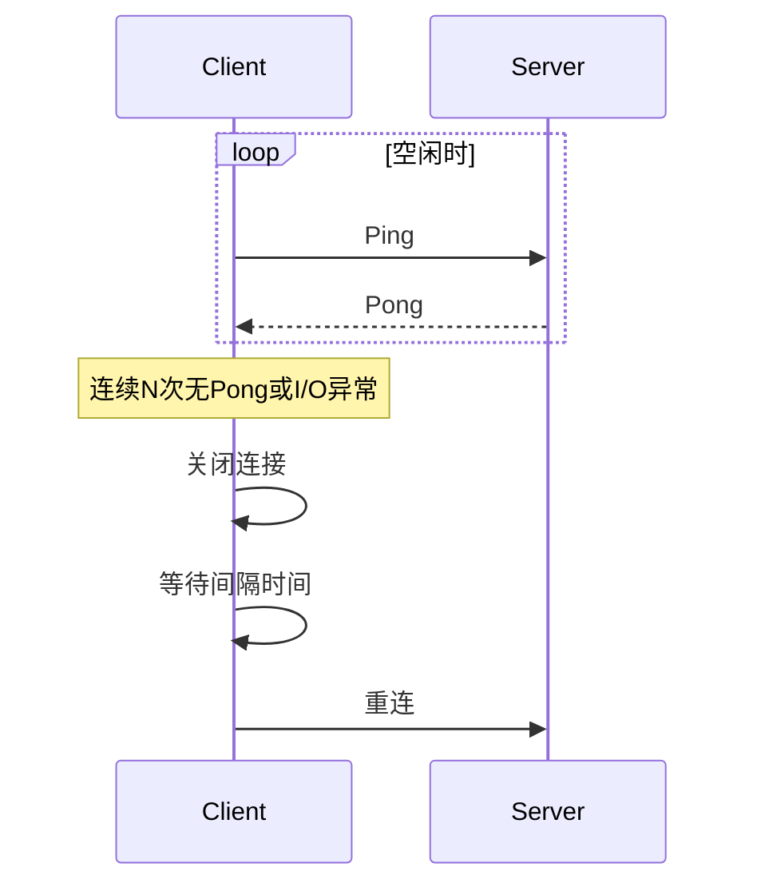
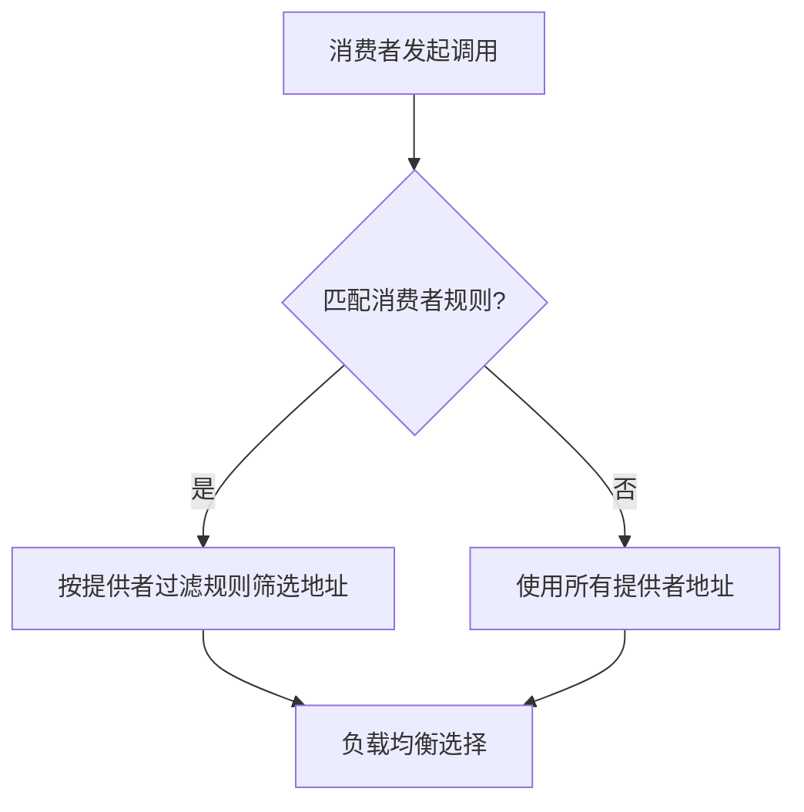
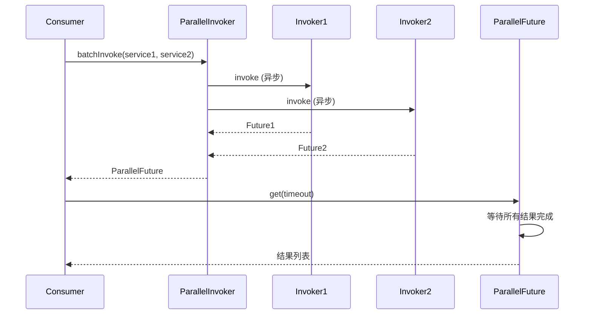
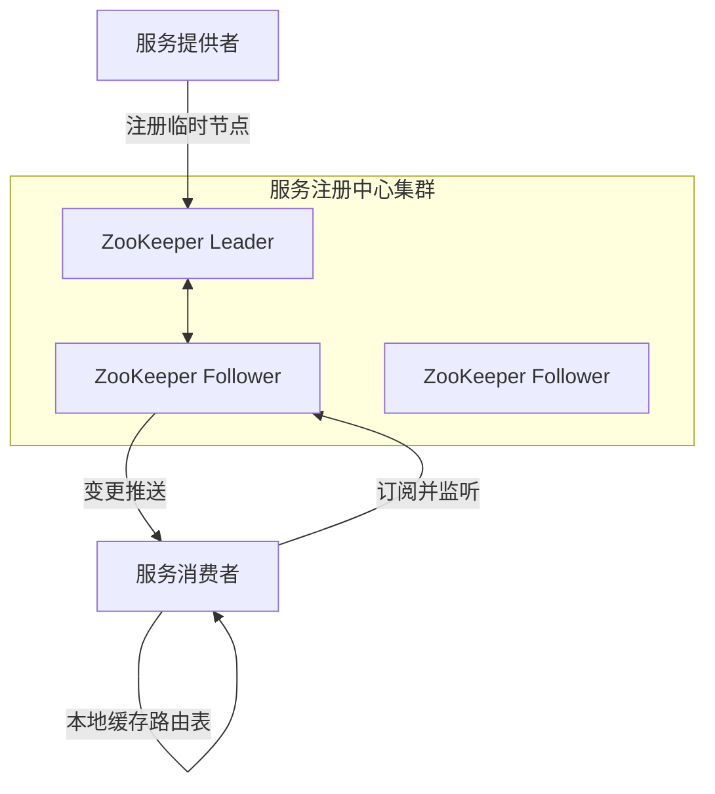
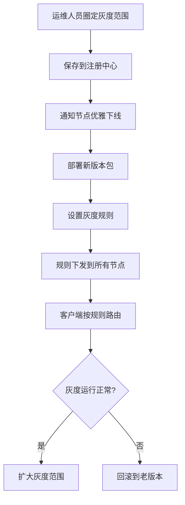
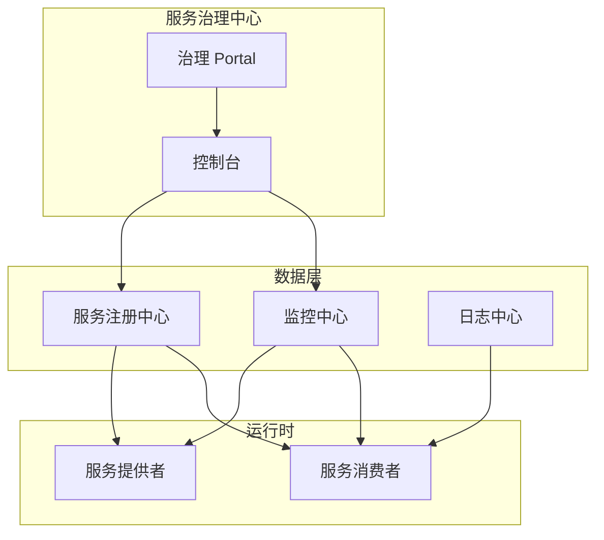
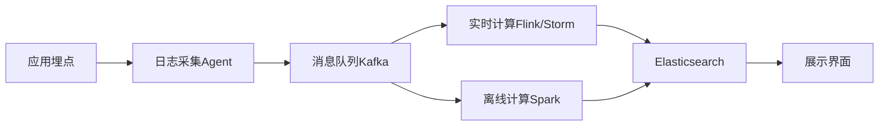
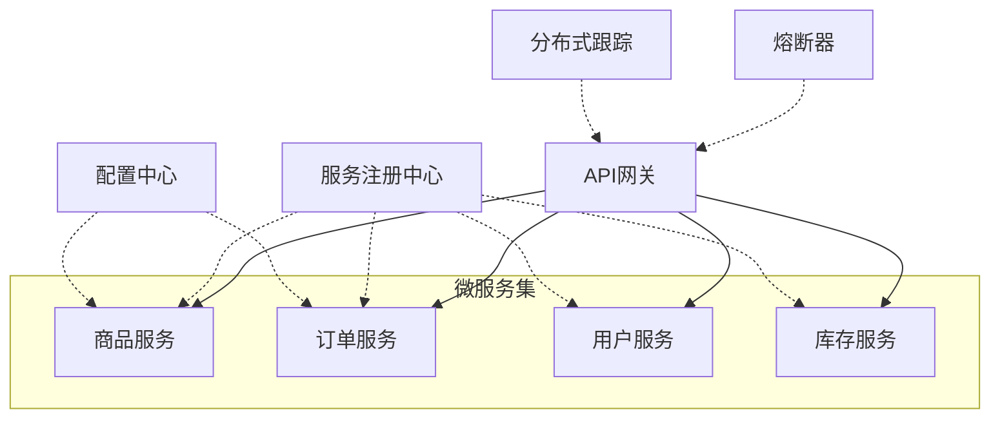

# 《分布式服务框架原理与实践》章节总结

## 书籍信息

- **书名**：分布式服务框架原理与实践
- **作者**：李林锋
- **PDF 状态**：基于扫描/OCR 识别，文本可读但存在部分页码标记错乱、图表缺失或仅保留图题。
- **OCR 状态**：已提取正文主要内容，部分图例、表格需根据文字描述重建逻辑关系。

## 目录说明

- **目录识别情况**：完整识别全书 21 章及前言、序言部分。目录层级与正文基本一致。
- **章节对应依据**：按书中标注的页码顺序和章节标题进行整理。
- **OCR 修复说明**：部分图表（如图1-1、图2-5等）仅保留标题或示意图标记，无法恢复原始视觉样式，已根据文字描述使用 Mermaid 重建核心流程；部分缺页、跳页已标注。

## 全书核心主题

本书系统讲解分布式服务框架的架构演进、设计原理、关键技术与实践方法。作者从传统垂直应用架构的痛点出发，分析 RPC 架构、SOA 服务化架构到微服务架构的演进过程，并围绕服务注册中心、通信框架、序列化、协议栈、服务路由、集群容错、服务治理等核心模块展开深入剖析。全书强调“透明化路由、高性能通信、服务治理、微服务落地”四大主线，结合华为、阿里、亚马逊等企业实践，为读者提供从理论到工程落地的完整知识体系。

---

## 序言与前言摘要

### 序一（黄省江 华为软件 PaaS 平台&云中间件技术总监）

- **核心观点**：大型 IT 系统必须通过服务化降低模块耦合、提升敏捷性。分布式服务框架如同城市基础设施，不可或缺。本书深入浅出介绍分布式服务的概念、体系和关键技术。

### 序二（期待微服务架构）

- **核心观点**：微服务架构将降低开发门槛，使分布式成为自然状态。Docker、Mesos 等技术使微服务易于产品化。架构师应借助本书掌握服务端架构设计。

### 作者自序

- **背景**：作者在华为经历 MVC → RPC → 分布式服务框架 → 微服务演进。
- **核心问题**：传统 MVC 架构面临代码重复、部署效率低、学习成本高、缺乏统一 RPC 框架等挑战。
- **解决方案**：自研 RPC 框架，后扩展为分布式服务框架，提供注册中心、集群容错、服务治理等特性。
- **写作目的**：分享设计、开发和运维经验，帮助从业者少走弯路。

---

## 第1章：应用架构演进

### 1. 核心论点

**问题**：传统垂直应用架构（MVC）在业务规模扩大后出现开发维护成本高、部署效率低、团队协作差、可靠性变差等问题。  
**观点**：通过服务化改造（水平拆分、公共能力抽取）解决上述问题，分布式服务框架是服务化的核心技术。

### 2. 关键概念

- **垂直应用架构**：LAMP、MVC、EJB 等，所有功能打包在同一个进程中，通过本地 API 调用。
- **RPC 架构**：远程过程调用，允许像调用本地服务一样调用远程服务，屏蔽底层传输和序列化细节。
- **SOA 服务化架构**：粗粒度、松耦合、以服务为中心的架构，强调服务复用、标准契约、服务治理。
- **微服务架构**：原子服务、高密度部署、敏捷交付、微自治，是 SOA 的演进，强调更细的拆分和独立的生命周期。
- **服务治理**：包括服务定义、生命周期管理、版本治理、注册中心、监控、运行期服务质量保障等。

### 3. 逻辑推演

作者从传统 MVC 架构的痛点出发（如代码重复、部署困难、可靠性差），引出 RPC 框架解决跨进程通信问题。但 RPC 框架仍面临服务 URL 配置复杂、依赖管理缺失、缺乏服务治理等挑战。进而引入 SOA 架构，强调服务治理（注册中心、监控、容错、安全等）。最后，在敏捷开发、DevOps、容器技术推动下，微服务架构成为新方向，通过原子化拆分实现独立交付和快速迭代。

### 4. 架构演进图（根据文字重建）

### 5. 经典金句

> “大规模系统架构的设计一般原则就是尽可能地拆分，以达到更好的独立扩展与伸缩、更灵活的部署、更好的隔离和容错、更高的开发效率。” (p.23)

> “量变引起质变，这就是微服务架构和SOA服务化架构的最大差异。” (p.23)

---

## 第2章：分布式服务框架入门

### 1. 核心论点

**问题**：企业内不同团队使用不同技术架构，导致开发运维效率低下。  
**观点**：需要统一的分布式服务框架进行技术拉通，实现配置化开发、服务自动发现、多协议支持、服务治理等核心功能。

### 2. 关键概念

- **服务注册中心**：存储服务提供者地址信息，支持订阅/发布和动态发现。
- **服务治理中心**：提供服务治理 Portal，用于服务运行态管控、监控、生命周期管理。
- **透明化路由**：消费者只关心服务本身，不配置具体地址，通过注册中心自动发现。
- **集群容错**：Failover、Failback、Failcache、Failfast 等策略，保证服务调用成功率。
- **服务降级**：业务高峰或故障时，非核心服务执行本地降级逻辑。

### 3. 逻辑推演

作者首先分析集中式架构通过增加硬件扩容的局限性（代码复用难、敏捷交付难）。然后提出横向拆分和纵向拆分策略，并指出服务化后亟需服务治理（生命周期、容量规划、运行期治理、安全）。接着介绍业界主流分布式服务框架（Dubbo、HSF、CoralService）的共性：配置化、注册中心、私有二进制协议、灵活路由、服务治理。最后给出分布式服务框架的通用架构设计（RPC层、Filter Chain层、Service层）以及性能、可靠性、服务治理的特性要求。

### 4. 分布式服务框架逻辑架构图（根据文字重建）

### 5. 经典金句

> “分布式服务框架并非需要100%支持所有功能特性，具体问题具体分析。分布式服务框架是为企业业务服务的。” (p.27)

> “尽管行业、业务规模不同会导致架构存在一定差异，但是差异是相对的，共性是绝对的。” (p.29)

---

## 第3章：通信框架

### 1. 核心论点

**问题**：本地方法调用变成远程服务调用后，如何设计高性能、高可靠的通信框架？  
**观点**：采用基于 Netty 的 NIO 长连接通信，支持链路有效性检测、断连重连、消息缓存重发和资源优雅释放。

### 2. 关键概念

- **长连接 vs 短连接**：长连接节省资源、降低时延，是分布式服务框架的首选。
- **BIO vs NIO**：BIO 一连接一线程，缺乏弹性；NIO 基于多路复用器，支持高并发。
- **心跳检测**：通过 Ping-Pong 或双向心跳，检测链路是否有效，超时则关闭重连。
- **断连重连**：链路中断后等待间隔时间，然后自动重连，保证句柄资源释放。
- **消息缓存重发**：链路中断时积压的消息，待重连后重新发送（需结合业务场景）。

### 3. 逻辑推演

作者首先比较长连接与短连接，明确长连接优势。然后对比 BIO 与 NIO，指出 BIO 在高并发下线程膨胀严重，NIO 基于 epoll 可支持成千上万连接。接着分析自研 NIO 框架的困难（API 复杂、可靠性补齐工作量大、JDK epoll bug），因此选择成熟开源 Netty。之后详细讲解服务端与客户端的设计要点（线程池配置、TCP 参数、编解码扩展、Handler 链式编排）。最后阐述可靠性设计（心跳、重连、重发、优雅停机）和性能设计原则（传输、协议、线程模型）。

### 4. 心跳检测流程（根据文字重建）

### 5. 经典金句

> “通信框架是分布式服务框架的有机组成部分，也需要支持优雅停机。” (p.49)

> “大规模分布式系统下性能的线性增长和可靠性对架构是个很大的挑战。” (p.51)

---

## 第4章：序列化与反序列化

### 1. 核心论点

**问题**：服务调用需要将对象转换成二进制码流进行网络传输，如何选择并设计可扩展的序列化框架？  
**观点**：序列化框架需支持多语言、前向兼容、高性能，并可作为独立插件与通信框架解耦。

### 2. 关键概念

- **序列化/反序列化**：对象 ↔ 字节数组的转换，用于网络传输或持久化。
- **跨语言支持**：Java 原生序列化无法跨语言，应选择 Protobuf、MessagePack、Thrift 等。
- **前向兼容**：新增字段、删除字段或调整顺序时，老版本程序仍能正常处理。
- **性能指标**：序列化后码流大小、序列化/反序列化速度、CPU 和内存占用。
- **半包处理**：TCP 粘包/拆包问题，通过 LengthFieldBasedFrameDecoder 等工具解决。

### 3. 逻辑推演

作者澄清序列化与通信框架、通信协议的关系，强调序列化应作为独立插件。然后分析功能丰富度（支持的数据结构）、跨语言支持（Java 序列化无法跨语言）、兼容性（Protobuf 前向兼容好）、性能（Protobuf 全面占优）。接着讲解基于 Netty 的扩展方法：通过继承 MessageToByteEncoder 和 MessageToMessageDecoder，结合 LengthFieldBasedFrameDecoder 处理半包。最后给出最佳实践：制定接口兼容性规范，高并发下避免全局锁，可采用每个线程独立序列化实例。

### 4. 半包解码流程（根据文字重建）

### 5. 经典金句

> “服务的前向兼容性仅仅依靠分布式服务框架或者业务自身，都无法实现。需要双方形成合力。” (p.65)

> “一些序列化框架功能测试各项指标都很好，但在高并发压力下，可能会出现时延变大、性能毛刺等问题。” (p.66)

---

## 第5章：协议栈

### 1. 核心论点

**问题**：不同服务需要不同协议（公有协议 vs 私有协议），如何设计灵活、可靠、安全的协议栈？  
**观点**：内部服务使用高性能私有协议（二进制、长连接、全双工），对外对接使用公有协议（HTTP/Web Service）。协议栈需支持版本前向兼容和扩展字段。

### 2. 关键概念

- **私有协议**：自定义二进制协议，性能高、可扩展，适合内部服务调用。
- **公有协议**：Web Service、HTTP，用于异构系统对接，但性能较差。
- **协议消息模型**：消息头（crcCode、length、type、priority、interfaceName、methodName、attachment）+ 消息体（byte[]）。
- **握手与安全**：基于 IP 黑白名单或密钥认证，防止非法访问。
- **心跳与重连**：空闲时发送 Ping-Pong，超时则关闭链路并重连。
- **前向兼容**：消息头携带版本号 + Map 扩展字段，新增特性时优先使用扩展字段。

### 3. 逻辑推演

作者首先讨论是否必须支持多协议，认为按需支持，但需具备扩展能力。比较公有协议与私有协议的性能差异，推荐内部使用私有协议。然后讲解私有协议栈的通信模型（单链路、长连接、全双工），定义消息头和消息体格式，并说明序列化和反序列化的具体编码规范。接着阐述可靠性设计（连接超时、重连、重复握手保护、消息缓存重发、心跳）。最后强调安全性（内网 IP 白名单，外网 SSL/TLS）和前向兼容性（版本号 + Map 扩展）。

### 5. 经典金句

> “协议描述了分布式服务框架的通信契约，序列化和反序列化框架用于协议消息对象和二进制数组之间的相互转换，通信框架在技术上承载协议。” (p.72)

---

## 第6章：服务路由

### 1. 核心论点

**问题**：集群中存在多实例部署，消费者如何从服务列表中选择合适的服务提供者？  
**观点**：通过服务注册中心实现透明化路由，消费者本地缓存地址列表，并支持多种负载均衡策略和自定义路由规则。

### 2. 关键概念

- **透明化路由**：消费者不配置提供者地址，由注册中心推送和本地缓存实现自动发现。
- **负载均衡策略**：随机、轮循、服务调用时延（动态权重）、一致性哈希、粘滞连接。
- **本地路由优先**：injvm（本 JVM 内优先）、innative（本机合设进程优先）。
- **条件路由规则**：基于表达式（如 consumerIP、method）进行地址过滤。
- **脚本路由规则**：支持 JavaScript、Groovy 等动态脚本，修改实时生效。

### 3. 逻辑推演

作者首先介绍基于注册中心的订阅发布机制，消费者本地缓存提供者列表。然后详细对比多种负载均衡策略，并说明各自适用场景（随机对等集群、轮循存在慢提供者问题、时延策略动态调整权重、一致性哈希用于有状态服务、粘滞连接极少使用）。接着介绍本地路由优先（injvm、innative）提升性能。再讲解条件路由和脚本路由用于灰度、黑白名单、读写分离等场景。最后说明路由策略可扩展（用户自定义）和配置化（本地配置、注册中心统一管理，优先级：客户端 > 服务端 > 全局）。

### 4. 条件路由示例（Mermaid 流程）

### 5. 经典金句

> “服务提供者更了解服务内部的运行状态，服务相关的属性应该由服务提供者配置最合适。” (p.83)

---

## 第7章：集群容错

### 1. 核心论点

**问题**：服务调用可能因链路故障、超时、服务端异常等失败，如何自动容错？  
**观点**：提供多种容错策略（Failover、Failback、Failcache、Failfast），并支持用户扩展。

### 2. 关键概念

- **Failover（失败自动切换）**：出现异常后重试其他服务提供者，适用于幂等性操作。
- **Failback（失败通知）**：将异常直接通知消费者，不重试。
- **Failcache（失败缓存）**：暂时缓存失败请求，定时重试，适用于通知类、对时延不敏感的服务。
- **Failfast（快速失败）**：只调用一次，失败立即报错，适用于非核心服务。
- **容错策略扩展**：开放接口，用户可定制。

### 3. 逻辑推演

作者分析集群容错场景：通信链路故障、服务端超时、服务端调用失败（解码失败、流控、权限等）。然后说明容错策略与服务路由的关系：路由选定地址后调用，若发生异常则根据容错策略重新选路或直接返回。详细讲解四种内置策略的设计原理和适用场景。最后指出通过开放接口支持用户自定义容错策略。

### 5. 经典金句

> “集群容错从功能上看很简单，设计也并不复杂，但是该特性却非常重要。” (p.92)

---

## 第8章：服务调用

### 1. 核心论点

**问题**：服务调用除了同步方式，还有哪些方式？如何优化调用性能？  
**观点**：支持同步、异步（Future-Listener）、并行、泛化调用等多种方式，异步和并行可有效降低 E2E 时延。

### 2. 关键概念

- **同步调用**：用户线程阻塞等待结果。
- **异步调用**：基于 Future 和 Listener，用户线程不阻塞，结果异步通知。
- **并行调用**：批量发起多个无依赖的服务调用，最后汇总结果，总时延为 Max(T1,T2,…,Tn)。
- **泛化调用**：无业务 API 时，通过 Map 等泛容器传递参数，用于测试框架或通用 Mock。

### 3. 逻辑推演

作者先纠正三个误区：NIO 不等于异步服务调用；服务调用不天生是同步的（OneWay 和请求-应答模式都可异步）；异步在实验室可能不显优，但在恶劣网络环境下优势明显。然后详细讲解同步调用的工作原理（用户线程 wait，I/O 线程 notify）。异步调用通过 Future-Listener 实现，用户线程可继续执行其他操作，结果回来后回调。并行调用通过批量串行 + Future 实现 Fork/Join，不引入新线程。泛化调用用于无 API 场景。最后给出选择建议：降低时延用异步/并行，可靠性要求高用异步，测试用泛化。

### 4. 并行调用原理图（根据文字重建）

### 5. 经典金句

> “采用异步服务调用模式，最后调用三个服务异步操作结果 Future 的 get 方法同步等待应答，总执行时间 T = Max(T1,T2,T3)。” (p.100)

---

## 第9章：服务注册中心

### 1. 核心论点

**问题**：如何管理服务的订阅/发布，避免硬编码地址？  
**观点**：服务注册中心作为目录服务器，支持对等集群、数据变更主动推送、健康状态检测，基于 ZooKeeper 可实现高可靠方案。

### 2. 关键概念

- **服务提供者**：发布本地 Java 接口为远程服务。
- **服务消费者**：引用远程服务并调用。
- **服务注册中心**：存储服务地址和属性，支持 CRUD、安全加固、订阅发布、健康检测。
- **ZooKeeper 特性**：临时节点（会话超时自动删除）、Watcher 机制（变更通知）、Zab 协议（原子广播、Leader 选举）。

### 3. 逻辑推演

作者首先定义服务注册中心的三类角色。然后列举关键功能特性：对等集群（避免单点）、CRUD 接口、安全加固（链路认证 + 数据权限）、订阅发布（透明路由、动态发现）、可靠性（心跳检测、故障推送）。接着详细讲解基于 ZooKeeper 的设计：服务提供者创建临时节点，消费者监听目录，会话超时自动删除节点实现健康检测，ZooKeeper 集群通过 Zab 协议保证数据一致性。最后总结服务注册中心对等集群、变更通知等机制。

### 4. ZooKeeper 服务注册中心工作原理（根据文字重建）

### 5. 经典金句

> “服务注册中心需要支持对等集群，任意一台宕机后，服务都能自动切换到其他正常的服务注册中心。” (p.110)

---

## 第10章：服务发布和引用

### 1. 核心论点

**问题**：如何将本地 Java 接口发布为远程服务，并让消费者方便地引用？  
**观点**：推荐 XML 配置化方式（零侵入），支持多协议发布，消费者通过本地代理转换为远程调用。

### 2. 关键概念

- **服务发布方式**：XML 配置、注解、API 调用。XML 配置化对业务代码零侵入，是最佳选择。
- **动态代理**：将本地接口封装成代理对象，负责远程调用细节。
- **多协议发布**：同一服务可同时发布为 HTTP、Thrift 等多种协议。
- **服务注册**：发布后自动将地址信息注册到注册中心。
- **服务引用**：消费者导入 API，配置引用信息，生成动态代理，本地缓存地址列表。

### 3. 逻辑推演

作者先给出服务发布流程图：解析配置 → 生成代理 → 创建协议服务端 → 注册到注册中心。然后对比三种发布方式，XML 配置化最优。接着解释本地实现类封装成代理的好处（统一流程、便于扩展）。说明多协议发布时，相同协议的服务端可复用。服务注册需放在最后一步，避免消费者调用未初始化完成的服务。消费者部分：通过动态代理将本地调用转为远程调用，本地缓存地址列表，从注册中心订阅变更。最后给出最佳实践：对等设计（不同发布方式功能对等）、处理启动顺序乱序、异步发布加速启动、防止网络风暴、配置扩展（利用 XML anyAttribute）。

### 5. 经典金句

> “一个好的分布式服务框架对业务代码的侵入要足够低。” (p.124)

---

## 第11章：服务灰度发布

### 1. 核心论点

**问题**：服务升级如何平滑过渡，降低风险？  
**观点**：通过灰度发布（AB test）实现部分用户先行体验，支持失败回滚，保证整体系统稳定。

### 2. 关键概念

- **灰度发布**：新老版本同时在线，按规则（区域、终端类型等）将部分流量引入新版本。
- **灰度环境准备**：圈定升级范围，优雅停机，部署新版本包。
- **灰度规则**：支持表达式或规则引擎，可自定义。
- **灰度路由**：SLB 和后台服务根据规则路由请求到对应版本。
- **失败回滚**：自动或人工回滚到老版本。

### 3. 逻辑推演

作者说明灰度发布的价值：解决不兼容问题，获得早期反馈，缩小影响范围。然后分步骤讲解流程：环境准备（圈定范围、优雅停机、部署新包）→ 灰度规则设置（基于门户、终端、区域等）→ 规则下发（通过注册中心推送到所有节点）→ 灰度路由（SLB 和客户端按规则分发）→ 失败回滚（自动或人工）。最后强调灰度发布后可分析 KPI 和用户行为，指导下一轮发布。

### 4. 灰度发布流程（根据文字重建）

### 5. 经典金句

> “互联网产品有一个特点，就是不停的升级，升级，再升级。” (p.133)

---

## 第12章：参数传递

### 1. 核心论点

**问题**：服务调用时除了业务参数，还需要传递额外的上下文信息（如调用链 ID、消费者 IP），如何设计参数传递机制？  
**观点**：通过线程上下文（RpcContext）和协议消息头的扩展字段（Map）实现内部和跨进程的参数传递。

### 2. 关键概念

- **内部传参**：业务内部通过线程上下文、编排上下文、BPM 流程上下文传递参数。
- **跨进程传参**：协议消息头预留 Map<String, byte[]> 扩展字段，通过 RpcContext 设置，由框架自动序列化到消息头。
- **生命周期管理**：服务调用前设置，调用后自动或手动清除，防止内存泄漏。
- **防止覆盖**：平台预占用系统参数名（如 IP、timestamp），业务制定命名规范。

### 3. 逻辑推演

作者首先区分内部传参（业务内部、框架与业务之间）和外部传参（消费者与提供者之间）。内部传参：硬编码、编排上下文、BPM 流程上下文；框架与业务之间通过线程上下文（RpcContext）传递，因为反射调用时不发生线程切换，安全可靠。外部传参：依靠协议消息头的 attachment 字段，消费者设置到 RpcContext，框架在序列化时将其编码进消息头，服务端解码后恢复。最后给出最佳实践：防止参数互相覆盖（平台预留 Key，业务规范），生命周期管理（自动或手动删除）。

### 5. 经典金句

> “服务框架需要提供参数设置 API 接口，用于业务跨进程的参数传递。考虑到便捷和安全性，建议使用线程变量。” (p.138)

---

## 第13章：服务多版本

### 1. 核心论点

**问题**：服务升级后如何管理不同版本，支持热升级？  
**观点**：服务提供者和消费者均支持版本号或版本范围，基于版本号进行路由过滤，结合灰度发布实现热升级。

### 2. 关键概念

- **版本号格式**：主版本号.副版本号.微版本号（Major.Minor.Micro）。
- **版本范围**：消费者可指定版本范围（如 [1.0.1,2.0.8]）或最新版本。
- **基于版本的路由**：注册中心存储 “服务名+版本号+分组”，消费者调用时携带版本，路由时过滤。
- **热升级**：滚动升级，同一时刻多版本共存，故障可回滚。
- **与 OSGi 对比**：OSGi 提供模块化热部署，但过于复杂；服务多版本更轻量，结合微服务实现独立部署。

### 3. 逻辑推演

作者提出服务多版本管理的必要性。规定版本号格式和比较原则。服务提供者发布时指定 version，打包 jar 中包含版本号；消费者可指定版本范围，默认查找最新版本或指定范围。路由时根据版本号过滤地址列表。热升级流程：先准备灰度环境，通过路由规则将部分流量引到新版本，逐步扩大范围，出现问题可回滚。最后对比 OSGi：OSGi 虽支持模块化热部署，但学习成本和复杂度高，分布式服务框架的多版本管理更轻量。

### 4. 基于版本的路由过滤（根据文字重建）

### 5. 经典金句

> “服务热升级的目标就是在业务不中断的情况下，实现系统的平滑升级。” (p.146)

---

## 第14章：流量控制

### 1. 核心论点

**问题**：服务调用量过大时，如何保护系统不被冲垮？  
**观点**：通过静态流控（配额分配/申请）、动态流控（基于负载因子）、并发控制和连接控制，实现多级流量控制。

### 2. 关键概念

- **静态流控**：传统固定配额分配（缺点：资源浪费或不足）；动态配额分配/申请制更灵活。
- **动态流控**：根据 CPU、内存、响应时延等因子动态调整流控阈值，支持分级流控。
- **并发控制**：服务端全局并发数限制、消费者端并发限制（基于信号量或线程池）。
- **连接控制**：服务端最大连接数、消费者最大连接数限制。
- **算法**：计数器、令牌桶、漏桶等。

### 3. 逻辑推演

作者首先分析静态流控的缺陷（配额固定导致资源浪费或不足），提出动态配额分配（注册中心统一分配）和动态配额申请（消费者按需申请）两种改进方案。然后介绍动态流控：采集系统负载、时延等因子，动态调整阈值，并支持服务分级（核心服务优先）。并发控制分为服务端全局和消费者端，防止某个服务或消费者耗尽资源。连接控制限制单节点连接数。最后说明常用流控算法（计数器、令牌桶、漏桶）的适用场景。

### 5. 经典金句

> “动态流控根据系统实时负载因子调整阈值，能更有效地保护系统。” (p.138)

---

## 第15章：服务降级

### 1. 核心论点

**问题**：非核心服务故障或高峰期时，如何保证核心业务可用？  
**观点**：通过屏蔽降级（直接返回默认值或空）、容错降级（异常时执行降级逻辑）、业务层降级（业务自定义策略）实现服务降级。

### 2. 关键概念

- **屏蔽降级**：配置服务不可用，直接返回 Mock 结果，不发起远程调用。
- **容错降级**：调用失败后（超时、异常）执行降级逻辑（如返回缓存数据、放通记录等）。
- **业务层降级**：业务代码中通过开关判断，执行本地替代逻辑。
- **降级触发条件**：服务超时、熔断（错误率阈值）、资源不足等。

### 3. 逻辑推演

作者将降级分为三类。屏蔽降级：通过服务治理动态配置某个服务为“屏蔽”状态，消费者调用时直接返回预设的 Mock 结果。容错降级：服务框架捕获调用异常后，执行用户定义的降级方法（如从本地缓存读取、返回默认值）。业务层降级：业务在代码中判断降级开关，主动执行降级逻辑。三种方式可以结合使用，屏蔽降级最彻底，容错降级较灵活，业务层降级最可定制。

### 5. 经典金句

> “服务降级是保证核心业务在资源紧张或故障情况下仍然可用的重要手段。” (p.148)

---

## 第16章：服务优先级调度

### 1. 核心论点

**问题**：不同类型或用户的服务请求，如何区分优先级，保证高优先级请求优先处理？  
**观点**：通过设置服务优先级，利用线程调度器、Java 优先级队列或加权优先级队列实现请求调度。

### 2. 关键概念

- **服务优先级**：为每个服务或消费者指定优先级等级（如高、中、低）。
- **线程调度器**：不同优先级使用不同线程池，高优先级线程池更多或处理更快。
- **Java 优先级队列**：使用 PriorityBlockingQueue，按优先级排序任务。
- **加权优先级队列**：动态调整权值，防止低优先级任务饥饿。
- **服务迁入迁出**：优先级低的服务可被迁移到其他节点，释放资源给高优先级服务。

### 3. 逻辑推演

作者提出服务优先级调度的必要性。然后介绍几种实现方案：设置不同线程池（简单但资源利用率低）；Java 优先级队列（任务按优先级出队，但可能低优先级饥饿）；加权优先级队列（随时间提升低优先级任务权重）。最后补充服务迁入迁出：当资源紧张时，低优先级服务可整体迁移到其他集群，保证本节点高优先级服务正常运行。

### 5. 经典金句

> “加权优先级队列可以有效防止低优先级任务饥饿，同时保证高优先级任务优先处理。” (p.155)

---

## 第17章：服务治理

### 1. 核心论点

**问题**：应用服务化后，如何应对跨团队协作、服务上下线、安全、SLA 保障、故障定位等挑战？  
**观点**：构建服务治理中心，实现运行态管控（路由、限流、降级、超时控制）、服务监控（性能统计、告警）、生命周期管理（上线审批、下线通知、灰度发布）和故障定位（日志采集、调用链跟踪）。

### 2. 关键概念

- **运行态治理**：动态修改路由、限流、降级、超时、权重等，实时生效。
- **服务监控**：采集时延、成功率、吞吐量等 KPI，生成报表和告警。
- **生命周期管理**：服务上线需审批，下线需提前通知，支持灰度发布。
- **故障定界定位**：分布式日志采集、海量日志在线检索、调用链可视化。
- **服务安全**：敏感服务授权（Token、IP 白名单）、链路加密（SSL/TLS）。

### 3. 逻辑推演

作者从 SOA Governance 的历史变迁讲起，对比传统静态治理与分布式服务框架运行态治理的差异。然后分析应用服务化后面临的五大挑战：跨团队协作、上下线管控、安全、SLA 保障、故障定界。接着给出服务治理架构设计：服务治理中心（Portal + 控制台）、服务注册中心（存储配置）、监控中心（数据采集展示）、日志中心。详细说明运行态治理功能（动态路由、流控、降级、超时、迁移）、线下治理（服务测试、容量规划、依赖关系分析）、安全和权限管理（多级权限、操作审计）。最后强调治理是持续优化的过程。

### 4. 服务治理架构图（根据文字重建）

### 5. 经典金句

> “服务治理是分布式服务框架重要的特性。” (p.28)

---

## 第18章：分布式消息跟踪

### 1. 核心论点

**问题**：分布式系统中，如何快速定位故障、分析调用路径和依赖关系？  
**观点**：设计分布式消息跟踪系统，通过埋点日志、采样、采集存储、调用链计算与展示，实现全流程跟踪。

### 2. 关键概念

- **埋点日志**：在服务调用入口、出口生成包含 TraceId、SpanId 的日志。
- **采样率**：全量采集压力大，可按比例采样（如 1‰），保证性能。
- **采集与存储**：通过 Agent 收集日志，发送到消息队列，最终存入 Elasticsearch 等。
- **调用链计算**：根据 TraceId 聚合所有 Span，重建调用树。
- **扩展用途**：依赖分析、容量规划、性能瓶颈定位。

### 3. 逻辑推演

作者分析业务场景：故障定位需要知道调用路径和来源去向。然后给出系统架构：应用埋点 → 日志采集 Agent → 消息队列 → 实时/离线计算 → 存储 → 展示。埋点日志格式包含 TraceId（全局唯一）、SpanId（当前节点）、ParentSpanId（父节点）、时间戳、服务名、方法名、结果码等。采样率可动态调整（如错误全采，正常采样 1%）。采集时避免影响业务性能（异步发送）。计算后通过调用链图展示，支持钻取到具体日志。最后指出调用链数据可用于容量规划和依赖梳理。

### 4. 分布式消息跟踪系统架构（根据文字重建）

### 5. 经典金句

> “分布式消息跟踪系统输出调用链，可视化、快速地进行故障定界。” (p.28)

---

## 第19章：可靠性设计

### 1. 核心论点

**问题**：分布式环境下如何保证服务的高可用？  
**观点**：通过服务状态检测、健康度检测、多级故障隔离（进程、VM、物理机、机房）以及其他可靠性特性（注册中心集群、监控中心高可用）综合保障。

### 2. 关键概念

- **服务状态检测**：注册中心通过心跳检测服务提供者存活；链路层通过心跳检测连接有效性。
- **服务健康度检测**：不仅检测存活，还检测是否“健康”（如 CPU 过高、响应变慢），可将不健康节点暂时隔离。
- **故障隔离**：进程级（不同服务不同进程）、VM 级（不同虚拟机）、物理机级、机房级（异地容灾）。
- **注册中心可靠性**：对等集群，本地缓存，全宕不影响已运行服务。
- **监控中心可靠性**：监控中心宕机只丢失部分采样数据，不影响调用。

### 3. 逻辑推演

作者首先强调 5 个 9 的可靠性目标。然后分层讲解：服务状态检测（注册中心心跳 + 链路心跳）；服务健康度检测（采集调用时延、错误率，动态隔离）。故障隔离从进程到机房逐级加强，隔离策略包括负载均衡自动剔除、路由规则屏蔽等。其他可靠性：注册中心集群 + 本地缓存；监控中心异步上报，不影响主流程。最后总结可靠性需要多层面、多手段综合。

### 5. 经典金句

> “为了保证异常场景下系统的可用性，通信框架必须具备很高的可靠性。” (p.51)

---

## 第20章：微服务架构

### 1. 核心论点

**问题**：为什么微服务架构在近年流行？它给应用开发和运维带来哪些改变？  
**观点**：微服务架构通过原子化拆分、独立部署、小团队自治、DevOps 实践，解决传统 SOA 的服务粒度粗、交付周期长、运维成本高等问题。

### 2. 关键概念

- **微服务划分原则**：单一职责、高内聚低耦合、按业务能力划分、可独立部署。
- **开发微服务**：可使用轻量级通信（HTTP/REST 或 gRPC），数据去中心化（每个服务独立数据库）。
- **Docker 容器部署**：每个微服务打包为镜像，通过编排工具（Kubernetes）管理。
- **治理和运维**：需要服务注册中心、配置中心、API 网关、熔断器（Hystrix）、分布式跟踪等基础设施。
- **特点总结**：敏捷交付、弹性伸缩、技术异构、故障隔离。

### 3. 逻辑推演

作者分析微服务产生的历史背景：研发成本高（代码重复、合并困难）、运维成本高（部署复杂、资源利用率低）、新需求上线周期长。然后阐述微服务带来的改变：应用解耦（可独立开发部署）、分而治之（每个服务可独立扩展）、敏捷交付（小团队全生命周期负责）。接着解析微服务架构的具体内容：划分原则（按业务能力，而非技术层）；开发微服务（REST/Thrift/gRPC）；基于 Docker 部署（镜像、编排）；治理和运维（注册中心、配置中心、API 网关、熔断、跟踪）。最后总结微服务架构不是银弹，需要权衡分布式事务、运维复杂度等成本。

### 4. 微服务架构全景图（根据文字重建）

### 5. 经典金句

> “微服务架构的流行并非偶然：敏捷开发、持续交付、DevOps 共同作用促使微服务架构诞生。” (p.23)

---

## 第21章：服务化最佳实践

### 1. 核心论点

**问题**：服务化过程中常见问题（性能、事务、团队协作）如何解决？  
**观点**：提供 RPC 框架高性能设计建议、业务层优化、分布式事务最终一致性方案、研发团队协作规范（共用注册中心、直连提供者、Mock 测试等）。

### 2. 关键概念

- **RPC 框架高性能设计**：异步非阻塞、零拷贝、序列化优化、连接复用。
- **业务最佳实践**：避免频繁小请求、合理设置超时、使用批量接口、缓存结果。
- **分布式事务**：基于消息的最终一致性（本地消息表 + MQ）、TCC（Try-Confirm-Cancel）、最大努力通知。
- **团队协作**：共用服务注册中心（开发/测试/生产环境隔离）；直连提供者（调试时绕过注册中心）；多团队进度协同（契约先行，Mock 测试）；服务降级和 Mock（方便并行开发）；协同调试（通过路由规则指定调用特定节点）；接口前向兼容性（新增字段不能删除老字段）。

### 3. 逻辑推演

作者先总结性能和时延问题的根源（同步阻塞、序列化慢、线程模型差），然后给出 RPC 框架层的高性能设计（NIO、Protobuf、Reactor 线程模型）。业务层最佳实践：减少调用次数、合并请求、使用异步、合理设置超时。事务一致性问题：提出传统分布式事务（2PC）性能差，推荐最终一致性方案（本地消息表 + 消息队列）。研发团队协作：通过共用注册中心但环境隔离，直连提供者调试，契约先行 + Mock 测试保证并行开发，服务降级和 Mock 用于接口未实现时，协同调试通过设置路由规则（如 IP 直连）。最后强调接口前向兼容性是团队协作的基石。

### 5. 经典金句

> “分布式服务框架不仅包含核心的运行时类库，还包括服务划分原则、服务化最佳实践、服务治理、服务监控、服务开发框架等，它是一套完整的解决方案。” (p.10)

---

## 附录/后记（若有）

> 说明：PDF 末尾无独立的附录或后记内容，第21章之后为全书结束。