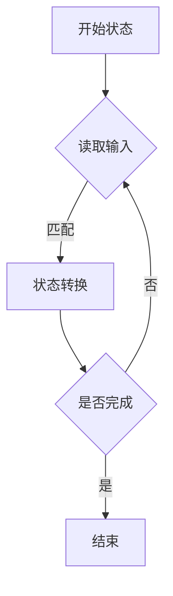
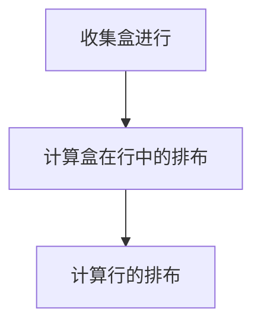
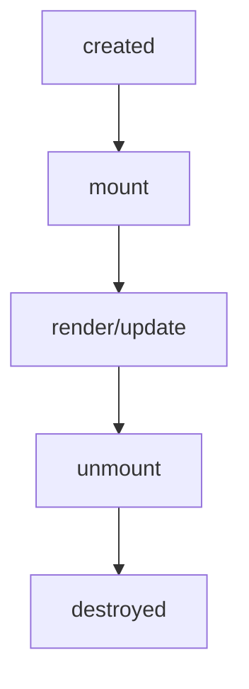

# 《前端进阶训练营》课程资料总结

## 书籍信息
- **书名**：极客大学-前端进阶训练营（系列讲义）
- **作者**：程劭非 (winter) - 前手机淘宝前端负责人
- **内容类型**：课程讲义/培训资料
- **PDF状态**：多份独立PDF文件，内容覆盖前端核心知识体系

## PDF文件清单与主题对应

| 文件编号 | 核心主题 |
|---------|---------|
| 01 | 前端进阶之路与学习方法 |
| 02 | 工程体系与职业规划 |
| 03 | 编程语言通识 |
| 04 | JavaScript 类型系统 |
| 05 | JavaScript 表达式 |
| 06 | JavaScript 语句 |
| 07 | JavaScript 对象 |
| 08 | JavaScript 结构化程序 |
| 09 | 浏览器HTTP协议 |
| 10 | 浏览器-FSM与HTML解析 |
| 11 | 浏览器-CSS计算与排版 |
| 12 | 浏览器-CSS布局与绘制 |
| 13 | CSS总论与@规则 |
| 14 | CSS选择器 |
| 15 | CSS排版 |
| 16 | CSS动画 |
| 17 | CSS渲染与颜色 |
| 18 | HTML与DOM |
| 19 | API与Range/CSSOM |
| 20 | 编程训练（TicTacToe/异步/寻路） |
| 21 | 四则运算与字符串算法 |
| 23 | 组件化基础 |
| 24 | 工具链 |
| ECMA-262(2019) | ECMAScript 2019语言规范 |
| ECMA-262 | ECMAScript 5.1规范 |

---

## 目录说明
- **目录识别情况**：多份独立PDF讲义，无统一目录，按主题分类
- **章节对应依据**：按原文件顺序整理
- **OCR修复说明**：部分PDF为扫描版，存在识别不完整情况，已标注

---

## 全书核心主题

本课程资料系统性地构建了前端工程师的完整知识体系，涵盖以下核心领域：

1. **学习方法论**：整理法与追溯法，强调建立知识体系和刻意练习
2. **编程语言基础**：从形式语言理论到JavaScript核心机制
3. **浏览器工作原理**：从HTTP协议到HTML/CSS解析、排版、绘制的完整流程
4. **CSS系统**：从语法、选择器、排版到动画与渲染
5. **JavaScript深度**：类型、表达式、语句、对象、结构化程序
6. **组件化思想**：从对象到组件的设计演进
7. **工程化实践**：工具链、职业规划与成就路径

---

## 第1部分：前端进阶之路与学习方法

### 第1份PDF：前端进阶之路

## 第1章：前端技能模型

### 1. 核心论点

本章主要回答前端工程师应该具备哪些能力的问题。作者认为：前端技能模型包含领域知识、前端知识、编程能力、架构能力、工程能力五个维度，解决问题的能力是综合体现。

### 2. 关键概念

- **领域知识**：特定业务领域的专业知识，在实践中学习
- **前端知识**：HTML/CSS/JS等基础技术栈，需建立知识体系
- **编程能力**：算法、数据结构、设计模式等基础
- **架构能力**：系统设计、模块化、组件化
- **工程能力**：构建、部署、监控、质量保障

### 3. 逻辑推演

作者提出技能分层模型：底层是通用编程能力，中间层是前端专项知识，顶层是领域知识。三个能力的提升需要不同的学习策略——编程能力通过刻意练习，前端知识通过建立体系，领域知识在实践中积累。

---

## 第2章：学习方法——整理法与追溯法

### 1. 核心论点

本章讨论如何高效学习前端技术。作者提出两种核心方法：整理法（建立知识体系）和追溯法（追溯技术源头）。

### 2. 关键概念

- **整理法**：将零散知识点系统化、结构化，形成知识网络
- **追溯法**：通过源头（论文、标准、大师言论）理解技术本质

### 3. 逻辑推演

整理法要求学习者主动梳理知识点之间的关联，建立知识图谱。追溯法要求深入技术源头——W3C标准、MDN文档、创始人的原始论文。两种方法结合，既能建立体系，又能理解本质。

### 4. 经典金句

> “前端技术不是武林秘籍，真正的能力是练出来的。”

> OOP to me means only messaging, local retention and protection and hiding of state-process, and extreme late-binding of all things. ——Alan Kay

---

## 第3章：面试官视角

### 1. 核心论点

本章从面试官角度分析面试逻辑。作者认为：好的面试题需要覆盖面和深度，面试过程中的打断、争论都有特定含义。

### 2. 关键概念

- **覆盖面**：考察知识体系的完整程度
- **深度**：考察对核心概念的理解层次
- **打断**：意味着不感兴趣或已判断，也是一种提示
- **争论**：压力面试的一种形式，考察应变能力

### 3. 题目类型

- 项目型问题
- 知识型问题
- 开放性问题
- 案例性问题
- 有趣的问题

---

### 第2份PDF：工程体系

## 第4章：职业规划

### 1. 核心论点

本章讨论前端工程师的职业发展路径。作者强调：你是自己职业的主人，职业发展的核心是打造可量化的成就。

### 2. 关键概念

- **业务型成就**：将技术转化为业务指标提升
- **工程型成就**：提升质量和效率的体系化改进
- **技术难题**：攻克公认的技术难点

### 3. 逻辑推演

三种成就路径各有不同的目标、方案与评估方式。业务型成就需理解公司核心目标，将业务指标转化为技术指标；工程型成就聚焦质量与效率；技术难题依靠扎实的编程和架构能力解决。

### 4. 案例

**应用手势案例**：
- 目标：提升点击率
- 方案：给tab组件增加手势操作
- 结果：点击率提升3倍，推广到所有导购业务

**XSS攻击预防案例**：
- 目标：减少XSS漏洞反馈
- 方案：安全手册、代码review、扫描工具
- 结果：漏洞大幅减少

---

## 第5章：前端技能模型（深化）

### 1. 核心论点

本章深化了技能模型，强调领域知识在实践中学习、前端知识通过知识体系建立、编程/架构/工程能力通过刻意练习提升。

### 2. 逻辑推演

作者明确指出训练营的三不教原则：不教追新追热点的技术、不教包装简历的技巧、不教找捷径的方法。强调真正的能力需要系统性训练和刻意练习。

---

## 第2部分：编程语言通识与JavaScript核心

### 第3份PDF：编程语言通识

## 第1章：语言按语法分类

### 1. 核心论点

本章从形式语言理论角度对编程语言进行分类。作者基于乔姆斯基谱系，将语言分为0-3型。

### 2. 关键概念

- **0型（无限制文法）**：无约束的生成规则
- **1型（上下文相关文法）**：规则依赖于上下文
- **2型（上下文无关文法）**：规则不依赖于上下文
- **3型（正则文法）**：规则受限于正则表达式

### 3. 产生式（BNF）

```bnf
<MultiplicativeExpression>::=<Number>
<MultiplicativeExpression>*<Number>
<MultiplicativeExpression>/<Number>

<AddtiveExpression>::=<MultiplicativeExpression>
<AddtiveExpression>"+"<MultiplicativeExpression>
<AddtiveExpression>"-"-<MultiplicativeExpression>
```

---

## 第2章：图灵完备性与类型系统

### 1. 核心论点

本章讨论什么是图灵完备的语言，以及类型系统的分类。

### 2. 关键概念

- **图灵完备性**：命令式（goto + if/while）或声明式（递归）均可实现
- **动态vs静态**：运行时vs编译时确定类型
- **强类型vs弱类型**：类型转换的严格程度
- **协变/逆变**：子类型关系的方向性

---

### 第4份PDF：JavaScript类型

## 第1章：JavaScript类型系统

### 1. 核心论点

本章系统讲解JavaScript的7种内置类型。作者从Number、String、Boolean、Object、Null、Undefined、Symbol逐一展开。

### 2. 关键概念

- **Number**：IEEE 754双精度浮点数（1位符号位 + 11位指数位 + 52位精度位）
- **String**：字符、码点、编码（ASCII/Unicode/UCS/GB系列/UTF）
- **Boolean**：true/false
- **Null & Undefined**：void 0可安全获取undefined

### 3. 逻辑推演

Number类型的精度限制导致0.1+0.2≠0.3，需用`Number.EPSILON`比较。字符串涉及复杂的编码体系，从ASCII到Unicode再到UTF系列。

### 4. 经典金句

> `Number.MAX_SAFE_INTEGER.toString(16)` → `"1ffffffffffff"`

> 判断浮点数相等：`Math.abs(0.1 + 0.2 - 0.3) <= Number.EPSILON`

---

### 第5份PDF：JavaScript表达式

## 第1章：表达式优先级与分类

### 1. 核心论点

本章讲解JavaScript表达式的语法优先级和运行时行为。作者将表达式分为Left Handside和Right Handside两类。

### 2. 关键概念

- **Member**：`a.b`、`a[b]`、`foo\`string\``、`super.b`、`new.target`
- **New**：`new Foo`
- **Call**：`foo()`、`super()`、`foo()['b']`
- **Update**：`a++`、`a--`、`++a`、`--a`
- **Unary**：`delete`、`void`、`typeof`、`+`、`-`、`~`、`!`、`await`

### 3. 逻辑推演

表达式优先级决定了运算顺序。Left Handside表达式可以放在赋值运算符左边，Right Handside不可以。这是理解`a.b = c`合法而`a+b = c`不合法的关键。

---

### 第6份PDF：JavaScript语句

## 第1章：Completion Record与语句分类

### 1. 核心论点

本章讲解JavaScript语句的执行模型。作者引入Completion Record作为理解语句执行结果的关键概念。

### 2. 关键概念

- **Completion Record**：`{[[type]]: normal/break/continue/return/throw, [[value]]: Types, [[target]]: label}`
- **简单语句**：ExpressionStatement、EmptyStatement、DebuggerStatement、ThrowStatement、ContinueStatement、BreakStatement、ReturnStatement
- **复合语句**：BlockStatement、IfStatement、SwitchStatement、IterationStatement、WithStatement、LabelledStatement、TryStatement

### 3. 逻辑推演

Block语句的`[[type]]`始终为normal。break和continue通过`[[target]]`字段与label关联。预处理（pre-process）影响var声明的提升行为，而const/let有暂时性死区。

### 4. 经典金句

```javascript
var a = 2;
void function(){
    a = 1;
    return;
    var a;  // 提升，但赋值被return阻止
}();
console.log(a); // 输出1
```

---

### 第7份PDF：JavaScript对象

## 第1章：对象本质与原型

### 1. 核心论点

本章讲解JavaScript中对象的本质——对象是唯一的，状态改变不影响其他对象。作者对比了基于类和基于原型的两种对象描述方式。

### 2. 关键概念

- **对象标识**：任何对象都是唯一的，与状态无关
- **归类vs分类**：多继承（C++）vs单继承（Java）
- **原型**：通过“相似”而非“分类”描述对象

### 3. 逻辑推演

JavaScript使用属性统一抽象对象状态和行为。数据属性描述状态，访问器属性描述行为。原型链实现了属性查找——当前对象没有时沿原型链向上查找。

### 4. 特殊对象

- **Array**：特殊的`[[length]]`属性
- **函数对象**：具有`[[call]]`行为
- **宿主对象**：可自定义`[[call]]`和`[[construct]]`

---

### 第8份PDF：JavaScript结构化程序

## 第1章：Realm与执行上下文

### 1. 核心论点

本章讲解JavaScript的结构化执行模型，包括Realm、执行上下文栈、词法环境等核心概念。

### 2. 关键概念

- **Realm**：JavaScript执行环境，包含宏任务、微任务、函数调用等
- **执行上下文栈**：管理嵌套的函数调用
- **LexicalEnvironment**：处理`this`、`new.target`、`super`、变量
- **VariableEnvironment**：专门处理var声明（历史遗留）

### 3. 逻辑推演

函数调用时创建新的执行上下文压入栈中。闭包的本质是函数携带的环境记录。词法环境在外，变量环境在内，var声明会提升到最近的函数作用域。

### 4. 闭包示例

```javascript
var y = 2;
function foo2(){
    var z = 3;
    return () => {
        console.log(y, z);
    }
}
var foo3 = foo2();  // foo3是闭包，携带了y和z的环境
```

---

## 第3部分：浏览器工作原理

### 第9份PDF：HTTP协议

## 第1章：HTTP请求与响应格式

### 1. 核心论点

本章讲解HTTP协议的基础格式，为后续实现简易浏览器打下基础。

### 2. HTTP请求格式

```
POST / HTTP/1.1
Host: 127.0.0.1
Content-Type: application/x-www-form-urlencoded

body内容
```

### 3. HTTP响应格式

```
HTTP/1.1 200 OK
Content-Type: text/html
Date: Mon, 23 Dec 2019 06:46:19 GMT
Connection: keep-alive
Transfer-Encoding: chunked

26
<html><body>Hello World</body></html>
26
<html><body>Hello World</body></html>
0
```

### 4. 网络模型

- **ISO-OSI七层模型**：物理层、数据链路层、网络层、传输层、会话层、表示层、应用层
- **TCP**：流、端口，Node.js中通过`require('net')`使用
- **IP**：包、IP地址

---

### 第10份PDF：有限状态机与HTML解析

## 第1章：有限状态机（FSM）

### 1. 核心论点

本章讲解有限状态机的原理及其在字符串处理和HTML解析中的应用。

### 2. 关键概念

- 每一个状态都是一个机器
- 机器是纯函数（无副作用）
- 每个机器知道下一个状态
- **Moore**：每个机器有确定的下一个状态
- **Mealy**：每个机器根据输入决定下一个状态

### 3. FSM实现模式

```javascript
// 每个函数是一个状态
function state(input) {
    // 处理逻辑
    return next;  // 返回值作为下一个状态
}

// 调用
while(input) {
    state = state(input);
}
```

### 4. 方法流程图



---

## 第2章：HTML解析器实现

### 1. 核心论点

本章逐步讲解如何使用FSM实现HTML解析，构建DOM树。

### 2. 关键步骤

| 步骤 | 内容 |
|-----|------|
| 第一步 | 拆分文件，parser单独拆到文件中 |
| 第二步 | 创建状态机，参考HTML标准 |
| 第三步 | 解析标签（开始、结束、自封闭） |
| 第四步 | 创建元素，在标签结束状态提交token |
| 第五步 | 处理属性（单引号、双引号、无引号） |
| 第六步 | 构建DOM树（使用栈） |
| 第七步 | 处理文本节点 |

### 3. DOM树构建算法

- 使用栈管理元素嵌套
- 遇到开始标签：创建元素并入栈
- 遇到结束标签：出栈
- 自封闭节点：入栈后立刻出栈
- 任何元素的父元素是它入栈前的栈顶

---

### 第11-12份PDF：浏览器CSS

## 第1章：CSS计算

### 1. 核心论点

本章讲解浏览器如何收集CSS规则并计算元素的计算后样式。

### 2. 关键步骤

- 遇到style标签时，保存CSS规则
- 使用CSS Parser分析规则
- 创建元素后立即计算CSS
- 获取父元素序列用于选择器匹配

### 3. 选择器匹配算法

- 从当前元素向外排列选择器
- 复杂选择器拆成针对单个元素的简单选择器
- 用循环匹配父元素队列

### 4. 优先级计算

- specificity是四元组 `[inline, id, class, tag]`
- 越左边权重越高
- 规则根据specificity和后来优先规则覆盖

---

## 第2章：排版（Flex）

### 1. 核心论点

本章讲解Flex布局的排版算法，包括主轴和交叉轴的计算。

### 2. 排版三步骤


### 3. 主轴计算

- 找出所有Flex元素
- 把主轴方向的剩余尺寸按比例分配给这些元素
- 若剩余空间为负数，所有flex元素为0，等比压缩剩余元素

### 4. 交叉轴计算

- 根据每一行中最大元素尺寸计算行高
- 根据行高、flex-align和item-align确定元素具体位置

---

## 第3章：绘制

### 1. 核心论点

本章讲解如何将DOM树绘制到屏幕上。

### 2. 关键点

- 绘制需要依赖图形环境（npm包images）
- 绘制在一个viewport上进行
- 相关属性：background-color、border、background-image
- 递归调用子元素的绘制方法完成DOM树绘制

---

## 第4部分：CSS深度

### 第13份PDF：CSS总论

## 第1章：CSS总体结构

### 1. 核心论点

本章从宏观角度分析CSS的语法结构。

### 2. CSS总体结构

```
@charset
@import
rules
  ├── @media
  ├── @page
  └── rule
```

### 3. @规则类型

| 规则 | 用途 |
|-----|------|
| @charset | 字符集声明 |
| @import | 导入样式表 |
| @media | 媒体查询 |
| @page | 分页媒体 |
| @counter-style | 自定义计数器样式 |
| @keyframes | 动画关键帧 |
| @fontface | 自定义字体 |
| @supports | 特性检测 |
| @namespace | 命名空间声明 |

---

### 第14份PDF：CSS选择器

## 第1章：选择器语法与优先级

### 1. 核心论点

本章系统讲解CSS选择器的语法分类和优先级计算规则。

### 2. 选择器分类

- **简单选择器**：`*`、`div`、`.cls`、`#id`、`[attr=value]`、`:hover`、`::before`
- **复合选择器**：多个简单选择器连写
- **复杂选择器**：使用空格、`>`、`+`、`~`连接

### 3. 优先级计算

```
div.a#id { ... }
// specificity = [0,1,1,1]
// S = 0×N³ + 1×N² + 1×N¹ + 1
// 取N=1000000，S=1000001000001
```

### 4. 伪类分类

| 类别 | 伪类 |
|-----|------|
| 链接/行为 | `:link`、`:visited`、`:hover`、`:active`、`:focus` |
| 树结构 | `:empty`、`:nth-child()`、`:first-child` |
| 逻辑型 | `:not`、`:where`、`:has` |

### 5. 伪元素

- `::before` / `::after`
- `::first-line` / `::first-letter`

---

### 第15份PDF：CSS排版

## 第1章：盒模型与正常流

### 1. 核心论点

本章讲解CSS的核心排版概念——盒模型和正常流。

### 2. 关键概念

- **Tag → Element → Box**：HTML代码中的标签对应DOM元素，CSS选择器选中元素，排版时产生多个盒
- **盒模型**：content-box（width=内容宽度）vs border-box（width=内容+padding+border）

### 3. 正常流排版



---

### 第16份PDF：CSS动画

## 第1章：Animation与Transition

### 1. 核心论点

本章讲解CSS动画的实现方式，包括keyframes定义和transition过渡。

### 2. 关键概念

**Animation**：
```css
@keyframes mykf {
    from { background: red; }
    to { background: yellow; }
}
div {
    animation: mykf 5s infinite;
}
```

**动画属性**：
- animation-name：时间曲线
- animation-duration：动画时长
- animation-timing-function：时间曲线
- animation-delay：延迟
- animation-iteration-count：播放次数

### 3. cubic-bezier

贝塞尔曲线用于定义动画的缓动效果，是animation-timing-function的核心。

---

### 第17份PDF：CSS渲染与颜色

## 第1章：颜色与形状

### 1. 核心论点

本章讲解CSS中的颜色模型和形状绘制。

### 2. 颜色模型

- **CMYK**：青、品红、黄、黑（印刷用）
- **RGB**：红、绿、蓝（屏幕用）

### 3. 形状绘制

- `border`、`box-shadow`、`border-radius`
- `data:image/svg+xml,<svg>...</svg>`（Data URI + SVG）

---

## 第5部分：HTML与DOM

### 第18份PDF：HTML与DOM

## 第1章：HTML定义与语法

### 1. 核心论点

本章讲解HTML作为XML与SGML的关系，以及HTML标签的语义化。

### 2. 合法元素类型

- **Element**：`<tagname>...</tagname>`
- **Text**：text
- **Comment**：`<!-- comments -->`
- **DocumentType**：`<!Doctype html>`
- **ProcessingInstruction**：`<?a 1?>`
- **CDATA**：`<![CDATA[]]>`

### 3. 字符引用

| 实体 | 字符 |
|-----|------|
| `&#161;` | ¡ |
| `&amp;` | & |
| `&lt;` | < |
| `&quot;` | " |

---

## 第2章：DOM操作

### 1. 导航类操作

- `parentNode`、`childNodes`
- `firstChild`、`lastChild`
- `nextSibling`、`previousSibling`

### 2. 修改操作

- `appendChild`、`insertBefore`
- `removeChild`、`replaceChild`

### 3. 高级操作

- `compareDocumentPosition`：比较节点关系
- `contains`：检查包含关系
- `isEqualNode` / `isSameNode`：节点相等性
- `cloneNode`：深/浅拷贝

### 4. 事件模型

- 冒泡与捕获是事件传播的两个阶段

---

## 第6部分：API与编程训练

### 第19份PDF：API

## 第1章：Range API

### 1. 核心论点

本章讲解Range API，用于操作文档片段和选区。

### 2. 核心方法

```javascript
var range = new Range();
range.setStart(element, 9);
range.setEnd(element, 4);
var fragment = range.extractContents();
range.insertNode(document.createTextNode("aaaa"));
```

---

## 第2章：CSSOM

### 1. 核心论点

本章讲解CSS对象模型，用于动态操作样式表。

### 2. 核心方法

```javascript
document.styleSheets[0].cssRules
document.styleSheets[0].insertRule("p { color:pink; }", 0)
window.getComputedStyle(elt, pseudoElt);
```

### 3. Rule类型

- CSSStyleRule、CSSMediaRule、CSSKeyframesRule等

---

### 第20份PDF：编程训练

## 第1章：TicTacToe（井字棋）

### 1. 核心论点

本章通过井字棋游戏讲解博弈策略和AI实现。

### 2. 规则

- 棋盘：3x3方格
- 双方分别持有圆圈和叉
- 率先连成三子直线的一方获胜

### 3. 策略层次

- 第一层：我要赢
- 第二层：别输
- 第三层：……（棋谱/递归）

### 4. 实现要点

- 棋盘表示：二维数组
- 策略实现：基于对象的抽象、递归、复制局面

---

## 第2章：异步编程——红绿灯问题

### 1. 核心论点

本章通过红绿灯问题讲解JavaScript异步编程的三种方式。

### 2. 问题描述

一个路口的红绿灯，绿灯亮10秒，黄灯亮2秒，红灯亮5秒的顺序无限循环。

### 3. 异步机制

- **callback**：回调函数
- **Promise**：链式调用
- **async/await**：同步写法

---

## 第3章：寻路问题

### 1. 核心论点

本章讲解地图寻路算法（如A*）的基本思路。

---

## 第4章：正则表达式

### 1. 核心API

- `match`：匹配提取
- `replace`：替换
- `exec` + `lastIndex`：逐次匹配

```javascript
let lastIndex = 0;
let token;
do {
    token = inputElement.exec(source);
    console.log(token);
} while(inputElement.lastIndex - lastIndex == token.length)
```

---

### 第21份PDF：字符串算法

## 第1章：四则运算与AST

### 1. 核心论点

本章讲解使用LL算法构建抽象语法树（AST）来解析四则运算表达式。

### 2. 词法定义

- **TokenNumber**：数字组合
- **Operator**：`+`、`-`、`*`、`/`
- **Whitespace**：空格
- **LineTerminator**：换行符

### 3. 语法规则

```
<Expression> ::= <AdditiveExpression><EOF>
<AdditiveExpression> ::= <MultiplicativeExpression>
    | <AdditiveExpression><+><MultiplicativeExpression>
    | <AdditiveExpression><-><MultiplicativeExpression>
<MultiplicativeExpression> ::= <Number>
    | <MultiplicativeExpression><*><Number>
    | <MultiplicativeExpression></><Number>
```

---

## 第2章：字符串算法

### 1. 模式匹配算法

| 算法 | 用途 |
|-----|------|
| 字典树 | 大量字符串的完整模式匹配 |
| KMP | 长字符串中找子串 |
| Wildcard | 通配符匹配 |
| 正则表达式 | 字符串通用模式匹配 |
| 状态机 | 通用的字符串分析 |

---

## 第7部分：组件化与工程化

### 第23份PDF：组件化基础

## 第1章：对象与组件

### 1. 核心论点

本章讲解从对象到组件的演化，组件是更完整的功能单元。

### 2. 对比：对象 vs 组件

| 对象 | 组件 |
|-----|------|
| Properties | Properties |
| Methods | Methods |
| Inherit | Inherit |
| — | Attribute |
| — | Config & State |
| — | Event |
| — | Lifecycle |
| — | Children |

### 3. Attribute vs Property

- **Attribute**：强调描述性，HTML中的写法
- **Property**：强调从属关系，JS中的属性

```javascript
// Attribute
div.getAttribute('a');
div.setAttribute('a', 'value');

// Property
div.a = "value";
```

### 4. 特殊案例

- `class`属性与`className`属性
- `style`属性返回对象
- `href`属性自动解析URL
- `input`的`value`属性与property的优先级关系

### 5. 生命周期



---

### 第24份PDF：工具链

## 第1章：开发工具链

### 1. 核心论点

本章讲解前端工程化中完整的开发工具链。

### 2. 工具链组成

**Server端**：
- build：webpack、babel、vue、jsx、postcss
- watch：fsevent
- mock
- http：ws

**Client端**：
- debugger：vscode、devtool
- source map

---

## 第8部分：ECMAScript规范（附录）

### 第ECMA-262(2019)份：规范结构

## 核心内容概览

ECMAScript 2019规范是JavaScript语言的官方标准文档，主要内容包括：

### 1. 语言类型

- Undefined、Null、Boolean、String、Symbol、Number、Object

### 2. 抽象操作

- ToPrimitive、ToBoolean、ToNumber、ToString、ToObject
- 比较操作：SameValue、SameValueZero、抽象关系比较、抽象相等比较

### 3. 执行模型

- 词法环境、环境记录
- 执行上下文、Realm、Agent
- 作业与作业队列

### 4. 语言语法

- 词法语法、正则表达式语法
- 表达式、语句、声明
- 函数定义、箭头函数、类定义

### 5. 标准内置对象

- Object、Function、Array、String、Boolean、Number、Math、Date、RegExp、Error
- Promise、Proxy、Reflect
- TypedArray、Map、Set、WeakMap、WeakSet

### 6. 内存模型

- SharedArrayBuffer、Atomics
- 数据竞争与顺序一致性

---

## 全课程总结

本训练营课程构建了从编程语言通识到具体实现的完整知识体系：

1. **理论基础**：形式语言、乔姆斯基谱系、图灵完备性
2. **JavaScript核心**：类型、表达式、语句、对象、执行模型
3. **浏览器原理**：HTTP、HTML解析、CSS计算、排版、绘制
4. **CSS系统**：选择器、盒模型、Flex、动画
5. **实践训练**：井字棋、红绿灯、寻路、正则表达式
6. **工程思维**：组件化、工具链、职业规划

核心方法论是建立知识体系（整理法）+ 追溯技术源头（追溯法）+ 刻意练习。