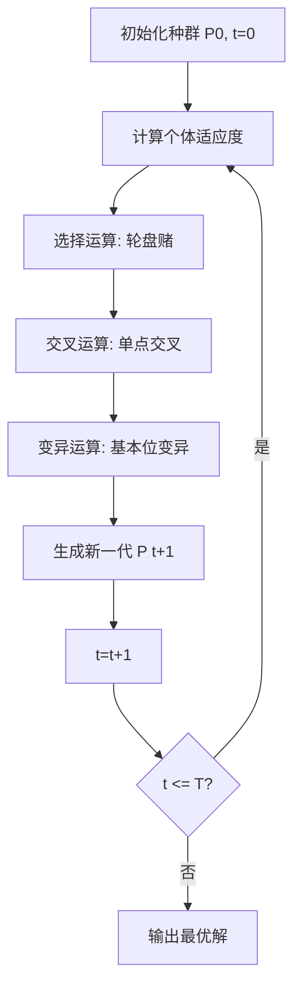
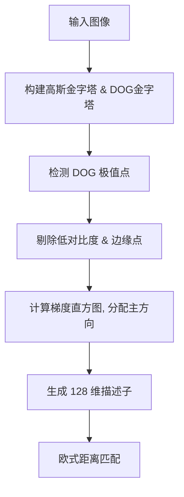

# 《十五个经典算法研究与总结》章节总结

## 书籍信息
- **书名**：十五个经典算法研究与总结
- **作者**：July (周磊)
- **整理/制作**：花明月暗 & 有鱼网 CEO 吴超
- **PDF 状态**：文本提取完整，包含代码片段与图表描述。
- **OCR 状态**：良好，部分代码格式需人工规范化，图表已转化为 Mermaid 或文字描述。

## 目录说明
- **目录识别情况**：文档包含明确的“十五个经典算法研究集锦+目录”，共15个主要算法主题，部分主题包含续集文章，总计31篇文章内容。
- **章节对应依据**：严格按照文档中的“一”至“十五”编号进行章节划分。
- **OCR 修复说明**：代码块中的乱码（如 `\|`）已清理，伪代码已转换为标准 Markdown 代码块。

## 全书核心主题
本书是作者 July 在 2010-2011 年间撰写的经典算法研究系列文章的合集。旨在深入剖析计算机科学与面试中常见的15个基础且核心的算法。内容涵盖搜索算法（A*、Dijkstra、BFS/DFS）、数据结构（红黑树、Hash表）、字符串处理（KMP、BM）、排序与选择（快速排序、快速选择）、动态规划、以及高级数学与图像处理算法（傅里叶变换、SIFT）。

作者不仅提供了算法的理论推导和复杂度分析，还着重于 C/C++ 代码的具体实现与优化（如斐波那契堆优化 Dijkstra、暴雪 Hash 算法、SIFT 的 C 语言实现）。本书特色在于“透彻理解”，通过图解、步骤分解、多版本对比（如快速排序的不同 Partition 实现）以及面试题结合（如 Top K 问题），帮助读者从原理到工程落地全面掌握算法。其核心思想是：算法学习不应止于记忆，而应理解其设计初衷、演变过程及底层数学逻辑。

---

## 前言

### 核心论点
本章介绍了本系列文章的创作背景、范围及作者的学习理念。
作者强调算法学习源于兴趣，并指出本系列涵盖了从基础搜索到高级图像处理的15个经典算法，旨在提供理论与编程实现的双重指导。

### 关键概念/事件
- **创作历程**：2010年12月至2011年12月，历时一年。
- **覆盖范围**：A*, Dijkstra, DP, BFS/DFS, 红黑树, KMP, 遗传算法, 启发式搜索, SIFT, 傅里叶变换, Hash, 快速排序, SPFA, SELECT, 多项式乘法。
- **学习理念**：兴趣驱动；没有兴趣的东西不会占用时间。

### 逻辑推演/叙事脉络
作者首先回顾了博客开博以来的写作历程，从整理面试题到深入研究经典算法。接着列出了已完成的15个算法系列的目录索引，说明了每个算法系列的文章数量及侧重点（如红黑树写了6篇，SIFT写了5篇）。最后，作者回应了读者关于“如何学算法”的疑问，提出“兴趣”是唯一动力，并声明版权。

### 经典金句/数据
> “兴趣。没有兴趣的东西一般不会占用我的时间。”

---

## 第一章：A*搜索算法

### 核心论点
本章解决了在图形平面上寻找最低成本路径的问题。
作者认为 A* 算法是一种高效的启发式搜索算法，其核心在于估值函数 $f(n)=g(n)+h(n)$ 的设计，其中 $h(n)$ 必须满足可采纳性（$h(n) \le h^*(n)$）才能保证找到最优解。

### 关键概念/事件
- **启发式搜索**：利用估价函数选择下一步节点，优于盲目搜索（BFS/DFS）。
- **估值函数 f(n)**：$f(n) = g(n) + h(n)$。$g(n)$ 为起点到当前点的实际代价，$h(n)$ 为当前点到终点的估计代价。
- **可采纳性 (Admissibility)**：$h(n)$ 必须小于等于实际最小代价 $h^*(n)$。
- **OPEN/CLOSE 表**：OPEN 表存储待评估节点（优先队列），CLOSE 表存储已评估节点。

### 逻辑推演/叙事脉络
文章首先对比了 DFS/BFS（盲目搜索）与启发式搜索的区别。随后引入 A* 算法，详细解释了 $f(n)$ 的构成及 $h(n)$ 设计的重要性。通过伪代码展示了 A* 的流程：初始化 OPEN/CLOSE 表，循环从 OPEN 取 $f$ 值最小节点，若为目标则结束，否则扩展邻居并更新 $g, h, f$ 值。最后分析了 A* 与 Dijkstra、BFS 的关系（当 $h(n)=0$ 时退化为 Dijkstra/BFS），并讨论了时间复杂度。

### 方法流程图

```mermaid
graph TD
    Start[开始] --> Init[初始化: OPEN={Start}, CLOSE={}]
    Init --> CheckOpen{OPEN为空?}
    CheckOpen -- 是 --> Fail[失败: 无解]
    CheckOpen -- 否 --> GetMin[从OPEN取f值最小节点n]
    GetMin --> IsGoal{n是目标?}
    IsGoal -- 是 --> Success[成功: 重构路径]
    IsGoal -- 否 --> MoveClose[n移入CLOSE]
    MoveClose --> Expand[扩展n的邻居y]
    Expand --> InClose{y在CLOSE中?}
    InClose -- 是 --> NextNeighbor[下一个邻居]
    InClose -- 否 --> CalcG[计算tentative_g_score]
    CalcG --> InOpen{y在OPEN中?}
    InOpen -- 否 --> AddOpen[加入OPEN, 记录父节点]
    InOpen -- 是 --> BetterG{新g值更小?}
    BetterG -- 是 --> Update[更新g值, 父节点, f值]
    BetterG -- 否 --> NextNeighbor
    AddOpen --> NextNeighbor
    Update --> NextNeighbor
    NextNeighbor --> MoreNeighbors{还有邻居?}
    MoreNeighbors -- 是 --> Expand
    MoreNeighbors -- 否 --> CheckOpen
```

### 经典金句/数据
> “A*算法最为核心的部分，就在于它的一个估值函数的设计上：f(n)=g(n)+h(n)。”
> “当此四个条件都满足时...一个具有 f(n)=g(n)+h(n)策略的启发式算法能成为 A*算法，并一定能找到最优解。”

---

## 第二章：Dijkstra算法

### 核心论点
本章解决了单源最短路径问题。
作者指出 Dijkstra 算法使用贪心策略，通过不断选取未访问集合中距离源点最近的节点进行松弛操作，从而计算出源点到所有其他节点的最短路径。

### 关键概念/事件
- **松弛技术 (Relaxation)**：如果经过节点 $u$ 到达 $v$ 的距离比已知距离短，则更新 $v$ 的距离和前驱。
- **优先队列优化**：使用二叉堆或斐波那契堆优化 Extract-Min 操作，降低时间复杂度。
- **时间复杂度**：数组实现 $O(V^2)$，二叉堆 $O(E \log V)$，斐波那契堆 $O(V \log V + E)$。

### 逻辑推演/叙事脉络
文章首先定义单源最短路径问题，介绍 Dijkstra 的基本思想。接着给出了基于维基百科和《算法导论》的伪代码。重点分析了不同数据结构对算法效率的影响，特别是引入了斐波那契堆的实现细节，包括 Insert, Extract-Min, Decrease-Key 的操作及其平摊复杂度。最后通过图文解析演示了算法执行步骤，并对比了 Bellman-Ford 算法（处理负权边）。

### 方法流程图

```mermaid
graph TD
    Init[初始化: d[s]=0, 其他无穷, Q=所有顶点] --> Loop{Q为空?}
    Loop -- 是 --> End[结束]
    Loop -- 否 --> ExtractU[Extract-Min Q -> u]
    ExtractU --> AddS[u加入集合S]
    AddS --> AdjLoop[遍历u的邻接点v]
    AdjLoop --> Relax{d[v] > d[u] + w(u,v)?}
    Relax -- 是 --> Update[d[v] = d[u] + w<u,v>; prev[v]=u; Decrease-Key]
    Relax -- 否 --> NextV[下一个邻接点]
    Update --> NextV
    NextV --> MoreAdj{还有邻接点?}
    MoreAdj -- 是 --> AdjLoop
    MoreAdj -- 否 --> Loop
```

### 经典金句/数据
> “Dijkstra算法总是 在 V-S中选择‘最轻’或‘最近’的顶点插入到集合 S中，所以我们说它使用了贪心策略。”
> “采用斐波那契堆实现最小优先队列的话...算法时间复杂度为 O(V*lgV+ E)。”

---

## 第三章：动态规划算法

### 核心论点
本章解决了具有最优子结构和重叠子问题性质的最优化问题，以最长公共子序列（LCS）为例。
作者认为动态规划通过自底向上计算并存储子问题解，避免了递归中的重复计算，从而将指数级复杂度降低为多项式级。

### 关键概念/事件
- **最优子结构**：问题的最优解包含子问题的最优解。
- **重叠子问题**：递归过程中子问题被重复计算。
- **LCS 状态转移方程**：
  - 若 $x_i = y_j$, $c[i,j] = c[i-1,j-1] + 1$
  - 若 $x_i \neq y_j$, $c[i,j] = \max(c[i-1,j], c[i,j-1])$

### 逻辑推演/叙事脉络
文章首先定义动态规划的四个步骤及两个要素（最优子结构、重叠子问题）。随后以 LCS 问题为例，推导递归结构，指出直接递归的低效性。接着提出自底向上的动态规划解法，构建二维数组 $c[i,j]$ 存储长度，$b[i,j]$ 存储方向。最后给出了构造 LCS 的递归打印算法，并讨论了空间优化（只需两行或一维数组）及时间复杂度 $O(mn)$。

### 经典金句/数据
> “动态规划算法正是利用了这种子问题的重叠性质，对每一个子问题只计算一次，然后将其计算结果保存在一个表格中...”
> “LCS(X, Y)的长度为：max{LCS(Xm-1, Y)的长度, LCS(X, Yn-1)的长度}。”

---

## 第四章：BFS和DFS优先搜索算法

### 核心论点
本章解决了图的遍历问题。
作者指出 BFS 使用队列实现层级遍历，适合求无权图最短路径；DFS 使用栈（或递归）实现深度遍历，适合拓扑排序、连通分量检测等。

### 关键概念/事件
- **BFS (广度优先搜索)**：使用队列 (Queue)，逐层扩展，时间复杂度 $O(V+E)$。
- **DFS (深度优先搜索)**：使用栈 (Stack) 或递归，一条路走到黑，时间复杂度 $O(V+E)$。
- **颜色标记**：White (未访问), Gray (正在访问), Black (已完成)。

### 逻辑推演/叙事脉络
文章分别给出了 BFS 和 DFS 的《算法导论》伪代码。BFS 部分强调了队列的使用和距离 $d[u]$ 的更新。DFS 部分强调了递归实现及发现时间 $d[u]$ 和完成时间 $f[u]$ 的记录。最后探讨了 DFS 的非递归实现，提出使用“栈中存放队列”的特殊结构来模拟递归回溯过程，以处理图的复杂连接关系。

### 方法流程图

```mermaid
graph TD
    subgraph BFS
    B_Start[开始] --> B_Enqueue[起点入队, 标记Gray]
    B_Enqueue --> B_Loop{队列空?}
    B_Loop -- 否 --> B_Dequeue[出队u]
    B_Dequeue --> B_Neighbors[遍历u的邻居v]
    B_Neighbors --> B_White{v是White?}
    B_White -- 是 --> B_Process[v标记Gray, d[v]=d[u]+1, 入队]
    B_White -- 否 --> B_Next
    B_Process --> B_Next[下一个邻居]
    B_Next --> B_More{还有邻居?}
    B_More -- 是 --> B_Neighbors
    B_More -- 否 --> B_MarkBlack[u标记Black]
    B_MarkBlack --> B_Loop
    end

    subgraph DFS
    D_Start[开始] --> D_LoopV[遍历所有顶点v]
    D_LoopV --> D_White{v是White?}
    D_White -- 是 --> D_Visit[DFS-VISIT v]
    D_White -- 否 --> D_NextV
    D_Visit --> D_MarkGray[v标记Gray, 记录d[v]]
    D_MarkGray --> D_Neighbors[遍历v的邻居w]
    D_Neighbors --> D_WWhite{w是White?}
    D_WWhite -- 是 --> D_Recurse[递归 DFS-VISIT w]
    D_WWhite -- 否 --> D_NextW
    D_Recurse --> D_NextW
    D_NextW --> D_MoreW{还有邻居?}
    D_MoreW -- 是 --> D_Neighbors
    D_MoreW -- 否 --> D_MarkBlack[v标记Black, 记录f[v]]
    D_MarkBlack --> D_NextV
    end
```

### 经典金句/数据
> “BFS首先让你想到‘队列’；而 DFS... OPEN表是一个栈！”
> “DFS用到了栈，所以有一个很好的实现方法，那就是递归。”

---

## 第五章：教你透彻了解红黑树

### 核心论点
本章解决了二叉搜索树在最坏情况下退化为链表的问题。
作者认为红黑树通过着色和旋转规则，确保树大致平衡，保证查找、插入、删除操作在最坏情况下仍为 $O(\log n)$。

### 关键概念/事件
- **红黑树性质**：
  1. 节点非红即黑。
  2. 根节点黑。
  3. 叶节点（NIL）黑。
  4. 红节点的子节点必黑。
  5. 任意节点到其叶子节点的所有路径包含相同数量的黑节点。
- **旋转**：左旋和右旋，用于调整结构。
- **插入修复**：主要处理叔叔节点为红（变色）或黑（旋转+变色）的情况。
- **删除修复**：主要处理兄弟节点为红、黑且子节点颜色不同的四种情况。

### 逻辑推演/叙事脉络
文章首先介绍红黑树的五条性质及二叉搜索树的基础。接着详解左旋和右旋操作。重点剖析插入操作：先按 BST 插入并染红，然后通过 `RB-INSERT-FIXUP` 处理双红冲突，分三种情况（叔叔红、叔叔黑且当前为右子、叔叔黑且当前为左子）。随后剖析删除操作：先按 BST 删除，若删除的是黑节点则调用 `RB-DELETE-FIXUP`，分四种情况调整（兄弟红、兄弟黑且子全黑、兄弟黑且左红右黑、兄弟黑且右红）。全程配合图示和伪代码。

### 方法流程图

```mermaid
graph TD
    subgraph InsertFixup
    I_Start[插入节点z, 染红] --> I_Loop{父节点p[z]是红色?}
    I_Loop -- 否 --> I_End[根染黑, 结束]
    I_Loop -- 是 --> I_Uncle{叔叔y是红色?}
    I_Uncle -- 是 --> Case1[Case1: p[z]黑, y黑, p[p[z]]红, z=p[p[z]]]
    Case1 --> I_Loop
    I_Uncle -- 否 --> I_Right{z是右孩子?}
    I_Right -- 是 --> Case2[Case2: 左旋p[z], z=p[z]]
    Case2 --> Case3
    I_Right -- 否 --> Case3[Case3: p[z]黑, p[p[z]]红, 右旋p[p[z]]]
    Case3 --> I_End
    end

    subgraph DeleteFixup
    D_Start[删除节点后, x指向替代节点] --> D_Loop{x非根 且 x是黑色?}
    D_Loop -- 否 --> D_End[x染黑, 结束]
    D_Loop -- 是 --> D_Sibling{w是x的兄弟}
    D_Sibling --> D_WRed{w是红色?}
    D_WRed -- 是 --> D_Case1[Case1: w黑, p[x]红, 左旋p[x], 更新w]
    D_Case1 --> D_CheckChildren
    D_WRed -- 否 --> D_CheckChildren
    D_CheckChildren --> D_BlackChildren{w的左右孩子都是黑色?}
    D_BlackChildren -- 是 --> D_Case2[Case2: w红, x=p[x]]
    D_Case2 --> D_Loop
    D_BlackChildren -- 否 --> D_RightBlack{w的右孩子是黑色?}
    D_RightBlack -- 是 --> D_Case3[Case3: w左孩子黑, 右孩子红 -> w红, 左孩子黑, 右旋w, 更新w]
    D_Case3 --> D_Case4
    D_RightBlack -- 否 --> D_Case4[Case4: w色=p[x]色, p[x]黑, w右孩子黑, 左旋p[x], x=root]
    D_Case4 --> D_End
    end
```

### 经典金句/数据
> “红黑树，能保证在最坏情况下，基本的动态几何操作的时间均为 O（lgn）。”
> “抓住红黑树的那 5个性质，事情就好办多了。”

---

## 第六章：教你初步了解 KMP算法

### 核心论点
本章解决了字符串匹配中主串指针回溯导致的效率低下问题。
作者认为 KMP 算法通过预处理模式串生成 next 数组，利用已匹配部分的信息，使主串指针不回溯，将匹配时间复杂度降为 $O(n+m)$。

### 关键概念/事件
- **Next 数组**：记录模式串前缀和后缀的最长公共元素长度。
- **部分匹配表**：失配时，模式串向右移动位数 = 已匹配字符数 - 对应的部分匹配值。
- **Next 数组优化**：避免 $P[j] = P[next[j]]$ 导致的无效比较。

### 逻辑推演/叙事脉络
文章从暴力匹配（BF）的低效入手，指出其主串指针回溯的问题。引入 KMP 算法，核心在于求解 next 数组。详细推导了 next 数组的定义（最长相等前后缀长度），并给出了递归求解 next 数组的代码。接着指出了原始 next 数组的缺陷（当 $P[j] == P[k]$ 时，下一步比较必然失败），提出了优化后的 `nextval` 数组求解方法。最后给出了 KMP 匹配的主流程代码，并简要提及了 BM 算法和 Sunday 算法作为对比。

### 方法流程图

```mermaid
graph TD
    subgraph GetNextVal
    GN_Start[i=0, j=-1, nextval[0]=-1] --> GN_Loop{i < plen-1?}
    GN_Loop -- 否 --> GN_End[结束]
    GN_Loop -- 是 --> GN_Cond{j==-1 或 P[i]==P[j]?}
    GN_Cond -- 是 --> GN_Inc[++i, ++j]
    GN_Inc --> GN_Check{P[i] != P[j]?}
    GN_Check -- 是 --> GN_Set[nextval[i]=j]
    GN_Check -- 否 --> GN_SetOpt[nextval[i]=nextval[j]]
    GN_Set --> GN_Loop
    GN_SetOpt --> GN_Loop
    GN_Cond -- 否 --> GN_Back[j=nextval[j]]
    GN_Back --> GN_Loop
    end

    subgraph KMPMatch
    KM_Start[i=0, j=0] --> KM_Loop{i < slen 且 j < plen?}
    KM_Loop -- 否 --> KM_Check{j == plen?}
    KM_Check -- 是 --> KM_Found[返回 i-j]
    KM_Check -- 否 --> KM_NotFound[返回 -1]
    KM_Loop -- 是 --> KM_Match{j==-1 或 S[i]==P[j]?}
    KM_Match -- 是 --> KM_Inc[++i, ++j]
    KM_Match -- 否 --> KM_Shift[j=nextval[j]]
    KM_Inc --> KM_Loop
    KM_Shift --> KM_Loop
    end
```

### 经典金句/数据
> “KMP算法的关键之处就在于怎么求这个值拉，即匹配失效后下一次匹配的位置。”
> “不能让 P[j]=P[next[j]]成立...若再拿 P[next[j]]去与 S匹配则必败。”

---

## 第七章：遗传算法初探

### 核心论点
本章解决了复杂组合优化问题的全局搜索问题。
作者认为遗传算法模拟生物进化过程，通过选择、交叉、变异操作，使种群向适应度更高的方向进化，从而找到近似最优解。

### 关键概念/事件
- **编码**：将解空间映射为染色体（如二进制串）。
- **适应度函数**：评价个体优劣的标准。
- **遗传算子**：
  - **选择**：轮盘赌选择，适应度高者概率大。
  - **交叉**：单点交叉，交换基因片段。
  - **变异**：随机改变基因位，保持多样性。

### 逻辑推演/叙事脉络
文章介绍了遗传算法（GA）的基本概念和生物学背景。给出了 GA 的基本流程图：初始化种群 -> 计算适应度 -> 选择 -> 交叉 -> 变异 -> 新一代种群。详细解释了轮盘赌选择法的概率计算，单点交叉的操作，以及基本位变异。最后通过一个求 $y=x^2$ 最大值的简单例子，演示了从初始种群到产生最优解的几代进化过程。

### 方法流程图



### 经典金句/数据
> “遗传算法本质上是对染色体模式所进行的一系列运算...模式逐步向较好的方向进化，最终得到问题的最优解。”

---

## 第八章：再谈启发式搜索算法

### 核心论点
本章深化了对启发式搜索的理解，特别是 A* 算法的理论基础。
作者认为启发式搜索通过评估函数 $\hat{f}(n)$ 引导搜索方向，A* 算法在 $\hat{h}(n) \le h^*(n)$ 时能保证找到最优解，且效率高于盲目搜索。

### 关键概念/事件
- **通用图搜索算法 (GRAPHSEARCH)**：维护 OPEN 和 CLOSE 表，根据评估函数重排 OPEN 表。
- **A* 算法条件**：$\hat{f}(n) = \hat{g}(n) + \hat{h}(n)$，且 $\hat{h}(n)$ 可采纳。
- **分叉率 (Branching Factor)**：启发式函数能降低有效分叉率，提高搜索效率。

### 逻辑推演/叙事脉络
文章回顾了启发式搜索的定义，提出了通用的 GRAPHSEARCH 框架，指出 BFS、DFS、A* 都是该框架的特例（区别在于 OPEN 表的排序策略）。重点讨论了 A* 算法中评估函数的设计，以及 $\hat{h}(n)$ 的可采纳性对最优解的保证。最后探讨了启发式算法对运算效能的影响，指出好的启发式函数能显著降低搜索树的分叉率。

### 经典金句/数据
> “启发式借由使用某种切割机制降低了分叉率(branching factor)以改进搜寻效率。”

---

## 第九章：图像特征提取与匹配之 SIFT算法

### 核心论点
本章解决了图像在不同尺度、旋转、光照变化下的特征匹配问题。
作者认为 SIFT 算法通过构建高斯差分金字塔检测极值点，分配主方向，并生成 128 维描述子，实现了具有尺度、旋转不变性的局部特征描述。

### 关键概念/事件
- **尺度空间**：使用不同 $\sigma$ 的高斯核卷积图像。
- **DOG (Difference of Gaussian)**：相邻尺度高斯图像相减，用于检测极值点。
- **关键点定位**：剔除低对比度和边缘响应点。
- **方向分配**：基于梯度直方图确定主方向，实现旋转不变性。
- **描述子生成**：16x16 邻域分为 4x4 个子块，每个子块 8 个方向直方图，共 128 维。

### 逻辑推演/叙事脉络
文章首先介绍了 SIFT 的五个步骤。第一步构建高斯金字塔和 DOG 金字塔。第二步在 DOG 空间中检测极值点（与周围 26 个点比较）。第三步精确定位关键点（拟合三维二次函数）并剔除边缘点（Hessian 矩阵）。第四步计算关键点邻域梯度直方图，确定主方向。第五步生成描述子，将坐标轴旋转至主方向，统计 4x4 子块的梯度直方图。最后提到了 SIFT 在目标识别（Bag-of-words 模型）中的应用。

### 方法流程图



### 经典金句/数据
> “SIFT算法就是用不同尺度（标准差）的高斯函数对图像进行平滑，然后比较平滑后图像的差别，差别大的像素就是特征明显的点。”
> “对于一个关键点就可以产生 128个数据，即最终形成 128维的 SIFT特征向量。”

---

## 第十章：从头到尾彻底理解傅里叶变换算法

### 核心论点
本章解决了信号从时域到频域的转换及快速计算问题。
作者认为傅里叶变换将信号分解为正余弦波的叠加，而快速傅里叶变换（FFT）利用单位复根的对称性和周期性，将 DFT 的计算复杂度从 $O(N^2)$ 降低到 $O(N \log N)$。

### 关键概念/事件
- **DFT (离散傅里叶变换)**：将时域离散信号转换为频域离散信号。
- **复数表示**：利用欧拉公式 $e^{jx} = \cos x + j \sin x$ 简化运算。
- **FFT 分治策略**：将 N 点 DFT 分解为两个 N/2 点 DFT（偶数项和奇数项）。
- **蝶形运算**：FFT 的基本计算单元，利用旋转因子合并子结果。

### 逻辑推演/叙事脉络
文章先从实数形式的 DFT 入手，解释频谱密度和逆变换。随后引入复数，利用欧拉公式将正余弦表示为复指数形式，导出复数形式的 DFT 公式。重点讲解 FFT 的原理：利用 $W_N^{k+N/2} = -W_N^k$ 等对称性，将长序列 DFT 分解为短序列 DFT。通过蝶形图示解释了基-2 FFT 的计算流程，并给出了 C++ 实现代码。

### 方法流程图

```mermaid
graph TD
    FFT_Start[N点序列 x[n]] --> Split{N > 1?}
    Split -- 否 --> Return[返回 x[0]]
    Split -- 是 --> Divide[分为偶数序列 x_even 和奇数序列 x_odd]
    Divide --> RecurseEven[FFT x_even, N/2]
    Divide --> RecurseOdd[FFT x_odd, N/2]
    RecurseEven --> Combine[蝶形运算合并]
    RecurseOdd --> Combine
    Combine --> Result[Y[k] = E[k] + W_N^k * O[k]; Y[k+N/2] = E[k] - W_N^k * O[k]]
```

### 经典金句/数据
> “傅里叶变换原来就是一种变换而已，只是这种变换是从时间转换为频率的变化。”
> “快速傅里叶变换（FFT）可以将复杂度改进为 O（n*lgn）。”

---

## 第十一章：从头到尾彻底解析 Hash表算法

### 核心论点
本章解决了海量数据下的快速查找、统计及 Top K 问题。
作者认为 Hash 表通过散列函数实现 $O(1)$ 平均查找时间，结合暴雪 Hash 算法（多 Hash 值校验）可有效解决冲突，适用于海量数据处理。

### 关键概念/事件
- **Hash 冲突解决**：拉链法（链表）、开地址法（线性探测）。
- **Top K 问题**：Hash 统计频次 + 小根堆维护 Top K。
- **暴雪 Hash 算法**：使用三个 Hash 值（一个索引，两个校验），极大降低冲突概率。
- **倒排索引**：搜索引擎核心，关键词到文档 ID 的映射。

### 逻辑推演/叙事脉络
文章首先通过百度面试题（统计最热门 Query）引入 Hash 表和堆的应用。详细讲解了 Hash 表的基本原理及冲突解决方法。重点介绍了暴雪娱乐在 MPQ 文件中使用的 Hash 算法：生成 cryptTable，计算三个 Hash 值，利用两个校验值避免字符串比较，提高查找速度。最后探讨了 Hash 在倒排索引关键词编码中的应用，以及如何通过暴雪 Hash 实现不重复编码。

### 方法流程图

```mermaid
graph TD
    subgraph BlizzardHashLookup
    BH_Start[输入字符串] --> Calc3Hash[计算 HashOffset, HashA, HashB]
    Calc3Hash --> GetPos[Pos = HashOffset % TableSize]
    GetPos --> CheckExist{表中位置存在?}
    CheckExist -- 否 --> ReturnNotFound[返回 -1]
    CheckExist -- 是 --> CheckVerify{HashA & HashB 匹配?}
    CheckVerify -- 是 --> ReturnFound[返回 Pos]
    CheckVerify -- 否 --> LinearProbe[Pos = (Pos+1) % Size]
    LinearProbe --> CheckLoop{回到起点?}
    CheckLoop -- 是 --> ReturnNotFound
    CheckLoop -- 否 --> CheckExist
    end
```

### 经典金句/数据
> “Blizzard的这个算法是非常高效的，被称为'One-Way Hash'。”
> “这种情况发生的概率平均是：1:18889465931478580854784。”

---

## 第十二章：快速排序算法

### 核心论点
本章解决了高效排序问题，并深入分析了不同 Partition 实现的差异。
作者认为快速排序通过分治策略，平均复杂度为 $O(N \log N)$，其性能关键在于枢纽元（Pivot）的选择和 Partition 过程的实现。

### 关键概念/事件
- **Partition 过程**：将数组分为小于 Pivot 和大于 Pivot 的两部分。
- **枢纽元选择**：首元素、尾元素、随机、三数取中。
- **Hoare Partition**：双向扫描，首尾指针向中间移动。
- **Lomuto Partition**：单向扫描，维护小于区域的边界。
- **最坏情况**：$O(N^2)$，发生在数组已有序且 Pivot 选择不当时。

### 逻辑推演/叙事脉络
文章回顾了快速排序的基本思想。对比了《算法导论》中的 Lomuto 分区（单向扫描，以最后一个元素为 Pivot）和 Hoare 分区（双向扫描，以第一个元素为 Pivot）。通过具体例子演示了两种分区过程的步骤。分析了快速排序的时间复杂度，指出最坏情况及优化方法（随机化、三数取中）。最后给出了多种版本的 C/C++ 实现，包括递归和非递归（栈实现），并提及了并行快速排序。

### 方法流程图

```mermaid
graph TD
    QS_Start[数组 A, lo, hi] --> Check{lo < hi?}
    Check -- 否 --> Return[返回]
    Check -- 是 --> Partition[Partition A, 返回 pivotIndex]
    Partition --> RecurseLeft[QuickSort lo, pivotIndex-1]
    Partition --> RecurseRight[QuickSort pivotIndex+1, hi]
    
    subgraph LomutoPartition
    LP_Pivot[选 A[hi] 为 Pivot] --> LP_i[i = lo-1]
    LP_i --> LP_Loop[j from lo to hi-1]
    LP_Loop --> LP_Comp{A[j] <= Pivot?}
    LP_Comp -- 是 --> LP_Swap[i++, Swap A[i], A[j]]
    LP_Comp -- 否 --> LP_Next
    LP_Swap --> LP_Next[j++]
    LP_Next --> LP_More{j < hi?}
    LP_More -- 是 --> LP_Loop
    LP_More -- 否 --> LP_Final[Swap A[i+1], A[hi]]
    LP_Final --> LP_Return[返回 i+1]
    end
```

### 经典金句/数据
> “快速排序是实践中已知的最快的排序算法，他的平均运行时间为 O（N*log N）。”
> “如果在算法的每一层递归上，划分都是最大程度不对称的，那么算法的运行时间就是 O（n^2）。”

---

## 第十三章：通过浙大上机复试试题学 SPFA算法

### 核心论点
本章解决了带权图的最短路径问题，特别是存在负权边或稀疏图的情况。
作者认为 SPFA（Shortest Path Faster Algorithm）是 Bellman-Ford 的队列优化版本，在稀疏图中效率高于 Dijkstra，且能处理负权边。

### 关键概念/事件
- **SPFA**：动态逼近法，维护一个队列存储待优化节点。
- **松弛操作**：若 $d[v] > d[u] + w(u,v)$，则更新 $d[v]$ 并将 $v$ 入队。
- **时间复杂度**：平均 $O(kE)$，$k$ 为常数（通常<=2）；最坏 $O(VE)$。

### 逻辑推演/叙事脉络
文章通过浙大复试真题（最短路径及最小花费）引入。对比了 Dijkstra（无法处理负权，稠密图优）、Bellman-Ford（可处理负权，慢）和 SPFA。详细介绍了 SPFA 的算法流程：初始化距离，起点入队；当队列非空，取出队首 $u$，松弛其邻接点 $v$，若 $v$ 距离更新且不在队列中，则 $v$ 入队。给出了 C++ 代码实现，并总结了不同场景下（稠密/稀疏，单源/APSP，有无负权）的算法选择建议。

### 方法流程图

```mermaid
graph TD
    SPFA_Start[初始化 d[s]=0, 其他INF, s入队] --> SPFA_Loop{队列空?}
    SPFA_Loop -- 是 --> End[结束]
    SPFA_Loop -- 否 --> Dequeue[出队 u, 标记 u 不在队]
    Dequeue --> RelaxLoop[遍历 u 的邻接点 v]
    RelaxLoop --> RelaxCond{d[v] > d[u] + w?}
    RelaxCond -- 否 --> NextV
    RelaxCond -- 是 --> Update[d[v] = d[u] + w]
    Update --> InQueue{v 在队列中?}
    InQueue -- 是 --> NextV
    InQueue -- 否 --> Enqueue[v 入队, 标记 v 在队]
    Enqueue --> NextV
    NextV --> MoreV{还有邻接点?}
    MoreV -- 是 --> RelaxLoop
    MoreV -- 否 --> SPFA_Loop
```

### 经典金句/数据
> “SPFA实际上是 Bellman-Ford基础上的优化...期望的时间复杂度 O(ke)，其中 k为所有顶点进队的平均次数，可以证明 k一般小于等于 2。”

---

## 第十四章：快速选择 SELECT算法的深入分析与实现

### 核心论点
本章解决了在无序数组中寻找第 K 小元素的问题，目标是达到最坏情况线性时间。
作者认为通过“中位数的中位数”（Median of Medians）方法选取枢纽元，可以保证 Partition 的平衡，从而使快速选择算法在最坏情况下时间复杂度为 $O(N)$。

### 关键概念/事件
- **快速选择 (QuickSelect)**：类似快速排序，但只递归一侧。平均 $O(N)$，最坏 $O(N^2)$。
- **BFPRT 算法**：使用 Median of Medians 选取 Pivot。
- **五分化中项的中项**：将数组分为 5 个一组，取每组中位数，再取这些中位数的中位数作为 Pivot。
- **线性时间证明**：保证每次递归子问题规模不超过原规模的 7/10。

### 逻辑推演/叙事脉络
文章首先回顾快速排序，指出快速选择只递归一侧。分析普通快速选择最坏情况 $O(N^2)$ 的原因（Pivot 选取不当）。引入 BFPRT 算法（即 SELECT 算法），详细描述了五个步骤：分组、取组中位数、递归取中位数的中位数、Partition、递归选择。通过数学推导证明了该方法的线性时间复杂度。最后给出了完整的 C++ 代码实现，包括插入排序辅助函数和中位数查找递归函数。

### 方法流程图

```mermaid
graph TD
    Select_Start[数组 A, 第 k 小] --> Group[分为 N/5 组, 每组 5 个]
    Group --> SortGroup[每组插入排序]
    SortGroup --> Medians[取每组中位数, 构成 M]
    Medians --> RecurseMedian[递归 Select 找 M 的中位数 mm]
    RecurseMedian --> Partition[以 mm 为 Pivot 进行 Partition]
    Partition --> GetIndex[得到 Pivot 索引 i]
    GetIndex --> Check{k == i?}
    Check -- 是 --> Return[A[i]]
    Check -- k < i --> RecurseLeft[Select 左半部分, k]
    Check -- k > i --> RecurseRight[Select 右半部分, k-i]
```

### 经典金句/数据
> “The running time of quickselect using median-of-median-of-five partitioning is O(n)。”
> “快速选择 SELECT算法始终只对数组的一边进行递归...最坏亦能达到 O（N）的线性时间复杂度。”

---

## 第十五章：多项式乘法与快速傅里叶变换

### 核心论点
本章解决了多项式乘法的高效计算问题。
作者认为利用 FFT 在系数表示法和点值表示法之间快速转换，可以将多项式乘法的时间复杂度从 $O(N^2)$ 降低到 $O(N \log N)$。

### 关键概念/事件
- **系数表示法**：$A(x) = \sum a_i x^i$。乘法复杂度 $O(N^2)$。
- **点值表示法**：$N$ 个点值对 $(x_i, y_i)$。乘法复杂度 $O(N)$。
- **单位复根**：$W_N = e^{2\pi i / N}$，具有周期性和对称性。
- **FFT**：利用分治和单位复根性质，在 $O(N \log N)$ 时间内完成系数到点值的转换（求值）及逆转换（插值）。

### 逻辑推演/叙事脉络
文章首先介绍多项式的两种表示法及其乘法复杂度差异。提出加速乘法的思路：系数->点值（FFT）->点值乘法->点值->系数（IFFT）。重点讲解 FFT 的原理：利用 $W_N$ 的性质，将 $N$ 点 DFT 分解为两个 $N/2$ 点 DFT（偶次项和奇次项），递归计算后通过蝶形运算合并。给出了 FFT 的 C++ 实现代码，并简要介绍了蝶形算法的物理意义。

### 方法流程图

```mermaid
graph TD
    PolyMul_Start[多项式 A, B (系数)] --> Extend[扩充至 2N 次]
    Extend --> FFT_A[FFT(A) -> 点值 A']
    Extend --> FFT_B[FFT(B) -> 点值 B']
    FFT_A --> PointwiseMul[点值乘法 C' = A' * B']
    FFT_B --> PointwiseMul
    PointwiseMul --> IFFT[IFFT(C') -> 系数 C]
    IFFT --> Result[结果多项式 C]
```

### 经典金句/数据
> “适当的利用点值表示可以使多项式的乘法可以在线性时间内完成。”
> “FFT就是利用了单位复根的特殊性质...可以在 O（n*logn）的时间内计算出 DFTn（a）。”

---

## 后记

### 核心论点
本章总结了本系列文章的创作历程，感谢贡献者，并提供联系方式以便读者反馈。
作者强调了持续更新和勘误的承诺，鼓励读者交流指正。

### 关键概念/事件
- **贡献者**：花明月暗（V0.1版制作），吴超（V0.2版更新及程序员编程艺术制作）。
- **联系方式**：邮箱、微博、Blog。
- **承诺**：永久更新，永久勘误。

### 逻辑推演/叙事脉络
作者回顾了系列文章的制作过程，感谢两位朋友在文档制作和更新上的贡献。提供了作者的联系方式，邀请读者对文中的错误、Bug 或漏洞进行指正。最后重申了博客“结构之法算法之道”的宗旨和版权声明。

### 经典金句/数据
> “本结构之法算法之道 blog，若无意外，永久更新，永久勘误，谢谢。”