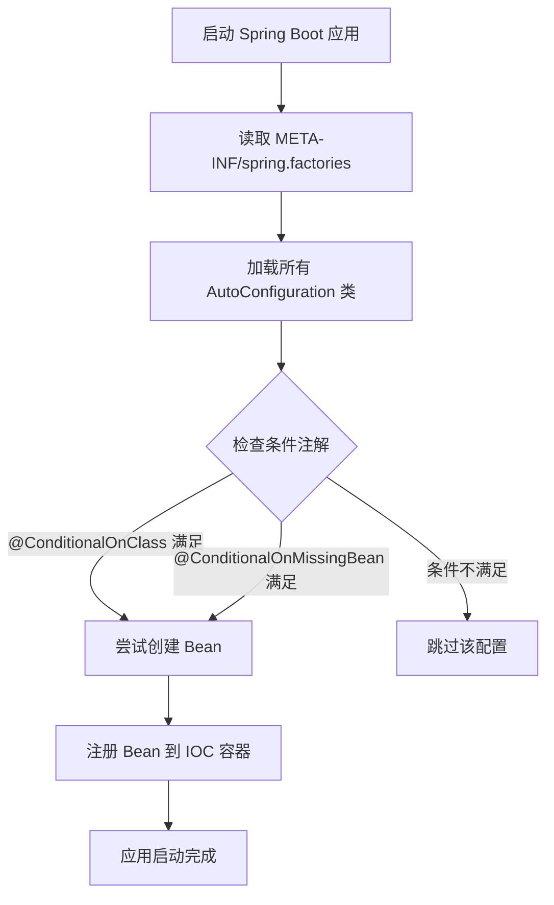
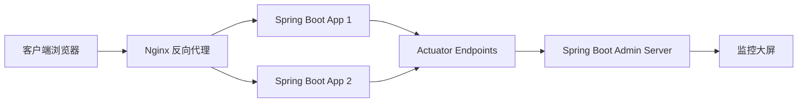

# 《单体项目知识梳理》章节总结

## 书籍信息
- **书名**：单体项目知识梳理（基于上传的脑图PDF内容重构）
- **作者**：未知（技术笔记/培训资料整理）
- **PDF 状态**：思维导图/脑图结构，非传统线性文本
- **OCR 状态**：存在部分识别错误（如 "Mawen" -> Maven, "Lambel" -> Lambda, "MytatisaaoSQOL" -> MyBatis SQL等），已进行人工校正与逻辑重组。

## 目录说明
- **目录识别情况**：原文件为思维导图结构，无传统页码。根据节点层级关系，将其划分为六大核心模块：架构搭建、SpringBoot核心、数据持久层、Web开发技巧、监控与运维、通用工具与最佳实践。
- **章节对应依据**：依据脑图中心主题“单体项目”向外辐射的一级和二级分支进行章节划分。
- **OCR 修复说明**：对明显的拼写错误进行了修正，例如将 `SpringBoct` 修正为 `SpringBoot`，`Guava工具类Joineer` 修正为 `Guava Joiner`，`/health活肤度` 修正为 `/health 健康检查` 等，以确保技术术语的准确性。

## 全书核心主题
本书（笔记）旨在系统梳理基于 Spring Boot 构建单体应用的核心技术栈与工程化实践。内容涵盖从项目初始化、依赖管理、自动配置原理，到 MyBatis 整合、Druid 连接池优化、Freemarker 模板引擎使用，再到 Spring Boot Actuator 监控、Nginx 部署以及 Guava 等工具类的高效运用。重点强调了“约定优于配置”的理念，深入解析了 Starter 机制、条件注解、异步处理、事务管理及安全加固（密码加盐）等关键知识点，旨在帮助开发者建立完整的单体应用开发知识体系，提升代码质量与系统稳定性。

---

## 第1章：架构搭建与环境准备

### 1. 核心论点
本章解决如何快速构建一个标准化的 Spring Boot 单体项目基础架构的问题。作者主张通过 Maven 多模块管理和 Spring Initializr 工具，结合规范的目录结构，实现项目的快速启动与标准化落地。

### 2. 关键概念/事件
- **Maven 多模块改造**：将空工程拆分为多个 Module，便于依赖管理和职责分离。
- **Spring Initializr**：官方提供的快速构建工具，支持 IDE 集成或 Web 端生成骨架代码。
- **目录结构规范**：明确静态文件目录、模板引擎目录、配置文件位置及 Root Package 的重要性。
- **内嵌容器优势**：Spring Boot 默认内嵌 Tomcat/Jetty/Undertow，简化部署流程，支持独立运行。

### 3. 逻辑推演/叙事脉络
首先介绍工程构建的两种方式：IDE 直接创建和使用 Spring Initializr。接着深入 Maven 配置，讲解如何通过继承 `spring-boot-starter-parent` 和引入 `spring-boot-dependencies`来管理依赖版本，避免冲突。随后，详细解析 Spring Boot 的标准目录结构，强调启动类所在包（Root Package）对组件扫描的影响。最后，对比内嵌容器与外部容器的差异，突出内嵌容器在微服务和云原生环境下的便捷性。

### 4. 经典金句/数据
> “Spring Boot 的核心优势之一是内嵌 Servlet 容器，使得应用可以打包成可执行的 JAR 文件，无需额外安装 Web 服务器。”

---

## 第2章：SpringBoot 核心原理与特性

### 1. 核心论点
本章解决开发者对 Spring Boot “魔法”背后原理不理解的问题。作者核心观点是：深入理解自动配置（AutoConfiguration）、起步依赖（Starter）和条件注解，是掌握 Spring Boot 的关键，而非仅仅停留在 API 调用层面。

### 2. 关键概念/事件
- **起步依赖（Starter）**：如 `spring-boot-starter-web`，通过依赖树分解，理解其引入的完整功能集合。
- **自动配置（AutoConfiguration）**：基于 `@EnableAutoConfiguration`，利用 `@ConditionalOnClass`、`@ConditionalOnBean` 等条件注解按需加载 Bean。
- **自定义自动配置**：编写 `HttpClientAutoConfiguration` 等示例，演示如何扩展 Spring Boot 能力。
- **调试技巧**：通过开启 `debug=true`日志输出，查看自动配置的匹配报告（Positive/Negative matches）。

### 3. 逻辑推演/叙事脉络
从 `spring-boot-starter` 的依赖树分解入手，揭示“开箱即用”背后的依赖传递机制。进而深入 `@SpringBootApplication` 注解，拆解其包含的组件扫描、自动配置等功能。重点剖析自动配置的工作原理：读取 `META-INF/spring.factories`（或新版的 `org.springframework.boot.autoconfigure.AutoConfiguration.imports`），结合条件注解判断是否创建 Bean。最后，通过编写自定义 Starter 的案例，巩固对 SPI 机制和条件装配的理解。

### 4. 流程图/图表处理

### 方法流程图：自动配置加载过程

### 5. 经典金句/数据
> “自动配置不是黑盒，通过 debug 日志可以清晰看到哪些配置生效，哪些被排除，这是排查问题的利器。”

---

## 第3章：数据持久层整合（MyBatis & Druid）

### 1. 核心论点
本章解决关系型数据库访问的性能与规范化问题。作者主张使用 MyBatis 作为 ORM 框架，配合 Druid 连接池进行精细化管理，解决 MySQL 8小时断开连接等问题，并实现 SQL 监控与慢查询分析。

### 2. 关键概念/事件
- **MyBatis 整合**：对比 XML 配置与 Starter 依赖整合方式，推荐后者以简化配置。
- **Druid 连接池**：阿里开源的高性能连接池，提供监控、扩展功能。
- **连接池参数调优**：最大/最小连接数、获取连接等待超时时间、空闲连接检测间隔、最小可移除空闲时间。
- **SQL 监控与慢日志**：通过 `StatFilter` 记录 SQL 执行次数、耗时分布，识别性能瓶颈。
- **MySQL 8小时问题**：通过配置 `testWhileIdle`、`timeBetweenEvictionRunsMillis` 等参数保持连接活性。

### 3. 逻辑推演/叙事脉络
首先介绍 Spring Boot 整合 MyBatis 的步骤，包括引入依赖、配置 Mapper 扫描路径。接着引入 Druid，详解其 Bean 的构建与属性配置，重点解释如何解决生产环境中常见的数据库连接断开问题。随后，展示如何开启 Druid 的监控功能（StatViewServlet 或 Spring Boot Admin 集成），通过可视化面板分析 SQL 执行情况。最后，提及事务管理 `@Transactional` 的使用注意事项。

### 4. 经典金句/数据
> “Druid 不仅仅是一个连接池，更是一个数据库代理，它能帮你监控 SQL 性能，防止 SQL 注入，是生产环境的首选。”

---

## 第4章：Web 开发与视图层技术

### 1. 核心论点
本章解决 Web 请求处理、页面渲染及前端交互的技术选型与实现问题。作者涵盖了从传统的 Freemarker 模板引擎到 RESTful API 开发，以及 AJAX 异步交互和 CORS 跨域处理的完整链路。

### 2. 关键概念/事件
- **Freemarker 整合**：通过 `spring-boot-starter-freemarker` 快速集成，配置后缀、前缀及编码。
- **宏（Macro）使用**：利用 Freemarker 宏实现页面布局复用（如 header, footer）。
- **Spring MVC 处理流程**：请求映射、参数绑定、视图解析。
- **CORS 跨域实现**：通过 `@CrossOrigin` 注解或全局配置类解决前后端分离带来的跨域问题。
- **异常处理**：使用 `@ControllerAdvice` 和 `@ExceptionHandler` 统一处理全局异常，返回标准 JSON 格式。

### 3. 逻辑推演/叙事脉络
先讲解视图层技术 Freemarker 的集成与基本语法，强调其在服务端渲染中的优势。接着转向控制器层，解析 Spring MVC 的请求映射机制和参数接收。针对现代前端开发需求，重点阐述 AJAX 异步请求的实现以及 CORS 跨域资源的配置策略。最后，构建全局异常处理机制，确保系统在出现错误时能返回友好的提示信息，提升用户体验。

### 4. 经典金句/数据
> “统一的异常处理不仅提升了代码的整洁度，更保证了 API 响应格式的一致性，便于前端统一处理错误。”

---

## 第5章：监控、运维与安全

### 1. 核心论点
本章解决应用上线后的健康检查、性能监控及安全加固问题。作者推崇使用 Spring Boot Actuator 暴露应用指标，结合 Spring Boot Admin 进行可视化监控，并通过 Nginx 实现反向代理与负载均衡。

### 2. 关键概念/事件
- **Spring Boot Actuator**：提供 `/health`（健康检查）、`/metrics`（指标度量）、`/env`（环境变量）、`/trace`（请求追踪）等端点。
- **Spring Boot Admin**：基于 Actuator 数据的可视化监控平台，支持实时日志查看、JVM 内存监控。
- **Nginx 配置**：反向代理、负载均衡、静态资源托管。
- **安全加固**：密码加盐哈希存储，防止明文泄露；Session 管理与 ThreadLocal 的使用场景。
- **异步处理**：使用 `@Async` 注解提升系统吞吐量，解耦耗时操作。

### 3. 逻辑推演/叙事脉络
首先介绍 Actuator 的核心端点及其含义，强调在生产环境中需适当屏蔽敏感端点。接着，演示如何搭建 Spring Boot Admin Server，并将客户端应用注册其中，实现集中式监控。随后，引入 Nginx 作为前置代理，配置 upstream 实现负载分担。最后，讨论安全性问题，包括密码加密策略和 Session 并发控制，以及利用异步编程优化性能。

### 4. 流程图/图表处理

### 监控架构图

### 5. 经典金句/数据
> “没有监控的系统就是在裸奔。Actuator 提供了应用的‘体检报告’，而 Spring Boot Admin 则是‘ICU 监护仪’。”

---

## 第6章：编码技巧与工具类库

### 1. 核心论点
本章解决日常开发中代码复用、性能优化及常见陷阱规避问题。作者推荐使用 Google Guava 库提升开发效率，利用 Java 8 Lambda 表达式简化代码，并强调分页组件、缓存策略及 ThreadLocal 的正确使用。

### 2. 关键概念/事件
- **Guava 工具类**：
    - `Joiner` / `Splitter`：字符串处理。
    - `Hashing`：一致性哈希、布隆过滤器。
    - `Cache`：本地缓存实现，支持过期策略。
- **Java 8 Lambda**：函数式编程风格，简化集合操作。
- **分页组件**：PageHelper 或 Spring Data Page 的使用，避免全表查询。
- **ThreadLocal**：用于存储用户上下文信息，注意内存泄漏风险（remove 操作）。
- **Redis 集成**：作为分布式缓存，减轻数据库压力。

### 3. 逻辑推演/叙事脉络
从代码简洁性出发，介绍 Java 8 Lambda 和 Stream API 的应用。接着引入 Guava 库，展示其在集合处理、字符串操作和缓存方面的强大功能，对比 JDK 原生实现的优劣。随后，讨论数据查询优化，重点讲解分页插件的原理与使用。最后，深入并发编程细节，解析 ThreadLocal 的应用场景及注意事项，以及 Redis 在单体架构中的缓存角色。

### 4. 经典金句/数据
> “善用工具类库（如 Guava）可以避免重复造轮子，同时往往能获得经过大厂验证的高性能实现。”

---

## 附录：技术选型关注点总结

### 1. 核心论点
总结单体项目在技术选型时的核心考量因素，强调稳定性、成熟度与团队熟悉度的平衡。

### 2. 关键概念/事件
- **存储稳定性**：MySQL 作为首选关系型数据库。
- **工程化能力**：Maven 3.5+，Spring Boot Maven Plugin 打包。
- **前端技术**：jQuery（传统）或 Vue/React（现代），Ajax 交互。
- **部署运维**：Docker 容器化，Jenkins 持续集成。

### 3. 逻辑推演/叙事脉络
回顾整个技术栈，从后端 Spring Boot + MyBatis + Druid，到前端 jQuery/Vue，再到中间件 Redis、Nginx，最后到运维层面的 Docker/Jenkins。强调各组件之间的协同作用，以及在选型时应避免盲目追求新技术，而应选择社区活跃、文档完善、适合业务场景的技术组合。

### 4. 经典金句/数据
> “技术选型的本质是权衡。在单体架构阶段，稳定压倒一切，过度设计是万恶之源。”