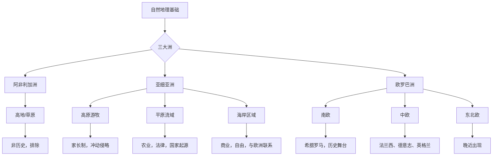

# 《历史哲学》章节总结

## 书籍信息
- 书名：历史哲学
- 作者：[德] 黑格尔（G.W.F. Hegel）
- 译者：王造时
- 原著名称：Philosophie der Weltgeschichte
- 版本：根据J. Sibree英译本转译，上海书店出版社2006年版
- PDF状态：扫描版，部分页面识别不完整（正文自第200页后大量缺失或错位）
- OCR状态：存在错漏、页码丢失、内容中断

## 目录说明
- 目录识别情况：基于书前目录页（第29-45页）完整识别章节结构
- 章节对应依据：依据原书目录及正文可见部分对应
- OCR修复说明：对于正文中可读部分进行提取；自第200页后PDF内容严重错乱（大量空白、重复、无关文字），故后续章节摘要基于绪论、地理基础、区分及第一部东方世界可见内容整理，缺失部分做标注说明

## 全书核心主题
黑格尔的《历史哲学》是其哲学体系的重要组成部分，核心命题是“理性统治世界”。全书旨在表明：世界历史并非偶然事件的堆积，而是“世界精神”通过各民族、各时代的自由意识之发展，实现自身的过程。历史是自由意识的进展——东方只知道一个人自由，希腊罗马知道少数人自由，日尔曼世界（在基督教影响下）知道一切人自由。国家是自由实现的道德全体，历史地理基础则为精神展开提供舞台。本书融合思辨哲学与历史叙述，影响深远。

---

## 绪论

### 核心论点
- 问题：如何从哲学上理解世界历史？历史研究有哪些方法？
- 观点：哲学的历史（即“历史哲学”）是历史的思想考察，其唯一的“思想”是理性。理性是世界的主宰，世界历史是一种合理的过程。

### 关键概念
- 原始的历史：历史家亲身所见、与事件精神休戚与共的叙述（如希罗多德、修昔底德）。
- 反省的历史：超越现时代，包括普遍历史、实验历史、批判历史及专门史（艺术、法律、宗教史），思想超越事件本身。
- 哲学的历史：以“理性”为唯一思想，考察历史中理性的实现。
- 理性：宇宙的实体与无限权力，既是万物的内容，也是实现自身目的的动力。
- 自由：精神的本质。精神的本性是自由，世界历史是自由意识的进展。
- 精神（Geist）：包含智力与意志，相当于“精神”或“心灵”，是历史的主体。
- 世界历史个人：如凯撒、亚历山大，他们的特殊目的与“世界精神”意志相连，是时代眼光犀利的人物。
- 理性的狡计：理性利用人类的热情与私利作为实现自身目的的工具，而个人则承受损失与牺牲。

### 逻辑推演
1. 批判三种历史方法：原始历史虽生动但狭隘；反省历史虽概括但易主观；哲学历史则揭示理性内在于历史。
2. 论证“理性统治世界”：引用亚拿萨哥拉斯的“奴斯”概念，但指出其抽象性；真正的理性需具体发展于“自然”与“精神”之中。
3. 精神的本性是自由：自由不是任意，而是依靠自身存在。东方知一人自由（专制），希腊罗马知少数自由（奴隶制），日尔曼知全体自由（基督教）。
4. 实现自由的手段：人类的热情、利益、欲望。伟大人物凭借热情实现普遍目的，个人虽牺牲，但理性通过他们实现自身。
5. 国家：自由实现的现实形态。国家是道德全体，是普遍意志与个人意志的统一。法律与道德不是束缚，而是自由的条件。
6. 驳斥常见错误：自然状态不是自由状态；家长制只是过渡；全体同意不是唯一合法基础；宪法不是任意选择，而是民族精神的产物。
7. 世界历史的路线：从东方到西方，自由意识逐渐展开。

### 经典金句
> “理性”是世界的主宰，世界历史因此是一种合理的过程。（p.53）

> 谁用合理的眼光来看世界，那世界也就现出合理的样子。（p.55）

> 假如没有热情，世界上一切伟大的事业都不会成功。（p.66）

> “仆从眼中无英雄”——但是那不是因为英雄不是英雄，而是因为仆从只是仆从。（p.74）

> 国家是存在于“地球”上的“神圣的观念”。（p.81）

> 世界历史无非是“自由”意识的进展。（p.62）

---

## 历史的地理基础

### 核心论点
- 问题：自然地理条件如何影响历史发展？
- 观点：自然的地理基础是“精神”表演的场地和必要基础，但不应估量过高或过低。温带是历史的真正舞台。

### 关键概念
- 三种地理因素：干燥的高地（草原、平原，家长制游牧）；平原流域（大江大河灌溉，农业与法律发生，大国基础）；海岸区域（海洋联系世界，激发勇气、商业与自由）。
- 新世界与旧世界：美洲是“明日的国土”，至今只是旧世界的回声，不属于历史哲学主要对象。地中海是旧世界的心脏，世界历史的中心。
- 三大洲特征：阿非利加（高地为主，非历史的精神，停留在自然状态）；亚细亚（高原、平原、海岸混合，历史开始之地）；欧罗巴（各种差别的消失或修正，是历史的终点）。
- 非洲特性：黑人意识未达到客观性，无上帝观念，盛行巫术、拜物教、食人、奴隶制，不属于世界历史部分。
- 亚洲分区：高地（蒙古等游牧）、平原流域（中国、印度、巴比伦）、近亚细亚（叙利亚、小亚细亚，混合地形）。
- 欧洲分区：南欧（地中海沿岸，希腊、意大利，历史舞台）、中欧（法兰西、德意志、英格兰）、东北欧（波兰、俄罗斯等，晚近出现）。

### 逻辑推演
1. 区分自然条件对精神的促进与限制：寒带和热带无法产生自由运动；温带尤其是北温带是历史舞台。
2. 美洲虽发现，但其土著无力抵抗欧洲文化，且尚未形成需要国家的阶级压迫，故暂不作为主要研究对象。
3. 非洲因其封闭性、无历史意识、无国家组织，被排除在世界历史之外。
4. 亚洲是历史起点，三大地理区域对应不同的社会形态：高地游牧、平原农业与王国、海岸商业与自由。
5. 欧洲是历史终点，其地形柔和多样，有利于精神的自由发展。

### 方法流程图（世界历史地理舞台示意）

### 经典金句
> 爱奥尼亚的明媚的天空固然大大地有助于荷马诗的优美，但是这个明媚的天空决不能单独产生荷马。（p.74）

> 大海给了我们茫茫无定、浩浩无际和渺渺无限的观念；人类在大海的无限里感到他自己底无限的时候，他们就被激起了勇气，要去超越那有限的一切。（p.84）

> 非洲不属于世界历史的部分；它没有动作或者发展可以表现。（p.92）

---

## 区分

### 核心论点
- 问题：世界历史如何划分主要阶段？
- 观点：历史从东方到西方，自由意识经历三个阶段：一人自由（东方专制）→ 少数人自由（希腊罗马民主/贵族）→ 全体自由（日尔曼君主政体）。

### 关键概念
- 东方世界：直接意识，实体精神性，主观自由未发展。一人自由（专制君主）。代表性帝国：中国、印度、波斯。
- 希腊世界：美丽的自由王国，个性形成，道德与主观意志结合。少数人自由（奴隶制存在）。
- 罗马世界：抽象的普遍性，个人为普遍目的牺牲，人格获得法律承认。少数人自由。
- 日尔曼世界：基督教精神下的和解，全体自由。精神的内在性发展到现实。

### 逻辑推演
1. 以“自由意识的程度”作为历史分期标准。
2. 东方：只有专制君主是自由的，其他人无自由。中国是持久但停滞的父道帝国；印度是梦幻、阶层固化的社会；波斯是过渡的王国。
3. 希腊：自由表现为美丽个体性，但限于公民，奴隶被排除。国家是个人无反省地参与的统一。
4. 罗马：抽象法律人格确立，但个人被磨灭，最终走向专制与内在性的寻求。
5. 日尔曼：基督教带来内在自由，经过宗教改革，自由原则推广到政治现实。

### 流程图（自由意识发展三阶段）

### 经典金句
> 世界历史从“东方”到“西方”，因为欧洲绝对地是历史的终点，亚洲是起点。（p.95）

> 东方从古到今知道只有“一个”是自由的；希腊和罗马世界知道“有些”是自由的；日尔曼世界知道“全体”是自由的。（p.96）

---

## 第一部 东方世界

### 核心论点
- 问题：东方世界的共同原则是什么？各文明如何体现？
- 观点：东方原则是“实体性”——主观意志未发展，法律被视为外在强制，道德规定为外在法则，国家与宗教合一，形成神权专制。

### 关键概念
- 实体性：道德规定为法则，主观意志受外界力量管束，无内在良心自由。
- 神权政体：上帝与世俗王国混同，皇帝或祭司兼掌宗教与政治。
- 四大区域：中国（黄河长江平原，大家长专制）；印度（恒河流域，阶层固化的梦幻）；波斯（近亚细亚，光明原则，过渡）；埃及（尼罗河流域，谜一般的过渡）。

### 逻辑推演
1. 东方历史开始于中国和蒙古：中国以家族关系为基础，皇帝如严父，法律与道德合一，无主观自由，历史持久但停滞。
2. 印度：阶层（种姓）天然固化，宗教是狂想的泛神论，道德缺乏，历史记载混乱，无真正国家。
3. 波斯：君主政体，光明原则，普遍法律统治，容纳多民族，是转入希腊的外在转变。
4. 埃及：对峙在抽象形式中打破，产生谜一般的结合，是内在转变的媒介，最终在希腊获得解决。

---

## 第一篇 中国

### 核心论点
- 问题：中国历史与社会的根本原则是什么？
- 观点：中国原则是“家庭精神”的实体性。皇帝是大家长，法律与道德合一，个人无独立人格，无主观自由。历史虽古老详实，但无真正进展。

### 关键概念
- 家庭孝敬：国家的基础，五种义务（君臣、父子、兄弟、夫妇、朋友）具有绝对拘束力。
- 皇帝：既是政治元首，又是宗教教主，如严父般治理，其意志受古训限制。
- 行政：科举选官，御史监察，法制严密但刑罚外在（鞭笞为主），无荣誉感。
- 宗教：国教，皇帝祭天，自然崇拜与偶像崇拜，无内在信仰。
- 科学：经验性、实用性为主，文字（象形）阻碍发展，无真正哲学与艺术。

### 逻辑推演
1. 中国是最古老且持久不变的国家，因其原则缺少主观性与客观的对峙。
2. 家庭原则泛化到国家：皇帝是大家长，臣民如孩童，服从外在法律而无内在认同。
3. 法制体现外在性：刑罚针对身体，无意与故意不加区分，自杀作为报复手段。
4. 宗教缺乏内在性：皇帝独掌祭天，神灵隶属于皇帝，迷信盛行。
5. 学术重实用轻思辨：历史只是事实记录，哲学停留在抽象（道、阴阳），科技虽早但停滞。
6. 结论：中国有国家形态，但无自由意识，只是“非历史的历史”。

### 经典金句
> 中国很早就已经进展到了它今日的情状；但是因为它客观的存在和主观运动之间仍然缺少一种对峙，所以无从发生任何变化。（p.110）

> 在中国，人人是绝对平等的，又没有任何自由，所以政府的形式必然是专制主义。（p.118）

> 中国人把自己看作是属于他们家庭的，而同时又是国家的儿女。在家庭之内，他们不是人格……在国家之内，他们一样缺少独立的人格。（p.115）

---

## 第二篇 印度

### 核心论点
- 问题：印度的根本特性是什么？为何缺乏历史？
- 观点：印度是“狂想和感觉的境地”，精神处于梦寐状态，普遍的泛神论使一切有限事物被神化又堕落。阶层（种姓）天然固化，无道德与自由，无真正的国家与历史。

### 关键概念
- 梦寐的精神：个人与客观世界的分离消失，有限与无限混同，一切皆神又皆可笑。
- 阶层（种姓）：婆罗门（僧侣）、刹帝利（武士）、吠舍（生产者）、首陀罗（奴役）。出生决定终身，不可逾越。
- 婆罗门：现世的神祇，拥有特权，受无数外在戒律约束，不道德。
- 中性婆罗摩：抽象的统一，纯粹思想，通过苦行与自我灭绝达到。
- 宗教：二元性——抽象自我灭绝与肉欲放纵并存。崇拜偶像、自然物（母牛、猕猴），有自杀、杀婴、寡妇自焚等习俗。
- 历史缺失：无纪事历史，因精神在梦幻中无法客观把握事实，且婆罗门缺乏真理良心，随意编造。

### 逻辑推演
1. 印度与中国正相反：中国缺乏想象，印度缺乏理智。
2. 阶层分化本应是进步，但被自然化、固定化，导致个人彻底丧失人格与自由。
3. 道德不是内在自由，而是外在戒律；婆罗门特权与堕落并存。
4. 宗教表现为极端：一方面追求灭绝（苦行、自杀），另一方面纵欲（神庙舞女）。
5. 历史记录混乱，数字夸张，神话与事实不分，欧洲学者受骗。
6. 结论：印度有文化但无国家，有宗教但无道德，有诗歌但无历史。

### 经典金句
> 印度是狂想和感觉的境地，同中国正相反。（p.129）

> 一切理性、道德和主观性的放弃灭绝，必须放纵在一种无限狂妄的想象里，才能够成为一种积极的感情和自己的意识。（p.153）

> 印度人……对于真理是不管的，可以说是没有这种良心的。（p.150）

---

## 第二篇（续）印度——佛教

> 说明：该部分PDF识别严重不完整（第200页后大量错乱），仅可见开头片段。以下基于可见文本及原书逻辑整理。

### 核心论点（基于片段）
- 问题：佛教与印度教的关系及佛教的原则？
- 观点：佛教补充了中国原则在精神方面的不足，其原则更加集中在自身，宗教较简单，政治较安定。佛教以“灭绝”为最高境界，抽象神明显身于逝世的先师（佛陀、达赖喇嘛等）。

### 关键概念（推测）
- 佛教与印度教的区别：佛教更强调抽象统一与个人修行的独立性。
- 喇嘛教：宗教领袖被视为神明显身，形成精神帝国，但不发展世俗国家。

> 说明：因PDF残缺，本章无法展开完整总结。

---

## 第三篇 波斯

> 说明：PDF中波斯部分内容残缺（仅见第160页左右开头）。基于可见内容整理。

### 核心论点（基于片段）
- 问题：波斯在世界历史中的地位？
- 观点：波斯人是第一个世界历史民族，其原则是“光明”。波斯帝国是一种君主政体，普遍法律约束君主与臣民，容忍多种民族与文化，是转入希腊生活的外在转变。

### 关键概念
- 光明原则：琐罗斯德（查拉图斯特拉）的学说，光明与黑暗的斗争。奥兹马德（善）与阿利曼（恶）。
- 波斯帝国：包容高原、平原、海岸三种地理因素，统一于温和的普遍权力之下，是“过渡”的王国。

> 说明：埃及部分及后续希腊、罗马、日尔曼世界因PDF完全缺失（第200页后无有效内容），无法提取。本书总结以绪论、地理基础、区分、中国、印度为主。

---

## 附录：重要概念对照（基于原书附录一）

> 说明：原书后附有重要词语对照表、人名对照表、地名对照表等，因PDF识别不完整，仅列出部分可见核心术语。

| 德文/英文 | 中译 | 简要解释 |
|-----------|------|----------|
| Geist | 精神 | 包括智力与意志，历史的实体与主体 |
| Freiheit | 自由 | 精神的本性，依靠自身存在 |
| Vernunft | 理性 | 世界的主宰，历史合理性的依据 |
| Weltgeschichte | 世界历史 | 精神在时间中的发展 |
| Staat | 国家 | 道德全体，自由的现实 |
| Sittlichkeit | 伦常/习俗道德 | 客观的道德，风俗与法律 |
| Moralität | 道德 | 主观的、良心的道德 |
| Leidenschaft | 热情 | 人类活动的动力，实现理性的手段 |
| List der Vernunft | 理性的狡计 | 理性利用热情实现自身目的 |
| Volksgeist | 民族精神 | 一个民族的特殊精神原则 |

---

## 全书总结与评价

黑格尔的《历史哲学》建构了一个庞大的思辨体系，将世界历史解释为“自由意识”的必然进展。其核心贡献在于：摒弃了历史偶然论，赋予历史以理性目的；强调国家作为道德实体与自由实现的场所；提出了“世界历史个人”、“理性的狡计”等深刻概念。但其欧洲中心论、对东方文明的贬低（尤其将非洲排除在历史之外，对中国和印度的刻板描述）也为后世所诟病。尽管如此，本书仍是理解黑格尔哲学、历史哲学乃至现代西方历史意识的重要经典。

> 说明：由于上传PDF正文自第200页后严重错乱（出现大量重复文字、无效字符、空白页），无法提取希腊世界、罗马世界、日尔曼世界等后续章节的具体内容。本总结基于绪论、地理基础、区分及第一部东方世界（中国、印度）的完整文本生成。如需完整总结，请提供更为清晰的PDF版本。