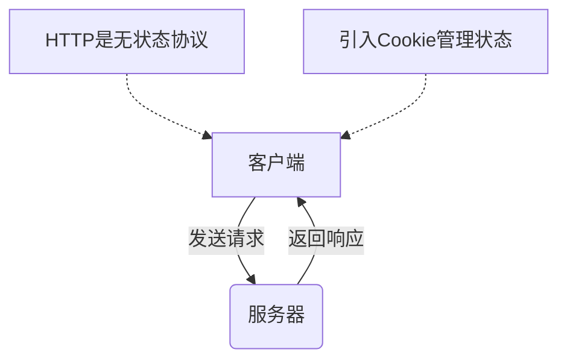
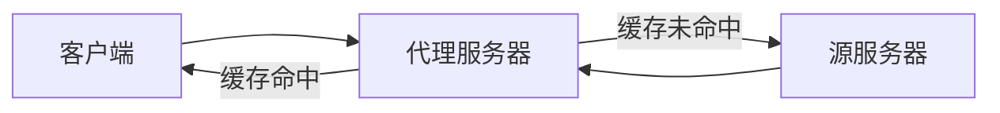
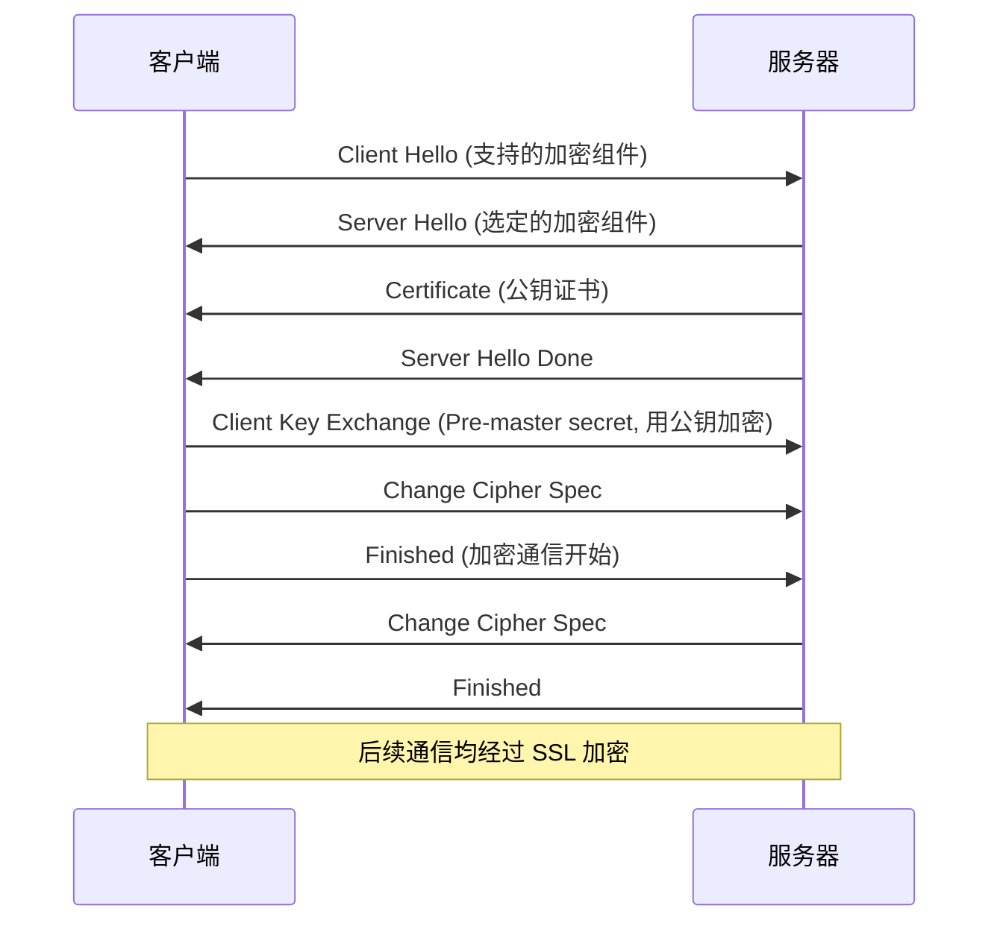
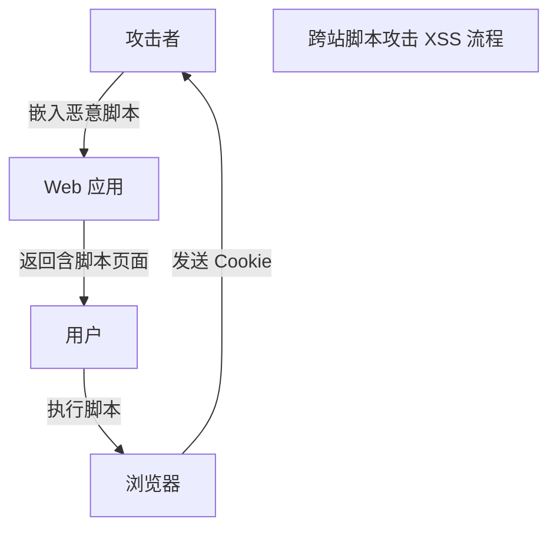

# 《图解HTTP》章节总结

## 书籍信息

- **书名**：图解HTTP
- **作者**：[日] 上野宣
- **译者**：于均良
- **PDF 状态**：完整文本识别
- **OCR 状态**：高质量，结构清晰

## 目录说明

- **目录识别情况**：已完整识别，共11章及附录信息。
- **章节对应依据**：严格遵循原书目录结构，从Web基础到HTTP协议细节，再到安全与扩展协议。
- **OCR 修复说明**：无需特殊修复，内容完整。

## 全书核心主题

本书旨在通过图文并茂的方式，系统性地讲解 HTTP 协议及其相关技术。全书从 Web 和网络基础入手，深入剖析 HTTP/1.1 协议的报文结构、方法、状态码、首部字段等核心机制，解释了持久连接、Cookie 状态管理等关键特性。随后，书中探讨了 HTTPS 的安全机制（加密、认证、完整性保护），介绍了 BASIC、DIGEST、SSL 客户端及表单认证等多种身份验证方式。最后，本书展望了 HTTP 的未来，介绍了 SPDY、WebSocket、HTTP/2.0 等解决 HTTP 瓶颈的新协议，并详细分析了常见的 Web 攻击技术（如 XSS、SQL 注入、CSRF 等）及其防御策略。本书适合 Web 开发者、前端工程师及安全人员阅读，旨在帮助读者建立对 HTTP 协议的整体认知，从而更好地进行 Web 开发与安全防护。

---

## 第1章：了解 Web 及网络基础

### 核心论点

本章主要解决“Web 是如何构建在 HTTP 协议之上”的问题。作者认为，理解 HTTP 的诞生背景及其依赖的 TCP/IP 协议族，是掌握 Web 通信机制的前提。

### 关键概念/事件

- **HTTP (HyperText Transfer Protocol)**：超文本传输协议，用于客户端和服务器之间的通信规范。
- **TCP/IP 协议族**：互联网通信的基础协议族，分为应用层、传输层、网络层和数据链路层。
- **DNS (Domain Name System)**：域名系统，提供域名到 IP 地址的解析服务。
- **URI/URL**：统一资源标识符/定位符，用于标识和定位互联网上的资源。

### 逻辑推演/叙事脉络

本章首先介绍了 HTTP 的诞生背景，即蒂姆·伯纳斯-李为了实现知识共享而提出的 WWW 构想。接着，阐述了支撑 HTTP 运行的底层网络基础 TCP/IP，解释了分层管理的优势以及数据封装的过程。随后，重点介绍了与 HTTP 密切相关的 IP、TCP 和 DNS 协议的作用。最后，明确了 URI 和 URL 的概念及其格式，为后续章节深入 HTTP 协议细节打下基础。

### 经典金句/数据

> “Web 是建立在 HTTP 协议上通信的。”

> “URI 用字符串标识某一互联网资源，而 URL 表示资源的地点（互联网上所处的位置）。可见 URL 是 URI 的子集。”

---

## 第2章：简单的 HTTP 协议

### 核心论点

本章解决“HTTP 协议如何进行通信”的问题。作者指出，HTTP 是一种无状态协议，通过请求和响应的交换达成通信，并引入了 Cookie 和持久连接来优化性能和状态管理。

### 关键概念/事件

- **无状态 (Stateless)**：HTTP 协议自身不对请求和响应之间的通信状态进行保存。
- **HTTP 方法**：GET（获取）、POST（传输实体）、PUT（传输文件）、HEAD（获得首部）、DELETE（删除）、OPTIONS（询问支持方法）、TRACE（追踪路径）、CONNECT（建立隧道）。
- **持久连接 (Keep-Alive)**：只要任意一端没有明确提出断开连接，则保持 TCP 连接状态，减少连接建立和断开的开销。
- **Cookie**：通过在请求和响应报文中写入 Cookie 信息来控制客户端的状态，弥补 HTTP 无状态的缺陷。

### 逻辑推演/叙事脉络

本章首先定义了客户端和服务器的角色，说明了 HTTP 通信是基于请求和响应的交换。接着，详细解释了 HTTP 的无状态特性及其带来的问题，引出了 Cookie 技术作为解决方案。随后，列举了 HTTP/1.1 支持的多种方法及其用途。最后，介绍了持久连接和管线化技术，说明了它们如何节省通信量并提高 Web 页面的显示速度。

### 流程图（如存在）

### 经典金句/数据

> “HTTP 是一种不保存状态，即无状态（stateless）协议。HTTP 协议自身不对请求和响应之间的通信状态进行保存。”

> “持久连接的好处在于减少了 TCP 连接的重复建立和断开所造成的额外开销，减轻了服务器端的负载。”

---

## 第3章：HTTP 报文内的 HTTP 信息

### 核心论点

本章解决“HTTP 报文包含哪些信息”的问题。作者通过分析报文结构、编码方式和内容协商机制，揭示了 HTTP 如何高效、灵活地传输数据。

### 关键概念/事件

- **HTTP 报文结构**：由报文首部（Header）和报文主体（Body）组成，中间由空行分隔。
- **内容编码**：如 gzip、compress、deflate，用于压缩实体主体以提升传输速率。
- **分块传输编码 (Chunked Transfer Coding)**：将实体主体分成多个块进行传输，允许浏览器逐步显示页面。
- **多部分对象集合 (Multipart)**：用于在一份报文中发送多种类型的数据，如表单上传文件。
- **内容协商 (Content Negotiation)**：客户端和服务器就响应的资源内容（语言、字符集等）进行交涉，返回最合适的内容。

### 逻辑推演/叙事脉络

本章首先拆解了 HTTP 请求报文和响应报文的结构，包括起始行、首部字段和实体主体。接着，介绍了如何通过内容编码和分块传输编码来提升传输效率和用户体验。随后，讲解了多部分对象集合在处理复杂数据（如文件上传）时的应用。最后，阐述了内容协商机制，说明了服务器如何根据客户端的需求返回最合适的资源版本。

### 经典金句/数据

> “HTTP 报文的主体用于传输请求或响应的实体主体。通常，报文主体等于实体主体。只有当传输中进行编码操作时，实体主体的内容发生变化，才导致它和报文主体产生差异。”

---

## 第4章：返回结果的 HTTP 状态码

### 核心论点

本章解决“如何知晓服务器处理结果”的问题。作者通过分类介绍状态码，帮助读者快速判断请求的成功、重定向、客户端错误或服务器错误。

### 关键概念/事件

- **2XX 成功**：如 200 OK（正常处理）、204 No Content（成功但无实体）、206 Partial Content（范围请求成功）。
- **3XX 重定向**：如 301 Moved Permanently（永久重定向）、302 Found（临时重定向）、303 See Other（查看其他地址，强制 GET）、304 Not Modified（未修改，使用缓存）。
- **4XX 客户端错误**：如 400 Bad Request（语法错误）、401 Unauthorized（需要认证）、403 Forbidden（禁止访问）、404 Not Found（资源未找到）。
- **5XX 服务器错误**：如 500 Internal Server Error（服务器内部错误）、503 Service Unavailable（服务不可用）。

### 逻辑推演/叙事脉络

本章首先介绍了状态码的五种类别（1XX-5XX）。接着，逐类详细解释了具有代表性的状态码的含义及使用场景，特别强调了 301、302、303 在重定向行为上的细微差别，以及 304 在缓存机制中的作用。最后，简要说明了客户端和服务器错误的常见原因。

### 经典金句/数据

> “301 Moved Permanently：永久性重定向。该状态码表示请求的资源已被分配了新的 URI，以后应使用资源现在所指的 URI。”

> “303 See Other：该状态码表示由于请求对应的资源存在着另一个 URI，应使用 GET 方法定向获取请求的资源。”

---

## 第5章：与 HTTP 协作的 Web 服务器

### 核心论点

本章解决“Web 服务器如何协同工作以提供高效服务”的问题。作者介绍了虚拟主机、代理、网关、隧道以及缓存机制，说明了它们在 Web 架构中的作用。

### 关键概念/事件

- **虚拟主机 (Virtual Host)**：在一台物理服务器上运行多个域名对应的网站，通过 Host 首部区分。
- **代理 (Proxy)**：位于客户端和服务器之间的中间人，可转发请求、缓存资源或进行访问控制。
- **网关 (Gateway)**：转发其他服务器通信数据的服务器，可将 HTTP 请求转化为其他协议通信。
- **隧道 (Tunnel)**：建立一条与其他服务器的通信线路，确保客户端与服务器间的安全通信（如 SSL 隧道）。
- **缓存 (Cache)**：保存资源副本，减少对源服务器的访问，节省带宽和时间。

### 逻辑推演/叙事脉络

本章首先介绍了如何利用虚拟主机在单台服务器上实现多个域名。接着，详细区分了代理、网关和隧道的功能差异及应用场景。最后，重点讲解了缓存机制，包括缓存的有效期限、客户端缓存以及缓存服务器的工作原理，强调了缓存对提升 Web 性能的重要性。

### 流程图（如存在）

### 经典金句/数据

> “缓存是指代理服务器或客户端本地磁盘内保存的资源副本。利用缓存可减少对源服务器的访问，因此也就节省了通信流量和通信时间。”

---

## 第6章：HTTP 首部

### 核心论点

本章解决“HTTP 首部字段传递了哪些关键信息”的问题。作者系统梳理了通用、请求、响应和实体四类首部字段，特别是 Cache-Control 和 Cookie 相关字段，揭示了 HTTP 控制的精细度。

### 关键概念/事件

- **通用首部字段**：如 Cache-Control（控制缓存）、Connection（管理持久连接）、Date（创建时间）。
- **请求首部字段**：如 Accept（可处理媒体类型）、Host（请求资源所在服务器）、User-Agent（浏览器信息）、Referer（原始资源 URI）。
- **响应首部字段**：如 Location（重定向 URI）、Server（服务器软件信息）、Set-Cookie（状态管理）。
- **实体首部字段**：如 Content-Type（媒体类型）、Content-Length（主体大小）、Expires（过期时间）、ETag（资源唯一标识）。
- **Cookie 首部**：Set-Cookie（服务器下发）、Cookie（客户端上传），包含 expires、path、domain、secure、HttpOnly 等属性。

### 逻辑推演/叙事脉络

本章首先介绍了 HTTP 首部字段的结构和四种类型。接着，详细列举并解释了 HTTP/1.1 定义的常用首部字段，重点深入讲解了 Cache-Control 的各种指令（如 no-cache, no-store, max-age）及其对缓存行为的影响。随后，专门章节讲解了为 Cookie 服务的首部字段及其属性，最后补充了一些非标准但常用的首部字段（如 X-Frame-Options）。

### 经典金句/数据

> “首部字段 Host 会告知服务器，请求的资源所处的互联网主机名和端口号。Host 首部字段在 HTTP/1.1 规范内是唯一一个必须被包含在请求内的首部字段。”

> “no-cache 指令的目的是为了防止从缓存中返回过期的资源……no-store 才是真正地不进行缓存。”

---

## 第7章：确保 Web 安全的 HTTPS

### 核心论点

本章解决“HTTP 存在哪些安全缺陷以及如何通过 HTTPS 解决”的问题。作者指出 HTTP 的明文、无认证、无完整性保护三大缺点，并详细阐述了 HTTPS 如何通过 SSL/TLS 实现加密、认证和完整性保护。

### 关键概念/事件

- **HTTP 的缺点**：通信使用明文（易窃听）、不验证通信方身份（易伪装）、无法证明报文完整性（易篡改）。
- **HTTPS**：HTTP + 加密 + 认证 + 完整性保护。身披 SSL/TLS 外壳的 HTTP。
- **公开密钥加密**：使用公钥加密、私钥解密，解决密钥配送问题。
- **混合加密机制**：交换密钥时使用公开密钥加密，通信时使用共享密钥加密（速度快）。
- **证书 (Certificate)**：由数字证书认证机构 (CA) 颁发，证明公开密钥的正确性和服务器身份。
- **SSL 握手过程**：Client Hello -> Server Hello -> Certificate -> Server Hello Done -> Client Key Exchange -> Change Cipher Spec -> Finished。

### 逻辑推演/叙事脉络

本章首先分析了 HTTP 的三大安全弱点。接着，引入 HTTPS 概念，解释了其如何通过 SSL/TLS 协议弥补这些弱点。随后，深入讲解了加密技术（共享密钥、公开密钥、混合加密）和证书机制（CA、数字签名）。最后，详细描述了 HTTPS 的通信步骤（SSL 握手流程），并讨论了 HTTPS 的性能开销及为何不所有网站都使用 HTTPS 的原因。

### 流程图（如存在）

### 经典金句/数据

> “HTTPS 并非是应用层的一种新协议。只是 HTTP 通信接口部分用 SSL 和 TLS 协议代替而已。”

> “公开密钥加密使用一对非对称的密钥。一把叫做私有密钥，另一把叫做公开密钥。”

---

## 第8章：确认访问用户身份的认证

### 核心论点

本章解决“如何确认访问者身份”的问题。作者对比了 BASIC、DIGEST、SSL 客户端和基于表单的认证方式，指出各自优缺点及适用场景。

### 关键概念/事件

- **BASIC 认证**：简单，但密码 Base64 编码（非加密），易被窃听，不支持注销。
- **DIGEST 认证**：质询/响应方式，不发送明文密码，安全性高于 BASIC，但仍较弱。
- **SSL 客户端认证**：使用客户端证书，安全性高，但成本高、部署复杂，常与表单认证组合成双因素认证。
- **基于表单认证**：非 HTTP 标准，由 Web 应用实现，通常结合 Session 和 Cookie 管理状态，灵活性高但需自行保障安全。

### 逻辑推演/叙事脉络

本章首先定义了认证的概念。接着，依次介绍了 HTTP 标准提供的 BASIC 和 DIGEST 认证机制及其步骤，指出了它们的安全性局限。随后，讲解了高安全性的 SSL 客户端认证及其双因素认证的应用。最后，重点介绍了目前最主流的基于表单的认证，说明了其通过 Session ID 和 Cookie 进行状态管理的原理，并强调了 Session ID 的安全性重要性。

### 经典金句/数据

> “BASIC 认证虽然采用 Base64 编码方式，但这不是加密处理。不需要任何附加信息即可对其解码。”

> “基于表单认证的标准规范尚未有定论，一般会使用 Cookie 来管理 Session（会话）。”

---

## 第9章：基于 HTTP 的功能追加协议

### 核心论点

本章解决“HTTP/1.1 存在哪些瓶颈以及如何通过新协议改进”的问题。作者介绍了 SPDY、WebSocket 和 HTTP/2.0，展示了 Web 通信向高性能、全双工方向发展的趋势。

### 关键概念/事件

- **SPDY**：Google 开发，旨在消除 HTTP 瓶颈。特点：多路复用流、赋予请求优先级、压缩 HTTP 首部、推送功能。
- **WebSocket**：全双工通信协议。特点：建立在 HTTP 基础上，握手后使用专用协议，减少通信量，支持服务器推送。
- **HTTP/2.0**：下一代 HTTP 标准。目标：改善速度体验。技术基础：SPDY、HTTP Speed + Mobility 等。特点：多路复用、首部压缩、二进制分帧等。
- **WebDAV**：基于 HTTP 的分布式创作和版本控制协议，扩展了 PUT、DELETE 等方法，支持文件锁、属性管理等。

### 逻辑推演/叙事脉络

本章首先指出了 HTTP/1.1 在实时性、并发性和首部开销方面的瓶颈。接着，详细介绍了 SPDY 的设计与功能，说明其如何通过多路复用和首部压缩提升性能。随后，讲解了 WebSocket 如何实现浏览器与服务器的全双工通信。最后，展望了 HTTP/2.0 的发展，并简要介绍了 WebDAV 这一扩展协议。

### 经典金句/数据

> “SPDY 没有完全改写 HTTP 协议，而是在 TCP/IP 的应用层与运输层之间通过新加会话层的形式运作。”

> “WebSocket，即 Web 浏览器与 Web 服务器之间全双工通信标准。”

---

## 第10章：构建 Web 内容的技术

### 核心论点

本章解决“Web 内容是如何构建和呈现”的问题。作者简要回顾了 HTML、CSS、动态 HTML、Web 应用（CGI/Servlet）以及数据发布格式（XML/JSON），展示了 Web 技术的演进。

### 关键概念/事件

- **HTML/CSS**：HTML 构建结构，CSS 负责表现，实现结构与样式分离。
- **动态 HTML (DHTML)**：结合 JavaScript 和 DOM，实现页面动态交互。
- **Web 应用**：从静态内容到动态内容。CGI（每次请求启动进程，负载大）到 Servlet（常驻内存，效率高）。
- **数据格式**：XML（可扩展标记语言，结构化数据）；JSON（轻量级，JavaScript 原生支持，广泛用于 Ajax）。

### 逻辑推演/叙事脉络

本章首先介绍了 HTML 和 CSS 的基础作用。接着，说明了如何通过 JavaScript 和 DOM 实现动态 HTML。随后，对比了 CGI 和 Servlet 两种 Web 应用实现技术的优劣。最后，介绍了 XML 和 JSON 两种主要的数据发布格式，强调了 JSON 在轻量级数据交换中的优势。

### 经典金句/数据

> “CSS 的理念就是让文档的结构和设计分离，达到解耦的目的。”

> “JSON 让数据更轻更纯粹，并且 JSON 的字符串形式可被 JavaScript 轻易地读入。”

---

## 第11章：Web 的攻击技术

### 核心论点

本章解决“Web 应用面临哪些安全威胁以及如何防范”的问题。作者详细剖析了跨站脚本攻击 (XSS)、SQL 注入、OS 命令注入、会话劫持、CSRF 等常见攻击手段及其原理。

### 关键概念/事件

- **跨站脚本攻击 (XSS)**：注入非法 HTML/JavaScript，窃取 Cookie 或伪造请求。分为主动和被动攻击。
- **SQL 注入**：注入非法 SQL 语句，导致数据泄露、篡改或绕过认证。
- **OS 命令注入**：执行非法操作系统命令。
- **HTTP 首部注入**：插入换行符，篡改响应首部或主体（HTTP 响应截断）。
- **目录遍历**：非法访问服务器文件目录。
- **会话劫持/固定**：窃取或强制使用会话 ID，伪装用户身份。
- **跨站点请求伪造 (CSRF)**：诱导已认证用户执行非预期操作。
- **点击劫持 (Clickjacking)**：透明层覆盖，诱骗用户点击。
- **DoS/DDoS**：拒绝服务攻击，使服务停止。

### 逻辑推演/叙事脉络

本章首先指出 HTTP 本身无安全功能，攻击目标多为 Web 应用。接着，按攻击类型逐一深入分析：从输出值转义不完全引发的 XSS、SQL 注入、命令注入、首部注入；到设计缺陷导致的强制浏览、错误消息泄露、开放重定向；再到会话管理疏忽引发的会话劫持、固定和 CSRF；最后介绍了密码破解、点击劫持和 DoS 攻击。每种攻击都配有案例和原理说明。

### 流程图（如存在）

### 经典金句/数据

> “简单的 HTTP 协议本身并不存在安全性问题，因此协议本身几乎不会成为攻击的对象。应用 HTTP 协议的服务器和客户端，以及运行在服务器上的 Web 应用等资源才是攻击目标。”

> “SQL 注入是指针对 Web 应用使用的数据库，通过运行非法的 SQL 而产生的攻击。”