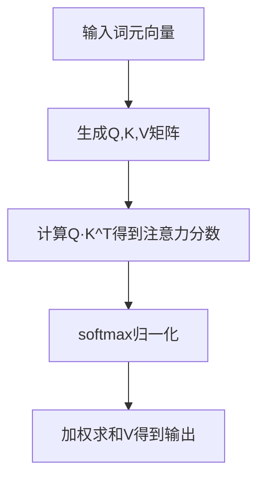
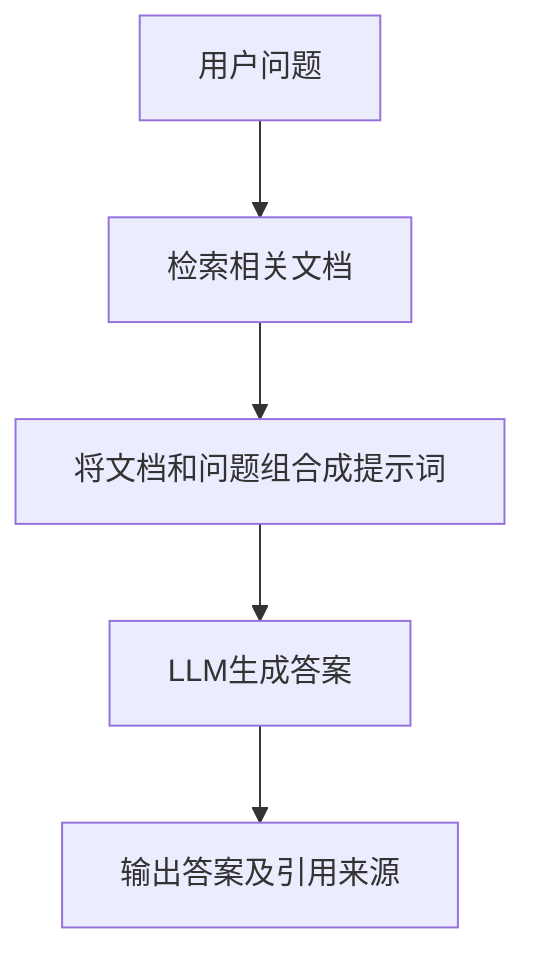
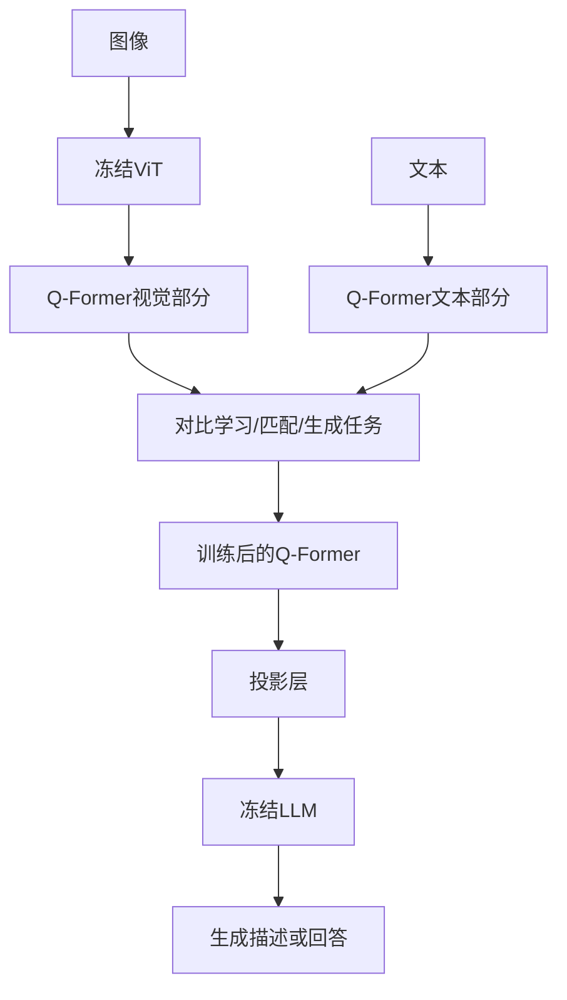
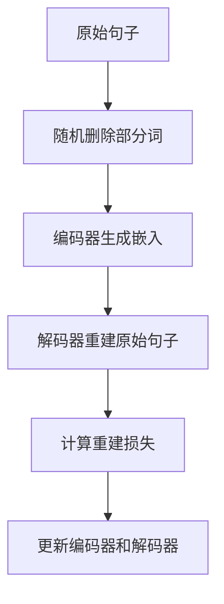
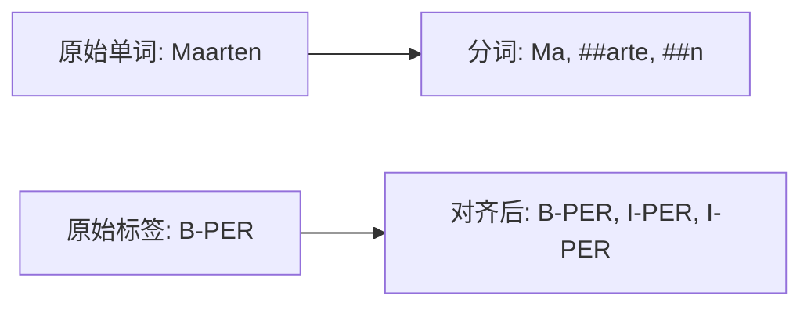
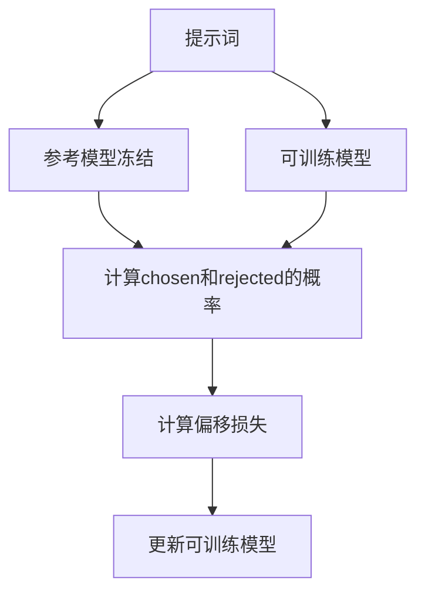

# 《图解大模型：生成式AI原理与实战》章节总结

## 书籍信息
- 书名：图解大模型：生成式AI原理与实战
- 作者：[沙特] 杰伊·阿拉马尔 (Jay Alammar)、[荷] 马尔滕·格鲁滕多斯特 (Maarten Grootendorst)
- 译者：李博杰
- PDF状态：基于扫描/OCR识别，文本可读，部分页码可能缺失或图表不完整。
- OCR状态：文本内容基本完整，部分页面有识别误差（如特殊符号），但整体可理解。

## 目录说明
- 目录识别情况：目录结构完整，包含三大部分（理解语言模型、使用预训练语言模型、训练和微调语言模型），共12章，外加附录、后记等。
- 章节对应依据：按原书页码顺序提取各章标题和内容。
- OCR修复说明：部分特殊词元（如`<|user|>`等）识别正确，流程图无法直接提取，将基于描述用Mermaid重建。

## 全书核心主题
本书系统讲解大语言模型（LLM）的原理、应用与微调。第一部分介绍LLM的基本概念、分词、嵌入和Transformer内部机制；第二部分聚焦预训练模型的实际应用，包括文本分类、聚类、主题建模、提示工程、高级生成技术、语义搜索、RAG和多模态模型；第三部分深入训练和微调技术，涵盖嵌入模型构建、分类任务微调、生成模型微调（包括QLoRA、DPO等）。全书强调直观理解，通过大量图解和代码示例帮助读者掌握LLM的核心技术与实践方法。

---

## 第1章：大语言模型简介

### 核心论点
本章回答“什么是大语言模型”以及“LLM如何发展至今”的问题。作者认为，LLM不仅包括生成模型（如GPT），也包括表示模型（如BERT），其核心是通过注意力机制和Transformer架构实现对语言的深度理解与生成。

### 关键概念/事件
- 词袋模型：早期文本表示方法，忽略词序和语义。
- word2vec：通过神经网络生成稠密词嵌入，捕捉语义相似性。
- 注意力机制：让模型关注输入序列中相关的部分，提升上下文理解。
- Transformer：完全基于自注意力的架构，支持并行训练，成为LLM的基础。
- 仅编码器模型（如BERT）：用于表示任务，如分类。
- 仅解码器模型（如GPT）：用于生成任务。
- 预训练+微调范式：先在海量数据上预训练，再在特定任务上微调。
- 上下文长度：模型能处理的最大词元数量。

### 逻辑推演/叙事脉络
从语言人工智能的历史出发，先介绍词袋模型的局限性，引出word2vec的静态嵌入，再到RNN与注意力机制的结合，最后聚焦于Transformer架构。作者区分了表示模型和生成模型，并指出LLM的训练分为预训练和微调两个阶段。接着讨论LLM的应用、社会责任、资源要求，最后通过Phi-3-mini模型生成第一个文本示例，展示实际使用流程。

### 经典金句/数据
> “语言人工智能这个术语与自然语言处理（NLP）经常可以互换使用。” (p.4)
> “LLM的‘大’是相对的，今天被认为‘大’的模型，明天可能就显得很小了。” (p.22)
> “创建LLM通常包含至少两个步骤：预训练和微调。” (p.22)

---

## 第2章：词元和嵌入

### 核心论点
本章解决“LLM如何将文本转换为数值表示”的问题。作者认为，分词器和嵌入机制是理解LLM内部工作的关键，不同分词策略（词级、子词级、字符级、字节级）和嵌入方法（静态vs上下文相关）直接影响模型性能。

### 关键概念/事件
- 分词器：将原始文本拆分为词元（token），每个词元对应唯一ID。
- 子词分词：如BPE、WordPiece，平衡词表大小与未登录词处理。
- 嵌入：将词元映射为稠密向量，捕捉语义信息。
- 上下文相关嵌入：模型根据上下文动态生成词元表示（如BERT输出）。
- 文本嵌入：用单个向量表示句子或文档（如sentence-transformers）。
- word2vec：通过对比学习训练静态词嵌入，用于推荐系统等。
- 分词器属性：词表大小、特殊词元、大小写处理、训练数据领域。

### 逻辑推演/叙事脉络
先展示分词器如何处理输入，通过下载Phi-3模型演示词元ID序列。然后比较BERT、GPT-2、GPT-4、FLAN-T5、StarCoder2、Galactica等模型的分词器差异，说明分词方法、参数和数据领域对分词结果的影响。接着引入词元嵌入，展示如何用DeBERTa生成上下文相关嵌入。最后扩展到句子嵌入和推荐系统中的嵌入应用，并以word2vec训练原理收尾。

### 流程图（分词器处理流程）


### 经典金句/数据
> “语言模型为分词器词表中的每个词元都保存了一个嵌入向量。” (p.49)
> “在word2vec等词嵌入空间中，存在king - man + woman ≈ queen的现象。” (p.54)
> “GPT-4分词器使用更少的词元来表示大多数词。” (p.45)

---

## 第3章：LLM的内部机制

### 核心论点
本章剖析Transformer LLM的工作原理，包括前向传播、自注意力、KV缓存、Transformer块等。作者强调模型一次生成一个词元，通过自注意力整合上下文，并通过前馈神经网络存储知识。

### 关键概念/事件
- 自回归生成：模型基于已生成的词元预测下一个词元。
- 前向传播：输入经过分词器、堆叠Transformer块、语言建模头，输出概率分布。
- 语言建模头：将最后一个词元的表示映射为词表大小的概率向量。
- KV缓存：缓存注意力计算中的键和值矩阵，避免重复计算，加速生成。
- 上下文长度：模型能处理的最大词元数，并行处理多条计算流。
- Transformer块结构：自注意力层 + 前馈神经网络层，配合残差连接和层归一化。
- 多头注意力：多个注意力头并行，捕捉不同模式。
- 注意力计算：查询(Q)、键(K)、值(V)矩阵，通过相关性评分和信息组合生成输出。

### 逻辑推演/叙事脉络
首先概述Transformer的输入输出，然后逐层解剖前向传播的组成（分词器、堆叠块、语言建模头）。解释自回归生成和采样策略（贪心、温度、top_p）。通过代码对比演示KV缓存的效果。深入Transformer块内部，分别讲解前馈神经网络和自注意力层的功能，并用简化图示展示注意力计算步骤（评分、组合）。最后讨论Transformer架构的最新改进：稀疏注意力、GQA、FlashAttention、RoPE等。

### 流程图（注意力计算）


### 经典金句/数据
> “Transformer LLM一次生成一个词元，而不是一次性生成全部文本。” (p.62)
> “KV缓存能显著加速生成过程，启用vs禁用缓存的时间比为4.5秒 vs 21.8秒。” (p.70)
> “自注意力机制使模型能够关注输入序列的所有部分，同时‘查看’前后文内容。” (p.14)

---

## 第4章：文本分类

### 核心论点
本章探讨使用预训练语言模型进行文本分类的多种方法。作者对比了特定任务模型（微调后的BERT）、嵌入模型（冻结嵌入+分类器）和生成模型（T5、ChatGPT）在情感分析任务上的表现，并强调零样本分类的可行性。

### 关键概念/事件
- 特定任务模型：如cardiffnlp/twitter-roberta-base-sentiment，直接输出类别。
- 嵌入模型：使用sentence-transformers生成文本嵌入，再训练逻辑回归分类器。
- 零样本分类：仅用标签描述（如“一条负面影评”）的嵌入与文档嵌入比较，无需标注数据。
- 生成模型分类：通过提示词引导生成模型输出类别标签（如FLAN-T5、GPT-3.5）。
- 评估指标：精确率、召回率、F1分数、准确率。

### 逻辑推演/叙事脉络
使用烂番茄电影评论数据集（正负各5331条），依次测试：① 预训练的特定任务模型（F1=0.80）；② 嵌入模型+逻辑回归（F1=0.85）；③ 零样本嵌入分类（F1=0.78）；④ FLAN-T5生成分类（F1=0.84）；⑤ GPT-3.5 API分类（F1=0.91）。结果表明，即使没有微调，嵌入模型和生成模型都能取得不错效果，专有模型性能更高但成本也高。

### 经典金句/数据
> “通过描述标签和文档并生成嵌入向量，我们就有了可用的数据。” (p.102)
> “在不使用任何标注数据的情况下，0.78的F1分数已经相当令人印象深刻了。” (p.103)
> “使用嵌入模型+逻辑回归的分类方式获得了0.85的F1分数。” (p.101)

---

## 第5章：文本聚类和主题建模

### 核心论点
本章讲解如何使用无监督方法对文本进行聚类和主题建模。作者提出“嵌入→降维→聚类”通用流程，并介绍BERTopic这一模块化框架，可结合生成模型生成主题标签。

### 关键概念/事件
- 文本聚类：将语义相似的文档分组，无需标签。
- 通用流程：嵌入模型（如gte-small）→ UMAP降维 → HDBSCAN聚类。
- 主题建模：从聚类中提取关键词或标签描述主题。
- BERTopic：基于c-TF-IDF（类词频-逆文档频率）生成主题表示，支持模块化替换。
- 表示模型：KeyBERTInspired、MMR、生成模型（FLAN-T5、GPT-3.5）用于优化主题标签。

### 逻辑推演/叙事脉络
以ArXiv计算与语言领域的44949篇摘要为例，首先用UMAP将384维嵌入降至5维，再用HDBSCAN生成156个簇。手动检查簇发现“手语翻译”等主题。然后引入BERTopic，自动生成关键词表示的主题。通过c-TF-IDF提取每个簇的显著词，并演示如何使用KeyBERTInspired、MMR和GPT-3.5重排序或生成可读标签（如“Neural Machine Translation Enhancements”）。

### 流程图（BERTopic流程）
```mermaid
graph TD
    A[文档] --> B[嵌入模型]
    B --> C[降维(UMAP)]
    C --> D[聚类(HDBSCAN)]
    D --> E[每个簇计算c-TF-IDF]
    E --> F[生成关键词表示]
    F --> G[可选的表示模型重排序/生成标签]
```

### 经典金句/数据
> “BERTopic的模块化设计允许你自由选择流程中的任意模型。” (p.124)
> “仅凭搜索引擎与计算器，智能体便能准确输出答案。” (p.190)
> “我们生成了156个簇。” (p.119)

---

## 第6章：提示工程

### 核心论点
本章阐述如何通过设计提示词来引导生成模型输出高质量响应。作者强调提示词的可迭代组件化设计（角色、指令、上下文、格式等），以及高级技术如思维链、自洽性、思维树。

### 关键概念/事件
- 温度（temperature）和top_p：控制输出随机性。
- 提示词组件：角色定位、指令、上下文、格式、受众、语气、数据。
- 上下文学习：零样本、单样本、少样本提示。
- 链式提示：将复杂问题分解为多个提示词步骤。
- 思维链：先推理再回答（如“让我们逐步思考”）。
- 自洽性：多次采样取多数答案。
- 思维树：探索多个中间思考过程。
- 输出验证：通过示例或约束采样（如JSON语法）控制输出格式。

### 逻辑推演/叙事脉络
从加载生成模型开始，演示temperature和top_p的影响。然后介绍提示词的基本要素，以情感分类为例构建复杂提示词。接着展示链式提示创建产品名称、口号、销售宣传语。随后引入思维链、自洽性和思维树，用数学问题证明其有效性。最后讨论输出验证，通过少样本学习和约束采样（llama-cpp-python）确保JSON格式输出。

### 流程图（思维链）


### 经典金句/数据
> “提示工程不仅仅是设计效果良好的提示词这么简单。” (p.145)
> “‘让我们逐步思考’可以显著改善输出。” (p.156)
> “使用约束采样，LLM只输出我们感兴趣的内容。” (p.164)

---

## 第7章：高级文本生成技术与工具

### 核心论点
本章介绍LangChain框架中的高级组件：链（Chain）、记忆（Memory）和智能体（Agent）。作者展示如何通过模块化组合提升LLM应用的能力，如多提示词链、对话记忆、ReAct智能体。

### 关键概念/事件
- 链：将提示词模板与LLM连接，支持多步骤流程。
- 提示词模板：为Phi-3等模型定制`<|user|>`格式。
- 记忆类型：对话缓冲区（完整历史）、窗口式缓冲区（最后k轮）、对话摘要（用LLM压缩）。
- 智能体：使用ReAct框架（思考-行动-观察）调用外部工具（搜索引擎、计算器）。
- 量化：用更少位数表示模型权重，降低显存（如GGUF格式）。

### 逻辑推演/叙事脉络
先通过LangChain加载量化后的Phi-3 GGUF模型，构建基础链。然后构建多提示词链：先生成标题，再生成角色，最后生成故事。接着比较三种记忆机制：缓冲区记住名字但会超长，窗口式只保留最近两轮，摘要能压缩历史但需额外LLM调用。最后构建ReAct智能体，集成DuckDuckGo搜索和计算器，解决“MacBook Pro美元转欧元”问题。

### 流程图（ReAct智能体）
```mermaid
graph TD
    A[用户问题] --> B[智能体思考]
    B --> C{需要工具?}
    C -->|是| D[执行行动(搜索/计算)]
    D --> E[观察结果]
    E --> B
    C -->|否| F[生成最终答案]
```

### 经典金句/数据
> “LangChain的名称源自其核心方法之一——链（chain）。” (p.171)
> “使用对话缓冲区记忆，LLM能记住名字，但对话历史会无限增长。” (p.178)
> “智能体可以自主创建目标实现路径，具备自我纠错能力。” (p.185)

---

## 第8章：语义搜索与RAG

### 核心论点
本章讲解语言模型在搜索领域的三大应用：稠密检索、重排序和RAG（检索增强生成）。作者认为，通过向量相似度检索结合生成模型，可以大幅提升搜索的相关性和事实性。

### 关键概念/事件
- 稠密检索：将查询和文档嵌入同一向量空间，用余弦相似度检索最近邻。
- 重排序：用交叉编码器（如monoBERT）对初检结果重新评分排序。
- RAG：检索相关文档后，将其作为上下文输入LLM生成答案，附带引用来源。
- 评估指标：均值平均精确率（mAP）、nDCG。
- 分块策略：将长文档分割为重叠块，避免上下文断裂。
- 向量数据库：如FAISS，用于高效近似最近邻搜索。

### 逻辑推演/叙事脉络
以《星际穿越》维基百科文本为例，用Cohere API生成句子嵌入（4096维），建立FAISS索引。演示稠密检索（“how precise was the science”返回科学准确性相关句子）比BM25关键词搜索更语义化。接着使用Cohere重排序API进一步优化结果。然后构建RAG系统：检索相关句子后，用Cohere chat或本地Phi-3模型生成基于上下文的答案。最后介绍高级RAG技术（查询改写、多查询、多跳、路由）和评估方法（忠实度、答案相关性）。

### 流程图（RAG流程）


### 经典金句/数据
> “重排器可使性能指标nDCG@10从36.5提升至62.8。” (p.206)
> “RAG系统兼具检索与生成的双重能力，有效减少了幻觉现象。” (p.211)
> “均值平均精确率（mAP）是评估搜索系统的常用指标。” (p.207)

---

## 第9章：多模态LLM

### 核心论点
本章探讨如何让LLM理解图像等多模态信息。作者介绍视觉Transformer（ViT）、CLIP跨模态嵌入和BLIP-2多模态生成模型，展示图像描述、视觉问答等应用。

### 关键概念/事件
- ViT：将图像分割为16×16的块，线性投影后输入Transformer编码器。
- CLIP：通过对比学习对齐图像和文本嵌入，支持零样本分类和跨模态检索。
- BLIP-2：使用Q-Former桥接冻结的ViT和LLM，只训练Q-Former实现多模态生成。
- 跨模态相似度：图像和文本嵌入在相同向量空间可比。
- 视觉问答：同时输入图像和文本问题，模型生成回答。

### 逻辑推演/叙事脉络
先介绍ViT的分块嵌入原理。然后详细解析CLIP：双编码器（文本+图像），通过余弦相似度最大化匹配图文对、最小化非匹配对，得到共享嵌入空间。用OpenCLIP演示计算图像和文本嵌入的相似度（小狗在雪地）。接着深入BLIP-2架构：两个训练阶段（表示学习和生成学习），Q-Former学习软视觉提示词。最后用BLIP-2实现图像描述（跑车、罗夏墨迹）和视觉问答聊天机器人。

### 流程图（BLIP-2训练）


### 经典金句/数据
> “CLIP是一种能同时计算图像嵌入与文本嵌入的先进模型。” (p.224)
> “BLIP-2通过构建Q-Former巧妙连接预训练视觉编码器与预训练LLM。” (p.231)
> “一张画着蝙蝠的黑白墨水画——罗夏墨迹测验图像被BLIP-2识别为蝙蝠。” (p.240)

---

## 第10章：构建文本嵌入模型

### 核心论点
本章讲解如何从头训练或微调文本嵌入模型，核心方法是对比学习。作者介绍sentence-transformers框架、常用损失函数（余弦相似度、MNR）以及无监督方法（TSDAE）。

### 关键概念/事件
- 对比学习：通过正例（相似）和负例（不相似）训练模型，使相似文档的嵌入靠近。
- SBERT（双编码器）：孪生网络结构，池化词元嵌入生成句子嵌入。
- 损失函数：SoftmaxLoss、CosineSimilarityLoss、MultipleNegativesRankingLoss（MNR）。
- 难负例：与查询相关但不是正确答案的文档，提升训练难度。
- 增强型SBERT：用小标注集训练交叉编码器，标注大量未标注数据，再用其训练双编码器。
- TSDAE：无监督训练，对输入加噪（删除词），用编码器-解码器重建原句，获得句子嵌入。

### 逻辑推演/叙事脉络
从嵌入模型的基本概念出发，定义对比学习。然后使用MNLI数据集（蕴含/矛盾）训练SBERT模型，比较不同损失函数的性能：SoftmaxLoss（Pearson余弦0.59）、CosineSimilarityLoss（0.72）、MNR（0.80）。接着演示微调预训练的all-MiniLM-L6-v2模型获得0.85分。介绍增强型SBERT：仅用10k标注数据生成白银数据集，达到0.71分（原完整数据集0.72）。最后用TSDAE在无监督下得到0.70分，并讨论领域适配。

### 流程图（TSDAE无监督训练）


### 经典金句/数据
> “对比学习的目标是训练嵌入模型，使相似文档在向量空间中距离更近，而不相似文档相距更远。” (p.249)
> “使用MNR损失函数训练的模型pearson_cosine值为0.80，优于余弦相似度损失函数的0.72。” (p.263)
> “增强型SBERT仅用20%的数据就获得了0.71的分数。” (p.271)

---

## 第11章：为分类任务微调表示模型

### 核心论点
本章讲解如何微调BERT等表示模型以提升分类性能。作者比较全量微调、冻结层微调、少样本SetFit、继续预训练（MLM）和命名实体识别（NER）微调。

### 关键概念/事件
- 监督微调：在预训练BERT上添加分类头，端到端更新参数（F1=0.85）。
- 冻结层：仅训练分类头（F1=0.63）或仅最后几层（F1=0.8），节省计算。
- SetFit：少样本框架，每个类别仅需16个样本，通过对比学习微调嵌入模型再训练分类器（F1=0.84）。
- 继续预训练：在领域数据上执行掩码语言建模，更新BERT权重（如将“horrible [MASK]”从“idea”变为“movie”）。
- 命名实体识别：词元级分类，使用CoNLL-2003数据集，需对齐子词标签。

### 逻辑推演/叙事脉络
先使用烂番茄数据集微调bert-base-cased，获得F1=0.85。然后演示冻结所有层除分类头，F1降至0.63；仅冻结前10个编码器块，F1=0.8。接着用SetFit，每类16样本训练all-mpnet-base-v2，F1=0.84。随后进行继续预训练：在相同数据集上执行MLM 10个epoch，发现掩码预测从“idea”变为“movie”，更适合领域。最后介绍NER微调，详细展示标签对齐过程（如“Maarten”拆分为“Ma”“##arte”“##n”对应B-PER、I-PER、I-PER）。

### 流程图（NER标签对齐）


### 经典金句/数据
> “微调预训练的BERT模型F1分数为0.85，高于直接使用预训练特定任务模型的0.80。” (p.281)
> “SetFit仅用32个标注句子就达到了0.84的F1分数。” (p.291)
> “继续预训练后，[MASK]预测从‘idea’变为‘movie’，更贴合电影评论数据。” (p.296)

---

## 第12章：微调生成模型

### 核心论点
本章介绍生成模型的微调方法，包括监督微调（SFT）和偏好调优（DPO）。作者强调参数高效微调（LoRA、QLoRA）和直接偏好优化（DPO）的实际应用。

### 关键概念/事件
- 训练三步：预训练（语言建模）→ SFT（指令微调）→ 偏好调优（对齐人类偏好）。
- LoRA：低秩分解权重矩阵，仅更新小矩阵，大幅减少可训练参数。
- QLoRA：结合4位量化、双重量化和分页优化器，进一步降低显存。
- 指令数据：格式化为对话模板（如`<|user|>...<|assistant|>`）。
- DPO：直接优化偏好，无需单独训练奖励模型，通过比较参考模型和可训练模型的输出概率实现。
- 评估：困惑度、基准测试（MMLU、GSM8k）、LLM-as-a-judge、人工评估（Chatbot Arena）。

### 逻辑推演/叙事脉络
先解释全量微调与参数高效微调的区别，介绍LoRA原理。然后以TinyLlama为例，使用UltraChat数据集（3000个对话），通过QLoRA进行指令微调：4位量化加载模型、配置LoRA（秩64）、训练1个epoch，耗时约1小时。合并权重后测试，模型能正确回答“Tell me about LLMs”。接着介绍DPO：使用偏好数据集（chosen/rejected），同样用QLoRA训练200步。最后讨论评估方法，强调古德哈特定律：“当一个指标成为目标时，它就不再是一个好的指标。”

### 流程图（DPO训练）


### 经典金句/数据
> “LoRA只需要微调一小部分参数，大幅降低成本。” (p.312)
> “QLoRA使加载模型仅需约1 GB显存，而不量化需要4 GB。” (p.319)
> “古德哈特定律：当一个指标成为目标时，它就不再是一个好的指标。” (p.326)

---

## 附录：图解DeepSeek-R1

### 核心论点
附录解析DeepSeek-R1的训练方法，特别是通过强化学习激发推理能力。作者认为，利用可验证的推理问题（如代码、数学）自动生成奖励信号，能训练出强大的推理模型。

### 关键概念/事件
- DeepSeek-R1-Zero：仅用强化学习（跳过SFT）训练的推理模型，推理能力媲美o1。
- 推理导向的强化学习：对每个问题生成多个答案，用规则（如代码执行、单元测试）自动评分，更新模型。
- 冷启动数据：少量人工标注的长链思维示例，用于初始化SFT。
- 临时推理模型：用冷启动+强化学习训练，生成60万个推理数据点。
- 通用强化学习：结合有用性和安全性奖励模型，提升非推理任务表现。
- GRPO：分组相对策略优化，无需评论家模型，节省显存。

### 逻辑推演/叙事脉络
先回顾大模型训练三步，指出DeepSeek-R1从DeepSeek-V3-Base开始。然后重点介绍R1-Zero：用强化学习直接训练基座模型，在数学和编程问题上通过自动验证（执行代码、检查结果）获得奖励信号，模型自然学会“思考词元”（response length增加）。但R1-Zero可读性差、语言混杂，所以DeepSeek-R1引入冷启动数据（几千条）进行SFT，再用强化学习生成大规模数据，最后用通用强化学习对齐。展示论文图表证明R1-Zero准确率随训练步数提升，响应长度也增加。

### 流程图（DeepSeek-R1训练）
```mermaid
graph TD
    A[DeepSeek-V3-Base] --> B[冷启动SFT (少量长链思维)]
    B --> C[推理强化学习 (生成60万数据)]
    C --> D[大规模SFT (60万推理数据+非推理数据)]
    D --> E[通用强化学习 (有用性+安全性奖励)]
    E --> F[DeepSeek-R1]
```

### 经典金句/数据
> “DeepSeek-R1-Zero无须依赖标注的监督微调训练集，就能在推理任务中表现出色。” (p.342)
> “推理问题可以实现自动验证与标注。” (p.342)
> “随着训练进行，模型生成响应长度自然增加，表示花更多时间‘思考’。” (p.345)

---

## 后记

### 核心论点
作者鼓励读者继续探索LLM领域，强调本书提供的知识足以让读者适应未来的新发展。期待读者利用LLM做出有意义的贡献。

### 经典金句/数据
> “对LLM的探索才刚刚开始，未来还有许多令人兴奋的进展。” (p.349)