好的，收到您的指令。作为专业的书籍解读与知识架构分析师，我将严格遵循您提供的结构化解读与Markdown总结增强版Prompt，对您上传的三份PDF资料进行系统化处理。

这三份PDF（《手绘图解HTTP》、《手绘图解计算机基础》、《图解网络》）内容高度相关，共同构成了一个从HTTP应用层到底层硬件、再到网络协议栈的完整知识体系。我将以《图解网络》为主线，因为它最贴近面试题和核心网络概念，同时将《手绘图解HTTP》和《手绘图解计算机基础》中的深度内容作为补充和扩展，整合到一个统一的、逻辑连贯的Markdown文档中。

整个处理过程将严格遵守“严格按目录顺序输出”、“禁止主观扩写”、“OCR/PDF容错处理”等核心原则，并完成对流程图的重建、核心概念的提炼以及Prompt的专项整理。

以下是最终生成的Markdown文档。

# 《图解网络》及配套资料：结构化知识总结

## 书籍信息

- **主书名**：《图解网络》
- **作者/来源**：小林coding（公众号）
- **配套资料**：《手绘图解HTTP》、《手绘图解计算机基础》
- **PDF状态**：图文混合，包含手绘图、文字和代码示例。
- **OCR状态**：文本可识别，部分图表为图片格式，已根据内容进行逻辑重建。

## 全书核心主题

本套资料旨在通过图解和问答形式，系统性讲解计算机网络的核心知识。内容涵盖了从浏览器输入URL到页面展示的完整过程，深入剖析了HTTP协议的发展历程（HTTP/1.1, HTTP/2, HTTP/3）、核心面试题、HTTPS的安全机制，并对TCP/IP协议栈（IP、TCP、UDP、DNS等）进行了深度拆解，包括三次握手、四次挥手、重传机制、滑动窗口、流量控制和拥塞控制等。最后，还补充了计算机基础（CPU、内存、二进制）作为底层知识铺垫，形成了一套完整的知识闭环。

---

## 第一部分：HTTP 基础与核心概念

### 第1章：HTTP基本概念

#### 1. 核心论点
- **问题**：什么是HTTP协议？如何准确理解“超文本传输协议”？
- **观点**：HTTP是一个在计算机世界里专门在“两点”之间“传输”文字、图片、音频、视频等“超文本”数据的“约定和规范”。

#### 2. 关键概念
- **协议**：多个参与者之间的行为约定和规范。在计算机中，是计算机之间交流通信的规范。
- **传输**：将数据从A点搬到B点的过程，是双向的，允许中间有中转（如代理、网关）。
- **超文本**：超越了普通文本的文本，是文字、图片、视频等的混合体，最关键的特性是有超链接。

#### 3. 逻辑推演
- **从字面拆解**：将“超文本传输协议”拆解为“协议”、“传输”、“超文本”三个部分。
- **协议的本质**：通过类比“三方协议”、“租房协议”等生活实例，说明协议需要两个以上参与者以及行为规范。
- **传输的特性**：强调HTTP是双向协议，且允许中间节点参与（A <-> N <-> B），并指出“从服务器传输到浏览器”的说法不准确，应是“两点之间”。
- **超文本的演变**：从早期的简单字符文本，扩展到图片、音频、视频，再到具备超链接跳转能力的复合文档（如HTML）。

#### 4. 经典金句/数据
> “HTTP是一个在计算机世界里专门在『两点』之间『传输』文字、图片、音频、视频等『超文本』数据的『约定和规范』。”

### 第2章：HTTP 常见状态码与字段

#### 1. 核心论点
- **问题**：HTTP常见的状态码有哪些？它们分别代表什么意思？HTTP报文中常见的字段有什么作用？
- **观点**：状态码用以表示服务器对请求的处理结果，分为5大类。常见字段用于控制缓存、连接管理、内容协商等。

#### 2. 关键概念
- **1xx（提示信息）**：协议处理的中间状态，实际用到的较少。
- **2xx（成功）**：服务器成功处理了客户端请求。如 **200 OK**，**204 No Content**，**206 Partial Content**。
- **3xx（重定向）**：资源位置发生变动，需要客户端重新发送请求。如 **301 Moved Permanently**，**302 Found**，**304 Not Modified**。
- **4xx（客户端错误）**：请求报文有误，服务器无法处理。如 **400 Bad Request**，**403 Forbidden**，**404 Not Found**。
- **5xx（服务器错误）**：服务器内部发生了错误。如 **500 Internal Server Error**，**502 Bad Gateway**，**503 Service Unavailable**。
- **Host字段**：指定服务器的域名，用于将请求发往同一台服务器上的不同网站。
- **Content-Length字段**：表明本次回应的数据长度。
- **Connection字段**：常用于要求服务器使用TCP持久连接（Keep-Alive）。
- **Content-Type字段**：告诉客户端本次数据的格式（如 `text/html; charset=utf-8`）。
- **Content-Encoding字段**：说明数据的压缩方法（如 `gzip`）。

#### 3. 逻辑推演
- **状态码分类**：通过首位数字（1-5）对不同含义的状态码进行宏观分类，再分别介绍每类中最具代表性的几个状态码及其使用场景。
- **字段功能划分**：将常见字段按功能进行介绍，如`Host`用于定位，`Content-Type/Length/Encoding`用于描述数据本身，`Connection`用于管理传输连接。

### 第3章：GET 与 POST

#### 1. 核心论点
- **问题**：GET和POST有什么区别？它们都是安全和幂等的吗？
- **观点**：GET是从服务器获取资源，是安全且幂等的；POST是向服务器提交数据，不安全且不幂等。

#### 2. 关键概念
- **安全**：请求方法不会破坏服务器上的资源。
- **幂等**：多次执行相同的操作，结果都是相同的。
- **GET方法**：请求从服务器获取资源，是“只读”操作。
- **POST方法**：向URI指定的资源提交数据，数据放在报文的body里。

#### 3. 逻辑推演
- **功能定义**：明确GET和POST的语义：GET用于“拿”，POST用于“交”。
- **性质分析**：基于定义，分析GET操作是安全的、幂等的；POST操作会改变服务器状态，因此是不安全、不幂等的。
- **常见误区澄清**：解释了登录状态保持依靠Cookie，而非HTTP方法本身有记忆功能。

#### 4. 经典金句/数据
> “GET 方法就是安全且幂等的，因为它是『只读』操作，无论操作多少次，服务器上的数据都是安全的，且每次的结果都是相同的。”
> “POST 因为是『新增或提交数据』的操作，会修改服务器上的资源，所以是不安全的，且多次提交数据就会创建多个资源，所以不是幂等的。”

---

## 第二部分：HTTP 演进与安全

### 第4章：HTTP 特性、优缺点与性能

#### 1. 核心论点
- **问题**：HTTP/1.1有哪些优点和缺点？它的性能瓶颈在哪里？
- **观点**：HTTP/1.1优点是简单、灵活、易于扩展；缺点是无状态、明文传输、不安全，性能上存在队头阻塞问题。

#### 2. 关键概念
- **长连接**：HTTP/1.1的默认连接方式，减少了TCP重复建立和断开的开销。
- **管道传输**：在同一个TCP连接内，客户端可以同时发起多个请求，但服务器必须按顺序回应，这是解决队头阻塞的早期尝试。
- **队头阻塞**：当顺序发送的请求序列中有一个被阻塞时，后面所有请求也一同被阻塞。

#### 3. 逻辑推演
- **优点分析**：从协议设计（简单）、可扩展性（下层可换为HTTPS/HTTP3）和应用广泛性三个角度阐述其优点。
- **双刃剑剖析**：详细论述了“无状态”在减轻服务器负担和导致繁琐的身份验证之间的矛盾，并引出Cookie作为解决方案。同样，论述了“明文传输”在带来便利性的同时也带来了巨大的安全风险。
- **性能瓶颈拆解**：指出HTTP/1.1虽引入了长连接和管道，但“请求-应答”模式和必须按顺序响应的机制导致了严重的“队头阻塞”问题，限制了其性能。

#### 4. 流程图（重建）

**HTTP/1.1 队头阻塞问题**
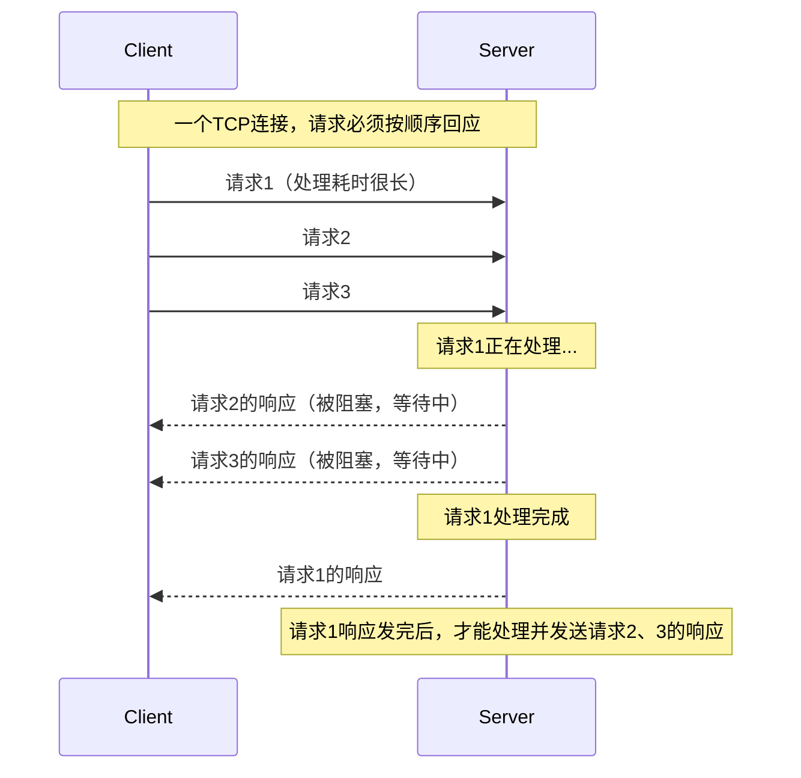

### 第5章：HTTPS 与 HTTP 的区别

#### 1. 核心论点
- **问题**：HTTP存在哪些安全问题？HTTPS是如何解决这些问题的？HTTPS的工作原理是什么？
- **观点**：HTTPS = HTTP + SSL/TLS，通过混合加密、摘要算法和数字证书，解决了HTTP的窃听、篡改和冒充风险。

#### 2. 关键概念
- **混合加密**：非对称加密用于安全交换“会话秘钥”，对称加密用于后续通信，兼顾安全与效率。
- **摘要算法**：为数据生成独一无二的“指纹”，用于校验数据完整性。
- **数字证书**：由CA（证书认证机构）颁发，将服务器公钥与服务器身份绑定，解决公钥信任问题。
- **SSL/TLS握手**：HTTPS建立连接前的关键步骤，用于协商加密套件、交换秘钥和验证身份。

#### 3. 逻辑推演
- **风险提出**：明确指出HTTP明文传输导致的三大风险：窃听、篡改、冒充。
- **解决方案对应**：针对三大风险，分别给出HTTPS的解决方案：混合加密（防窃听）、摘要算法（防篡改）、数字证书（防冒充）。
- **握手流程拆解**：详细阐述TLS 1.2的4次握手过程（ClientHello, ServerHello, 客户端回应, 服务器最后回应），说明客户端和服务器如何通过三个随机数生成最终的“会话秘钥”。

#### 4. 流程图（重建）

**HTTPS （TLS 1.2） 握手流程**
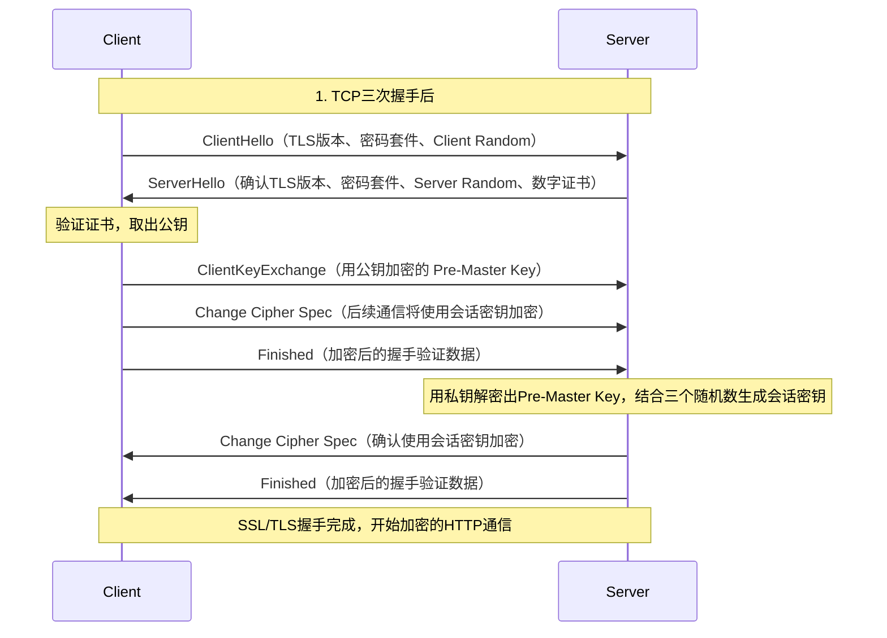

### 第6章：HTTP/1.1、HTTP/2、HTTP/3 的演变

#### 1. 核心论点
- **问题**：从HTTP/1.1到HTTP/2再到HTTP/3，协议经历了哪些重要的性能优化？解决了什么问题？
- **观点**：HTTP/2通过头部压缩、二进制格式、多路复用和服务器推送解决了HTTP/1.1的队头阻塞问题；HTTP/3将底层传输协议从TCP改为UDP（QUIC），从根本上解决了TCP层面的队头阻塞。

#### 2. 关键概念
- **头部压缩（HPACK）**：在客户端和服务器维护一张头部信息表，通过索引号代替重复字段，减少头部开销。
- **二进制格式**：HTTP/2不再使用纯文本，而是采用二进制帧（Headers Frame, Data Frame），提高了计算机解析效率。
- **多路复用**：在一个TCP连接上并发处理多个请求/响应，数据包被标记后交错发送，彻底解决了应用层的队头阻塞。
- **服务器推送**：服务器可主动向客户端发送资源，如请求HTML时主动推送CSS和JS文件。
- **QUIC协议**：HTTP/3基于UDP实现的协议，集成了TLS加密和多路复用，解决了TCP的队头阻塞和连接建立慢的问题。

#### 3. 逻辑推演
- **HTTP/1.1瓶颈**：回顾其性能瓶颈（头部冗余、队头阻塞），引出优化的必要性。
- **HTTP/2的优化**：针对每个瓶颈提出解决方案：头部冗余→HPACK压缩；文本解析慢→二进制格式；串行阻塞→多路复用数据流；被动响应→服务器推送。
- **HTTP/2的遗留问题**：指出HTTP/2仍然依赖TCP，而TCP的可靠性机制（保证顺序到达）在丢包时会导致所有数据流等待，即TCP层面的队头阻塞。
- **HTTP/3的革命**：为了解决TCP的固有问题，HTTP/3直接更换底层为UDP，并实现QUIC协议。QUIC在UDP上实现了类似TCP的可靠传输、拥塞控制，同时支持多路复用，且单个流丢包不影响其他流。

#### 4. 流程图（重建）

**HTTP/2 多路复用**
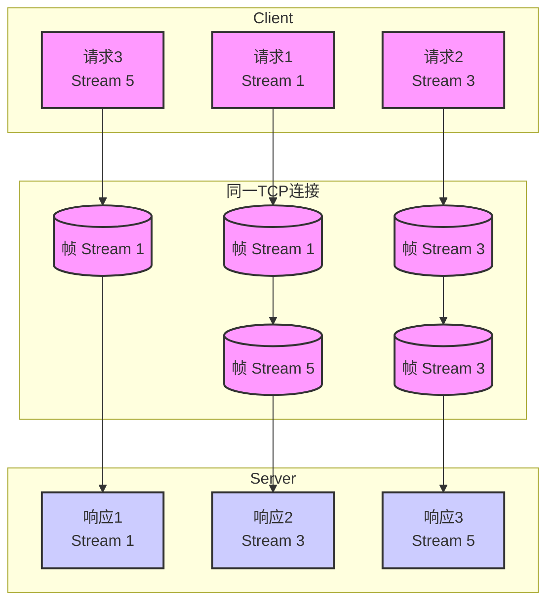
---

## 第三部分：网络协议栈深入（IP & DNS）

### 第7章：IP 基础

#### 1. 核心论点
- **问题**：什么是IP地址？IP地址如何分类？IPv4和IPv6有何不同？
- **观点**：IP地址用于标识网络中的节点，是网络层的寻址基础。从分类地址到无分类地址CIDR，再到IPv6，是为了解决IP地址资源枯竭和提高路由效率。

#### 2. 关键概念
- **IP地址（IPv4）**：32位正整数，点分十进制表示，约43亿个。
- **网络号和主机号**：IP地址由这两部分组成，用于区分网络和网络内的设备。
- **分类地址（A/B/C类）**：早期按固定长度划分网络号和主机号，存在地址浪费问题。
- **无分类地址（CIDR）**：通过`a.b.c.d/x`表示，前x位为网络号，灵活划分网络。
- **子网掩码**：与IP地址按位与运算得到网络号。
- **公网IP vs 私有IP**：公网IP全球唯一，由ICANN管理；私有IP用于局域网，可重复使用。
- **IPv6**：128位地址，解决了地址枯竭问题，并带来更好的安全性和扩展性。

#### 3. 逻辑推演
- **IP的作用**：通过与MAC地址对比（旅行行程表 vs 车票），说明IP负责远程定位，MAC负责同一链路内的传输。
- **地址分类的演进**：从A/B/C分类地址的“简单明了”但“浪费”的缺点，引出CIDR的灵活性。介绍子网掩码的作用，并通过实例演示如何进行子网划分。
- **公私网隔离**：通过小区门牌号的类比，解释私有IP用于内部管理、公网IP用于全球唯一标识，以及NAT技术如何缓解IPv4枯竭。
- **IPv6的必要性**：因为IPv4地址在2011年已分配完毕，所以必须引入128位的IPv6，并介绍其优势。

### 第8章：DNS 域名解析协议

#### 1. 核心论点
- **问题**：我们是如何通过域名（如 `www.baidu.com`）找到服务器IP地址的？
- **观点**：DNS是一个分层的分布式数据库，通过递归查询和迭代查询，将人类易记的域名转换为机器可读的IP地址。

#### 2. 关键概念
- **域名层级**：根域（.） -> 顶级域（TLD，如 `.com`） -> 权威域（如 `server.com`）。
- **本地DNS服务器**：由ISP提供，作为客户端查询的“代理”。
- **根DNS服务器**：最高层次，不直接解析，但指引如何找到顶级域服务器。
- **权威DNS服务器**：返回域名最终解析结果的服务器。

#### 3. 逻辑推演
- **查询过程**：以访问`www.server.com`为例，分8步走。从浏览器缓存，到本地DNS服务器查询，再到根DNS、顶级域DNS、权威DNS的层层“问路”，最终将IP地址返回给客户端。
- **类比说明**：整个过程被比作“找人问路”，每个服务器只指引下一站的方向，不负责带路。

#### 4. 流程图（重建）

**DNS 解析流程**
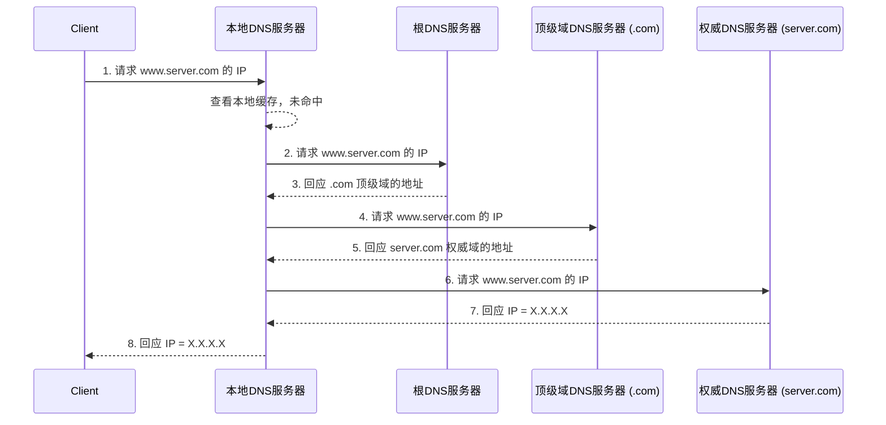

---

## 第四部分：TCP 协议详解

### 第9章：TCP 三次握手与四次挥手

#### 1. 核心论点
- **问题**：TCP为什么要进行三次握手？为什么断开连接需要四次挥手？
- **观点**：三次握手是为了防止历史连接建立、同步双方初始序列号、避免资源浪费。四次挥手是因为TCP是全双工的，双方需要独立关闭各自的发送通道。

#### 2. 关键概念
- **序列号（SEQ）**：解决网络包乱序问题。
- **确认应答号（ACK）**：解决不丢包问题。
- **控制位（SYN, ACK, FIN, RST）**：用于管理连接状态。
- **半连接队列（SYN Queue）**：存放收到SYN但未完成握手的连接。
- **全连接队列（Accept Queue）**：存放已完成三次握手，等待应用层accept()的连接。
- **SYN攻击**：攻击者伪造IP地址发送大量SYN报文，占满服务端半连接队列，使其无法响应正常请求。
- **2MSL**：Maximum Segment Lifetime，报文最大生存时间，TIME_WAIT状态持续2MSL（Linux默认为60秒）。

#### 3. 逻辑推演
- **三次握手原因分析**：从“阻止历史连接”、“同步序列号”、“避免资源浪费”三个深层原因，反驳了“保证双方收发能力”的片面回答。通过图示说明两次握手无法有效阻止历史SYN报文造成的连接混乱。
- **四次挥手过程拆解**：详细描述主动关闭方（FIN_WAIT1, FIN_WAIT2, TIME_WAIT）和被动关闭方（CLOSE_WAIT, LAST_ACK）的状态变迁。解释为什么挥手比握手多一次：因为ACK和FIN通常是分开发送的（被动方可能还有数据要发）。
- **TIME_WAIT的必要性**：从两个角度阐明。一是防止“旧连接”的延迟数据包被“新连接”误收；二是确保被动关闭方能收到最后的ACK，以正常关闭。

#### 4. 流程图（重建）

**TCP 三次握手**
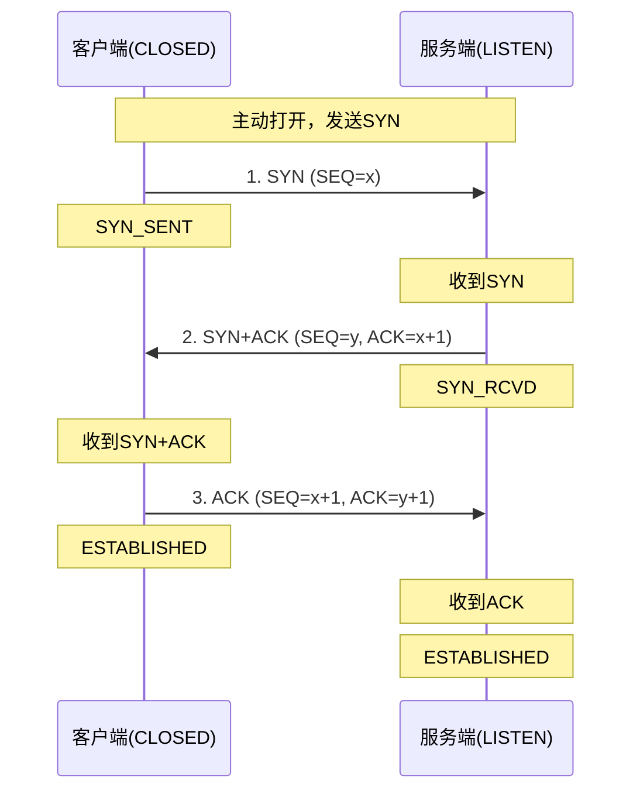

**TCP 四次挥手**
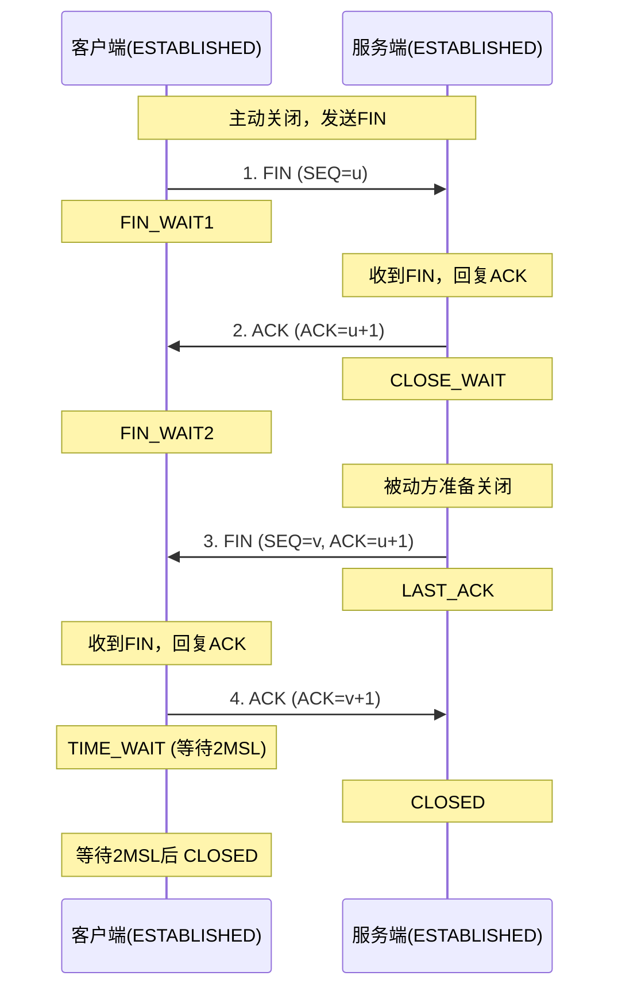

### 第10章：TCP 重传、窗口、流量控制与拥塞控制

#### 1. 核心论点
- **问题**：TCP是如何通过重传、窗口、流量控制和拥塞控制来保证可靠性和传输效率的？
- **观点**：重传机制处理丢包；滑动窗口实现高效传输；流量控制协调收发双方速率；拥塞控制感知网络状况并动态调整发送速率，共同构成了TCP的可靠性保障体系。

#### 2. 关键概念
- **超时重传（RTO）**：设置定时器，超时未收到ACK则重传数据。RTO基于RTT动态计算。
- **快速重传**：收到3个相同的重复ACK后，立即重传丢失的包，无需等待超时。
- **选择性确认（SACK）**：告诉发送方具体哪些数据收到、哪些没收到，实现只重传丢失部分。
- **滑动窗口**：允许发送方在收到ACK前连续发送多个数据包，窗口大小由接收方（接收窗口rwnd）和网络（拥塞窗口cwnd）共同决定。
- **流量控制**：根据接收方的处理能力（接收窗口）动态调整发送方的发送速率，避免接收方缓冲区溢出。
- **拥塞控制**：发送方感知网络拥堵程度（通过丢包事件）并动态调整发送速率，包含**慢启动**、**拥塞避免**、**拥塞发生**、**快速恢复**四个算法。

#### 3. 逻辑推演
- **从丢包到重传**：从最基本的丢包问题出发，引出超时重传，并指出其效率低下的问题，再引出更高效的快速重传和SACK机制。
- **从停等到窗口**：从低效的“发一个等一个”模式，引出滑动窗口的概念，说明窗口如何允许“批量发送、累计确认”来提升效率。同时解释窗口大小由接收方决定。
- **从接收到发送**：在介绍完接收方窗口后，引入网络拥堵的可能性，说明发送方不能只看接收方脸色，还要关注网络状况，从而引出拥塞控制。
- **拥塞控制算法**：详细说明慢启动（指数增长到门限）、拥塞避免（线性增长）、拥塞发生（超时重传时cwnd置1；快速重传时cwnd减半）、快速恢复（在快速重传后直接进入拥塞避免）的机制和配合。

#### 4. 流程图（重建）

**TCP 拥塞控制算法示意图**
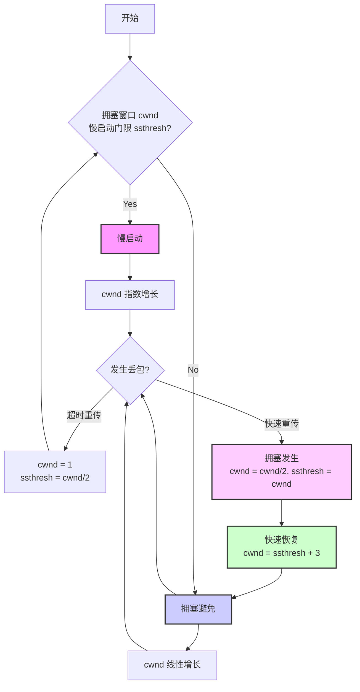

---

## 第五部分：计算机基础补充（来自《手绘图解计算机基础》）

### 第11章：CPU 与内存

#### 1. 核心论点
- **问题**：CPU是如何执行程序的？内存在其中扮演什么角色？
- **观点**：CPU是寄存器的集合体，通过程序计数器（PC）控制指令的执行流程。内存是程序运行的空间，程序必须被加载到内存中才能被CPU执行。

#### 2. 关键概念
- **CPU内部结构**：寄存器、控制器、运算器、时钟。
- **程序计数器（PC）**：存放下一条指令所在单元的地址，控制程序顺序、分支和循环。
- **寄存器**：CPU内部的高速存储单元，汇编语言的操作对象。包括累加寄存器、标志寄存器、基址寄存器、变址寄存器等。
- **内存（主存）**：与CPU直接交换数据的内部存储器，用于存放运行中的程序和数据。
- **内存IC**：内存的物理结构，通过地址引脚和数据引脚进行读写。
- **栈**：后入先出（LIFO）的数据结构，用于函数调用、局部变量存储。
- **指针**：C语言中存储内存地址的变量。

#### 3. 逻辑推演
- **程序运行流程**：以C语言为例，说明高级语言 -> 编译 -> 汇编 -> 链接 -> 机器码 -> 加载到内存 -> CPU执行的完整过程。
- **CPU与内存的关系**：将内存模型比作“楼房”，地址是楼层号，每个楼层（地址）存放1字节数据。CPU通过地址总线寻址，通过数据总线读写数据。
- **程序计数器的作用**：通过顺序执行、条件分支、函数调用三个场景，生动说明了PC如何被修改（+1或被赋值为跳转地址），从而控制程序流程。
- **栈的引入**：为了解决函数调用后“返回哪里”的问题，引入栈（LIFO）来保存返回地址和局部变量。

#### 4. 流程图（重建）

**程序从编译到执行流程**
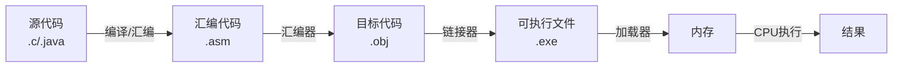

---

## 第六部分：二进制与数据表示（来自《手绘图解计算机基础》）

### 第12章：二进制与数据运算

#### 1. 核心论点
- **问题**：为什么计算机使用二进制？二进制数如何进行运算？负数如何表示？
- **观点**：计算机内部IC元件只有“开（1）”和“关（0）”两种状态，决定了其使用二进制。通过补码表示负数，可以使用加法器实现减法运算。

#### 2. 关键概念
- **位（bit）与字节（byte）**：1字节 = 8位，是计算机处理的最小单位。
- **补数（Two's complement）**：负数的二进制表示方法，解决负数的加法问题。求法：原码取反后+1。
- **逻辑右移 vs 算术右移**：逻辑右移高位补0；算术右移高位补符号位（正数补0，负数补1），用于保持数值正负不变。
- **逻辑运算**：与（AND）、或（OR）、非（NOT）、异或（XOR），用于对二进制位进行操作。

#### 3. 逻辑推演
- **为什么用二进制**：从IC元件只有0V和5V两种电压的物理特性出发，解释二进制是计算机唯一能直接理解的语言。
- **补数的必要性**：通过计算`1 - 1`的例子，说明直接用原码表示负数（10000001）会导致计算错误（结果为-2）。进而引出补数的概念（11111111），并通过加法运算证明其正确性（结果为0，正溢被丢弃）。
- **移位运算**：左移低位补0，等同于乘2。右移需区分逻辑右移（适用于无符号数）和算术右移（适用于有符号数），才能正确实现除2操作。

#### 4. 经典金句/数据
> “计算机内部是由IC电子元件组成的，IC的所有引脚，只有两种电压：0V和5V，IC的这种特性，也就决定了计算机的信息处理只能用0和1表示，也就是二进制来处理。”

---

## 附录：Prompt 汇总

基于以上技术资料的讲解逻辑和面试常见问题，可构建以下几类Prompt模板。

### Prompt 1：面试提问模拟器（HTTP协议）

#### 1. 使用场景
用于模拟技术面试，考察候选人对HTTP协议核心知识的掌握程度。

#### 2. 原始 Prompt
```text
# 角色：资深技术面试官

## 背景：
我正在面试一位后端开发工程师，需要考察其对HTTP协议的理解深度。

## 任务：
请根据“图解网络”和“手绘图解HTTP”中的知识要点，按以下顺序向我提问。每当我回答一个问题后，请根据我的答案质量给出评分（1-5分）和简短点评，并给出参考答案要点。最后，在所有问题结束后，总结我的总得分和改进建议。

## 面试大纲：
1. 请解释一下HTTP是什么，并详细拆解“超文本传输协议”这几个字。
2. HTTP/1.1 有哪些主要的性能瓶颈？分别是什么原因导致的？
3. 为什么TCP连接需要“三次握手”而不是两次或四次？请从“历史连接”和“序列号同步”的角度解释。
4. 当你在浏览器输入一个URL并回车，到页面完全展示，这中间发生了哪些事情？（要求描述DNS、TCP、HTTP等环节）
```

#### 3. Prompt 结构拆解
- **角色定义**：明确模型扮演“资深技术面试官”的角色。
- **背景设定**：提供面试场景和被面试者背景，增加真实性。
- **任务目标**：要求模型进行提问、评分、点评和总结。
- **输出格式**：隐含了“提问 -> 等待回答 -> 评分+点评+参考答案”的交互流程。
- **知识约束**：要求模型基于“图解网络”和“手绘图解HTTP”中的知识，限制了回答范围。
- **大纲/示例**：通过提供具体的面试大纲，引导模型按特定顺序提问并确保覆盖核心知识点。

#### 4. Prompt 结构图
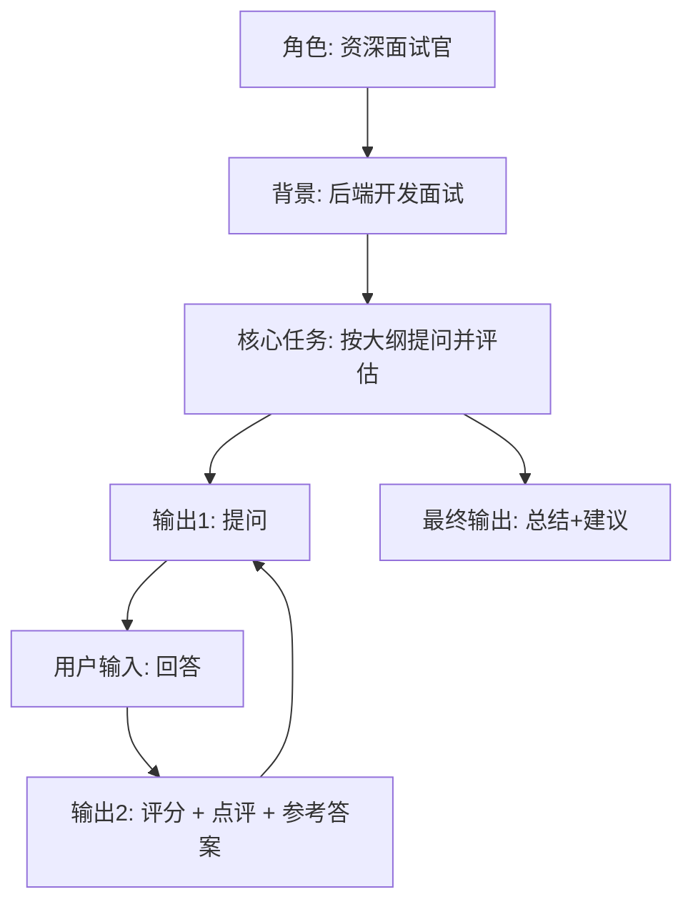

### Prompt 2：概念类比解释器

#### 1. 使用场景
当用户不理解一个复杂的技术概念（如IP和MAC的区别）时，模型使用生动的类比进行解释。

#### 2. 原始 Prompt
```text
# 角色：善于用类比教学的计算机科学老师

## 任务：
请用生活中的实例来类比解释以下两个概念的区别。解释要做到通俗易懂，让一个没有计算机背景的人也能听懂。

## 概念对：
{输入概念A} 和 {输入概念B}，例如“IP地址”和“MAC地址”。

## 输出格式：
1. 首先，用一句话分别定义这两个概念的核心职责。
2. 然后，讲述一个完整的小故事或生活场景作为类比。
3. 最后，总结这个类比是如何映射回技术概念的。
```

#### 3. Prompt 结构拆解
- **角色定义**：限定模型的解释风格为“善于用类比教学”。
- **任务目标**：要求进行概念类比解释。
- **指令细化**：要求先定义，再类比，最后总结映射关系，形成完整的解释链条。
- **变量化**：使用`{输入概念A}`作为变量，提高了Prompt的通用性。

#### 4. Prompt 结构图
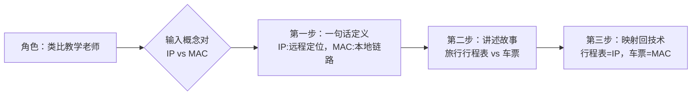

### Prompt 3：知识卡片生成器（用于笔记）

#### 1. 使用场景
用户读完一章后，希望模型生成一张可用于复习的“知识卡片”。

#### 2. 原始 Prompt
```text
# 角色：知识管理专家

## 任务：
基于用户提供的文本或我们刚刚讨论过的章节，生成一张高密度的知识卡片。卡片格式必须严格遵守下面的Markdown模板。

## 模板：
# [主题名称]

### 一句话总结：
[用最精炼的1句话概括核心]

### 3个核心要点：
1. [要点1]
2. [要点2]
3. [要点3]

### 必考问答（Q&A）：
**Q**: [一个关于此主题的常见面试题]
**A**: [用50字以内给出答案]

### 关联概念：
- [概念1]
- [概念2]
```

#### 3. Prompt 结构拆解
- **角色定义**：模型被赋予“知识管理专家”身份，负责信息提炼和结构化。
- **任务目标**：生成结构化的知识卡片。
- **输出格式控制**：通过严格定义Markdown模板，强制模型按照统一的、易于人类阅读和复习的格式输出。这包括“一句话总结”、“核心要点”、“Q&A”和“关联概念”等模块。
- **实用性导向**：模板中的“必考问答”模块，直接将知识与应用（面试）场景挂钩。

#### 4. Prompt 结构图
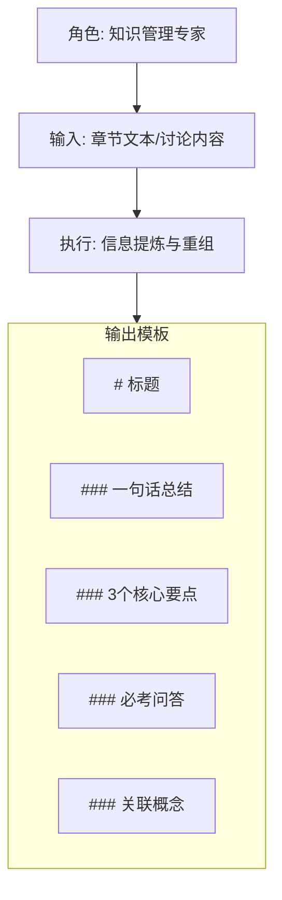