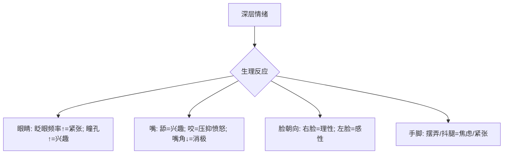
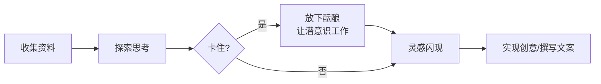
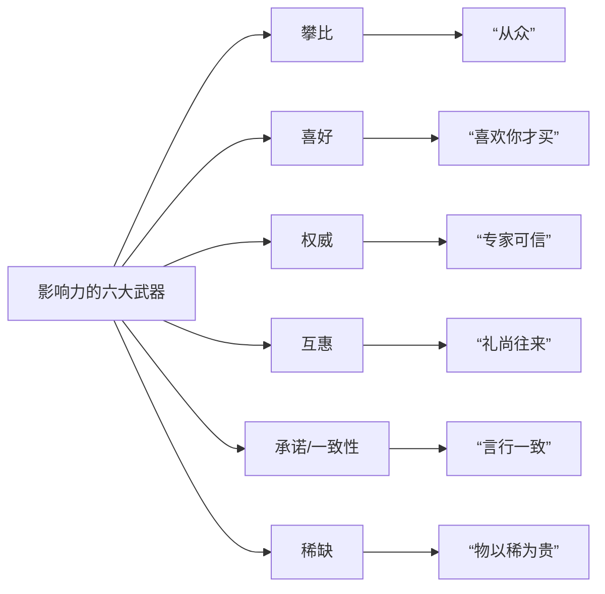
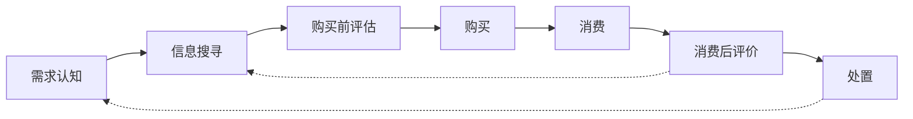

# 《图解行为背后的心理奥秘》等书籍联合章节总结

## 书籍信息
- 书名（本次处理核心）：
  - 《图解行为背后的心理奥秘》 (山边彻)
  - 《文案发烧》 (路克·苏立文)
  - 《日本创意文案》 (uedada)
  - 《文案训练手册》 (约瑟夫·休格曼)
  - 《吸金广告：史上最赚钱的文案写作手册》 (德鲁·埃里克·惠特曼)
  - 《消费者行为学(第10版)》 (罗格D.布莱克韦尔等)
  - 《阳谋高手》 (黄晓阳)
  - 《中外广告妙语全句10000条》 (张秀贤)
- PDF 状态：OCR 扫描件/电子版混合
- OCR 状态：部分识别存在排版错位、页码不连续、图文分离问题，核心文本可读。

## 目录说明
本次处理将严格遵循各书原始目录顺序进行结构化摘要。由于多书合并，将以每本书为独立单元，按章节顺序输出。非虚构类书籍重点提取理论、模型与案例；虚构类书籍（《阳谋高手》）梳理故事脉络与人物关系；工具类书籍（《中外广告妙语全句10000条》）提炼核心分类与典型例句。

## 全书核心主题
本合集涵盖行为心理学、广告文案创作、消费心理学、消费者行为学、营销战略及商业小说等多个领域。核心主题围绕“理解与影响”展开：
1.  **行为解码**：通过肢体语言（手、脚、眼、嘴等）洞察他人真实心理与态度。
2.  **文案实战**：从基础原则到高级技巧，系统阐述平面、电视、广播广告的创作流程与销售逻辑。
3.  **文化洞察**：透过日本广告文案，分析当代日本社会心理、消费趋势与文化现象。
4.  **心理驱动**：揭示驱动消费者购买的31个心理诱因与23个文案元素，构建说服体系。
5.  **系统理论**：从学术角度解析消费者决策过程（CDP模型）、个体与环境影响。
6.  **商业叙事**：通过小说形式展现中国政商环境下的人脉运作、资源整合与商业博弈。
7.  **语料库**：汇集上万条经典广告标题，提供分类研究与创作参考。

---

## 《图解行为背后的心理奥秘》

### 第1章：识破隐藏的敌意与好感

#### 1. 核心论点
问题：如何通过不经意的肢体动作判断对方是喜欢还是讨厌你？
观点：对方摸鼻子、视线角度、下巴朝向、手脚摆放等下意识动作，能真实反映其拒绝、好感、优越感或警戒心。

#### 2. 关键概念/事件
- **摸鼻子的拒绝信号**：用指腹擦鼻梁表示思考如何拒绝，情绪急躁；用手指背擦鼻尖或摸嘴，可能表示正在撒谎。
- **视线的优势与服从**：俯视对方（如调高椅子）旨在施加压迫感，追求心理优势；仰视则可能表示假意服从或弱小。
- **下巴的角度**：抬高下巴说话通常表示自认优秀或轻视对方；收起下巴、眼珠上翻则代表猜疑心重和自我保护。
- **手的自我亲密**：女性谈话中摸脸、摸耳朵、双手捧脸，表示进入自我陶醉状态；托腮、频繁梳理头发、胡乱摸头脸等行为，旨在填补内心未被满足的需求或缓解不安。

#### 3. 逻辑推演
章节首先提出面部（尤其是鼻子）是拒绝与谎言的第一道线索（擦鼻梁、擦鼻尖）。接着将视线作为判断优势/服从关系的关键（俯视、仰视、移开视线）。然后通过下巴角度区分优越感与防御心理。最后聚焦于手部动作（摸脸、托腮、摸头、摸下巴等），将其解读为“自我亲密行为”，用以填补情感空缺或缓解压力。论证逻辑从局部到整体，从静态姿态到动态动作。

#### 4. 经典金句/数据
> “用指腹擦鼻梁表示拒绝……正在思考的问题得不出结论，感到很烦躁的时候，我们会下意识地用手碰触脸颊。” (p.15)

> “抬起下巴是想让大家认为自己很伟大的人的共通姿势，也是表示轻视对方的姿势。” (p.23)

> “托腮是自我亲密行为的一种更直接表达，做出这一行为的人，正是希望有人来改变他未被满足的心理。” (p.27)

---

### 第2章：看穿对方的深层心理

#### 1. 核心论点
问题：如何通过细微动作看穿对方隐藏的恐惧、紧张、愤怒等深层情绪？
观点：眨眼的频率、瞳孔大小、嘴角方向、手脚的小动作等生理反应，是无法掩饰的深层心理信号。

#### 2. 关键概念/事件
- **眨眼与意志**：频繁眨眼是紧张、意志薄弱的表现。每分钟超过20次（正常约20次）说明高度紧张。
- **瞳孔与兴趣**：看到感兴趣的事物（如异性裸照）时瞳孔会放大；看到恐惧事物时瞳孔会缩小。
- **嘴部与情绪**：舔嘴唇表示对面前事物有强烈兴趣；咬嘴唇是压抑愤怒的“异指向活动”；嘴角上翘表示积极/乐观，下拉表示消极/爱讽刺。
- **脸的方向**：总把右脸给对方看的人（受左脑控制）理性、自信；总把左脸给对方看的人（受右脑控制）感性、想留下好印象。
- **手脚小动作**：摆弄身边东西（转位活动）、频繁吸烟、不停抖腿，都是缓解紧张、不满或焦虑的下意识行为。

#### 3. 逻辑推演
本章从“情绪难以隐藏”出发，选取眼睛（眨眼频率、瞳孔）、嘴部（舔、咬、嘴角）、面部朝向（左/右脸）、手脚（摆弄、抖腿）四个维度，逐一解析其背后的恐惧、兴趣、愤怒、自信、紧张等深层心理。论证结构为并列式，每个身体部位对应一组心理状态。

#### 4. 流程图



#### 5. 经典金句/数据
> “眨眼的频率和紧张程度密切相关。频率越高，说明越紧张。正常眨眼的频率是一分钟20次左右。” (p.49)

> “人在看到很感兴趣的东西，并认真观察的时候，瞳孔会放大。” (p.52)

> “咬嘴唇是一种压抑强烈的拒绝或愤怒的表现。” (p.59)

> “总把右脸给对方看的人，善于理性思考。总把左脸给对方看的人，想给对方留下好印象。” (p.62)

---

### 第3章：行为举止泄露性格的奥妙

#### 1. 核心论点
问题：如何通过谈话、笑、走路、打电话等行为方式，判断一个人的性格特质？
观点：初次见面的问候方式、笑的类型、步态特征以及打电话的习惯，都能有效反映一个人的性格是强势、孤僻、做作还是缺乏协调性。

#### 2. 关键概念/事件
- **打招呼与性格**：紧盯着对方看的人性格激烈、不服输；边鞠躬边偷看的人表里不一；初次见面就过度亲密的人害怕寂寞；喜欢肢体接触的人开朗豪爽但可能爱说教。
- **笑的方式**：撇嘴笑表示优越感；开口大笑可能意志软弱；闭嘴笑/捂嘴笑表示警戒心强或做作；嘻嘻笑是做作、希望讨好所有人；嘀嘀笑猜疑心重。
- **走路方式**：挺胸抬头直视前方的人可能孤独或自我表现欲强；急匆匆或低头踢石子走的人缺乏协调的人际关系；能随时调整步伐的人好奇心和行动力强。
- **打电话方式**：握听筒上部的人注重人际关系；握下部的人强势、关注自我；用双手拿听筒或玩电话线的人可能在工作时间聊私事；用肩膀夹听筒的人想表现自己很能干。

#### 3. 逻辑推演
本章将性格视为可观测的行为模式集合。通过四个生活场景（打招呼、笑、走路、打电话），每种场景列举2-4种典型行为，并直接对应一种或几种性格类型。逻辑是归纳法：从观察到的大量行为样本中，归纳出与特定性格的强关联。

#### 4. 经典金句/数据
> “一直盯着对方看的人，不善于掩藏内心想法，也多是性格激烈且不服输的人。” (p.75)

> “撇嘴笑表达了轻视，以及自己比对方地位高的意思，表现了一种扭曲的满足感。” (p.84)

> “挺胸抬头，昂首阔步，直视前方行走的人中，很多都是孤独的人。” (p.93)

---

### 第4章：下意识的动作透露出不可思议的心理

#### 1. 核心论点
问题：一些看似平常、不可思议的下意识动作（如抬头看天、拍照搞怪、叹气、干咳等），隐藏着怎样的心理机制？
观点：这些动作是大脑在特定情境下（思考、紧张、放松、引起注意）做出的最优生存/社交策略，具有普遍的心理一致性。

#### 2. 关键概念/事件
- **抬头向上看**：交谈中想暂时切断交流、集中思考时的下意识选择，既避免失礼又能改善脑部血液循环。
- **拍照搞怪**：因恐惧“一瞬间被永久保存”，用滑稽表情或夸张动作作为“面具”来隐藏日常表情。
- **叹气**：紧张状态解除后，大脑为补充氧气而进行的大口呼吸，无论是失望还是开心后。
- **干咳握拳**：原本表示“要咳嗽”，演变为引起注意的社交信号。
- **气得发抖**：内心在攻击本能与忍耐理性之间激烈摇摆，导致身体颤抖。
- **微微伸出舌头**：表示“正在集中精神，不希望被打扰”，是一种拒绝信号。
- **踩口香糖的反应**：扭头从后面看鞋底的人在意他人看法；向里扭脚看鞋底的人更关注事实本身。
- **横着拿伞**：可能是工作狂，不关心周围环境，容易伤到他人。
- **满员电梯沉默**：个人领域被陌生人入侵，产生不愉快与压力。
- **不困也闭眼**：在拥挤空间减少视觉刺激，缓解压力。

#### 3. 逻辑推演
本章选取一系列“下意识动作”，逐一揭示其背后隐藏的、往往与生存策略或社会适应相关的心理机制。论证特点是将复杂心理简化为“大脑的最优解”或“原始行为的残留”，逻辑清晰，易于理解。

#### 4. 经典金句/数据
> “抬头向上看是下意识的自我判断的最佳结果……既不会让对方觉得自己很失礼，又可以集中精神思考问题了。” (p.108)

> “拍照时的紧张，来源于人们认为一瞬间的表情将会永久地保存。” (p.109)

> “生气的时候，人的身体会不停地发抖，此时脑海中有两种想法在互较高下，一种是想要痛揍对方的本能，另一种是必须要忍耐的理性。” (p.114)

> “每个人都会在自己的周围建立不可见的屏障，这称为‘个人领域’……能进入这一领域的只有非常亲近的朋友。” (p.121)

---

## 《文案发烧》

### 第1章：销售员不必穿制服

#### 1. 核心论点
问题：广告是否必须通过令人讨厌的重复来促进销售？好广告的标准是什么？
观点：广告不必以牺牲灵气、优雅和智慧为代价去促进销售。消费者不是傻瓜，单靠欺骗、说教和重复无法真正赢得信任。好广告应兼具销售力与创意美感。

#### 2. 关键概念/事件
- **阿炮先生案例**：宝洁公司迷你卫生纸的广告，人物令人讨厌，但销量第一。引发讨论：成功的销售是否等于好广告？
- **威廉·伯恩巴克的理念**：消费者不是傻瓜。如果人们不信任你，你的货再真也没有用。创意是广告的灵魂。
- **德国大众汽车“柠檬”广告**：DDB公司代表作，以自谦、简单、诚实的文案（指出产品有瑕疵）开创了广告创意新时代。
- **广告业的两个阵营**：热烈的创意（伯恩巴克派） vs. 冰冷的研究（数据派）。

#### 3. 逻辑推演
本章以作者对“阿炮先生”广告的个人反感为起点，引出广告界核心争论：销售效果是否是评价广告的唯一标准。通过介绍伯恩巴克的革命性理念和“柠檬”广告案例，论证了创意与销售可以兼得。最后指出当前广告业正面临创意与研究、艺术与数据之间的持续较量。

#### 4. 经典金句/数据
> “消费者不是傻瓜，他是和你一起生活的丈夫。” ——威廉·伯恩巴克

> “在人们还不信任你的时候，你的货再真也没有用。如果人们不明白你在说什么，也就无从信任你。” (p.4)

> “在一则广告里，所有元素首先都是为了一个目的而存在：使读者阅读这篇文案的第一句话——仅此而已。” (p.15，引自《文案训练手册》，但本书提及类似原则)

> “广告是一门技艺。它是由想成为艺术家的人来操作，由想成为科学家的人来评说。” ——约翰·沃德 (p.7)

---

### 第2章：及时动笔很重要——开始创作的一些想法

#### 1. 核心论点
问题：创意人如何开始工作，克服面对白纸的恐惧？
观点：广告创意是一个有章可循的思维过程，包括收集资料、探索思考、放下酝酿、灵感闪现、实现创意五个步骤。必须带着恐惧和傲气上场，并从学习模仿大师作品开始。

#### 2. 关键概念/事件
- **广告创意五步骤**（詹姆斯·韦伯·扬）：
  1. 尽可能收集与主题相关的资料。
  2. 坐下来积极探索解决问题的方法。
  3. 停下手上的工作，让潜意识继续工作。
  4. 灵光闪现：“啊，这就是答案？”
  5. 认真策划，将想法变为现实。
- **“必须同时带着恐惧和傲气上场打球”**：引用棒球电影台词，形容广告人应有的心态。
- **好广告促进销售，精彩广告创造工厂**：以绝对伏特加和《滚石》杂志广告为例，说明好广告能改变品牌命运。
- **战略与表现的统一**：帕特·法龙的观点：“在最好的广告中，战略和表现没有区别。”

#### 3. 逻辑推演
本章旨在破除创意工作的神秘感。首先承认广告创作的压力与痛苦，然后引用詹姆斯·韦伯·扬的经典五步法，将其结构化。接着通过案例强调好广告的商业价值，最后回归到战略层面，指出好创意是对好战略的最佳阐述。

#### 4. 流程图



#### 5. 经典金句/数据
> “在你掌握这些常规之前就去破坏它是不明智的。” ——艾里奥特 (p.10)

> “先有质量，后有名牌。” (p.21)

> “最好的答案总是出约和题的本身，出自产品，出自销售的实际情况。” (p.18)

> “枯燥无味不会有市场，但是不相关的华丽也行不通。” ——威廉·伯恩巴克 (p.27)

---

### 第3章：一张白纸——制作广告；大刀阔斧地做

#### 1. 核心论点
问题：如何从一张白纸开始，创作出有销售力的广告？
观点：关键在于找对问题、对症下药，并通过图像与文字的巧妙配合，实现简洁、单纯、引人入胜的沟通。要敢于打破常规，但不同只为不同，必须服务于销售。

#### 2. 关键概念/事件
- **找对问题**：你需要解决客户的问题（战略）和你自己的问题（表达）。好创意就是对好战略最好、最有效的阐述。
- **图像为主，文字简洁**：伦敦BMP广告公司为Fisher-Price旱冰鞋所做的广告，用画面充分展示了产品安全性。
- **单纯=好**：耐克运动装广告，米开朗基罗名言“美是对多余内容的净化”。
- **反面也有反面**：当别人都向左转时，你应该向右转，但必须为销售服务。例如，将商标放左上角，产品图做大。
- **利用隐喻**：《经济学家》杂志广告（钥匙孔），用形象作为概念速记工具。巴尼特银行贷款广告（大树年轮），用隐喻说明审批慢。

#### 3. 逻辑推演
本章从“解决问题”出发，强调提问和反向思考的重要性。核心部分围绕“视觉优先”展开，论证图像比文字更有力。接着提出“单纯”是突破广告混乱的法宝，并用路边广告牌的例子强化。最后探讨了隐喻、机智等高级技巧，以及简洁的重要性。

#### 4. 经典金句/数据
> “广告中第一句话的唯一目的就是为了让读者读第二句话。” (p.21，引自《文案训练手册》但理念相通)

> “如果你想不通，就把它反过来。反面也有反面。” (p.41)

> “真正的艺术是删减。” ——罗伯特·路易·史蒂文森 (p.52)

> “你在捕鼠夹子上放好奶酪后，别忘了把空间留给老鼠。” (p.53)

---

## 《日本创意文案》

### 1. 核心论点（全书）
问题：日本当代广告文案反映了怎样的社会心理与消费文化？
观点：日本广告文案是洞察社会现状的棱镜。通过分析广告语，可以解读出日本人的“开关愿望”、追求“说得过去”的社会一致性、虚拟差别化消费、寻找“ネタ”（谈资）的消费模式、以及“大人”文化的兴起等复杂心理。

#### 2. 关键概念/事件
- **开关愿望**：现代人渴望像家电一样能随意开关自己的大脑/情绪，广告用“立ち上げよう”（启动）描述人的状态，反映了人机界限模糊的愿望。
- **“说得过去”的消费**：TOP VALL服饰广告提出“改变日本的景色”，强调个人服装应作为社会景观的一部分，追求不显眼、融入背景的“说得过去”，反映了社会对安定、无个性的偏好。
- **虚拟差别化**：THE SUITS COMPANY广告（Don't copy. Don't follow.），在制服文化背景下，人们追求在有限制范围内的细微差别，而非完全自由下的个性。
- **寻找“ネタ”（谈资）**：“宇宙酒”案例，消费者购买不是因为品质，而是为了获得一个特别的、可以谈论的话题。现代消费模式从“使用价值”转向“话题价值”。
- **“大人”文化的兴起**：广告中大量使用“大人の…”（大人的…），指代20-30岁不想长大的人或60岁左右不服老的“团块世代”，是模糊的世代界限和消费分众化的体现。
- **“冲”信仰的复活**：WILLCOM广告用生僻汉字“働”（工作）做文章，在经济长期低迷后，重新宣扬“拼命工作”的价值。

#### 3. 逻辑推演（以第一章为例）
本书以作者uedada在电车中观察广告的体验为起点。每一篇都采用“现象（广告文案）→ 解读（社会/心理背景）→ 分析（消费者行为逻辑）→ 结论（文化反思）”的结构。例如，从SONY广告“そろそろ、アタマを立ち上げよう。”（差不多该启动头脑了）解读出日本人对“开关愿望”的普遍渴望，并将其联系到工作压力、信息过载的社会现实中。

#### 4. 经典金句/数据
> “開闢願望 / 封、アタマを立ち上げよう。” ——明治巧克力广告 (p.18-19)

> “（对）‘说得好’的追求 / 改变日本的景色” ——TOP VALL服饰广告 (p.21-23)

> “虚拟差别化 / Don't follow. Don't copy.” ——THE SUITS COMPANY广告 (p.37-39)

> “寻找ネタ型消费 / 宇宙酒” ——高知县造酒公会 (p.45-49)

---

## 《文案训练手册》

### 第1部分：理解过程

#### 1. 核心论点（第1-3章）
问题：成为一名优秀文案撰稿人需要哪些准备？
观点：需要广博的一般性知识（丰富的生活经历）和深入的特殊知识（成为产品专家），并通过大量的实践来打磨技艺。

#### 2. 关键概念/事件
- **一般性知识**：对生命充满好奇，博览群书，爱好广泛，经历丰富。创意来自将旧的知识碎片以新形式重新组合。
- **特殊知识**：成为你所写产品的专家。通过深入研究（如去工厂了解激光技术），挖掘出独一无二的卖点（如“激光束电子表”）。
- **实践**：最好的开始时机就是现在。不要为初稿担心，初稿总是很糟糕，重点在于打磨。

#### 3. 逻辑推演
前三章搭建了文案撰稿人的基本素养框架。第一章强调“输入”（广泛的生活经验是创意原料）。第二章强调“深度”（对特定产品的专业知识是挖掘独特卖点的关键）。第三章强调“行动”（开始写，并不断修改是成长的唯一途径）。

#### 4. 经典金句/数据
> “创意来自经历。我们的头脑就像一台巨大的电脑。” (p.22)

> “文案写作是一段精神旅程。成功的文案写作，会综合反映出你全部的经历、你的专业知识……” (p.34)

> “一篇广告文案的初稿总是很糟糕的。关于文案写作的真正技巧就是：拿着那个粗粝的初稿，打磨它。” (p.33)

---

### 第2部分：了解真正起作用的东西

#### 1. 核心论点（第18-19章）
问题：一则成功广告中包含哪些关键的文案元素和心理诱因？
观点：广告包含23个文案元素（如字体、第一句话、段落标题、技术说明等）和31个心理诱因（如参与感、诚实、贪婪、紧迫感等），所有元素都为引导读者阅读第一句话并滑到底部而服务。

#### 2. 关键概念/事件
- **公理2**：一则广告里的所有元素首先都是为了一个目的而存在：使读者阅读这篇文案的第一句话。
- **公理3**：广告中第一句话的唯一目的就是为了让读者读第二句话。
- **公理4**：广告的版面设计和头几个段落必须创造出一种购买环境。
- **公理5**：让你的读者说“是”，让他们在阅读你的文案时，因你真诚实在的陈述而产生共鸣。
- **公理8：滑梯效应**：你的读者应该是情不自禁地阅读你的文案，根本无法停止，直到阅读完所有的文案。
- **31个心理诱因**：包括参与或拥有的感觉、诚实、正直、信用、贪婪、建立权威、满意度保证、产品的本质、客户的本质、归属感的渴望、收藏冲动、好奇心、紧迫感、恐惧、瞬间满足、独有珍贵或特别、简单、讲故事、精神投入等。

#### 3. 逻辑推演
第18章系统列出了23个文案元素，将广告视为一个精密系统，每个部件都有其功能。第19章则深入消费者心理，列出31个驱动购买的心理诱因。两者结合，构成了休格曼文案方法论的核心：从技术执行（元素）到心理影响（诱因）的完整闭环。

#### 4. 经典金句/数据
> “一则广告里所有的元素首先都是为了一个目的而存在：使读者阅读这篇文案的第一句话——仅此而已。” (公理2，p.37)

> “文案写作是一段精神旅程。成功的文案写作，会综合反映出你全部的经历、你的专业知识、你对这些信息进行精神加工并以卖出产品或服务为目的将它们形成文字的能力。” (p.34)

> “总是推销治愈性产品，避免推销预防性产品。” (p.171)

> “在编辑的过程中，你要精练你的文案，用最少的文字精确地表达出你想要表达的东西。” (公理17，p.105)

---

## 《吸金广告》

### 第一章：人们到底想要什么

#### 1. 核心论点
问题：驱动人们消费的最根本欲望是什么？
观点：人类共有8种天生的“生命原力”欲望（如生存、享受食物、性伴侣等），以及9种后天习得的需求（如获取信息、追求效率等）。最有效的广告建立在生命原力的基础上，并通过具体、形象的描述激发消费者的精神电影。

#### 2. 关键概念/事件
- **八大生命原力（LF8）**：
  1. 生存、享受生活、延长寿命。
  2. 享受食物和饮料。
  3. 免于恐惧、痛苦和危险。
  4. 寻求性伴侣。
  5. 追求舒适的生活条件。
  6. 与人攀比。
  7. 照顾和保护自己所爱的人。
  8. 获得社会认同。
- **霍尔德曼·尤利乌斯的书名实验**：将《金羊毛》改名《追求金发情人》，销量从5000增至50000册，证明性欲和自我改善的欲望最具吸引力。
- **精神电影**：通过使用具体、形象的词汇（PVA），让消费者在脑海中生动地预演使用产品的情景，从而激发占有欲。

#### 3. 逻辑推演
本章开篇引用丹尼尔·斯塔奇的研究，指出消费者只关心自己。然后明确提出八大生命原力，论证其不可抗拒性。通过书商案例证明其有效性。接着引入次要需求，最后通过“精神电影”的概念，将欲望与具体的广告写作技巧（PVA）联系起来。

#### 4. 经典金句/数据
> “抛开其他的一切，人们真正想要的是……生存、享受生活、延长寿命。”(p.22)

> “人们因为情感而购买商品，并用逻辑证明其正当性。” (p.25)

> “对任何产品而言，消费者都是在大脑中初次使用它们的。” (p.27)

> “更具吸引力的广告都建立在这8种基本需求的基础之上。” (p.29)

---

### 第二章：钻进顾客脑子里

#### 1. 核心论点
问题：有哪些经过验证的消费心理学原则可以用来影响消费者？
观点：本章介绍了17个基于研究的消费心理学原则，包括利用恐惧、激发即刻认同、从众效应、转移信誉、建立权威等，这些原则是设计强效广告的理论基础。

#### 2. 关键概念/事件
- **原则1：挑战恐惧**：利用恐惧心理赚钱。恐惧带来压力，压力驱使行动。必须同时提供具体的解决方案。
- **原则2：自我意识的变形**：激发即刻认同。通过广告形象让消费者将产品与渴望的自我形象联系起来（如万宝路牛仔）。
- **原则3：转移**：通过渗透作用获得信誉。将产品与权威、可敬的形象或机构（如医生、教会）联系起来。
- **原则4：从众效应**：给他们一个起跳板。利用人类寻求归属感的需求（如“美国人信任的药店”）。
- **原则10：影响力的六大武器（CLARCCS）**：
  - 攀比 (Comparison)
  - 喜好 (Liking)
  - 权威 (Authority)
  - 互惠 (Reciprocation)
  - 承诺/一致性 (Commitment/consistency)
  - 稀缺 (Scarcity)

#### 3. 逻辑推演
本章是全书理论密度最高的部分。每个原则都遵循“定义 → 心理学基础 → 应用方法 → 案例佐证”的结构。原则之间并非线性关系，而是并列关系，共同构成一个强大的说服工具箱。

#### 4. 流程图（影响力的六大武器）



#### 5. 经典金句/数据
> “我们因为情感而购买，又因为逻辑而使我们的购买行为合理化。” (p.71)

> “人们更相信来自于实际使用过某件商品的人所做的评价。” (p.120)

> “销售治愈性产品要比销售一种预防性产品容易得多。” (p.185)

> “一则广告里的所有元素首先都是为了一个目的而存在：使读者阅读这篇文案的第一句话。” (p.37)

---

## 《消费者行为学(第10版)》

### 第一部分：消费者行为学导论

#### 1. 核心论点（第1-2章）
问题：什么是消费者行为学？为什么要研究它？如何建立消费者导向型组织？
观点：消费者行为学是研究人们获取、消费、处置产品与服务的活动。消费者决定企业兴衰，研究其行为是制定有效营销战略的基础。消费者导向型组织应将所有资源集中于服务和取悦有利可图的客户。

#### 2. 关键概念/事件
- **消费者行为的三个阶段**：获取、消费、处置。
- **营销理念**：通过交换满足个人和组织目标的过程。核心是消费者满意。
- **需求链**：从消费者需求出发，整合供应链所有环节以取悦消费者的过程。21世纪，消费者成为供应链的“老板”。
- **市场细分**：将消费者划分为行为相似的群体。标准：可测性、可达性、足量性、一致性。
- **客户终身价值(CLV)**：消费者与企业交易联系的整个期间所带来的价值。

#### 3. 逻辑推演
第1章从定义出发，阐述研究消费者行为的宏观（国家经济）、中观（企业成败）、微观（个人生活）意义。第2章则聚焦企业应用，提出建立消费者导向型组织的必要性，并详细论述了从市场分析、市场细分到营销组合（7R）的完整战略制定过程。

#### 4. 流程图（消费者导向型营销战略）

```mermaid
graph TD
    A[市场分析] --> B[市场细分]
    B --> C[选择目标市场]
    C --> D[制定营销组合战略<br>(4P/7R)]
    D --> E[执行]
    E -.-> A
```

#### 5. 经典金句/数据
> “消费者行为就是一切，一切都是消费者行为。” (p.8)

> “只有消费者才能解雇我们所有人。” ——山姆·沃尔顿 (p.27)

> “消费者用他们的美元、欧元和日元等货币来表决哪些国家和企业会取得胜利。” (p.26)

> “决定消费者拥有多少财富的关键，与其说是取决于其收入，还不如说是取决于节俭。” (消费者提示1-1，p.29)

---

### 第二部分：消费者决策

#### 1. 核心论点（第3-4章）
问题：消费者是如何做出购买决策的？
观点：消费者决策过程（CDP模型）包括7个阶段：需求认知、信息搜寻、购买前方案评估、购买、消费、消费后评价、处置。介入程度（高/低）决定了决策过程的类型（扩展型/有限型）。

#### 2. 关键概念/事件
- **CDP模型（7阶段）**：
  1. 需求认知
  2. 信息搜寻
  3. 购买前方案评估
  4. 购买
  5. 消费
  6. 消费后评价
  7. 处置
- **影响决策的因素**：个体差异（人口统计、资源、动机、知识、态度）、环境影响（文化、社会阶层、家庭、个人影响、情境）、心理过程。
- **决策类型**：
  - 扩展问题解决 (EPS)：高介入，广泛搜寻。
  - 有限问题解决 (LPS)：低介入，简单评估。
  - 习惯性决策：基于品牌忠诚度或惯性。
- **考虑域**：消费者在决策时实际考虑的备选方案组。

#### 3. 逻辑推演
第3章系统介绍了CDP模型，将其作为理解消费者行为的“地图”。然后详细拆解了影响决策的三大类因素，并根据介入程度划分了决策类型。第4章则聚焦于CDP模型的前三个阶段（需求认知、搜寻、评估），深入探讨了触发购买的因素、信息搜寻渠道（特别是互联网）以及方案评估的策略（补偿性/非补偿性）。

#### 4. 流程图（消费者决策过程模型）



#### 5. 经典金句/数据
> “消费者不会进入商店便说：‘我注意到你们有东西要卖，而我有多余的钱可以消费。’” (p.55)

> “消费者经常不能充分认识到搜寻所带来的效益，特别是寻找低价产品的价值。” (消费者提示4-1，p.114)

> “了解消费者信息搜寻的情况，可使企业在很多方面获益。” (p.116)

> “有时候，通过改变产品本身来引起消费者的考虑。” (p.119)

---

### 第三部分：消费者行为的个体决定因素

#### 1. 核心论点（第7-9章）
问题：消费者的个体差异（如人口统计、个性、动机、知识）如何影响其行为？
观点：人口统计特征（年龄、收入）是细分基础，但消费心理（VALS2）、个性特质（如创新性）、个人价值观和生活方式能更精准地预测行为。动机是行为的驱动力，而知识（特别是产品知识与购买知识）则决定了消费者如何搜寻和评估信息。

#### 2. 关键概念/事件
- **人口统计 vs. 消费心理**：人口统计告诉你谁在买，消费心理告诉你为什么买。
- **VALS2框架**：将美国成年人分为8种类型，基于资源与自我导向（创新者、思想者、成就者、体验者、信徒、奋斗者、制造者、挣扎者）。
- **动机冲突**：趋避冲突、双趋冲突、双避冲突。
- **消费者知识类型**：
  - 产品知识：了解产品属性、品类。
  - 购买知识：知道在哪里买、如何买。
  - 使用知识：知道如何使用产品。
- **知识来源**：记忆（内部）与环境（外部，包括营销信息与非营销信息）。

#### 3. 逻辑推演
这三章构成了消费者“内在世界”的剖析。第7章讲“谁”（人口统计与心理特质）。第8章讲“为什么”（动机与需求）。第9章讲“知道什么”（知识储备）。三层递进：从外在标签到内在驱动再到认知基础，完整描绘了影响消费行为的个体心理图景。

#### 4. 经典金句/数据
> “消费者资源：在进行决策时，每个人都要运用3大资源：时间、金钱、信息的接受和处理能力。” (p.67)

> “消费者总是设法使购买和使用产品的风险最小化和利益最大化。” (p.72)

> “品牌可能是一个企业最重要的表外资产。” (p.38)

> “很多消费者正在失去对全国性品牌的偏好，因为消费者对相同质量的品牌选择的认知已经发生了改变。” (消费者行为与市场营销4-3，p.121)

---

## 《阳谋高手》

### 故事梗概与人物关系总结

#### 1. 核心主题
小说讲述了江南省著名记者欧阳佟，凭借其出色的社交能力和敏锐的政治嗅觉，在官场、商场与情场之间周旋的故事。核心围绕“资源”与“人脉”的运作，展现了中国政商环境下的个人奋斗、利益交换与道德困境。

#### 2. 主要人物关系
- **欧阳佟**：江南电视台记者/副台长。精明、自负、善于利用人脉，是故事的核心操盘手。
- **王禺丹**：江南烟草董事长，全国人大代表。美丽、能干、有政治野心。是欧阳佟的重要客户与合作伙伴，关系暧昧。
- **杨大元**：欧阳佟的发小，粗犷、讲义气但能力有限，后因财务问题与欧阳佟决裂。
- **邱萍**：省委接待处处长，社交皇后，是欧阳佟与王禺丹的介绍人。
- **丁应平**：省委宣传部长，欧阳佟的靠山之一。
- **文雨芳**：江南大学研究生，与欧阳佟关系暧昧，聪明独立。

#### 3. 叙事脉络
1.  **开场**：欧阳佟通过邱萍结识王禺丹，吹牛承诺能请奥运冠军林飞为江南烟草代言，接下挑战。
2.  **公关林飞**：欧阳佟通过研究林飞父母爱好（围棋、美食），在上海总统套房成功说服二人，展现了其高超的人际公关能力。
3.  **职场晋升**：欧阳佟利用自己与中央领导秘书武蒙的同学关系，巧妙让丁应平看到自己的价值，成功晋升电视台副台长。
4.  **开公司**：与杨大元合伙开文化传播公司，承接江南烟草广告业务。杨大元在公司运营中贪腐严重，两人矛盾激化。
5.  **决裂与成长**：在广州拍摄现场，欧阳佟发现杨大元贪污证据，两人彻底决裂。欧阳佟在王禺丹秘书的帮助下接手项目，开始反思自己用人不当和公司管理的失误。

#### 4. 核心冲突
- **个人理想 vs. 体制束缚**：欧阳佟才华横溢但受限于广电系统内斗。
- **兄弟情义 vs. 商业利益**：与杨大元从合作到决裂的过程。
- **道德底线 vs. 成功欲望**：在政商旋涡中利用人脉、权色交易等灰色手段达成目的。

#### 5. 经典金句/情节
> “古代军事家的经验告诉欧阳佟，正面攻不下，你就侧面进攻，侧面攻不下，你再正面进攻。反复攻还攻不下，你就立体进攻。这种事，就像追求一个女人。” (p.11)

> “什么是本钱？什么是资源？现在有一种提法，叫智商时代。现在最大的本钱，不是资金，而是大脑，是一个人的情商。” (p.39)

> 欧阳佟通过研究林飞父亲下棋、母亲做菜的爱好，成功公关，体现了“侧面进攻”的智慧。

> 王禺丹点醒欧阳佟：“你身边的朋友就是衡量你的一把尺子。” (p.38)

---

## 《中外广告妙语全句10000条》

### 书籍结构与使用方法

#### 1. 书籍性质
本书是一本广告标题（妙语金句）的汇编工具书，旨在为文案创作者提供灵感、范例与学习素材。全书分为甲、乙、丙、丁四部，从理论到实践，从戒律到技巧，再到具体分类例句。

#### 2. 核心内容框架
- **甲部：9条标题创作戒律**：如“广告一定要有标题”、“标题内容应包括承诺”、“标题字数以6-12字为宜”等基础原则。
- **乙部：25种标题创作技巧**：如新闻式、承诺式、问题式、夸耀式、比喻式、拟人式、幽默式、双关语等。
- **丙部：10种标题创作误区**：如虚假最高级、比喻不当、强加于人、表述不具体、文字游戏等。
- **丁部：妙语金句阅读与理解精选实例**：按行业分类（食品、烟酒、服装、家电、房产、服务等），每句均标注“类型”（对应乙部技巧），供读者分析学习。

#### 3. 精选实例分类（消费者广告）
- **食品类**：“每一粒都在向你致意！”（大米，拟人式）、“冠军的早餐。”（麦片，定位高贵式）
- **烟酒类**：“万宝路的世界。”（烟草，自我意识变形）、“人头马一开，好事自然来。”（酒，双关语式）
- **服装服饰**：“领袖的风采。”（衬衫，双关语式）、“足下生辉。”（鞋，成语式）
- **家电日杂**：“太阳下山了，‘来亮了’该登场了。”（灯具，拟人式）、“威力洗衣机，够威、够力！”（重复式）
- **医药保健品**：“立肝见影”（药品，滥用成语式，被列为误区）、“早一天使用，多一天青春。”（化妆品，承诺式）

#### 4. 使用建议
1.  **学习技巧**：对照乙部的25种技巧，分析丁部每个例句的类型，理解如何将理论应用于实践。
2.  **避免误区**：重点研究丙部列举的失败案例，识别并规避创作中的常见问题。
3.  **灵感激发**：当创作陷入瓶颈时，可按产品类别查阅丁部相关例句，寻找切入角度或表达方式。
4.  **建立语料库**：将书中触动的句子分类整理，形成个人化的创意素材库。

> 说明：本书为汇编性质，无连续叙事脉络，故不设“逻辑推演”模块。核心价值在于其分类体系与海量实例。