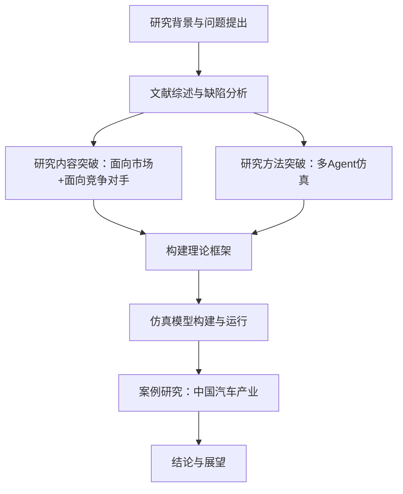
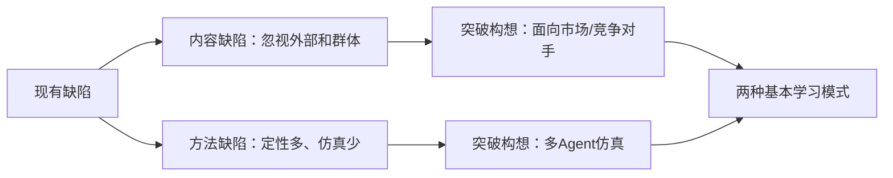
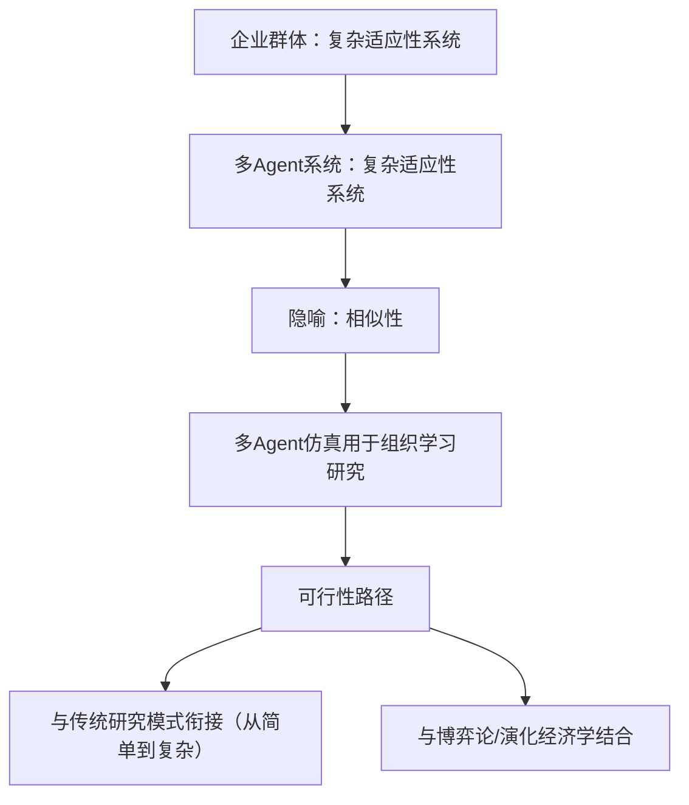
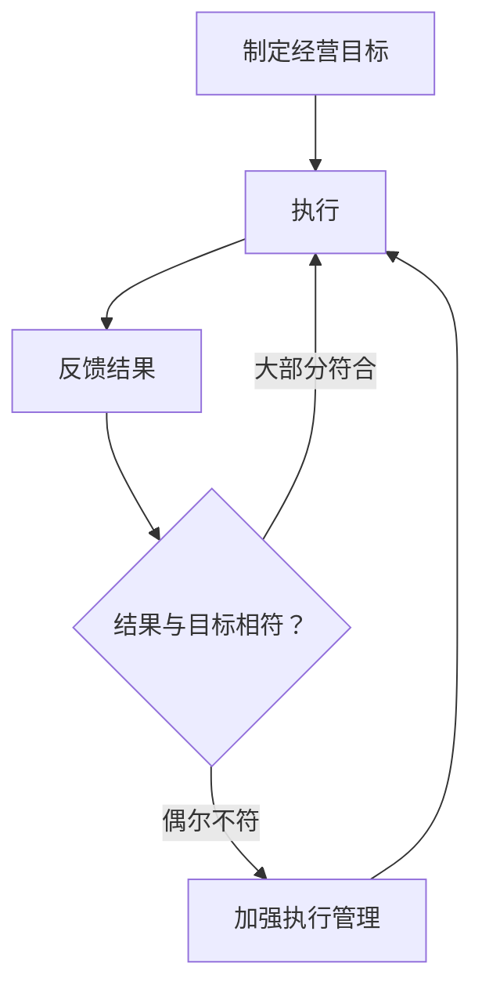
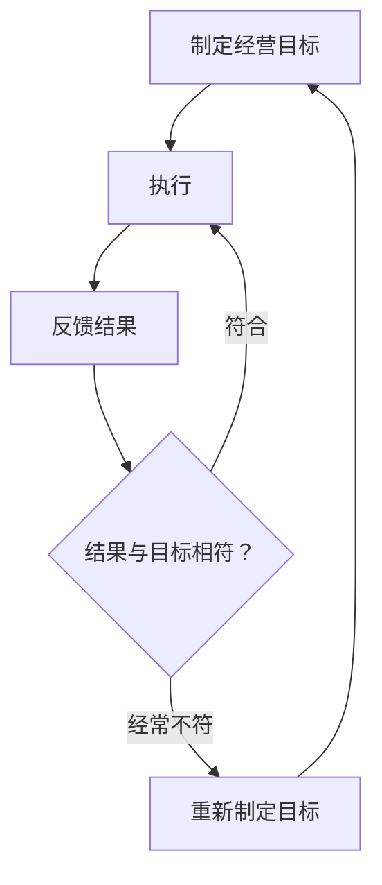
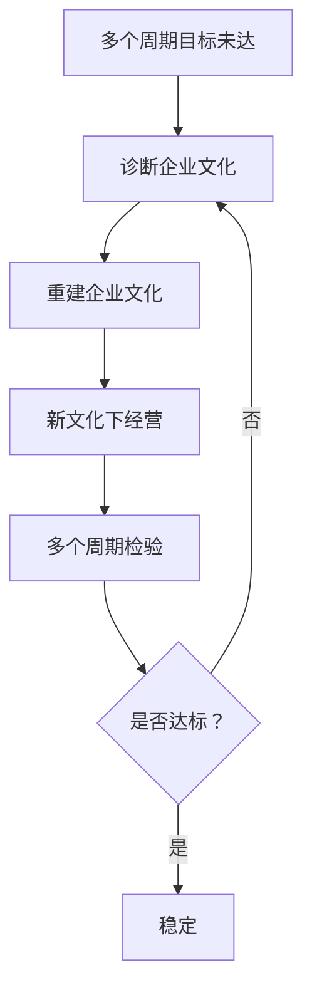
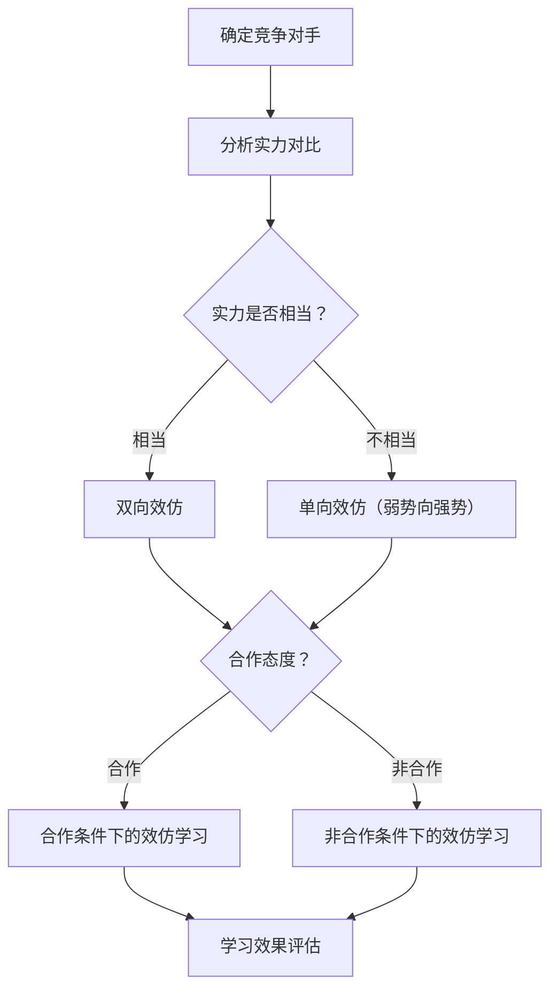
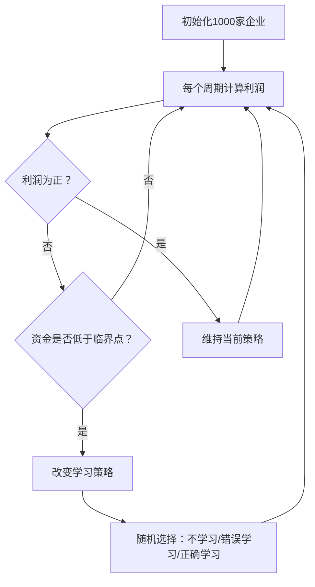
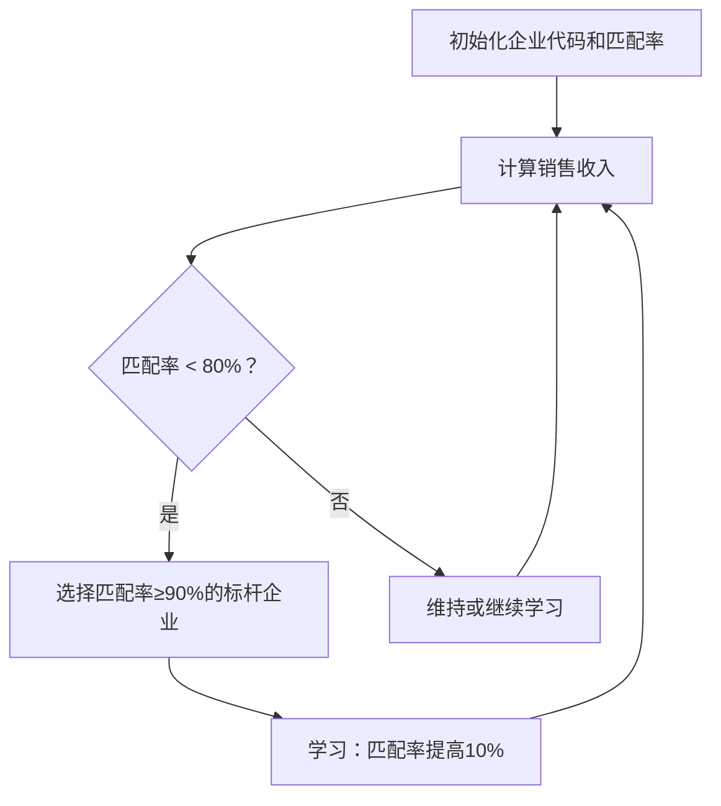

# 《基于多Agent系统的企业组织学习研究》章节总结

## 书籍信息

- **书名**：基于多Agent系统的企业组织学习研究
- **作者**：邱奇
- **出版社**：西安电子科技大学出版社
- **出版年份**：2016年6月第1版
- **PDF状态**：扫描文本，OCR可识别，内容完整
- **OCR状态**：文本可读，偶有页码错位，不影响内容理解

## 目录说明

- 目录识别情况：完整识别，共8章，外加前言、参考文献等。
- 章节对应依据：基于PDF中的真实页码和标题层级。
- OCR修复说明：部分图表描述需人工提炼逻辑，Mermaid重建基于书中文字说明。

## 全书核心主题

本书针对组织学习研究长期处于“理论丛林”状态的现实，指出根本原因在于组织学习是一种复杂适应现象，而传统研究方法基于简单还原论。作者提出两大研究内容突破：面向市场的试错型企业组织学习模式、面向竞争对手的效仿型企业组织学习模式。同时引入多Agent仿真模型作为研究方法突破，通过理论分析、模型构建、仿真模拟和案例研究（以中国汽车产业为例），论证了市场不确定性、企业有限理性与异质性是企业必须进行组织学习的根本原因。本书旨在为中国企业提供适合国情的组织学习理论指导。

---

## 第1章：引言

### 核心论点

- **问题**：中国企业面临国内市场的快速扩张与不确定性增加，以及入世后与跨国巨头竞争的双重挑战，亟需有效的组织学习理论指导。
- **观点**：现有组织学习研究在内容（忽视外部环境和群体互动）和方法（定性多、仿真少）上存在缺陷，引入多Agent仿真方法是突破的关键。

### 关键概念/事件

- **企业组织**：从个体（经济组织）和群体（同一市场上的企业群体）两重含义界定。
- **组织学习**：本书定义——组织通过主动掌握社会知识以适应环境从而达到自身发展目标的一种行为。
- **多Agent系统**：由多个具有自主性、适应性、学习性的Agent构成的复杂系统，用于仿真研究。
- **仿真模型**：基于计算机系统仿真，利用复杂适应性系统间的相似性进行研究。

### 逻辑推演

本章从中国加入WTO和全面建设小康社会的宏观背景出发，提出企业必须进行组织学习。分析发现Senge的学习型组织理论在中国效果不佳，原因在于缺乏适合中国企业的理论。进一步指出组织学习研究的缺陷：内容上忽视外部环境和群体互动，方法上定性多、定量少、仿真缺乏。因此，本书构想从研究内容（面向市场、面向竞争对手）和研究方法（多Agent仿真）两方面突破。

### 核心框架图（研究逻辑思路）

### 经典金句/数据

> “要么学习，要么死亡。” —— 美国《财富》杂志专刊封面标题 (p.17)

> “截止到2007年底，还没有一篇文章是将企业组织学习和多Agent结合起来进行研究的。” (p.18-19)

---

## 第2章：关于组织学习研究的文献综述

### 核心论点

- **问题**：组织学习研究为何长期处于“理论丛林”状态？
- **观点**：根本原因是组织学习是一种复杂适应现象，而现有研究基于简单还原论，导致内容和方法缺陷。需引入复杂性科学方法。

### 关键概念/事件

- **学习曲线**：Wright（1936）发现单位成本随经验积累下降的现象。
- **Argyris & Schön**：1978年提出单环学习和双环学习理论，被称为“组织学习之父”。
- **Senge**：1990年出版《第五项修炼》，引发全球学习型组织热潮。
- **组织学习层次**：个人学习、团队学习、组织学习、组织间学习四个层次。
- **知识管理**：与组织学习不可分割，知识是组织学习的结果。

### 逻辑推演

本章首先回顾组织学习研究的历史逻辑：从学习曲线到新奥地利学派的动态市场观，再到Alchian（1950）提出的效仿和试错学习。然后划分四个发展阶段：概念孕育期（1953-1965）、理论孕育期（1965-1978）、理论发展期（1978-1990）、理论兴盛期（1990至今）。通过对各种定义、作用、层次、能力、组织间学习、学习型组织、知识管理的观点综述，得出结论：组织学习研究仍处于“丛林状态”，理论不成熟。缺陷在于：内容上忽视外部环境和群体竞争关系，方法上实证研究比例低、缺乏仿真。

### 突破构想图

### 经典金句/数据

> “组织学习研究虽然丰富多彩却难以深入的重要原因……实证研究依然不是主流方法。” (p.35-36)

> “根据Crossan和Guatto(1996)的统计，仅1990年—1994年这5年间关于组织学习的论文数量已经上升到184篇，几乎相当于20世纪70年代和80年代同类论文数量总和的3倍。” (p.37)

---

## 第3章：多Agent系统及其在企业组织学习研究的应用分析

### 核心论点

- **问题**：多Agent仿真能否有效应用于企业组织学习研究？
- **观点**：企业群体是复杂适应性系统，多Agent系统与之具有相似性（隐喻），且Agent具有学习能力，因此具有潜在优势和现实可行性。

### 关键概念/事件

- **复杂适应性理论（CAS）**：Holland提出，核心思想“适应性造就复杂性”，涌现（Emergence）是核心概念。
- **Santa Fe Institute（SFI）**：1984年成立，推动复杂系统仿真研究，开发了Swarm仿真平台。
- **人工股市模型（ASM）**：SFI开发的基于多Agent的金融市场仿真模型。
- **隐喻（Metaphor）**：在不同领域建立相似研究模式的手段，是多Agent仿真有效性的基础。
- **学习性**：多Agent系统中Agent必须具备的能力，包括新知识获取和应用于未来活动。

### 逻辑推演

本章从复杂性理论发展史讲起，从亚里士多德“整体大于部分之和”到牛顿还原论，再到系统论、控制论、耗散结构、协同学等。重点介绍CAS理论：主体具有适应性，通过相互作用产生涌现。多Agent仿真正是实现CAS研究的最佳载体。回顾多Agent在经济管理中的应用（如Kiyotaki-Wright货币模型、ASM模型），指出其优势在于能处理不确定性、不完全信息和有限理性。最后论证应用于组织学习研究的可行性：企业群体与多Agent系统具有相似性，且可与传统研究模式衔接、与其他研究方法（博弈论、演化稳定策略等）结合。

### 可行性路径图

### 经典金句/数据

> “CAS理论的核心思想可以用一句话概括，就是：‘适应性造就复杂性’。” (p.59)

> “Swarm是用于复杂自适应系统仿真的多智能体平台。” (p.66)

---

## 第4章：面向市场的试错型企业组织学习模式理论研究

### 核心论点

- **问题**：在不确定性市场中，企业是否需要组织学习？
- **观点**：市场是不确定的，企业必须开展面向市场的试错型组织学习。不确定性表现在七个方面，企业无法准确知道边际收益和边际成本，只能通过试错学习逐步适应。

### 关键概念/事件

- **市场不确定性**：本书的基本假设——市场是不确定的，体现在容量、结构、地域、发展阶段、突发事件等七个方面。
- **试错型组织学习**：在总结错误经验基础上不断改进的过程，包括纠正执行过程、纠正工作目标、重建企业文化三种类型。
- **Knight的不确定性**：区别于风险，不确定性无法用概率预测量化。
- **完全竞争市场理论的隐含假设**：市场是确定的，从而没有组织学习的空间。
- **边际收益=边际成本**：确定市场下的利润最大化条件，在不确定市场中不适用。

### 逻辑推演

首先批判完全竞争市场理论及其派生理论（包括可竞争市场理论）隐含的“市场确定”假设。然后引入Knight的不确定性思想，指出现实市场不确定性的七个具体表现及两个根源（自然和人类自身）。论证：在不确定市场中，企业无法知道边际收益和边际成本，只能试探性经营，犯错不可避免。不学习必然被淘汰，学习虽也可能犯错，但能提高生存概率。因此，市场不确定性必然迫使企业进行试错型组织学习。最后给出三种学习类型的过程图。

### 三种试错型学习流程图

**1. 纠正执行过程的试错型企业组织学习**

**2. 纠正工作目标的试错型企业组织学习**

**3. 重建企业文化的试错型企业组织学习**

### 经典金句/数据

> “现实市场的不确定性表现在七个方面：容量不固定、变化无规律、细分结构变化、地域色彩难把握、发展阶段不确定、突发因素影响。” (p.61-62)

> “在企业开展组织学习的过程中犯错误是不可避免的。” (p.82)

---

## 第5章：面向竞争对手的效仿型企业学习模式理论研究

### 核心论点

- **问题**：在有限理性和企业异质性条件下，企业是否需要向竞争对手学习？
- **观点**：企业是有限理性的，企业之间是异质的，因此必须开展面向竞争对手的效仿型组织学习。有限理性导致企业需要标杆学习，异质性要求企业既要保护核心能力又要动态学习。

### 关键概念/事件

- **有限理性**：Simon提出，企业遵循惯例、短视、难以准确完成计划。
- **企业异质性**：Penrose、Nelson&Winter、Prahalad等论证，企业因知识积累、核心能力、发展轨迹不同而异质。
- **效仿型组织学习**：面向竞争对手的学习，分为四种类型（实力是否相当、合作与否）。
- **动态能力**：Zollo&Winter认为是一种持续的集体学习方式，帮助企业修正行为模式。
- **Mueller实证**：1950-1972年美国制造业企业利润差距持续存在，证明异质性。

### 逻辑推演

首先回顾企业理论演变：从新古典厂商理论（黑箱）到契约理论（市场替代者），再到能力/资源/知识理论（企业是知识和能力的集合）。指出完全理性和同质性假设不符合现实。引入Simon的有限理性（三方面表现）和异质性（五方面表现，如企业家人格、创立时间、发展轨迹、品牌、市场地位）。论证：有限理性导致企业理性水平有差异，低理性企业需向高理性企业（标杆）学习；异质性使核心能力可被学习但不易复制，领先企业需发展动态能力，追赶企业需效仿。最后给出效仿型学习的四种类型和过程图。

### 效仿型组织学习流程图

### 四种效仿学习类型表

| 实力对比 | 合作态度 | 效仿类型 |
|---------|---------|---------|
| 相当 | 合作 | 双向效仿，力度相当 |
| 不相当 | 合作 | 单向效仿（弱势向强势） |
| 相当 | 非合作 | 相互效仿（成熟市场竞争） |
| 不相当 | 非合作 | 单向效仿（新兴市场） |

### 经典金句/数据

> “Mueller对1950-1972年间600个美国制造业企业的统计表明，高利润组企业的会计利润率是一般企业的200%，低利润组是50%，且差距持续。” (p.98)

> “Rumelt(1984)发现产业内企业长期利润率的分散程度是产业之间的3-5倍。” (p.99)

> “企业家的独特人格及其影响、企业的创立时间、发展轨迹、品牌、目前的市场地位是企业异质性的五个表现。” (p.100-101)

---

## 第6章：基于多Agent系统的企业组织学习仿真模型研究

### 核心论点

- **问题**：如何用多Agent仿真验证前两章的理论结论？
- **观点**：通过设计市场不确定性和企业有限理性/异质性的仿真模型，模拟结果验证了：市场不确定性促使企业进行试错型学习；有限理性和异质性促使企业进行效仿型学习。

### 关键概念/事件

- **仿真指导思想**：先易后难，逐步完善。
- **市场不确定性表达**：用风险概率（均值11%）表示销售风险。
- **试错学习表达**：企业可选择不学习、错误学习、正确学习，并在资金低于临界点时改变策略。
- **企业异质性表达**：企业代码（0-1000整数）与市场代码（1000）的匹配率决定销售收入。
- **效仿学习表达**：低匹配率企业向高匹配率企业学习，每次学习提高匹配率10%，但受有限理性限制无法完全超越。

### 逻辑推演

本章首先确定仿真设计的指导思想：采用先易后难、逐步完善的做法，研究目标为验证型（验证理论结论）而非创新型。然后分两部分进行仿真：

**第一部分**：面向市场的试错型学习。设置1000家企业，初始资金10000，成本900，理想收入1000，风险均值11%（均匀分布6%-16%），破产线1000。模拟三种情景：
1. 所有企业一直不学习 → 全部破产
2. 所有企业可根据经营效果改变（临界点资金6000→3600） → 全部找到正确学习方向
3. 30%企业固守惯例，70%改变 → 固守者破产，改变者生存

**第二部分**：面向竞争对手的效仿型学习。企业代码随机，市场代码1000，匹配率决定收入。模拟三种情景：
1. 所有企业不学习 → 只有匹配率>80%的企业生存（约20%）
2. 所有匹配率<80%的企业向匹配率≥90%的企业学习 → 所有企业最终匹配率≥80%，全部生存
3. 30%企业拒绝改变，70%改变 → 改变者全部生存，拒绝者中只有原有匹配率≥80%的生存

结果验证了理论结论。

### 仿真模型设计图

**面向市场的试错型学习模型结构**

**面向竞争对手的效仿型学习模型结构**

### 经典金句/数据

> “在确定条件下利润率为10%的市场，如果风险达到11%，所有企业不学习则全部破产。” (p.98)

> “有30%的企业固守惯例，70%改变，则固守者全部破产，改变者全部找到正确学习方向。” (p.103)

> “在20%利润率市场中，不学习只有匹配率>80%的企业（约20%）生存；效仿学习后全部企业生存。” (p.107)

---

## 第7章：企业组织学习的案例研究——以入世以后的中国汽车企业为例

### 核心论点

- **问题**：入世后中国汽车企业的组织学习实践是否印证本书理论？
- **观点**：中国汽车市场高度不确定，企业有限理性和异质性明显。上海通用通过试错型学习成功夺冠；奇瑞通过效仿型学习（QQ品牌）取得突破。案例支持理论框架。

### 关键概念/事件

- **中国汽车市场不确定性**：世界汽车五阶段发展规律的不确定性、中国特有因素（消费政策、能源、交通等）、入世关税承诺（整车关税从70%-80%降至25%）。
- **丰田的有限理性**：迟至2000年才在华建立轿车合资企业，错失20年机遇。
- **北京汽车产业的有限理性**：虽有历史优势，但未能抓住机遇。
- **上海通用的试错型学习**：从中高级别克到经济型赛欧，再到中级凯越，最终2005年成为合资企业冠军。
- **奇瑞QQ的效仿型学习**：效仿国际微型车但有所创新，引发与通用Spark的争议，最终独立开发地位被承认，2007年销量13万辆远超Spark的3.25万辆。

### 逻辑推演

本章首先分析中国汽车市场的三层不确定性：全球共有的不确定性（发展阶段）、中国特有的不确定性（宏观、消费、政策、能源、交通等）、入世冲击的不确定性（关税大幅下降，产业一度被认为最令人担忧）。然后分析企业有限理性（丰田和北京汽车的例证）和异质性（创始人、发展轨迹、品牌等）。接着以入世后的迅猛增长（2002-2006年汽车产量年均增长25.46%，轿车40.65%）为背景，展示上海通用通过试错型学习（从别克到赛欧到凯越）最终夺冠的过程。最后以奇瑞QQ为例，说明效仿型学习（不是简单抄袭，而是创新性效仿）的价值。案例验证了本书的核心结论。

### 中国汽车市场增长图（数据提炼）

| 年份 | 汽车产量增长率 | 轿车产量增长率 | 汽车类零售额增长率 |
|------|--------------|--------------|------------------|
| 2002-2003 | 37.85% | 69.45% | 70.74% |
| 2004-2005 | 13.15% | 17.17% | 19.95% |
| 2006 | 约25% | 约40% | 约39% |
| 2002-2006年均 | 25.46% | 40.65% | 39.57% |

### 经典金句/数据

> “中国在入世时承诺：所有轿车整车关税到2006年7月1日降低为25%。” (p.115)

> “入世以来（2002-2006年），中国汽车产量年均增长率25.46%，轿车产量年均增长率40.65%，远超改革开放至入世前的12.69%和27.36%。” (p.122)

> “2007年QQ销量130186辆，SPARK仅32510辆。” (p.128)

---

## 第8章：结论

### 核心论点

- **问题**：本书取得了哪些研究成果？存在哪些不足？未来方向是什么？
- **观点**：完成了组织学习定义、两大学习模式的理论构建、仿真验证、案例研究模式确定。但多Agent仿真水平仍初级，仿真与案例结合不够密切。未来需深入研究Agent表示学习行为、参数校准、多方法融合。

### 关键概念/事件

- **三个层次组织学习定义**：一般组织学习、企业组织学习、企业群体组织学习。
- **两大学习模式**：面向市场的试错型、面向竞争对手的效仿型。
- **三大前提表现**：市场不确定性（7条）、企业有限理性（3条）、企业异质性（5条）。
- **四种效仿学习类型**：实力相当/不相当 × 合作/非合作。
- **仿真验证结论**：不确定性→试错学习；有限理性+异质性→效仿学习。

### 研究不足与未来方向

- **不足**：多Agent仿真未成为核心，结论主要基于逻辑推理；仿真与案例关系不密切。
- **未来方向**：用多Agent表示企业群体；更好表达学习行为；与传统统计方法结合获取真实参数；促进仿真、理论、案例三法融合。

### 经典金句/数据

> “本书关于组织学习的定义分成了三个层次：一般组织学习、企业组织学习、企业群体组织学习。” (p.128-129)

> “多Agent仿真研究的水平还没有真正成为整个研究的核心……仿真研究还不能使研究更加深入细致。” (p.131)

> “将组织学习研究和多Agent仿真研究相结合，是一项创造性的结合，需要研究的内容非常多。” (p.132)

---

## 参考文献（部分精选）

- Alchian A. (1950). Uncertainty, Evolution, and Economic Theory.
- Argyris C. & Schön D.A. (1978). Organizational Learning: A Theory of Action Perspective.
- Cyert R. & March J.G. (1963). A Behavioral Theory of the Firm.
- Holland J.H. (1996). Hidden Order: How Adaptation Builds Complexity.
- Knight F.H. (1921). Risk, Uncertainty and Profit.
- Nelson R.R. & Winter S.G. (1982). An Evolutionary Theory of Economic Change.
- Penrose E.T. (1959). The Theory of the Growth of the Firm.
- Senge P. (1990). The Fifth Discipline.
- Simon H.A. (1953). Birth of an Organization.
- 陈国权, 马萌 (2000). 组织学习的过程模型研究.

---

**文档结束**