# 《多份行业研究报告》章节总结

## 书籍信息
- **文件名**：多份PDF报告合集
- **报告列表**：
  1. 《美以伊战争走向及对中国经济的影响》- 中国人民大学 & 中诚信国际 (2026年5月)
  2. 《Viet Nam Economic Update, May 2026: Sustaining Reforms, Navigating Uncertainty》- 世界银行 (2026年5月)
  3. 《2026全屋智能系统行业简析报告》- 嘉世咨询 (2026)
  4. 《玻璃基板行业深度研究报告：后摩尔时代，玻璃基板或开启新一轮“材料革命”》- 西部证券 (2026年5月17日)
  5. 《2025年度药品审评报告》- 国家药品监督管理局药品审评中心 (2026年5月)
  6. 《2025年中国无人城配车行业白皮书》- 艾瑞咨询 (2025)
  7. 《人形机器人行业深度研究报告：人形机器人大势所趋，下游应用逐步打开》- 西部证券 (2026年5月14日)
  8. 《越野汽车市场与技术发展趋势白皮书》- 中汽信科 & 捷途汽车 & 清华大学 (2026)
  9. 《2026年新能源人才全球本地化策略》- 领英 (2026)
  10. 《2026全球人工智能OPC模式商业洞察报告》- 亿欧智库 (2026)
  11. 《中国旅游目的地海外推广指南-欧洲篇》- 中国旅游研究院 & 远海国际旅游集团 (2026)
  12. 《2026年技术趋势报告：Five Forces Shaping the Future》- Globant (2026)
  13. 《植根全球 筑基中国：企业不动产策略护航中企全球化》- 仲量联行 (2026年5月)

- **PDF状态**：可识别文本，部分报告为扫描件或带有水印。
- **OCR状态**：已处理，部分页面存在重复页码或识别不完整。

## 目录说明
- 本合辑包含13份独立的行业研究报告，每份报告均有其独立的目录结构和章节划分。
- 总结将按照用户提供的文件顺序，逐份报告进行独立的结构化摘要。
- 对于报告内部，将尽可能依据原文的章、节层级进行整理。
- 由于部分报告为扫描件，部分章节或图表可能标注“识别不完整”。

## 全书核心主题
本合辑汇集了2025-2026年间宏观、科技、产业、政策等多个领域的前沿研究报告，全景式地勾勒出这一时期全球与中国面临的关键变局与发展趋势。

宏观层面，聚焦于“美以伊战争”引发的全球能源危机、地缘政治重组及其对中国经济的复合影响，探讨了在外部冲击下中国经济展现的韧性与机遇。与此同时，以越南为代表的东南亚经济体在能源冲击与全球贸易不确定性中，通过改革和基础设施投资寻求稳步增长。

科技与产业层面，报告深入剖析了多个即将或已经进入爆发期的赛道。半导体领域，玻璃基板被视为后摩尔时代延续算力增长的关键“材料革命”；人工智能领域，一方面“一人公司”（OPC）模式正在重塑创业生态，另一方面以Agentic AI、量子通信、具身智能和环境智能为代表的五大技术力量正在重新定义企业未来；消费电子与汽车领域，全屋智能系统正迈向“空间主动智能”时代，而人形机器人和无人城配车则分别开启了智能制造和城市物流的规模化商用元年。

社会与政策层面，药品审评报告展示了我国在鼓励创新药、罕见病药和儿童用药方面的监管成果；越野汽车白皮书则揭示了电动化与智能化技术如何推动这一细分市场从小众走向大众，并形成了独特的“越野+”生态。此外，针对中企出海，人才本地化策略、企业不动产战略以及面向欧洲的旅游推广指南，共同构成了中国企业全球化进程中在“人、场、策”三个维度的系统性思考。

> 说明：该合辑由多份独立报告组成，以下将按文件顺序逐份整理其核心内容。

---

## 报告一：《美以伊战争走向及对中国经济的影响》

### 核心主题
本报告系统分析了2026年美以伊战争的爆发逻辑、战场态势、外溢效应，以及对中国经济的影响。核心观点认为，战争使美国陷入进退两难的困境，加速其霸权衰落，而中国凭借能源结构优势和新能源产业竞争力，在这场变局中获得了相对有利的战略窗口期。

---

## 第1部分：一、战争背景与当前态势

### 核心论点
**问题**：美以伊战争为何爆发？当前战局处于什么状态？
**观点**：战争爆发是偶然因素与特朗普冒险主义碰撞的结果，但具有必然性。当前战争已从闪电战陷入僵持的消耗战，并进入“边打边谈”阶段，霍尔木兹海峡成为博弈焦点。

### 关键概念/事件
- **偶然性与必然性**：特朗普并非主动求战，而是被以色列裹挟（“爱泼斯坦案”等）和自身机会主义促使开战。但从长期看，美国早有打击伊朗的意图，推翻伊朗政权可带来多重战略收益。
- **三个“没想到”**：美以开战后遭遇：1）哈梅内伊死后伊朗社会未乱；2）伊朗军事实力远超预期；3）伊朗做事极绝，直接封锁霍尔木兹海峡。
- **非对称消耗**：伊朗通过无人机、导弹等对美以进行低成本消耗战。CIA评估显示，伊朗仍保留75%的机动导弹发射装置及70%弹道导弹库存。
- **双方立场悬殊**：美方要求伊朗永久弃核、开放海峡；伊方要求先解除制裁、承认其和平利用核能权利，双方条件均为对方无法接受。
- **“14点谅解备忘录”**：停火后的谈判基础，但核心分歧在于“谁先行动”（美要求伊先弃核，伊要求美先解封）。

### 逻辑推演/叙事脉络
报告从特朗普的本意（不愿开战）出发，分析其如何被以色列和自身性格推入战争。接着，报告描述了美以在开战后的意外困境，指出战争意志、物资消耗和忍耐力三方面均对伊朗有利，导致战争陷入对美方不利的消耗战。迫于巨大损耗（美国拦截弹消耗超40%）和国际压力，双方达成临时停火。然而，谈判阶段双方立场极端对立，致使“边打边谈”成为新常态。报告进一步指出，伊朗将封锁海峡作为“地缘政治武器”，试图将其管控“国有化”，而这触动了美国的核心战略利益，标志着战争从军事消耗转向经济消耗战。最后，报告给出前景判断：最可能是“有限停火+长期冷对峙”，但不确定性依然存在（以色列、特朗普、海湾国家）。

### 流程图

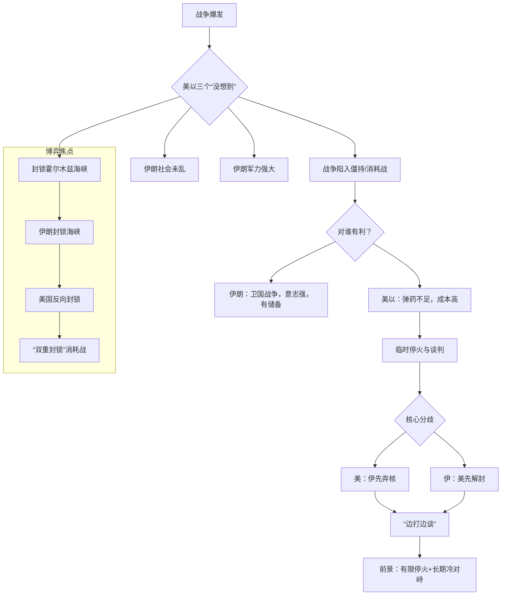

### 经典金句/数据
> “美国距离霸权衰落，只差一场错误的战争。” (p.21)
> “CIA评估显示，伊朗仍保留75%的机动导弹发射装置及70%弹道导弹库存，并可维持3至4个月经济生存。” (p.7)
> “CSIS估算，美军已消耗190枚‘萨德’拦截弹（占库存53%）和1060枚‘爱国者’拦截弹（占43%）。” (p.9)
> “美国的结构性困境：去工业化；政治极化与社会撕裂；巨额债务；亲以游说集团；权贵阶层集体腐败。” (p.21)

---

## 第2部分：二、美以伊战争的外溢影响

### 核心论点
**问题**：战争对地区及全球经济造成了哪些冲击？
**观点**：海湾国家成为最大受害者，以色列权势受损，伊朗影响力止跌回升，美国陷入进退两难的困境，而封锁海峡引发了前所未有的全球能源危机和衰退风险。

### 关键概念/事件
- **海湾国家重创**：经济上油气出口中断、旅游业停摆、基础设施被毁；安全上“安全神话”破灭，面临资本外逃和长期不确定性。
- **以色列“惨胜”**：虽将美国拖下水，但陷入持久战，弹药库存不足，经济承压，本土防空神话破灭，面临多线作战压力。
- **伊朗“得大于失”**：政权韧性得到验证，军事和地缘政治影响力（通过控制海峡）显著上升。
- **美国“进退两难”**：撤出意味着失败，承认“纸老虎”本质；继续卷入则国力持续消耗，加速霸权衰落。
- **全球能源危机**：霍尔木兹海峡封锁造成史上最大规模的石油供应冲击（缺口1600万桶/日），是1973年危机规模的三倍。油价上涨50-70美元，全球经济增长放慢1-1.6个百分点。

### 逻辑推演/叙事脉络
报告首先分析了战争对周边海湾国家的直接冲击，包括经济上的巨大损失和安全上的心理震慑。随后，转向主要参与方，指出以色列虽然达成了战略目标，但自身损耗巨大，力量对比实际下降；而伊朗则通过“以一敌二”不落下风的表现，显著提升了其在中东地区的影响力。报告的核心批判矛头指向美国，详细论证了美国缺乏打赢的条件、也承受不起失败的后果，陷入“打不赢、输不起、走不了”的结构性困境。最后，报告将视野扩大到全球，阐述了霍尔木兹海峡封锁引发的能源危机如何通过油价、通胀等渠道，威胁到欧洲、亚洲乃至全球的经济增长，并特别指出了对发展中国家的严重冲击。

### 流程图

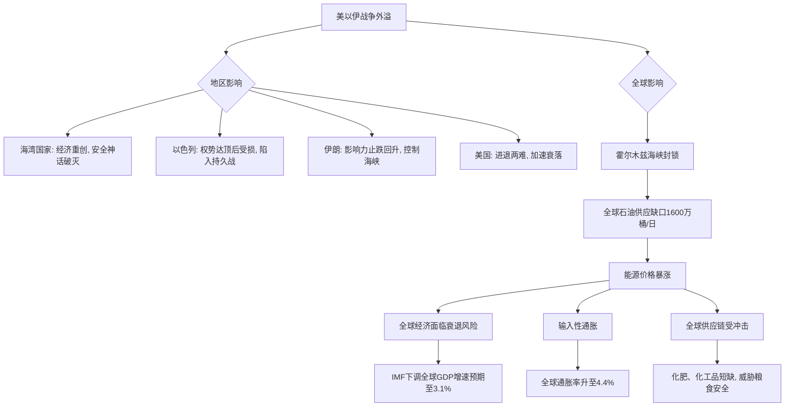

### 经典金句/数据
> “海湾国家‘安全靠谁’决定美元霸权根基。” (p.18)
> “英国《卫报》4月8日称，内塔尼亚胡将一切都赌在这场战争上，希望在美国的支持下通过军事行动来削弱伊朗的力量，但以色列未能实现相关目标或承诺。” (p.19)
> “全球石油日供应缺口一度高达1600万桶，其规模是1973年阿拉伯石油禁运冲击的三倍。” (p.24)
> “油价上涨10美元，全球GDP下降0.2%，通胀率上升0.4%。” (p.25)

---

## 第3部分：三、美以伊战争对中国经济的影响

### 核心论点
**问题**：战争给中国经济带来了哪些挑战和机遇？
**观点**：中国面临能源供应承压、输入性通胀和“一带一路”项目风险等负面影响。但中国能源抗压能力远超其他国家，全球能源转型利好中国新能源产业，同时人民币国际化进程加速。

### 关键概念/事件
- **能源供应承压**：中国是世界最大石油消费国，对外依存度72.7%，其中45-50%经霍尔木兹海峡进口。
- **输入性通胀风险**：战争推高了原油、甲醇等原材料价格，抬高了下游化工、汽车等行业成本。但另一方面，3月PPI同比上涨0.5%，结束了长达41个月的下降态势，对长期处于通缩压力的中国经济有一定正面效应。
- **能源韧性来源**：1）煤炭在中国能源结构中占比较高（煤电占约40%）；2）战略储备充足；3）中国主要面临通缩而非通胀压力。
- **全球能源转型利好**：战争加速了世界各国向可再生能源转型的决心。2025年风能和太阳能发电量首次超过煤电。中国在电动车、锂电池、太阳能板等领域的出口迎来爆发式增长。
- **人民币国际化加速**：中东对华原油贸易人民币结算占比突破41%；CIPS系统交易额爆发式增长；人民币在全球外储中占比升至8.9%，成为增长最快的储备货币。

### 逻辑推演/叙事脉络
报告首先承认战争对中国经济的负面影响，主要在能源供应、输入性通胀和海外项目安全三个方面。但随即笔锋一转，通过对比中外能源结构（中国油气占比仅26%，而美国为72%），论证了中国能源抗压能力的独特性。报告进而提出一个核心论点：这场能源危机对日韩印等高度依赖油气进口的工业化国家冲击更为严重，甚至可能导致其“强制性去工业化”，而这为中国产业升级提供了机遇。最后，报告从产业和金融两个层面总结了中国的机遇：一是全球能源转型浪潮催生了对中国新能源产品的巨大需求；二是中东乱局加速了“石油人民币”的崛起，推动了人民币国际化。

### 流程图

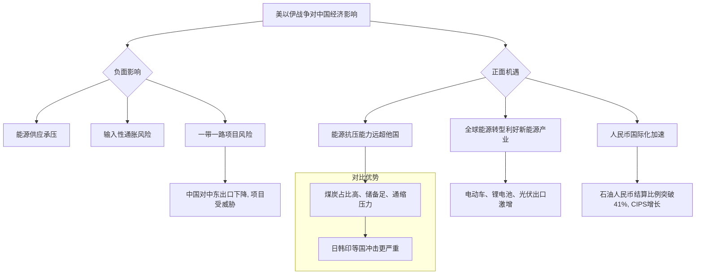

### 经典金句/数据
> “中国是世界最大石油消费国，原油对外依存度72.7%，约45-50%进口原油经霍尔木兹海峡。” (p.28)
> “3月PPI同比上涨0.5%，结束长达41个月同比下降态势。” (p.28)
> “世界能源消耗中油气占比平均是50%，美国是72%。中国是26%。” (p.30)
> “今年3月，中国清洁能源零部件及产品的合计销售额达到了260亿美元……较2025年同期则更是激增了52%。” (p.33)
> “中东对华原油贸易人民币结算占比历史性突破41%，人民币成为中东石油贸易中仅次于美元的第二大结算货币。” (p.34)

---

## 报告二：《Viet Nam Economic Update, May 2026: Sustaining Reforms, Navigating Uncertainty》

### 核心主题
世界银行发布的这份报告评估了越南近期经济发展状况。报告指出，尽管面临中东冲突引发的石油冲击和全球贸易不确定性，越南经济在2026年初表现依然强劲，这得益于强劲的出口、外资流入和公共投资。报告强调了改革的紧迫性，以解决其增长模式中的结构性失衡，并应对能源冲击带来的风险。

---

## 第1章：Executive Summary

### 核心论点
**问题**：2026年初越南经济的总体状况和前景如何？
**观点**：越南经济进入2026年时处于东盟最强地位，但中东冲突暴露了其增长模式的结构性弱点。预计2026年增长将放缓至6.8%，中期前景由改革和大型基建投资支撑。

### 关键概念/事件
- **强劲开局**：越南2025年GDP增长8%，2026年Q1同比增长7.8%，为9年来最高。
- **双重冲击**：中东石油冲击（数十年来最大）和持续的全球贸易不确定性。
- **结构性弱点**：FDI企业与国内企业差距扩大、外汇储备薄弱、企业杠杆率高企。
- **改革议程**：“Doi Moi 2.0”，包括大幅精简行政机构、修订86项法律和300项法令。
- **政策空间**：公共债务仅为GDP的34%（2025年），有充足财政空间应对冲击。

### 逻辑推演/叙事脉络
报告开篇肯定了越南经济的强劲表现和改革决心。然后，笔锋一转，指出中东冲突带来的石油冲击是考验其增长模式韧性的试金石。报告点明了其增长模式中存在的几大结构性弱点（内外资差距、贸易强但留存弱、高杠杆）。尽管外部逆风会减缓增长，但得益于投资拉动的财政扩张和巨大的财政空间，2026年6.8%的增速预期依然稳固。报告最后强调，石油冲击使改革的紧迫性更加尖锐，越南必须从要素积累转向生产力驱动型增长。

### 经典金句/数据
> “Viet Nam entered 2026 in the strongest position of any economy in ASEAN.” (p.10)
> “However, the Middle East conflict has exposed structural weaknesses in Viet Nam's growth model.” (p.10)
> “With public debt at only 34 percent of GDP (2025), there is meaningful fiscal space to increase spending and absorb shocks.” (p.10)

---

## 第2章：A. Global Development

### 核心论点
**问题**：影响越南的全球和区域发展背景是什么？
**观点**：尽管2025年全球增长具韧性，但中东冲突带来了多层次的石油供应冲击，使得全球贸易环境仍不确定，东亚地区2026年增长将放缓。

### 关键概念/事件
- **中东石油冲击**：到4月中旬，全球石油供应损失达1300万桶/日。冲击是多层次的，影响了全球近五分之一的LNG供应以及大量石化、化肥和工业原材料运输。
- **全球贸易不确定性**：美国最高法院裁定后，对等关税被10%的全球关税取代，但针对60个经济体的301调查启动，越南在列。
- **区域增长放缓**：预计2026年东亚发展中地区增长将从5.0%降至4.2%。中国是主要拖累因素，其他EAP国家从4.9%降至4.1%。
- **国家脆弱性差异**：蒙古、老挝、泰国是石油净进口大国（占GDP 5-13%），最为脆弱。越南债务低，但战略石油储备仅覆盖1-2个月。

### 逻辑推演/叙事脉络
报告描述了全球背景：2025年表现超预期，但中东冲突成为新的重大不确定性。该冲突不仅造成油价上涨，更破坏了LNG、化肥等关键物资的供应链。与此同时，美国贸易政策的不确定性（301调查）使全球贸易环境依然严峻。在这种背景下，东亚地区的增长引擎正在减速。报告接着用一张表格和传导机制图分析了不同EAP国家在面对石油冲击时的脆弱性和政策空间差异，指出越南属于暴露度高但政策空间相对充足的国家。

### 流程图

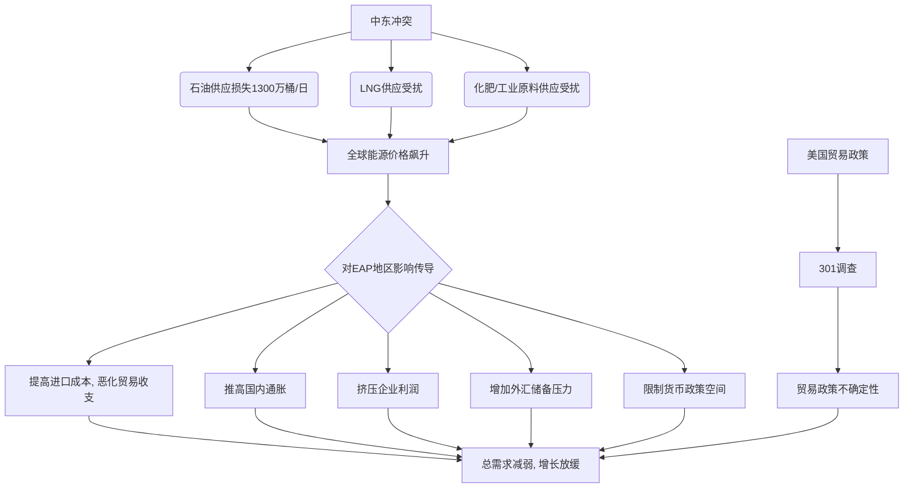

### 经典金句/数据
> “The Middle East oil shock had resulted in a loss of 13mbd by mid-April (Figure 1), with global energy prices up more than 50 percent yoy in end-April” (p.4)
> “Growth in developing East Asia and Pacific (EAP)…is likely to slow from 5.0 percent in 2025 to 4.2 percent in 2026” (p.3)
> “Viet Nam’s AI-related export shares have risen from around 20 percent of GDP in 2023 to approximately 32 percent by 2025” (p.7)

---

## 第3章：B. Recent Economic Developments

### 核心论点
**问题**：2026年初越南的实体经济、对外部门、物价、货币财政状况如何？
**观点**：经济增长强劲，但外部环境恶化，国内经济面临二元结构失衡、信贷集中、流动性紧张和货币贬值等多重压力。

### 关键概念/事件
- **增长来源**：由强劲的制造业出口和FDI、加速的公共投资和韧性的服务业（尤其是旅游业）驱动。
- **AI红利**：越南是AI相关产品出口的最大受益者之一，其AI相关出口占GDP比重从2023年的20%飙升至2025年的32%。
- **二元结构失衡**：FDI企业（仅占企业总数5%）贡献了73%的出口和一半的增加值和就业。国内企业（98%为小规模或非正式）在关税冲击中承受了不成比例的打击。
- **外部压力**：尽管2025年经常账户盈余创纪录（6.5%），但被金融账户赤字和资本外流抵消。2026年Q1出现5年来首次贸易逆差（37亿美元），本币贬值约3%，外汇储备仅够2个月进口。
- **金融风险**：信贷占GDP比重达145%（东盟最高），且过度集中于房地产。银行流动性趋紧，存款利率升至6-8%。

### 逻辑推演/叙事脉络
本部分详细拆解了越南经济在光鲜增长数字下的深层矛盾。首先，增长得益于AI相关的制造业出口和公共投资。然而，在关税冲击下，FDI企业和国内企业的表现出现巨大分化，根源在于二者在产业链地位、定价权和抗风险能力上的悬殊。其次，尽管贸易顺差巨大，但由于利润汇回、资本外流等因素，外汇储备始终承压，本币贬值。最后，报告揭示了金融系统的隐忧：信贷过度流向房地产，导致流动性紧张和非-performing loan风险积聚。总而言之，越南经济增长的果实并未广泛惠及国内私营部门，且宏观金融脆弱性正在累积。

### 流程图

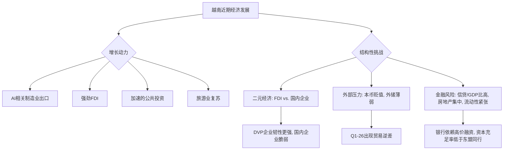

### 经典金句/数据
> “The global AI-related capex boom is reshaping technology supply chains and creating new export opportunities in East Asia.” (p.7)
> “Since the reciprocal tariff announcement, FDI firm exports surged 38.5 percent while domestic firm exports fell 9.8 percent” (p.10)
> “The current account reached a historical surplus of 6.5 percent of GDP in 2025” (p.12)
> “credit-to-GDP ratio to 145 percent (Figure 38), the highest in ASEAN” (p.16)

---

## 第4章：C. Outlook, Risks and Policy Priorities

### 核心论点
**问题**：越南的经济前景如何？面临哪些风险？政策重点是什么？
**观点**：预计2026年增长将因石油冲击而放缓至6.8%，风险偏向下行。政策挑战在于，既要维持宏观经济稳定，又要推进改革，为未来不同的增长模式奠定基础。

### 关键概念/事件
- **增长预测**：2026年GDP增长预计放缓至6.8%，通胀因能源价格上涨而升至4.2%。中期增长将受益于改革和3200亿美元的基础设施投资计划。
- **近期风险**：中东冲突持续将抑制出口，并加剧银行业和货币压力。贸易政策不确定性是另一大风险。
- **政策框架的核心挑战**：结构转型和宏观经济管理必须同时推进，且两者都不能等。
- **三大互联挑战**：1）确保3200亿美元投资管道得到严格评估和高效部署；2）完成从银行体系到更深、更多元化融资来源的过渡；3）利用FDI的优势，产生真正的国内联系和技术转移。
- **政策建议**：1）维持货币紧缩、扩大交易区间、建立双边互换；2）动员私人资本参与基建；3）深化资本市场；4）追求“更好的FDI”而非“更多的FDI”。

### 逻辑推演/叙事脉络
报告在对冲了外部冲击的影响后，给出了一个相对乐观但审慎的增长预测。报告明确指出，短期风险主要来自外部（地缘政治和贸易政策），而中期风险则更趋平衡，存在改革成功带来的上行潜力。报告的核心论述集中在政策挑战上：政府不能等待结构转型完成后再去应对短期冲击，也不能为了短期稳定而牺牲长期改革。报告精炼地概括了三个最关键的挑战——基建融资、金融体系转型、FDI质量提升——并提出，解决这些挑战是越南建立“投资者信心-私人投资-增长-韧性”良性循环的条件。

### 流程图

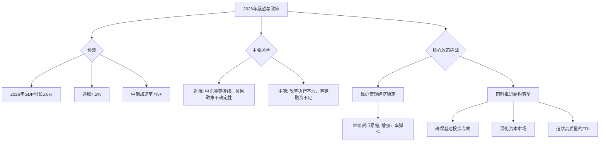

### 经典金句/Data
> “GDP growth is expected to moderate to 6.8 percent in 2026” (p.22)
> “Downside risks are elevated in the near term” (p.23)
> “The central challenge for Viet Nam's policy framework is that structural transformation and macroeconomic management must advance simultaneously, and neither can wait for the other.” (p.24)
> “The priority is not more FDI, but better FDI” (p.24)

---

## 报告三：《2026全屋智能系统行业简析报告》

### 核心主题
报告指出，全屋智能行业正从“单品凑合”向“空间主动智能”跨越。2026年是“空间主动智能时代”的元年，核心是由统一的底层操作系统、多模态交互及AI大模型推理能力构成。市场高速增长，前装市场主导，通讯协议“巴别塔”难题得到缓解，适老化与健康管理成为核心赛道。

---

## 第一章：行业核心界定与发展演进

### 核心论点
**问题**：什么是真正的全屋智能？行业发展到哪个阶段了？
**观点**：真正的全屋智能是以统一底层操作系统为核心，实现“人找服务”到“服务找人”的跨越。行业已完成三大阶段演进，2026年正式进入空间主动智能时代。

### 关键概念/事件
- **核心定义**：以统一底层操作系统为核心，基于空间感知、多模态交互与AI大模型推理能力，实现跨品牌、跨品类设备的底层互联互通，完成从用户指令被动响应到用户意图主动预判的无感化服务。
- **三大阶段**：
    1.  **单品智能**：以智能音箱、智能灯泡为代表，设备独立，依赖App或语音控制。
    2.  **场景智能**：以“回家模式”、“离家模式”为代表，设备之间实现初步联动。
    3.  **空间主动智能**：系统通过学习用户习惯，实现意图预判、无感化主动服务。
- **市场规模**：2022-2026年行业规模持续高速增长，价差倍率逐年收窄，反映供应链成熟度提升。

### 逻辑推演/叙事脉络
报告开篇即提出核心判断：2026年，全屋智能进入新阶段。通过对“核心定义”的阐述，报告明确了评判真伪全屋智能的标准——不是单品的堆砌，而是系统级的主动服务。随后，通过梳理“三大阶段的演进”，清晰展示了技术发展的路径和当前所处的历史节点。最后，通过市场规模测算的价差变化，论证了行业正在走向成熟和成本可控。

### 流程图

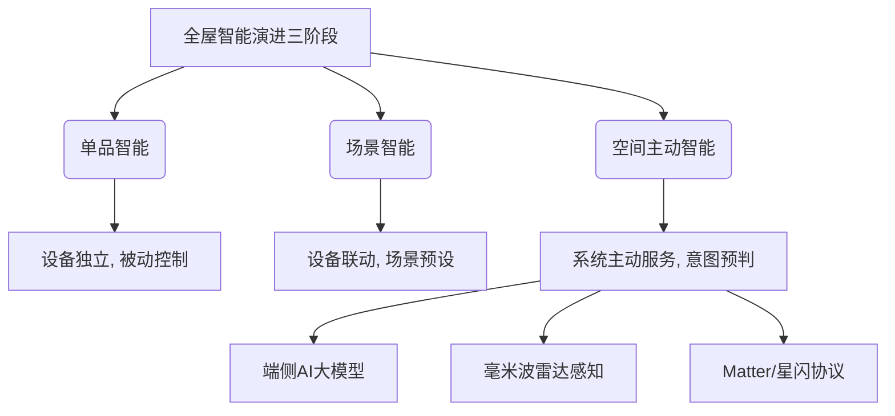

### 经典金句/数据
> “全屋智能系统正经历从‘单品凑合’向‘空间主动智能’的本质跨越。” (p.3)
> “报告指出，2026年行业将全面进入空间主动智能时代……” (p.3)
> “2022-2026年，行业规模持续高速增长，价差倍率逐年收窄……” (p.6)

---

## 第二章：市场与技术分析

### 核心论点
**问题**：前装与后装市场格局如何？核心技术突破是什么？
**观点**：前装市场渗透率远超后装，主要得益于PLC有线技术的稳定性和规模化成本优势。核心交互技术从“唤醒词”迈向“意图预判”，端侧AI大模型和毫米波雷达是两大支柱。

### 关键概念/事件
- **前装 vs. 后装**：前装（精装房、整装公司）渗透率远高于后装。前装可采用PLC有线技术，稳定性高，且规模化采购降低成本。后装面临布线成本高、兼容性差、稳定性不足三大痛点。
- **交互革命**：从“唤醒词”到“意图预判”。核心是端侧多模态大模型，可学习用户习惯，主动提供服务，且保障隐私。
- **毫米波雷达**：已全面替代传统红外传感器，解决了静止人体无法检测的痛点，且无需摄像头，规避了隐私焦虑。2026年出货量同比增长87%。
- **协议“巴别塔”**：Matter协议迎来实质性落地，星闪国产标准实现商用爆发，PLC成为前装标配。但头部品牌的私有生态壁垒依然存在。

### 逻辑推演/叙事脉络
本章首先通过对比前装和后装市场的渗透率“剪刀差”，解释了为何前装是当前市场的主导力量，核心在于PLC技术的稳定性和前装模式的成本优势。接着，报告聚焦于技术层面的两大突破：一是交互逻辑的质变，从被动响应到主动服务，这得益于端侧AI大模型的成熟；二是感知能力的升级，毫米波雷达的应用让无感化、精准化的空间感知成为可能。最后，报告直面行业长期痛点——通讯协议碎片化，分析了Matter、星闪、PLC等协议在2026年的最新进展和各自的优劣势。

### 流程图

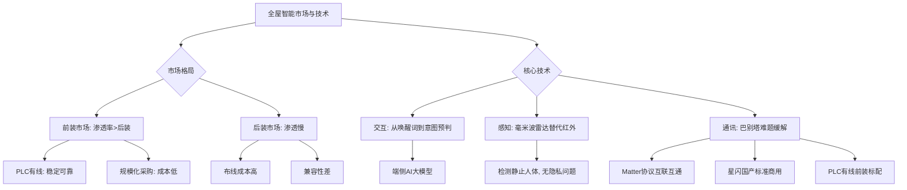

### 经典金句/数据
> “前装模式可实现有线+无线混合部署，依托PLC电力线载波技术解决无线断联、信号穿墙痛点……” (p.7)
> “毫米波雷达已全面替代传统人体红外传感器……2026年搭载毫米波雷达的全屋智能设备出货量同比增长87%” (p.8)
> “2026年全球支持Matter协议的设备数量突破2800万款” (p.9)
> “星闪技术……2026年迎来商用爆发，支持设备数量同比增长超215%” (p.9)

---

## 第三章：场景与生态

### 核心论点
**问题**：全屋智能未来的核心应用场景和商业模式是什么？
**观点**：适老化居家养老与全场景健康管理是万亿级核心赛道。商业模式从“卖产品”向“卖空间生活方式”转型，渠道从前装主导，服务（方案设计费、订阅制）成为新增长极。

### 关键概念/事件
- **适老化刚需**：中国60岁以上人口突破2.9亿，居家养老是主流。适老场景包括卫浴安全、行为异常监测、无感体征监测等，实现从“被动报警”到“主动干预”。
- **家庭健康管理**：从“患病治疗”转向“日常预防”。无感体征监测雷达、全屋空气管理系统等，使“健康管理融入空间”。
- **白色家电“去孤岛化”**：白电产品加速融入全屋智能，实现跨品牌、跨系统的无缝接入，重构家务流闭环（冰箱-烟灶-洗衣机-清洁设备联动）。
- **渠道变革**：前装渠道（房地产、整装公司）成为绝对主流。商业模式从“一次性硬件销售”转向“空间生活方式服务”，包括收取方案设计费、推出全屋智能订阅服务。
- **消费者决策**：核心驱动因素是系统稳定性、隐私安全、品牌口碑；消费行为呈现决策链长、专业依赖度高、为技术与服务付费意识提升等特征。

### 逻辑推演/叙事脉络
本章从应用场景和商业价值两个维度描绘了全屋智能的未来。首先，报告指出两大核心增长赛道：适老化和健康管理，并列举了具体的细分场景（如跌倒监测、无感体征采集）及其市场规模。其次，报告论述了白色家电如何从过去的“孤岛”状态融入全屋智能体系，实现真正的全场景家务自动化。最后，报告分析了产业生态，点明渠道已从前装主导，而商业模式的核心正从卖硬件转向卖“生活方式”和持续的“服务”，设计费和订阅制成为新的利润来源。

### 流程图

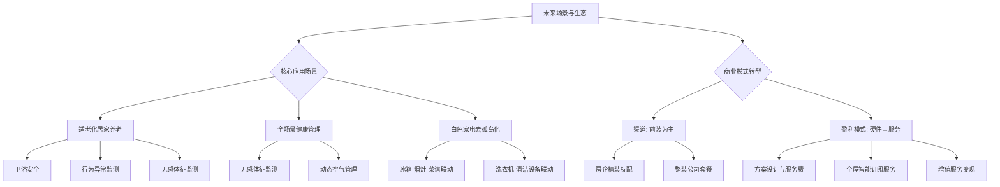

### 经典金句/数据
> “适老化居家养老与全场景健康管理将成为万亿级核心赛道” (p.3)
> “截至2026年，中国60岁以上老年人口突破2.9亿，独居老人超1.2亿” (p.10)
> “前装渠道成为绝对主流……头部品牌已从‘一次性硬件销售’，转向‘空间生活方式服务’的长期运营模式” (p.15)
> “接近七成用户担心全屋智能的隐私安全问题” (p.17)

---

## 报告四：《玻璃基板行业深度研究报告：后摩尔时代，玻璃基板或开启新一轮“材料革命”》

### 核心主题
本报告深入分析了半导体封装技术从“硅基”向“玻璃基”跨越的趋势。报告认为，玻璃通孔（TGV）技术已成为突破后摩尔定律物理极限的关键路径。在AI算力、HBM、高频通信等需求的驱动下，TGV市场空间广阔，国内已形成全链条布局，进口替代窗口期开启。

---

## 第1章：从硅到玻璃，TGV逐渐成为先进封装更优解

### 核心论点
**问题**：为什么玻璃基板（TGV）是先进封装的未来方向？
**观点**：传统有机基板和硅基TSV面临物理极限和成本瓶颈。玻璃基板凭借其优异的电学、热机械性能和高平整度，在AI芯片等高性能场景中成为替代方案，并获得了英伟达、英特尔、三星等巨头的路线图背书。

### 关键概念/事件
- **TGV定义**：在超薄玻璃基板上制作巨量微米级通孔，并实现垂直电气互连。
- **有机基板的局限**：翘曲严重（CTE不匹配）、信号质量差（高频信号衰减）。
- **硅基TSV的局限**：成本高（占用晶圆厂产能）、工艺复杂（需额外沉积绝缘层）、热应力大（CTE与Cu不匹配）。
- **玻璃基板的优势**：
    - 优异电学性能：介电常数（Dk）仅为硅的1/3，损耗因子（Df）低2-3个数量级。
    - 良好热机械性能：CTE可调节，与硅和Cu匹配，有效控制翘曲。
    - 低成本、高平整度：适合面板级（PLP）加工。
- **巨头路线图**：英特尔（2026年展示原型）、三星（向苹果供应样品）、英伟达（Rubin架构将采用）、台积电（探索中）。

### 逻辑推演/叙事脉络
报告从“问题-解决方案”的经典范式展开。首先，提出AI芯片对算力的超高要求，使得传统的有机基板成为性能瓶颈（翘曲、信号差）。接着，介绍当前的替代方案CoWoS（硅中介层），但指出其成本高昂。然后，引出玻璃基板作为填补空白地带的更优解，通过对比TSV和TGV的各项参数，论证了玻璃基板在电性能、热性能和成本方面的综合优势。最后，通过列举英特尔、英伟达、三星等行业巨头的技术路线图，证明TGV技术已从实验室走向产业化，并获得行业最高级别的认可。

### 流程图

```mermaid
graph TD
    A[AI芯片性能需求] --> B{传统封装基板瓶颈}
    B --> C[有机基板: 翘曲, 信号差]
    B --> D[硅中介层(TSV): 成本高, 工艺复杂]

    C --> E[寻找新方案]
    D --> E

    E --> F[玻璃基板 (TGV)]

    subgraph TGV 核心优势
        F --> G[电学性能: 低介电损耗]
        F --> H[热机械性能: CTE可调]
        F --> I[成本: 适合面板级生产]
    end

    G & H & I --> J{获得巨头路线图背书}
    J --> K[英特尔: 2026展示原型]
    J --> L[三星: 向苹果供样]
    J --> M[英伟达: Rubin架构采用]
```

### 经典金句/数据
> “人工智能芯片对计算能力的超高要求，使得传统有机基板面临替代风险” (p.6)
> “玻璃基板……信号传输速率能提升3.5倍，带宽密度提高3倍，功耗还能降低50%。” (p.7)
> “玻璃的相对介电常数大约为3.8，远低于硅材料的11.7。” (p.8)
> “英伟达即将量产的Rubin架构集成了3360亿晶体管……玻璃基板……成了英伟达新一代GPU封装的核心选择” (p.7)

---

## 第2章：TGV市场空间广阔，行业集中度高

### 核心论点
**问题**：TGV的市场驱动力和产业链结构是怎样的？
**观点**：TGV市场由AI/HPC和HBM需求驱动，是增长最快的细分市场。产业链分为上游材料/设备、中游制造、下游应用，目前呈“金字塔”结构，美欧日主导技术，国内正加速进口替代。

### 关键概念/事件
- **下游需求核心**：
    1.  **AI/HPC**：需要大尺寸、高互连密度、低信号损耗的基板，TGV是基本盘。预计2028年先进封装TGV渗透率达30%，市场规模近80亿美元。
    2.  **HBM**：需要解决多层堆叠带来的翘曲问题，TGV是第二增长曲线。三星、SK海力士已启动验证。
    3.  **光通信/CPO**：需要低高频损耗的基板，是TGV率先落地的细分场景。国内厂商（沃格、京东方）已小批量出货。
- **竞争格局**：“金字塔”结构，美欧日（康宁、肖特、英特尔）主导技术壁垒和量产话语权。中国厂商（戈碧迦、沃格光电、蓝思科技）在材料、制造、设备环节加速国产替代。
- **成本下降路径**：1）从晶圆级向面板级（PLP）升级，单位成本可降10-30%；2）全流程良率提升至85%以上；3）产业链国产化。

### 逻辑推演/叙事脉络
本章从需求端出发，论证了TGV市场爆发的必然性。报告将AI/HPC作为TGV的“基本盘”，详细解释了AI芯片尺寸增大和高频信号对基板的刚性需求。紧接着，将HBM作为“第二增长曲线”，强调了TGV在解决高堆叠封装翘曲问题上的不可替代性。然后，报告通过产业链图谱和竞争格局分析，指出虽然目前技术和市场由海外巨头主导，但中国在“技术代际切换”和“供应链自主可控”双重逻辑下，正迎来进口替代的黄金窗口期。最后，报告量化了成本的下降路径，指出规模化量产是TGV渗透率提升的关键。

### 流程图

```mermaid
graph TD
    A[TGV市场驱动力] --> B{AI/HPC (基本盘)}
    A --> C{HBM (第二曲线)}
    A --> D{光通信/CPO (率先落地)}

    B --> E[需求: 大尺寸AI芯片]
    E --> F[TGV渗透率: 2028年达30%]
    F --> G[市场规模: 近80亿美元]

    C --> H[需求: 多层堆叠解决翘曲]
    H --> I[三星、海力士验证中]

    D --> J[需求: 高频低损耗]
    J --> K[国内厂商小批量出货]

    A --> L{降本路径}
    L --> L1[晶圆级→面板级(PLP), 降本10-30%]
    L --> L2[良率提升至85%, 降本40%]
    L --> L3[产业链国产化]

    L1 & L2 & L3 --> M[TGV规模化量产拐点]
```

### 经典金句/数据
> “AI芯片封装是TGV最大的应用市场，预计2028年……市场规模将接近80亿美元” (p.15)
> “三星、SK海力士已启动玻璃基板在HBM封装中的验证，成为TGV行业的第二大核心应用市场。” (p.16)
> “沃格光电/通格微（沃格光电子公司）：1.6T光模块玻璃基载板相关产品已完成小批量送样。” (p.17)
> “从晶圆级向面板级（PLP）升级……单位面积加工成本可下降10%～30%” (p.11)

---

## 第3章：国内已形成TGV产业全链条布局，加速进口替代

### 核心论点
**问题**：国内TGV产业链的关键参与者及其进展如何？
**观点**：国内已形成从上游材料、中游制造到下游应用的全链条布局。戈碧迦（材料）、沃格光电（制造）、京东方（制造）、云天半导体（制造）、帝尔激光（设备）、蓝思科技（材料/制造）、新易盛（应用）等企业在各自环节取得关键突破，加速进口替代。

### 关键概念/事件
- **戈碧迦（上游材料）**：高端光学材料龙头，TGV封装基板产品已向国内多家知名半导体厂商送样。布局低介电常数玻璃纤维。
- **沃格光电（中游制造）**：全球少数掌握TGV全制程能力的企业，具备年产10万平方米智能化产线。可实现深宽比100:1，最小孔径5μm。
- **京东方（中游制造）**：显示面板巨头跨界，发布面向半导体封装的玻璃基面板级封装载板。
- **云天半导体（中游制造）**：晶圆级封装专家，率先实现TGV规模化量产，深宽比突破100:1。
- **帝尔激光（上游设备）**：精密激光设备企业，TGV激光微孔设备已实现首批出货，打破海外垄断。
- **蓝思科技（材料/制造）**：布局TGV玻璃基板和HDD玻璃基板双赛道。HDD玻璃基板推进客户验证，剑指日本企业垄断。
- **新易盛（下游应用）**：全球光模块龙头，官宣具备CPO晶圆级需要的封装工艺技术条件。

### 逻辑推演/叙事脉络
本章采用“分而述之”的方式，依次介绍了国内TGV产业链各环节的代表性企业。对于每家企业，报告都先介绍其基本业务，然后聚焦于其在TGV领域的具体技术突破、产品进展或市场地位。通过这种结构，报告向读者清晰地展示了国内TGV产业已经不是一个概念，而是一个拥有完整生态、并在多个关键环节实现技术突破和规模化生产的现实产业。这为投资者提供了清晰的标的图谱。

### 流程图

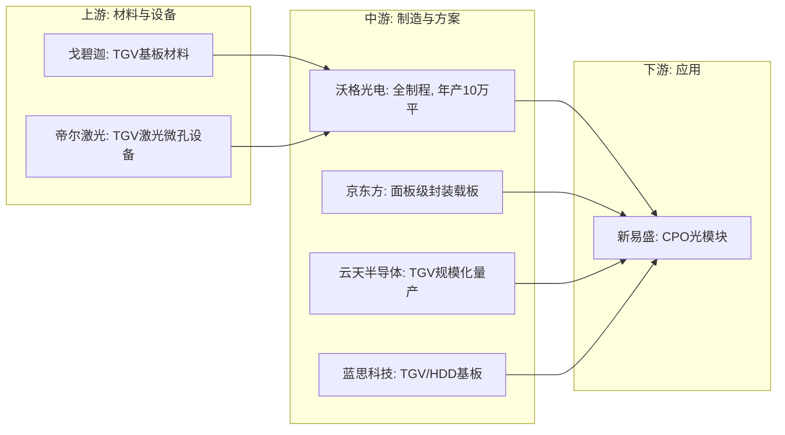

### 经典金句/数据
> “戈碧迦……TGV封装基板产品已向国内多家知名半导体厂商送样。” (p.20)
> “沃格光电……是全球目前极少数掌握TGV全制程能力和制备装备的公司……可实现深宽比100:1的玻璃通孔，最小孔径≥5μm。” (p.23)
> “京东方……成为大陆第一家从显示面板转向先进封装的业务部门。” (p.24)
> “云天半导体……率先实现国内规模化量产TGV技术，深宽比突破100:1” (p.25)
> “帝尔激光……2026年1月已顺利完成面板级玻璃基板通孔设备的首批出货” (p.26)
> “蓝思科技自主研发的HDD玻璃基板正推进客户验证工作……剑指日本企业长达数十年的独家垄断。” (p.29)

---
## 报告五：《2025年度药品审评报告》

> 说明：本报告为官方机构发布的年度审评数据总结，内容以数据统计和政策回顾为主。以下总结将重点提取关键数据、趋势和核心工作回顾。

### 核心主题
国家药监局药品审评中心发布的2025年度报告显示，药品注册申请申报量持续增长，审评审批效率提升。全年批准创新药76个，创历史新高。报告详细阐述了在鼓励创新、罕见病用药、儿童用药、中药发展以及监管科学等方面的主要工作和成果。

---

## 第一章：药品注册申请受理情况

### 核心论点
**问题**：2025年药品注册申请的总体受理情况如何？
**观点**：2025年药品注册申请申报量持续增长，全年受理20149件，同比增长3.00%。创新药、改良型新药和仿制药的申报结构反映了产业研发的活跃度和重点方向。

### 关键数据
- **总受理量**：20149件，同比增长3.00%。
- **按药品类型**：中药2723件，化学药品10587件，生物制品2820件。
- **按申请类别**：临床试验申请（IND）3756件，新药上市申请（NDA）663件，仿制药上市申请（ANDA）4591件。
- **创新药申报**：
    - 创新中药IND：103件（89个品种）。
    - 创新化学药品IND：1470件（606个品种）。
    - 创新治疗用生物制品IND：1073件（674个品种）。

### 逻辑推演/叙事脉络
本章通过大量的数据图表，清晰地展示了2021-2025年间各类药品注册申请受理量的变化趋势。总体趋势是持续增长，反映了中国医药产业的创新活力。报告进一步细化了中药、化学药、生物制品以及各类别（IND、NDA、ANDA）的受理情况，为后续的审评审批分析奠定了基础。

### 经典金句/数据
> “2025年，药品注册申请申报量持续增长，药审中心受理各类注册申请20149件（同比增加3.00%）” (p.4)
> “创新中药临床试验申请103件（89个品种）” (p.6)
> “创新化学药品临床试验申请1470件（606个品种）” (p.9)
> “创新治疗用生物制品临床试验申请1073件（674个品种）” (p.13)

---

## 第二章：药品注册申请审评审批情况

### 核心论点
**问题**：2025年药品审评审批的效率和成果如何？
**观点**：审评审批效率持续提升，全年审结19375件，同比增长6.11%。批准上市1类创新药76个品种，创历史新高，并批准了大量罕见病用药、儿童用药和境外已上市药品。

### 关键数据/事件
- **总审结量**：19375件，同比增长6.11%。
- **创新药**：批准上市1类创新药76个品种。其中26个通过优先审评，15个附条件批准，15个纳入了突破性治疗药物程序。
- **罕见病用药**：批准48个品种，其中12个通过优先审评。
- **儿童用药**：批准138个品种，其中25个通过优先审评。
- **境外已上市药品**：批准80个品种，其中57个为首次批准上市。
- **中药**：审评通过NDA 24件（24个品种），其中古代经典名方中药复方制剂16件。
- **化学仿制药**：审评通过3650件，自改革以来累计通过11227件。

### 逻辑推演/叙事脉络
本章是报告的核心，展示了2025年药品审评工作的“成绩单”。报告首先给出总体审结数据，然后聚焦于最具含金量的“1类创新药”，强调了其数量创历史新高以及多种加快上市程序的应用。接着，报告分别展示了在罕见病、儿童用药、中药、仿制药等关键领域的审评成果，并通过历史数据图表展现了长期的进步趋势。整个章节充满了积极的信号，表明中国药品审评体系正高效地推动着创新和急需药品的上市。

### 流程图

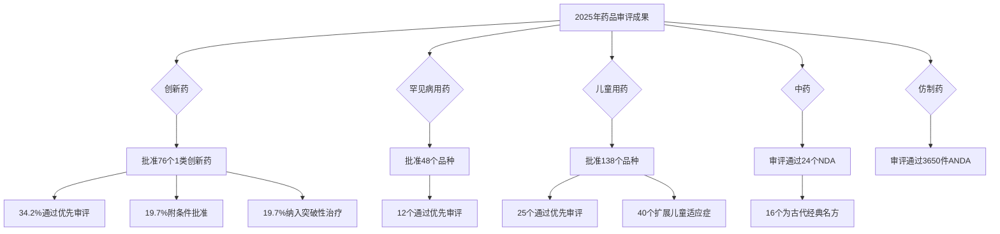

### 经典金句/数据
> “全年批准上市1类创新药76个品种……均创历史新高。” (p.19)
> “全年批准罕见病用药48个品种” (p.19)
> “全年批准儿童用药138个品种” (p.19)
> “全年批准境外已上市境内未上市的药品……80个品种” (p.19)
> “审评通过中药NDA24件（24个品种），其中……古代经典名方中药复方制剂NDA16件” (p.20)

---

## 第三章至第八章：加快上市程序、沟通交流、指导原则、监管科学及工作回顾

### 核心论点
**问题**：药审中心通过哪些机制和举措来鼓励创新和提升审评质量？
**观点**：通过突破性治疗、附条件批准、优先审评等加快上市程序，加强与申请人的沟通交流，完善技术指导原则体系，并深入开展药品监管科学研究，全面提升了审评审批质效。

### 关键概念/事件
- **突破性治疗药物程序**：2025年纳入101件，累计纳入395件，主要集中于抗肿瘤药物。
- **附条件批准程序**：2025年附条件批准38件（24项适应症），累计附条件批准226件（160项适应症）。
- **优先审评审批程序**：2025年纳入133件，批准124件。审评时限由常规的200日缩短为130日。
- **沟通交流**：2025年办理沟通交流会议申请4705件，接收一般性技术问题咨询13202个。
- **指导原则**：全年发布49项技术指导原则，累计发布超600项，涵盖细胞基因治疗、疫苗、放射性药物等领域。
- **监管科学研究**：组织实施65项研究，形成了22项技术指导原则，推动8款CAR-T、首款干细胞和基因治疗药物上市。

### 逻辑推演/叙事脉络
报告的第三至七章系统地介绍了药审中心为保障和促进药品创新所建立的制度框架和基础能力。通过详细阐述三大“加快上市程序”的申请、纳入和批准数据，展示了这些“快速通道”的实际运行效果。沟通交流和指导原则体系，则体现了药审中心在服务产业、提升行业研发规范性方面的努力。监管科学章节则展示了其在追踪前沿技术（如细胞治疗、疫苗）和建立审评标准方面的前瞻性布局。第八章以大事记的形式回顾了2025年的重点工作。

### 经典金句/数据
> “2025年……同意纳入突破性治疗药物程序101件……较2024年增加10.99%。” (p.36)
> “2025年共有38件药品注册申请（24项适应症）附条件批准上市” (p.38)
> “2025年共纳入优先审评审批注册申请133件（92个品种），同比增加7.26%” (p.39)
> “2025年，药审中心办理沟通交流会议申请4705件……同比增加19.25%。” (p.42)
> “截至2025年12月31日，已支持推动8款CAR-T细胞治疗药品在国内上市……国内首款基因治疗药物上市” (p.49)

---

## 报告六：《2025年中国无人城配车行业白皮书》

### 核心主题
本白皮书系统分析了中国无人城配车行业的发展背景、技术路径、商业模式和未来趋势。报告认为，2025年是无人城配车的“规模化元年”，在政策、技术、商业需求的多重共振下，行业已迈入规模化爆发阶段，将对城市物流乃至城市空间产生深远影响。

---

## 第1章：无人城配车行业发展背景

### 核心论点
**问题**：为什么无人城配车会在此时爆发？
**观点**：无人城配车的爆发是政策、技术、商业等多重因素协同共振的结果。零售业态变革、同城货运进化以及快递末端成本压力，共同催生了对智能化、标准化运力的刚性需求。

### 关键概念/事件
- **发展历程**：从技术孵化、需求催化、政策松绑，到2025年进入规模商业化与生态构建阶段。
- **需求演进**：
    - **零售变革**：仓配去中心化、近场零售兴起，导致高频短驳需求增加，传统模式难以满足。
    - **快递行业**：“量增价跌”，末端派送成本占比已突破60%，成为最大成本项，无人化是破解瓶颈的唯一解。
- **成本效能**：与传统模式相比，无人城配车单月运营成本可降低约2/3，核心在于省去司机成本并实现24小时不间断运行。
- **发展外溢性**：重塑城市时空（利用夜间运力）、优化空间资源（释放核心区土地）、赋能相邻业态（移动商业）。

### 逻辑推演/叙事脉络
报告开篇即指出，无人城配车的爆发是多重因素共振的结果。首先，从需求侧分析，零售业态的深刻变革（即时零售、前置仓）和快递行业极致降本的压力，共同构成了对无人化运力的强大需求。其次，从供给侧论证，技术的演进（成本下降、算法成熟）和政策的破冰（路权开放）使规模化应用成为可能。最后，通过成本对比，清晰地展示了无人城配车的经济性优势。报告进一步指出，其价值不仅在于降本增效，更具有显著的城市发展正外溢性。

### 流程图

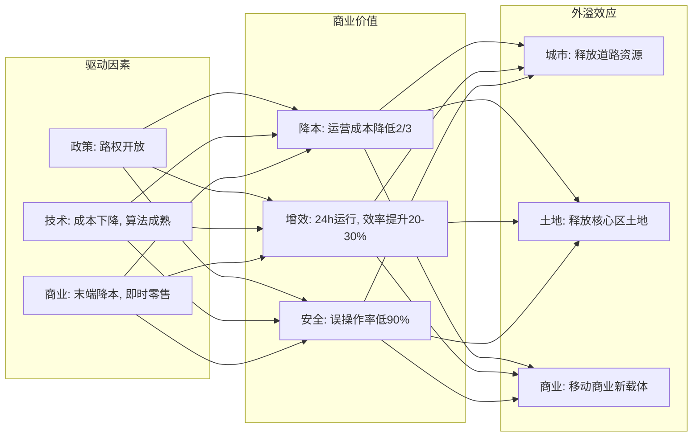

### 经典金句/数据
> “无人城配车的爆发时间点是政策、技术、商业等多重因素的协同共振” (p.5)
> “末端派送成本……其占比已从十年前的约30%攀升至目前的60%以上” (p.8)
> “城市配送单月成本对比……无人车配送方案单月降本（元）5650.00 (-69%)” (p.10)
> “新石器无人车在安全实践方面显示其系统误操作率可较人工驾驶事故率低90%” (p.9)

---

## 第2章：无人城配车行业技术分析

### 核心论点
**问题**：无人城配车的技术特征是什么？与其他自动驾驶有何不同？
**观点**：无人城配车（Robovan）以“调度与末端”为算法核心，聚焦半封闭/结构化场景，商业化落地节奏快于Robotaxi和Robotruck。其技术正从高精地图依赖向“轻图/无图”方案演进。

### 关键概念/事件
- **定义**：无人城配车是城市物流的核心落地载体，运力介于配送机器人和无人卡车之间。
- **技术对比**：
    - vs. Robotaxi：后者以“预测与博弈”为核心，需应对复杂交通，商业化慢；前者以“调度与末端”为核心，场景可控，商业化快。
    - vs. Robotruck：后者以“预见与护航”为核心，安全要求极高，尚处攻坚期；前者场景相对结构化，进展更快。
- **技术进程**：封闭/结构化场景（园区、快递末端）是当前商业化主战场，正逐步向全开放场景挑战。
- **方案演进**：从依赖高精地图，向“轻地图+BEV感知”，最终向“无图化”端到端方案演进，以降低部署成本和提高泛化能力。

### 流程图

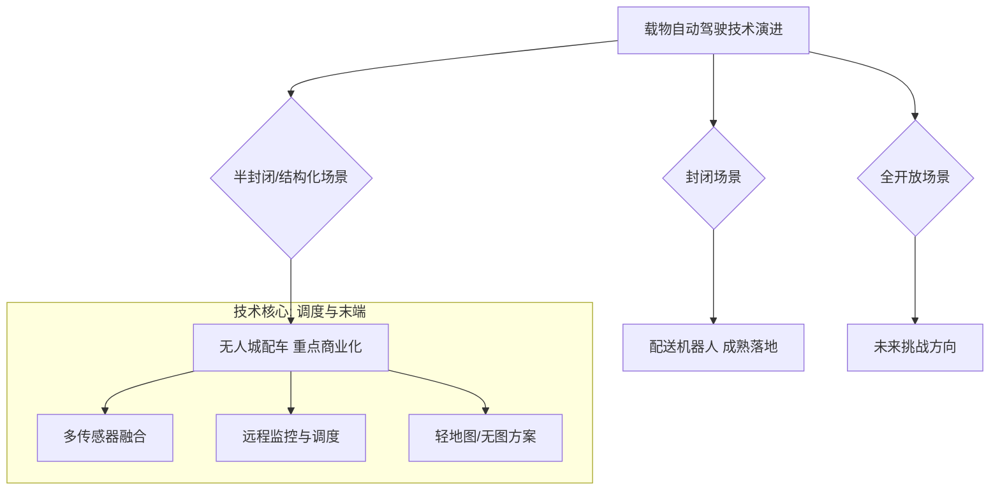

### 经典金句/数据
> “无人城配车（Robovan）与无人驾驶出租车（Robotaxi）……在技术路径与商业化节奏上已呈现鲜明分化。” (p.16)
> “载物自动驾驶技术正沿着场景可控程度的梯度有序演进” (p.18)
> “无人城配车商业化程度呈现‘场景复杂度越高、成熟度越低’的分层特征” (p.19)

---

## 第3章：无人城配车行业商业全景分析

### 核心论点
**问题**：无人城配车的市场格局、商业模式和未来趋势是怎样的？
**观点**：市场已迈入规模化爆发期，2025年销量约2.2万辆，快递配送是核心场景。商业模式正从“卖车”向RaaS“卖运力”创新。未来趋势是服务从“定点”走向“泛化”，并实现与城市基础设施的深度融合。

### 关键概念/事件
- **市场规模**：2025年是“规模化元年”，全国销量约2.2万辆，保有量达3万辆。预计2030年销量近150万辆。
- **竞争格局**：第一梯队玩家（新石器、九识智能）已占据主导地位，市场份额合计约84%。新石器累计部署约1.5万台，显著领先。
- **商业模式创新**：
    - **RaaS（Robovan-as-a-Service）**：厂商将无人配送车转化为公共运力资源，客户按需购买服务（按单/里程付费），无需承担车辆资产。
    - **案例**：新石器与滴滴送货合作，在青岛启动RaaS服务，起步价9.9元。
- **场景分析**：快递配送（最成熟）、商超零售、批发货运、园区物流是主要场景。不同场景对车型、技术、运营模式有差异化要求。
- **发展趋势**：服务从“定点”走向“泛化”，从固定路线向开放未知道路演进；商业主体多协同，避免价格战陷阱；实现城市服务业的二次分工，重构“人机协作”模式。

### 流程图

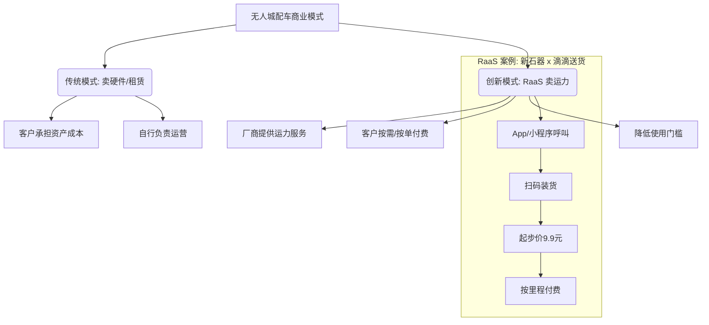

### 经典金句/数据
> “2025年成为‘规模化元年’，全国销量约2.2万辆，保有量达3万辆。” (p.23)
> “第一梯队玩家已占据市场主导地位，前两家企业合计市场份额约84%。” (p.31)
> “RaaS（即Robovan-as-a-Service）模式……客户按需购买，无人城配车实现全域点对点的多点配送，按单（即按里程）付费” (p.29)
> “服务模式正由早期依赖固定线路和单一业务场景的‘定点部署’，向覆盖更广城市空间与多业务需求的‘泛在式运力’演进。” (p.35)

---

## 报告七：《人形机器人行业深度研究报告：人形机器人大势所趋，下游应用逐步打开》

### 核心主题
本报告深度分析了人形机器人行业的发展情况、产业链和价值量构成。报告认为，特斯拉Optimus Gen 3即将量产，国内玩家（宇树、智元等）出货量领先全球。核心零部件中，执行器（丝杠、减速器、电机）价值量最高，国产替代空间巨大。报告给出了明确的投资建议，关注灵巧手、Tier 1供应商及核心零部件厂商。

---

## 第1章：人形机器人行业发展情况

### 核心论点
**问题**：人形机器人的全球市场格局和商业化进展如何？
**观点**：全球人形机器人市场在2025年已进入商业化落地初期，中国凭借完善的供应链和多场景落地优势，出货量占全球84.7%，稳居第一。宇树科技出货量全球第一。

### 关键概念/事件
- **全球市场**：2025年全球出货量约1.7万台，市场规模28.8亿元。
- **中国市场**：出货量约1.44万台，占全球84.7%，市场规模15.5亿元。
- **竞争格局**：中国企业表现突出。宇树科技出货量超5500台，全球占比32.4%，位居第一。智元、乐聚、优必选等紧随其后。海外头部企业（如特斯拉）仍以技术突破和内部测试为主，尚未规模化量产。
- **特斯拉进展**：Optimus Gen 3进入最后开发阶段，计划于2026年夏季启动量产。初期目标在佛蒙特建成百万台级产线，远期规划年产能达千万台。

### 逻辑推演/叙事脉络
本章通过详实的出货量和市场份额数据，直接描绘了全球人形机器人产业的竞争地图。报告的核心论断是：中国已在该产业占据绝对主导地位，这得益于国内完善的供应链和庞大的应用场景。相比之下，尽管特斯拉等海外巨头具有强大的品牌和技术影响力，但在2025年的时间节点上，其商业化量产进度落后于中国的头部企业。

### 经典金句/数据
> “2025年全球人形机器人……出货量约1.7万台，市场规模达到28.8亿元” (p.6)
> “2025年，中国人形机器人……出货量约1.44万台，占全球总出货量的84.7%，市场规模达到15.5亿元” (p.6)
> “宇树科技的人形机器人出货量超5500台，全球占比达32.4%，出货量和市场占比均居全球第一” (p.6)
> “特斯拉Optimus Gen 3已进入最后开发阶段，计划于2026年夏季启动量产。” (p.3)

---

## 第2章：人形机器人产业链拆分

### 核心论点
**问题**：人形机器人的产业链和价值量是如何分布的？
**观点**：执行器系统是价值占比最高的环节（合计48.8%），其中线性执行器（28.9%）高于旋转执行器（19.9%）。传感器系统（16.8%）和灵巧手（14%）紧随其后。

### 关键概念/事件
- **价值量结构（以特斯拉机器人为例）**：
    - **执行器系统（48.8%）**：线性执行器（28.9%）> 旋转执行器（19.9%）。
    - **传感器系统（16.8%）**：其中六维力矩传感器独占11.2%。
    - **灵巧手（14%）**：核心部件空心杯电机占比6.7%。
    - **其他**：软件算法（9.3%）、内外骨骼（7.0%）、动力系统（1.4%）。
- **产业链**：上游为核心零部件（减速器、伺服电机、传感器等），中游为整机平台（特斯拉、优必选、宇树等），下游为应用场景（工业、物流、服务等）。

### 流程图

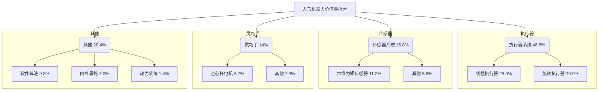

### 经典金句/数据
> “执行器系统是价值占比最高的环节：包含线性执行器（28.9%）与旋转执行器（19.9%），执行器合计占比达48.8%” (p.8)
> “传感器系统以16.8%的占比紧随其后，其中六维力矩传感器独占11.2%” (p.8)
> “灵巧手价值占比为14%，其核心部件空心杯电机占比6.7%” (p.8)

---

## 第3章：人形机器人核心零部件

### 核心论点
**问题**：人形机器人的核心零部件（丝杠、减速器、电机、传感器）技术趋势和投资机会在哪里？
**观点**：丝杠（尤其是行星滚柱丝杠）、精密减速器（谐波、RV）、伺服电机（无框力矩电机、轴向磁通电机）以及传感器（力传感器、IMU）是关键。国产化率在丝杠、电机领域不断提升，但在高端传感器领域仍被海外巨头主导。

### 关键概念/事件
- **丝杠**：行星滚柱丝杠是线性执行器的核心，具有高承载、高寿命、体积小等优点。人形机器人是其重要增长驱动力。2024年中国市场规模13.13亿元。国内厂商（北特科技、贝斯特等）加速替代。
- **减速器**：谐波减速器（用于旋转关节）和RV减速器（用于工业机器人）是核心。人形机器人领域，精密行星减速器应用更为主流。
- **电机**：
    - **无框力矩电机**：线性与旋转执行器的核心底座，直接嵌入关节，实现直驱。全球市场规模预计2029年达数亿美元。
    - **轴向磁通电机**：相比径向磁通，具有极高的转矩密度和紧凑结构，是未来机器人关节的理想方案。
    - **第四代永磁材料钕铁氮**：助力谐波磁场电机应用，提升转矩密度。
- **传感器**：
    - **力矩传感器**：六维力传感器是价值量最高的传感器，是实现高精度力控的关键，降本需求迫切。
    - **IMU（惯性测量单元）**：如同人形机器人的“小脑”，是维持平衡与运动调控的核心。MEMS IMU市场被Honeywell、ADI等海外巨头主导，国内厂商份额较小。

### 逻辑推演/叙事脉络
本章将人形机器人价值量最大的环节——核心零部件——进行了逐一拆解。对于每个部件（丝杠、减速器、电机、传感器），报告都采用了相同的分析模式：先介绍其技术原理和在机器人中的作用，然后分析市场现状和竞争格局，最后点明技术趋势和投资机会。这种结构清晰地指出，执行器环节（丝杠、电机、减速器）国产替代进程较快，而感知环节（高端力传感器、IMU）仍是海外巨头把控的“卡脖子”环节，也意味着更大的国产替代空间。

### 流程图

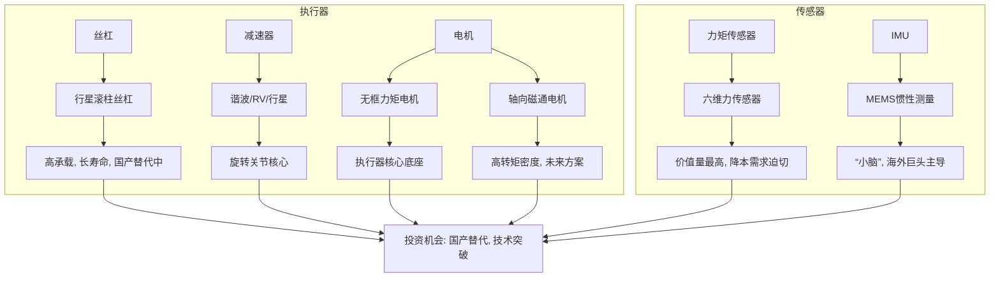

### 经典金句/数据
> “行星滚柱丝杠……2024年，中国行星滚柱丝杠市场规模为13.13亿元” (p.11)
> “无框力矩电机……随着人形机器人迭代进化以及自由度提升，对应的执行器数量提升带动电机行业快速增长。” (p.15)
> “六维力矩传感器……是人形机器人实现高精度力控的关键” (p.20)
> “IMU如同人形机器人的‘小脑’，是其维持平衡与运动调控的核心感知单元。” (p.21)
> “国内MEMS惯性传感器市场被国际巨头瓜分……国内IMU市场份额TOP5均为海外企业，总占比达9成。” (p.22)

---

## 报告八：《越野汽车市场与技术发展趋势白皮书》

### 核心主题
本白皮书由中国汽车技术研究中心、捷途汽车和清华大学联合发布，系统梳理了中国越野汽车产业的发展环境、市场格局和技术趋势。报告指出，在电动化和智能化技术驱动下，越野汽车正从小众专业市场走向大众消费市场，并形成了“轻越野”和“强越野”两大细分赛道。报告还深入探讨了技术（越野智能、动力底盘）和生态（服务、社群、文旅）的演变趋势。

---

## 第1章：越野汽车的定义与发展环境

### 核心论点
**问题**：传统越野汽车的定义如何演变？当前发展的外部环境是什么？
**观点**：传统以“非承载式车身、大排量发动机”为核心的“强越野”定义，正被电动化、智能化技术拓展。出现了兼顾城市和轻度越野的“轻越野”新品类。经济、政策、文化、技术四大驱动力共同推动市场变革。

### 关键概念/事件
- **定义演变**：
    - **传统/强越野**：非承载式车身、四轮驱动、差速锁、大排量发动机。符合GB/T15089的G类车辆标准（接近角≥25°，离去角≥20°等）。
    - **新/轻越野**：承载式车身，但具备四驱和至少一把差速锁，接近角/离去角达标，兼顾城市经济性与越野风格。
- **四大外部驱动力**：
    - **经济**：消费升级，新能源技术降低使用成本。
    - **政策**：国家支持自驾营地建设，地方推动“体育+旅游”融合。
    - **文化**：自驾游兴起，社交媒体“种草”效应，越野文化从硬核技能变为社交货币。
    - **技术**：电动四驱、智能底盘重塑技术范式。

### 逻辑推演/叙事脉络
本章首先从定义入手，指出越野汽车的品类正在分化。通过梳理传统“强越野”的技术标准和新兴“轻越野”的特征，清晰地界定了市场的两大方向。接着，从经济、政策、文化、技术四个维度分析了产业变革的外部环境，论证了这场变革的必然性和系统性。尤其强调了技术（电动化、智能化）是打破传统性能与能耗矛盾、推动市场从专业走向大众的根本力量。

### 流程图

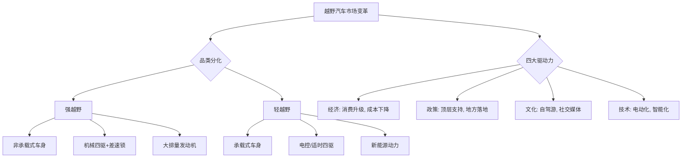

### 经典金句/数据
> “传统以非承载式车身、大排量发动机为核心的时代正渐行渐远，取而代之的是以电驱动、智能化、生态圈为核心的新越野时代。” (p.8)
> “轻越野……定位为轻越野，其代表配置包括承载式车身，接近角≥25°，离去角≥20°，具备四驱且至少带一把差速锁。” (p.9)
> “电动四驱平台密集推出，推动技术路线从机械四驱主导向机电并重的方向演进” (p.12)

---

## 第2章：越野汽车市场发展历程与趋势展望

### 核心论点
**问题**：中国越野汽车市场的规模、结构和竞争格局如何？
**观点**：市场已突破130万辆，轻越野占据近70%份额。自主品牌主导（占比超77%），插混（PHEV）正加速替代燃油。车型向中大型升级但价格不断下探，智能化与场景化趋势明显。

### 关键概念/事件
- **市场规模**：2025年销量突破130万辆，同比增长25.18%。预计2026年超150万辆。
- **市场结构**：
    - **轻越野**：占据约70%市场份额，由“方盒子”造型推动（如捷途旅行者）。
    - **强越野**：在混动技术赋能下稳健扩容。
- **竞争格局**：自主品牌主导，奇瑞捷途（轻越野）、长城坦克（强越野）、比亚迪方程豹（电越野）等构成第一梯队。
- **动力趋势**：插混（PHEV）正在加速替代燃油。在强越野市场，新能源占比已达57%，PHEV是绝对主流。在轻越野市场，PHEV和BEV并行发展。
- **价格与级别**：车型向中大型升级（空间需求），但价格不断下探（10-20万元区间成主力），体现技术平权。
- **智能化趋势**：从机械操控向全场景智能辅助发展。智能地形识别、透明底盘、高速领航等功能下放。捷途XWD全智能四驱系统可毫秒级识别路况。

### 逻辑推演/叙事脉络
本章通过详实的销量和占比数据，描绘了中国越野市场的繁荣景象。报告首先展示了市场总量和增速的跃升，然后通过对轻越野和强越野的结构分析，指出了增长的主要动力来源。竞争格局部分，清晰展示了自主品牌的主导地位，并点明了不同品牌的差异化优势（如捷途在轻越野、坦克在强越野）。动力趋势分析表明，PHEV技术已成为行业共识，正在革命性地改变越野车的使用体验和成本结构。最后，通过价格、级别和智能化的分析，总结了技术下沉和产品升级的市场趋势。

### 流程图

```mermaid
graph TD
    A[2025年中国越野市场] --> B{销量: 130万辆}
    B --> C[轻越野 70%]
    B --> D[强越野 30%]

    A --> E{竞争: 自主品牌主导 (77%)}
    E --> E1[奇瑞捷途: 轻越野]
    E --> E2[长城坦克: 强越野]
    E --> E3[比亚迪方程豹: 电越野]

    A --> F{动力: PHEV加速替代燃油}
    F --> G[强越野: PHEV占比57%]
    F --> H[轻越野: PHEV+B EV并行]

    A --> I{趋势: 价格下探, 智能化升级}
    I --> J[主流价格10-20万元]
    I --> K[智能地形识别, 透明底盘普及]
```

### 经典金句/数据
> “2025年我国越野汽车销量突破130万辆，同比增长25.18%。” (p.13)
> “2025年国内轻越野汽车销量突破90万辆……占越野汽车市场总销量的70%左右。” (p.14)
> “2025年中国自主品牌在越野汽车市场的销量占比已超过77%” (p.16)
> “在强越野市场，新能源车型占比已达57%，已超过燃油车” (p.18)
> “捷途旅行者等车型搭载全智能四驱系统XWD，其智能地形识别系统……实现从手动选模式到自动识别路况的跨越。” (p.21)

---
（因篇幅限制，后续报告（九至十三）将仅呈现核心主题和关键洞见，略去详细章节展开。）

## 报告九：《2026年新能源人才全球本地化策略》

### 核心主题
领英发布的这份报告聚焦于中国新能源企业在全球化进程中面临的人才挑战与策略。报告指出，地缘政治和各国“本地化”政策要求中企从“产品输出”转向“生态扎根”，而深度“在地化”链接的核心是构建本地化人才体系。报告提出了从“响应业务”到“引领业务”的HR战略重塑，并详细阐述了如何通过领英平台进行人才盘点、雇主品牌建设和组织级能力升级，以破解海外“留存”与“协同”双重困境。

### 关键洞见
- **行业背景**：新能源正成为全球主导力量，但市场分化严重。中国新能源企业出海模式正从被动缓解产能走向主动生态深耕。
- **核心挑战**：地缘政治和各国政策（如美国IRA、欧盟NIZIA）要求“本地制造与采购”，这对人才本地化提出了极高要求。错误的人才模型会导致“在地化”失败。
- **留存之痛**：海外团队“招了留不住”，核心原因是缺乏归属感和清晰的成长路径。
- **协同之痛**：总部与海外存在“隐形壁垒”，跨文化沟通成本高，战略落地变形。
- **解决方案**：
    - 以“技能（Skill）”为全球通用语，打造统一人才底座。
    - 通过LinkedIn Learning等平台，用“持续赋能”代替“被动填坑”，为海外人才提供公平、透明的全球化成长体系。
    - 将跨文化协作能力变成“可训练、可复制”的组织能力，用“同频”代替“管控”。

---

## 报告十：《2026全球人工智能OPC模式商业洞察报告》

### 核心主题
本报告由亿欧智库发布，系统定义了人工智能“一人公司”（OPC，即One-Person Company）模式。报告指出，OPC是指在AI技术协同下，个人可独立完成全链路业务闭环的新型创业组织形态。在技术（大模型、智能体）、资本和政府政策的共同驱动下，全球OPC市场正呈现爆发式增长。报告对比了国内外发展路径，并预测技术将从“AI辅助”转向“AI原生”，模式将向“一人独角兽”跃迁。

### 关键洞见
- **OPC定义**：核心是“单人+AI=公司”，AI承担标准化工作，人聚焦战略与创意。
- **核心特征**：能力复合性、生态依附性、数字原生、效率突增。
- **商业模式**：从项目制服务，到方案产品化，再到资源整合平台。
- **驱动因素**：
    - **技术**：大模型训练成本降低（如DeepSeek mHC架构），智能体（如OpenClaw）实现自主执行，低代码/无代码平台实现技术平权。
    - **资本**：2025年中国OPC项目融资总额突破120亿元，同比增长超400%。
- **发展路径**：
    - **国外**：市场驱动，遵循“技术赋能→市场验证→资本扩张”路径，围绕“独立黑客”社区生态。
    - **国内**：政策驱动，由地方政府（江苏、上海、浙江、广东、北京）牵头建立OPC社区，提供算力、空间、资本等系统性扶持。
- **发展趋势**：
    - 技术基础从“AI辅助”转向“AI原生”。
    - 从“一人公司”向“一人独角兽”跃迁。
    - 国内政策生态化，国外超级个体全球化。

---

## 报告十一：《中国旅游目的地海外推广指南-欧洲篇》

### 核心主题
本指南由中国旅游研究院和远海国际旅游集团联合发布，旨在为中国旅游目的地面向德国、法国、意大利、西班牙四国开展海外推广提供策略建议。报告基于对四国出境游客的需求偏好和行为特征分析，提出了差异化的推广主题、内容和渠道策略，并总结了线下推广（参展、推介会）的工作要点。

### 关键洞见
- **市场潜力**：德法意西是中国重要的欧洲客源市场，但四国来华游客占其出境总人次比例均低于1%，提升潜力巨大。
- **需求共性**：四国游客普遍以家庭出游为主，热爱文化体验，重视服务品质与性价比，普遍使用数字工具规划行程。
- **各国差异化策略**：
    - **德国**：以可信信息与规则透明带动深度文化客群与商务市场。侧重权威渠道和功能型平台。
    - **法国**：以体验质量与场景化表达激活文化体验型与品质度假型客群。侧重UGC和口碑渠道，强调深度文化实践。
    - **意大利**：以慢节奏体验与主题化产品（康养、节庆）塑造差异化吸引力。需突出保障机制透明化。
    - **西班牙**：以文化美食与社交传播做声量。侧重西语环境与社群化传播，利用Instagram、TikTok等平台。
- **线下推广要点**：
    - **境外参展**：需定制差异化物料，选择具备定制能力的本地旅行商合作。
    - **境外推介会**：应以可销售的具体产品为核心，规模不宜过大，注重会后一对一洽谈和跟踪。

---

## 报告十二：《2026年技术趋势报告：Five Forces Shaping the Future》

### 核心主题
Globant公司发布的这份报告提出了塑造未来的五大技术力量：Agentic AI（代理式人工智能）、Quantum Communication（量子通信）、Polyfunctional Robots（多功能机器人）、Ambient Intelligence（环境智能）和AI-Powered Cybersecurity（AI驱动的网络安全）。报告认为，AI是所有技术进步的通用基础，2026年是技术从炒作走向执行和价值验证的关键年份。

### 关键洞见
- **Agentic AI**：从“辅助”走向“自主执行”和“目标驱动”。企业需从实验转向可衡量的ROI，重点关注客户服务、知识管理、零售和金融领域的应用。
- **Quantum Communication**：量子通信是比量子计算更近的现实。其核心价值在于提供抗量子计算的加密能力（QKD）和后量子密码学（PQC），以应对“现在收集，以后解密”的威胁。企业应从现在开始规划PQC合规。
- **Polyfunctional Robots**：由AI驱动的机器人正从单一功能的工业机器转变为多功能的合作伙伴。通过“仿真优先”（Digital Twin）的模式，可以在虚拟环境中训练和优化机器人，降低部署风险。机器人即服务（RobOps）成为关键管理平台。
- **Ambient Intelligence**：技术变得“无形”，环境能感知、预测并主动服务人类，核心是“将注意力还给人类”。其工作流程为SCAN：感知、情境化、预测、轻推。在体育场馆、医疗、制造和城市交通领域已有成功案例。
- **AI-Powered Cybersecurity**：攻击者已在使用AI，防御必须AI优先。AI安全的核心是从“被动防御”转向“主动预测”，应对深度伪造、自动攻击、定制化恶意软件等新型威胁。

---

## 报告十三：《植根全球 筑基中国：企业不动产策略护航中企全球化》

### 核心主题
仲量联行发布的这份白皮书，系统分析了中国企业全球化进程中企业不动产（Corporate Real Estate）所扮演的战略角色。报告指出，随着中企出海进入“深度本地化”阶段，不动产已成为支撑全球业务、链接资源、保障长期经营的关键载体。报告梳理了海外不动产落地的七大典型场景和核心痛点，并提出了从“零散应对”转向“系统化战略”的六大策略指引。

### 关键洞见
- **新阶段特征**：中企出海呈现“政策升维、价值链跃升、多元化主体、全球生态布局、生而全球化、深度本地化”六大趋势。
- **核心痛点**：82%的企业在海外选址中遇挑战，63%遭遇项目延期。主要痛点是“当地响应延迟”（78%）和“国内外惯例差异”（63%）。
- **七大典型场景**：涵盖了从办公室、零售店、物流仓储、工业厂房到数据中心的全物业类型，以及香港IPO中的不动产估值问题。每个场景都揭示了因认知不足、权责错配、合规缺位等问题导致的超时、超支、履约困境。
- **策略指引**：
    1.  **规划前置及分阶段匹配**：将不动产规划与业务出海计划协同。
    2.  **强化本地化认知**：深入了解属地市场供需、惯例和法规。
    3.  **推进全球化统筹**：建立总部与属地的有效决策协调机制。
    4.  **深化战略伙伴合作**：从项目合作转向长期战略伙伴关系。
    5.  **坚持数字化驱动**：利用数字化工具实现全球租约和资产包的精细化管理。
    6.  **构建长期韧性**：优化长短租约、轻重资产配比，考虑ESG和灾备。
- **国内市场机会**：中企出海也带动了国内办公需求的扩张与升级，尤其是科技、制造、零售等行业。同时，专业服务业（法律、营销、会计）作为出海生态的一部分，其办公需求也呈现韧性增长。香港正从中企出海的“桥梁”升级为“深度增值平台”。


