# 《多本技术书籍结构化总结》

## 书籍信息

- 书名1：《23种java设计模式》
- 书名2：《23种JAVA设计模式和15种J2EE设计模式》
- 书名3：《Android开发范例代码大全（第2版）》
- 书名4：《JavaScript设计模式》
- 书名5：《SpringCloudAlibaba笔记》
- 书名6：《大型网站系统与Java中间件实践》
- 其他：《C#新版设计模式手册[C#]》

- 作者：多个来源（包括DoFactory示例、Ross Harmes/Dustin Diaz、曾宪杰等）
- PDF 状态：多个独立PDF文件
- OCR 状态：部分识别完整，部分存在错别字或格式错乱

## 目录说明

基于多个独立PDF文件，以下总结按每本书的目录结构分别整理。由于文件内容存在重叠（设计模式主题在多本书中重复出现），本总结将按主题领域划分，而非机械合并。

## 全书核心主题

本次上传的书籍涵盖三大技术领域：

1. **设计模式**（Java/C#/JavaScript）：GoF 23种设计模式的多种语言实现，包括创建型、结构型、行为型模式。
2. **Android开发**：Android SDK使用、UI组件、数据持久化、网络通信、硬件交互、NDK等。
3. **大型分布式系统与微服务**：网站架构演进、服务框架、数据访问层、消息中间件、Spring Cloud Alibaba组件（Nacos、Sentinel、Gateway、Seata等）。

---

# 第一部分：设计模式（Java/C#/JavaScript）

## 第1部分：创建型模式

### 1.1 单件模式（Singleton）

#### 核心论点

**问题**：如何保证一个类仅有一个实例，并提供全局访问点？
**观点**：通过将构造函数私有化（或保护化），并提供静态方法返回唯一实例。

#### 关键概念

- **懒加载（Lazy Initialization）**：首次调用时才创建实例
- **双重检查锁定（Double-Checked Locking）**：多线程环境下保证只创建一个实例
- **静态内部类方式**：利用类加载机制保证线程安全

#### 逻辑推演

单例模式的核心在于控制实例化过程。通过私有化构造函数，阻止外部直接new对象；通过静态方法暴露获取实例的入口；通过静态变量保存唯一实例。多线程环境下需额外处理同步问题。

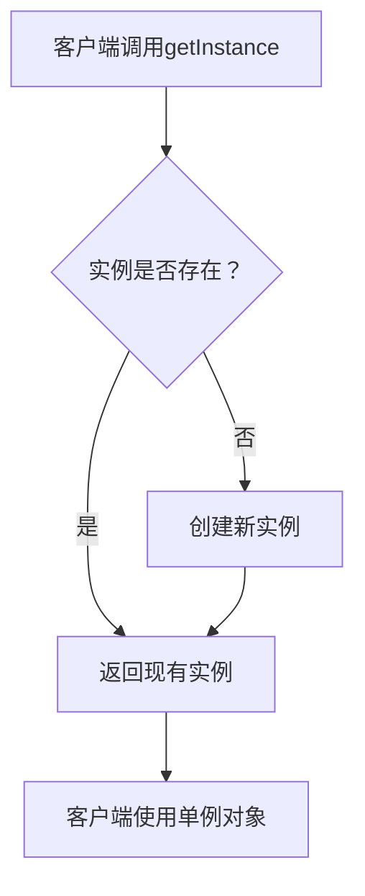

#### 经典金句

> “Singleton模式主要作用是保证在Java应用程序中，一个类class只有一个实例存在。”(p.11)

---

### 1.2 工厂模式（Factory）

#### 核心论点

**问题**：如何将对象的创建与使用分离，降低耦合？
**观点**：通过工厂类或工厂方法封装对象的实例化逻辑。

#### 关键概念

- **简单工厂**：用一个工厂类根据参数返回不同产品实例
- **工厂方法**：将实例化推迟到子类
- **抽象工厂**：创建一系列相关或相互依赖的对象

#### 逻辑推演

工厂模式的核心在于“针对接口编程”而非“针对实现编程”。通过引入工厂类，客户端不需要知道具体产品类的类名，只需知道工厂方法即可。

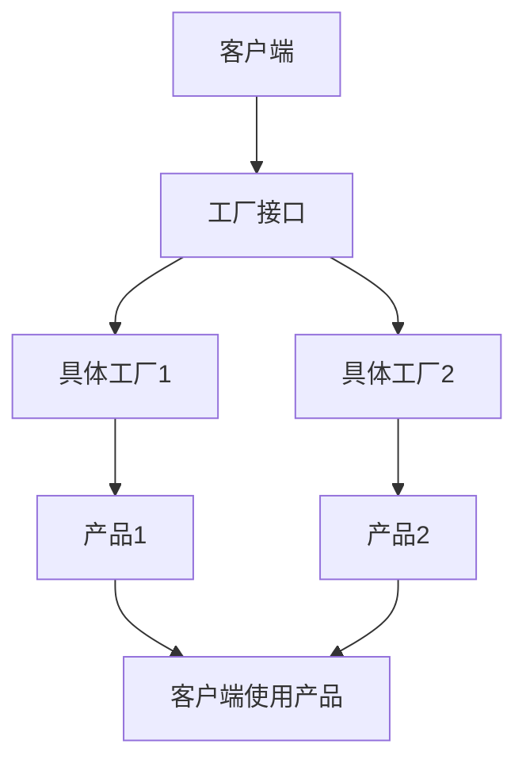

---

### 1.3 建造者模式（Builder）

#### 核心论点

**问题**：如何将一个复杂对象的构建与它的表示分离？
**观点**：使用Builder类分步骤构建复杂对象，Director负责构建顺序。

#### 关键概念

- **Product**：要构建的复杂对象
- **Builder**：定义构建步骤的抽象接口
- **ConcreteBuilder**：具体实现
- **Director**：控制构建流程

#### 逻辑推演

建造者模式适用于“构造过程必须允许被构造的对象有不同的表示”的场景。它将对象的构建过程和表示分离，同样的构建过程可以创建不同的表示。

---

### 1.4 原型模式（Prototype）

#### 核心论点

**问题**：如何通过拷贝原型实例创建新对象？
**观点**：实现Cloneable接口，通过clone()方法复制对象。

#### 关键概念

- **浅拷贝**：只复制基本类型和引用地址
- **深拷贝**：递归复制所有引用对象
- **原型管理器**：存储原型对象供克隆使用

---

## 第2部分：结构型模式

### 2.1 适配器模式（Adapter）

#### 核心论点

**问题**：如何让接口不兼容的类可以一起工作？
**观点**：通过Adapter包装类，将原有接口转换为目标接口。

#### 关键概念

- **类适配器**：通过继承实现
- **对象适配器**：通过组合实现
- **Target**：目标接口
- **Adaptee**：被适配者

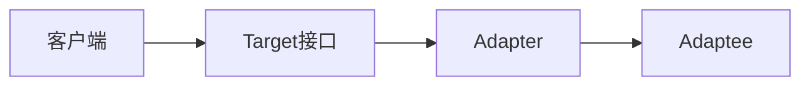

---

### 2.2 代理模式（Proxy）

#### 核心论点

**问题**：如何控制对对象的访问？
**观点**：通过代理对象代替真实对象，在访问前后添加额外逻辑。

#### 关键概念

- **虚拟代理**：延迟创建开销大的对象
- **远程代理**：为远程对象提供本地代表
- **保护代理**：控制访问权限
- **智能引用**：在访问时添加附加操作

---

### 2.3 装饰者模式（Decorator）

#### 核心论点

**问题**：如何动态地为对象添加职责？
**观点**：通过包装对象的方式，在运行时添加功能，比继承更灵活。

#### 关键概念

- **Component**：抽象组件
- **ConcreteComponent**：具体组件
- **Decorator**：抽象装饰者
- **ConcreteDecorator**：具体装饰者

---

### 2.4 桥接模式（Bridge）

#### 核心论点

**问题**：如何将抽象部分与实现部分分离，使它们可以独立变化？
**观点**：通过组合关系替代继承关系，将抽象和实现解耦。

---

### 2.5 组合模式（Composite）

#### 核心论点

**问题**：如何一致地对待单个对象和组合对象？
**观点**：通过树形结构组织对象，让客户端统一使用Component接口。

---

### 2.6 门面模式（Facade）

#### 核心论点

**问题**：如何为复杂子系统提供简单统一的接口？
**观点**：创建Facade类封装子系统的复杂性，对外提供高层接口。

---

### 2.7 享元模式（Flyweight）

#### 核心论点

**问题**：如何高效支持大量细粒度对象？
**观点**：通过共享内在状态，减少对象数量。

#### 关键概念

- **内在状态（Intrinsic）**：可共享的状态
- **外在状态（Extrinsic）**：不可共享的状态，由客户端传入
- **享元工厂**：管理享元对象的创建和共享

---

## 第3部分：行为型模式

### 3.1 观察者模式（Observer）

#### 核心论点

**问题**：如何让多个对象在某个对象状态变化时自动更新？
**观点**：定义一对多的依赖关系，主题变化时自动通知所有观察者。

#### 关键概念

- **Subject**：被观察的主题
- **Observer**：观察者接口
- **ConcreteSubject**：具体主题
- **ConcreteObserver**：具体观察者

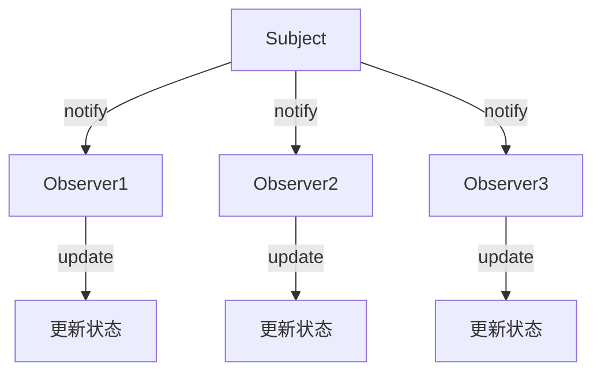

---

### 3.2 策略模式（Strategy）

#### 核心论点

**问题**：如何让算法可以独立于使用它的客户端变化？
**观点**：将算法封装在独立的策略类中，客户端可动态选择算法。

---

### 3.3 模板方法模式（Template Method）

#### 核心论点

**问题**：如何定义算法骨架，让子类实现具体步骤？
**观点**：在父类中定义模板方法，将可变步骤延迟到子类实现。

---

### 3.4 命令模式（Command）

#### 核心论点

**问题**：如何将请求封装为对象，支持参数化、队列化和撤销操作？
**观点**：将请求封装为Command对象，解耦请求发送者和接收者。

---

### 3.5 职责链模式（Chain of Responsibility）

#### 核心论点

**问题**：如何让多个对象都有机会处理请求？
**观点**：将处理者连成链，请求沿链传递直到被处理。

---

### 3.6 状态模式（State）

#### 核心论点

**问题**：如何让对象在内部状态改变时改变行为？
**观点**：将状态封装为独立的状态类，Context委托给当前状态对象。

---

### 3.7 中介者模式（Mediator）

#### 核心论点

**问题**：如何减少多个对象之间的直接交互耦合？
**观点**：引入中介者对象，封装对象间的交互。

---

### 3.8 迭代器模式（Iterator）

#### 核心论点

**问题**：如何在不暴露内部结构的情况下遍历聚合对象？
**观点**：提供统一的迭代器接口，分离遍历逻辑与聚合对象。

---

### 3.9 备忘录模式（Memento）

#### 核心论点

**问题**：如何在不破坏封装的情况下保存和恢复对象状态？
**观点**：使用Memento对象保存状态快照，由Caretaker管理。

---

### 3.10 访问者模式（Visitor）

#### 核心论点

**问题**：如何在不改变元素类的前提下定义作用于这些元素的新操作？
**观点**：将操作封装在Visitor中，Element接受Visitor访问。

---

### 3.11 解释器模式（Interpreter）

#### 核心论点

**问题**：如何定义语言的文法并表示句子？
**观点**：为每个文法规则定义一个类，构建抽象语法树解释执行。

---

# 第二部分：Android开发

## 第1章：Android入门

### 核心论点

**问题**：如何开始Android开发？
**观点**：Android是移动设备软件栈，包括操作系统、中间件和核心应用程序。开发者需安装SDK、平台工具，创建AVD进行开发和测试。

### 关键概念

- **Android架构**：应用层 → 应用框架层 → 库/运行时 → Linux内核
- **四大组件**：Activity、Service、BroadcastReceiver、ContentProvider
- **Intent**：组件间通信的消息对象
- **资源系统**：res目录下的各种资源，支持多设备配置
- **Manifest文件**：描述应用组件和权限

---

## 第2章：用户界面

### 核心论点

**问题**：如何构建适配多种屏幕的Android UI？
**观点**：使用布局资源、fragment、动画和自定义视图，通过资源限定符适配不同设备。

### 关键概念

- **View和ViewGroup**：UI基本单元和容器
- **Fragment**：模块化的UI片段，支持大屏幕和小屏幕适配
- **主题和样式**：统一应用外观
- **动画**：视图动画、属性动画、过渡动画
- **Material Design**：设计规范

---

## 第3章：通信与联网

### 核心论点

**问题**：如何进行网络通信和数据处理？
**观点**：使用WebView显示网页，HttpClient/HttpURLConnection访问REST API，解析JSON/XML数据。

### 关键概念

- **WebView**：内嵌浏览器组件
- **AsyncTask**：后台线程执行网络请求
- **DownloadManager**：系统级下载服务
- **JSON解析**：org.json包
- **XML解析**：SAX、Pull解析器
- **蓝牙/NFC/USB**：设备间通信

---

## 第4章：硬件与媒体交互

### 核心论点

**问题**：如何访问设备硬件（摄像头、GPS、传感器）和媒体？
**观点**：使用Camera API拍照录像，LocationManager获取位置，SensorManager读取传感器数据，MediaPlayer播放媒体。

---

## 第5章：数据持久化

### 核心论点

**问题**：如何在Android中保存数据？
**观点**：SharedPreferences存键值对，SQLite存结构化数据，文件系统存任意数据，ContentProvider共享数据。

---

## 第6章：与系统交互

### 核心论点

**问题**：如何与Android系统和组件交互？
**观点**：使用Notification发送通知，AlarmManager定时任务，Service后台运行，Intent启动其他应用。

---

# 第三部分：Spring Cloud Alibaba

## 第1章：微服务介绍

### 核心论点

**问题**：为什么要用微服务架构？
**观点**：单体应用随业务增长变得臃肿难维护，微服务通过拆分实现独立部署、独立扩展。

### 架构演进

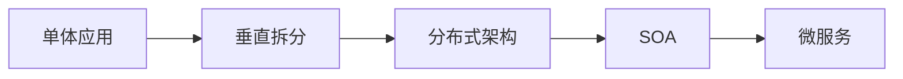

---

## 第2章：微服务环境搭建

### 核心论点

**问题**：如何搭建Spring Cloud Alibaba开发环境？
**观点**：创建父工程管理依赖，分模块开发（common、user、product、order），使用RestTemplate进行服务间调用。

---

## 第3章：Nacos服务注册与发现

### 核心论点

**问题**：如何实现服务的自动注册与发现？
**观点**：使用Nacos作为注册中心，服务启动时注册，消费方通过服务名调用。

### 核心概念

- **服务注册**：服务实例将信息注册到Nacos
- **服务发现**：消费者从Nacos获取服务地址列表
- **负载均衡**：Ribbon提供客户端负载均衡
- **Feign**：声明式HTTP客户端，简化服务调用

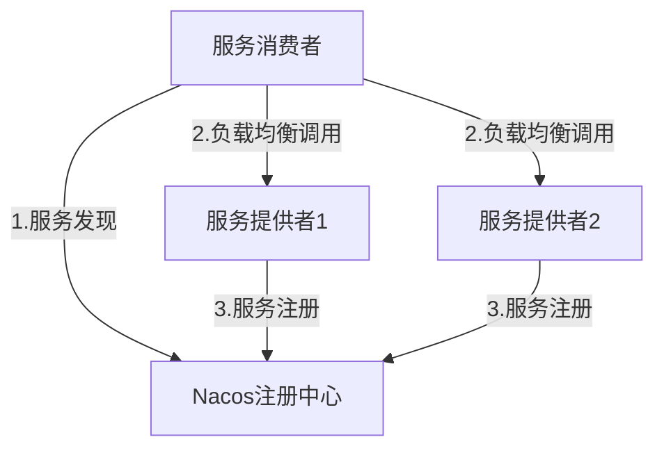

---

## 第4章：Sentinel服务容错

### 核心论点

**问题**：如何防止服务雪崩？
**观点**：使用Sentinel实现流量控制、熔断降级、系统负载保护。

### 核心概念

- **服务雪崩**：单个服务故障导致级联故障
- **流量控制**：限制QPS或并发线程数
- **熔断降级**：快速失败，提供降级方案
- **隔离**：线程池隔离或信号量隔离

### 流控模式

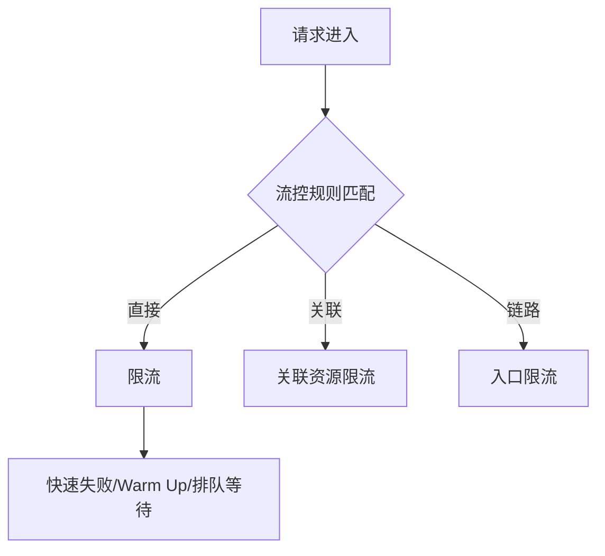

---

## 第5章：Gateway服务网关

### 核心论点

**问题**：如何统一管理微服务入口？
**观点**：使用Spring Cloud Gateway作为API网关，实现路由、过滤、限流。

### 核心概念

- **Route**：路由规则（ID、目标URI、断言、过滤器）
- **Predicate**：断言条件（Path、Method、Header等）
- **Filter**：过滤器（Pre/Post，局部/全局）

---

## 第6章：Sleuth链路追踪

### 核心论点

**问题**：如何追踪分布式系统中的请求链路？
**观点**：使用Sleuth生成TraceId和SpanId，集成Zipkin可视化展示调用链路。

### 核心概念

- **Trace**：一次完整请求的调用链
- **Span**：单个服务内的操作单元
- **Annotation**：cs/sr/ss/cr标记请求阶段

---

## 第7章：RocketMQ消息驱动

### 核心论点

**问题**：如何实现应用解耦和异步处理？
**观点**：使用RocketMQ作为消息中间件，生产者发送消息，消费者订阅处理。

### 核心架构

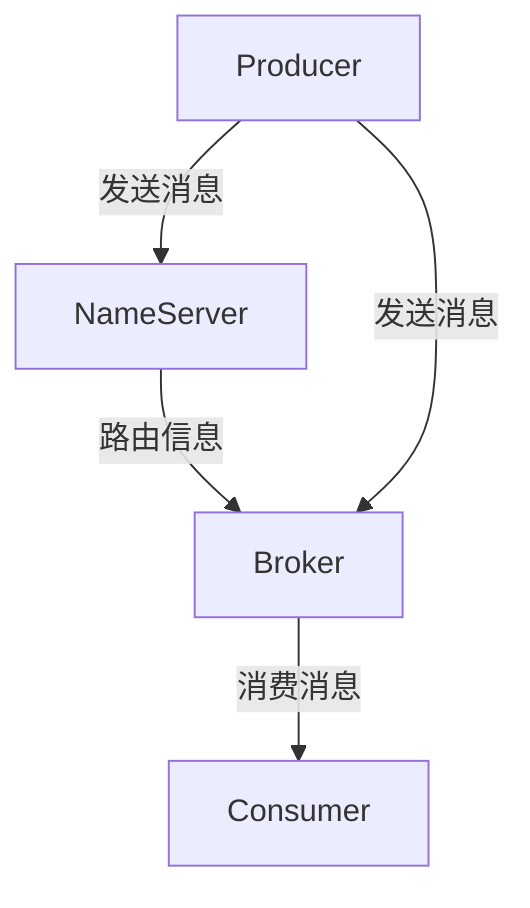

---

## 第8章：SMS短信服务

### 核心论点

**问题**：如何在应用中集成短信发送功能？
**观点**：使用阿里云短信服务API，申请签名和模板，调用SendSms发送验证码。

---

## 第9章：NacosConfig配置管理

### 核心论点

**问题**：如何实现配置的集中管理和动态刷新？
**观点**：使用Nacos作为配置中心，将配置文件托管在Nacos，支持@RefreshScope动态刷新。

---

## 第10章：Seata分布式事务

### 核心论点

**问题**：如何解决微服务间的分布式事务问题？
**观点**：使用Seata的AT模式，通过全局事务ID（XID）协调多个分支事务，实现最终一致性。

### 两阶段提交

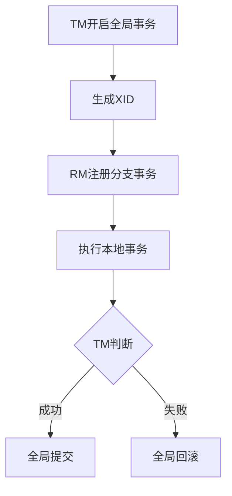

---

# 第四部分：大型网站系统与Java中间件

## 第1章：分布式系统介绍

### 核心论点

**问题**：什么是分布式系统？为什么需要它？
**观点**：分布式系统是多个通过网络连接的节点组成的系统，通过消息传递通信和协调。其意义在于：性价比、性能瓶颈、稳定性可用性。

### 核心概念

- **阿姆达尔定律**：程序并行比例决定多核加速上限
- **线程/进程模式**：共享容器、事件协同
- **网络IO模型**：BIO、NIO、AIO
- **CAP理论**：一致性、可用性、分区容忍性三者不可兼得
- **BASE模型**：基本可用、软状态、最终一致

---

## 第2章：大型网站架构演进

### 核心论点

**问题**：网站从小到大的架构变化过程是怎样的？
**观点**：从单机应用到数据库与应用分离、应用集群、读写分离、分布式存储、服务化，逐步演进。

### 架构演进路线

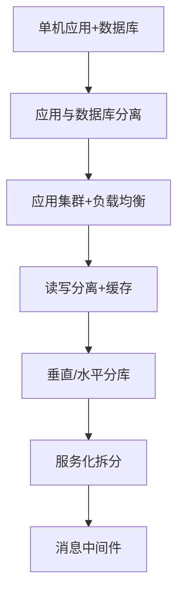

### Session问题解决方案

- **Session Sticky**：负载均衡器将同一会话请求固定到同一服务器
- **Session Replication**：服务器间同步Session数据
- **Session集中存储**：将Session存到数据库或缓存
- **Cookie Based**：Session数据存在Cookie中

---

## 第3章：构建Java中间件

### 核心论点

**问题**：构建Java中间件需要哪些基础知识？
**观点**：JVM内存管理、并发编程、动态代理、反射、网络通信是核心基础。

### 关键概念

- **JVM内存堆**：新生代、年老代、持久代
- **并发工具**：线程池、synchronized、ReentrantLock、volatile、Atomic、CountDownLatch、CyclicBarrier
- **动态代理**：Proxy + InvocationHandler
- **反射**：运行时获取类信息、动态调用方法

---

## 第4章：服务框架

### 核心论点

**问题**：如何实现服务化？
**观点**：通过服务框架将本地调用变为远程RPC调用，解决服务注册发现、负载均衡、路由、通信、序列化等问题。

### 服务框架核心模块

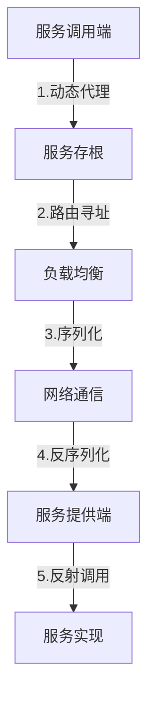

---

## 第5章：数据访问层

### 核心论点

**问题**：如何应对数据库拆分后的访问问题？
**观点**：通过数据访问层屏蔽分库分表细节，解决分布式事务、跨库Join、序列生成、合并查询等问题。

### 核心概念

- **垂直拆分**：不同业务数据分到不同库
- **水平拆分**：同一业务数据分到多个库/表
- **分布式事务**：2PC、Paxos、最终一致
- **一致性哈希**：平滑扩缩容
- **读写分离**：主库写、备库读

---

## 第6章：消息中间件

### 核心论点

**问题**：消息中间件解决了什么问题？
**观点**：实现应用解耦、异步处理、流量削峰。需解决消息发送一致性、消息重复、顺序消息等问题。

### 核心概念

- **消息发送一致性**：本地事务表+定时重试
- **消息模型**：点对点、发布订阅
- **消息可靠性**：持久化、确认机制、重试
- **顺序消息**：单队列、分区有序

---

## 第7章：软负载中心与配置管理

### 核心论点

**问题**：如何实现服务地址的动态管理？
**观点**：通过软负载中心（如Nacos）管理服务注册信息，支持服务上下线感知、分组管理、路由规则。

---

## 后记

### 核心内容

作者回顾了在淘宝从事中间件开发6年的经历，感谢了团队和家人的支持。强调大型网站架构演进的核心在于应对规模增长带来的挑战，中间件是支撑这一演进的关键基础设施。

---

> 说明：以上内容基于多本PDF文件整理，部分章节因OCR识别不完整或PDF质量限制，可能存在信息缺失。核心内容已按书籍目录顺序提取。