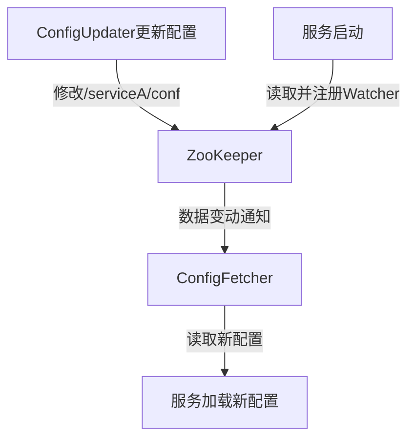
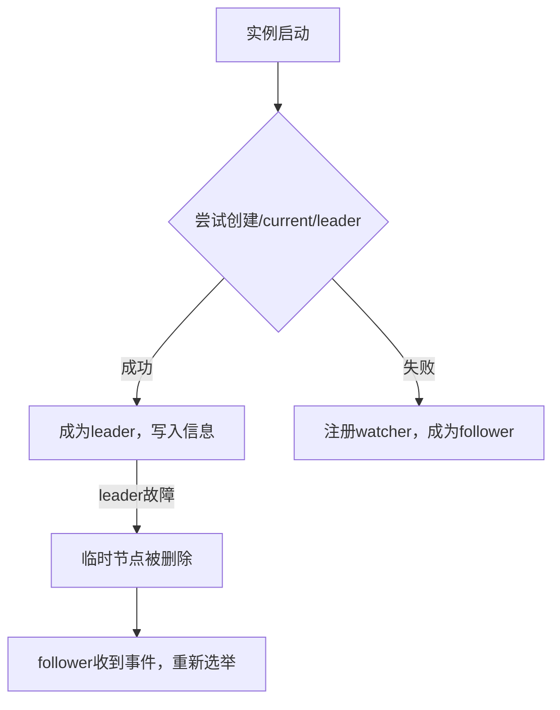
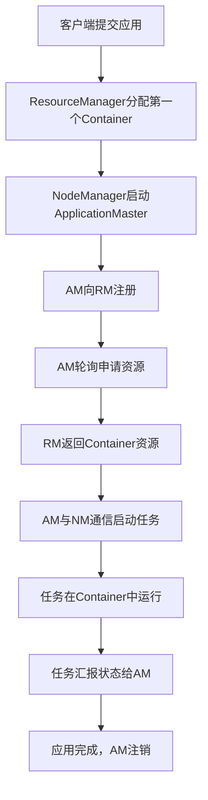
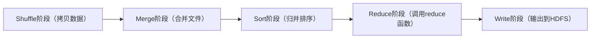
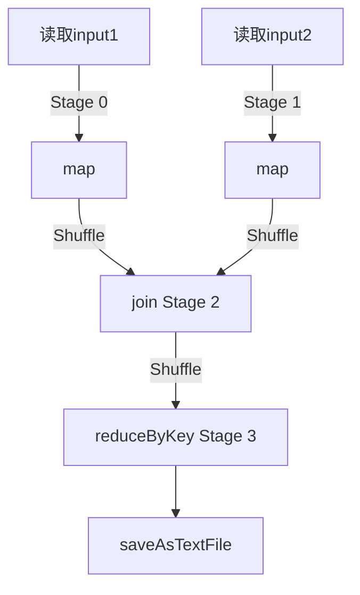
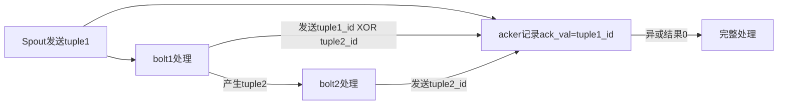

# 《大数据技术体系详解：原理、架构与实践》章节总结

## 书籍信息
- **书名**：大数据技术体系详解：原理、架构与实践
- **作者**：董西成
- **PDF 状态**：从第8章开始提供，前7章缺失（第1~7章未包含在文件中）
- **OCR 状态**：存在少量识别错漏和页码标记，但整体内容可读，不影响结构化整理

## 目录说明
- 根据PDF内容识别，该书包含以下章节（第8章起）：
  - 第8章：ZooKeeper
  - 第9章：YARN
  - 第10章：MapReduce
  - 第11章：Spark
  - 第12章：交互式计算引擎
  - 第13章：流式实时计算引擎
  - 第14章：数据分析语言HQL与SQL
  - 第15章：统一编程模型Apache Beam
  - 第16章：大数据机器学习库
- 前7章（可能涉及大数据概述、HDFS、数据收集等）未提供
- 附录部分包含广告页和部分问题，已过滤

## 全书核心主题
本书系统讲解大数据技术体系，涵盖数据协调（ZooKeeper）、资源管理（YARN）、批处理（MapReduce）、DAG计算（Spark）、交互式分析（Impala/Presto/Druid/Kylin）、流式计算（Storm/Spark Streaming）、数据分析语言（HQL/Spark SQL）、统一编程模型（Beam）以及机器学习库（MLLib）。作者从原理、架构到实践案例，深入剖析各技术组件的设计思想、内部机制和编程方法，旨在帮助读者建立完整的大数据技术知识体系。

---

## 第8章：ZooKeeper

### 核心论点
本章解决分布式系统中服务协调（如leader选举、服务发现、分布式队列）的问题。作者认为ZooKeeper通过ZAB一致性协议实现数据多副本存储，并借助类似文件系统的层级命名空间和简易原语，能够有效解决常见的分布式协调难题。

### 关键概念
- **ZAB协议**：ZooKeeper Atomic Broadcast，保证分布式数据一致性。
- **znode**：ZooKeeper数据模型中的节点，分为持久（PERSISTENT）和临时（EPHEMERAL）等类型。
- **Watcher**：事件监听机制，客户端可在znode上注册watcher，当节点变化时触发通知。
- **Apache Curator**：Netflix开源的ZooKeeper客户端，封装了连接重试、Watcher自动重注册等高级功能。

### 逻辑推演
作者首先介绍ZooKeeper的Java API（create、exists、getChildren、getData、setData、delete等），然后通过两个实例展示典型应用：**配置管理模块**（ConfigUpdater更新配置，ConfigFetcher监听变化）和**服务发现模块**（Worker在/workerlist下创建临时节点并监听子节点变化）。接着介绍Curator框架，演示如何使用CuratorFramework创建客户端、实现leader选举（LeaderSelector）。最后讨论应用案例：leader选举（竞争创建临时节点）、分布式队列（利用持久顺序节点）、负载均衡（Kafka的Broker/Consumer注册）。结尾提出三个思考问题（读一致性、羊群效应、能否作为通用文件系统）。

### 流程图

#### 基于ZooKeeper的配置管理流程

#### 基于ZooKeeper的leader选举流程

### 经典金句
> “ZooKeeper通过引入一致性协议ZAB，能够让多个对等的服务达成一致，从而实现数据多副本存储。” (p.19)

---

## 第9章：YARN

### 核心论点
本章解决Hadoop 1.0中JobTracker单点故障、扩展性差、资源利用率低、不支持多种计算框架的问题。作者提出YARN通过将资源管理与作业控制分离（ResourceManager + ApplicationMaster），实现了通用的资源管理系统，支持短作业和长服务混合部署，提高集群资源利用率和自动化部署能力。

### 关键概念
- **ResourceManager (RM)**：全局资源管理器，包含调度器（纯调度）和应用程序管理器。
- **NodeManager (NM)**：节点资源管理器，负责容器启动和监控。
- **ApplicationMaster (AM)**：每个应用程序的代理，负责资源申请、任务调度和容错。
- **Container**：资源分配单位，封装内存、CPU等资源。
- **CapacityScheduler / FairScheduler**：多租户调度器，支持层级队列、最小/最大容量、资源抢占。
- **节点标签调度**：为节点打标签，将作业约束到特定标签节点上。

### 逻辑推演
从MRv1局限性（可靠性差、扩展性差、资源利用率低、不支持多框架）引出YARN设计动机：提高集群资源利用率和服务自动化部署。YARN采用master/slave架构，RM为master，NM为slave，每个应用有专属AM。RM支持HA（基于ZooKeeper的Active/Standby切换）和恢复机制。工作流程分为：提交应用→启动AM→AM注册→申请资源→启动Container→监控→注销。资源调度器部分详细介绍层级队列、CapacityScheduler与FairScheduler对比、节点标签调度、资源抢占模型。资源隔离采用Cgroups（CPU）和线程监控（内存）。最后对比Mesos，并讨论资源管理系统架构演化（集中式→双层→共享状态）。

### 流程图

#### YARN工作流程

### 经典金句
> “YARN发展到今天，已经变成了一个数据操作系统（Data Operating System），很多应用程序或服务不再基于传统的操作系统（比如Linux）开发和部署，而是基于YARN这样的数据操作系统。” (p.51)

---

## 第10章：批处理引擎MapReduce

### 核心论点
本章解决大规模数据批处理中的编程复杂性、扩展性、容错性和高吞吐率问题。作者认为MapReduce通过简化的编程模型（map + reduce）和自动化的运行时环境（数据切分、任务调度、容错），让用户只需关注业务逻辑，即可实现分布式计算。

### 关键概念
- **MapReduce编程模型**：map阶段处理输入分片生成中间键值对，reduce阶段按key聚合产生最终结果。
- **InputFormat / OutputFormat**：数据输入输出格式解析（TextInputFormat、SequenceFileInputFormat等）。
- **Partitioner**：决定map输出键值对分配到哪个reduce task（默认HashPartitioner）。
- **Combiner**：Map端局部聚合，减少网络传输。
- **Hadoop Streaming**：允许任意可执行文件或脚本作为Mapper/Reducer。
- **Shuffle**：Map端输出排序、分区、溢写；Reduce端拷贝、归并、排序。

### 逻辑推演
从MapReduce诞生背景（Nutch面临扩展性问题，借鉴Google GFS和MapReduce论文）开始，阐述设计目标：易于编程、良好扩展性、高容错性、高吞吐率。然后详解编程模型：以WordCount为例，展示Mapper和Reducer实现；接着介绍5个可编程组件（InputFormat、Mapper、Partitioner、Reducer、OutputFormat）和Combiner。进阶部分包括数据压缩、多路输入/输出、DistributedCache。Hadoop Streaming使非Java用户可用任意语言编写MR程序。内部原理部分详细描述作业生命周期（MRAppMaster、MapTask/ReduceTask五阶段）、数据本地性、推测执行。应用实例包括TopK、K-means、贝叶斯分类等。章节末尾给出大量思考题。

### 流程图

#### MapTask执行流程

#### ReduceTask执行流程

### 经典金句
> “MapReduce的出现，使得用户可以把主要精力放在设计数据处理算法上，至于其他的分布式问题，包括节点间的通信、节点失效、数据切分、任务并行化等，全部由MapReduce运行时环境完成。” (p.70)

---

## 第11章：DAG计算引擎Spark

### 核心论点
本章解决MapReduce仅支持Map和Reduce两种操作、处理效率低（磁盘I/O多、排序开销大）、不适合迭代式和交互式计算的问题。作者提出Spark基于RDD（弹性分布式数据集）和DAG（有向无环图）计算引擎，支持内存计算和丰富的API，大大提升性能和编程灵活性。

### 关键概念
- **RDD**：只读、分区的分布式数据集，支持transformation（如map、filter）和action（如count、collect），惰性执行，通过血统实现容错。
- **DAG**：Spark将RDD依赖关系构建成有向无环图，优化执行计划。
- **Driver / Executor**：Driver运行用户程序并调度任务，Executor执行任务并缓存数据。
- **Shuffle**：Spark提供Hash-based和Sort-based两种实现，Sort-based为默认。
- **DataFrame / Dataset**：带元数据的分布式数据集，支持SQL和类型安全操作，通过Catalyst优化器自动优化。

### 逻辑推演
从MapReduce局限性出发，引出Spark的主要特点：性能高效（内存计算、DAG引擎）、简单易用（丰富API）、与Hadoop完好集成。介绍Spark核心概念：RDD（弹性、分区、血统）和DAG。编程模型包括SparkContext、RDD构造（从集合或文件）、transformation和action算子、共享变量（广播变量和累加器）、持久化（cache、persist、checkpoint）。运行模式有local、standalone、YARN、Mesos。程序设计实例：构建倒排索引和SQL GroupBy，用Spark代码远简于MapReduce。内部原理：逻辑计划（RDD依赖图）、物理计划（以shuffle为界划分Stage）、任务调度。Shuffle机制详细对比Hash和Sort。最后介绍Spark SQL的DataFrame/Dataset及Catalyst优化器。

### 流程图

#### Spark作业物理计划划分Stage示例

### 经典金句
> “Spark是一个高性能DAG计算引擎，它通过引入RDD模型，使得Spark具备类似MapReduce等数据流模型的容错特性，并且允许开发人员在大型集群上执行基于内存的分布式计算。” (p.128)

---

## 第12章：交互式计算引擎

### 核心论点
本章解决MapReduce批处理引擎在OLAP场景下性能低下的问题。作者将交互式计算引擎分为ROLAP（Impala、Presto）和MOLAP（Druid、Kylin），分别介绍其架构、特点及适用场景，强调MPP架构、列式存储、内存加速是提升交互式查询性能的关键。

### 关键概念
- **ROLAP**：基于关系数据库的OLAP实现，实时性好但运算效率相对较低（Impala、Presto）。
- **MOLAP**：基于多维数据组织的OLAP实现，通过预计算Cube加速查询，占用存储大（Druid、Kylin）。
- **Impala**：Cloudera开发的MPP SQL引擎，采用对等架构（Catalogd、Statestored、Impalad），支持Parquet，避免MapReduce开销。
- **Presto**：Facebook开发的MPP SQL引擎，master/slave架构（Coordinator、Discovery、Worker），支持多种数据源（Hive、MySQL等）。
- **Druid**：面向时间序列数据的MOLAP，Lambda架构，实时和历史数据分离。
- **Kylin**：eBay开源的MOLAP，预计算Cube存入HBase，提供ANSI-SQL接口。

### 逻辑推演
从MapReduce性能缺点引出交互式引擎需求。Impala部分：设计动机（结合传统数据库SQL支持与Hadoop扩展性），架构详解，访问方式（JDBC/ODBC，支持大部分HQL），对比不同存储格式性能。Presto部分：架构（Coordinator、Discovery、Worker），插件式数据源连接器，示例连接Hive和MySQL。对比Impala与Presto（内存管理、容错、数据源支持等）。MOLAP部分：Druid架构（实时节点、历史节点、Broker等），Kylin架构（REST Server、Query引擎、Cube构建引擎）。最后对比Druid与Kylin（数据实时性、查询性能、存储方式等）。

### 经典金句
> “Impala完全抛弃了MapReduce这个不太适合做SQL查询的范式，而是像Dremel一样借鉴了MPP并行数据库的思想，采用了全服务进程的设计架构。” (p.201)

---

## 第13章：流式实时计算引擎

### 核心论点
本章解决传统“消息队列+工作进程”流式方案扩展性差、容错性差、无法保证数据处理完整性的问题。作者介绍基于行的Storm（低延迟、低吞吐）和基于微批处理的Spark Streaming（高延迟、高吞吐），并对比两者的编程模型、一致性语义、容错机制。

### 关键概念
- **Storm**：实时计算框架，核心概念包括Tuple、Stream、Topology、Spout、Bolt、Stream Grouping。架构由Nimbus、Supervisor、ZooKeeper组成。
- **acker机制**：Storm保证至少一次（at least once）语义，通过异或校验跟踪消息树是否完整处理。
- **Spark Streaming**：将流式数据切分为微批（micro-batch），抽象为DStream，基于时间窗口和状态管理（mapWithState）。
- **窗口操作**：固定窗口、滑动窗口、会话窗口。
- **容错**：checkpoint和offset管理（Kafka Direct API实现精确一次）。

### 逻辑推演
从传统流式方案缺点引出新型流式引擎。Storm部分：概念详解、架构（Nimbus无状态、Supervisor、Worker、Executor、Task）、Topology并发度设置、程序设计实例（网站指标实时分析系统）、内部原理（Topology生命周期、运行时环境、acker可靠性实现）。Spark Streaming部分：工作原理（微批处理）、DStream抽象、编程入口StreamingContext、数据源（文件系统、Kafka Direct API）、transformation和output操作、窗口函数和mapWithState、编程实例（Kafka+Spark Streaming+Redis手机APP分析）、容错性讨论（checkpoint和offset管理）。最后对比Storm和Spark Streaming（编程模型、一致性语义、吞吐率与延迟）。

### 流程图

#### Storm acker可靠性机制

### 经典金句
> “Storm选择了低延迟作为首要目标，它能做到毫秒级延迟，但吞吐率很低，而Spark Streaming正好相反，它的吞吐率是Storm几倍甚至几十倍，但数据处理延迟最低只能做到秒级。” (p.261)

---

## 第14章：数据分析语言HQL与SQL

### 核心论点
本章解决直接使用MapReduce/Spark等编程接口开发报表系统门槛高、效率低的问题。作者介绍基于MapReduce的Hive和基于Spark的Spark SQL，两者通过SQL/HQL语言将查询翻译为分布式作业，使数据分析师能快速处理海量数据。

### 关键概念
- **Hive**：构建在Hadoop之上的SQL引擎，包含Driver、Metastore、Hadoop三大组件。元数据存储于关系型数据库。
- **HQL**：Hive查询语言，支持DDL（数据库、表、分区、分桶）、DML（LOAD、INSERT、SELECT）、窗口函数等。
- **分区表/分桶表**：加速查询的物理划分方式。
- **Spark SQL**：支持SQL和DataFrame/Dataset两种接口，通过Catalyst优化器生成RDD代码。
- **存储格式**：TextFile、SequenceFile、RCFile、ORC、Parquet。

### 逻辑推演
从SQL在大数据领域的必要性出发，将SQL on Hadoop引擎分为基于计算引擎（Hive、Spark SQL）和基于MPP架构（Impala、Presto）。Hive架构详解：三种部署模式（嵌入式、本地、远程），查询引擎可插拔（MapReduce、Tez、Spark），对比Hive on MR和Hive on Tez的DAG优化。HQL语法重点：创建表（外部表、受管理表、分区表、分桶表），数据加载，SELECT查询（ORDER BY vs SORT BY，DISTRIBUTE BY vs CLUSTER BY）。应用实例：用户访问日志分析系统（ETL → 创建ORC分区表 → 查询）。Spark SQL架构：用户接口层（SQL、DataFrame/DataSet）、Catalyst优化器、存储层。对比Spark SQL与Hive（表达能力、数据源支持、执行引擎）。

### 经典金句
> “Hive是Hadoop生态系统中最早的SQL引擎，它的Metastore服务已经被越来越多的SQL引擎所支持，已经成为大数据系统的元信息标准存储仓库。” (p.272)

---

## 第15章：统一编程模型Apache Beam

### 核心论点
本章解决计算引擎频繁更迭导致数据管道迁移成本高的问题。作者提出Apache Beam通过统一的数据流编程模型（Pipeline、PCollection、Transform），将批处理和流式处理抽象为同一范式，允许用户代码在不同执行引擎（Spark、Flink等）上运行，无需修改。

### 关键概念
- **Beam SDK**：定义数据处理业务逻辑的API，核心组件：Pipeline（整个计算任务）、PCollection（分布式数据集，可有限或无限）、Transform（数据转换操作）、IO Source/Sink。
- **Runner**：对接底层计算引擎（DirectRunner、SparkRunner、FlinkRunner等）。
- **窗口（Window）**：将无限数据流切分为有限片段，支持固定窗口、滑动窗口、会话窗口。
- **Watermark**：判断事件时间窗口内数据是否到齐的机制。
- **Trigger**：定义窗口结果何时输出的触发器。
- **Side input / Side output**：多路输入/输出机制。

### 逻辑推演
从数据管道迁移问题引出统一编程模型。Beam基本构成：Beam SDK（编写逻辑）和Beam Runner（执行引擎）。编程模型详解：创建Pipeline → 创建PCollection（从HDFS、Kafka等） → 应用Transform（ParDo、GroupByKey、Combine、Partition、Flatten、Join） → 输出。Side input用于小数据集广播（类似广播变量），Side output用于多路输出。流式计算模型部分：引入event time vs process time，窗口划分，watermark定义数据完整性，trigger定义输出时机，accumulation模式（丢弃、累计、累计并撤销）。编程实例：WordCount和移动游戏用户行为分析（每小时每战队总得分）。

### 流程图

#### Beam Pipeline工作流

### 经典金句
> “Apache Beam是一个统一编程模型，它提供了面向有限数据集与无限数据流的统一编程范式。” (p.303)

---

## 第16章：大数据机器学习库

### 核心论点
本章解决在分布式环境下进行机器学习工作流（特征工程、模型训练、调优、部署）的复杂性问题。作者介绍基于Spark的MLLib，它利用DataFrame和Pipeline API，提供了可扩展、跨语言、易于组合的机器学习库。

### 关键概念
- **Pipeline**：将多个Transformer和Estimator串联成工作流。
- **Transformer**：将输入DataFrame转换为新DataFrame（如特征转换器、训练好的模型）。
- **Estimator**：学习算法，通过fit()方法从DataFrame产生Model（Transformer）。
- **特征工程组件**：TF-IDF、Word2Vec、CountVectorizer、Tokenizer、StopWordsRemover、PCA、ChiSqSelector等。
- **机器学习算法**：分类（逻辑回归、决策树、随机森林等）、回归（线性回归、决策树回归等）、聚类（K-means、LDA等）、协同过滤（ALS）。

### 逻辑推演
从机器学习流水线（数据导入→特征工程→模型训练→验证→选择→部署）出发，对比单机Scikit-learn和分布式Mahout、MLLib。MLLib从基于RDD演化到基于DataFrame，解决了跨语言、复杂管道、性能优化等问题。详细介绍Pipeline抽象：DataFrame、Transformer、Estimator、Pipeline、参数。特征工程部分列举抽取（TF-IDF、Word2Vec等）、转换（Tokenization、n-gram、PCA等）、选择（VectorSlicer、RFormula、ChiSqSelector）、局部敏感哈希（LSH）。机器学习算法分类汇总表格。最后给出代码示例（文本处理Pipeline训练逻辑回归模型，持久化与加载）。

### 经典金句
> “MLLib作为构建在Spark之上的机器学习库，充分利用了Spark的简单性、高性能以及高扩展性等特性，已成为应用最广泛的大数据机器学习库之一。” (p.338)

---

> 说明：本总结基于提供的PDF第8~16章内容整理，前7章缺失。所有图表根据文本描述重建，部分页码因OCR识别问题未标注。本书还包含每章末尾的问题与习题，因篇幅未全部转录，但核心知识点已覆盖。