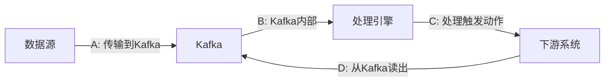
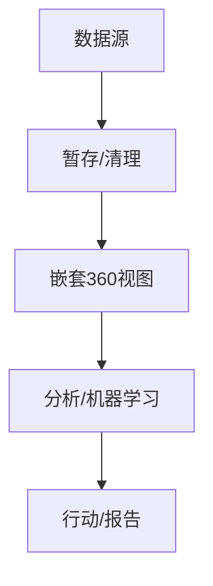
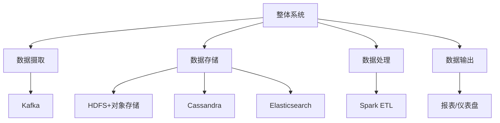
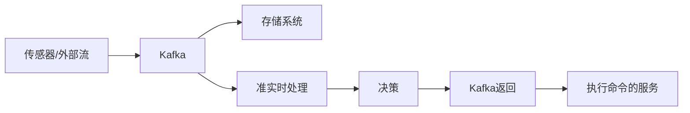
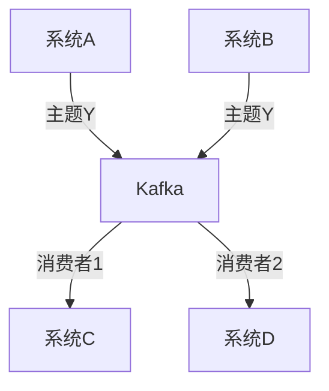
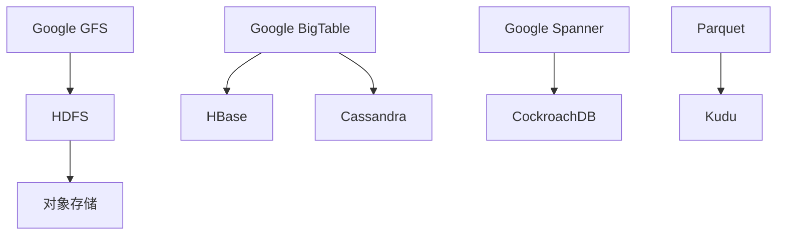
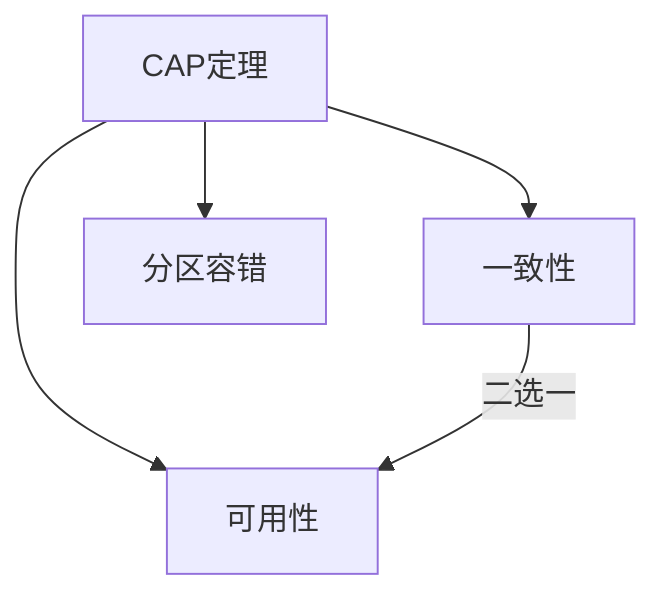
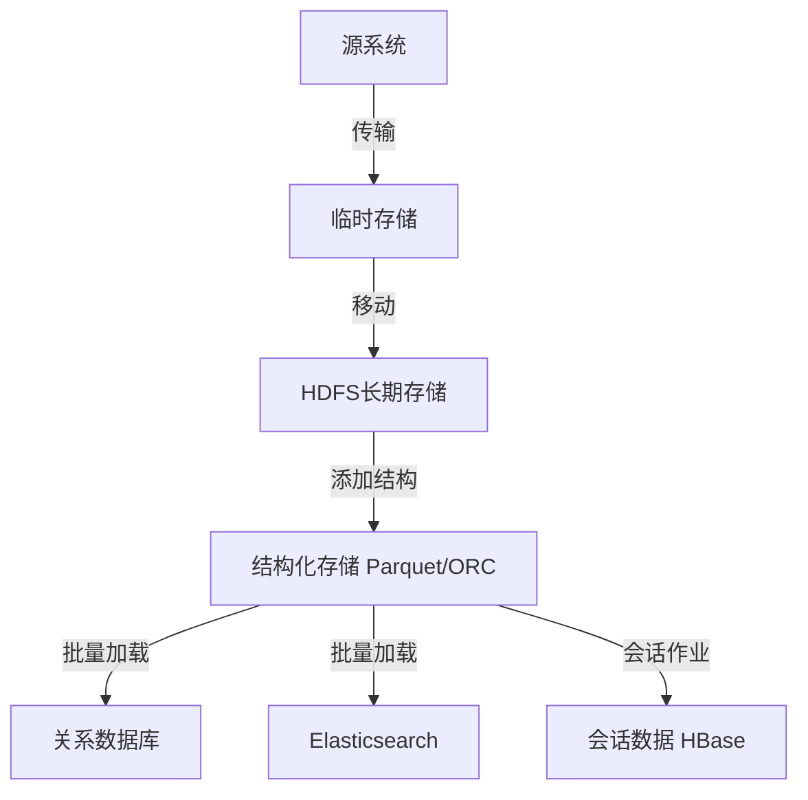
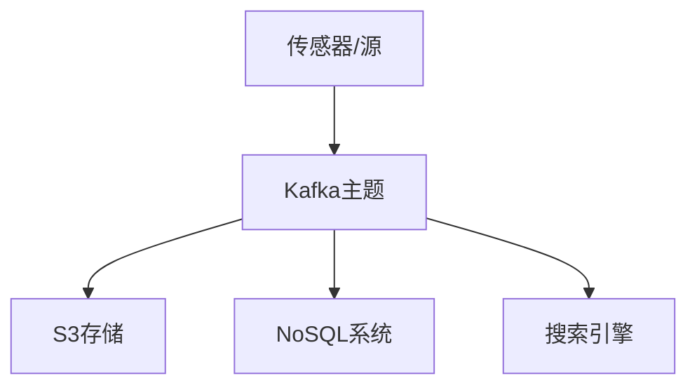
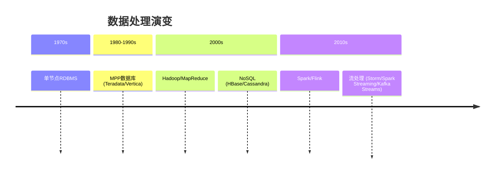

# 《大数据项目管理：从规划到实现》章节总结

## 书籍信息
- **书名**：大数据项目管理：从规划到实现
- **作者**：[美] 特德·马拉斯卡 (Ted Malaska)，[美] 乔纳森·塞德曼 (Jonathan Seidman)
- **译者**：薛命灯
- **出版社**：人民邮电出版社 / O'Reilly Media
- **ISBN**：978-7-115-45736-3
- **PDF 状态**：完整文本可识别
- **OCR 状态**：文本清晰，无错漏

## 目录说明
- 目录识别情况：完整识别，包含前言、第1～8章及附录（关于作者、封面）
- 章节对应依据：按原书目录顺序
- OCR 修复说明：无需修复

## 全书核心主题
本书旨在填补大数据项目从规划到执行之间的实践空白。作者指出，虽然已有大量资源介绍分布式处理引擎（如Spark、MapReduce）或高级架构模式，但缺乏对项目成功关键因素的全局讨论：理解问题、选择合适软件、应对风险、组建团队、实现可维护架构。全书将数据项目分为三类：数据管道与暂存、数据处理与分析、应用程序开发，并围绕每一类展开风险管理、技术选型、接口设计、存储系统、元数据、数据完整性和处理引擎等核心主题。核心观点是：成功管理现代数据项目的大部分流程与传统软件开发项目一致，但需额外关注开源生态、分布式系统的特殊风险以及数据治理。

---

## 前言
### 核心论点
问题：为什么还需要一本“大数据”相关的书？
观点：现有资源多侧重底层技术细节（如MapReduce编程）或高层架构，但缺乏连接“规划”与“实现”的实践指南。成功的数据项目需要结合传统软件项目管理经验与大数据特有的考量（如评估开源软件、分布式系统风险管理）。

### 关键概念/事件
- **现代数据管理的变化**：从专有解决方案向开源分布式数据系统的转变。
- **被忽视的因素**：理解问题、选择软件、应对风险、组建团队、实现健壮架构。
- **读者对象**：CIO/CTO、项目经理、产品经理、首席架构师、技术主管和开发人员。
- **章节概览**：第1～3章建议项目启动前阅读；第4章接口设计；第5章分布式存储；第6章元数据；第7章数据完整性；第8章数据处理。

### 逻辑推演/叙事脉络
作者首先指出大数据领域不缺技术书籍，但缺乏项目成功管理的视角。他们将成功要素归纳为：理解问题→技术选型→风险管理→团队建设→健壮实现。然后简要介绍各章内容，强调每章相对独立，但前三章是基础。

### 经典金句/数据
> “不要因为一棵树而错过整片森林。”  
> “我们的目的不是提供又一本有关软件项目管理的书，而是指导你将行之有效的项目管理和开发实践应用到现代数据解决方案中。”

---

## 第1章：数据项目的主要类型及考虑因素
### 1. 核心论点
问题：如何根据项目类型规划数据项目？
观点：数据项目可分为三大类——数据管道/暂存、数据处理/分析、应用程序开发。每类项目有不同的主要考虑因素、风险管理和团队组成。安全（身份验证、授权、加密、审计）是所有类型的共同基础。

### 2. 关键概念/事件
- **三类项目**：
  1. 数据管道和数据暂存：提取-转换-加载，为后续处理奠定基础。
  2. 数据的处理和分析：生成报告、机器学习模型等。
  3. 应用程序开发：实时支持业务需求的数据后端（如Web/移动应用）。
- **数据管道主要考虑因素**：源数据消费（嵌入式代码/代理/接口）、数据传递保证（尽力而为/至少一次/恰好一次）、数据治理（模型管理、访问控制）、延迟与传递确认、目标数据访问模式（批处理扫描/流处理扫描/点请求/搜索）。
- **数据处理/分析主要考虑因素**：定义问题（量化影响、可视化差距）、实现解决方案（构建可复用平台而非一次性系统）。
- **应用程序开发主要考虑因素**：延迟与吞吐量、局部状态（客户端/服务器/数据中心/多数据中心）、系统可用性（故障恢复）。
- **安全维度**：身份验证（Kerberos/LDAP）、授权（列级控制）、加密（静止/传输中）、审计。

### 3. 逻辑推演/叙事脉络
第1章先定义三类项目，然后逐一展开每类的核心考虑因素和风险。对于数据管道，重点讨论源数据收集方法（嵌入式代码、代理、接口）的优缺点、数据传递保证级别、治理、延迟量化。对于数据处理，强调问题定义与实现平台化。对于应用程序开发，聚焦延迟、状态管理和可用性。最后给出各类型的团队角色建议。

### 4. 流程图（存在）
**图1-1：量化系统延迟**（描述性，未用Mermaid，现重建）

**图1-2：将系统分解为块**（价值获取路径）

### 5. 经典金句/数据
> “数据工程团队在数据源集成上花费的时间通常与数据源集成设计的优劣成反比。”  
> “对于经过精心设计和实现的数据管道来说，故障应该是很罕见的，但仍然不可避免。”  
> “构建只能解决单一问题的系统是一个常见的陷阱。更好的做法是构建可以解决多个问题的平台系统。”

---

## 第2章：评估和选择数据管理解决方案
### 1. 核心论点
问题：如何在海量开源和商业解决方案中做出正确的技术选型？
观点：了解开源项目的生命周期阶段（孵化→发布→“治愈癌症”→打破承诺→强化→企业→终结）是评估的关键。基准测试需警惕偏见，应结合业务需求、内部技能、风险承受能力等因素，并使用原型验证。

### 2. 关键概念/事件
- **开源项目阶段**：
  - 孵化：内部项目，母公司支持
  - 发布：开源，需评估动力和愿景
  - “治愈癌症”：炒作期，过度承诺，建议等待6-12个月
  - 打破承诺：现实缺陷暴露（可扩展性、安全、审计）
  - 强化：增加审计、安全、弹性
  - 企业：广泛生产部署，实用主义者主导
  - 终结：创新放缓或停止
- **例外生命周期**：使产品起死回生（闭源转开源，通常失败）、追随者项目（挑战领导者，如Flink vs Spark）
- **基准测试评估**：需警惕错误、无意识偏见、动机偏见、不公平比较；可参考测试脚本、内部测试。
- **技术选型考虑因素**：业务需求、内部需求、风险承受能力、技能差距；了解构建块（存储组件、处理引擎）、寻求建议、分析师见解、市场趋势（GitHub活动、邮件列表、大会）。

### 3. 逻辑推演/叙事脉络
第2章从开源项目常见阶段入手，帮助读者判断技术成熟度。然后讨论基准测试的局限和价值。最后提供技术选型的实用框架：分解构建块、寻求外部建议、分析市场趋势、结合内部因素进行原型测试。

### 4. 经典金句/数据
> “等待只会让你更快地抵达目的地，而且可以获得比早期采用者更好的架构。”  
> “大多数项目会经历一个可以被称为‘治愈癌症’的阶段。”  
> “打破承诺阶段是大多数开源项目的成败点。”  
> “有时候，最好的工具就是已经知道的那个。”

---

## 第3章：数据项目的风险管理
### 1. 核心论点
问题：如何识别、量化和管理数据项目中的风险？
观点：风险分为技术风险、团队风险、需求风险。通过将架构分解为组件、分配风险权重、使用接口和原型（PoC）、频繁测试、监控警报、公开沟通，可以将风险转化为机会或谈判工具。

### 2. 关键概念/事件
- **风险类型**：
  - 技术风险：不熟悉新技术、组件交互问题。
  - 团队风险：内部技能不足、外部团队依赖、有害人格（“牛仔”程序员）。
  - 需求风险：定义不明确、范围蔓延、SLA/延迟等新需求。
- **风险管理方法**：
  - 分解架构为子组件（摄取、存储、处理、输出），分配风险权重。
  - 使用接口隔离组件风险。
  - 原型和PoC：找到两三种方法，PoC后丢弃重写。
  - 尽早开始构建，频繁测试并保留记录。
  - 监控KPI：吞吐量、延迟、错误率。
- **沟通风险**：合作获得信任，公开风险，利用外部专家。
- **风险作为谈判工具**：争取额外资源、时间或预算。

### 3. 逻辑推演/叙事脉络
第3章先定义三类风险，然后提出量化风险的方法（架构分解→技术选型→风险权重）。接着介绍降低风险的具体实践：接口、原型、尽早开发、测试、监控。最后强调风险沟通的艺术和利用风险进行谈判的策略。

### 4. 流程图（存在）
**图3-1至图3-4：系统拆分为组件及风险权重分配**（重建）

风险权重示例：
- Cassandra：技术经验有限（高风险）、数据模型需验证（中风险）
- Spark ETL：团队经验不足（高风险）、需求不确定（中风险）

### 5. 经典金句/数据
> “人类总是担心这担心那，但通常都是杞人忧天。”  
> “在项目启动之后就很难再改变这些策略。”  
> “可靠且可复用的构建系统和部署系统是快速推进项目并降低风险的关键。”  
> “监控和警报：如果没有一种好的方式来监控系统，就像是在蒙着眼睛走路。”

---

## 第4章：接口设计
### 1. 核心论点
问题：如何设计可维护、可扩展的数据系统接口？
观点：借鉴人体系统的解耦模式（中枢神经、周围神经），好的接口设计应包含明确的合约、抽象、版本控制、防御机制和清晰的文档。非功能性考虑（可用性、响应时间、负载容量）同样重要。常见模式有发布-订阅、异步请求-响应、同步请求-响应。

### 2. 关键概念/事件
- **人体类比**：
  - 周围神经系统（PNS）= 发布-订阅消息管道（如Kafka）
  - 中枢神经系统（CNS）= 存储、见解、逻辑、准实时处理
  - 感官 = 数据源（代理、传感器）
  - 可控系统 = 执行命令的应用程序
- **接口设计要素**：
  - 合约：输入、输出、预期行为
  - 抽象：非编程语言接口（REST）或代码接口（API）
  - 版本控制：向后兼容，主动分享弃用信息
  - 防御：处理倾斜、负载、奇怪输入
  - 文档与命名：简单明了，动词命名
- **非功能性考虑**：
  - 可用性：计划维护窗口、正常工作时间百分比
  - 响应时间：百分位保证（如95% < 10ms）
  - 负载容量：不同请求率下的性能承诺
- **通用接口模式**：
  - 发布-订阅：解耦发布者和订阅者
  - 异步请求-响应：使用请求map和主题队列，适合长时间处理
  - 同步请求-响应：即时响应，适合低延迟SLA

### 3. 逻辑推演/叙事脉络
第4章以人体系统为引子，说明解耦和专门化的价值。然后定义好的接口应具备的5个特性（合约、抽象、版本控制、防御、文档）。接着讨论非功能性需求，最后介绍三种常见架构模式及其适用场景。

### 4. 流程图（存在）
**图4-1：数据架构类比周围神经系统**（重建）

**图4-7：使用Kafka解耦**（重建）

### 5. 经典金句/数据
> “好的API文档应该简明扼要。如果你的API需要一本书来定义，那说明它太复杂。”  
> “命名是软件开发中最困难的事情之一。”  
> “如果不在系统中测试和模拟故障，你只能纸上谈兵。”

---

## 第5章：分布式存储系统
### 1. 核心论点
问题：如何评估和选择分布式存储系统？
观点：通过谱系、分区策略、数据变更处理、读取路径、可用性与一致性权衡、主要用例等6个维度来分类存储系统。HDFS适合大块扫描，S3适合云存储，HBase/Cassandra适合随机访问，Elasticsearch/Solr适合搜索和数据立方体，内存系统（Druid/Redis）适合高性能时序和排行榜。

### 2. 关键概念/事件
- **存储系统属性**：
  - 谱系：大多源自Google（GFS、BigTable、Spanner）
  - 分区：集中式（HDFS）、区间分区（HBase/Cassandra）、散列分区（Cassandra/Elasticsearch）
  - 数据变更：仅追加（HDFS/S3） vs 记录级变更（NoSQL）；文件 vs 记录级别
  - 读取路径：索引类型（文件级、记录级、二级、倒排）、行式 vs 列式存储、分区裁剪
  - 可用性与一致性：CAP定理，最终一致性（Cassandra可调整） vs 强一致性（HBase）
  - 主要用例：大型扫描、随机访问、数据立方体、时间序列、高可变性
- **具体系统**：
  - HDFS：集中式分区，仅追加，适合大块扫描
  - S3/对象存储：散列分区，最终一致性元数据，云原生
  - HBase：强一致性，基于HDFS，适合高密度存储
  - Cassandra：可调整一致性，CQL接口，适合高可用写入
  - Elasticsearch/Solr：倒排索引，适合搜索和聚合
  - Kudu：列式存储，混合扫描与更新，需要SSD
  - CockroachDB：Spanner风格，支持事务（可串行化快照隔离）
  - Druid：内存时序聚合，分布式缓存
  - Redis：内存数据结构，适合排行榜、会话缓存

### 3. 逻辑推演/叙事脉络
第5章先提出评估存储系统的6个维度，然后逐一分析主流开源分布式存储系统，按照谱系、分区、变更、读取路径、一致性、用例的顺序对比。最后简要介绍新兴系统（Kudu、CockroachDB）和内存系统。

### 4. 流程图（存在）
**图5-1：分布式存储系统谱系**（简化重建）

**图5-7：可用性与一致性（CAP）**（重建）

### 5. 经典金句/数据
> “HBase 单个节点可以存储超过 30TB 的数据，而单个 Cassandra 节点最多只能存储 5TB。”  
> “Cassandra 默认的批处理机制可能会出现问题，主要是因为 Cassandra 没有像 HBase 那样的分区首领。”  
> “基于 Lucene 的系统（如 Solr 和 Elasticsearch）很难进行扩展。”  
> “Kudu 主要适用于需要几近实时修改数据的场景。”

---

## 第6章：企业元数据
### 1. 核心论点
问题：为什么元数据管理对数据项目至关重要？如何实施？
观点：元数据提供数据可见性、关系图谱和监管合规（如GDPR）的基础。元数据类型包括静态数据、动态数据、数据源、处理元数据、报告元数据。收集方法有声明式（通过工具自动记录）和发现式（事后扫描推断）。成功的元数据策略需要从一开始就规划，而非事后补救。

### 2. 关键概念/事件
- **元数据价值**：
  - 数据可见性：避免重复工作，加快产品上市
  - 数据关系：实体关系图（集群、节点、应用程序、主题、表）支持遍历和汇总
  - 数据监管：GDPR要求（个人信息权利、删除权、限制使用、安全评估）
- **元数据类型**：
  - 静态数据：表、字段、审计日志、注释、标记（PII）、访问权限、谱系
  - 动态数据：批次传输、流式传输、应用程序操作、转换后处理；需捕获路径、数据源、移动、转换、目的地
  - 数据源元数据：识别恶意活动、关系
  - 处理元数据：访问、频率、输出、技术、机器学习模型元数据（目的、特征、训练集、负责人）
  - 报告/仪表盘：数据源、转换、创建者、标签
- **收集方法**：
  - 声明式：通过工具（Schema Registry、Hive Metastore）在操作时自动记录
  - 发现式：扫描表、字段内容分类（正则表达式/ML）、审计追踪；对未记录数据集可联系所有者、锁定或删除
- **实践建议**：使用供应商或第三方元数据管理工具，避免“多数据孤岛”和“周期性普查”。

### 3. 逻辑推演/叙事脉络
第6章先解释为什么元数据重要（可见性、关系、监管）。然后分类列举需要管理的元数据类型。接着对比声明式与发现式收集方法，并给出处理未记录数据的策略。最后建议利用工具实现全架构元数据管理。

### 4. 经典金句/数据
> “开发接口就像把花生酱涂在头发上。涂上很容易，但要清理干净就难了。”  
> “元数据通常比实际数据存活的时间更长。”  
> “数据是当今企业最重要的资产之一，因此捕获有关数据收集、数据存储和数据使用的信息也同样重要。”  
> “GDPR 等法规不区分生产环境和开发环境。”

---

## 第7章：确保数据完整性
### 1. 核心论点
问题：如何确保数据在管道中移动时保持准确性、一致性和谱系？
观点：数据完整性需通过预定义管道（有明确输入/输出接口和故障转移）或发现路径（事后追踪）来保证。全保真数据（无损压缩、格式转换）与派生数据（过滤、聚合）需不同验证方法。验证技术包括行数检查、唯一计数、全字节比较和校验和比较。

### 2. 关键概念/事件
- **预定义管道 vs 发现路径**：
  - 预定义：设计阶段确定路径，易于监控审计（如家庭电路断路器比喻）
  - 发现：临时/自助数据处理，灵活但易混乱，需谨慎使用
- **批次管道示例**：源数据→临时存储→HDFS长期存储→结构化（Parquet/ORC）→关系存储/Elasticsearch/HBase，可能与会话作业结合。
- **流式管道示例**：Kafka主题→多个存储系统，避免单点摄取多个目的地（易导致库冲突、性能依赖、难以回滚）。推荐添加额外Kafka层用于重新分区和路由。
- **验证方法**：
  - 行数：快速但不验证内容
  - 唯一计数：验证列基数，但受高基数和顺序影响
  - 全字节比较：最高成本，需将数据转换回原始格式逐字节比较
  - 校验和比较：折衷方案，使用哈希函数（如SUM(HASH(CONCAT(...)))），注意不同系统哈希实现差异

### 3. 逻辑推演/叙事脉络
第7章先区分预定义和发现两种管道设计思路，并建议采用中间路线（灵活预定义+沙盒）。然后详细描述批次和流式管道的实现细节，强调避免多目的地单点摄取。最后介绍四种验证数据完整性的方法，从简单到复杂，并指出各自优缺点。

### 4. 流程图（存在）
**图7-3：批次管道**（重建）

**图7-5：流式管道**（重建）

**图7-9：全字节比较验证**（重建）

### 5. 经典金句/数据
> “预定义管道需要具有以下属性：定义良好的输入接口和输出接口；出问题时的故障转移机制；保证级别。”  
> “实现越是简单、越是集中，测试和维护就越容易。”  
> “全字节比较的成本最高，但如果愿意投入所需的费用和资源，那么就可以在进行常规数据摄取处理的同时大规模运行它。”

---

## 第8章：数据处理
### 1. 核心论点
问题：如何选择合适的数据处理引擎？
观点：评估处理引擎需考虑DAG管理、计算隔离、性能、容错、交互模型、批处理/流处理支持。MapReduce虽历史重要但被Spark/Flink等现代引擎取代。选择取决于用例：分析师用Impala/Presto，ETL用Hive/Spark SQL，复杂算法用Spark/Flink，流处理用Spark Streaming/Flink/Kafka Streams。

### 2. 关键概念/事件
- **处理引擎属性**：
  - DAG管理：外部（MapReduce） vs 内部（Spark、Flink、Tez）
  - 计算隔离：节点级别（云EMR）、容器级别（YARN/Mesos）、任务级别（Impala/Presto/Spark）、无服务器（Athena/Lambda）
  - 性能：需结合实际用例测试（如Presto内存限制、Spark多租户问题、Hive分桶排序连接）
  - 容错：零容错（Impala/Presto）、执行器恢复（Spark/MapReduce）、完全作业恢复（流引擎Flink/Spark Streaming）
  - 交互模型：JDBC/ODBC、SQL、非SQL声明式（Pig Latin）、编程代码（Java/Python/Scala）
  - 批处理 vs 流处理：MapReduce批处理；Spark/Flink双支持；Storm/Heron流处理
- **历史演变**：单节点RDBMS→MPP数据库（Teradata/Vertica）→Hadoop/NoSQL→流处理系统。

### 3. 逻辑推演/叙事脉络
第8章先定义评估处理引擎的6个维度，详细解释每个维度下的不同选择及权衡。然后回顾数据处理演变史，从MapReduce到现代引擎。最后给出基于团队技能和用例的选型建议。

### 4. 流程图（存在）
**图8-1：MapReduce处理流程**（重建）

**图8-2：Spark执行器恢复**（重建）

**图8-3：数据处理演变史**（重建）

### 5. 经典金句/数据
> “MapReduce 曾经非常强大，因为它是当时为数不多可用的分布式执行系统。但由于缺乏 DAG 管理、I/O 开销大、启动时间长等缺点，它用起来十分麻烦。”  
> “在发生故障时，可恢复性和性能之间需要做出权衡。”  
> “流处理作业需要保持长时间运行（数周甚至数月），完全作业恢复机制至关重要。”  
> “如果拥有一个分析师团队，他们需要高效地执行分析查询，那么像 Impala 或 Presto 这样的工具可能是不错的选择。”

---

## 关于作者 & 关于封面
### 关于作者
- **特德·马拉斯卡**：Capital One企业架构主管，曾任职暴雪娱乐、Cloudera，为Apache Flume/Avro/Yarn/HDFS/Spark/Sqoop贡献代码。
- **乔纳森·塞德曼**：Cloudera云计算团队软件工程师，前Orbitz大数据技术负责人，芝加哥Hadoop用户组联合创始人。

### 关于封面
封面动物为白头牛文鸟和黄胸织布鸟，属文鸟科，以编织巢穴著称。白头牛文鸟生活在非洲，群居以昆虫、水果为食；黄胸织布鸟生活在印度和东南亚，以谷物为食，部分地区被视为农业害虫。

---

*本总结基于《大数据项目管理：从规划到实现》全书内容整理，严格遵循原书目录与核心观点。*