# 《大模型工程化：AI驱动下的数据体系》章节总结

## 书籍信息
- **书名**：大模型工程化：AI驱动下的数据体系
- **作者**：腾讯游戏数据团队 编著
- **出版社**：人民邮电出版社
- **出版时间**：2025年3月
- **ISBN**：9787115659712
- **字数**：193千字
- **PDF状态**：基于电子文本（原为epub），内容完整可识别
- **OCR状态**：无需OCR修复，文本清晰

## 目录说明
- **目录识别情况**：全书分为6部分，共16章，结构完整。
- **章节对应依据**：严格依据书中标题层级（第X部分、第X章）进行整理。
- **OCR修复说明**：无OCR问题，部分插图无法恢复视觉样式，但逻辑关系已提炼。

## 前言核心内容
本书由腾讯游戏数据团队撰写，旨在介绍大模型驱动下数据体系的建设方法。团队在数据领域深耕十多年，见证从大数据平台到湖仓一体架构的演进。随着大模型时代到来，构建AI驱动的数据体系已从可能变为必然。本书以游戏经营分析场景为例，系统阐述大模型与湖仓一体技术结合的数据资产方案。全书内容由浅入深，涵盖基础概念、技术原理、解决方案和实战案例。编写过程中注重体系化思维，强调从全局视角提出系统化解决方案。

> “笔者团队深刻意识到，在大模型时代，不仅要关注大模型技术本身，还要具备全局视角，提出系统化的解决方案。”

## 全书核心主题
本书核心回答：**如何在大模型时代，利用AI技术重构数据体系，实现从传统数据中台到AI驱动数据体系的进化**。

全书围绕五大关键技术展开：湖仓一体技术、数据资产技术、资产推荐技术、智能引擎技术和智能运营技术。作者提出“全新的大模型解决方案”，以业务自助分析场景为目标，通过广义数据资产治理、检索增强生成、通用大模型应用、Agents工程化等手段，实现需求理解、需求匹配、需求转译的全链路智能化。最终以游戏经营分析为案例，展示了智能助手系统如何辅助开发人员高效生成SQL代码和探索分析看板。

---

## 前言

### 核心论点
本书写作背景是大模型技术的爆发，作者团队希望通过分享项目积累的技术体系与方法论，帮助读者构建体系化思维，实现AI驱动下的数据体系建设。

### 关键事件
- 团队在数据领域深耕十多年，经历了从大数据平台到湖仓一体架构的演进。
- 2024年决定撰写本书，旨在介绍基于AI与湖仓一体技术的数据资产方案。
- 具体分工：张凯负责框架，司书强组织，刘岩、张昱、戴诗峰、谢思发、李飞宏分别撰写不同章节。

### 逻辑推演
从大数据技术演进出发，指出传统数据中台面临治理成本高、响应慢等问题。大模型的出现带来了新机会，但需要解决行业知识缺失、资产建设不规范等挑战。因此，团队提出以AI为核心的数据体系，涵盖需求沟通、资产建设、资产推荐、Text2SQL、结果验证等环节，并基于湖仓一体架构和领域大模型实现落地。

### 经典金句
> “随着大模型时代的到来，构建以AI为驱动的数据体系已经从可能转变为必然。”
> “笔者团队深刻意识到，在大模型时代，不仅要关注大模型技术本身，还要具备全局视角，提出系统化的解决方案。”

---

## 作者简介

- **张凯**：腾讯专家工程师，10多年大数据分析经验，主编3本畅销图书。
- **司书强**：腾讯资深专家工程师，10年以上数据工程、数据治理经验。
- **刘岩**：腾讯资深专家工程师，曾任三一重工智能制造研究院院长，20年数字化转型经验。
- **张昱**：腾讯资深工程师，10年大数据、数仓技术经验。
- **戴诗峰**：腾讯资深工程师，近20年数据治理经验。
- **谢思发**：腾讯资深工程师，8年以上搜索推荐实战经验。
- **李飞宏**：腾讯专家工程师，10多年大数据平台研发及治理经验。

---

# 第1部分：大模型技术的发展与应用

## 第1章：大模型的发展现状

### 核心论点
**问题**：大模型技术从何而来？当前发展到了什么程度？应用现状如何？
**观点**：大模型是深度学习技术几十年积累的成果，已进入爆发式增长阶段，市场规模指数级上升，在自然语言处理、图像处理、视频处理及多个垂直领域得到广泛应用。

### 关键概念/事件
1. **深度学习四个阶段**：
   - 第一阶段（1943-1969）：MCP神经元模型、感知机、XOR问题导致低谷。
   - 第二阶段（1986-1991）：多层感知机、反向传播、CNN、RNN，但梯度消失问题导致再次低谷。
   - 第三阶段（2006-2016）：深度置信网络、CUDA框架、ImageNet数据集、AlexNet、GAN、注意力机制、AlphaGo。
   - 第四阶段（2017至今）：Transformer、AlphaFold 2、Stable Diffusion、Midjourney、ChatGPT、Sora。
2. **市场规模**：全球大模型市场规模从2020年25亿美元预计增长至2028年1095亿美元；中国从15亿元增长至1179亿元。
3. **通用大模型应用**：自然语言处理（ChatGPT等）、图像处理（Midjourney等）、视频处理（Sora等）。
4. **领域大模型应用**：蛋白质预测（AlphaFold 3）、新材料发现（GNoME）、药物开发（AtomNet）、机器人（RT-2）、企业应用（Jasper、DSO.ai）、代码编程（GitHub Copilot）。

### 逻辑推演
从深度学习技术演进历史开始，梳理四个阶段的关键突破与挫折，说明大模型是长期积累的结果。然后通过全球和中国市场规模数据展示其爆发式增长。最后分别阐述通用大模型和领域大模型的应用现状，指出SQL代码生成是数据分析领域的重要方向。

### 流程图
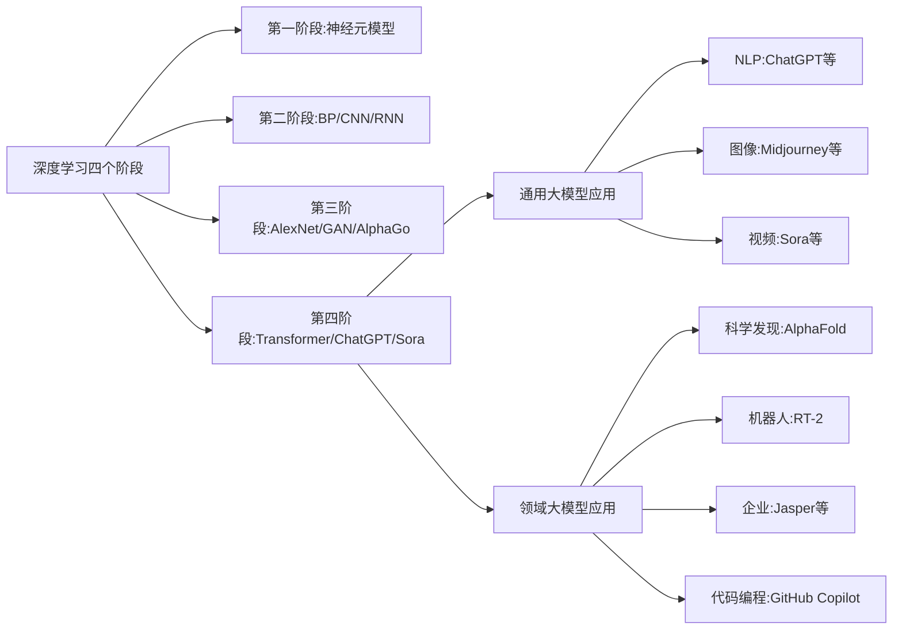

### 经典金句/数据
> “2022年，OpenAI发布了基于1750亿参数规模的大语言模型应用ChatGPT，它所展示的能力充分证明了大模型在社会各领域的应用潜力。” (1.1)
> “2020—2028年，全球大模型市场规模预计从25亿美元增长到1095亿美元。” (图1.2)
> “国内大模型相关应用在Android渠道的累计下载量达到8.2亿（2023.8-2024.8）。” (图1.4)
> “2024年，OpenAI发布了基于文本生成视频的应用Sora……通用人工智能（AGI）的实现成为可能。” (1.1)

---

## 第2章：大模型与数据体系

### 核心论点
**问题**：传统数据中台解决方案有哪些局限性？大模型如何带来新机会？
**观点**：大模型具备自然语言处理、SQL生成等能力，但需要“完备的信息”（即广义数据资产）才能在实际场景中发挥作用。通过RAG、Agent、Prompt工程与传统数据中台结合，可以打造AI驱动下的数据体系。

### 关键概念/事件
1. **业务对数据的需求层次**：经营分析（可视化）→精细化运营（数据挖掘）→辅助决策（预测）→驱动业务（实时干预）→智能自适应业务（AI）。
2. **经典数据中台解决方案**：包括技术平台（ETL、离线/实时处理、数据挖掘）、数据建模（数据标准、概念模型、物理模型）、数据治理（DGI架构）。
3. **大模型优势**：自然语言处理、SQL知识、编程能力；**不足**：需要完备的行业信息、缺乏最新知识、存在幻觉。
4. **大模型新思路**：广义数据资产治理 → RAG层 → 通用大模型 → Agents工程化 → 应用场景迭代。
5. **全新大模型解决方案关键目标**：基于明细数据深入分析、快速响应后验需求、资产可被人和AI理解、用户自助解决数据需求、低成本治理资产。

### 逻辑推演
从业务对数据的需求演变出发，说明经典数据中台虽然能支撑经营分析、精细化运营等，但面临治理架构僵化、技术成本高、业务感知低等挑战。大模型虽能写SQL接近人类水平，但依赖完备的行业知识。因此提出新思路：先治理广义数据资产（不仅包含传统资产，还包括需求、特征、业务规则等），再通过RAG补充知识，配合Agent工程化，最终实现自助分析。关键技术包括湖仓一体、数据资产技术、资产推荐、智能引擎、智能运营。

### 流程图
**经典数据中台解决方案架构图（简化）**
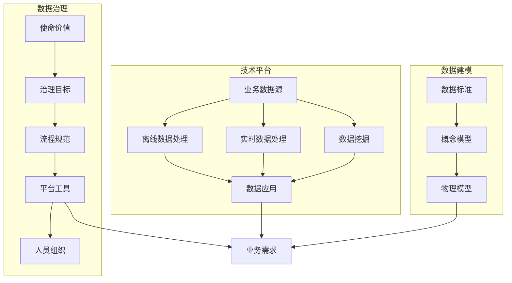

**全新大模型解决方案架构（高层）**
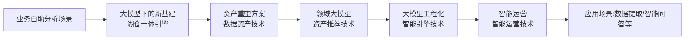

### 经典金句/数据
> “大模型写SQL代码的能力已经接近或达到人类水平，但是要想在实际场景中运用大模型还需要做很多事情，比如给大模型‘完备的信息’。” (2.3.1)
> “如果想让大模型在实际工作中发挥作用，那么可以通过RAG方式来补充大模型所需要的完整信息，通过Agent方式让流程节点的任务执行智能化。” (2.3.2)
> “全新的大模型解决方案的建设目标：让用户可以通过AI自助解决数据需求。” (2.4.1)

---

# 第2部分：大模型下的关键基础设施

## 第3章：大模型下的新基建

### 核心论点
**问题**：大模型生成SQL后，如何确保查询的高效执行和低成本？
**观点**：基于湖仓一体引擎（DeltaLH）的新基建，通过存储计算分离、数据冷热分层、湖仓一体化、实时数据写入和物化透明加速，能够支撑大模型对实时明细数据的探索分析。

### 关键概念/事件
1. **数据技术发展四阶段**：数据仓库（MPP架构）→离线计算（Hadoop）→流式计算（Storm/Lambda/Kappa）→湖仓一体（2020年Databricks提出）。
2. **DeltaLH湖仓关键技术**：
   - 存储计算分离：改造BE节点为CN（计算节点），支持弹性伸缩和资源隔离。
   - 数据冷热分层：热数据存本地SSD，冷数据存COS（对象存储），自动下沉。
   - 湖仓一体化：统一元数据管理（MetaStore），支持DDL同步，Delete操作采用MOR方案。
3. **实时数据写入**：日志上报→Kafka→Flink预处理→DeltaLH湖仓；配套全链路监控和对账补录。
4. **高效数据分析**：查询引擎优化（数据倾斜、分区/索引、多段聚合、连接策略、结果量优化）和物化透明加速（异步物化视图、延迟更新策略）。

### 逻辑推演
首先回顾数据技术从数据仓库到湖仓一体的演进，指出MPP和Hadoop各自的局限。然后详细阐述DeltaLH湖仓的设计：选择S3协议（腾讯云COS）作为数据湖底座，StarRocks作为数据仓库，Iceberg作为查询引擎。通过存储计算分离实现CN弹性扩展，通过冷热分层平衡性能与成本，通过统一MetaStore实现湖仓元数据互通。实时数据链路采用Kafka+Flink确保稳定写入，并设计全链路监控和对账机制。最后从查询引擎优化和物化视图两个维度提升分析效率。

### 流程图
**DeltaLH湖仓一体架构**
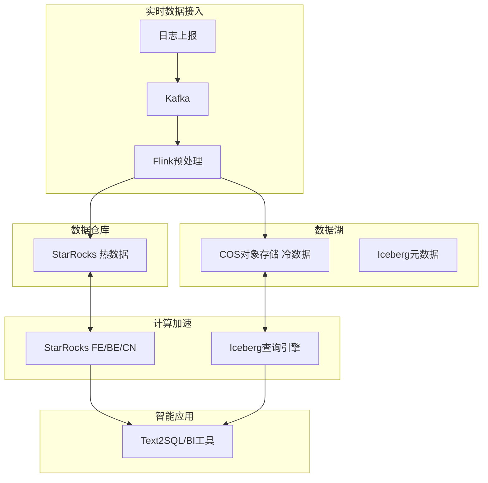

**冷热分层后的SQL执行计划优化**
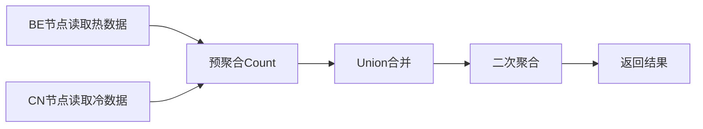

### 经典金句/数据
> “湖仓一体于2020年由Databricks提出……整合了数据仓库和数据湖的优势。” (3.1.1)
> “存算分离……CN作为一个计算节点，其本身是无状态的，因此可以实现计算资源的弹性伸缩。” (3.2.1)
> “通过数据的冷热分层，历史存量数据的存储成本也能得到有效控制。” (3.2.2)

---

# 第3部分：大模型下的数据资产

## 第4章：数据资产重塑

### 核心论点
**问题**：现有数据资产方案面临哪些核心挑战？如何重塑？
**观点**：现有方案存在非结构化标准缺失、建设治理成本高、运营目标不一致三大挑战。重塑思路是：更广义的资产标准（引入需求资产和特征资产）、更灵活的资产建设（AI辅助初始化与建设）、更量化的资产运营（以需求质量、特征复用率、库表覆盖率为指标）。

### 关键概念/事件
1. **现有数据资产建设四方面**：标准制定（设计/命名/编码规范）、数仓建模（业务调研→定义业务特性→明确指标→构建总线矩阵→设计模型）、资产运营（正负例归因）、业务自助（拖曳分析）。
2. **核心挑战**：
   - 缺失非结构化标准：业务需求和核心业务逻辑缺乏标准化管理。
   - 建设和治理成本高：资产表改造需要大量人力验证。
   - 运营目标不一致：业务人员追求快，资产架构师追求覆盖率高，导致协作滞后。
3. **重塑思路**：更广义的资产标准（需求资产+特征资产+库表资产）、更灵活的资产建设（AI从历史SQL中识别特征和库表）、更量化的资产运营（需求质量达标率、特征资产复用率、库表资产覆盖率）。

### 逻辑推演
从游戏场景的数据资产建设现状入手，指出标准制定、数仓建模、资产运营、业务自助的常规做法。然后分析三大挑战：非结构化标准缺失（如“周回流”定义模糊）、建设治理成本高（资产改造需逐层验证）、运营目标不一致（资产架构师的设计周期拖慢响应）。最后提出重塑方向：引入需求资产（结构化需求+行业知识+AI可理解需求）和特征资产（个人特征+公共特征），通过AI辅助初始化和建设，并通过量化指标运营。

### 经典金句/数据
> “缺失非结构化标准：业务需求和需求代码中的核心业务逻辑属于非结构化知识，仍然缺乏标准化的管理和规范。” (4.2.1)
> “重塑数据资产的思路：更广义的资产标准、更灵活的资产建设、更量化的资产运营。” (4.3)

---

## 第5章：数据资产标准

### 核心论点
**问题**：如何定义广义的数据资产标准？
**观点**：数据资产标准包括需求资产标准（结构化需求+行业知识资产+AI可理解需求）、特征资产标准（个人特征+公共特征）、库表资产标准（粒度、热度、速度三个参数驱动的优化引擎）。

### 关键概念/事件
1. **需求资产标准**：
   - 结构化需求：包含时间周期、输出字段、维度枚举值、指标统计逻辑。
   - 行业知识资产：业务特性、行为逻辑、专有名词、指标公式。
   - AI可理解需求：由数据包及其拓扑关系构成，每个数据包包含输入、执行、输出。
2. **特征资产标准**：
   - 个人特征：AI提取特征名称，开发人员补充代码片段。
   - 公共特征：数值参数抽象、限定转维度抽象。
3. **库表资产标准**：
   - 粒度参数：通过剔除字段后统计行数变化来识别。
   - 热度参数：基于时间因子的加权计算（衰减因子0.9，7天窗口）。
   - 速度参数：任务实际执行时间，用于反向推动库表设计。

### 流程图
**特征资产标准示例**
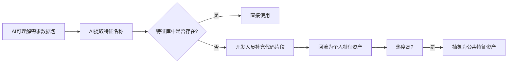

### 经典金句/数据
> “需求资产标准的核心内容包含结构化需求、行业知识资产和AI可理解需求。” (5.1)
> “特征资产分为个人特征资产和公共特征资产……公共特征中基本不会出现具体数值和常见的限定条件。” (5.2)
> “库表资产标准中的粒度参数通过表的实际执行行数的变化来识别。” (5.3.1)

---

## 第6章：数据资产建设

### 核心论点
**问题**：如何利用AI辅助建设需求资产、特征资产和库表资产？
**观点**：通过AI助力资产初始化（从历史SQL提取特征和库表），AI辅助需求资产建设（结构化、行业知识、AI可理解需求），AI辅助特征资产建设（个人特征即时回流、公共特征沉淀），AI辅助库表资产建设（优化引擎：成本模型训练+物化视图候选集生成+推荐）。

### 关键概念/事件
1. **特征资产初始化**：提取历史SQL子查询→AI提取库表和字段→聚类去重→热度排序→人工检查。
2. **库表资产初始化**：提取成功交付SQL中的表名→热度排序前80%→同粒度合并→构建视图作为资产。
3. **需求资产建设**：结构化需求（补充完整日期、增加输出字段、完善枚举值、类Excel转换）→行业知识资产建设（业务特性、指标公式、行为逻辑、专有名词）→AI可理解需求（需求拆解+需求检查）。
4. **特征资产建设**：个人特征从数据包中提取特征名称（多指标拆分→单指标元素识别→特殊处理）；公共特征由开发接口人按热度降序检查并转化。
5. **库表资产建设**：成本模型训练（DNN模型预测执行时间）→物化视图候选集生成（解析执行计划找公共子查询）→物化视图推荐（贪心算法选成本最小视图）。

### 流程图
**优化引擎整体架构**
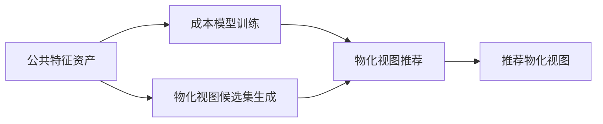

### 经典金句/数据
> “公共特征资产需求覆盖率通常可以达到80%以上，即AI通过相对收敛的公共特征资产可以实现超过80%的需求。” (6.4)
> “成本模型训练采用深度神经网络（DNN）模型，输入为特征加工后的N维向量，输出为执行时间的归一化数值。” (6.4.1)

---

## 第7章：数据资产运营

### 核心论点
**问题**：如何量化评估数据资产的建设效果并持续优化？
**观点**：以北极星指标为牵引，构建需求资产运营（需求质量达标率）、特征资产运营（公共特征转化率、特征资产复用率）、库表资产运营（库表资产覆盖率）三大指标体系，形成资产运营闭环。

### 关键概念/事件
1. **需求质量评估模型**：时间周期(10%)、输出字段(40%)、维度枚举值(40%)、指标统计逻辑(10%)，各分三级（10/5/0分）。
2. **需求质量达标率**：符合质量要求的需求数/总需求数。
3. **公共特征转化率**：公共特征数量/总特征数量。
4. **特征资产复用率**：首次新建特征需求数/总需求数。
5. **库表资产覆盖率**：资产交付需求数/总需求数。
6. **湖仓转换**：通过属性设置实现数据由仓入湖（调低start）或由湖升仓（修改start/history）。

### 流程图
**数据资产运营闭环**
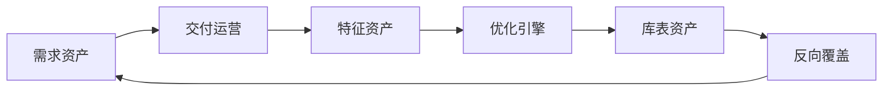

### 经典金句/数据
> “数据资产运营的北极星指标：需求质量达标率、特征资产复用率、库表资产覆盖率。” (7.1)
> “公共特征转化率 = 各业务板块的公共特征数量 / 总特征数量。” (7.3.1)
> “库表资产覆盖率 = 资产交付需求数 / 总需求数。” (7.4.2)

---

# 第4部分：自研领域大模型的技术原理

## 第8章：领域大模型的基础

### 核心论点
**问题**：为什么要自研领域大模型？有哪些构建方案？
**观点**：通用大模型存在幻觉生成、知识时效、数据安全问题。领域大模型通过检索增强生成（RAG）、参数高效微调（PEFT）或预训练方案，可在特定领域提供更专业、安全、高效的服务。

### 关键概念/事件
1. **通用大模型局限性**：幻觉生成（如GPT-4将“倒拔垂杨柳”搬到《红楼梦》）、知识时效（训练数据截止日期）、数据安全（外部API泄露风险）。
2. **领域大模型优势**：知识优势、效能优势（小参数可达大参数效果）、安全优势（本地部署）、定制优势。
3. **三种构建方案**：检索方案（RAG）、微调方案（全参数/参数高效微调）、预训练方案（从头或继续预训练）。
4. **检索增强生成流程**：准备阶段（数据提取→文本分块→向量化→索引构建）→应用阶段（用户查询→向量化→检索重排→注入提示）。
5. **参数高效微调主流算法**：BitFit、Adapter Tuning、Prefix Tuning、Prompt Tuning、LoRA（最常用）、UniPELT。
6. **模型选型**：计算资源充足选预训练；领域数据变化不频繁且资源有限选PEFT；知识更新频繁选RAG。

### 流程图
**检索增强生成流程**
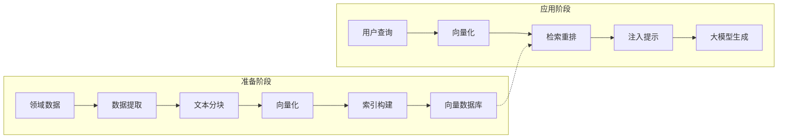

**Text2SQL自研领域大模型架构**
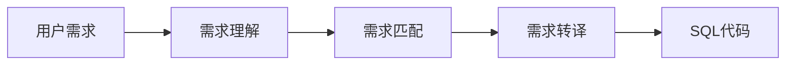

### 经典金句/数据
> “通用大模型在专业和更加细分的垂直领域，很难提供高价值的服务，从而无法产生实际的生产力。” (8.1.1)
> “LoRA算法是目前最常用的参数高效微调方法。此算法不会引入额外的推理耗时，同时也不占用下游任务的输入序列空间。” (8.2.3)
> “如果领域数据不会高频地发生变化，而且有相对足够的计算资源和领域数据，那么可以优先选择参数高效微调方案。” (8.2.4)

---

## 第9章：需求理解算法

### 核心论点
**问题**：如何将用户的模糊需求转化为清晰、无歧义的需求？
**观点**：通过构建业务知识库（知识定义+知识抽取）和需求理解链路（Query预处理、知识检索、需求澄清、需求改写、知识抽取），将口语化、有歧义的需求转化为AI可理解的清晰需求。

### 关键概念/事件
1. **必要性**：模糊需求（如“8月1日至7日参加英雄会的人数”）可能指向总人数或逐日人数，需业务知识（“英雄会”指工会还是活动）才能澄清。
2. **挑战**：知识形式多样、知识定义可变、知识零散分布、知识持续新增、知识复杂表述。
3. **传统Query理解**：Query预处理、分词、改写、Term分析、意图识别。
4. **创新需求理解算法**：业务知识库（向量数据库存储）+需求理解链路。
5. **业务知识库构建**：统一模板（kid、title、type、query_list、facts、emb_keys），通过少样本提示和链式思考从聊天记录等抽取。
6. **需求理解链路**：预处理→知识检索→需求澄清（多轮对话）→需求改写→知识抽取回流。

### 流程图
**需求理解算法核心组件**
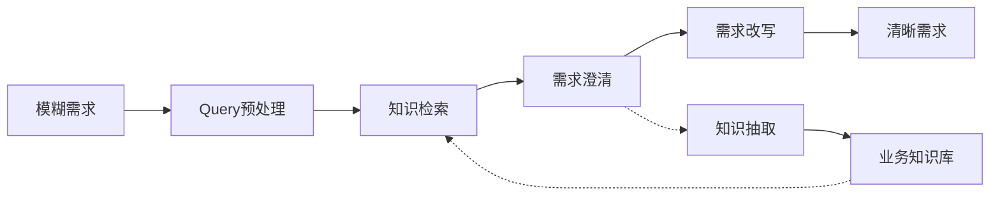

### 经典金句/数据
> “需求理解算法可以自动化地……通过解析模糊需求的真实意图来改写需求，让用户进行二次确认，从而得到清晰的完整需求。” (9.1.1)
> “需求理解算法的核心组件分为两个核心部分，分别是业务知识库和需求理解链路。” (9.2.2)

---

## 第10章：需求匹配算法

### 核心论点
**问题**：如何从海量数据资产中精确匹配与用户需求最相关的资产表？
**观点**：采用“召回+精排”两阶段方案。召回阶段通过资产图谱、文本召回、向量召回、意图召回多路召回候选表，粗排后送入精排；精排阶段使用微调的大语言模型（LoRA）对候选表精准排序。

### 关键概念/事件
1. **必要性**：不提供资产表，大模型会假设虚假表；提供不相关表会干扰生成。
2. **资产图谱**：本体层（实体类型及关系）+实体层（具体实例），实体包括资产表、数据列、维度值、类目等。支持数据可解释、工程效率高、修改便捷。
3. **文本召回**：倒排索引（词典+倒排列表）+Query切词（自定义词典+停用词）+BM25相关性计算。
4. **向量召回**：基于数据列召回（将列信息转为向量）和基于历史相似需求召回（将需求向量化）。
5. **意图召回**：构建意图类目（八大数据域），基于规则或微调BERT模型识别用户意图。
6. **召回粗排**：微调BERT模型，输入需求描述、资产表描述、数据列名、意图类目路径等，输出0-1分数。
7. **精排算法**：数据生成（数据增强+数据合成+负样本采样）→模型微调（LoRA，提示压缩、资产编码）→多LoRA部署（串行→并行→算子融合）。

### 流程图
**创新资产检索方案**
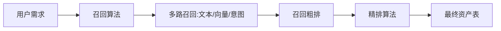

**多LoRA部署的算子融合方案**
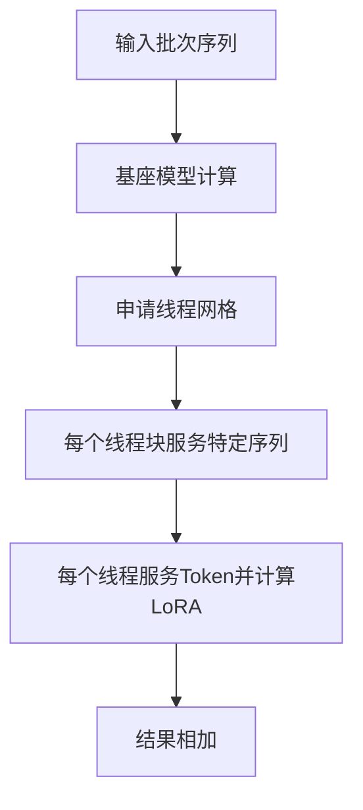

### 经典金句/数据
> “需求匹配算法中面临的最大挑战是匹配精度的问题，即如何精确地检索到与用户实际需求相契合的资产表。” (10.1.2)
> “资产图谱……通过直观的结构图展现了资产间的关系，其不仅可以在需求匹配时可视化地展示检索逻辑，而且还能在出现匹配错误时便捷地追溯问题的根源。” (10.2.1)
> “BM25算法的优势在于能够有效地处理不同长度的文档，并且通过IDF值强调了‘罕见词项’的重要性。” (10.2.2)

---

## 第11章：需求转译算法

### 核心论点
**问题**：如何指导大模型将清晰需求和匹配的资产表转化为正确的SQL查询？
**观点**：通过相似需求检索、复杂需求拆合、SQL执行、错误信息修复四步流程，利用大模型生成可执行的高效SQL代码，解决复杂查询和性能问题。

### 关键概念/事件
1. **必要性**：仅给需求和资产表，大模型在复杂场景下会生成幻觉SQL且效率低。
2. **面临问题**：数据依赖性、缺乏常识和世界知识、推理能力局限。
3. **传统Text2SQL演进**：规则模板（Precise）→统计学习（SEMPRE）→深度学习（Seq2SQL）→预训练语言模型（RAT-SQL）。
4. **创新需求转译算法流程**：相似需求检索（向量检索历史SQL）→复杂需求拆合（拆子需求→分别求解→合并）→SQL执行→错误修复（迭代）。
5. **评测数据集**：WikiSQL、Spider（多领域单轮）、CoSQL（多轮）、Bird（最贴近工业场景，需处理脏数据+外部知识+效率）。
6. **Bird数据集实战流程**：资产信息完善（大模型生成表描述）→资产结构匹配（召回+精排选择相关列）→外部知识增强（知识库检索融合）→复杂需求拆合→SQL执行→错误修复。

### 流程图
**需求转译算法流程**
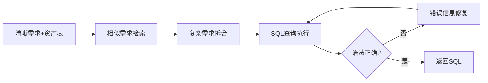

### 经典金句/数据
> “需求转译算法是连接用户需求到生成提取需求对应的SQL代码的‘最后一公里’。” (11.1)
> “Bird数据集更贴合实际工业场景，要求模型能处理大而脏的数据库数据，同时需要借助外部知识进行推理及考虑执行效率问题。” (11.3.1)
> “通过需求转译算法增强后，大模型执行效率得到了显著提高。” (图11.2)

---

# 第5部分：大模型的工程化原理

## 第12章：工程化的基础

### 核心论点
**问题**：大模型工程化的核心问题、挑战、目标和实施策略是什么？
**观点**：工程化要将AI技术转变为实际可用、可靠的系统。核心是系统化落地，面临规范输出和更新知识库两大挑战，目标是用户需求“说得清”、业务知识“推得准”、业务结果“效果好”，实施策略包括模块化设计、人机协同、回归评估、安全合规。

### 关键概念/事件
1. **工程化定义**：跨领域复杂工程，融合软件工程、人工智能、行业流程。
2. **核心理念**：规范性和一致性、可重复性和可预测性。
3. **1个核心问题**：系统化落地问题。
4. **2个挑战**：规范大模型输出、保障知识库更新。
5. **3个目标**：用户需求“说得清”、业务知识“推得准”、业务结果“效果好”。
6. **4个实施策略**：模块化设计、人机协同、回归评估、安全合规。
7. **业务流程三环节**：需求标准化→资产匹配→代码生成与校验。
8. **系统架构七部分**：数据存储、安全访问控制、流程引擎、模型底座、知识库资产、应用场景、平台运营。

### 流程图
**大模型工程化建设的系统架构**
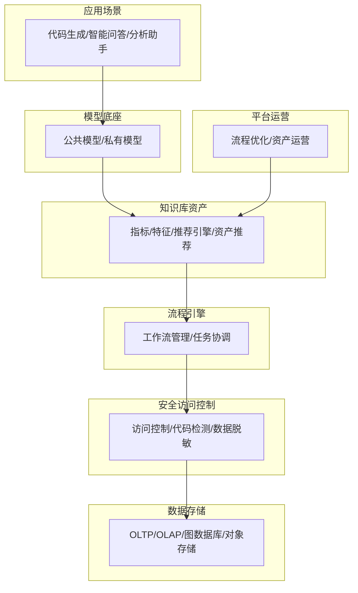

### 经典金句/数据
> “大模型应用工程化是将通用人工智能模型技术转变为实际可用、可靠的一系列工程实践和方法的集合。” (12.1.1)
> “工程化的核心理念是通过制定标准规范、优化开发流程，提高工作效率、降低研发运营成本和保障应用运行稳定。” (12.1.2)

---

## 第13章：工程化的技术筹备

### 核心论点
**问题**：如何选择技术栈和搭建开发环境？
**观点**：技术选型包括开发语言（Python）、大模型交互方式（OpenAI API参数）、大模型应用框架（LangChain）；工程实现包括提示词工程（少样本、链式思考、自调整）和开发环境搭建（pyenv虚拟环境、安装OpenAI和LangChain）。

### 关键概念/事件
1. **OpenAI API关键参数**：model、messages、temperature（设为0降低随机性）。
2. **LangChain生态四层**：核心层（LCEL、六大能力）、社区组件层（模型I/O、检索、工具库）、应用层（链式应用、智能体应用、检索策略）、技术生态层（LangSmith、LangGraph、LangServe）。
3. **提示词工程结构**：指令（任务目标、角色、输出格式）+内容（少样本、链式思考、自调整）。
4. **少样本提示**：提供示例指导模型格式输出。
5. **链式思考提示**：引导模型分步推理。
6. **自调整提示**：引导模型自我检查和修正。
7. **开发环境**：pyenv虚拟环境，安装openai、langchain等依赖库。

### 流程图
**LangChain生态架构**
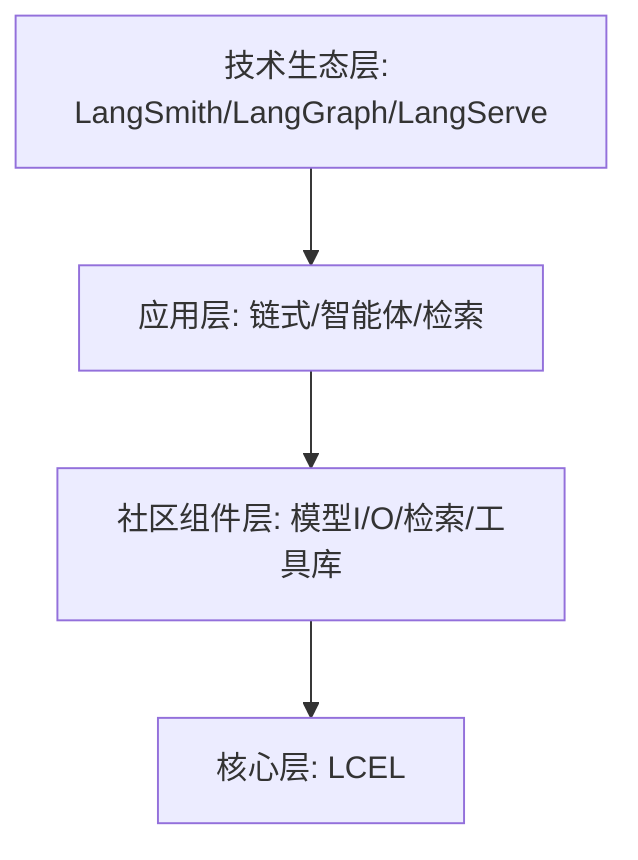

### 经典金句/数据
> “提示词工程的结构由指令和内容两部分构成。” (13.3)
> “在工程实践中通常会将temperature参数的值设置为0或较小的值，从而控制模型在生成响应时尽可能地减少随机性和创造性。” (13.1)

---

## 第14章：工程化的建设要点

### 核心论点
**问题**：如何实际构建大模型工程化项目？
**观点**：明确构建目标（功能性/非功能性需求、流程定义），实现核心功能（模块化架构、安全管控、工具模型、人机协同、应用场景），评估运营质量（回归评估指标、资产运营指标）。

### 关键概念/事件
1. **功能性需求**：人机协同（会话交互、需求标准化、SQL生成/修正）、工具模型（模型工具、资产治理工具、实用工具）。
2. **非功能性需求**：安全管控、回归评估。
3. **三大流程**：需求标准化、SQL代码生成、SQL代码修正。
4. **模块化架构**：安全管控、工具模型、人机协同、应用场景、回归运营五层。
5. **安全管控**：数据库驱动（SQLite示例）+访问控制代理（装饰器）。
6. **工具模型**：日志管理、文本格式化、配置管理；元数据管理、指标特征管理、资产推荐；大模型封装。
7. **人机协同**：PDAC方法论（定义→设计→行动→修正），实现需求拆解、任务编排调度、SQL生成、SQL修正。
8. **应用场景**：FastAPI构建SQL生成助手。
9. **回归评估指标**：可观测性（首Token延迟、Token95%分位数等）、可靠性（可用性、RTO）、准确性（SQL一次生成准确率、修复准确率、测试集准确率）。
10. **资产运营指标**：数据资产变更/下线流程、公共/个人知识库建设、资产升级管理。

### 流程图
**人机协同PDAC流程**
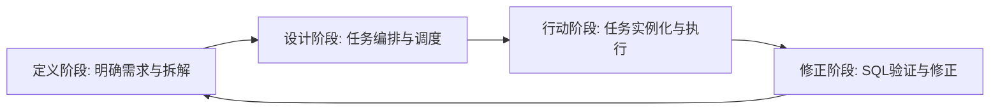

### 经典金句/数据
> “模块化系统设计原则，将系统架构分为5个主要部分，分别是安全管控、工具模型、人机协同、应用场景和回归运营。” (14.2.1)
> “PDAC是一种迭代的问题解决框架，旨在提高过程效率并解决复杂问题。” (14.2.4)

---

## 第15章：工程化的安全策略

### 核心论点
**问题**：如何保障大模型工程化系统的安全？
**观点**：安全体系建设包括制度与流程、数据安全（检查验证、认证管控、审计改进）、运行安全（基建管控、平台管控、运营管控）。实施方案包括数据分类分级、资产匿名化与脱敏、访问控制、监控告警。

### 关键概念/事件
1. **制度与流程**：政策制定更新、流程制定更新、培训与意识提升。
2. **数据安全三阶段**：
   - 检查验证：提示词攻击防范、恶意指令过滤、SQL注入防护（参数化查询）。
   - 认证管控：身份认证、访问控制（最小权限原则）、隐私保护（匿名化/加密）。
   - 审计改进：审查分析、标准遵循、持续改进。
3. **运行安全**：基建管控（OS安全、网络安全、漏洞管理）、平台管控（环境隔离、组件授权）、运营管控（日志监控、复盘分析）。
4. **数据分类分级**：识别分类→风险评估→实施保护→持续监控→法规遵从。
5. **匿名化与脱敏**：数据掩码、伪装、哈希化、通用化、加密；采集阶段和展示阶段实施。
6. **访问控制**：容器化隔离、RBAC、代码审计、最小权限配置。
7. **监控告警**：数据收集→异常监控→告警机制→自动化响应。

### 流程图
**数据分类分级方案**
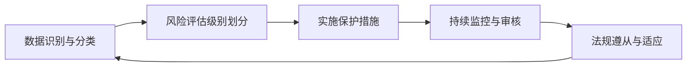

### 经典金句/数据
> “安全策略是大模型工程化项目实施必须高度重视的生命线。” (15章导语)
> “通过实施最小权限原则……防止未授权访问敏感数据的行为，从而减少潜在的安全风险。” (15.1.2)
> “容器化技术使得容器内的应用程序运行在指定的用户空间和网络空间内，除非显示授权，否则无法访问主机操作系统上的资源。” (15.2.3)

---

# 第6部分：大模型在游戏领域的应用

## 第16章：游戏领域的应用案例

### 核心论点
**问题**：如何在实际游戏经营分析场景中应用智能助手系统？
**观点**：通过智能助手系统，数据开发人员可以选择思维风格、描述需求，系统自动结构化、匹配行业知识和特征、生成SQL代码，并可转换为DSL实现探索分析看板，显著提升SQL编码和报表开发效率。

### 关键概念/事件
1. **游戏经营分析趋势**：数据驱动决策、实时数据统计、多源集成分析。
2. **智能助手系统架构**：平台层（数据资产管理）、引擎层（需求理解、SQL生成、DSL转换）、应用层（代码生成、探索分析）。
3. **需求理解模块子功能**：选择风格（单步/通用/分枚举值/分指标/明细关联再统计）、结构化需求、匹配行业知识、匹配表、获取表元数据、拼接提示词。
4. **SQL生成模块子功能**：提取特征名称、匹配特征（正则化去停用词/日期/数字）、推荐库表和特征、获取元数据、拼接提示词、生成SQL、语法校验。
5. **代码生成应用10步**：思维风格选择→需求描述→结构化需求→匹配行业知识→补充行业知识→AI可理解需求与特征提取→匹配特征→补充特征→生成并检查SQL→数据推送任务配置。
6. **探索分析应用差异化**：SQL2DSL（语义映射+语法转换）、生成探索分析表头、探索分析操作（跳转BI平台调整图表另存）。

### 流程图
**五种思维风格流程**
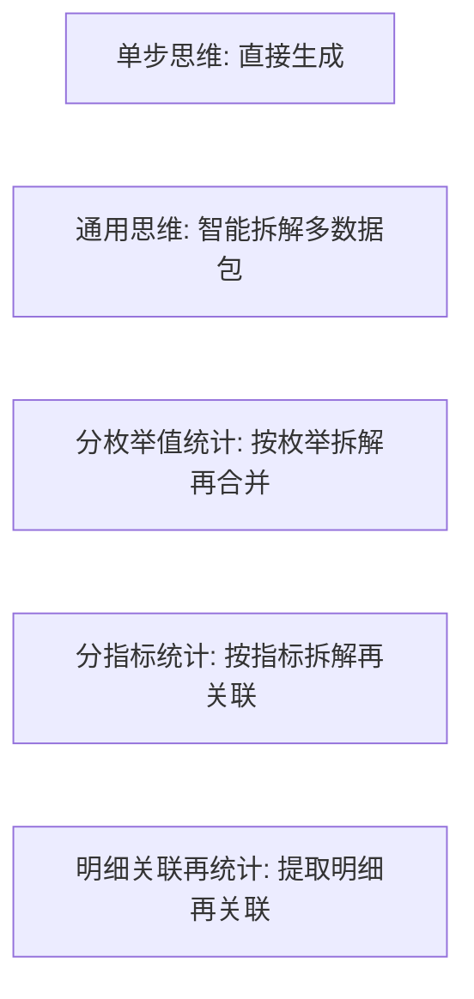

**代码生成应用核心流程**

### 经典金句/数据
> “随着游戏业务日益增长的经营分析需求，游戏大厂每年需要处理上万个数据服务类请求，仅依靠传统的人工服务模式，已无法满足全量业务的需求交付带宽。” (16.1)
> “代码生成应用和探索分析应用仅是大模型与大数据在经营分析场景中的冰山一角……笔者团队也将在这条创新之路上不断探索和前行。” (16.5)

---

## 后记与资源支持

本书提供配套资源：思维导图和异步社区7天会员。读者可通过扫描二维码获取。书中代码字体版权采用SIL Open Font License 1.1。

> 配套资源验证码：241485

---

**文档结束**