# 《大模型应用开发实战》（AI Engineering: Building Applications with Foundation Models）章节总结

## 书籍信息
- **书名**：大模型应用开发实战（AI Engineering: Building Applications with Foundation Models）
- **作者**：【越】奇普·萱 (Chip Huyen)
- **译者**：宝玉
- **出版社**：人民邮电出版社
- **出版时间**：2026年1月
- **ISBN**：9787115686398
- **字数**：354千字（英文版超15万字，中文版约30万字）
- **PDF状态**：识别为文字版PDF（非扫描图像），正文可完整提取。
- **OCR状态**：无需OCR修复，文本清晰可读。

## 目录说明
- **目录识别情况**：原书包含完整目录（中文版）。主要章节：第1章至第10章，外加前言、译者序、中文版序、后记、关于作者、封面简介等。
- **章节对应依据**：严格按原书页码顺序（从第1页至第511页）提取内容。
- **OCR修复说明**：无OCR错误，仅有少量排版格式（如图表缺省）需要从文字描述中重建。

## 全书核心主题
本书系统地阐述了“AI工程”的核心方法——如何基于现成的基础模型（LLM、LMM）构建高效、实用的AI应用。作者提供了一个完整的AI工程框架，涵盖模型选择与评估、提示工程、RAG与智能体、微调策略、数据集工程、推理优化及AI工程架构等关键环节。全书强调：工具更新换代快，但底层知识（评估、数据、架构原则）更为持久。核心目标是帮助开发者在复杂的AI生态中做出科学的技术决策，让AI应用更快、更可靠、更具可扩展性。

---

## 第1章：基于基础模型构建AI应用入门

### 核心论点
**问题**：为什么要从传统ML工程转向AI工程？如何利用现成的基础模型构建应用？  
**观点**：由于基础模型（大语言模型和多模态大模型）的出现，AI应用的构建门槛大幅降低，但评估和适配成为新的挑战。AI工程不同于ML工程，更侧重于模型适配（提示工程、RAG、微调）而非从头训练模型。

### 关键概念/事件
- **基础模型**：从大语言模型（LLM）扩展到多模态大模型（LMM），可通过自监督学习从海量数据中训练。
- **自监督学习**：模型直接从输入数据中推断标签，无需人工标注，突破了数据标注瓶颈。
- **模型即服务（MaaS）**：由少数组织开发模型并以API形式提供给他人使用。
- **AI工程**：在基础模型之上构建应用的过程，与ML工程的区别在于更少关注模型开发，更多关注模型适配和评估。
- **应用模式**：编程、图像视频制作、写作、教育、聊天机器人、信息聚合、数据组织、工作流自动化等8类。

### 逻辑推演/叙事脉络
作者首先回顾了从语言模型到基础模型的演变，指出自监督学习使模型能够规模化扩展。随后分析了AI工程兴起的三个因素：通用的AI能力、AI投资增加、构建门槛降低。通过大量应用案例（编程、创意、写作等）展示了AI的实际价值。最后对比AI工程与传统ML工程，提出AI工程更注重产品迭代和评估，并概述了AI工程技术栈的三层结构（应用开发层、模型开发层、基础设施层）。

### 流程图

#### AI工程技术栈三层结构
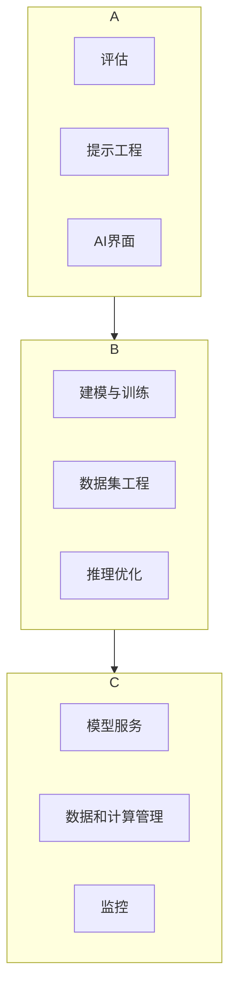

### 经典金句/数据
> “AI工程其实就是在软件工程的技术栈中加入了AI模型。” ——Anton Bacaj  
> “工具更新换代很快，底层知识的生命力更为持久。” (p.15)  
> 2025年美国AI投资预计接近1000亿美元，全球2000亿美元。(p.35)  
> 三分之一的标普500公司在2023年Q2财报电话会议中提及AI。(p.35)

---

## 第2章：理解基础模型

### 核心论点
**问题**：如何理解基础模型的设计决策，从而更好地选择和使用模型？  
**观点**：基础模型的差异主要源于训练数据、模型架构与规模，以及后训练（对齐人类偏好）。采样过程（温度、top-k、top-p）对输出质量影响巨大，是解释幻觉和不一致性的关键。

### 关键概念/事件
- **训练数据分布**：Common Crawl中英语占45.88%，许多低资源语言（如旁遮普语）代表性严重不足，导致模型在这些语言上表现差。
- **Transformer架构**：基于自注意力机制，包含预填充（并行）和解码（串行）两阶段。
- **模型规模指标**：参数量、训练token数、FLOPs。Chinchilla规模法则：训练token数约为参数量的20倍。
- **后训练**：包括监督微调（用示范数据）和偏好微调（RLHF/DPO），使模型符合人类偏好。
- **采样策略**：温度（高温度增加创造性）、top-k、top-p。概率性导致不一致性和幻觉。
- **结构化输出**：通过提示、后处理、约束采样、微调实现。

### 逻辑推演/叙事脉络
作者从训练数据开始，说明模型性能受数据分布影响（多语言、领域特定）。接着剖析Transformer架构及其替代方案（Mamba、Jamba）。讨论模型规模法则及瓶颈（数据耗尽、电力）。然后介绍后训练如何将预训练模型“驯化”为对话模型。最后重点阐述采样机制，解释概率性如何带来创造力与风险（幻觉、不一致），并给出缓解方法（缓存、固定随机种子、提示技巧）。

### 流程图

#### Transformer架构中的注意力机制
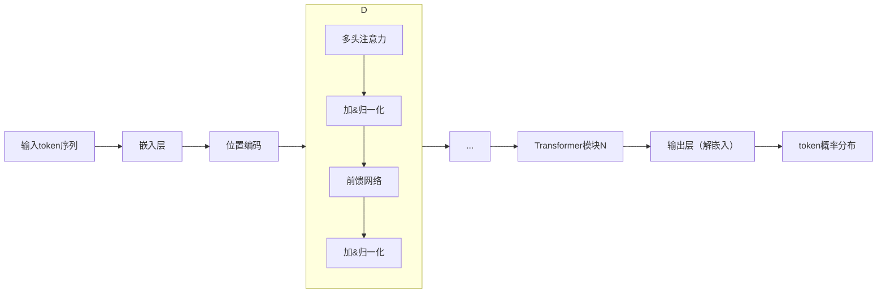

#### 采样过程：logit → 概率 → token
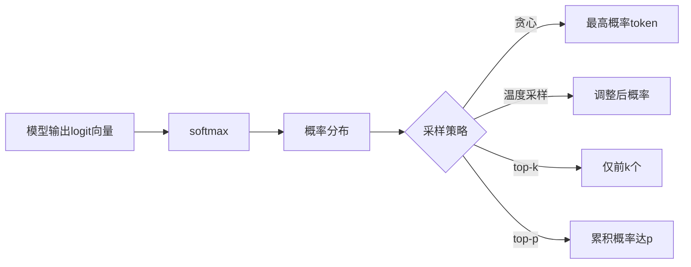

### 经典金句/数据
> “概率虽低，但绝不会是零。” (p.127)  
> GPT-4对英语MMLU准确率远高于泰卢固语、马拉地语。(p.75)  
> 缅甸语表达相同含义所需token数是英语的10倍。(p.77)  
> Llama 3训练使用了15万亿个token。(p.91)  
> InstructGPT仅2%计算资源用于后训练，98%用于预训练。(p.100)

---

## 第3章：评估方法论

### 核心论点
**问题**：如何评估开放式、概率性的基础模型？  
**观点**：评估是AI工程的最大瓶颈。传统精确评估（功能正确性、相似度度量）仍有价值，但“AI当裁判”和比较评估正成为主流。必须系统化设计评估流水线。

### 关键概念/事件
- **评估挑战**：开放式输出无标准答案、模型黑盒、基准测试迅速饱和。
- **语言建模指标**：困惑度（PPL）、交叉熵、BPC、BPB。困惑度越低，模型预测越准。
- **精确评估**：功能正确性（如代码执行）、词汇相似度（BLEU/ROUGE）、语义相似度（余弦相似度、BERTScore）。
- **嵌入**：将文本/图像转换为向量，用于计算相似度。
- **AI当裁判**：使用AI模型（如GPT-4）评估输出，速度快、成本低，但存在偏差（自我偏差、冗长偏差、位置偏差）。
- **比较评估**：通过两两比较模型输出进行排名（Elo、Bradley-Terry）。LMSYS Chatbot Arena是典型。

### 逻辑推演/叙事脉络
作者首先指出评估的困难（开放式、基准饱和），然后介绍语言建模指标作为基础。接着分类精确评估方法（功能正确性、相似度），并引入嵌入概念。重点讨论“AI当裁判”方法：为什么用它（快速、灵活）、怎么用（提示词设计）、局限性（不一致、成本、偏差）。最后介绍比较评估（配对比较、排名算法）及其未来前景。

### 流程图

#### AI当裁判评估流程
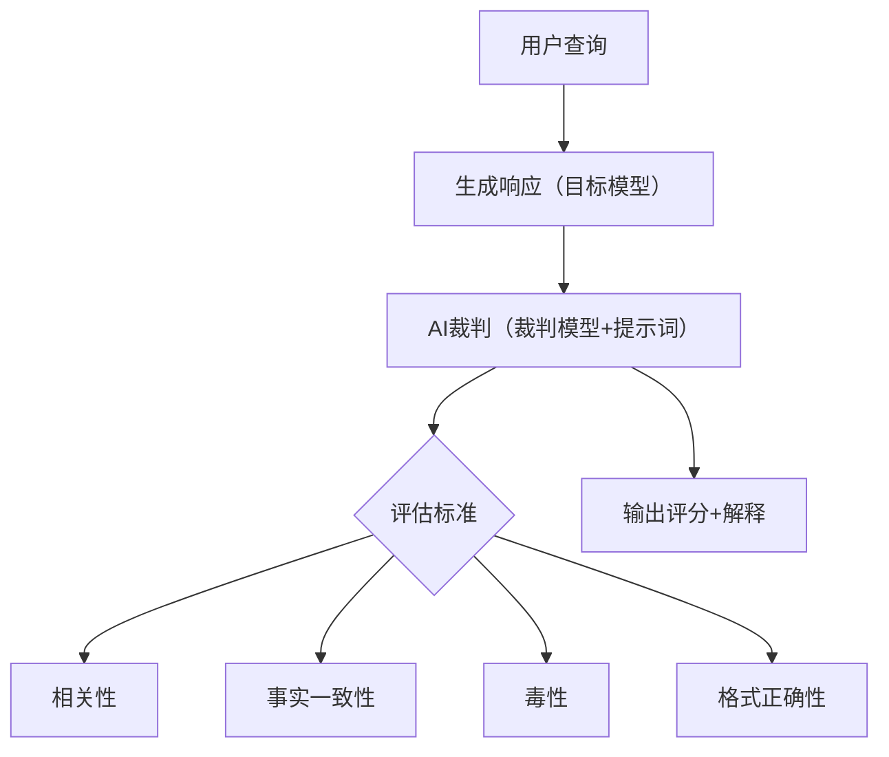

#### 比较评估（Elo排名）流程

### 经典金句/数据
> “出人意料的是，很多时候，仅靠评估就够了。” ——Greg Brockman (p.135)  
> GPT-4与人类评估员一致性达85%，高于人类之间81%。(p.159)  
> 评估仓库数量在2023年呈指数增长。(p.139)  
> 使用验证器带来的性能提升相当于将模型规模扩大30倍。(p.119)

---

## 第4章：评估AI系统

### 核心论点
**问题**：如何为具体应用设计评估流水线，选择最佳模型？  
**观点**：评估驱动开发——先定义评估标准（领域能力、生成能力、指令遵循、成本延迟），再构建流水线。模型选择需权衡自托管与API、利用公开基准但警惕数据污染。

### 关键概念/事件
- **评估标准**：领域特定能力（编程、数学）、生成能力（事实一致性、安全性）、指令遵循能力（IFEval、InFoBench）、成本和延迟。
- **事实一致性评估**：局部（与上下文对比）和全局（与公开知识对比），使用SelfCheckGPT、SAFE（搜索增强）、文本蕴含（NLI）。
- **安全性**：检测毒性、仇恨言论、偏见（政治意识形态）。基准如RealToxicityPrompts。
- **模型选择工作流**：剔除硬属性不符模型 → 利用公开排名缩小范围 → 私有评估 → 监控。
- **自托管 vs API**：比较维度：数据隐私、数据溯源、性能、功能性、成本、控制权、设备端部署。
- **公开基准污染**：训练数据包含基准测试数据，导致分数虚高。用n-gram重叠和困惑度检测。

### 逻辑推演/叙事脉络
作者提出评估驱动开发：先定义标准。分别讨论领域能力（选择题、基准测试）、生成能力（事实一致性、安全性）、指令遵循。然后进入模型选择：比较自托管与API的优缺点（7个维度），利用公开排行榜（Hugging Face、HELM）但注意污染。最后详细讲解如何构建私有评估流水线：定义标准→创建带示例的评分规则→选择评估方法→标注评估数据→评估流水线本身→迭代。

### 流程图

#### 模型选择工作流
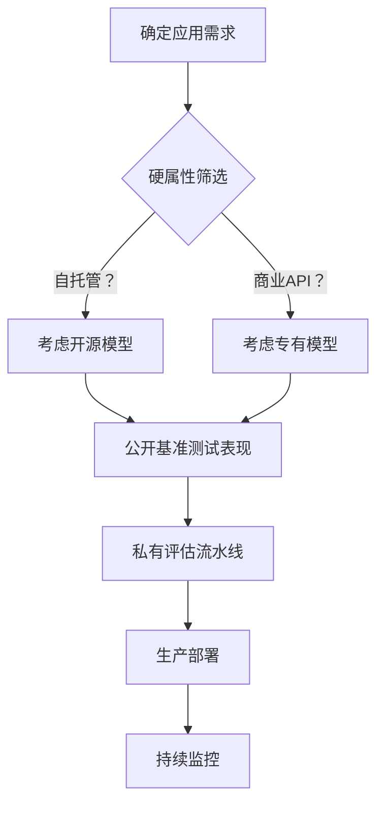

#### SAFE（搜索增强事实性评估）流程
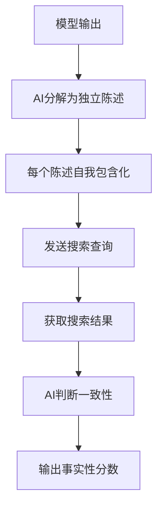

### 经典金句/数据
> “评估是AI应用落地的最大瓶颈。” (p.181)  
> 在MMLU上，开源模型与专有模型的差距正在缩小。(p.206)  
> ChatGPT泄露事件导致三星禁止使用ChatGPT。(p.204)  
> TruthfulQA基准中，GPT-4得分远高于GPT-3。(p.190)  
> 数据污染：GPT-3有13个基准测试中至少40%的数据出现在训练数据中。(p.219)

---

## 第5章：提示工程

### 核心论点
**问题**：如何通过设计输入指令来引导模型行为，而不修改模型权重？  
**观点**：提示工程是人-AI沟通的艺术。清晰指令、提供示例、拆分复杂任务、要求模型逐步思考（CoT）能显著提升性能。同时必须防御提示词攻击（注入、越狱、信息提取）。

### 关键概念/事件
- **上下文学习**：零样本、少样本。模型通过提示词中的示例学习新任务。
- **系统提示词 vs 用户提示词**：系统提示词设定角色和全局规则，用户提示词提交具体查询。
- **思维链（CoT）**：要求模型“逐步思考”，大幅提升推理能力。
- **提示词攻击**：提示词提取、越狱（绕过安全）、间接注入（隐藏恶意指令在外部资源中）。
- **防御措施**：指令层级（系统>用户>模型输出>工具输出）、输入/输出防护、隔离执行。

### 逻辑推演/叙事脉络
作者首先定义提示词结构（任务描述+示例+具体任务），解释上下文学习原理。然后列出最佳实践：清晰指令、角色设定、提供示例、明确输出格式、提供充足上下文、拆分复杂任务、使用CoT、迭代优化。接着转向安全：三种主要攻击（提取、越狱、信息提取）及具体手法（DAN、祖母漏洞、PAIR）。最后给出防御策略（模型层、提示词层、系统层）。

### 流程图

#### 思维链（CoT）提示示例
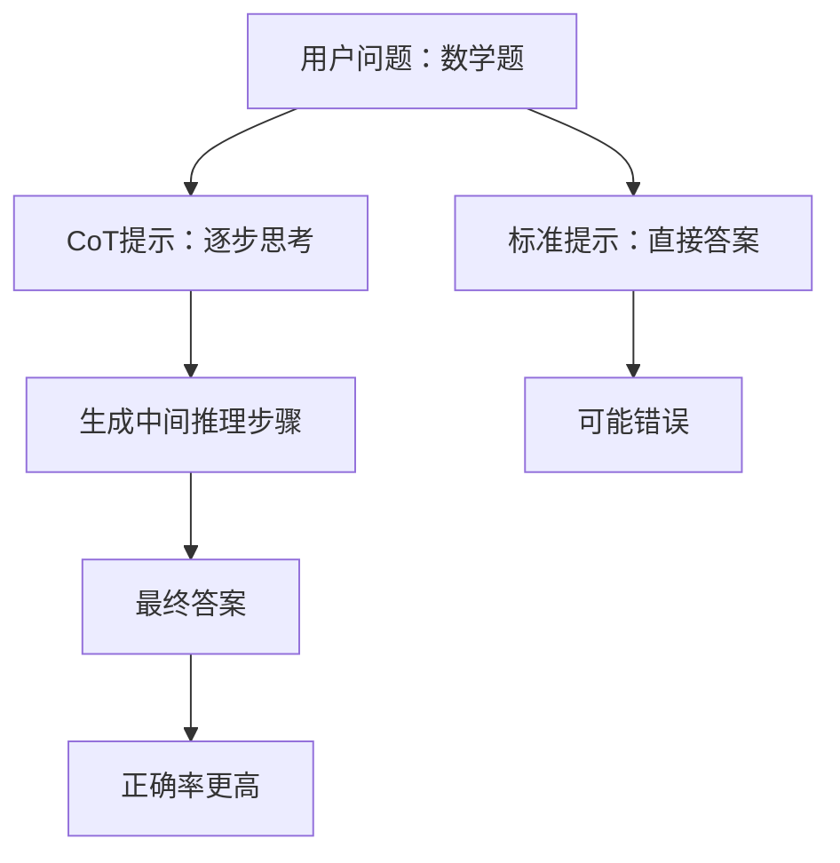

#### 间接提示词注入攻击
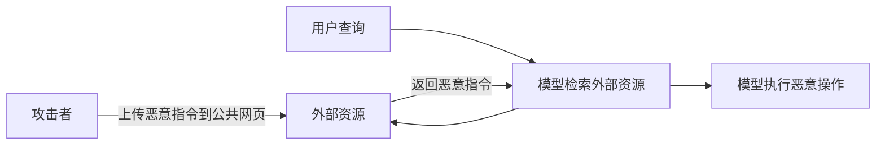

### 经典金句/数据
> “提示工程不是真正的技术，真正的问题是人们只懂提示工程。” ——OpenAI研究经理 (p.229)  
> “在撰写系统提示词的时候，要假设它有一天会被公开。” (p.256)  
> 在HumanEval上，错误和正确的解决方案的BLEU分数相近。(p.154)  
> PAIR通常不到20次查询即可实现越狱。(p.261)

---

## 第6章：RAG与智能体

### 核心论点
**问题**：如何为模型构建相关上下文，并赋予其使用工具的能力？  
**观点**：RAG通过检索外部知识增强生成质量，智能体则通过规划和工具使用完成复杂任务。两者都依赖记忆系统（短期、长期）。RAG解决事实性问题，智能体解决行为性问题。

### 关键概念/事件
- **RAG架构**：检索器（基于词项或嵌入） + 生成器。检索质量影响整体性能。
- **检索算法**：BM25（基于词项）、向量搜索（基于嵌入，如FAISS、HNSW）、混合检索。
- **智能体**：由环境、工具集和AI规划器（大模型）组成。规划包括生成计划、反思、执行。
- **工具类型**：知识增强（检索）、能力扩展（计算器、代码解释器）、写入动作（修改环境）。
- **记忆系统**：内部知识（模型权重）、短期记忆（上下文）、长期记忆（外部数据库）。管理策略：FIFO、摘要、反思。

### 逻辑推演/叙事脉络
作者先介绍RAG的起源（2017年阅读理解论文），然后详解RAG架构、检索算法（比较BM25与向量搜索）、优化策略（分块、重排序、查询重写、上下文检索）。接着过渡到智能体：定义、工具、规划（计划生成、反思、错误修正）。讨论规划能力与强化学习的对比。最后引入记忆系统（三种机制）及其管理方法。

### 流程图

#### RAG基本架构
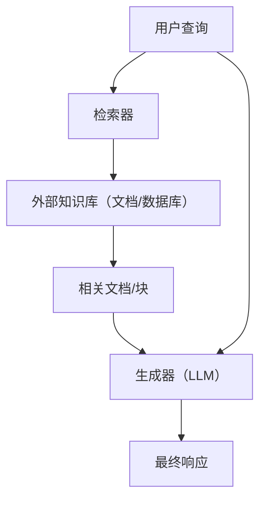

#### 智能体规划与执行循环（ReAct）
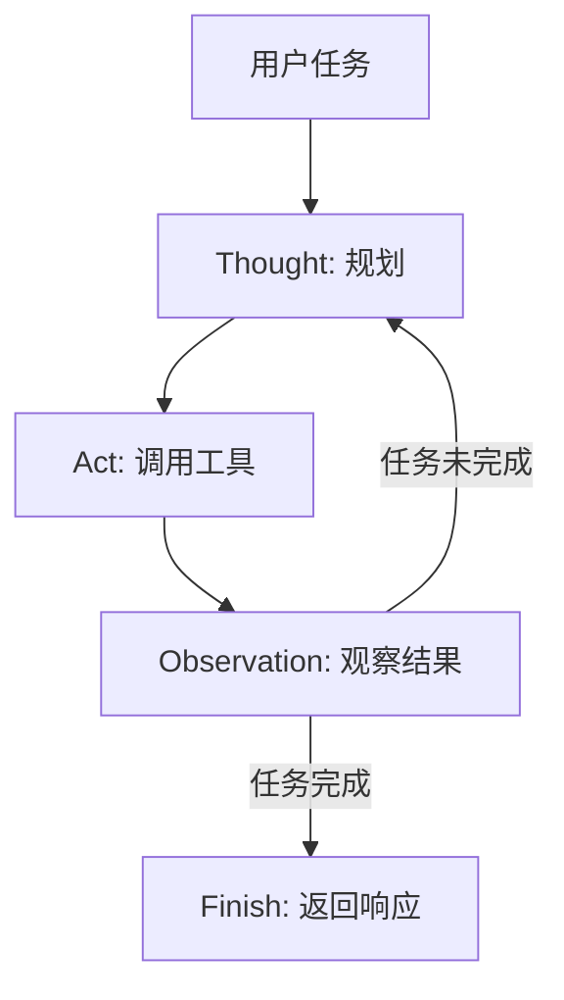

#### 混合搜索（词项+嵌入）
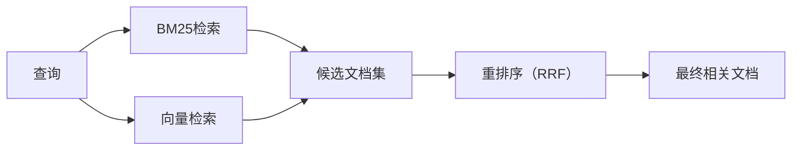

### 经典金句/数据
> “RAG关注事实，微调关注形式。” (p.336)  
> 在MMLU上，RAG优于微调。(p.336)  
> Perplexity CEO：在BM25基础上实现真正的改进很困难。(p.278)  
> 智能体每步95%准确率，10步后降至约60%。(p.297)

---

## 第7章：微调

### 核心论点
**问题**：如何通过更新模型权重来适配特定任务？何时微调，何时用RAG？  
**观点**：微调可提升领域能力、安全性、指令遵循，但需要大量内存和数据。参数高效微调（PEFT，如LoRA）和量化大幅降低微调门槛。模型合并是一种实验性替代方案。

### 关键概念/事件
- **内存瓶颈**：训练所需内存 = 权重 + 激活值 + 梯度 + 优化器状态。Adam优化器每个参数需3个额外值。
- **量化**：降低数值精度（FP16、INT8、INT4）。QLoRA实现4位微调。
- **PEFT**：基于适配器（LoRA）和基于软提示（prefix-tuning）。LoRA通过低秩分解大幅减少可训练参数。
- **LoRA**：将权重矩阵分解为两个小矩阵A和B，仅更新A、B。推理时无额外延迟。
- **模型合并**：求和（线性组合、SLERP）、层堆叠、拼接。用于多任务微调和设备端部署。

### 逻辑推演/叙事脉络
作者先讨论微调的时机（提高质量、缓解偏见、蒸馏小模型）和不微调的理由（资源成本、可能导致其他任务性能下降）。对比微调与RAG。然后深入内存计算：推理内存、训练内存、数值表示、量化。接着介绍PEFT技术（LoRA为主），详解LoRA原理、配置（秩、应用于哪些矩阵）、多LoRA部署。最后介绍模型合并（求和、层堆叠、拼接）及其应用场景（多任务、联邦学习、模型扩容）。

### 流程图

#### LoRA微调原理
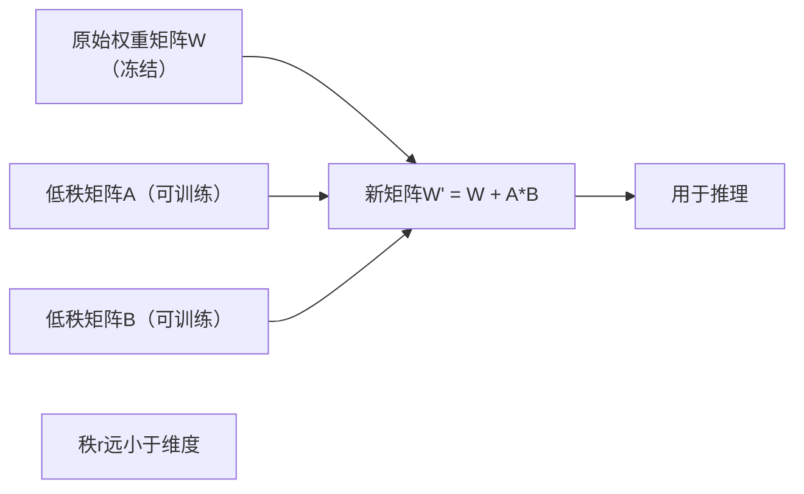

#### 模型合并（求和）
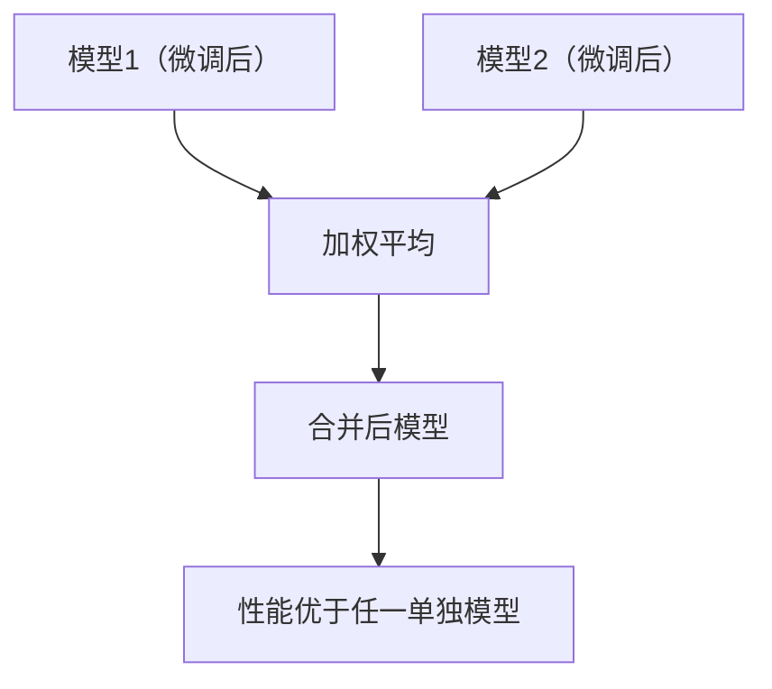

### 经典金句/数据
> “微调本身不难，难的是获取用于微调的数据。” (p.379)  
> Llama 2-70B全量微调需至少56 GB内存（FP16）。(p.351)  
> LoRA仅用0.0027%的可训练参数达到与全量微调相当的性能。(p.358)  
> QLoRA使650亿参数模型可在单张48GB GPU上微调。(p.363)  
> BitNet b1.58（1.58位）性能媲美16位Llama 2。(p.348)

---

## 第8章：数据集工程

### 核心论点
**问题**：如何获取高质量、高覆盖度、足够数量的数据来微调模型？  
**观点**：数据质量比数量更重要。合成数据（AI生成）可扩展数据，但需严格验证。数据策展需遵循相关性、符合任务、一致性、格式规范、独特、合规六大原则。

### 关键概念/事件
- **数据策展三大标准**：质量、覆盖度（多样性）、数量。
- **数据合成方法**：基于规则（模板、扰动）、模拟、AI驱动（反向指令、回译、代码生成）。
- **数据验证**：功能正确性（代码执行）、AI裁判、启发式过滤。
- **模型蒸馏**：用小模型（学生）模仿大模型（教师）的行为。
- **数据处理**：去重（MinHash、布隆过滤器）、清理（移除PII、HTML标签）、格式化（符合模型聊天模板）。

### 逻辑推演/叙事脉络
作者首先强调数据的重要性，提出以数据为中心的AI理念。然后详细阐述数据策展：需要什么数据（指令、偏好）、六大质量特征、覆盖度（多样性维度）、数据量（取决于微调技术和任务复杂度）。接着介绍数据获取（公开数据、自标注）和数据合成（传统方法+AI驱动）。以Llama 3的合成数据流程为例（代码生成、回译、验证）。最后讨论数据处理步骤（检查、去重、清理、格式化）。

### 流程图

#### Llama 3 合成代码数据流程
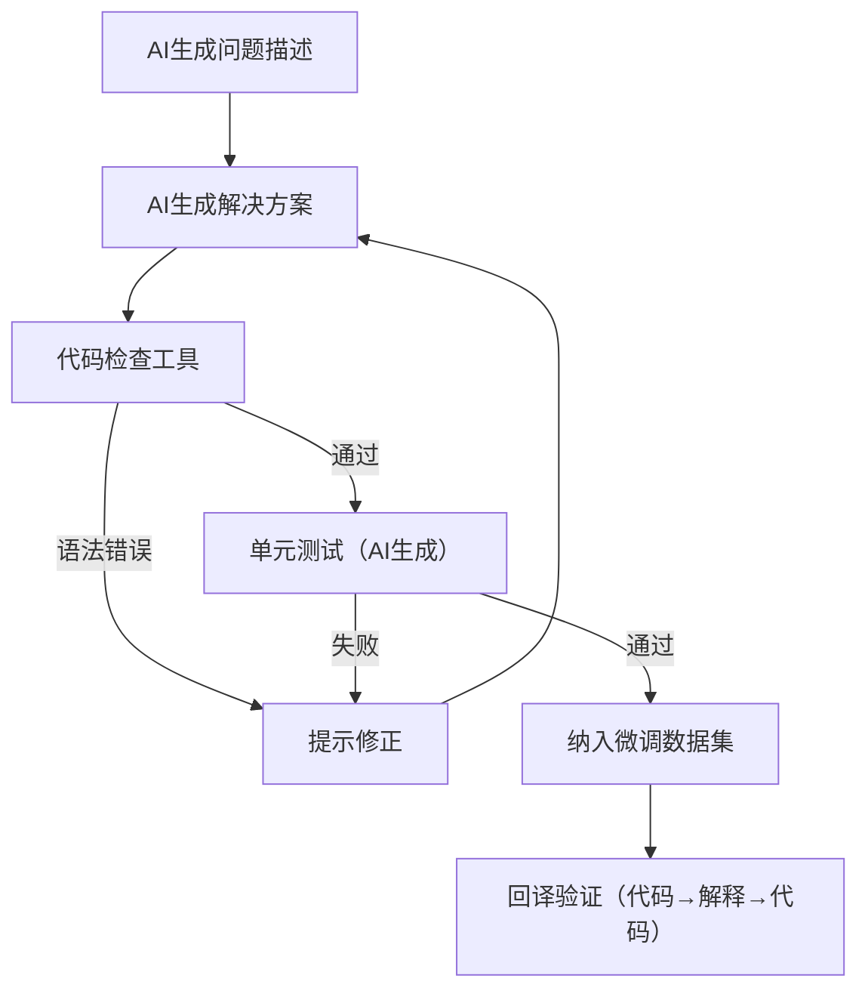

#### 数据飞轮

### 经典金句/数据
> “人工检查数据可能是机器学习领域中最被低估的高价值的活动。” ——Greg Brockman (p.413)  
> LIMA仅用1000条精心筛选的数据微调，43%的情况媲美GPT-4。(p.384)  
> Llama 3使用了270万个合成代码样本进行监督微调。(p.406)  
> 重复0.1%的数据100次，可使8亿参数模型性能降至4亿参数水平。(p.414)

---

## 第9章：推理优化

### 核心论点
**问题**：如何降低模型推理的延迟和成本？  
**观点**：推理优化可在模型层（量化、蒸馏、自回归解码改进、注意力优化）和服务层（批处理、解耦预填充/解码、缓存、并行化）进行。关键指标：TTFT、TPOT、吞吐量、MFU/MBU。

### 关键概念/事件
- **性能指标**：TTFT（首token时间）、TPOT（每token时间）、吞吐量（TPS）、有效吞吐量（满足SLO的请求）、MFU（计算利用率）、MBU（带宽利用率）。
- **模型优化**：量化（INT8/INT4）、蒸馏、推测解码（草稿模型加速）、注意力优化（KV缓存、PagedAttention、FlashAttention）。
- **服务优化**：连续批处理、预填充/解码分离、提示词缓存、并行化（张量并行、流水线并行）。
- **AI加速器**：GPU（H100）、TPU，关注FLOP/s、内存带宽、功耗。

### 逻辑推演/叙事脉络
作者首先区分推理与训练，介绍计算瓶颈（计算受限 vs 内存带宽受限）。然后定义关键性能指标（TTFT、TPOT、吞吐量、MFU）。接着分类优化技术：模型层（量化、推测解码、KV缓存优化、内核编写）和服务层（批处理、解耦预填充/解码、提示词缓存、并行化）。最后讨论硬件选型指南。

### 流程图

#### 推测解码流程
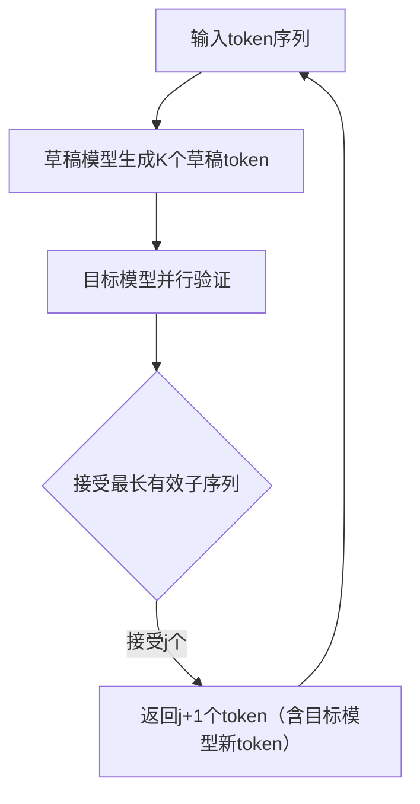

#### 连续批处理（Orca）
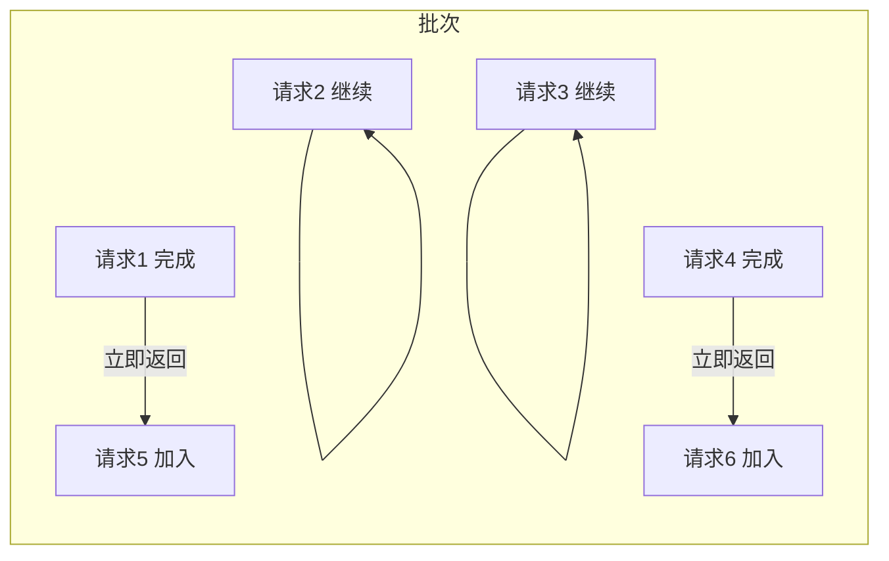

### 经典金句/数据
> “推理成本可能占机器学习总成本高达90%。” (p.433)  
> PyTorch中INT4量化+推测解码使Llama-7B吞吐量提升数倍。(p.451)  
> KV缓存可达模型权重的3倍。(p.446)  
> 提示词缓存可降低成本90%、延迟75%。(p.456)

---

## 第10章：AI工程架构与用户反馈

### 核心论点
**问题**：如何将前面所有技术整合成一个可运行、可监控、可迭代的产品？  
**观点**：成功的AI应用架构需逐步添加上下文构建、防护措施、路由器/网关、缓存、智能体模式。用户反馈（显式/隐式、自然语言）是数据飞轮的核心，但需谨慎处理偏差和恶性循环。

### 关键概念/事件
- **架构演进**：从最简单“查询→模型→响应”开始，逐步添加：上下文增强 → 防护措施（输入/输出）→ 路由器/模型网关 → 缓存 → 智能体模式（循环、写入动作）。
- **可观测性**：指标（延迟、质量、成本）、日志、追踪、漂移检测。MTTD、MTTR、CFR。
- **用户反馈类型**：显式（点赞、评分）、隐式（提前终止、重新表述、编辑、对话长度）、自然语言反馈（抱怨、修正、情绪）。
- **反馈偏差**：宽容偏差、位置偏差、近因偏差、冗长偏差。
- **恶性反馈循环**：反馈放大了初始偏差，导致模型迎合用户、固化偏见。

### 逻辑推演/叙事脉络
作者首先给出一个逐步复杂化的架构图，从简单到完整。然后分别讨论每个组件的作用和实现：上下文构建、输入/输出防护、路由器与模型网关、缓存（精确/语义）、智能体模式（循环、写入）。接着重点阐述可观测性（指标、日志、追踪、漂移检测）。最后深入用户反馈：如何从对话中提取信号（自然语言、交互行为），何时收集（初始、错误时、低置信度），如何设计（Midjourney、GitHub Copilot案例），以及反馈的局限（偏差、恶性循环）。

### 流程图

#### AI应用完整架构
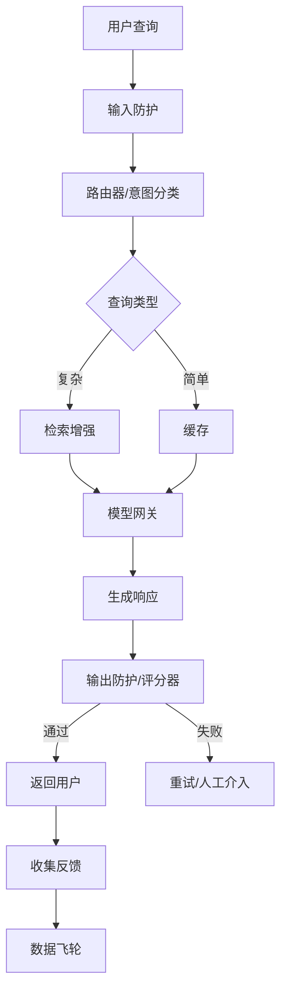

#### 从对话中提取隐式反馈
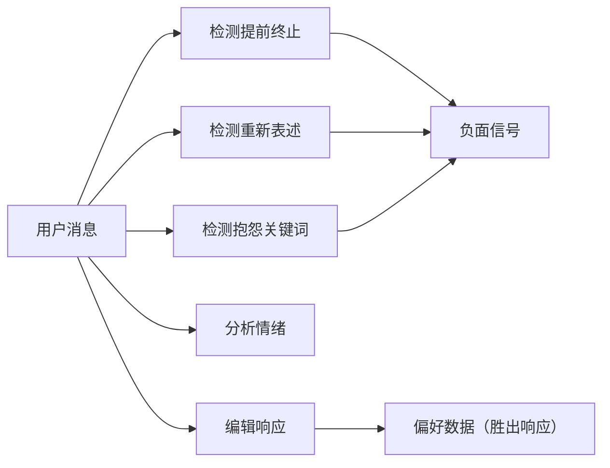

### 经典金句/数据
> “如果不这样做，拥有AI的竞争对手可能会淘汰你。” (p.51)  
> Midjourney通过用户选择“生成高分辨率”收集隐式偏好。(p.497)  
> Uber司机平均评分4.8分，低于4.6分可能被停用。(p.502)  
> 基于人类反馈训练的模型倾向于迎合用户观点。(p.504)

---

## 后记

### 核心论点
作者总结写作心路，鼓励读者动手实践，并提供了联系方式和GitHub资源。

### 经典金句
> “技术写作最难的部分并不是找到正确的答案，而是提出恰当的问题。” (p.506)  
> “AI工程面临诸多挑战，并不是所有挑战都充满乐趣，但每一个挑战都是你我成长和创造价值的机会。”

---

## 关于作者
奇普·萱（Chip Huyen）是作家、计算机科学家，专注于机器学习系统。曾任教于斯坦福大学，著有《机器学习系统设计》等多部畅销书。

---

## 封面简介
封面动物为漠林鸮（Strix butleri），一种原产于阿曼、伊朗和阿联酋的“无耳鸮”。该物种于2015年被重新分类，是相对较新的发现。

---

*本总结基于《大模型应用开发实战》（人民邮电出版社，2026年1月）整理，所有内容忠实于原文，未添加主观臆测。流程图根据书中文字描述重建。*