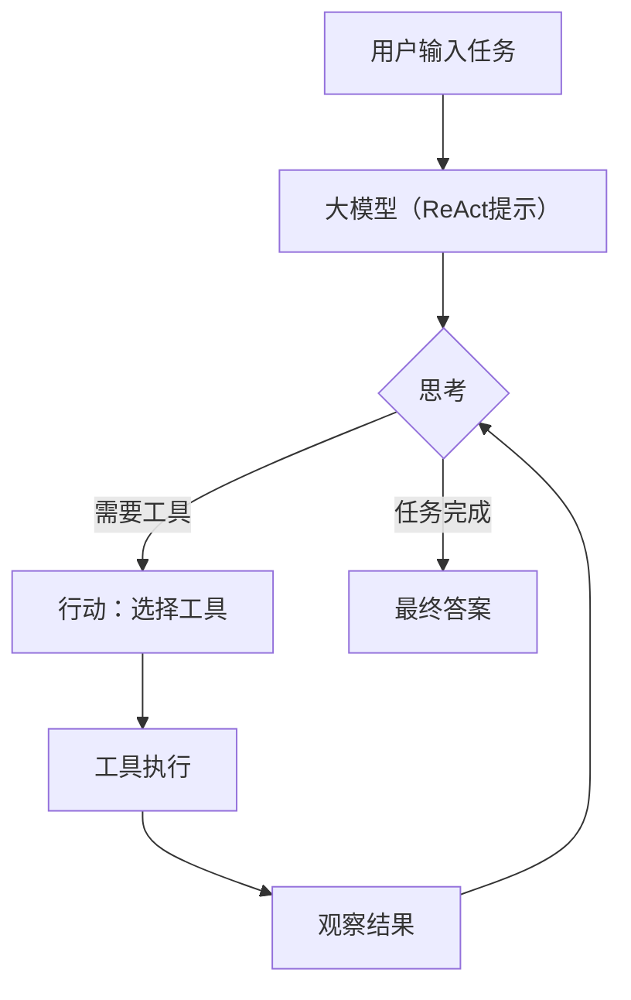
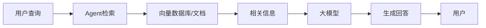
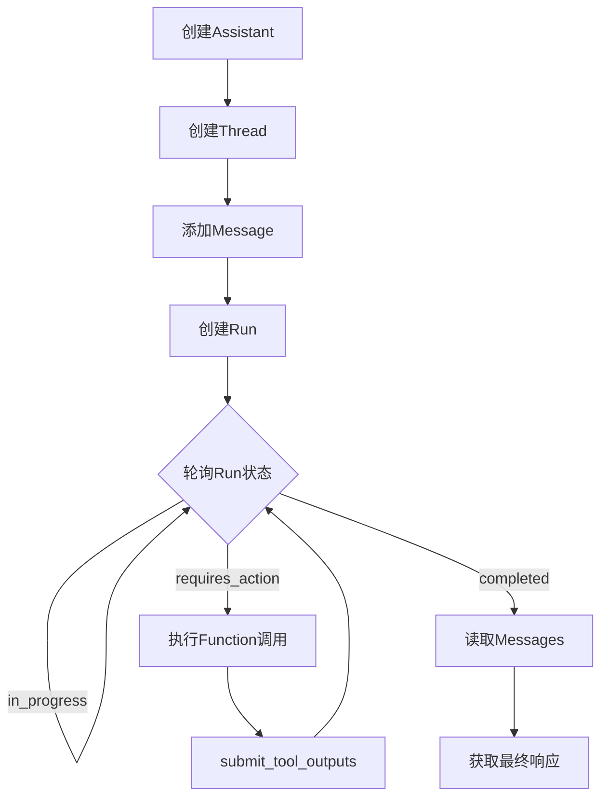
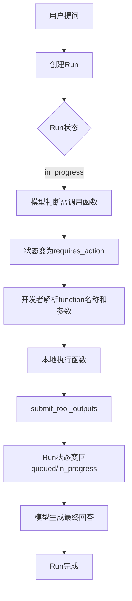
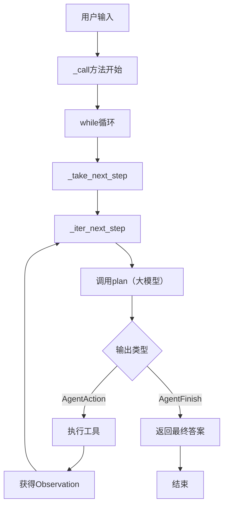

# 《大模型应用开发：动手做 AI Agent》章节总结

## 书籍信息
- **书名**：大模型应用开发：动手做 AI Agent
- **作者**：黄佳
- **出版信息**：人民邮电出版社，2024年5月第1版，2024年6月第3次印刷
- **PDF 状态**：包含第1章至第6章完整内容，第7章开始仅少量可见文本，后续章节仅有标题
- **OCR 状态**：整体识别良好，部分图表文字和代码块完整；个别页码和图像描述可能不完全

## 目录说明
- **目录识别情况**：基于原书目录（第1~10章 + 附录 + 参考文献 + 后记）进行整理。
- **章节对应依据**：正文标题与目录一致。
- **OCR 修复说明**：部分章节末尾内容不完整（第7章及以后），已标注“内容不完整”。

## 全书核心主题
本书系统介绍如何利用大模型（如GPT-4）构建自主智能体（Agent）。作者首先定义了Agent的概念及其核心要素（规划、记忆、工具、行动），强调大模型作为Agent“大脑”的通用推理能力。随后，通过7个实战案例（前6个在本书中完整呈现），演示了使用OpenAI Assistants API、LangChain、LlamaIndex等框架实现Agent的方法。核心思想是：Agent通过ReAct等认知框架进行“推理-行动”循环，调用外部工具（搜索、计算、代码解释器等）完成复杂任务，最终实现从自动化办公到智能决策的多种应用。全书贯穿“咖啡”与“小雪”的教学对话，兼顾理论深度与代码实践。

---

## 第1章：何谓Agent，为何Agent

### 核心论点
- **问题**：什么是Agent？为什么大模型出现后Agent技术有了飞跃？
- **观点**：Agent是能够感知环境、做出决策并采取行动的自主系统。大模型提供了强大的通用推理能力，成为Agent的“大脑”，使Agent从静态执行者转变为动态决策者，有望开启Life 3.0阶段。

### 关键概念/事件
- **Life 3.0**：生命发展的第三阶段，生命可以自主设计自己的软件和硬件（如AI Agent）。
- **Agent四大特性**：自主性、适应性、交互性、功能性。
- **大模型的通用推理能力**：包括知识、记忆、理解、表达、推理、反思、泛化和自我提升，是Agent智能的核心来源。
- **具身智能**：Agent具有物理形态并能与物理世界交互（如机器人）。
- **Gartner AI技术成熟度曲线**：展示AI技术从“创新触发”到“生产力高原”的周期，Agent处于期望顶峰附近。

### 逻辑推演
作者从生命进化类比出发，引出Agent作为信息处理系统的定义。通过对比大模型出现前后的Agent类型（符号Agent、反应型Agent、强化学习Agent等），指出大模型使Agent具备了以往难以实现的通用推理和环境交互能力。接着阐述大模型带来的知识、记忆、推理、泛化等能力如何赋能Agent，并以ReAct框架下的自动标题生成为例。最后分析Agent在自动办公、客户服务、个性化推荐、生产优化、医疗保健等领域的效能提升，并展望了Agent即服务、多Agent协作、自我演进AI等未来趋势。

### 经典金句/数据
> “大模型就是Agent的大脑。” (p.25)
> “Agent是一种能够感知环境、做出决策并采取行动的系统。” (p.21)
> “从L3到L4的跨越是一个从被动到自主的分水岭，在这个跨越过程中，Agent将成为关键的驱动力。” (p.6)

---

## 第2章：基于大模型的Agent技术框架

### 核心论点
- **问题**：Agent的技术架构包含哪些核心要素？ReAct框架如何实现推理与行动的协同？
- **观点**：Agent由规划、记忆、工具、执行四大要素构成。ReAct框架通过“思考-行动-观察”循环，让大模型自主调用工具，是Agent推理引擎的关键实现。

### 关键概念/事件
- **四大要素**：规划（子目标分解、思维链、自我反思）、记忆（短期/长期）、工具（搜索、计算器等）、执行（行动）。
- **ReAct框架**：Reasoning + Acting，交替生成推理轨迹和行动步骤，解决复杂任务。
- **思维链（CoT）**：引导大模型逐步推理。
- **函数调用（Function Calling）**：大模型输出结构化JSON，调用外部函数。
- **计划与执行（Plan-and-Execute）**：先规划整体步骤再执行。

### 逻辑推演
开篇引用Lilian Weng的Agent架构图，说明四大组件。然后通过KwaiAgents项目流程图展示Agent的推理流程：接收任务→更新记忆→检索记忆→任务规划→工具执行→总结。重点讲解ReAct框架：以LangChain中create_react_agent为例，演示用不到50行代码构建一个能搜索最新研究进展的Agent。详细剖析ReAct提示模板的结构（Question-Thought-Action-Observation循环），并展示AgentExecutor如何驱动循环。最后简要介绍其他认知框架（函数调用、计划与执行、自问自答、批判修正、思维树等）。

### 流程图

#### ReAct Agent工作流程

### 经典金句/数据
> “操作的序列并非硬编码在代码中，而是使用大模型来选择执行的操作序列。这凸显了大模型作为AI自主决定应用程序逻辑这个编程新范式的价值。” (p.54)
> “ReAct框架的设计哲学是：在动态和不确定的环境中，有效的决策需要持续的学习和适应，以及快速将推理转化为行动的能力。” (p.52)

---

## 第3章：OpenAI API、LangChain和LlamaIndex

### 核心论点
- **问题**：开发AI Agent的主要工具（OpenAI API、LangChain、LlamaIndex）各有什么特点？如何协作？
- **观点**：OpenAI API提供基础模型调用；LangChain“大而全”，封装多种Agent框架和工具；LlamaIndex“小而美”，专注RAG（检索增强生成）。三者互为补充。

### 关键概念/事件
- **OpenAI API**：包括GPT-4、DALL·E、Whisper等模型，支持聊天、图片生成、函数调用等。
- **LangChain**：六大模块（模型I/O、检索、Agents、链、记忆、回调），核心是通过LCEL表达式语言组合组件。
- **LlamaIndex**：专注于RAG，提供数据连接器、索引、查询引擎，支持多租户。
- **RAG（检索增强生成）**：从外部知识库检索信息，作为上下文注入大模型，提升回答准确性。
- **LangSmith**：LangChain的调试、监控平台。

### 逻辑推演
先介绍OpenAI公司历史与API调用示例（聊天、图片生成、参数说明）。接着对比LangChain的优点（多模型支持、封装ReAct、工具丰富）和注意事项（复杂度高、版本迭代快）。通过LCEL示例展示链式调用。然后介绍LlamaIndex及其RAG实现：加载本地文档→建立向量索引→查询引擎→回答问题。最后总结三者关系：既竞争又合作，开发者可根据场景选择。

### 流程图

#### RAG实现流程

### 经典金句/数据
> “LangChain是一个开源框架，目标是将大模型与外部数据连接起来。” (p.85)
> “LlamaIndex并不是那么‘大’而‘全’，而是特别关注如何开发先进的基于AI的RAG技术。” (p.95)
> “RAG克服了直接微调模型的3个缺点——成本高、信息更新困难以及缺乏可观察性。” (p.95)

---

## 第4章：Agent 1: 自动化办公的实现——通过Assistants API和DALL·E 3模型创作PPT

### 核心论点
- **问题**：如何利用OpenAI Assistants API和DALL·E 3自动生成包含数据分析图表和图片的PPT？
- **观点**：通过创建数据科学助理助手，授予其代码解释器工具，可以自动完成数据加载、分析、可视化、生成洞察和图片，并最终组装成PPT，实现办公自动化。

### 关键概念/事件
- **Assistants API**：包含创建助手(Assistant)、线程(Thread)、消息(Message)、运行(Run)四个核心对象。
- **代码解释器(Code Interpreter)**：助手内置工具，可编写和执行Python代码进行数据分析。
- **Run状态机**：queued → in_progress → requires_action → completed/expired等状态。
- **DALL·E 3**：用于生成高质量图片。

### 逻辑推演
先介绍Assistants API的基本概念和Playground体验。然后详细讲解API调用流程：创建助手（配置instructions、tools、文件）→ 创建线程 → 添加用户消息 → 创建Run并轮询状态 → 获取响应。在实战部分，上传图书销售CSV文件，要求助手计算季度销售额并绘制折线图（红蓝绿线条），助手自动完成并返回图片。接着让助手根据图表生成数据洞察和PPT标题。最后调用DALL·E 3生成封面图，并使用python-pptx模板将图表、标题、图片组合成两份PPT，输出pptx文件。

### 流程图

#### Assistants API调用流程

### 经典金句/数据
> “从头到尾都不需要人为干预。” (p.102)
> “助手在得出最终提示之前还经历了多轮思考，如转换编码、转换日期类型等……这证明了助手具有自适应性。” (p.129)

---

## 第5章：Agent 2: 多功能选择的引擎——通过Function Calling调用函数

### 核心论点
- **问题**：如何让Agent根据用户意图自主选择并调用外部函数？
- **观点**：通过Function Calling（或Tool Calls），大模型可以输出结构化的JSON来描述需要调用的函数及其参数，开发者据此执行本地函数并将结果返回给模型，从而让Agent具备使用任意工具的能力。

### 关键概念/事件
- **Function Calling**：大模型根据提示和函数定义（JSON Schema）决定是否需要调用函数，并生成调用参数。
- **Functions（元数据）**：对函数的名称、描述、参数类型和必填项的声明，不是函数实现代码。
- **Run状态 requires_action**：当助手需要调用函数时进入此状态，等待开发者提交函数执行结果。
- **submit_tool_outputs**：提交函数输出后Run继续执行。
- **ChatCompletion API中的Tool Calls**：与Assistants API类似，但通过messages数组传递工具调用结果。

### 逻辑推演
首先澄清Functions与Function Calling的区别：Functions是描述，Function Calling是生成结构化调用的过程。在Playground中演示自定义“鼓励函数”的JSON Schema。然后通过Assistants API完整实现：创建带Function的助手 → 创建线程 → 发送“安慰伤心的小雪”消息 → Run进入requires_action → 解析function_name和arguments → 本地执行get_encouragement函数 → submit_tool_outputs → Run继续并完成 → 获取最终鼓励语。最后演示通过ChatCompletion API实现多工具并行调用（查询三个城市的鲜花库存），展示如何处理多个tool_calls并再次请求模型整合答案。

### 流程图

#### Function Calling完整流程（Assistants API）

### 经典金句/数据
> “大模型可以智能地输出一个包含用于调用一个或多个函数的参数的JSON对象。” (p.142)
> “助手所做的就是把人类的对话转换成函数能够读取的input参数。” (p.158)
> “无论是远古的人类还是现代的AI，工具的使用和选择都是智能的关键表现。” (p.172)

---

## 第6章：Agent3：推理与行动的协同——通过LangChain中的ReAct框架实现自动定价

### 核心论点
- **问题**：LangChain如何封装ReAct框架？AgentExecutor如何驱动“思考-行动-观察”循环？
- **观点**：通过ReAct提示模板，LangChain的Agent可以自主决定调用搜索工具获取市场价格，再调用计算工具进行数学运算，最终完成定价任务。AgentExecutor内部通过plan → action → observation循环迭代，直到得到最终答案。

### 关键概念/事件
- **LangChain Agent**：由大模型、提示、工具、AgentExecutor组成。
- **工具和工具包**：如SerpAPI（Google搜索）、llm-math（计算器）。
- **AgentExecutor**：负责执行循环，调用大模型的plan方法，解析输出为AgentAction或AgentFinish，然后调用工具并观察结果。
- **调试方法**：设置断点，深入LangChain源码观察_iter_next_step、_perform_agent_action等关键方法。

### 逻辑推演
复习ReAct框架后，构建一个鲜花定价Agent：需要搜索玫瑰花当前进货价格，然后加价5%计算出售价。使用SerpAPI和llm-math工具，自定义中文ReAct提示。运行后Agent输出思考轨迹：先搜索价格，获得一段包含价格信息的文本，然后选择计算器工具输入“25*1.05”，得到26.25，最后给出中文答案。随后通过VS Code调试深入AgentExecutor内部，逐步展示第一轮思考（模型决定搜索）→ 第一轮行动（工具执行搜索）→ 第二轮思考（模型决定计算）→ 第二轮行动（工具执行计算）→ 第三轮思考（模型完成任务）。每次plan调用都依赖ReAct提示模板。

### 流程图

#### AgentExecutor内部循环

### 经典金句/数据
> “通过对ReAct框架进行完美封装和实现，LangChain可以赋予大模型极大的自主性。” (p.176)
> “大模型经常需要自主判断下一步的行动。如果不施加额外的引导，大模型则可能无法自主判断下一步的行动。” (p.176)

---

## 第7章：Agent4：计划和执行的解耦——通过LangChain中的Plan-and-Execute实现智能调度库存

> **说明**：该部分PDF内容不完整，仅包含章节标题和开头段落，以下基于可见文本整理。

### 核心论点（基于标题和少量引导）
- **问题**：如何让Agent先制定完整计划再执行，而非每次只决定下一步？
- **观点**：Plan-and-Execute策略将任务规划与执行解耦，先由大模型生成多步计划，然后逐步执行，适合复杂物流、库存调度等场景。

### 可见内容摘要
- 介绍Plan-and-Solve策略的提出（可能参考论文）。
- LangChain中的Plan-and-Execute Agent的实现方式。
- 示例：通过Plan-and-Execute Agent实现物流管理（定义库存调度工具、尝试“不可能完成的任务”等）。

> 由于内容缺失，无法提供完整逻辑推演、流程图和金句。

---

## 第8章至第10章及附录

> **说明**：后续章节（第8章 Agent5、第9章 Agent6、第10章 Agent7、附录、参考文献、后记）在提供的PDF文本中仅有标题或极少片段，未包含实质性正文。因此无法按规范总结。建议获取完整PDF后再进行补充。

---

## 附录/后记

（原书附录包含Agent综述论文、自主学习、多Agent合作等主题；后记讨论创新与变革。因内容缺失，暂略。）

---

**结束**