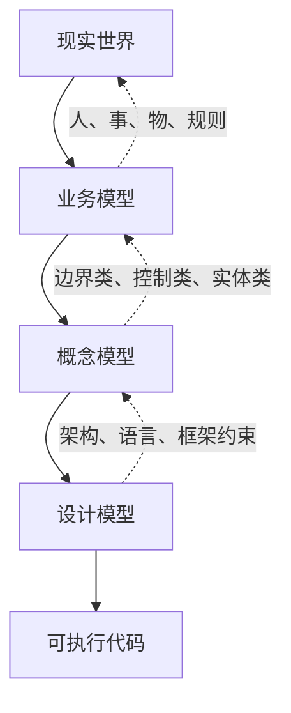
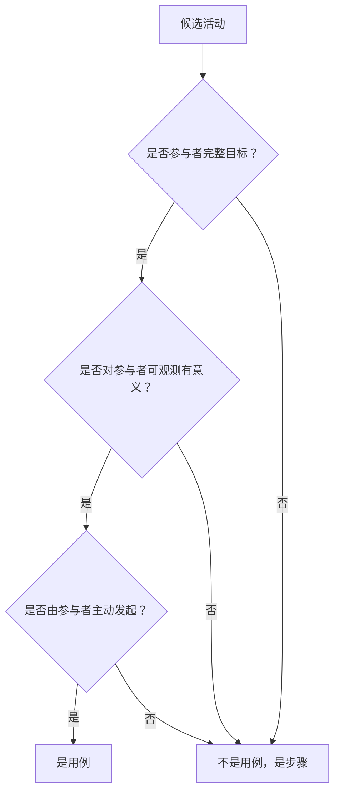
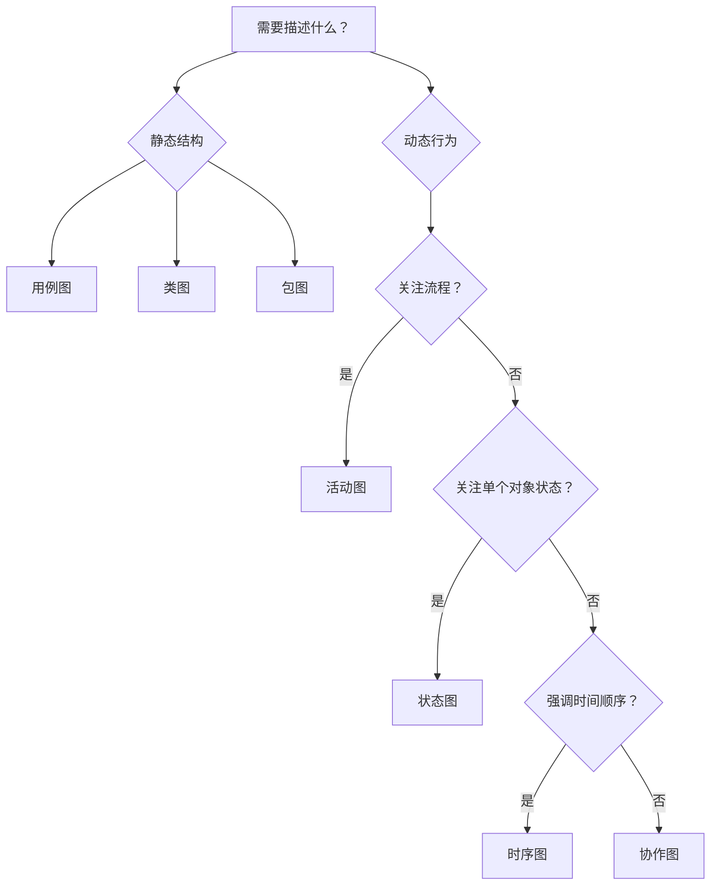
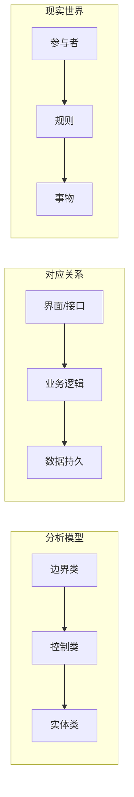
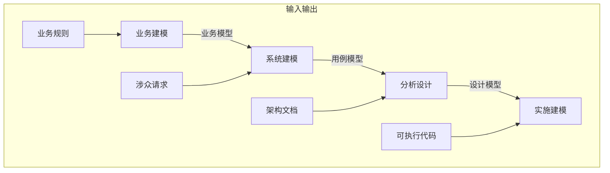
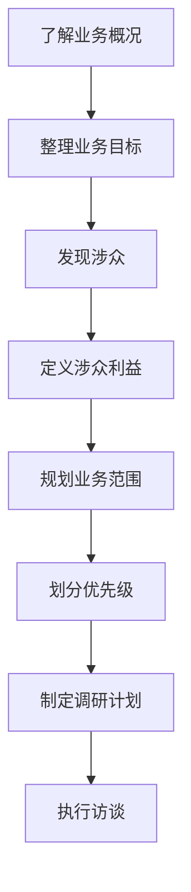
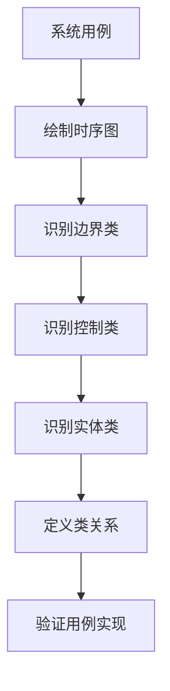
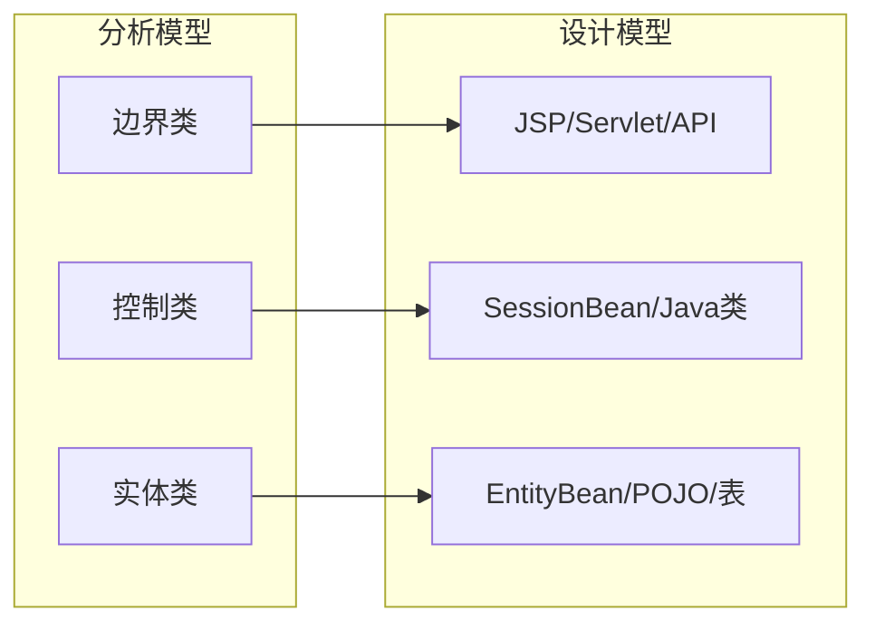
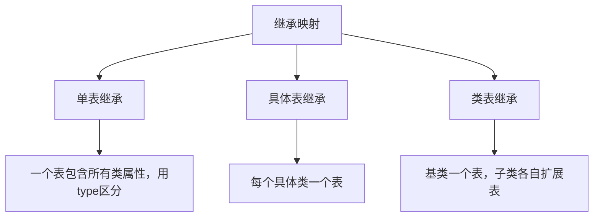
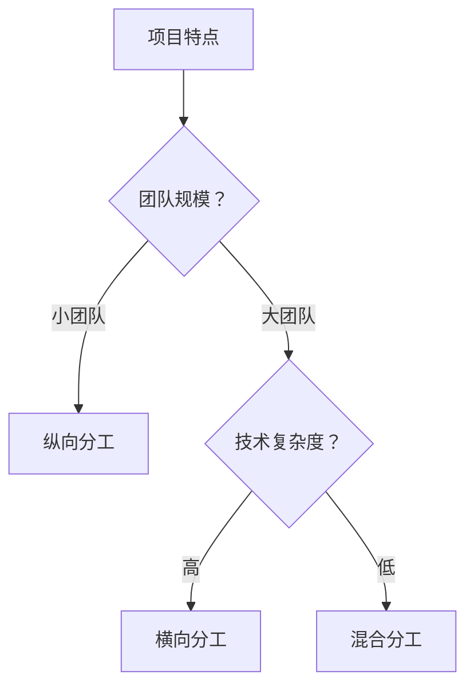

# 《大象：Thinking in UML（第二版）》章节总结

## 书籍信息
- **书名：** 大象：Thinking in UML（第二版）
- **作者：** 谭云杰
- **出版信息：** 中国水利水电出版社，2012年3月第2版
- **PDF 状态：** 可识别，含完整目录及正文
- **OCR 状态：** 文字可提取，部分图表需重建

## 目录说明
- **目录识别情况：** 完整识别，共四部分19章
- **章节对应依据：** 基于PDF书签及正文标题
- **OCR 修复说明：** 部分图表描述性文字转化为Mermaid流程图

## 全书核心主题

本书以UML为载体，将面向对象的分析设计思想融入建模过程。作者认为，UML不仅仅是符号，更是面向对象思想和方法的具体化。全书核心在于解决从需求到代码的映射问题，强调“Thinking”比“UML”本身更重要。

作者提出了从现实世界到业务模型、概念模型、设计模型的转化路径，解决面向对象“如何抽象、如何验证、如何追溯”的三大困难。核心论点包括：用例驱动开发、以架构为中心、迭代式生命周期。

---

## 第一部分：你需要了解

### 第1章：为什么需要UML

#### 核心论点

**问题：** 面向对象方法虽然优越，但面临“如何从现实世界映射到对象世界、如何验证对象行为、如何追溯设计到需求”的困难。

**观点：** UML提供了从业务模型到概念模型再到设计模型的三阶段转化方法，架起现实世界与对象世界之间的桥梁。

#### 关键概念

- **面向过程 vs 面向对象：** 面向过程将世界视为紧密关联的过程链；面向对象将世界视为独立对象在特定条件下交互的结果。
- **UML（统一建模语言）：** 一种用于描述软件系统的标准化可视化语言。
- **用例驱动：** 以用例（参与者目标）作为整个开发过程的主线。
- **业务模型 → 概念模型 → 设计模型：** 从现实世界到可执行代码的三阶段转化路径。

#### 逻辑推演

作者从面向过程的困难入手，指出过程化方法无法应对“随需应变”的复杂业务。随后阐述面向对象的优势——独立性、封装、复用、抽象层次。但面向对象也有困难：对象如何抽象？如何验证？如何从需求推导设计？

UML通过三个模型解决：业务模型（现实世界映射）、概念模型（计算机视角抽象）、设计模型（代码实现）。用例作为驱动核心，贯穿始终。

#### 方法流程图

#### 经典金句

> “如果把世界看作一个紧密关联的系统，面向过程是合适的；但世界太复杂，只能放弃对过程的全面了解，转而寻找可控制的小单元——这就是面向对象。” (p.22)

> “UML只是语言，真正的灵魂是软件工程。掌握了软件过程，才知道为什么要有用例，为什么要有分析模型。” (p.42)

---

### 第2章：建模基础

#### 核心论点

**问题：** 建模到底要建什么？怎么建？

**观点：** 建模 = 确定抽象角度 + 模拟场景。核心公式：问题领域 = 所有抽象角度的总和，抽象角度 = 参与者的业务目标（用例）。

#### 关键概念

- **建模公式：** 问题领域 = 所有抽象角度的总和；抽象角度 = 参与者业务目标（用例）；用例 = 特定场景的集合；场景 = 静态事物 + 特定条件 + 特定动作。
- **用例驱动：** 一旦所有用例被实现，问题领域就被解决。
- **抽象层次：** 层次越高信息越少但概括能力越强；分析时应自顶向下逐步细化。
- **视图与视角：** 视图展示事物不同方面；视角是观察者审视信息的角度。

#### 逻辑推演

建模包含“怎么建”（方法论）和“模是什么”（内容）。作者提出建模公式：问题领域由多个抽象角度构成，每个抽象角度对应参与者业务目标（用例），每个用例由多个特定场景构成。场景又由静态事物、条件、动作组成——即“人、事、物、规则”。

用例驱动意味着开发过程以实现用例为目标。抽象层次帮助管理复杂度：先高层概览，再逐层细化。视图和视角则确保不同干系人看到合适的信息。

#### 经典金句

> “面向对象希望你通过抽象角度把事物分解成小块，问题就变得简单化。” (p.48)

> “用例驱动：一旦用例实现了，问题领域就解决了。” (p.50)

---

## 第二部分：在学习中思考

### 第3章：UML核心元素

#### 核心论点

**问题：** UML中最核心的建模元素是什么？如何正确使用？

**观点：** 参与者、用例、边界、业务实体、分析类（边界/控制/实体）、设计类、组件、节点是UML核心元素，每个都有特定语义和使用场景。

#### 关键概念

- **参与者（Actor）：** 系统之外与系统交互的人或事物，必须是主动发起者。
- **用例（Use Case）：** 参与者与系统交互并获得可观测结果的活动集合，必须是完整目标。
- **边界（Boundary）：** 决定视界和抽象层次；边界变化导致参与者和用例变化。
- **分析类：** 边界类（界面/接口）、控制类（业务逻辑）、实体类（数据）。
- **关系：** 关联、依赖、扩展、包含、实现、精化、泛化、聚合、组合。

#### 逻辑推演

作者逐一讲解核心元素。参与者是起点，但注意区分“业务主角”（边界外）和“业务工人”（边界内）。用例是难点：必须区分“目标”与“步骤”、把握粒度、避免与“功能”混淆。

边界是无形但关键的，边界决定看到什么。分析类是作者特别推崇的：边界类、控制类、实体类对应MVC模式，是高层次抽象的好工具。设计类则更接近代码。关系定义了对象之间的连接方式。

#### 用例粒度判断流程图

#### 经典金句

> “用例不是功能。功能描述的是‘输入→计算→输出’，用例描述的是‘谁在什么情况下通过什么方式做什么获得什么结果’。” (p.77)

> “边界决定了视界。边界可大可小，由建模者主观臆定——高手和俗手的差别或许就在‘心中有边界’。” (p.91)

---

### 第4章：UML核心视图

#### 核心论点

**问题：** UML有哪些视图？分别在什么场景使用？

**观点：** UML视图分为静态视图（用例图、类图、包图）和动态视图（活动图、状态图、时序图、协作图），分别描述系统的结构和行为。

#### 关键概念

- **用例图：** 展示参与者和用例，分业务用例视图、概念用例视图、系统用例视图等。
- **类图：** 分概念层、说明层、实现层，对应业务建模、概念建模、设计建模。
- **活动图：** 描述业务流程或对象交互，可配合泳道表示职责。
- **状态图：** 描述单个对象生命周期内的状态变迁。
- **时序图：** 强调时间顺序的对象交互。
- **协作图：** 强调对象结构关系的交互。

#### 逻辑推演

静态视图回答“系统是什么样子”，动态视图回答“系统怎么运行”。用例图是需求入口；类图随抽象层次变化有三种形态；活动图虽然有“过程化”嫌疑，但对描述用例场景很实用；状态图适合复杂对象；时序图和协作图可互相转换，分别强调时间和结构。

#### 视图选择决策图

#### 经典金句

> “一个模型提出了论点，静态图是论据，动态图则是论证。” (p.141)

> “活动图是面向过程的，用它画面向对象交互图会格格不入。但它在描述用例场景时非常有效。” (p.126)

---

### 第5章：UML核心模型

#### 核心论点

**问题：** 软件开发各阶段需要建立哪些模型？

**观点：** 包括业务用例模型、概念用例模型、系统用例模型、领域模型、分析模型、设计模型、组件模型、实施模型。模型由软件过程决定，不是每个项目都要全部使用。

#### 关键概念

- **业务用例模型：** 描述客户现有业务，与计算机无关。
- **概念用例模型：** 从业务用例中抽象关键概念，过渡到系统用例。
- **系统用例模型：** 即需求，定义系统开发范围。
- **领域模型：** 高于特定场景的抽象，揭示业务“本质”。
- **分析模型：** 使用分析类（边界/控制/实体）实现用例，是作者推崇的核心。
- **软件架构与框架：** 架构是“战略”，框架是“战术”。

#### 逻辑推演

作者按开发顺序讲解模型。业务用例模型理解业务；概念用例模型抽关键概念（可选但推荐）；系统用例模型定需求范围；领域模型深入业务本质；分析模型是作者最爱——用MVC模式实现用例，高抽象、易维护；设计模型更接近代码；组件模型支持构件化；实施模型描述物理部署。

作者特别强调：分析模型比设计模型更重要，维护成本更低，更能保持与需求同步。

#### 分析模型核心结构图

#### 经典金句

> “分析类代表系统中主要的‘职责簇’，是系统必须处理的主要抽象概念的‘第一个关口’。” (p.98)

> “架构是战略性的，框架是战术性的。架构描述部署、战略目标、指挥系统；框架描述组织、建设、作战方案。” (p.166)

---

### 第6章：统一过程核心工作流简介

#### 核心论点

**问题：** 在统一过程中，UML模型如何应用到各阶段？

**观点：** 统一过程定义了业务建模、系统建模、分析设计、实施建模四大工作流，每个工作流有明确的活动、角色和工件。

#### 关键概念

- **业务建模工作流：** 了解目标组织结构和机制，导出系统需求。
- **系统建模工作流：** 即需求过程，定义系统边界和功能。
- **分析设计工作流：** 将需求转化为实现方案。
- **实施建模工作流：** 描述代码的物理部署。
- **工件集：** 每个工作流产生的文档和模型。

#### 逻辑推演

统一过程将软件生产分为四个阶段（先启、精化、构建、产品化）和九个核心工作流。本章重点介绍使用UML最多的四个工作流。

业务建模在前，理解业务后再做系统建模。分析设计是核心，定义架构、分析行为、设计组件。实施模型描述物理部署。每个工作流都有明确输入输出。

#### 核心工作流关系图

#### 经典金句

> “UML不一定非要使用统一过程，但统一过程是对UML使用最为精深的方法。” (p.184)

> “业务建模的作用是建立客户和开发人员之间的共识——业务范围不等于系统范围。” (p.189)

---

### 第7章：迭代式软件生命周期

> 说明：该部分PDF识别不完整，以下内容基于可见文本整理。

#### 核心论点

**问题：** 软件为何不能一次成型？

**观点：** 统一过程采用演进式生命周期，通过多次迭代逐步逼近目标，而非瀑布式的“一次通过”。

#### 关键概念

- **迭代：** 每次迭代完成一部分功能，产出可执行版本。
- **演进式：** 系统在迭代中逐步完善和扩展。
- **风险驱动：** 每次迭代优先处理高风险项。

#### 逻辑推演

瀑布模型假设需求一开始就完整明确，但现实需求不断变化。迭代式方法将项目分为多个小循环，每次迭代都包含需求、分析、设计、实现、测试，产出可运行版本。用户可提前反馈，风险更早暴露。

---

## 第三部分：在实践中思考

### 第8章：准备工作

#### 核心论点

**问题：** 项目开始前需要做什么准备？

**观点：** 了解问题领域、做好涉众分析、规划业务范围、整理思路、掌握访谈技巧是准备工作五项核心。

#### 关键概念

- **涉众（Stakeholder）：** 与系统有利益关系的一切人和事。
- **涉众分析报告：** 列出所有涉众及其利益诉求。
- **业务范围 vs 系统范围：** 业务范围是客户实际业务，系统范围是计算机实现的部分。
- **需求层次：** 业务目标、业务需求、用户需求、系统需求。

#### 逻辑推演

准备工作决定需求调研成败。先了解业务概况和业务目标；再发现涉众、定义涉众、分析涉众期望；规划业务目标与涉众期望的对应关系；划分优先级、规划需求层次、制定调研计划。最后，访谈技巧是关键——不要引导客户说“是”，而要引导客户说“做什么”。

#### 需求调研准备流程图

#### 经典金句

> “涉众不一定是参与者。参与者是涉众代表，对系统提出要求来获得他所代表的涉众的利益。” (p.69)

---

### 第9章：获取需求

#### 核心论点

**问题：** 如何系统化地获取需求？

**观点：** 通过定义边界、发现主角、获取业务用例、业务建模、领域建模、提炼业务规则、获取非功能性需求七步完成需求获取。

#### 关键概念

- **定义边界：** 边界决定看到什么，也决定什么被排除。
- **发现主角：** 边界外、主动发起、有完整目标的人或事物。
- **业务用例：** 业务主角在业务中的完整目标。
- **领域模型：** 高于特定场景，揭示业务本质。
- **业务规则：** 业务必须遵守的法律法规、惯例、规定。
- **非功能性需求：** 可用性、可靠性、性能、可支持性等。

#### 逻辑推演

作者用大量“现在行动”示例，手把手演示如何定义边界（从混沌到清晰）、发现主角（女娲造人）、获取业务用例（炎黄之治）、建立业务模型（商鞅变法）、领域建模（风火水土）、提炼业务规则（牛顿的思考）、获取非功能性需求（非物质需求）。

#### 需求获取七步法

#### 经典金句

> “业务建模时不要考虑计算机。客户有没有计算机业务都客观存在，业务范围不等于系统范围。” (p.67)

> “领域模型研究的不是特定场景，而是高于特定场景的一般规律，揭示业务运行的‘本质’和‘核心’。” (p.158)

---

### 第10章：需求分析

#### 核心论点

**问题：** 获取需求后如何分析？

**观点：** 关键概念分析（建立概念模型）、业务架构设计、系统原型制作是需求分析三核心。

#### 关键概念

- **概念模型：** 从业务模型中抽象关键概念，过渡到系统设计。
- **业务架构：** 描述业务主要领域及其组织结构关系。
- **系统原型：** 验证需求理解和架构设计的可执行模型。

#### 逻辑推演

需求分析不是简单整理，而是“找到撬动地球的支点”——关键概念。建立概念模型后，设计业务架构（商业模式视图），最后制作系统原型验证。原型可以是界面原型，也可以是可执行原型。

---

### 第11章：系统分析

#### 核心论点

**问题：** 如何从需求分析过渡到系统分析？

**观点：** 确定系统用例、分析业务规则、用例实现、设计软件架构、建立分析模型、组件模型、部署模型。

#### 关键概念

- **系统用例：** 从业务用例推导，考虑计算机环境。
- **用例实现：** 用分析类（边界/控制/实体）实现用例场景。
- **软件架构：** 业务架构 + 计算机环境，分广度视角（层次）和深度视角（详细）。
- **分析模型：** 用分析类实现所有用例，是系统原型。

#### 逻辑推演

系统分析是“绘制蓝图”阶段。先确定系统用例（从业务用例推导），分析业务规则（用伪代码或状态机），然后用分析类实现用例（时序图+协作图）。设计软件架构（层次+实现细节），建立分析模型（MVC模式），最后设计组件和实施模型。

#### 分析模型实现用例流程

#### 经典金句

> “分析模型是MVC模式的经典应用：边界类（视图）、控制类（控制器）、实体类（模型）。” (p.161)

> “分析模型维护成本远低于设计模型。用分析模型保持与需求同步，用架构和框架约束实现，足矣。” (p.165)

---

### 第12章：系统设计

#### 核心论点

**问题：** 系统分析和系统设计有何差别？

**观点：** 分析关注“做什么”，设计关注“怎么做”。设计模型从分析模型映射而来，还需接口设计、包设计、数据库设计。

#### 关键概念

- **分析 vs 设计：** 分析用分析类（高抽象），设计用设计类（低抽象，考虑语言/框架）。
- **设计模型：** 从分析模型映射，受架构、框架、语言、规范约束。
- **接口设计：** 定义组件间通信契约。
- **包设计：** 高内聚、低耦合。

#### 逻辑推演

作者明确区别：分析是“做什么”（业务逻辑），设计是“怎么做”（技术实现）。设计模型从分析模型映射：边界类→界面/接口、控制类→业务逻辑实现、实体类→数据库表/持久化类。

接口设计定义内外交互契约。包设计遵循“高内聚、低耦合”原则。数据库设计单独在第13章详述。

#### 分析类到设计类映射图

#### 经典金句

> “好的分包具有高内聚、低耦合的性质。包之间的依赖关系应当是单向的，尽量避免双向依赖和循环依赖。” (p.96)

---

### 第13章：数据库设计

#### 核心论点

**问题：** 面向对象与关系模型如何调和？

**观点：** 通过OR-Mapping（对象-关系映射）策略，在面向对象和关系模型之间寻求平衡。

#### 关键概念

- **关公战秦琼：** 面向对象（封装、继承、多态）与关系模型（表、行、列、主外键）的本质差异。
- **OR-Mapping：** 对象到关系数据库的映射方案。
- **平衡策略：** 根据项目特点在纯对象和纯关系之间选择合适位置。

#### 逻辑推演

作者承认面向对象和关系模型是“两种世界观”——对象强调行为和数据一体，关系强调数据独立。解决方案是OR-Mapping：将对象映射到表，将继承映射为多种表结构（单表、具体表、类表）。作者还讨论了数据库设计的重要程度：不是所有项目都需要复杂数据库设计。

#### OR-Mapping继承映射策略

#### 经典金句

> “面向对象与关系模型之争，本质是‘行为+数据’与‘纯数据’两种世界观的差异。” (p.414)

---

### 第14章：开发

#### 核心论点

**问题：** 如何从模型生成代码？团队如何分工？

**观点：** 生成代码（正向/逆向工程）、选择分工策略（纵向/横向）是开发阶段核心。

#### 关键概念

- **正向工程：** 从模型生成代码框架。
- **逆向工程：** 从代码反向生成模型。
- **纵向分工：** 按功能模块分工，一个开发人员负责完整功能栈。
- **横向分工：** 按技术层次分工（如前端、后端、数据库）。

#### 逻辑推演

许多UML工具支持从类图生成代码框架（正向工程），也支持从代码更新模型（逆向工程）。分工策略方面，纵向分工适合小型项目、全栈开发者；横向分工适合大型项目、专业化团队。选择取决于团队技能、项目规模和架构复杂度。

#### 分工策略决策图

---

## 第四部分：在提炼中思考

### 第15-19章：高级主题

> 说明：第四部分PDF识别不完整，以下内容基于目录和可见文本整理。

#### 第15章：用例驱动与领域驱动

作者澄清“用例驱动”（UDD）与“领域驱动”（DDD）的区别：UDD由表及里，从场景到抽象；DDD由内而外，先建领域模型再实现。两者各有适用场景，不是对立而是互补。

#### 第16章：面向对象数据库设计

深入讨论面向对象数据库与关系数据库的选择。OO数据库更自然映射对象，但关系数据库更成熟、标准更统一。

#### 第17-18章：（未完整识别）

包含业务流程管理、企业应用集成等高级话题。

#### 经典金句

> “本书中的领域模型与《领域驱动设计》中的领域模型定义和用途不同。本书是实用主义，由招式而内功；DDD是理想主义，由内功而招式。” (p.157)

---

## 附录

### 免费下载资源使用说明

本书提供配套资源：
- **图例：** 所有彩色插图
- **建模示例Rose版：** 全书实例的Rose源文件（需RationalRose 2002+）
- **建模示例HTML版：** 无需Rose，浏览器即可阅读
- **Java虚拟机：** HTML版阅读所需
- **OO系统分析员之路：** 作者博客文章合集

下载地址：http://www.waterpub.com.cn/softdown/ 或 http://www.wsbookshow.com

作者博客：http://blog.csdn.net/coffeewoo 或 http://coffeewoo.itpub.net
作者邮箱：coffeewoo@gmail.com

---

## 全书总结

《大象：Thinking in UML》不是一本简单的UML语法书，而是一本“悟道”之书。作者的核心贡献在于：

1. **提出建模公式**：问题领域 = 所有抽象角度（用例）的总和
2. **解决三大困难**：如何抽象、如何验证、如何追溯
3. **推崇分析模型**：用边界类、控制类、实体类实现MVC模式，作为需求与实现之间的桥梁
4. **强调软件过程**：UML只是语言，真正的灵魂是软件工程

适合读者：正在学习编程的学生、向设计师/分析员转型的程序员、期望提升的分析设计人员。学习关键在于“多实践、多思考、再回头温习”。