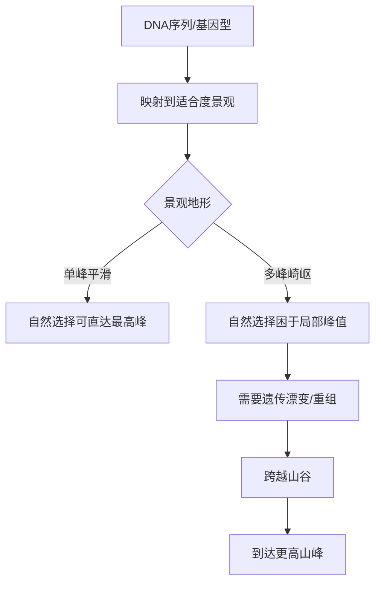
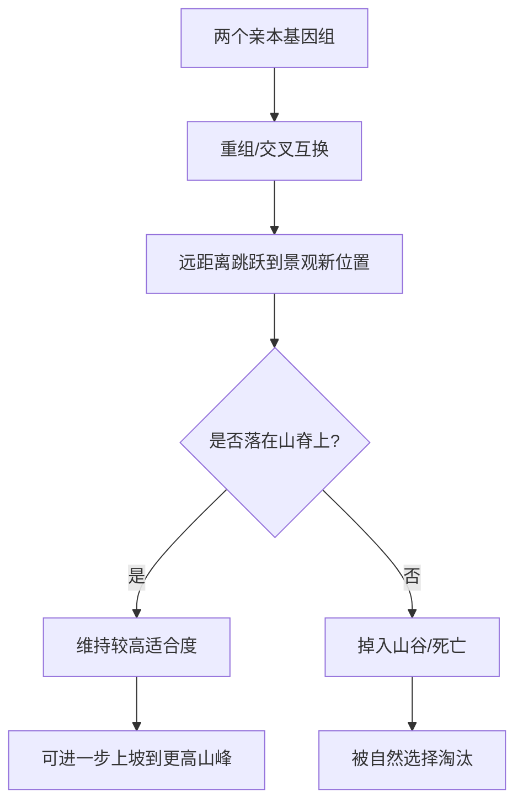
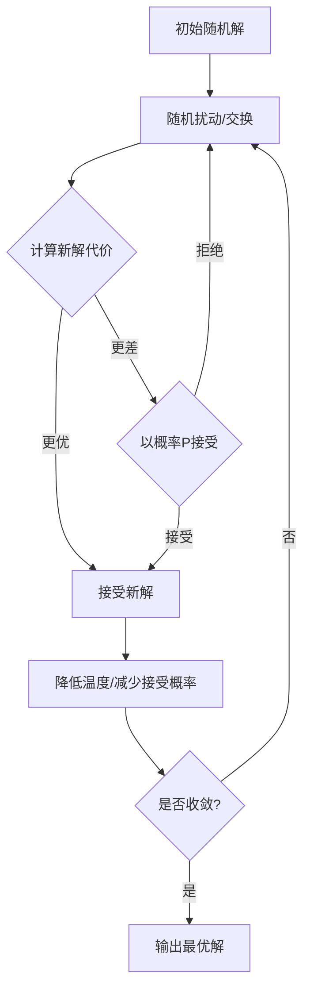

# 《如何解决复杂问题》章节总结

## 书籍信息
- 书名：如何解决复杂问题
- 作者：安德烈亚斯·瓦格纳 (Andreas Wagner)
- PDF 状态：可识别文本，存在部分页码错位但内容完整
- OCR 状态：可读，部分页码标注略有跳跃，但不影响内容提取

## 目录说明
- 目录识别情况：完整识别，包括前言、四大部分（第一部分第1-4章，第二部分第5-9章）、后记、注释、延伸阅读等。
- 章节对应依据：严格按照书中章节标题与页码顺序整理。
- OCR 修复说明：个别页面底部注释被截断，但不影响主体内容理解。

## 全书核心主题
本书的核心观点是：**生物进化中的三大力量——自然选择、遗传漂变和基因重组——为解决复杂问题提供了可迁移的创造性方法论。** 作者提出“景观思维”：任何复杂问题的所有可能解决方案构成一个多维景观，其中最优解位于高峰（或深谷）。自然选择像一味上坡的贪婪算法，容易陷入局部最优；而遗传漂变（类似于热振动）和基因重组（类似于远距离联想）能帮助探索者穿越山谷，找到全局最优。这一思维框架不仅适用于生物学，还可用于计算机算法、人类创造力、教育、组织管理和国家创新政策。

---

## 前言：景观思维：关于创造力的新科学

### 核心论点
- 问题：什么是创造力？如何理解自然与人类的创造性？
- 作者观点：创造力可以被定义为“针对某一问题的独特且适切的方法”。生命诞生之前，大自然就已通过晶体、分子自组装等展示了创造力；生命诞生后，进化通过适合度景观实现创造性解决方案。景观思维是将生物进化、分子自组装、计算机算法和人类创新统一起来的关键。

### 关键概念
- **适合度景观 (Fitness Landscape)**：由哈佛大学遗传学家休厄尔·赖特提出。将生物体的基因型（或性状）映射到二维或多维空间，景观高度代表适合度（生存繁殖能力）。山峰代表最优解。
- **自然选择的缺陷**：自然选择只允许“上坡”变异，无法跨越山谷去往更高的山峰，容易陷入局部最优。
- **遗传漂变 (Genetic Drift)**：小种群中基因频率的随机波动，相当于景观中的随机振动，可以帮助种群从低矮山峰滑下并登上更高山峰。
- **基因重组 (Genetic Recombination)**：有性生殖中DNA的交换，相当于在景观中远距离跳跃，帮助种群跳过山谷。
- **景观思维**：将创造力理解为探索复杂景观的能力，适用于生物学、化学、计算机科学和人类思维。

### 逻辑推演
作者从达尔文进化论的局限出发，指出自然选择本身无法解释所有创造性产物（如新物种、新分子）。赖特的适合度景观揭示了问题的本质：当景观多峰时，一味上坡会陷入死角。遗传漂变和重组提供了克服这一障碍的机制。这一原理同样适用于分子自组装（能量景观）、计算机求解（方案景观）和人类思维（思维景观）。因此，景观思维成为统一理解创造力的框架。

### 经典金句
> “自然选择不懂得以退为进的道理，只会闷头上坡，断无下坡之举，因此很可能反倒把自己卡在了远离珠穆朗玛峰的地方。” (p.12)
> “创造力其实就是探索广而复杂的景观的能力。” (p.15)

---

## 第一部分：生物进化中的三大力量

## 第1章：适合度景观：生物进化是一场征服景观高峰的壮丽旅程

### 核心论点
- 问题：如何可视化生物进化的过程并理解其障碍？
- 作者观点：赖特创造的“适合度景观”概念，将基因型与适合度的关系抽象为多维地形图。景观的复杂性（多峰、崎岖）决定了进化的难度，也解释了为什么自然选择单独作用不足以产生重大创新。

### 关键概念
- **适合度景观的多维性**：每个基因型对应景观中的一个点，维度可达成百上千（如数百个基因）。即使只有两个等位基因的400个基因，可能的基因型数量远超宇宙原子总数。
- **趋同进化**：不同物种独立进化出相似的解决方案，如西番莲蝶的警戒色（缪氏拟态）在不同地理区域形成不同但内部一致的模式。
- **菊石案例**：古生物学家劳普发现，菊石外壳形状与游泳效率构成两座山峰的适合度景观，实际菊石种群占据了两座山峰。
- **局部峰值与全局峰值**：自然选择只能将种群推向最近的局部峰值，而无法到达最高的全局峰值。

### 逻辑推演
作者通过桦尺蛾、菊石、西番莲蝶等案例，展示了适合度景观从简单（单峰）到复杂（多峰）的演化。赖特通过育种实验发现，即使每次都选择最优个体，最终也可能陷入死胡同，这促使他提出多峰景观概念。高维景观的存在意味着自然选择本身是不够的，需要其他力量介入。

### 流程图

### 经典金句
> “在达尔文式的生物进化过程中，爬上山顶的过程是这样的：从任意一个方案开始……每走一步，都只把那些有利于生存的变异保留下来。” (p.12)
> “在50%的种群中，固定下来的将是决定蓝色眼睛的等位基因。” (p.76)

---

## 第2章：力量一：自然选择

### 核心论点
- 问题：自然选择在进化中扮演什么角色？它有哪些不可避免的缺陷？
- 作者观点：自然选择是驱动种群上坡的核心力量，但它是短视的，只允许适合度增加，无法接受暂时的下降。在崎岖的适合度景观中，这导致种群被困在局部最优解上。

### 关键概念
- **分子生物学革命**：DNA双螺旋结构、蛋白质折叠、点突变等，揭示了基因型与表现型的关系。
- **β-内酰胺酶实验**：丹尼尔·魏因赖希研究发现，使细菌抗药性增强的5个点突变，120种可能的进化路径中超过90%会陷入死胡同，因为自然选择不允许中间步骤的适合度下降。
- **RNA核酶实验**：埃里克·海登证明，自我剪接RNA的4个突变，24种路径中只有1条一直向上，其余都需要跨越山谷。
- **基因调控景观**：通过DNA微阵列技术，发现调控蛋白的结合位点景观同样存在多峰，自然选择无法在不同山峰间迁移。

### 逻辑推演
作者从分子层面证明：即便是单个蛋白质或RNA分子的进化，其适合度景观也异常崎岖。自然选择只能沿着单调上升的路径前进，而大多数路径中途就遇到瓶颈。这说明仅仅依靠选择和竞争，无法解决真正的复杂问题。

### 经典金句
> “自然选择固然威力巨大，却有一个不容忽视的弊端：它只能执拗地一路向上，无法回头。” (p.49)
> “在进化的景观里，现实很骨感：登山者刚走出大本营没多久就会陷入困境。” (p.55)

---

## 第3章：力量二：遗传漂变

### 核心论点
- 问题：大自然如何摆脱自然选择导致的进化死角？
- 作者观点：遗传漂变（小种群中基因频率的随机波动）是第二种关键力量。它相当于适合度景观中的随机振动，能够帮助种群从低矮山峰滑下、穿过山谷，最终登上更高山峰。同时，遗传漂变长期塑造了复杂基因组（如非编码DNA的积累），为未来的创新提供材料。

### 关键概念
- **近亲繁殖的代价**：哈布斯堡王朝、图坦卡蒙国王、曼克斯猫等案例显示，小种群中隐性有害基因会通过遗传漂变固定，导致畸形和疾病。
- **遗传漂变的数学模型**：等位基因频率在代际间随机变化，种群规模越小，波动越大。当种群规模小于20时，即使5%的适合度优势也可能被漂变淹没。
- **岛屿生物地理学**：加拉帕戈斯群岛、夏威夷群岛等孤立环境中，小种群经历强烈漂变，催生了大量新物种（如达尔文雀、管舌雀、吸血雀）。
- **基因组进化**：大型生物（如人类）种群规模小，漂变作用强，导致非编码DNA（移动DNA、假基因、内含子）大量积累，基因组复杂性增加，为基因调控创新提供了更多可能性。

### 逻辑推演
作者从近亲繁殖的悲剧切入，引出群体遗传学核心概念：小种群中随机抽样导致等位基因频率波动。这种波动可以压倒自然选择，使种群能够在景观中“下坡”。岛屿上的物种大爆发正是漂变与隔离共同作用的结果。长期来看，漂变使基因组变得庞大而复杂，积累了大量的重复序列和移动DNA，这些看似“垃圾”的DNA实际上为未来的进化创新提供了丰富的原材料。

### 经典金句
> “遗传漂变以两种基本方式影响着生命的进化。短期内，遗传漂变有助于进化在遗传学景观中登上新的山头……从长远来看，遗传漂变则改变了基因组的结构，提升了它们未来创新的潜力。” (p.91)

---

## 第4章：力量三：基因重组

### 核心论点
- 问题：除了漂变的“小步下坡”，还有什么机制能实现景观中的“远距离跳跃”？
- 作者观点：有性生殖和基因重组能够在适合度景观中实现远距离传送，直接跳到另一个山峰附近。重组之所以有效，是因为高维景观中的山峰往往通过山脊网络相连，重组后的个体更可能实现“软着陆”。

### 关键概念
- **高维景观中的山脊网络**：在数百维的适合度景观中，山峰不是孤立的点，而是由高适应性山脊连接成的网络。群体可以沿着山脊扩散，而不必穿越深谷。
- **性（重组）的创造性**：人类染色体在配子形成时发生交叉互换，相当于在景观中瞬间移动上千千米（以点突变步长计）。细菌通过水平基因转移甚至可以从不同物种获取基因。
- **DNA改组技术**：皮姆·施特默尔发明，将多个差异巨大的DNA片段重组，创造出的酶（如抗头孢噻肟的β-内酰胺酶）效率比自然点突变进化高出500倍。
- **杂交物种形成**：荒漠向日葵、加拉帕戈斯地雀“大鸟”等案例，说明杂交可在一代内创造全新物种，适应极端环境。

### 逻辑推演
作者通过几何直觉：在三维空间中，两座山峰被山谷隔开；但在更高维度，它们可能通过山脊直接相连。实验证实，RNA酶和蛋白质酶的进化路径并非单线，而是存在广泛的适应性网络。重组（包括有性生殖、细菌接合、DNA改组）能够将不同解决方案的“零件”组合，实现远距离跳跃，且由于山脊网络的存在，大多数重组产物不会掉入谷底，而是落在较高的山脊上。

### 流程图

### 经典金句
> “凭借基因转移，细菌可以在巨大的遗传景观中远距离传送，将自己弹射到数百千米，甚至是数千千米外。” (p.105)
> “没有性，一个物种在这世上就待不长。” (p.108)

---

## 第二部分：如何应用生物进化的力量解决复杂问题

## 第5章：能量景观：宝剑是如何铸成的

### 核心论点
- 问题：非生命世界（原子、分子）如何创造稳定结构？
- 作者观点：原子和分子在能量景观中寻找势能最低点（最深的山谷）。热振动（温度）帮助它们从浅谷中跳出，最终通过缓慢冷却（退火）锁定在全局最优结构。这一机制与遗传漂变在进化景观中的作用完全类似。

### 关键概念
- **巴基球 (Buckminsterfullerene)**：60个碳原子组成的足球状分子，是能量景观中最深的谷之一。通过激光蒸发石墨并快速冷却形成。
- **能量景观 (Energy Landscape)**：坐标轴为原子间距离（或键长），高度为势能。分子最稳定的构型对应最低势能（深谷）。
- **热运动与退火**：高温时原子剧烈振动，能够跨越能垒，探索不同构型；缓慢冷却使原子逐渐锁定在深谷中，形成完美晶体或巴基球。
- **催化剂团簇**：金、铁等金属的原子团簇，其催化效率取决于表面原子排列。能量景观中的深谷对应高活性结构。
- **雪花的不完美美**：分支不稳定性导致雪花形状千差万别，每片雪花对应一个独特的浅谷，而非最深谷。

### 逻辑推演
作者将化学中的势能景观与生物学中的适合度景观对比：前者最低点最优，后者最高点最优，但本质都是多维崎岖地形。热运动对分子的作用如同遗传漂变对种群的作用，都能帮助探索者逃离局部陷阱。通过控制温度（退火），化学家可以引导原子自组装成期望的纳米结构。

### 经典金句
> “从创造美的角度来看，热运动对于无机世界，遗传漂变对于生命世界，都是点睛之笔。” (p.127)

---

## 第6章：方案景观：如何解决旅行推销员问题

### 核心论点
- 问题：计算机如何解决像旅行推销员问题（TSP）这样的复杂组合优化问题？
- 作者观点：所有组合优化问题的解决方案构成一个“方案景观”（代价景观），其中最优解对应最深的山谷。贪婪算法（只接受更优解）容易陷入局部极小值；模拟退火算法（接受暂时的变差）和遗传算法（模拟突变、重组、选择）能够征服崎岖景观，找到接近全局最优的解。

### 关键概念
- **旅行推销员问题 (TSP)**：拜访n个城市的最短回路，可能路径数随n阶乘增长。10个城市有300万条路径，100个城市无法穷举。
- **贪婪算法**：只接受改善当前解的移动，简单但容易卡在局部极小值。
- **模拟退火算法**：以一定概率接受变差的解（上坡），概率随“温度”降低而减少。只要冷却足够慢，理论上可以找到全局最优。
- **遗传算法**：模拟生物进化，维护一个解决方案种群，通过变异（交换客户顺序）和重组（交叉两个解的部分）生成子代，再通过选择保留较优者。
- **创造性机器**：约翰·科扎的遗传算法发明了可专利的电路；戴维·科普的EMI程序创作了巴赫风格音乐并通过图灵测试；NarrativeScience算法自动撰写体育新闻。

### 逻辑推演
作者从物流行业的实际问题出发，引出组合优化问题的数学本质：解的数量爆炸性增长，且代价景观崎岖不平。贪心算法如同自然选择，短视而容易陷入局部最优。模拟退火算法借鉴了冶金学中的退火过程，通过“热振动”帮助跳出局部陷阱。遗传算法则直接模仿了进化中的变异、重组和选择，且其种群规模天然提供了遗传漂变效应。这些算法已经成功用于电路设计、天线优化、音乐创作等领域，证明机器也可以拥有创造性。

### 流程图

### 经典金句
> “想要真正创新，就要先选择正确的构件。” (p.145)
> “算法可以拥有创造性，其创造物可以和人类创造的物品相媲美。” (p.146)

---

## 第7章：思维景观1：毕加索名画《格尔尼卡》是如何创作出来的

### 核心论点
- 问题：人类的创造性思维过程是否也遵循达尔文式的“盲目变异与选择性保留”？
- 作者观点：是的。毕加索创作《格尔尼卡》前绘制了45幅草图，其顺序并非线性改进，而是反复试错、退回、跳跃。人类创造者的想法也是盲目产生的（神经元随机放电），然后通过意识选择保留。成功与失败的比例恒定，高产往往伴随着大量的低质产出。

### 关键概念
- **盲变与选择性保留 (BVSR)**：唐纳德·坎贝尔提出，人类创造过程类似于进化：新想法随机涌现（盲变），然后被有意识地筛选（选择）。
- **《格尔尼卡》草图分析**：迪安·西蒙顿让评委按与最终画作相似度排序草图，结果与实际创作顺序完全不符，说明毕加索的路径充满了迂回、倒退和死胡同。
- **恒定失败概率**：西蒙顿研究发现，杰出科学家和艺术家的高产期伴随着大量的低影响力作品。诺贝尔奖得主发表的论文数量是普通同行的两倍。
- **年龄与创造力无关**：物理学家狄拉克认为“过了30岁就生不如死”，但大数据分析表明，不同年龄段都能做出重要发现，且最佳成果往往出现在高产期。

### 逻辑推演
作者通过毕加索的创作手稿、心理学家的自述（法拉第、鲍林等）和引用数据分析，论证了创造性思维本质上是一个试错过程。新想法并非凭空产生，而是基于已有知识经验的“重组”（类似于DNA突变）。人类大脑神经元的随机放电提供了这种盲变的物质基础。选择的短视同样适用于思维：我们无法预见哪个想法最终会成功，因此必须容忍大量失败。

### 经典金句
> “创造的过程不是一马平川，也不是一路向上。” (p.164)
> “在一生中，名气大的诗人写出的烂诗要比名气小的诗人多得多。” (p.166)

---

## 第8章：思维景观2：如何激发创造性思维

### 核心论点
- 问题：人类可以通过哪些具体方法增强创造力，从而在思维景观中跨越山谷？
- 作者观点：游戏、做梦、走神（思想孵化）以及知识重组（异体受精、类比、隐喻）是四种核心机制。它们的作用类似于遗传漂变和基因重组：暂时搁置选择，允许思维“下坡”或“远距离跳跃”，从而打破僵局。

### 关键概念
- **游戏**：动物玩耍消耗大量能量且伴随风险，但能增强认知灵活性和问题解决能力。被剥夺玩耍的幼鼠更难从旧任务切换到新任务。游戏对于创造，如同遗传漂变对于进化。
- **做梦**：保罗·麦卡特尼在梦中听到《昨日》旋律，奥托·洛伊在梦中设计出证明神经递质的实验。半睡眠状态（睡眠临界态）帮助凯库勒发现苯环结构。
- **走神与思想孵化**：人们有1/3到1/2的时间在走神。研究发现，完成简单分散任务（如区分奇偶数）后，被试在创造性测试中表现更好。放松状态让意识自由探索远离当前焦点的概念。
- **异体受精（知识重组）**：保罗·高更辗转多国、伊利亚·普里高津从哲学转向化学再转向哲学、史蒂夫·乔布斯融合书法与科技。跨界经历是杰出创造者的共同特征。
- **类比与隐喻**：普朗克用振动的弦类比原子辐射，古登堡融合木刻版画和压榨机发明印刷术。隐喻是“最紧凑的思维重组形式”。

### 逻辑推演
作者从动物行为学和心理学实验出发，证明游戏、做梦、走神都涉及“暂时搁置选择”。这与进化中遗传漂变的作用一致：让探索者不被眼前的“上坡”束缚，允许暂时的下坡。而类比、隐喻、跨界学习则对应基因重组：将不同领域的知识片段远距离连接，创造出全新的组合。创造力测试（如远距离联想测试）正是衡量这种能力。

### 经典金句
> “游戏对于创造，就如同遗传漂变对于生物进化。” (p.176)
> “创造者周游世界……催生了新的艺术风格……这种生活给他们带来的跨越不同知识领域的心路历程。” (p.184)

---

## 第9章：教育景观：如何培养创造性人才和建立创造性组织

### 核心论点
- 问题：从个体到组织，再到国家，如何运用景观思维提升创造力？
- 作者观点：过度竞争和标准化测试会扼杀创造力。真正的创造需要多样性、自主性、对失败的容忍以及知识重组。教育系统、科研资助体系、企业管理和移民政策都应体现这些原则。

### 关键概念
- **过度竞争的危害**：韩国高考、美国学术能力评估测试等高风险标准化考试导致教育同质化，学生创造力分数自1990年持续下降。
- **自主性与内在动机**：特瑞莎·阿玛贝尔实验证明，仅仅思考外部激励（金钱、认可）就会削弱诗歌创作的质量。内在动机（热爱工作本身）才是创造力的源泉。
- **对失败的容忍**：美国破产法第7章保护破产企业家保留住房，使得创业率提高35%；瑞士科研机构提供“安全资金”帮助年轻学者探索高风险方向；硅谷文化“快点失败，经常失败”。
- **多样性**：团队成员的学科、文化、经验背景差异越大，越容易产生远距离联想。贝尔实验室、圣塔菲研究所的成功都源于跨学科重组。
- **移民与文化开放**：美国44%对科学做出突出贡献的人是移民；时装业创意总监的国际化经历与作品创意正相关；日本历史上开放时期创造力涌现，闭关时期衰退。

### 逻辑推演
作者将景观思维贯穿到教育、科研、商业和政治中。核心结论：创造力不是靠“优胜劣汰”的达尔文式竞争获得的，而是需要创造一个允许多样性、自主探索和宽容失败的环境。标准化考试和竞争性科研资助迫使所有人爬同一座小山，而真正的创新往往来自没有人走过的路。政府应通过宽松破产法、技术移民政策、资助高风险研究来释放社会创造力。

### 经典金句
> “所有学生都为了登山在全力冲刺，而且，所有学生的目标都是同一个山头。” (p.207)
> “现代的教学方法竟然还没有把研究问题的可贵好奇心完全扼杀掉，真可以说是一个奇迹。” (p.208)
> “一个富有创造力的社会，必然具有以下特征：珍视多样性，容忍犯错，保护自主性。” (p.232)

---

## 后记：景观，不仅仅是隐喻

### 核心论点
- 问题：景观思维仅仅是比喻，还是具有预测和工程价值？
- 作者观点：景观不仅是隐喻。在生物学中，我们已经能够绘制分子层面的适合度景观，并预测进化路径（如β-内酰胺酶的抗药性进化）。将景观思维应用于社会，意味着我们需要在“选择”与“容忍失败”、“严谨”与“玩乐”、“自主”与“服从”之间寻找平衡。

### 关键概念
- **景观的可预测性**：通过详细绘制蛋白质的能量/适合度景观，科学家可以预知哪些突变路径可行，甚至设计出更优的进化路线。
- **平衡的重要性**：创造不是一味地“优胜劣汰”，也不是盲目地“自由探索”，而是在对立力量之间保持动态平衡。平衡点因问题而异，不存在万能公式。
- **失败不可避免**：生物进化消灭了绝大多数突变，基础研究大多无效，创业公司大多倒闭。追求“效率”和“零浪费”反而会摧毁创造性潜力。

### 经典金句
> “达尔文学说已经被简单粗暴地诠释和推行了一个多世纪，要修正调整还需要很长的时间。” (p.235)
> “如果我们在面对儿童玩耍、科学家做实验、公司制定战略以及国家制定政策的时候，能够学会容忍失败，那么人们的潜力将会被更充分地释放，创造出一个更好的世界。” (p.236)

---

## 注释与延伸阅读（略）
> 说明：原书注释包含大量文献引用和术语解释，由于篇幅限制，此处不逐条列出。但注释中提到了大量原始研究（如魏因赖希2006、海登2012、阿玛贝尔1985等），可供进一步查阅。

---

**文档生成说明**：本总结基于《如何解决复杂问题》OCR文本逐章整理，严格遵循原书目录顺序和核心观点，未添加书中不存在的方法论或个人评价。流程图根据书中描述重建。部分图表（如适合度景观示意图）因无法完全恢复视觉样式，已用Mermaid逻辑图替代。