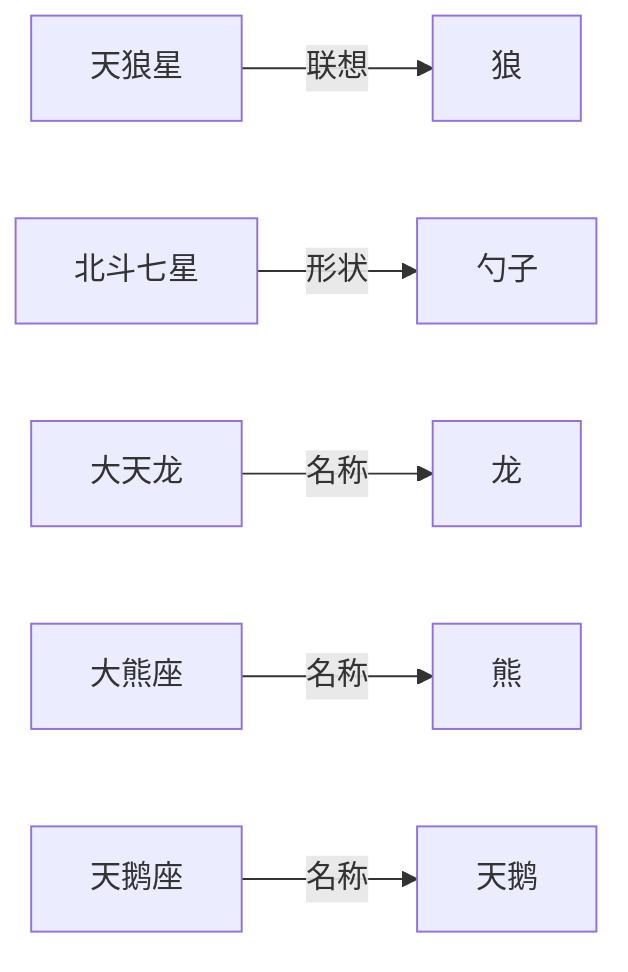
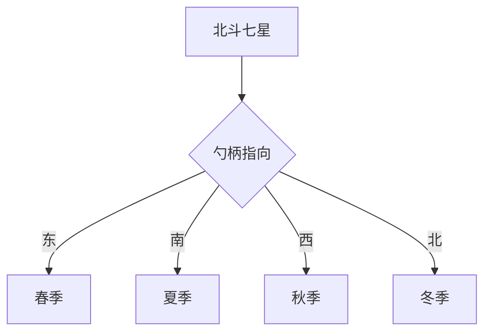
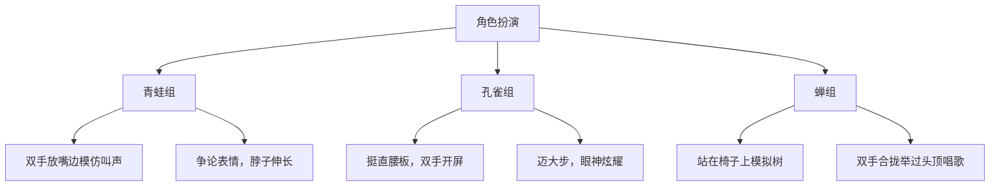
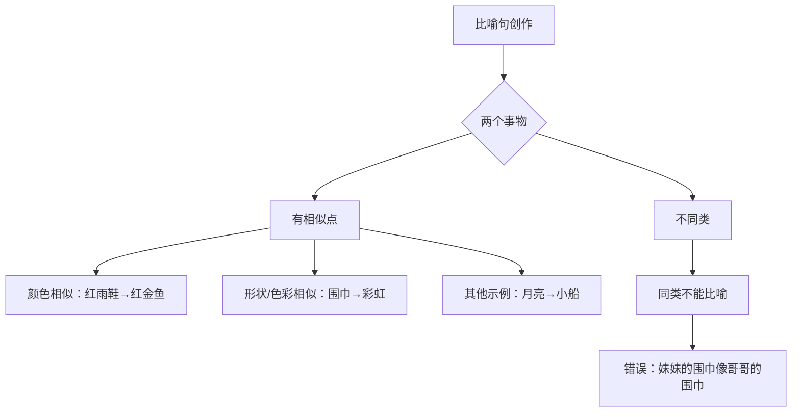
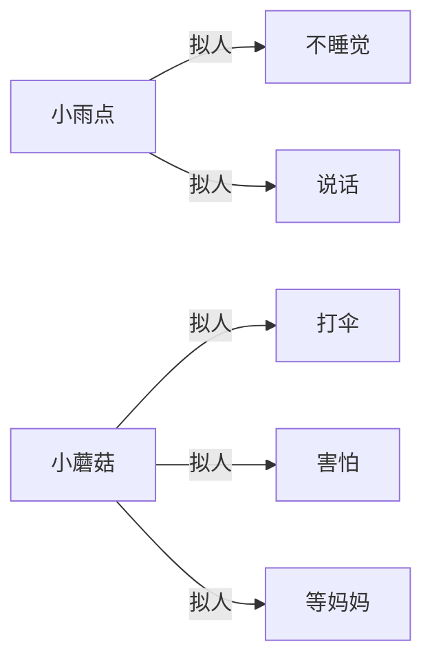
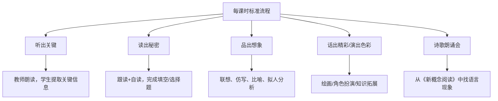

# 《妹妹的红雨鞋》童诗教学导读与练习册 结构化总结

## 书籍信息

- **书名**：《妹妹的红雨鞋》童诗美文 导读导学（配套练习与讲义）
- **作者**：未明确标注（基于常见儿童诗歌阅读教材整理）
- **PDF 状态**：多个文件，包含学生练习册（.pdf）与教师讲义（.pdf/.docx），内容互补
- **OCR 状态**：基本可识别，少量图像缺失或占位符（如第3课时中的图片链接），已按可见文本整理

## 目录说明

本书按课时组织，共4个课时。每个课时包含：
- 学生练习册（题目与活动）
- 教师讲义（教学目标与教学环节）

**课时与对应诗歌：**
- 第1课时：《古井》、《星座，连连看》（夜晚星空主题）
- 第2课时：《孔雀》、《蝉》、《好辩的青蛙》（动物主题）
- 第3课时：《妹妹的红雨鞋》、《妹妹的围巾》（生活物品与想象主题）
- 第4课时：《不睡觉的小雨点》、《雨中的小蘑菇》（雨天与拟人主题）

> 说明：原书无明确章节页码，此处按课时顺序作为章节输出。部分图像（如星座连线图、ABB词语列表页）因OCR不可完全复原，已基于文本描述整理。

## 全书核心主题

本书是一套面向小学生的童诗阅读与活动教学材料。通过精选的儿童诗歌，引导学生：
1. **感受诗歌的想象与美感**：从星空、动物、日常物品到雨天场景，激发学生对自然和生活的观察力。
2. **掌握基础语文技能**：量词使用、近义词、比喻句、拟人手法、拟声词、ABB式词语等。
3. **提升表达与创造力**：通过仿写、配画、角色扮演、朗诵等方式，将阅读转化为输出。
4. **培养跨学科兴趣**：融入星座知识（北斗七星与季节）、蝉的生命周期等科学内容。

全书以“听出关键→读出秘密→品出想象→话出精彩/演出色彩”为固定学习路径，形成可复用的诗歌教学框架。

---

## 第1课时：《古井》与《星座，连连看》

### 1. 核心论点

**问题**：如何引导学生从诗歌中提取关键信息、理解量词运用，并将星座名称与形象联想结合？  
**观点**：通过听读识别、量词填空、星座-动物/物品连线，训练学生的信息筛选能力和想象力，同时渗透北斗七星与季节关系的科学知识。

### 2. 关键概念/事件

- **关键句识别**：《古井》中“夜晚的天空，是一口很深很深的古井”是理解全诗比喻的核心。
- **量词运用**：一（口）古井、一（条）天龙、一（只）大熊、一（把）勺子、一（只）孔雀、一（只）天鹅。
- **星座联想**：天狼星→狼，北斗七星→勺子，大天龙→龙，大熊座→熊，天鹅座→天鹅。
- **北斗七星与季节**：勺柄指东为春，指南为夏，指西为秋，指北为冬；顺口溜“东、南、西、北，春、夏、秋、冬”。

### 3. 逻辑推演 / 叙事脉络

1. **导入**：播放星空视频，激发对宇宙的好奇。
2. **听出关键**：教师朗读《古井》，学生选出“夜晚的天空像很深很深的古井”；再读《星座，连连看》，识别主题为“星座”。
3. **读出秘密**：带读后，学生完成量词填空，并在原文中圈出答案。
4. **品出想象**：将星座与对应动物/物品连线，再选择一星座描述其夜空中的样子（如“灰色的狼在深蓝色夜空中奔跑”）。
5. **话出精彩**：讲解北斗七星的形状与季节判定方法，学生连一连勺柄方向与季节。
6. **诗歌朗诵会**：分享《新概念阅读》中的诗歌。

### 4. 流程图（星座连线与北斗七星方向图）

### 5. 经典金句 / 数据

> “夜晚的天空，是一口很深很深的古井。” ——《古井》

> “东、南、西、北，春、夏、秋、冬。” ——北斗七星季节顺口溜

---

## 第2课时：《孔雀》、《蝉》、《好辩的青蛙》

### 1. 核心论点

**问题**：如何让学生理解诗歌中的近义词、动物行为特点，并通过角色扮演深入体会拟人化情感？  
**观点**：通过提取主人公、寻找“歌颂”的近义词（赞美）、讨论青蛙的辩题、表演孔雀的炫耀和蝉的歌唱，培养学生对动物诗歌的共情和表现力。

### 2. 关键概念/事件

- **主人公**：孔雀、蝉、青蛙。
- **近义词**：歌颂——赞美（意思相近、字数相同）。
- **青蛙的讨论**：月亮是在天上还是在水里？（答案B）
- **孔雀的行为**：向所有的动物炫耀（答案B）。
- **蝉的赞美对象**：金色的太阳（答案B）。
- **比喻**：“会唱歌的伞”指树。
- **蝉的生命周期**：幼虫在地下生活2-3年，甚至5-6年，短暂地上时光尽情歌唱。

### 3. 逻辑推演 / 叙事脉络

1. **导入**：提问夏天印象深刻的动物，引出孔雀、蝉、青蛙。
2. **初读提取**：教师朗读三首诗，学生回答主人公；讲解近义词，圈出“赞美”。
3. **精读讨论**：分组解决三个选择题（青蛙辩题、孔雀行为、蝉赞美对象），并引导学生说出青蛙“叽里呱啦，争得脖子粗”。
4. **品出想象**：学生回答“月亮在天上还是水里”（科学或诗意角度）；解释“会唱歌的伞”是树；拓展蝉的寿命知识。
5. **演出色彩**：分三组表演——青蛙组（争论、脖子粗）、孔雀组（挺胸、炫耀、开屏）、蝉组（在树上赞美太阳）。
6. **总结与作业**：背诵三首诗，写一篇含孔雀、蝉、青蛙的夏日场景小短文。

### 4. 流程图（角色表演要点）

### 5. 经典金句 / 数据

> “叽里呱啦，争得脖子粗。” ——《好辩的青蛙》

> 蝉的幼虫在地下一般要生活2-3年，有的甚至5-6年。（知识拓展）

---

## 第3课时：《妹妹的红雨鞋》与《妹妹的围巾》

### 1. 核心论点

**问题**：如何引导学生发现生活中的诗意，理解比喻句的妙用，并仿写创造？  
**观点**：通过找出红雨鞋像红金鱼、围巾像彩虹的比喻，让学生感受儿童天真的想象力；再仿照句式创作比喻句，最后用绘画表达诗歌场景。

### 2. 关键概念/事件

- **妹妹的物品**：红雨鞋、围巾（答案B）。
- **红金鱼是什么**：红雨鞋（答案B）。
- **围巾想象成**：彩虹（答案D）。
- **比喻句**：
  - “妹妹穿着的红雨鞋像鱼缸里的一对红金鱼。”（颜色相似）
  - “妹妹的围巾像彩虹。”（形状与色彩相似）
- **仿写句式**：“______像______。”（示例：小河像一条长长的丝带；太阳像火球；月亮像小船；大象的耳朵像扇子）
- **同类不能作比**：两个同类的物品不能写成比喻（如“妹妹的围巾像哥哥的围巾”错误）。

### 3. 逻辑推演 / 叙事脉络

1. **听出关键**：听老师读，选出妹妹的物品（从标题即可找到）。
2. **读出秘密**：跟读+自读，圈出两个问题的答案（红雨鞋→红金鱼；围巾→彩虹），讨论相似点（颜色、形状）。
3. **品出想象**：找出比喻句，画线并朗读；仿照句式写比喻句，教师举例（太阳/火球、月亮/小船等），强调同类不能比喻。
4. **话出色彩**：选择一首诗配一幅图，分享画面场景（下雨、妹妹玩耍、彩虹、草原等）。
5. **诗歌朗诵会**：从《新概念阅读》中找比喻句，如《太阳》。

### 4. 流程图（比喻句创作要点）

### 5. 经典金句 / 数据

> “妹妹穿着的红雨鞋像鱼缸里的一对红金鱼。”

> “妹妹的围巾像彩虹。”

---

## 第4课时：《不睡觉的小雨点》与《雨中的小蘑菇》

### 1. 核心论点

**问题**：如何让学生感受拟人手法，学习拟声词和ABB式词语？  
**观点**：通过找出雨声词语（滴哩哩、沙沙沙），将小雨点、小蘑菇的行为与人连线（说话、打伞、害怕、等妈妈），初步理解拟人；再积累ABB词语（金灿灿、亮晶晶等）。

### 2. 关键概念/事件

- **主要内容**：小雨点、蘑菇。
- **形容雨声的词语**：滴哩哩、沙沙沙。
- **拟人行为连线**：
  - 小雨点 → 不睡觉、说话
  - 小蘑菇 → 打伞、害怕、等妈妈
- **拟人本质**：雨点不会真的说话，蘑菇不会真的打伞，是作者赋予它们人的特点。
- **ABB式词语**：金灿灿、亮晶晶、硬邦邦、响当当、红彤彤、黄灿灿（从《冬爷爷的胡子》《秋天是个大果盘》等诗歌中找）。

### 3. 逻辑推演 / 叙事脉络

1. **导入**：提问是否喜欢下雨天，引出两首雨天诗歌。
2. **听出关键**：教师朗读，学生听出主要写小雨点和蘑菇；跟读并分享最喜欢的句子。
3. **读出秘密**：找出形容雨声的词语（滴哩哩、沙沙沙），变换速度/语调朗读，复习拟声词。
4. **品出想象**：将小雨点、小蘑菇的拟人行为连线；讨论“雨点真的会说话吗”“蘑菇真的会等妈妈吗”，引出拟人手法。
5. **话出精彩**：有感情朗读并背诵，加手势表演。
6. **诗歌朗读会**：从《新概念阅读》中找ABB词语，分享积累。

### 4. 流程图（拟人行为对应）

### 5. 经典金句 / 数据

> 形容雨声的词语：滴哩哩、沙沙沙。

> ABB词语示例：金灿灿、亮晶晶、硬邦邦、响当当、红彤彤、黄灿灿。

---

## 附录：教学框架总览（Mermaid）

> 说明：本总结基于提供的教学讲义与练习册内容整理，原诗集《妹妹的红雨鞋》正文未包含在内。如需原诗歌文本，请参考正式出版物。