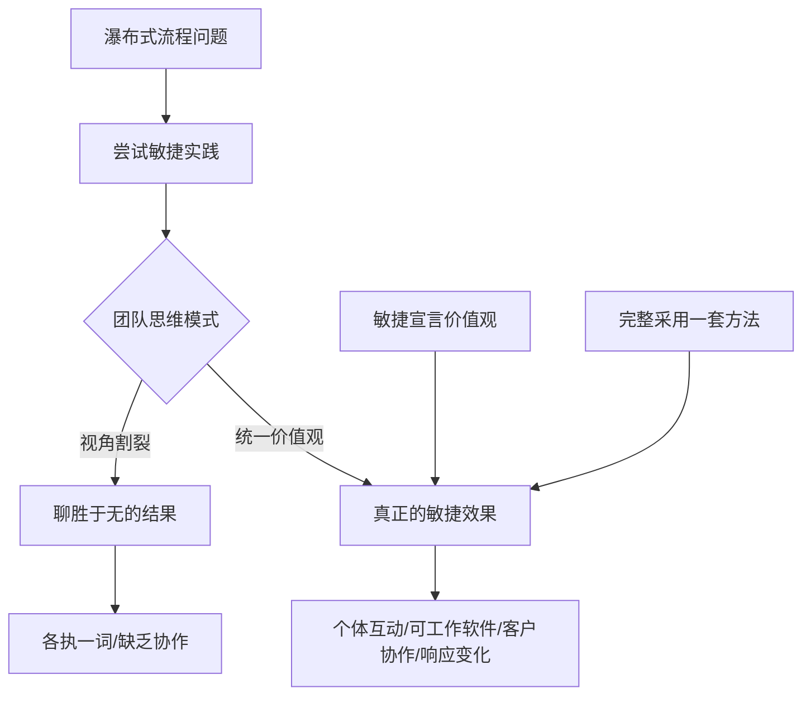
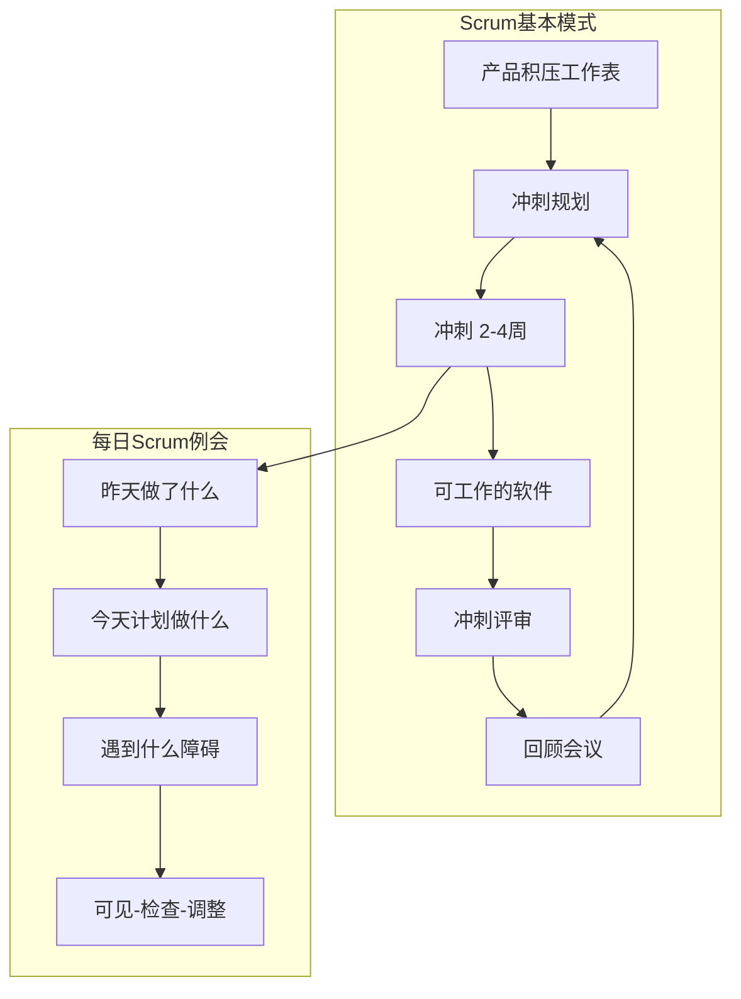
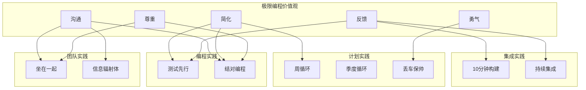
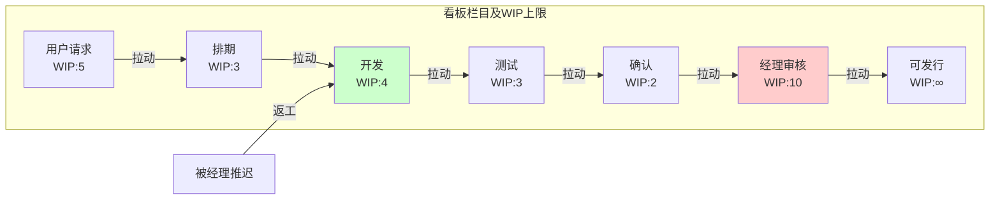
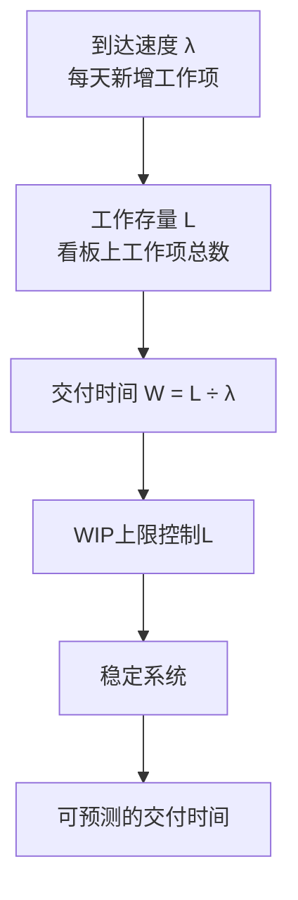

# 《学习敏捷：构建高效团队》章节总结

## 书籍信息
- **书名**：学习敏捷：构建高效团队 (Learning Agile)
- **作者**：[美] Andrew Stellman, Jennifer Greene
- **译者**：段志岩, 郑思遥
- **出版社**：人民邮电出版社（图灵程序设计丛书）
- **出版年份**：2017年2月第1版
- **PDF 状态**：扫描版，含完整目录及正文
- **OCR 状态**：已识别，部分页码标注保留

## 目录说明
- **目录识别情况**：完整识别原书目录，共10章
- **章节对应依据**：严格按原书页码与章节标题对应
- **OCR 修复说明**：少量页码标注经逻辑补全，图表内容基于文字描述重建

## 全书核心主题
本书系统阐述敏捷软件开发的核心价值观与原则，深入讲解Scrum、极限编程(XP)、精益(Lean)和看板方法(Kanban)四套敏捷实践体系。作者通过故事化叙事，从开发团队的日常困境入手，层层剖析“聊胜于无”的敏捷实践为何无法带来真正的改变，揭示其根本原因在于“视角割裂”——团队成员只关注对自己有利的实践，而缺乏对整体价值观和原则的理解。

全书核心论点是：真正的敏捷不是机械套用实践，而是建立正确的思维方式——通过理解并内化敏捷宣言的价值观和12条原则，让团队形成自组织、集体承诺、拥抱变化的能力。Scrum关注项目管理与自组织团队，极限编程关注技术实践与增量式设计，精益和看板方法关注消除浪费与流程改进，它们殊途同归，共同服务于“交付可工作的、有价值的软件”这一核心目标。

本书适合软件开发人员、项目经理、敏捷教练阅读，兼具理论深度与实践指导意义。

---

## 第1章：学习敏捷

### 1. 核心论点
**问题**：软件团队普遍面临项目延期、代码质量差、用户不满意、频繁加班等问题，敏捷方法承诺解决这些困境，但许多团队尝试后仅获得“聊胜于无”的结果。
**观点**：敏捷不仅是具体的实践方法，更是一种思维模式。团队思维方式决定了实践的高效程度——只有当团队成员共享信息、共同作出项目决策，才能真正实现敏捷承诺的“惊人成果”。

### 2. 关键概念
- **敏捷定义**：让团队思考更有效、工作更高效、作出更好决策的一组方法和相关理念
- **思维模式**：影响团队具体实践高效程度的核心因素——正确态度让每日站立会议从“进度汇报”变为“协作规划”
- **每日站立会议**：团队每天短会，每位成员讲述手头工作及挑战，全程站立以保持简短
- **视角冲突示例**：项目经理关注计划与进度，开发人员关注编码与避免打扰——同一实践因思维模式不同而产生完全不同的效果

### 3. 逻辑推演
作者从“什么是敏捷”入手，指出敏捷适用于软件工程所有领域，核心在于改变思维模式。随后通过每日站立会议的经典冲突案例展开：项目经理希望用会议跟踪进度，开发人员认为会议打断工作——如果双方保持传统思维，会议沦为低效汇报；如果双方转变思维（项目经理倾听团队、共同制定计划；开发人员主动参与项目规划），会议就成为高效协作工具。本章最后说明本书结构：先讲价值观与原则（第2-3章），再讲Scrum、XP、精益和看板方法（第4-9章），最后讲敏捷教练（第10章）。

### 4. 经典金句
> “对继续学习的渴望是一个人可以形成的最重要的态度。”——约翰·杜威，《经验与教育》

> “敏捷是指能够让团队思考更加有效、工作更为高效，并且作出更好决策的一组方法和相关理念。”

---

## 第2章：理解敏捷价值观

### 1. 核心论点
**问题**：为什么许多团队尝试敏捷后只得到“聊胜于无”的结果，而非真正的突破性改进？
**观点**：根本原因在于“视角割裂”——团队成员只从自己角色出发选择实践，而未能统一理解敏捷宣言的四则价值观。真正的敏捷要求团队将价值观置于实践之上。

### 2. 关键概念
- **瀑布式流程(BRUF)**：先完整定义需求、规划、设计，再编写代码和测试——难以应对变化，易导致需求过时
- **敏捷宣言**：四则价值观——个体和互动高于流程和工具；可工作的软件高于详尽的文档；客户协作高于合同谈判；响应变化高于遵循计划
- **视角割裂**：每位成员只关注对自己工作有帮助的实践，导致整体缺乏协作——如同盲人摸象，各执一词
- **聊胜于无的结果**：仅采用实践而不理解价值观，虽有改进但远未达到真正的敏捷效果
- **用户故事**：几句话描述用户需求，写在索引卡上，帮助团队讨论功能的真正意义

### 3. 逻辑推演
作者以流式音频点唱机项目团队的故事切入：团队主管Bruce、架构师Dan、项目经理Joanna和产品所有者Tom分别从各自角度引入敏捷实践，虽有改进但团队仍感“不尽如人意”。作者引入“盲人摸象”隐喻解释这一现象——每个人触摸大象的不同部位（只关注对自己有用的实践），而敏捷这头“大象”的整体远大于各部分的简单相加。解决方案是回到敏捷宣言的价值观：个体互动高于流程工具、可工作软件高于详尽文档、客户协作高于合同谈判、响应变化高于遵循计划。最后强调：完整采用一套方法（Scrum、XP、精益等）比零散采纳实践更有效。

### 4. 经典金句
> “没有具体的实践，原则是贫瘠的；但是如果缺乏原则，实践则没有生命、没有个性、没有勇气。伟大的产品出自伟大的团队，而伟大团队有原则、有个性、有勇气、有坚持、有胆量。”——Jim Highsmith

> “在敏捷中，原则与实践是不可分割的。”——Mike Cohn (序言)

### 5. 流程图



---

## 第3章：敏捷原则

### 1. 核心论点
**问题**：敏捷宣言的价值观如何落实到日常项目决策中？
**观点**：12条敏捷原则分为四个类别（交付、沟通、执行、改进），为团队提供具体的行为指南，帮助实现“交付有价值软件”的终极目标。

### 2. 关键概念
- **尽早交付**：原则1——尽早、持续地交付有价值的软件，让客户满意
- **拥抱变化**：原则2——欣然面对需求变化，即使是在开发后期，利用变化为客户维持竞争优势
- **频繁交付**：原则3——从数周到数月，交付周期越短越好
- **面对面沟通**：原则4——团队内外，面对面交谈是最有效、最高效的沟通方式
- **业务与开发每天在一起**：原则5——整个项目过程中，业务人员和开发人员必须每天都在一起工作
- **信任团队**：原则6——以受激励的个体为核心构建项目，提供环境和支持，相信他们可以把工作做好
- **可工作软件是进度标准**：原则7——可工作的软件是衡量进度的首要标准
- **可持续开发**：原则8——倡导可持续开发，共同长期维持稳定步调
- **技术卓越**：原则9——坚持不懈地追求技术卓越和良好设计，增强敏捷能力
- **简单**：原则10——尽可能减少不必要工作，是敏捷的根本
- **自组织团队**：原则11——最好的架构、需求和设计来自自组织的团队
- **定期反思**：原则12——团队定期反思如何提升效率，并依此调整

### 3. 逻辑推演
本章以电子书阅读器项目为思想实验：瀑布式团队用15个月开发出按规格完美的软件，但市场已变化，产品惨败。作者由此引出：只有通过迭代交付、持续获得反馈，才能开发出用户真正需要的软件。随后逐一讲解12条原则，并按“交付、沟通、执行、改进”四类组织。每类原则都通过电子书阅读器团队的改进场景加以说明——如采用迭代后，团队能及时响应新电子书格式标准、增加邮件推送功能、放弃不必要的网络书店功能。最后强调：组合使用这些原则的关键在于团队的思维方式。

### 4. 经典金句
> “如果我问人们想要什么，他们肯定会说想要更快的马（而不是汽车）。”——亨利·福特

> “最优先要做的是尽早、持续地交付有价值的软件，让客户满意。”(原则1)

---

## 第4章：Scrum和自组织团队

### 1. 核心论点
**问题**：Scrum的基本规则看似简单（角色、冲刺、每日例会），为何许多团队遵循规则却仍陷入困境？
**观点**：真正的Scrum要求团队实现“自组织”和“集体承诺”——每个人都要对项目成败负责（像“猪”一样全身投入），而不仅是完成任务（像“鸡”一样旁观）。Scrum的价值观（承诺、尊重、专注、开放、勇气）是实现这一转变的核心。

### 2. 关键概念
- **Scrum三大角色**：产品所有者(Product Owner)、Scrum主管(Scrum Master)、团队成员
- **冲刺(Sprint)**：时间限定的迭代，通常30天，结束时交付可工作的软件
- **产品积压工作表**：按优先级排序的需求/功能列表
- **冲刺积压工作表**：当前冲刺要完成的特性列表
- **每日Scrum例会**：每天15分钟，每人回答三个问题（昨天做了什么？今天计划做什么？遇到什么障碍？）
- **猪和鸡的寓言**：猪全身投入（对项目成败负责），鸡只参与（旁观）——Scrum要求每个人都做“猪”
- **Scrum价值观**：承诺(commitment)、尊重(respect)、专注(focus)、开放(openness)、勇气(courage)

### 3. 叙事脉络
故事围绕Lolleaderz.com项目团队展开：团队主管Roger引入Scrum，找到产品所有者Avi，设置月度冲刺、每日例会。起初顺利，但几轮冲刺后问题浮现——Avi感觉与团队协作困难，开发人员抱怨每日例会是“浪费时间”，项目进度放缓。Roger寻求另一团队的Scrum主管Eric帮助。Eric指出：Roger把每日例会当作进度汇报会，团队缺乏自组织。通过Eric的教练，Roger逐步让团队自主分配任务、共同解决问题。然而新问题出现：利益干系人对频繁变化感到不适。Eric解释：这是团队从“浇花软管”变成“高压水枪”的必然阶段——需要学会共同控制方向。

### 4. 经典金句
> “为了让Scrum发挥作用，团队必须深刻理解集体承诺和自组织。Scrum的理论、实践和规则都很容易掌握。但是如果一组成员不能在固定时间内完成交付，实现集体承诺，那他们就没有真正实现Scrum。”——Ken Schwaber

### 5. 流程图



---

## 第5章：Scrum计划和集体承诺

### 1. 核心论点
**问题**：如何确保团队开发的是用户真正需要的功能，而非“锯金”（画蛇添足的功能）？
**观点**：通过用户故事、故事点、速度和燃尽图等实践，让产品所有者与团队协作，从用户视角定义“完成”，使计划透明、可衡量，最终实现“集体承诺”——每个人都由衷地希望交付最有价值的软件。

### 2. 关键概念
- **用户故事格式**：“作为一个<用户类型>，我要<执行某个动作>以便<达到某种目的>”
- **满意条件(接受标准)**：用户故事完成的具休定义，写在卡片背面
- **故事点**：估计用户故事工作量的相对单位，通过与过去故事比较得出
- **项目速度**：团队一次冲刺平均完成的故事点总数
- **燃尽图**：X轴为日期，Y轴为故事点，展示冲刺中剩余工作量的变化
- **广为认可的Scrum实践(GASP)**：如站立开会、计划扑克等非原始Scrum但普遍采用的实践

### 3. 叙事脉络
Lolleaderz.com团队在Eric指导下，通过用户故事规划冲刺。然而冲刺评审时，团队演示了复杂到无人需要的“成就编辑器”——销售经理质问“为什么开发这个功能？”团队意识到犯了“锯金”错误：开发了无人需要的复杂功能。Eric解释：关键在于“想用户之所想”，用满意条件明确“完成”的定义。团队开始使用故事点估算、燃尽图跟踪、计划扑克做工时估计。经过几轮迭代，项目终于成功发布，CEO举办庆功宴。Eric总结：“吃一堑，长一智”——团队通过错误学习，真正理解了集体承诺的含义。

### 4. 经典金句
> “每位开发人员都必须全心全意地投入自己所选择的工作中。整个团队应该有一种‘同舟共济’的态度，每个人都应该认同团队的整体承诺。”——Mike Cohn

> “计划并不会让我们承诺。我们自己的承诺才是承诺：计划只不过是一个方便记录这些要承诺的事情的地方。”

---

## 第6章：极限编程与拥抱变化

### 1. 核心论点
**问题**：开发团队为何痛恨需求变化？如何改变这种心态？
**观点**：极限编程(XP)通过13项主要实践（测试先行、结对编程、持续集成、周循环等）和五则价值观（沟通、简化、反馈、勇气、尊重），帮助团队从“抵制变化”转向“拥抱变化”——认识到变化是交付有价值软件的唯一途径。

### 2. 关键概念
- **测试先行编程(TDD)**：先编写自动化单元测试，再编写代码让测试通过
- **结对编程**：两名开发人员共用一台电脑，一人编码一人审查，轮流交换
- **10分钟构建机制**：自动构建全部代码并在10分钟内运行完所有单元测试
- **持续集成**：不断将本地代码与主仓库集成，及早发现冲突
- **周循环/季度循环**：一周迭代+每季度宏观规划
- **丢车保帅(Slack)**：在迭代中加入低优先级任务，必要时可丢弃以留出缓冲
- **坐在一起**：团队在同一开放空间工作，形成渗透式沟通
- **信息辐射体**：任务板、燃尽图等悬挂墙上的可视化工具
- **拥抱变化**：不仅接受变化，更主动要求变化——因为用户反馈是改进的唯一途径

### 3. 叙事脉络
虚拟篮球网站团队因需求变更（从NBA扩展到欧洲联赛）而频繁加班。项目经理Bridget引入极限编程，团队开始采用TDD、结对编程、持续集成。然而几周后，实践逐渐被抛弃——大家觉得“没时间结对”“没时间写测试”。代码质量依然糟糕，bug频出。开发人员Justin和Danielle讨论原因，发现根本问题是心态：他们没有真正内化XP的价值观。新人Tyler加入后，与Danielle结对时发现了缓存模块的严重设计缺陷——这让他们意识到：沟通、简化、反馈、勇气、尊重这些价值观才是XP的灵魂。没有价值观支撑的实践，只是空洞的形式。

### 4. 经典金句
> “人痛恨变化……因为人就是痛恨变化……你明白我的意思吗？人真的痛恨变化，千真万确。”——Steve McMenamin

> “实践本身是空洞的。如果没有价值观作为它们的后盾，它们不过是机械的行为方式而已。”——Kent Beck

### 5. 价值观与实践关系图



---

## 第7章：极限编程、简化和增量式设计

### 1. 核心论点
**问题**：为何聪明的程序员也会写出难以修改的“意大利面条式代码”？如何避免？
**观点**：问题根源在于“聪明过头”——过度设计、框架陷阱、过早优化。真正的解决方案是“简化”：通过重构、持续集成、增量式设计，让代码由小型、独立、解耦的模块构成，系统行为从模块交互中“呈现”出来，而非事先规定。

### 2. 关键概念
- **代码异味**：代码中的反模式，如枪伤手术、巨型类、重复代码、千层饼代码
- **枪伤手术**：修改一处代码需要同时修改多处看似不相关的地方
- **框架陷阱**：为解决小问题开发大型框架，导致过度复杂
- **技术债务**：因偷工减料而欠下的设计/编码问题，未来需“偿还”
- **重构**：修改代码结构但不改变行为，保持代码简单
- **增量式设计**：系统由小型独立模块构成，随需求有机生长
- **呈现式设计**：系统行为从模块交互中自然呈现，类似蚁群或Unix工具集
- **精力充沛的工作**：创造让团队有足够时间思考的环境，避免加班文化
- **有凝聚力的团队**：每个人都对项目有归属感，共同作出决策

### 3. 叙事脉络
虚拟篮球网站团队再次陷入加班地狱：看似简单的“下拉框加选项”修改演变成涉及十几处代码的“枪伤手术”。Justin和Danielle发现代码充满异味——耦合严重、半成品对象泛滥。他们开始反思：为什么总是这样？答案是他们落入了“框架陷阱”——总是想写出“可复用”的代码，结果过度设计。在教练指导下，团队开始真正实践重构、持续集成、增量式设计。数月后，团队每周都能稳定发布，加班成为历史。Bridget感叹：“我过去总是说‘不行’，现在更常说‘可以’。”Justin总结：“我终于理解测试驱动开发为什么有效了——它强迫你先思考功能，再做设计。”

### 4. 经典金句
> “我算不上卓越的程序员，我只是一个有着卓越习惯的不错的程序员。”——Kent Beck

> “发布新代码就像借贷一样。背一点债务可以加速开发进程，只要能够及时地通过重写把债务还清就行。可是一旦债务没有被还清，危险就会来临。”——Ward Cunningham

### 5. 增量式设计 vs 一体式设计

```mermaid
graph LR
    subgraph 一体式设计
        A1[模块A] --- A2[模块B]
        A2 --- A3[模块C]
        A1 --- A3
        A1 --- A4[模块D]
        A2 --- A4
    end
    
    subgraph 增量式设计(解耦)
        B1[模块1] --> B2[简单协定]
        B3[模块2] --> B2
        B4[模块3] --> B2
        B5[模块4] --> B2
    end
```

---

## 第8章：精益、消除浪费和着眼全局

### 1. 核心论点
**问题**：为何许多团队无论多努力，总感觉“陷入流沙”，项目越做越慢？
**观点**：根源在于“浪费”——包括不创造价值的活动(Muda)、工作不均衡(Mura)、超负荷不可能的任务(Muri)。精益思维通过价值流示意图、五个为什么、拉动式系统等工具，帮助团队“着眼全局”，消除浪费，实现尽快交付。

### 2. 关键概念
- **精益价值观**：消除浪费、增强学习、尽可能延迟决定、尽快交付、帮助团队成功、保证产品完善、着眼全局
- **选择思维**：区分承诺与选项——在最后责任时刻保留尽可能多的选项
- **集合式开发**：同时探索多个方案（如A/B测试），选出最优
- **神奇思维**：认为“只要有足够动力，一切皆有可能”——忽略现实约束的危险管理方式
- **七种浪费**：做了一半的工作、多余流程、多余功能、任务切换、等待、移动、缺陷
- **价值流示意图**：可视化MMF从概念到交付的全过程，标出“工作”和“等待”时间
- **最小可销售特性(MMF)**：客户愿意给予优先级的最小功能单元（如用户故事）
- **五个为什么**：连问五次“为什么”找到问题的根本原因
- **约束理论**：每个系统至少有一个瓶颈，消除它后下一个瓶颈会显现

### 3. 叙事脉络
手机相机应用团队被大公司收购后，老板Dan不断施压，要求“多任务处理”“加把劲”。开发人员Catherine和Timothy发现项目越做越慢，交付时间越来越长。他们学习精益思维，画出价值流示意图——发现大量时间浪费在“等待经理审核”上。用“五个为什么”找出根本原因：高级经理只在最终演示时才提出颠覆性修改，导致特性反复返工。团队引入“工作进度面积图”可视化流量，发现不均衡问题。通过设置“进行中工作上限”和拉动式系统，迫使经理更早参与反馈，交付时间大幅缩短。Catherine意识到：Dan的“神奇思维”才是问题根源——他以为团队可以无限承载工作量。

### 4. 经典金句
> “精益是一种思维方式，是一种世界观。”——Mary Poppendieck, Tom Poppendieck

> “我们绝不会让机房里的服务器满负荷运转，在软件开发上我们为什么没有认识到这一点呢？”——Mary Poppendieck

### 5. 价值流示意图(Mermaid重建)


> 说明：红色区域代表“等待”时间（浪费），绿色区域代表“工作”时间。

---

## 第9章：看板方法、流程和持续改进

### 1. 核心论点
**问题**：团队已有工作流程，如何在不颠覆的前提下持续改进？
**观点**：看板方法不是项目管理方法，而是流程改进方法——从现有流程开始，通过可视化工作流、限制进行中的工作(WIP上限)、管理流量、明确规则，实现增量式、演进式的改进。利特尔法则(L=λ×W)证明：通过控制队列长度即可控制交付时间。

### 2. 关键概念
- **看板方法原则**：从现状开始、增量渐进改变、尊重现有角色
- **看板(Kanban Board)**：可视化工作流的白板，栏目对应流程各阶段，贴纸代表工作项
- **工作项**：独立可跟踪的工作单元（如MMF、用户故事），区别于“任务”
- **进行中工作上限(WIP Limit)**：每栏允许的最大工作项数量——看板方法的“秘密武器”
- **累积流量图(CFD)**：展示到达速度、工作存量、交付时间的可视化工具
- **利特尔法则**：L(平均工作存量) = W(平均交付时间) × λ(平均到达速度)
- **拉动式系统**：团队主动“拉取”工作而非被“推送”，通过队列控制流量
- **Muda/Mura/Muri**：浪费的三类表现——无用/不均衡/超负荷

### 3. 叙事脉络
Catherine和Timothy的团队在老板Dan的微管理下痛苦不堪。他们引入看板方法：先绘制当前工作流的看板（用户请求→排期→开发→测试→确认→经理审核→可发行），发现“经理审核”栏工作项堆积如山。团队说服Dan设置WIP上限，规定该栏最多10个工作项，达到上限后经理必须立即开会审核。Dan起初犹豫，但量化指标（交付时间从71天降至30天）说服了他。团队进一步为每栏设置上限，使用CFD监控流量，通过利特尔法则计算交付时间。Dan的态度开始转变——从“加把劲”变成“你们是怎么做到的？”母公司甚至邀请Catherine去指导其他团队。Catherine感叹：“我从来没想过限制工作队列反而能让工作更快。”

### 4. 经典金句
> “看板方法本身并不是一种软件开发流程或者项目管理方法。使用看板方法之前，你必须已经具备某种流程或方法，而看板方法的作用就在于逐渐改变你已有的流程或方法。”——David Anderson

> “塔金，你的手攥得越紧，就有越多的星系从你的手指间溜走。”——莱娅公主（隐喻过度控制适得其反）

### 5. 看板结构示意图



### 6. 利特尔法则示意



---

## 第10章：敏捷教练

### 1. 核心论点
**问题**：如何帮助抗拒变化的团队真正接纳敏捷？
**观点**：敏捷教练需要理解“守破离”三阶段学习模型——初学者需要简单规则（守），熟练后理解原则（破），最终内化价值观、不拘泥于方法（离）。教练还要理解人们对变化的恐惧（害怕失败、丢饭碗），通过允许失败、回顾反思、因材施教，帮助团队逐步转变思维。

### 2. 关键概念
- **敏捷教练**：帮助团队学习敏捷方法、改变思维方式的人
- **抗拒变化的征兆**：“我们现在挺好的”“风险太大”“某项实践对我不起作用”“敏捷不适用我们”“这跟我们现在的做法没什么两样”
- **守破离(Shuhari)**：学习三阶段——守（遵守规则）→破（打破规则）→离（自成一派）
- **敏捷狂热者**：认为只有一种敏捷方法对所有人有效，强制推行——不是好教练
- **Wooden五原则**：勤奋、热情、状态、基础、培养团队精神
- **允许失败**：教练不应保护团队免受所有失败，而应利用失败作为教学机会

### 3. 逻辑推演
本章从Catherine被老板Dan指派为敏捷教练开始——她虽然成功改进了自己的团队，却不知道如何指导别人。作者由此展开敏捷教练的核心能力：理解人们为什么抗拒变化（害怕失败、害怕丢饭碗、没有时间思考）；理解人们如何学习（守破离三阶段——初学者需要具体规则，进阶者理解原则，大师级不拘泥于方法）；理解每种方法的“承重墙”（Scrum的集体承诺、XP的拥抱变化、看板的WIP上限）。教练要因材施教：对“守”阶段的团队给规则，对“破”阶段的团队讲原则，对“离”阶段的团队完全放手。最后引用John Wooden的五项教练原则作为敏捷教练的价值观基础。

### 4. 经典金句
> “掌握一样东西（如果有可能的话）的一个很好的模式来自武术。一个学武术的人要经过三个水平阶段，分别叫作守，破，离。守：按套路来；破：打破套路；离：自成一派。”——Lyssa Adkins

> “要允许失败：当然，这并不是说在团队即将冲下悬崖的时候你应该袖手旁观。不过，要利用每次冲刺中的各种机会让它适当地失败。”

### 5. 守破离学习模型

```mermaid
graph TD
    subgraph 守(Shu)
        S1[需要具体规则]
        S2[关注实践]
        S3[“我们该怎么做？”]
    end
    
    subgraph 破(Ha)
        H1[理解原则]
        H2[内化价值观]
        H3[“为什么这么做？”]
    end
    
    subgraph 离(Ri)
        R1[不拘泥于方法]
        R2[自成一派]
        R3[“怎么好使怎么做”]
    end
    
    S1 --> H1 --> R1
    S2 --> H2 --> R2
    S3 --> H3 --> R3
```

---

## 全书总结

《学习敏捷》的核心论证链条可概括为：

1. **问题识别**：软件团队普遍面临项目延期、质量差、加班多等困境，敏捷方法承诺解决但许多团队仅获“聊胜于无”的结果。
2. **根本原因**：视角割裂——团队成员只从自己角色出发选择实践（开发人员选TDD、项目经理选燃尽图、产品所有者选用户故事），缺乏对整体价值观和原则的统一理解。
3. **解决方案框架**：回归敏捷宣言的价值观（个体互动、可工作软件、客户协作、响应变化）和12条原则，建立正确的思维方式。
4. **四种路径**：
   - Scrum：通过自组织和集体承诺改进项目管理
   - 极限编程：通过技术实践和增量式设计实现“拥抱变化”
   - 精益：通过消除浪费和着眼全局优化价值流
   - 看板方法：通过可视化、WIP上限、流量管理实现持续改进
5. **落地保障**：敏捷教练运用“守破离”模型和Wooden五原则，帮助团队克服抗拒，逐步转变思维。

最终结论：没有“银弹”，敏捷不是一套可以机械套用的公式，而是一种需要持续内化的思维方式。团队只有在理解并践行价值观和原则的前提下，才能真正实现敏捷承诺的“惊人成果”。