# 《实战突击：JavaWeb项目整合开发》章节总结

## 书籍信息
- **书名**：实战突击：JavaWeb项目整合开发[JSP+Struts+Hibernate+Spring+Ajax]
- **作者**：明日科技 陈丹丹 王国辉 朱晓 等编著
- **出版社**：電子工業出版社
- **PDF状态**：扫描版PDF，共分为4个文件，包含完整目录和正文内容
- **OCR状态**：文字可识别，部分图表为图片格式，文本内容已提取

## 目录说明
- **目录识别情况**：完整识别，包含3篇21章
- **章节对应依据**：按PDF页码顺序提取目录结构
- **OCR修复说明**：部分页面存在文字错位（如页码与正文重叠），已基于可见文本整理

## 全书核心主题

本书是一本Java Web项目开发实战教程，精选21个实用软件项目，涵盖：
- **SSH2框架应用篇**（第1-5章）：Struts2 + Spring + Hibernate整合开发
- **SSH框架应用篇**（第6-10章）：Struts1 + Spring + Hibernate整合开发
- **JSP项目实战篇**（第11-21章）：JSP + JavaBean + Servlet经典模式开发

每个项目从开发背景、需求分析、系统设计、数据库设计到编码实现，完整展示软件开发全流程。书中涉及的技术包括：Struts2、Struts1、Hibernate、Spring、Ajax、jQuery、JFreeChart等，数据库涵盖SQL Server和MySQL。

---

## 第一篇：SSH2框架应用篇

---

## 第1章：都市供求信息网（JSP+Struts2+SQL Server 2005实现）

### 1. 核心论点

**问题**：如何开发一个基于Struts2框架的供求信息发布网站？

**观点**：都市供求信息网需要为用户提供免费有价值的信息，同时为企业提供有偿服务。通过Struts2框架实现前后台分离，前台负责信息显示与发布，后台负责信息审核与付费管理。

### 2. 关键概念

- **Struts2框架**：基于MVC模式的Web应用框架，核心控制器为FilterDispatcher，业务控制器为Action
- **信息审核机制**：通过tb_info表中的info_state字段（0-未审核，1-已审核）控制信息是否显示
- **付费设置**：通过info_payfor字段（0-未付费，1-已付费）控制信息是否在顶部优先显示
- **分页技术**：通过CreatePage类封装分页信息（当前页、总页数、总记录数、每页记录数）

### 3. 逻辑推演

**系统开发流程**：
1. **需求分析**：明确网站需要提供求职、招聘、房屋、车辆等多类信息
2. **数据库设计**：创建tb_info（供求信息）、tb_type（信息类别）、tb_user（管理员）三张表
3. **公共类设计**：DB类（数据库连接操作）、OpDB类（业务处理）、CreatePage类（分页）
4. **前台实现**：使用IndexTemp.jsp作为框架页面，通过include动作包含不同内容区域
5. **信息发布**：用户填写表单→Struts2表单验证→验证通过后插入数据库
6. **后台管理**：管理员登录后进行信息审核、付费设置、信息删除

**Struts2表单验证机制**：
- 使用validateXXX()方法进行验证（如validateAdd()验证信息发布）
- 验证失败调用addFieldError()保存提示信息
- 配置文件中的`<result name="input">`指定验证失败返回页面

### 4. 流程图

#### 系统流程图

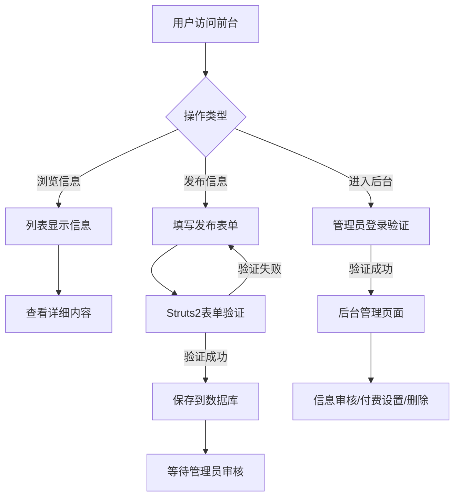

#### 信息发布流程

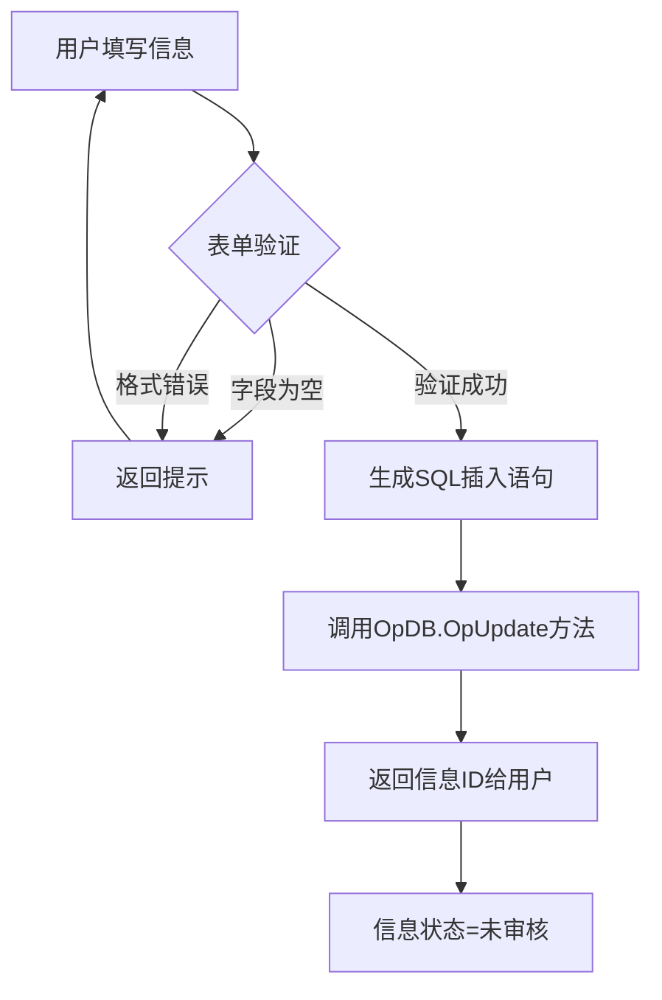

### 5. 经典金句

> “Struts2.0还允许将封装表单数据的代码从Action类中分离出来，写在另一个JavaBean中。”（p.43）

> “在Struts2.0中解决中文乱码问题，可通过在WEB-INF/classes目录下创建struts.properties资源文件，设置struts.i18n.encoding=gb2312。”（p.44）

---

## 第2章：物流配货网（JSP+Struts2+MySQL实现）

### 1. 核心论点

**问题**：物流企业如何通过信息化管理提高信息流转效率、降低物流运作成本？

**观点**：物流配货网通过Struts2框架实现车源管理、发货单管理、客户管理三大核心功能，帮助企业科学化管理网络，提高经济效益。

### 2. 关键概念

- **车源管理**：对车辆信息进行增删改查，记录车主信息、车牌号、运输路线等
- **发货单管理**：包含发货单填写、回执确认、发货单查询三大流程
- **车源日志表（tb_carlog）**：记录车辆使用开始时间、结束时间，关联发货单
- **回执确认**：修改发货单状态并删除车源日志，表示货物已送达

### 3. 逻辑推演

**核心业务流程**：
1. **管理员登录**：验证用户名密码，成功后进入主界面
2. **车源信息管理**：添加车辆→查看车辆列表→修改/删除车辆信息
3. **发货单填写**：选择车源→填写发货信息→生成发货单号
4. **发货单查询**：按条件查询已发货单据
5. **回执处理**：确认货物送达→更新状态→释放车源

**Struts配置模式**：
```xml
<action name="admin_*" class="com.webtier.AdminAction" method="{1}">
    <result name="success">/admin_{1}.jsp</result>
    <result name="input">/admin_{1}.jsp</result>
</action>
```
使用通配符`*`匹配方法名，实现一个Action类处理多个请求。

### 4. 流程图

#### 发货单管理流程

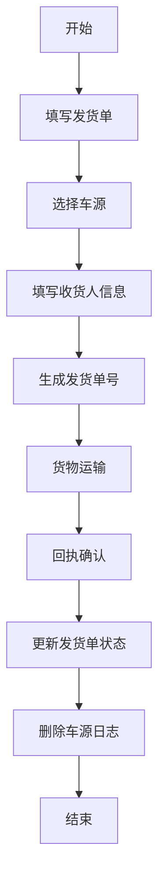

### 5. 经典金句

> “Struts2的Action类允许提供一个validateXxx()方法，其中Xxx即是Action对应处理逻辑方法。”（p.74）

> “在公共模块设计中介绍了重写simple模板的代码，但为了避免代码冗余，可以在struts.properties资源文件中统一设置struts.ui.theme=simple。”（p.87）

---

## 第3章：编程爱好者博客地带（JSP+Struts2+Hibernate+MySQL实现）

### 1. 核心论点

**问题**：如何整合Struts2与Hibernate3开发个人博客系统？

**观点**：Struts2作为控制器组件处理页面请求，Hibernate3作为模型组件实现数据持久化，两者整合实现松耦合、易维护的博客系统。

### 2. 关键概念

- **Struts2 + Hibernate3整合流程**：Struts2负责MVC中的控制层，Hibernate负责持久层，通过DAO模式操作数据库
- **Hibernate配置文件（hibernate.cfg.xml）**：配置数据库驱动、连接URL、用户名密码、方言、映射文件
- **数据持久化类ObjectDao**：封装saveT()、deleteT()、updateT()、queryList()等通用方法
- **用户注册时动态创建目录**：注册成功后根据用户名创建文件夹，复制模板文件

### 3. 逻辑推演

**系统功能结构**：
- **个人博客空间**：浏览文章、发表留言、添加好友、浏览相册
- **博客后台管理**：用户管理、文章管理、相册管理、修改密码

**Hibernate操作示例**：
```java
public boolean saveT(T t) {
    Session session = sessionFactory.openSession();
    Transaction tx = session.beginTransaction();
    session.save(t);
    tx.commit();
    session.close();
    return true;
}
```

**文章模块实现**：
- 发表文章：通过ArticleAction的article_add()方法保存
- 文章列表：使用HQL查询，分页显示
- 文章详细：根据ID查询，累加访问次数

### 4. 流程图

#### Struts2与Hibernate3整合技术流程图

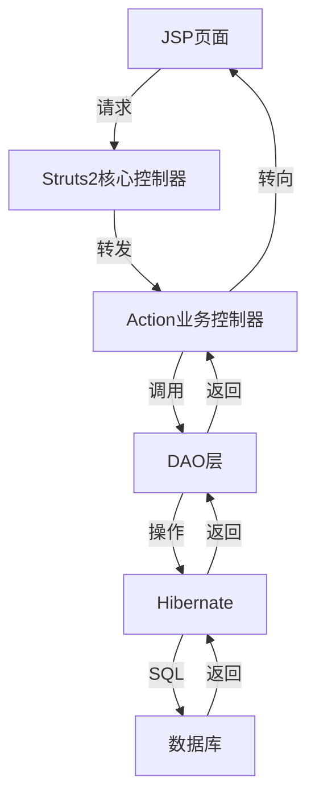

### 5. 经典金句

> “复选框的作用就如同它的名字一样，在同一类别或条件下选取多个对象。在博客系统中，通过复选框的ID值来实现记录的全选与反选。”（p.112）

> “Hibernate3作为系统开发的模型组件，在数据存储器和控制器之间加入一个持久层，该层简化CRUD数据的工作。”（p.95）

---

## 第4章：明日知道（Struts2+Spring+Hibernate+JQuery+MySQL实现）

### 1. 核心论点

**问题**：如何实现一个技术交流论坛，支持文章发布、回复和关键字搜索？

**观点**：通过Struts2+Spring+Hibernate三大框架整合，配合jQuery实现异步交互，构建一个功能完善的技术问答平台。

### 2. 关键概念

- **Spring+Hibernate整合**：Spring对Hibernate进行数据源和事务封装，DAO层继承HibernateDaoSupport
- **事务传播特性配置**：使用`<tx:advice>`配置事务边界，REQUIRED传播级别
- **QBC检索方式**：Criteria接口提供面向对象的查询方式，通过Restrictions类设置查询条件
- **jQuery Ajax异步提交**：文章回复采用异步刷新，提升用户体验
- **分页组件**：PageUtil类封装分页方法，在JSP页面中include使用

### 3. 逻辑推演

**三大框架分工**：
- **Struts2**：控制层，处理用户请求
- **Spring**：业务层，IOC管理Bean，AOP事务控制
- **Hibernate**：持久层，ORM映射

**文章搜索实现**：
- 按作者搜索：根据用户名查询所有文章
- 按关键字搜索：使用like模糊匹配标题和内容
- 热门搜索：预设热门关键词，点击自动填充搜索框

**异步回复实现**：
- 表单序列化：`$('#addReplyForm').serialize()`
- Ajax提交：`$.ajax()`方法发送POST请求
- 动态追加：服务器返回JSON数据，前端动态渲染

### 4. 流程图

#### 框架整合流程图

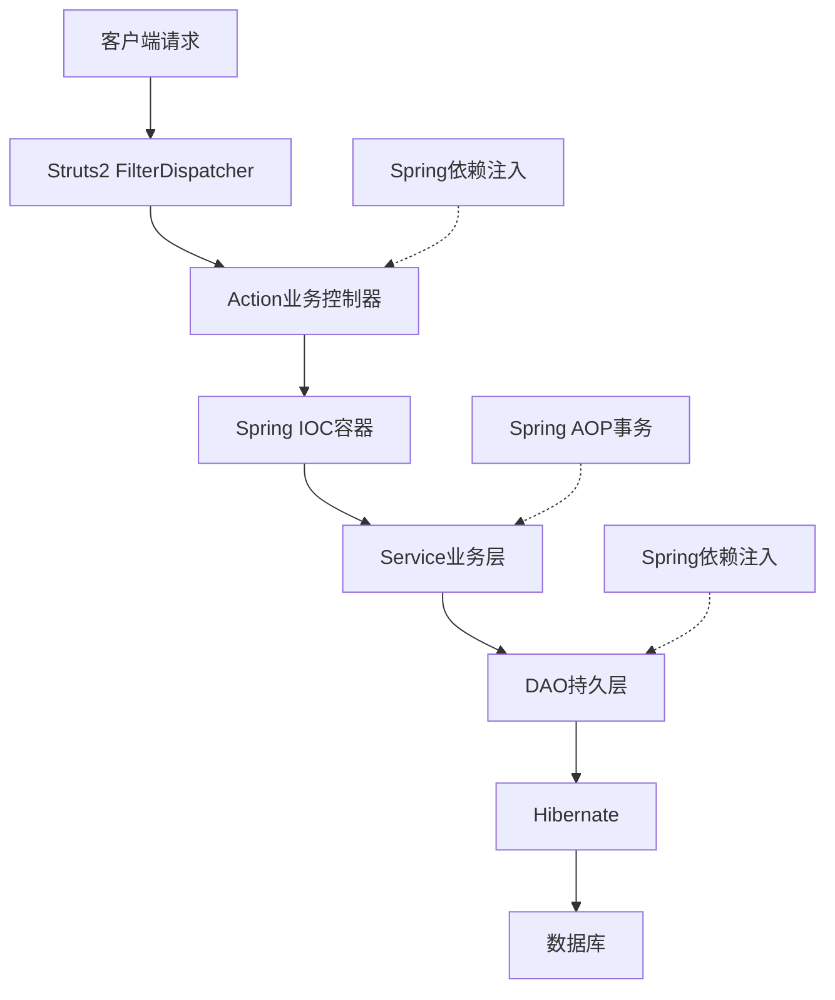

#### 文章回复异步流程

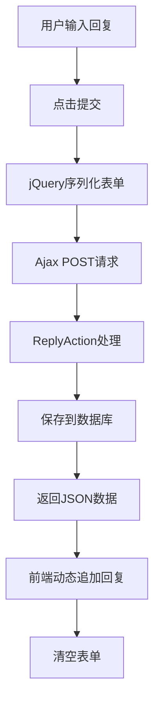

### 5. 经典金句

> “jQuery是一套简洁、快速、灵活的JavaScript脚本库，它帮助开发人员简化了JavaScript代码。”（p.124）

> “Spring将Hibernate集成进来，并对Hibernate进行数据源和事务封装，这样我们就可以不用去单独写额外代码管理Hibernate的事务处理。”（p.120）

---

## 第5章：天下淘网络商城（Struts2+Spring+Hibernate+MySQL实现）

### 1. 核心论点

**问题**：如何开发一个功能完整的B2C电子商务网站？

**观点**：天下淘网络商城采用SSH2框架，实现商品展示、购物车、订单管理、会员管理等功能，核心难点在于购物车的Session存储和无限级商品分类的树形生成。

### 2. 关键概念

- **泛型工具类（GenericsUtils）**：获取实体对象类型，用于DAO层的泛型操作
- **购物车实现**：使用Session存储Set<OrderItem>，实现添加、修改数量、删除、清空功能
- **无限级分类树**：通过递归算法生成带缩进的树形下拉框，level字段标识节点层级
- **订单生成**：保存订单主表和明细表，根据会员等级计算折扣，更新库存和会员消费额
- **拦截器安全控制**：CustomerLoginInterceptor验证用户登录状态，防止未授权访问

### 3. 逻辑推演

**购物车核心逻辑**：
1. 购物车保存在Session中，类型为`Set<OrderItem>`
2. 添加商品：遍历购物车，若存在相同商品则数量+1，否则新增
3. 修改数量：通过Ajax实现不刷新页面修改
4. 生成订单：从Session获取购物车信息，插入订单表，清空购物车

**商品分类树生成算法**：
- 查询所有level=1的一级节点
- 递归遍历每个节点的children集合
- 根据层级添加空格缩进（“|”或“L”标识）
- 存入Map<Integer, String>供下拉列表使用

**拦截器配置**：
```xml
<interceptors>
    <interceptor name="loginInterceptor" class="com.lyq.action.interceptor.CustomerLoginInterceptor"/>
    <interceptor-stack name="customerDefaultStack">
        <interceptor-ref name="loginInterceptor"/>
        <interceptor-ref name="defaultStack"/>
    </interceptor-stack>
</interceptors>
```

### 4. 流程图

#### 购物车流程图

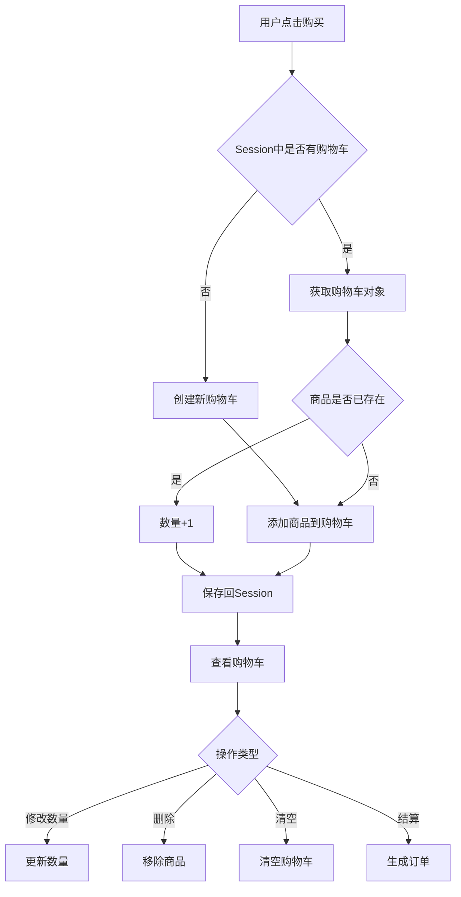

#### 订单生成流程

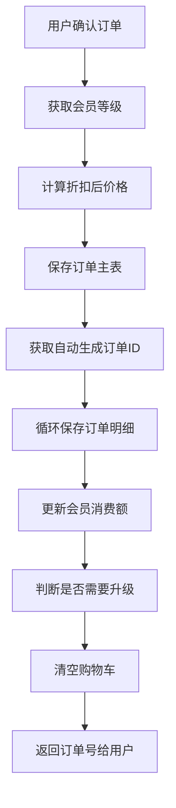

### 5. 经典金句

> “在实际的销售运营过程中，产品的宣传受到限制，采购商或顾客只能通过上门咨询、电话沟通等方式进行各种产品信息的获取，而本系统可以改变这种现状。”（p.147）

> “拦截器是Struts2框架中一个非常重要的核心对象，它可以动态增强Action对象的功能。”（p.180）

> “泛型工具类GenericsUtils用于获取实体对象类型，实现DAO层公共方法。”（p.153）

---

## 第二篇：SSH框架应用篇

---

## 第6章：成长在线考试网（JSP+Struts+Ajax实现）

### 1. 核心论点

**问题**：如何实现一个支持随机抽题、自动计时、自动阅卷的在线考试系统？

**观点**：通过Struts框架+Ajax技术，实现随机抽取试题、考试时间倒计时、到达时间自动交卷、客观题自动评分等功能。

### 2. 关键概念

- **随机抽题算法**：从指定课程中随机抽取套题，保证每次考试题目不同
- **Ajax计时技术**：使用XMLHttpRequest异步获取服务器时间，实现计时和剩余时间显示
- **自动交卷机制**：当剩余时间为00:00:00时，JavaScript自动提交试卷
- **Struts中文乱码解决方案**：扩展RequestProcessor类，重写processPreprocess()方法
- **图像热点（Image Map）**：使用<map>和<area>标记为图像设置多个超链接区域

### 3. 逻辑推演

**在线考试流程**：
1. 考生阅读考试规则→同意→选择考试课程
2. 系统随机抽取试题→开始考试（记录开始时间）
3. 答题过程中Ajax实时显示剩余时间
4. 时间到或考生主动交卷→自动阅卷→显示成绩

**随机抽题实现**：
- 查询指定课程下的所有套题ID
- 使用`Math.abs(new Random().nextInt(id.length))`随机获取套题ID
- 根据套题ID和题型（单选题/多选题）查询试题

**自动阅卷逻辑**：
- 单选题：遍历答案数组，与正确答案比较，累加分数
- 多选题：将考生选择的答案拼接成字符串，与正确答案比较

**Struts中文乱码解决方案**：
```java
public class SelfRequestProcessor extends RequestProcessor {
    protected boolean processPreprocess(HttpServletRequest request, 
                                         HttpServletResponse response) {
        request.setCharacterEncoding("GBK");
        return true;
    }
}
```
在struts-config.xml中配置：
```xml
<controller processorclass="com.action.SelfRequestProcessor"/>
```

### 4. 流程图

#### 在线考试模块系统流程图

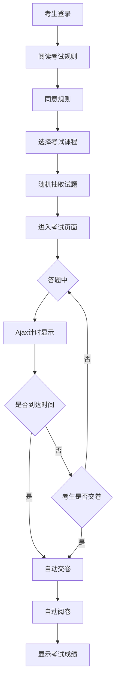

#### 随机抽取试题流程

```mermaid
graph TD
    A[获取课程ID] --> B[查询课程下所有套题ID]
    B --> C[获取套题总数recordNum]
    C --> D[将套题ID存入数组]
    D --> E[生成随机数rand]
    E --> F[questionsID = id[rand]]
    F --> G[返回套题ID]
    G --> H[查询该套题下的试题]
    H --> I[按题型分类返回]
```

### 5. 经典金句

> “在默认的情况下，通过JavaScript的window.close()方法关闭IE主窗口时，将弹出询问是否关闭窗口的对话框，这时只有单击“是”按钮，才可以真正关闭此窗口。如果在使用window.close()方法前，先使用window.opener=null;语句，就不会出现前面的询问对话框了。”（p.6-7）

> “为了防止试题泄露，可以通过在开始考试时先将考试信息保存到考生成绩表中，然后等提交试卷时，再修改考试成绩实现。”（p.8）

---

## 第7章：企业物资管理系统（Struts+Hibernate 3+SQL Server 2005实现）

### 1. 核心论点

**问题**：如何实现企业物资的采购、入库、出库、借出、报损全流程管理？

**观点**：企业物资管理系统采用Struts+Hibernate整合技术，通过HQL查询和关联映射，实现物资的采购登记、审核入库、借出归还等复杂业务流程。

### 2. 关键概念

- **采购单管理**：采购单主表（tb_stock_main）+明细表（tb_stock_detail），支持一单多物
- **购物车原理应用**：采购登记时使用HttpSession暂存采购物资，实现一张单据包含多种物资
- **Hibernate关联映射**：一对多（主表→明细表）、多对一（明细表→主表）双向关联
- **视图实体类映射**：Hibernate支持视图映射，与数据表映射方式相同
- **通用查询方法**：QueryDAO类封装动态SQL生成，支持多条件组合查询

### 3. 逻辑推演

**物资入库流程**：
1. **采购登记**：选择物资→添加到购物车→选择供应商→保存采购单
2. **采购单号生成规则**：`CG + YYYY-MM-DD + 5位流水号`
3. **审核入库**：管理员审核采购单→合格则入库（生成入库单号`RK+日期+流水号`）→更新库存
4. **不合格处理**：状态设为2，记录到审核表

**关联映射配置**：
```xml
<!-- 一对多 -->
<set name="stockDetail" lazy="false" cascade="all" inverse="true">
    <key column="stockId"/>
    <one-to-many class="com.actionForm.StockDetailForm"/>
</set>

<!-- 多对一 -->
<many-to-one name="stockMain" column="stockid" 
             class="com.actionForm.StockMainForm"/>
```

**通用查询方法**：
- 动态拼接WHERE条件
- 支持按字段查询、时间段查询、组合查询
- 使用`ifCompose()`方法将多个条件组合成查询字符串

### 4. 流程图

#### 企业物资管理系统流程图

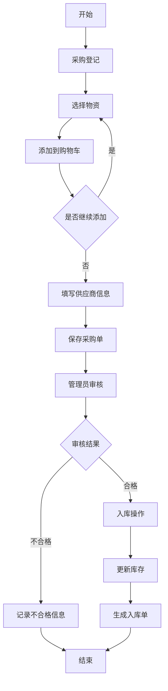

#### 物资借出归还流程

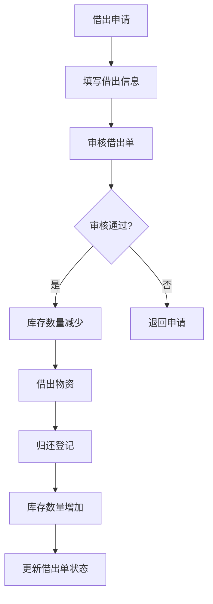

### 5. 经典金句

> “由于本系统中采用了Struts框架，所以在创建实体类时，需要让该类继承Struts的ActionForm类，这样可以减少冗余代码。”（p.40）

> “在实现采购登记时，需要实现一张单据包含多种物资信息的功能，在实现时需要应用购物的原理。”（p.50）

---

## 第8章：办公自动化管理系统（Struts 1.1+Hibernate 3.0+SQL Server 2005实现）

### 1. 核心论点

**问题**：如何实现企业内部人员共享信息、高效协同工作的办公自动化系统？

**观点**：办公自动化管理系统涵盖日常管理、考勤管理、通讯管理等功能，通过Hibernate操作数据库，使用过滤器解决中文乱码，实现权限分级管理。

### 2. 关键概念

- **权限分级**：通过tb_User表的purview字段区分用户权限（系统/只读）
- **字符串处理过滤器（MyFilter）**：实现Filter接口，统一设置请求和响应编码为gb2312
- **Hibernate配置文件（hibernate.properties）**：Java属性文件格式配置数据库连接
- **iframe浮动框架**：使用`<iframe>`实现页面分区布局（top/left/main）
- **比较时间方法（isDateBefore）**：判断上下班登记是否迟到/早退

### 3. 逻辑推演

**系统功能结构**：
- 日常管理：会议管理、公告管理
- 考勤管理：外出登记、请假登记、出差登记、上下班登记
- 通讯管理：按通讯组存储员工通讯信息

**登录验证逻辑**：
```java
Query query = session.createQuery("from User as u where u.userName=:strUserName and u.pwd=:strPwd");
query.setString("strUserName", strUserName);
query.setString("strPwd", strPwd);
list = query.list();
```

**上下班登记实现**：
1. 获取当前时间和公司规定时间（上班08:20，下班17:10）
2. 调用`isDateBefore()`方法比较时间
3. 上班登记：晚于规定时间标记为“迟到”
4. 下班登记：早于规定时间标记为“早退”

**字符串截取**：
使用`substring(0, n)`截取前n个字符，超过长度用“...”代替，保持页面美观。

### 4. 流程图

#### 办公自动化管理系统流程图

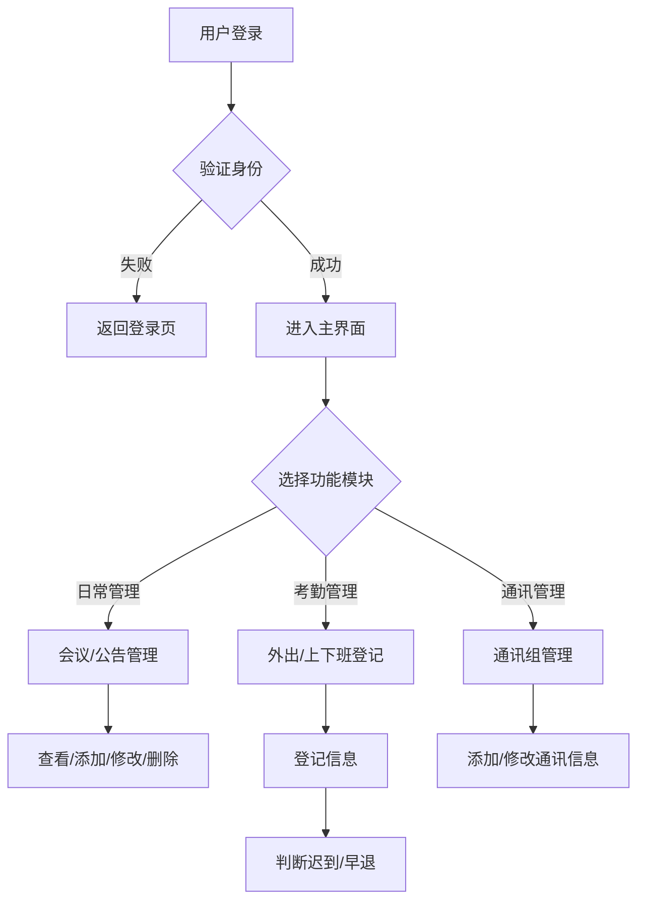

### 5. 经典金句

> “Filter接口中有init()、destroy()、doFilter()3个方法。在调用FilterChain的doFoler()方法时，激活一个相关的过滤器。”（p.92）

> “在开发程序时应该考虑到用户访问网站时可能发生的各种情况，比如用户登录网站后在Session的有效期外进行相应操作，用户会看到一个错误页面。为了避免这种情况发生，在开发系统时应该对Session的有效性进行判断。”（p.123）

---

## 第9章：校园管理系统（Spring+Hibernate+SQL Server 2005实现）

### 1. 核心论点

**问题**：如何整合Spring+Hibernate开发校园管理系统，实现学生档案、成绩、教职工、图书馆等模块管理？

**观点**：校园管理系统采用Spring MVC作为Web层框架，Hibernate作为持久层框架，通过配置文件实现事务管理和依赖注入。

### 2. 关键概念

- **DispatcherServlet前端控制器**：Spring MVC的核心控制器，在web.xml中配置，拦截所有*.htm请求
- **ViewResolver视图解析器**：InternalResourceViewResolver将逻辑视图名解析为JSP路径
- **HibernateDaoSupport**：DAO层继承此类，通过getHibernateTemplate()操作数据库
- **事务代理（TransactionProxyFactoryBean）**：通过配置文件为DAO层添加事务管理
- **多对一关联映射**：成绩实体关联学生实体和课程实体

### 3. 逻辑推演

**Spring MVC配置流程**：
1. web.xml配置DispatcherServlet，拦截*.htm
2. 配置contextConfigLocation参数，加载多个Spring配置文件
3. View_Config.xml配置viewResolver和urlMapping
4. Hibernate_Config.xml配置DataSource、SessionFactory、事务管理

**DAO层设计**：
```java
public class DAOSupport extends HibernateDaoSupport {
    public boolean InsertOrUpdate(Object obj) {
        getHibernateTemplate().saveOrUpdate(obj);
        return true;
    }
    public List QueryObject(String QueryStr) {
        return getHibernateTemplate().find(QueryStr);
    }
}
```

**成绩批量录入**：
- 先验证是否已存在该学生该次考试成绩
- 不存在则循环录入所有课程成绩
- 使用`dao.InsertOrUpdate()`保存

### 4. 流程图

#### Spring MVC请求处理流程

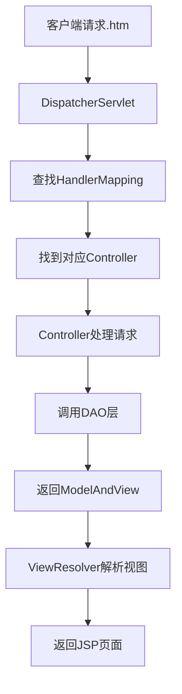

### 5. 经典金句

> “在整个Web MVC架构中，使用者并不是直接连接到所需要的资源，而是先连接到前端控制器，再由前端控制器判断使用者的请求和要分派给哪一个控制器对象来处理请求。”（p.132）

> “创建Servlet类后，还需要对Servlet进行配置，配置的目的是为了将创建的Servlet注册到Servlet容器之中。”（p.164）

---

## 第10章：高校学生选课系统（Struts 1+Hibernate+Spring+MySQL实现）

### 1. 核心论点

**问题**：如何实现高校学生网上选课系统，支持课程管理、专业管理和选课统计？

**观点**：高校学生选课系统整合Struts1、Hibernate、Spring三大框架，实现学生选课、课程管理、专业管理和信息统计（导出PDF/Excel）等功能。

### 2. 关键概念

- **三大框架整合**：Struts负责控制层，Spring负责业务层和事务管理，Hibernate负责持久层
- **DispatchAction**：Struts提供的Action类，可将相关业务操作放在同一个Action中
- **HQL关联查询**：使用from User as u where u.userName=:strUserName形式
- **POI组件**：用于导出Excel格式的统计报表
- **iText组件**：用于导出PDF格式的统计报表

### 3. 逻辑推演

**Struts+Spring整合**：
- 在struts-config.xml中配置`<plug-in>`加载Spring配置文件
- Spring负责管理Action、DAO、Service等Bean
- 通过依赖注入为Action注入DAO对象

**课程管理功能**：
1. 专业管理：添加专业、设置专业结业
2. 课程管理：增加课程、设置课程不可选、按条件搜索课程
3. 信息统计：按条件查询课程听课人数，导出PDF/Excel

**PDF导出实现**：
```java
Document document = new Document(PageSize.A4);
PdfWriter.getInstance(document, out);
document.open();
BaseFont bfChinese = BaseFont.createFont("STSong-Light", "UniGB-UCS2-H", BaseFont.NOT_EMBEDDED);
Font title = new Font(bfChinese, 20, Font.BOLD);
document.add(new Paragraph("课程听课人员名单", title));
PdfPTable table = new PdfPTable(4);
// 添加表头和数据行
document.close();
```

### 4. 流程图

#### 学生选课流程

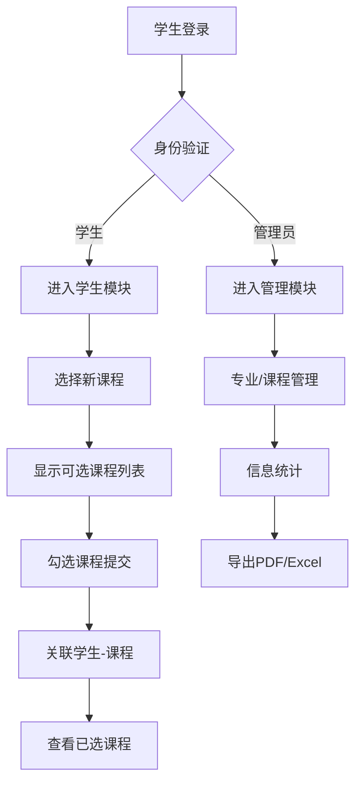

### 5. 经典金句

> “EL表达式的语法以${开头，以}结束，所以在JSP页面中要显示${字符串，必须在前面加上\符号。”（p.195）

> “iText组件用于将听课学生信息导出为PDF格式文档，POI组件用于导出Excel格式文档。”（p.190-191）

---

## 第三篇：JSP项目实战篇

---

## 第11章：网络购物中心(JSP+JavaBean+Ajax实现)

### 1. 核心论点

**问题**：如何用JSP+JavaBean经典模式开发电子商务网站？

**观点**：网络购物中心采用JSP+JavaBean模式（Model1），前台使用Ajax实现无刷新修改购物车数量，后台实现商品、会员、订单、公告管理。

### 2. 关键概念

- **Model1开发模式**：JSP+JavaBean，JSP负责页面显示和流程控制，JavaBean负责业务逻辑
- **购物车Vector实现**：使用Vector存储购物信息，支持动态增删元素
- **Ajax修改购物车数量**：使用XMLHttpRequest异步请求，不刷新页面更新数量和总金额
- **商品分类级联菜单**：通过Ajax根据大分类动态获取小分类
- **会员等级折扣**：根据消费金额自动升级（共5级），下单时按等级打折

### 3. 逻辑推演

**购物车实现**：
- 使用Vector类型变量cart存储在Session中
- 添加商品：检查是否存在，存在则数量+1，否则新增
- 修改数量：通过Ajax调用cart_modify.jsp处理
- 移除商品：使用`cart.removeElementAt(id)`

**会员等级计算**：
```java
ResultSet rs_grade = conn.executeQuery(
    "select Top 1 grade,Amount from tb_rebate where Amount<= " + Amount + 
    " order by grade desc"
);
```

**订单生成**：
- 插入订单主表→获取自动生成订单ID
- 循环插入订单明细→计算合计金额
- 更新会员消费额→更新会员等级

### 4. 流程图

#### Ajax修改购物车流程

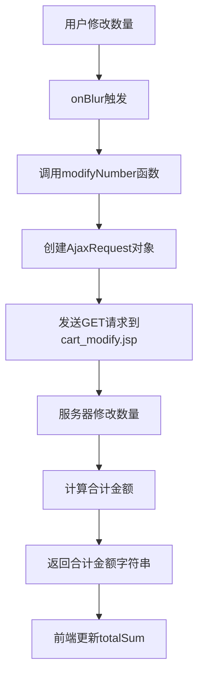

#### 订单生成流程

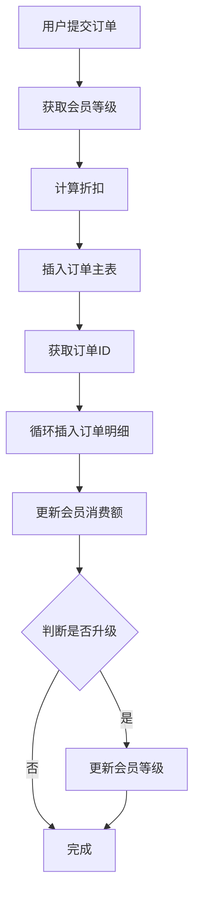

### 5. 经典金句

> “Ajax是Asynchronous JavaScript and XML的缩写，意思是异步的JavaScript与XML。它可以实现客户端的异步请求操作，实现不刷新页面的情况下与服务器进行通信的效果。”（p.7）

> “在验证用户身份时先判断用户名，再判断密码，可以防止用户输入恒等式后直接登录网站。”（p.17）

---

## 第12章：博研图书馆管理系统（JSP+Servlet+JavaBean+MySQL实现）

### 1. 核心论点

**问题**：如何用JSP+Servlet+JavaBean（Model2）模式开发图书馆管理系统？

**观点**：图书馆管理系统采用Model2设计模式，实现图书借阅、续借、归还、图书排行等功能，通过过滤器解决中文乱码，使用左连接查询实现权限管理。

### 2. 关键概念

- **Model2开发模式**：JSP+Servlet+JavaBean，Servlet充当控制器，JSP负责显示
- **左连接查询**：`LEFT JOIN`用于查询管理员及其权限信息（可能无权限记录）
- **过滤器解决中文乱码**：CharacterEncodingFilter实现Filter接口，统一设置编码为GBK
- **图书借阅排行榜**：使用GROUP BY和COUNT统计，LIMIT限制返回行数
- **自动计算归还日期**：借阅日期 + 图书类型对应的最多借阅天数

### 3. 逻辑推演

**Model2架构**：
- **Servlet（控制器）**：接收请求，调用DAO，选择转发页面
- **JSP（视图）**：显示数据，收集用户输入
- **JavaBean（模型）**：封装数据，DAO操作数据库

**权限管理实现**：
- 管理员信息表（tb_manager）存储用户名密码
- 权限表（tb_purview）存储各模块权限（sysset, readerset, bookset, borrowback, sysquery）
- 使用左连接查询，若权限表无记录则权限字段为NULL

**图书借阅流程**：
1. 输入读者条形码→查询读者信息
2. 输入图书条形码→查询图书信息
3. 判断读者是否可继续借阅（不超过可借数量）
4. 插入借阅记录→计算归还日期

### 4. 流程图

#### Model2架构流程图

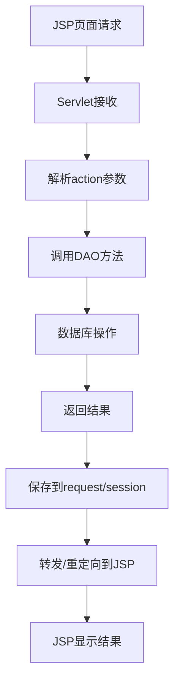

#### 图书借阅流程

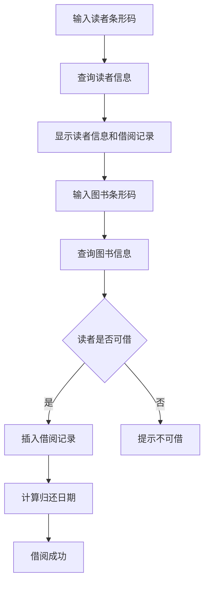

### 5. 经典金句

> “使用<@% page import="packageName.className" %>中，page指令的import属性用来说明在后面代码中将要使用的类和接口。”（p.63）

> “在MySQL中左连接的语法格式为：SELECT table1.*,table2.* FROM table1 LEFT JOIN table2 ON table1.fieldname1 = table2.fieldname1。”（p.61）

---

## 第13章：讯友网络相册（JSP+Servlet+SQL Server 2005实现）

### 1. 核心论点

**问题**：如何实现支持批量上传、水印生成、幻灯片播放的网络相册系统？

**观点**：讯友网络相册采用JSP+Servlet模式，实现相片分栏显示、批量上传、缩略图生成、水印添加、幻灯片播放等功能。

### 2. 关键概念

- **缩略图生成**：使用ImageIO读取图片，BufferedImage绘制缩小图，JPEGImageEncoder编码输出
- **水印生成**：使用Graphics2D在图片上绘制透明文字，设置透明度AlphaComposite
- **幻灯片播放**：CSS RevealTrans滤镜实现图片切换特效，支持24种过渡效果
- **动态操作表单**：JavaScript的createElement()和appendChild()实现批量上传表单动态增减
- **ffmpeg视频转换**：使用ffmpeg.exe将视频转换为FLV格式（虽本章主要为相册，但提及视频处理）

### 3. 逻辑推演

**批量上传实现**：
1. 使用jspSmartUpload组件接收文件
2. 动态生成表单（通过JavaScript添加/删除file输入框）
3. 循环处理上传文件，调用`photo_save()`保存到数据库

**水印生成核心代码**：
```java
Graphics2D g = bimage.createGraphics();
g.setColor(Color.red);
g.setFont(new Font(markContent, Font.BOLD, 200));
g.setComposite(AlphaComposite.getInstance(AlphaComposite.SRC_OVER, 0.5f)); // 50%透明
g.rotate(0.3f); // 旋转30度
g.drawString(markContent, width/3, height/3);
```

**缩略图生成核心代码**：
```java
Image src = ImageIO.read(file);
BufferedImage tag = new BufferedImage(width, height, BufferedImage.TYPE_INT_RGB);
tag.getGraphics().drawImage(src, 0, 0, width, height, null);
JPEGImageEncoder encoder = JPEGCodec.createJPEGEncoder(out);
encoder.encode(tag);
```

### 4. 流程图

#### 相片上传流程

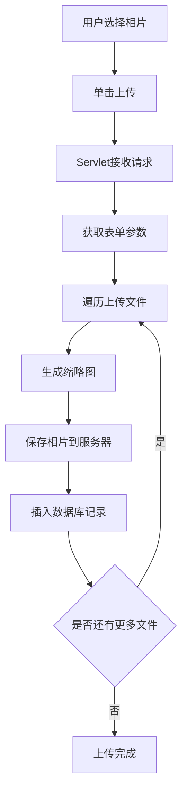

#### 生成水印流程

```mermaid
graph TD
    A[用户输入水印文字] --> B[提交表单]
    B --> C[获取源相片路径]
    C --> D[读取源相片]
    D --> E[获取宽高]
    E --> F[创建BufferedImage]
    F --> G[创建Graphics2D]
    G --> H[设置颜色/字体/透明度]
    H --> I[绘制水印文字]
    I --> J[输出新相片]
    J --> K[更新数据库]
```

### 5. 经典金句

> “动态操作上传表单指的就是用户可以在网页中随意增加或减少表单的个数，通过JavaScript脚本语言实现。”（p.109）

> “RevealTrans滤镜提供了更加多变的转换效果，transition参数有24种取值，代表24种显示类型。”（p.102）

> “Servlet多业务处理主要根据URL参数值不同从而执行不同的方法。”（p.121）

---

## 第14章：企业门户网站（JSP+JavaBean+MySQL实现）

### 1. 核心论点

**问题**：如何通过企业门户网站展示企业产品、提供软件下载和解决方案？

**观点**：企业门户网站采用JSP+JavaBean模式，使用抽象工厂模式设计数据库操作，实现软件展示、下载、留言、后台管理等功能。

### 2. 关键概念

- **抽象工厂模式**：BasetableFactory抽象工厂 + DbBasetableFactory具体工厂，实现数据库操作解耦
- **分页类HtmlUtils**：封装分页导航HTML生成，支持动态传递URL参数
- **防止SQL注入**：StringUtils.StringtoSql()方法过滤危险字符（;、&、<、>、'、--、/、%）
- **防止IE缓存**：response.setHeader("Pragma","No-cache")等方法
- **MySQL批量添加**：修改my.ini文件，删除STRICT_TRANS_TABLES

### 3. 逻辑推演

**抽象工厂模式实现**：
- **抽象工厂**：BasetableFactory定义getRow()、ListGuestboard()、CreateGuestboard()等抽象方法
- **具体工厂**：DbBasetableFactory实现抽象方法
- **抽象产品**：Guestboard定义留言实体属性
- **具体产品**：Dbguestboard继承Guestboard，实现Insert()、Select()等方法

**前台首页组成**：
- 使用`<jsp:include>`包含：top.jsp（导航）、search.jsp（搜索）、版权信息等模块

**后台框架**：
- 使用`<iframe>`实现：topFrame（顶部导航）、leftFrame（左侧菜单）、mainFrame（主要内容）

### 4. 流程图

#### 抽象工厂模式结构

```mermaid
graph TD
    A[BasetableFactory抽象工厂] --> B[DbBasetableFactory具体工厂]
    B --> C[Dbguestboard具体产品]
    C --> D[Guestboard抽象产品]
    
    E[客户端代码] --> A
    E -.->|getInstance()| B
    B -.->|CreateGuestboard()| C
```

#### 后台框架布局

```mermaid
graph TD
    A[后台首页index.jsp] --> B[顶部top.jsp]
    A --> C[左侧left.jsp]
    A --> D[主要内容mainFrame]
    C --> E[功能链接target=mainFrame]
    E --> D
```

### 5. 经典金句

> “在JSP中，防止IE缓存JSP文件有两种方法，一种是使用Java提供的方法，另一种使用HTML标记实现。”（p.156）

> “在默认情况下，MySQL是不支持批量添加数据的，解决该问题的方法是修改my.ini文件，删除STRICT_TRANS_TABLES。”（p.156）

---

## 第15章：芝麻开门博客网（JSP+Servlet+JavaBean+SQL Server 2005实现）

### 1. 核心论点

**问题**：如何开发一个支持多媒体（视频）上传播放的博客系统？

**观点**：芝麻开门博客网在传统博客功能基础上，增加了影音管理模块，支持视频上传、格式转换（FLV）、在线播放、视频截图等功能。

### 2. 关键概念

- **jspSmartUpload组件**：用于文件上传，支持多文件、限制文件类型
- **ffmpeg视频转换**：调用ffmpeg.exe将多种视频格式转换为FLV（Flash视频）
- **视频截图**：使用ffmpeg从视频中截取指定时间的画面作为缩略图
- **Flash播放器嵌入**：使用`<object>`标签嵌入FLV播放器，通过`<param>`传递视频地址
- **过滤器实现登录验证**：NeedLogonFilter过滤/my/admin/*路径，判断用户是否登录

### 3. 逻辑推演

**视频上传流程**：
1. 使用jspSmartUpload接收上传文件
2. 验证文件类型（avi、asf、3gp、mpg、mov、mp4、wmv、flv）
3. 保存临时文件到temp目录
4. 调用ffmpeg.exe转换为FLV格式
5. 调用ffmpeg.exe截取第1帧作为视频截图
6. 删除临时文件，保存记录到数据库

**ffmpeg调用**：
```java
ProcessBuilder pb = new ProcessBuilder(command);
pb.redirectErrorStream(true);
Process p = pb.start();
```

**文章评论模块**：
- 支持匿名评论（勾选“匿名发表”复选框）
- 过滤器判断：匿名评论不要求登录，实名评论要求登录

### 4. 流程图

#### 视频上传转换流程

```mermaid
graph TD
    A[选择视频文件] --> B[上传到服务器]
    B --> C[验证文件类型]
    C -->|不合法| D[返回错误]
    C -->|合法| E[保存临时文件]
    E --> F[调用ffmpeg转FLV]
    F --> G{转换成功?}
    G -->|否| H[删除临时文件]
    G -->|是| I[调用ffmpeg截图]
    I --> J[生成缩略图]
    J --> K[删除临时文件]
    K --> L[保存到数据库]
```

#### 文章评论流程

```mermaid
graph TD
    A[用户填写评论] --> B{是否匿名}
    B -->|是| C[作者显示为“明日网友”]
    B -->|否| D[获取登录用户名]
    D --> E{NeedLogonFilter}
    E -->|未登录| F[提示登录]
    E -->|已登录| C
    C --> G[保存评论到数据库]
```

### 5. 经典金句

> “如今，在各大网站中提供的在线视频播放功能，播放的都是FLV格式的文件，它是Flash动画文件。”（p.196）

> “为了防止文件重复，将当前时间转换为一个类似‘080820080808’形式的字符串，为上传的视频及图片进行命名。”（p.164）

---

## 第16章：进销存管理系统（JSP+JavaBean+JFreeChart+SQL Server 2005实现）

### 1. 核心论点

**问题**：如何实现企业进销存管理，包括进货、销售、库存和财务结算？

**观点**：进销存管理系统采用JSP+JavaBean模式，使用JFreeChart生成年销售额分析图表，实现商品入库、销售、库存查询、价格调整、销售排行等功能。

### 2. 关键概念

- **JFreeChart图表组件**：用于生成3D柱状图，分析年销售额
- **自定义分页查询QuestString**：封装查询条件（字段、运算符、关键字、时间范围、排序）
- **自动计算**：金额=单价×数量，应付=合计金额，未付=应付-实付
- **库存管理**：入库时判断是否存在，存在则更新数量，否则新增
- **子查询实现月销售额**：使用UNION和GetMonth()函数生成12个月完整数据

### 3. 逻辑推演

**年销售额图表生成**：
```java
DefaultCategoryDataset dataset = new DefaultCategoryDataset();
// 循环12个月添加数据
for (int j = 1; j <= 12; j++) {
    dataset.addValue(sumj, j + "月", j + "月");
}
JFreeChart chart = ChartFactory.createBarChart3D(
    year + "年销售额分析图", "月份", "销量", 
    dataset, PlotOrientation.VERTICAL, true, false, false
);
String fileName = ServletUtilities.saveChartAsPNG(chart, 500, 300, info, session);
```

**月销售额SQL**：
```sql
SELECT * FROM (
    SELECT SUM(je) AS sumje, MONTH(xsdate) AS xmonth FROM tb_sell 
    WHERE YEAR(xsdate)=2008 GROUP BY MONTH(xsdate)
    UNION
    SELECT 0, MonthName FROM GetMonth() WHERE MonthName NOT IN (
        SELECT MONTH(xsdate) FROM tb_sell WHERE YEAR(xsdate)=2008
    )
) temp ORDER BY temp.xmonth
```

**价格调整**：
- 通过隐藏表单传递商品基本信息（spbh、kcje、dj）
- 使用JavaScript的`autoje()`自动计算金额

### 4. 流程图

#### 商品入库流程

```mermaid
graph TD
    A[选择商品] --> B[自动填充商品信息]
    B --> C[输入数量/单价/经手人]
    C --> D[自动计算金额]
    D --> E[填写实付金额]
    E --> F[自动计算未付款]
    F --> G[保存入库信息]
    G --> H{库存中是否有该商品}
    H -->|有| I[更新库存数量]
    H -->|无| J[插入库存记录]
    I --> K[保存入库单]
    J --> K
```

#### 年销售额图表生成

```mermaid
graph TD
    A[选择年份] --> B[查询月销售额]
    B --> C[调用GetMonth()生成月份]
    C --> D[UNION合并空月份]
    D --> E[排序月份]
    E --> F[创建DefaultCategoryDataset]
    F --> G[循环添加数据]
    G --> H[创建JFreeChart图表]
    H --> I[保存为PNG图片]
    I --> J[在页面显示]
```

### 5. 经典金句

> “在实现进销存管理系统时，需要实现年销售额分析功能，最关键的部分是如何统计出指定年份的月销售额。”（p.28）

> “PreparedStatement不但能提高数据库的总体性能，同时传递给PreparedStatement对象的参数可以被强制进行类型转换。”（p.99-100）

---

## 第17章：网上淘书吧（JSP+JavaBean+SQL Server 2005实现）

### 1. 核心论点

**问题**：如何开发一个B2C网上书店系统？

**观点**：网上淘书吧实现图书展示、购物车、订单生成、会员管理、图书管理等功能，核心是购物车的Session存储和订单生成时的会员折扣计算。

### 2. 关键概念

- **购物车Vector实现**：使用Vector存储bookelement对象（ISBN、price、number）
- **会员等级折扣**：通过视图V_Member关联会员表和折扣表，计算折扣
- **图书分类分组查询**：使用`GROUP BY Type`获取所有图书类别
- **销售排行**：使用子查询统计销售数量TOP10，再连接图书表获取详情
- **safe.jsp安全验证**：后台每个页面包含safe.jsp，验证管理员是否登录

### 3. 逻辑推演

**购物车实现**：
- 存储结构：Vector<bookelement>存储在Session
- 添加图书：遍历检查ISBN是否已存在，存在则数量+1
- 修改数量：通过name属性`num{index}`区分不同商品

**订单生成**：
1. 从Session获取购物车和登录用户
2. 查询会员等级计算折扣
3. 插入订单主表，获取订单ID
4. 循环插入订单明细
5. 更新会员消费额，判断升级
6. 清空购物车

**视图应用**：
- `V_Member`：关联tb_Member和tb_rebate，获取会员折扣
- `V_order_detail`：关联tb_order_detail和tb_bookinfo，获取订单详情中的图书信息

### 4. 流程图

#### 购物车流程

```mermaid
graph TD
    A[用户点击购买] --> B{Session中是否有cart}
    B -->|否| C[创建Vector]
    B -->|是| D[获取cart]
    C --> E[创建bookelement]
    D --> F{ISBN是否存在}
    F -->|存在| G[数量+1]
    F -->|不存在| E
    G --> H[更新cart]
    E --> H
    H --> I[保存回Session]
```

### 5. 经典金句

> “在显示重点推荐图书时采用了分栏技术，应用for语句循环显示结果集中的记录，并应用if...else语句根据循环增量与2(分栏数)求模后的值显示相应的内容。”（p.40）

> “购物车是采用Vector类型的变量cart来存储购物数据的，并将其保存在session中。”（p.47）

---

## 第18章：新奥家电连锁网络系统（JSP+JavaBean+SQL Server 2005实现）

### 1. 核心论点

**问题**：如何实现家电连锁企业的统一管理，实现总部与分店的信息共享？

**观点**：新奥家电连锁网络系统实现产品展示、销售登记、权限管理，根据用户类型（管理员/连锁店用户）显示不同操作权限，实现连锁店数据统一管理。

### 2. 关键概念

- **权限分级**：USER表中的usertype字段（2-管理员，1-连锁店用户）
- **逻辑删除**：各表的status字段（0-正常，1-删除），数据并非物理删除
- **SEQUENCETABLE次序表**：管理各表ID的自增长（因为SQL Server表中ID非自动增长）
- **弹出页面**：使用`window.open()`展示产品详细信息
- **PreparedStatement提高性能**：预编译SQL，支持类型强制转换

### 3. 逻辑推演

**权限验证**：
- 用户登录后，shop对象保存到Session
- 根据usertype值判断权限（1-连锁店，2-管理员）
- 页面中根据权限显示/隐藏操作按钮

**逻辑删除实现**：
- 删除操作实际执行`UPDATE [USER] SET [Status]=1 WHERE [Id]=?`
- 查询时添加`WHERE STATUS<>1`过滤已删除记录

**ID生成**：
- 使用DbSequenceManager.nextID(FinalConstants.T_SHOP)获取新ID
- 避免多用户同时操作时ID冲突

### 4. 流程图

#### 权限验证流程

```mermaid
graph TD
    A[用户登录] --> B[查询USER表]
    B --> C{用户名密码正确?}
    C -->|否| D[返回登录页]
    C -->|是| E[获取usertype]
    E --> F{usertype=2?}
    F -->|是| G[管理员权限]
    F -->|否| H[连锁店用户权限]
    G --> I[显示全部功能]
    H --> J[显示部分功能]
```

### 5. 经典金句

> “在删除等操作中，系统并不是真正地删除信息，而是将数据库中的STATUS字段设置为标识，在读取数据信息时进行判断，从而达到删除的效果。”（p.76）

> “本系统开发的过程中就是应用PreparedStatement接口来执行SQL语句，PreparedStatement不但能提高数据库的总体性能，同时传递给PreparedStatement对象的参数可以被强制进行类型转换。”（p.99-100）

---

## 第19章：大学生就业求职网（JSP+JavaBean+SQL Server 2005实现）

### 1. 核心论点

**问题**：如何实现大学生和企业之间的在线求职招聘平台？

**观点**：大学生就业求职网支持学生和企业双角色注册、登录，实现求职/招聘信息发布、邮件群发、信息模糊查询等功能。

### 2. 关键概念

- **双角色系统**：学生和企业共用同一登录入口，通过select区分角色
- **邮件群发**：使用JMail组件，支持一次发送给多个收件人
- **模糊查询**：SQL中使用LIKE关键字配合%实现
- **Session存储登录状态**：学生登录后session.setAttribute("use","student")
- **权限控制**：后台管理员单独验证，使用tb_admin表

### 3. 逻辑推演

**邮件群发实现**：
- 最多支持10个收件人
- 收件人邮箱存储在数组中，使用for循环发送
- 发件人邮箱从数据库当前登录用户查询

**信息发布流程**：
1. 用户填写发布表单
2. 过滤特殊字符和空格
3. 插入到tb_sjob（求职）或tb_cjob（招聘）
4. 设置发布时间和有效时间

**查询实现**：
- 学生信息管理：`SELECT * FROM tb_student`
- 求职信息管理：`SELECT * FROM tb_sjob`
- 友情链接管理：增删改查

### 4. 流程图

#### 双角色登录流程

```mermaid
graph TD
    A[输入用户名密码] --> B{选择角色}
    B -->|学生| C[查询tb_student]
    B -->|企业| D[查询tb_company]
    C --> E{验证通过?}
    D --> E
    E -->|否| F[提示错误]
    E -->|是| G[session存储角色]
    G --> H[跳转对应控制台]
```

#### 邮件群发流程

```mermaid
graph TD
    A[填写收件人] --> B[最多10个]
    B --> C[填写主题和内容]
    C --> D[提交]
    D --> E[从数据库获取发件人邮箱]
    E --> F[遍历收件人数组]
    F --> G[发送邮件]
    G --> H{是否还有收件人}
    H -->|是| F
    H -->|否| I[发送完成]
```

### 5. 经典金句

> “在过滤用户提交的数据时，要使用trim()方法去掉字符串后面的空格，因为在向数据库插入数据时，空格会被当做字符串插入数据库。”（p.116）

> “解决中文乱码问题可以通过在page指令的下方加上调用request对象的setCharacterEncoding()方法将编码设置为UTF-8或是GBK解决。”（p.135）

---

## 第20章：华奥汽车销售集团网（JSP+JavaBean+SQL Server 2005实现）

### 1. 核心论点

**问题**：如何设计支持动态参数名称的车辆数据库，实现车辆信息灵活管理？

**观点**：华奥汽车销售集团网采用“参数-值”分离的数据库设计，通过tb_Basic1（一级参数）、tb_Basic2（二级参数）、tb_Values（参数值）实现动态车辆参数管理，使用交叉表查询将行数据转换为列显示。

### 2. 关键概念

- **动态字段设计**：参数名称存储在tb_Basic2，参数值存储在tb_Values，支持动态增减参数
- **交叉表查询（CrossTable）**：使用CASE WHEN + GROUP BY将行数据转为列
- **二进制数据流处理**：SendGet类提取multipart/form-data表单数据
- **分页组件Pages**：支持指定每页显示记录数
- **树状菜单生成**：PopMenu类动态生成导航菜单HTML

### 3. 逻辑推演

**数据库设计逻辑**：
- tb_Cars：车辆类别（乘用车、商用车）
- tb_Basic1：一级参数（基本参数、外形参数、底盘参数等）
- tb_Basic2：二级参数（品牌、型号、售价等），关联tb_Basic1和tb_Cars
- tb_Values：存储具体车辆的参数值，关联tb_Basic2和车辆Logo

**交叉表查询核心**：
```sql
SELECT tb_Values.Logo,
    MIN(CASE Name WHEN '品牌' THEN tb_Values.Price END) AS '品牌',
    MIN(CASE Name WHEN '型号' THEN tb_Values.Price END) AS '型号'
FROM tb_Basic2 INNER JOIN tb_Values ON tb_Basic2.ID = tb_Values.Homol
GROUP BY tb_Values.Logo
```

**数据添加**：
- 使用SendGet类以数据流形式读取表单（因表单含file控件）
- 循环处理每个参数，调用caradd.getint()保存

### 4. 流程图

#### 交叉表查询流程

```mermaid
graph TD
    A[查询车辆类别] --> B[获取该类别下所有二级参数]
    B --> C[构建CASE WHEN语句]
    C --> D[拼接MIN聚合函数]
    D --> E[INNER JOIN tb_Values]
    E --> F[GROUP BY Logo]
    F --> G[结果集：一行代表一辆车，列为参数名]
```

#### 数据流读取表单

```mermaid
graph TD
    A[客户端提交表单] --> B[ServletInputStream获取二进制流]
    B --> C[解析boundary分隔符]
    C --> D[提取每个控件数据]
    D --> E[获取控件name和value]
    E --> F[存储到对象]
```

### 5. 经典金句

> “本地数据流在传输上没有网络数据流所遇到的问题，所以也就不需要判断数据读取是否完全。”（p.170）

> “为了防止用户绕过登录系统而非法进入系统，可以使用Session对象来验证用户是否已经登录。”（p.170）

---

## 第21章：科研成果申报管理系统（JSP+JavaBean+SQL Server 2005实现）

### 1. 核心论点

**问题**：如何实现科研成果的远程申报和审批管理？

**观点**：科研成果申报管理系统分为申报员和审批员双角色，实现成果/课题申报、审批入库、信息查询等功能，使用BETWEEN实现日期范围查询。

### 2. 关键概念

- **双角色系统**：申报员（申报成果/课题）、审批员（审核入库）
- **BETWEEN日期查询**：`WHERE Dattime BETWEEN '开始日期' AND '结束日期'`
- **批量删除**：使用复选框选择多条记录，JavaScript收集ID后批量提交
- **浮动框架（iframe）**：审批员控制台使用iframe布局
- **中文乱码解决**：超链接传递中文需进行转码`new String(tem,"gb2312")`

### 3. 逻辑推演

**批量删除实现**：
```javascript
function SelectChk() {
    var strid = "";
    for (j = 0; j < n.length; j++) {
        if (self.document.all.item("dept", j).checked) {
            strid = strid + "," + deptid;
        }
    }
    myform.action = "del.jsp?id=" + strid;
    myform.submit();
}
```

**日期范围查询**：
```sql
SELECT * FROM tb_Result WHERE Dattime BETWEEN '2008-01-01' AND '2008-12-31'
```

**成果申报流程**：
1. 申报员登录
2. 填写成果信息（名称、领域、字数、发表时间等）
3. 提交时检查名称是否重复
4. 审批员登录后查看未入库成果
5. 审核通过则设置Whether=1（已入库）

### 4. 流程图

#### 成果申报审批流程

```mermaid
graph TD
    A[申报员登录] --> B[填写成果信息]
    B --> C{成果名称是否重复}
    C -->|是| D[提示重新填写]
    C -->|否| E[保存到数据库]
    E --> F[状态Whether=0未入库]
    F --> G[审批员登录]
    G --> H[查看未入库成果]
    H --> I{审核通过?}
    I -->|是| J[设置Whether=1]
    I -->|否| K[退回修改]
```

#### 批量删除流程

```mermaid
graph TD
    A[勾选多条记录] --> B[单击删除]
    B --> C[JavaScript遍历复选框]
    C --> D[收集ID用逗号分隔]
    D --> E[提交到删除页面]
    E --> F[WHERE id IN (id列表)]
    F --> G[批量删除]
```

### 5. 经典金句

> “BETWEEN运算符可以用在WHERE子句中选取给定范围的列值所在行，BETWEEN运算符是包含性的，即首尾的值也是符合条件的。”（p.181）

> “为了解决超链接传递中文乱码问题，需重新定义中文的编码规则：new String(tem,"gb2312")。”（p.193-194）

---

## 后记

本书通过21个完整项目案例，系统展示了Java Web开发的主流技术栈和开发模式：

- **框架篇**（SSH2/SSH）：适合中大型企业级应用，实现分层解耦
- **实战篇**（JSP+JavaBean）：适合快速开发中小型项目，简单直观

核心技术覆盖：MVC模式、ORM映射、依赖注入、AOP事务、Ajax异步交互、图表生成、文件上传、视频转换、邮件群发等。

读者可通过学习这些项目，掌握Java Web开发的全流程，积累项目经验，快速提升开发能力。