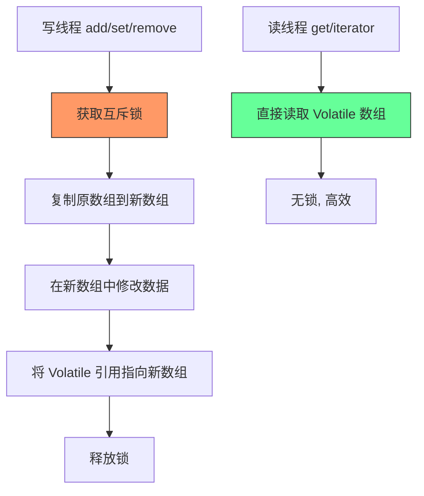
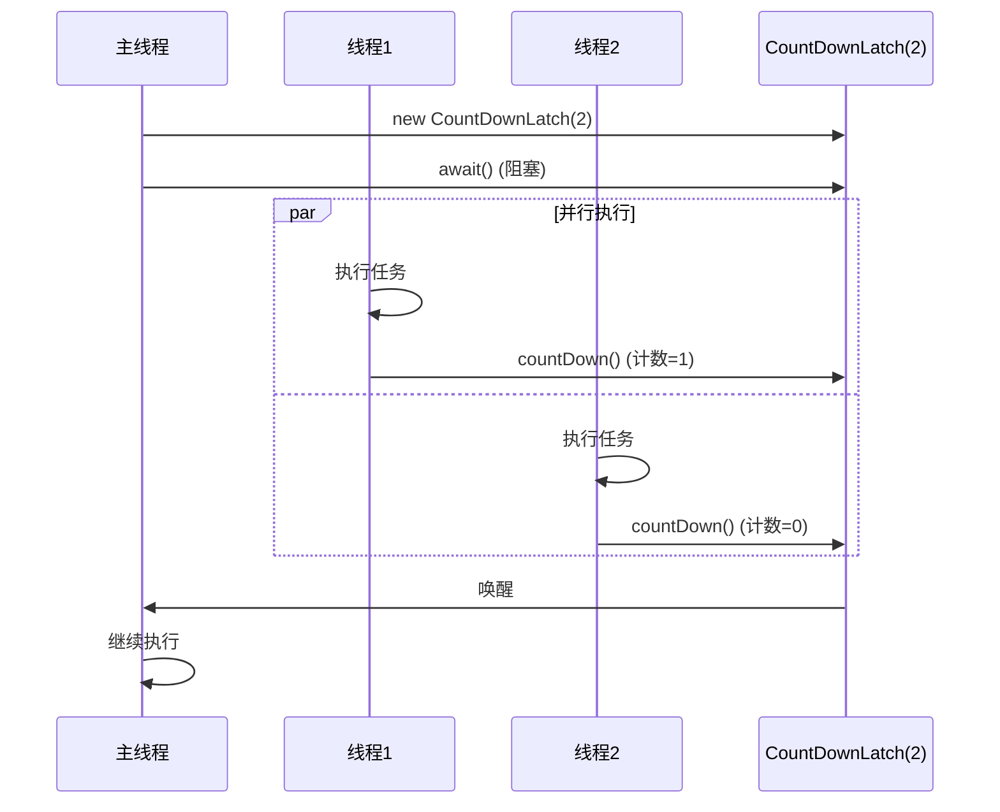
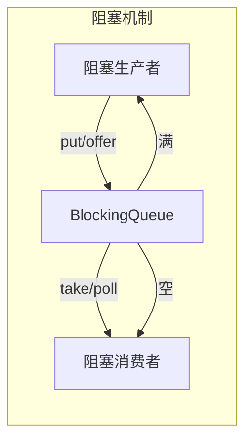
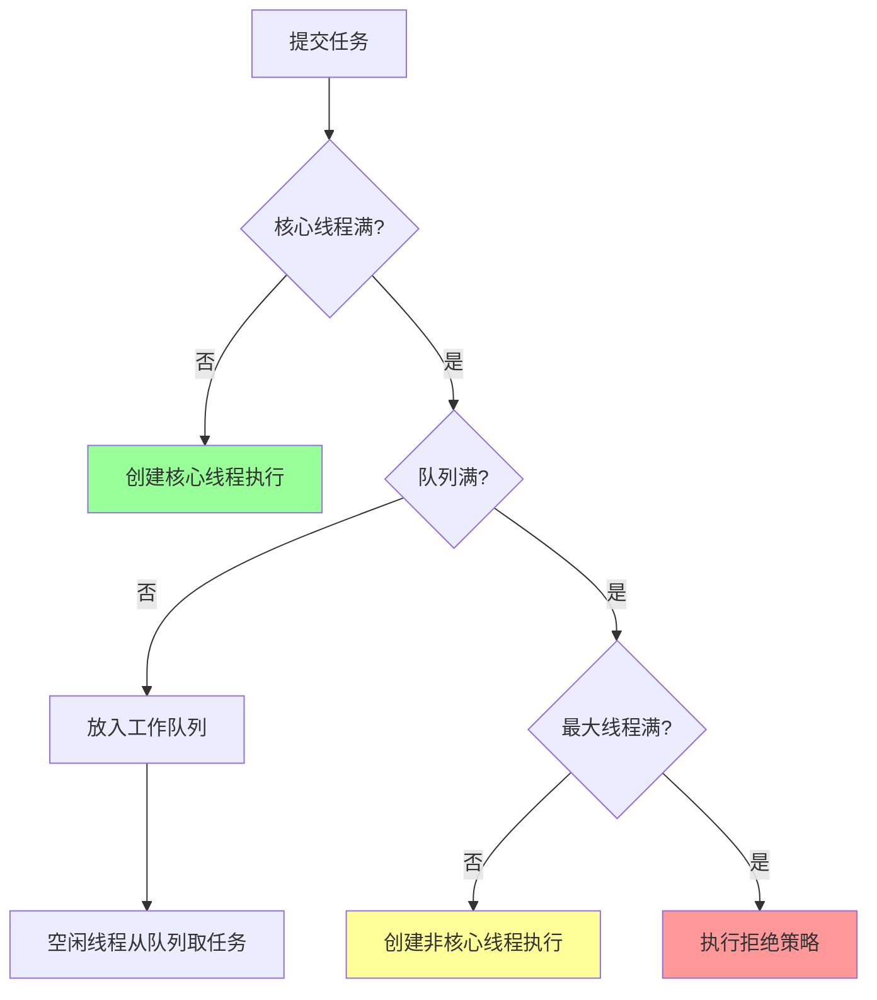
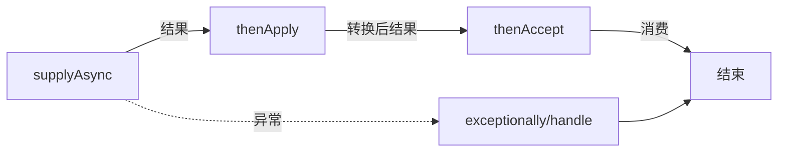

# 《尚硅谷高级技术之JUC高并发编程》章节总结

## 书籍信息
- **书名**：尚硅谷高级技术之 JUC 高并发编程
- **作者/机构**：尚硅谷（Atguigu）
- **PDF 状态**：文本可提取，结构清晰
- **OCR 状态**：良好，代码片段与核心概念完整

## 目录说明
- **目录识别情况**：文档包含明确的课程概览，共12个主要模块。
- **章节对应依据**：依据文档中的标题层级（如 `1什么是 JUC`, `2 Lock接口` 等）进行划分。
- **OCR 修复说明**：部分代码中的空格和特殊字符（如 `Obj ect`）已根据上下文修正为 `Object`，以确保代码可读性。

## 全书核心主题
本书是 Java 并发编程（JUC, `java.util.concurrent`）的高级技术指南。旨在帮助开发者从基础的线程概念深入至高性能并发工具的使用。全书围绕“线程安全”、“线程通信”、“线程池优化”及“异步编程”四大核心领域展开。通过对比 `synchronized` 与 `Lock`、解析集合线程安全问题、详解三大辅助类（CountDownLatch, CyclicBarrier, Semaphore）、阻塞队列原理、线程池底层机制以及 CompletableFuture 异步编排，构建了一套完整的 Java 高并发知识体系。重点强调了在生产环境中如何避免死锁、OOM 以及如何提高并发效率。

---

## 第1章：什么是 JUC

### 核心论点
本章旨在厘清并发编程的基础概念，区分进程与线程、并发与并行，并介绍 JUC 包的起源及线程的生命周期状态，为后续深入学习奠定理论基础。

### 关键概念/事件
- **JUC (java.util.concurrent)**：JDK 1.5 引入的处理线程的工具包简称。
- **进程与线程**：进程是资源分配的最小单位；线程是 CPU 调度的最小单位。
- **线程状态**：NEW, RUNNABLE, BLOCKED, WAITING, TIMED_WAITING, TERMINATED。
- **并发 vs 并行**：并发是同一时刻多个线程访问同一资源（现象）；并行是多任务同时执行（多核 CPU）。
- **管程 (Monitor)**：JVM 中同步基于进入和退出管程对象实现，每个对象都有一个 Monitor。
- **用户线程 vs 守护线程**：用户线程结束 JVM 才结束；若只剩守护线程，JVM 退出。

### 逻辑推演/叙事脉络
首先定义 JUC 及其历史背景。接着辨析操作系统层面的进程与线程概念，明确线程是执行的最小单元。随后详细列举 Java 线程的六种状态，并重点对比 `wait()` 与 `sleep()` 的区别（是否释放锁、所属类不同）。最后，通过串行、并行、并发的对比，阐明高并发场景下的资源竞争本质，并引入管程概念解释 JVM 同步机制底层原理。

### 经典金句/数据
> “并发：同一时刻多个线程在访问同一个资源，多个线程对一个点。”
> “并行：多项工作一起执行，之后再汇总。”
> “当主线程结束后，用户线程还在运行，JVM 存活；如果没有用户线程，都是守护线程，JVM 结束。”

---

## 第2章：Lock 接口

### 核心论点
本章对比传统 `synchronized` 关键字与 `Lock` 接口，指出 `Lock` 在灵活性、中断响应、超时获取及读写分离方面的优势，并详细介绍 `ReentrantLock` 和 `ReentrantReadWriteLock` 的使用。

### 关键概念/事件
- **Synchronized**：内置关键字，自动加锁/解锁，异常自动释放，不可中断等待。
- **Lock 接口**：需手动 `lock()`/`unlock()`，通常在 `finally` 块中释放，支持尝试获取锁 (`tryLock`) 和中断响应。
- **Condition**：配合 Lock 使用，实现精确唤醒（`signal()`/`await()`），替代 `wait()/notify()`。
- **ReentrantLock**：可重入锁，唯一实现 Lock 接口的常用类。
- **ReentrantReadWriteLock**：读写锁，读锁共享，写锁排他，提升读多写少场景性能。

### 逻辑推演/叙事脉络
从 `synchronized` 的局限性（无法中断、无法超时、效率低）引出 `Lock` 接口。通过售票案例展示 `synchronized` 用法，再对比 `Lock` 的手动释放机制。深入讲解 `Lock` 的核心方法，特别是 `newCondition` 实现的精准通知。最后引入读写锁，解决读操作互斥导致的效率低下问题，强调“读共享、写独占”的特性。

### 流程图重建

```mermaid
graph TD
    A[线程请求锁] --> B{锁类型?}
    B -->|Synchronized| C[JVM 自动管理]
    C --> D[执行同步代码]
    D --> E[异常或结束自动释放]
    
    B -->|Lock| F[手动 lock()]
    F --> G[try-finally 块]
    G --> H[执行业务逻辑]
    H --> I[finally 中 unlock()]
    
    style C fill:#f9f,stroke:#333
    style F fill:#ff9,stroke:#333
```

### 经典金句/数据
> “Lock 和 synchronized 有一点非常大的不同... Lock 则必须要用户去手动释放锁，如果没有主动释放锁，就有可能导致出现死锁现象。”
> “如果有一个线程已经占用了读锁，则此时其他线程如果要申请写锁，则申请写锁的线程会一直等待释放读锁。”

---

## 第3章：线程间通信

### 核心论点
本章通过“交替加减”和“定制化打印”两个经典案例，展示如何使用 `synchronized/wait/notify` 和 `Lock/Condition` 实现线程间的精确协作与顺序控制。

### 关键概念/事件
- **共享内存模型**：线程通过共享变量进行通信。
- **wait/notify**：必须在 synchronized 代码块中使用，`wait` 释放锁，`notify` 随机唤醒。
- **await/signal**：必须在 Lock 代码块中使用，`await` 释放锁，`signal` 可指定唤醒特定 Condition 的线程。
- **虚假唤醒**：使用 `while` 循环判断条件而非 `if`，防止线程被意外唤醒后条件不满足仍执行。

### 逻辑推演/叙事脉络
首先提出“两个线程交替加减1”的需求。分别用 `synchronized` 方案（利用 `wait/notifyAll`）和 `Lock` 方案（利用 `Condition.await/signalAll`）实现，强调 `while` 判断的重要性。进而升级到“三个线程按顺序打印 A/B/C”的复杂场景，展示 `Lock` 配合多个 `Condition` 对象如何实现线程的定制化精准通信，这是 `synchronized` 难以优雅实现的。

### 经典金句/数据
> “注意：在调用 Condition 的 await()/signal() 方法前，也需要线程持有相关的 Lock 锁。”
> “使用 while(number!=0) 而不是 if，是为了防止虚假唤醒。”

---

## 第4章：集合的线程安全

### 核心论点
本章分析 ArrayList 等集合在多线程下的 `ConcurrentModificationException` 异常原因，并提供三种解决方案：Vector、Collections.synchronizedList 和 CopyOnWriteArrayList，重点推荐后者。

### 关键概念/事件
- **Fail-Fast 机制**：迭代过程中修改集合结构会抛出异常。
- **Vector**：古老线程安全类，方法加 `synchronized`，效率低。
- **Collections.synchronizedList**：包装器模式，同样使用 `synchronized`，迭代时需手动同步。
- **CopyOnWriteArrayList**：写时复制技术。写操作加锁并复制新数组，读操作无锁。适合读多写少场景。

### 逻辑推演/叙事脉络
通过多线程向 ArrayList 添加元素触发异常的现象，引出线程安全问题。依次评估 Vector（过时、效率低）、Collections 工具类（仍需手动处理迭代同步）的不足。重点剖析 `CopyOnWriteArrayList` 的原理：利用 Volatile 数组保证可见性，写时加锁并复制数组，实现读写分离，从而在保证线程安全的同时最大化读性能。

### 流程图重建



### 经典金句/数据
> “CopyOnWriteArrayList 的思想：当我们往一个容器添加元素的时候，不直接往当前容器添加，而是先将当前容器进行 Copy... 再将原容器的引用指向新的容器。”

---

## 第5章：多线程锁

### 核心论点
本章通过“锁的八种情形”面试题，深入剖析 `synchronized` 锁的对象本质，区分实例锁（this）与类锁（Class对象），明确静态同步方法与非静态同步方法的锁竞争关系。

### 关键概念/事件
- **实例锁**：非静态 synchronized 方法，锁的是当前实例对象。
- **类锁**：静态 synchronized 方法，锁的是类的 Class 对象。
- **普通方法**：不涉及同步锁，不受 synchronized 方法影响。
- **多实例隔离**：不同实例对象的非静态同步方法互不干扰。

### 逻辑推演/叙事脉络
通过一系列递进的代码场景（单实例/多实例、静态/非静态、有无延迟），演示执行顺序。总结出核心规律：一个对象内的非静态同步方法共用一把锁（this）；所有静态同步方法共用一把锁（Class）；这两把锁互不影响。普通方法不加锁，因此不会被阻塞。

### 经典金句/数据
> “对于一个实例对象的非静态同步方法获取锁后，该实例对象的其他非静态同步方法必须等待... 可是别的实例对象的非静态同步方法因为跟该实例对象的非静态同步方法用的是不同的锁，所以毋须等待。”

---

## 第6章：Callable & Future 接口

### 核心论点
本章介绍创建线程的第三种方式 `Callable`，解决 `Runnable` 无法返回值和抛出检查异常的问题，并结合 `FutureTask` 实现异步获取执行结果。

### 关键概念/事件
- **Callable**：有返回值，可抛出异常，方法是 `call()`。
- **Future**：代表异步计算的结果，提供 `get()`（阻塞）、`cancel()`、`isDone()` 等方法。
- **FutureTask**：实现了 `Runnable` 和 `Future`，作为适配器，使 Callable 能被 Thread 执行。
- **get() 阻塞**：主线程调用 `get()` 时会阻塞直到子线程计算完成。

### 逻辑推演/叙事脉络
对比 Runnable 的局限性，引入 Callable。解释如何通过 Future 接口获取异步结果。重点讲解 `FutureTask` 的作用：它既是一个 Runnable（可放入 Thread），又是一个 Future（可获取结果）。演示如何在主线程中提交耗时任务，最后通过 `get()` 获取结果，强调 `get()` 应放在最后执行以避免阻塞主线程过早。

### 经典金句/数据
> “仅在计算完成时才能检索结果；如果计算尚未完成，则阻塞 get 方法。”
> “get 只计算一次，因此 get 方法放到最后。”

---

## 第7章：JUC 三大辅助类

### 核心论点
本章介绍 CountDownLatch、CyclicBarrier 和 Semaphore 三个常用的并发工具类，分别用于计数等待、循环屏障和信号量控制，简化多线程协作复杂度。

### 关键概念/事件
- **CountDownLatch**：减法计数器。`countDown()` 减1，`await()` 等待归零。一次性使用。场景：关门（等所有人离开）。
- **CyclicBarrier**：加法计数器。`await()` 加1，达到目标值执行回调。可循环使用。场景：召唤神龙（集齐7颗龙珠）。
- **Semaphore**：信号量。`acquire()` 获取许可，`release()` 释放。限制并发线程数。场景：抢车位。

### 逻辑推演/叙事脉络
分别介绍三个类的构造、核心方法及典型应用场景。
1. **CountDownLatch**：强调主线程等待子线程完成，计数器只减不增。
2. **CyclicBarrier**：强调线程互相等待，达到屏障点后共同执行，且可重置重用。
3. **Semaphore**：强调对有限资源的访问控制，通过许可证数量限制并发度。

### 流程图重建 (CountDownLatch)



### 经典金句/数据
> “CountDownLatch: 减少计数... CyclicBarrier: 循环栅栏... Semaphore: 信号灯。”

---

## 第8章：读写锁

### 核心论点
本章深入讲解 `ReentrantReadWriteLock`，通过分离读锁和写锁，解决高并发下读操作的性能瓶颈，并探讨锁降级机制。

### 关键概念/事件
- **读锁 (共享锁)**：多个线程可同时持有，前提是无写锁。
- **写锁 (排他锁)**：仅一个线程可持有，前提是無读锁和无写锁。
- **锁降级**：持有写锁 -> 获取读锁 -> 释放写锁。允许线程从写模式平滑过渡到读模式。
- **锁升级**：不支持。持有读锁时不能直接获取写锁，会导致死锁。

### 逻辑推演/叙事脉络
回顾普通锁在读多写少场景下的低效。引入读写锁，定义读读共享、读写互斥、写写互斥的规则。通过缓存案例演示 `readLock()` 和 `writeLock()` 的使用。特别强调锁降级的步骤和必要性（保证数据可见性同时允许其他线程读），并指出锁升级的不支持性。

### 经典金句/数据
> “在线程持有读锁的情况下，该线程不能取得写锁... 而对于获得写锁的线程，它一定独占了读写锁，因此可以继续让它获取读锁... 这样一个写锁就‘降级’为了读锁。”

---

## 第9章：阻塞队列

### 核心论点
本章系统介绍 `BlockingQueue` 体系，解决生产者-消费者模型中的线程通信与平衡问题，并详细对比七种常见实现类的特性与适用场景。

### 关键概念/事件
- **BlockingQueue**：队列为空时取阻塞，队列满时存阻塞。
- **核心方法**：`put/take` (阻塞), `offer/poll` (超时/非阻塞), `add/remove` (抛异常)。
- **ArrayBlockingQueue**：数组结构，有界，单锁（生产消费不能完全并行）。
- **LinkedBlockingQueue**：链表结构，默认无界（Integer.MAX_VALUE），双锁（生产消费并行）。
- **SynchronousQueue**：不存储元素，直接交接，吞吐量高。
- **DelayQueue/PriorityBlockingQueue**：延迟/优先级处理。

### 逻辑推演/叙事脉络
首先定义阻塞队列及其在生产者-消费者模型中的价值（解耦、平衡速度差异）。列举四组 API 行为差异。随后逐一分析七大实现类：
1. **Array/Linked**：最常用，对比数组与链表、单锁与双锁。
2. **Synchronous**：特殊的不存数据队列。
3. **Delay/Priority**：特定排序需求。
4. **Transfer/Deque**：高级特性。
最后总结选型建议。

### 流程图重建 (生产者-消费者)



### 经典金句/数据
> “好处是我们不需要关心什么时候需要阻塞线程，什么时候需要唤醒线程，因为这一切 BlockingQueue 都给你一手包办了。”

---

## 第10章：ThreadPool 线程池

### 核心论点
本章详解线程池的核心参数、工作原理、拒绝策略及常见创建方式，强烈建议生产环境使用 `ThreadPoolExecutor` 手动创建，避免使用 `Executors` 默认工厂方法以防 OOM。

### 关键概念/事件
- **7大参数**：`corePoolSize`, `maximumPoolSize`, `keepAliveTime`, `unit`, `workQueue`, `threadFactory`, `handler`。
- **工作流程**：核心线程 -> 阻塞队列 -> 最大线程 -> 拒绝策略。
- **拒绝策略**：AbortPolicy (默认, 抛异常), CallerRunsPolicy (调用者运行), DiscardPolicy (丢弃), DiscardOldestPolicy (丢弃最老)。
- **OOM 风险**：`FixedThreadPool` 和 `SingleThreadExecutor` 使用无界队列 `LinkedBlockingQueue`，易导致内存溢出。

### 逻辑推演/叙事脉络
阐述线程池的优势（降低消耗、提高响应、便于管理）。详细拆解 ThreadPoolExecutor 的构造函数参数。通过流程图描述任务提交后的处理逻辑（核心->队列->最大->拒绝）。分析四种拒绝策略。对比 `Executors` 提供的几种便捷线程池（Cached, Fixed, Single）的底层实现及其潜在风险（OOM），最终给出最佳实践：手动创建 ThreadPoolExecutor。

### 流程图重建 (线程池工作流程)



### 经典金句/数据
> “项目中创建多线程时... FixedThreadPool 和 SingleThreadExecutor 底层都是用 LinkedBlockingQueue 实现的，这个队列最大长度为 Integer.MAX_VALUE，容易导致 OOM。所以实际生产一般自己通过 ThreadPoolExecutor 的 7 个参数，自定义线程池。”

---

## 第11章：Fork/Join 框架

### 核心论点
本章介绍 Fork/Join 框架，用于将大任务拆分为小任务并行执行（分治法），特别适合递归计算场景，并讲解其工作窃取算法原理。

### 关键概念/事件
- **Fork**：任务拆分，异步执行子任务。
- **Join**：合并子任务结果，阻塞等待。
- **RecursiveTask**：有返回值的任务。
- **RecursiveAction**：无返回值的任务。
- **工作窃取 (Work Stealing)**：空闲线程从其他繁忙线程的双端队列尾部窃取任务执行，提高负载均衡。

### 逻辑推演/叙事脉络
介绍分治思想。定义 Fork/Join 的两个核心动作。通过计算 1+...+1000 的案例，展示如何继承 `RecursiveTask`，重写 `compute` 方法进行任务拆分（fork）和结果合并（join）。简要提及底层的双端队列和工作窃取机制，解释其高效性的来源。

### 经典金句/数据
> “Fork：把一个复杂任务进行分拆，大事化小；Join：把分拆任务的结果进行合并。”

---

## 第12章：CompletableFuture

### 核心论点
本章介绍 Java 8 引入的 `CompletableFuture`，解决传统 Future 无法异步回调、链式调用和多任务组合的问题，实现强大的异步编程模型。

### 关键概念/事件
- **异步回调**：`supplyAsync` / `runAsync`。
- **链式调用**：`thenApply` (转换), `thenAccept` (消费), `thenRun` (无参执行)。
- **异常处理**：`exceptionally`, `handle`。
- **任务组合**：
    - `thenCompose`：依赖关系串联。
    - `thenCombine`：独立任务结果合并。
    - `allOf`：等待所有任务完成。
    - `anyOf`：任意一个任务完成即返回。

### 逻辑推演/叙事脉络
指出传统 Future 的缺点（阻塞、无回调、无组合）。引入 CompletableFuture。演示如何创建异步任务。通过链式调用展示如何处理结果、转换数据和处理异常。重点展示多任务编排：如何将多个异步任务的结果合并（Combine）或等待全部完成（AllOf），从而实现复杂的异步业务逻辑编排。

### 流程图重建 (链式调用)



### 经典金句/数据
> “CompletableFuture 实现了 Future, CompletionStage 接口... 从而打造出了强大的 CompletableFuture 类。”
> “anyOf: 只要在多个 future 里面有一个返回，整个任务就可以结束，而不需要等到每一个 future 结束。”