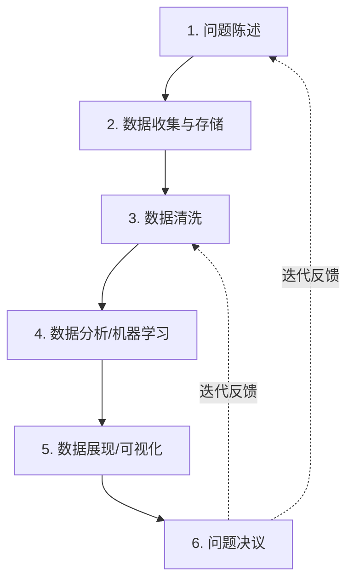
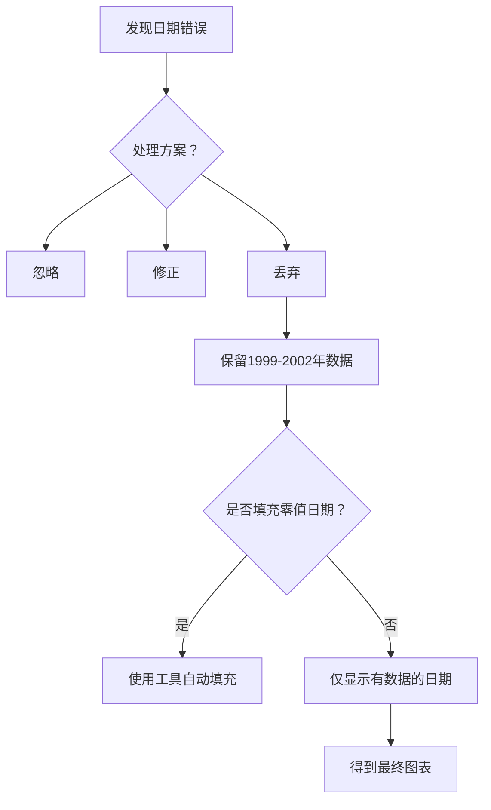
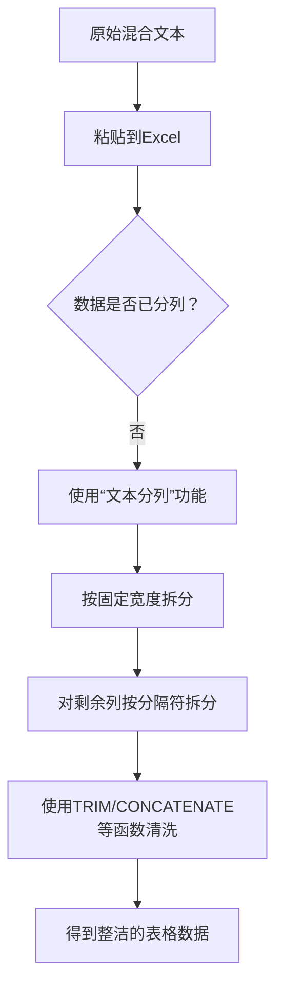
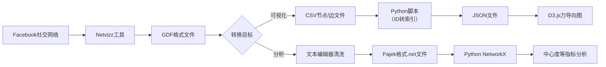
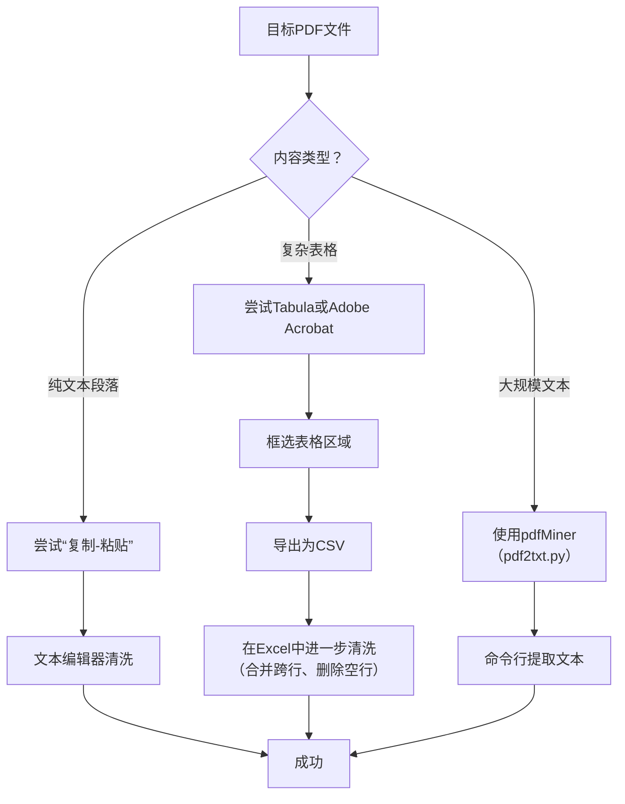
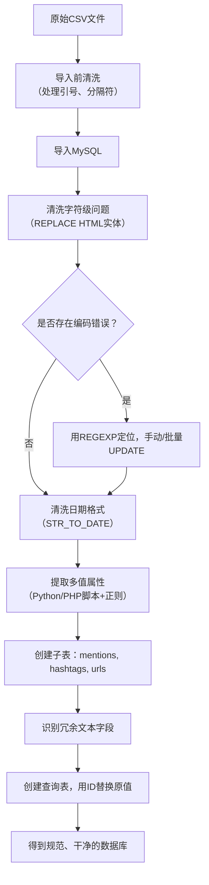
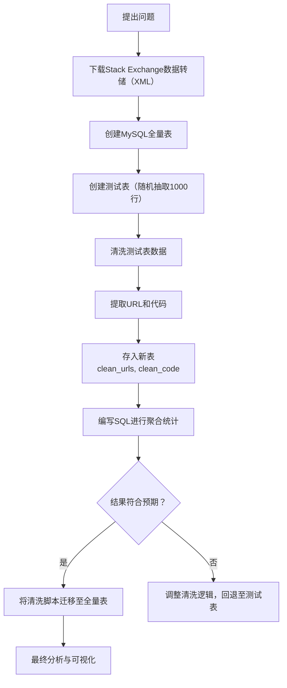

# 《干净的数据：数据清洗入门与实践》章节总结

## 书籍信息
- **书名：** 干净的数据：数据清洗入门与实践
- **作者：** [美] Megan Squire
- **译者：** 任政委
- **PDF 状态：** 文本层可识别，但部分页码存在错位或格式轻微混乱。
- **OCR 状态：** 整体识别良好，部分代码块和表格需要根据上下文修正。

## 目录说明
- **目录识别情况：** 完全识别。PDF 中从第13页开始有清晰的目录结构，共10章及前后内容。
- **章节对应依据：** 严格按照 PDF 目录（页码13-15）中列出的章节顺序和名称进行结构化总结。
- **OCR 修复说明：** 表格数据已尽力对齐，代码块格式已按编程语言规范进行还原，部分不可见图标（如 `image[[...]]`）已忽略，并基于文本描述进行逻辑重建。

## 全书核心主题
本书旨在改变“数据清洗”是一件枯燥、乏味的预处理工作的传统观念。作者 Megan Squire 将数据清洗比作烹饪前的食材准备，强调它是数据科学过程中至关重要且富有价值的一步。

全书系统性地讲解了数据清洗的完整流程：从理解文件格式、数据类型和字符编码等基础知识开始，逐步深入到使用电子表格、文本编辑器、Python、SQL 等工具处理各种来源（网页、PDF、数据库）的“脏数据”。通过贯穿全书的真实案例和两个完整的项目（Stack Overflow 和 Twitter），作者传授了一套实用、高效的策略，帮助数据科学家将混乱的原始数据转化为高质量、可信赖的分析素材，并最终学会如何分享和存档这些干净的数据。

---

## 前言

### 1. 核心论点
- **问题：** 为什么数据清洗如此重要，却又常常被忽视或被视为苦差事？
- **观点：** 数据清洗是数据科学过程中“看门人”般的关键步骤，大约占据数据科学家80%的工作时间。作者旨在将数据清洗重新定义为一项高质量、有品位且高效的工作，如同大厨清洗食材一样，是美味成果的基石。

### 2. 关键概念
- **“错进，错出”（Garbage In, Garbage Out）：** 源自20世纪60年代的计算机编程箴言，强调输入数据的质量直接决定了输出结果的正确性。任何高级算法都无法弥补初始数据的缺陷。
- **数据科学六步过程：** 本书采用的核心框架，数据清洗位于第三步，并强调这是一个迭代过程。
    1. 问题陈述
    2. 数据收集与存储
    3. 数据清洗
    4. 数据分析和机器学习
    5. 数据展现和可视化实现
    6. 问题决议
- **工作日志：** 为了解决“未来的你”忘记清洗细节的问题，作者建议保留一份包含链接、命令和解释性文字的工作日志，用于传达数据清洗的内容。

### 3. 逻辑推演
作者开篇引用查尔斯·巴贝奇到美国国税局再到现代数据科学家的言论，追溯了“数据质量决定结果质量”这一思想的历史脉络。针对“数据科学家80%的时间都在清洗数据”这一痛点，作者没有抱怨，而是提出了一个“厨房大厨”的比喻，将数据清洗从低效的“看门人工作”升华为高标准的“烹饪准备”。本章通过一个安然公司电子邮件数据集的简单案例，演示了六步框架的应用：从提出问题（邮件使用趋势）、收集数据（SQL）、清洗数据（处理错误日期）、分析到可视化。结论是，即使是回答一个简单问题，数据清洗也占据了绝大部分工作量，但其带来的价值（如本例中得到有意义的峰值图表）是无可替代的。

### 4. 经典金句/数据
> “压根儿就没有干净的数据集。” —— 乔希·沙利文，博思艾伦咨询公司副总裁
> “数据越多，麻烦越大。” —— 克里斯托弗·华莱士（说唱歌手）
> 数据科学家百分之八十的时间都花费在了这些清洗任务上。 ——《纽约时报》

---

## 第1章：为什么需要清洗数据

### 1. 核心论点
- **问题：** 数据清洗在数据科学过程中扮演什么角色？如何向他人传达清洗工作？
- **观点：** 数据清洗不仅是连接数据收集和数据分析的桥梁，更是一个需要反复迭代的关键环节。它直接影响问题陈述、数据收集、分析挖掘和最终的结果呈现。

### 2. 关键概念
- **六步处理过程的迭代性：** 强调步骤并非线性，可能需要根据分析结果反复进行数据清洗或补充收集。
- **数据清洗的价值判断：** 在面对脏数据时（如安然邮件中的错误日期），需要做出选择：忽略、修正还是丢弃。这取决于数据规模、分析目标以及工具能力（如图表工具能否自动补齐零值）。

### 3. 逻辑推演
本章通过安然公司邮件数据集中的日期错误问题，生动展示了数据清洗的决策过程。首先发现大量日期为1979年或0001年等异常值。通过分析，这仅占数据总量的1%，因此决定“丢弃”这些受影响数据。随后，在生成时间序列图表时，又面临新的选择：是否要填充没有邮件的日期（零值）？通过比较Google Sheets、D3和Excel三种工具的自动补齐功能，以及考虑图表的可读性，最终选择了不填充零值。这个案例清晰地表明，数据清洗是一个贯穿始终、不断权衡利弊的动态过程。

### 4. 流程图

#### 数据科学六步过程

#### 安然邮件清洗决策流程

### 5. 经典金句/数据
> “错进，错出。”这句源于上世纪60年代的计算机编程箴言，对如今的数据科学来说亦为真理。
> “哪怕是规模再小、风险再低的项目，你也要面对至少两人规模的受众：现在的你和六个月之后的你。”

---

## 第2章：基础知识——格式、类型与编码

### 1. 核心论点
- **问题：** 在深入数据清洗之前，必须掌握哪些关于文件、数据和编码的基础知识？
- **观点：** 理解文本文件与二进制文件的区别、常见数据格式（CSV, JSON, HTML）、压缩归档原理、数据类型转换以及字符编码（ASCII, UTF-8），是进行有效数据清洗的“入门工具箱”。

### 2. 关键概念
- **文本文件 vs. 二进制文件：** 文本文件由人类可读的字符组成，可用文本编辑器打开；二进制文件包含非打印字符，需专用程序（如Excel、Photoshop）打开。
- **分隔格式（CSV/TSV）：** 结构化程度最高的文本格式，使用逗号或制表符分隔字段。问题在于处理数据本身包含分隔符或引号，需使用封闭字符（如双引号）和转义符（如反斜杠）。
- **JSON（JavaScript Object Notation）：** 半结构化数据，以“名-值”对为基础，支持嵌套和多值属性，是目前API和数据交换的主流格式。
- **字符编码（UTF-8）：** 解决了ASCII只能处理英文字符的局限，是Web主流的可变长度编码，支持全球几乎所有自然语言字符。

### 3. 逻辑推演
本章从计算机存储的最底层逻辑（字节）开始，向上构建数据清洗的知识体系。先区分文本与二进制文件，再深入到最常用的文本格式（CSV, JSON, HTML），并逐一剖析其结构特点和潜在“陷阱”（如CSV中的逗号、JSON中的转义）。接着，讨论了数据科学家常接触的压缩格式（ZIP, GZIP, BZIP2），并提供了在不同操作系统下解压和创建压缩文件的实用命令。最后，深入到数据内部，探讨了数据类型（数字、日期、字符串）的转换、空值/零值/NULL的哲学差异，以及最令人头疼的字符编码问题，并通过MySQL和Python的实例演示了如何诊断和修复编码错误。整章内容由外而内，层层递进，为后续章节的实践操作奠定了坚实的理论基础。

### 4. 经典金句/数据
> “字符串（或文本）类型的数据可以算是当之无愧的主角。”
> NULL不等于NULL，而且NOT NULL也不等于NOT NULL。有人就曾建议说，我们应该像念咒那样牢牢记住，NULL不等于任何值，甚至是它本身。
> “iTunes API会根据我提供的关键词从它的音乐数据库里返回50个结果。”

---

## 第3章：数据清洗的老黄牛——电子表格和文本编辑器

### 1. 核心论点
- **问题：** 如何利用最基础、最常见的工具——电子表格和文本编辑器——高效地进行数据清洗？
- **观点：** 电子表格（Excel/Google Sheets）和程序员专用的文本编辑器（如TextWrangler/Notepad++）是数据清洗厨房中的“水槽和炉灶”，其内置的文本分列、函数、查找替换、正则表达式和宏功能足以解决大部分中等规模的数据清洗问题。

### 2. 关键概念
- **Excel文本分列：** 用于将粘贴到单列中的混合数据按分隔符（逗号、制表符）或固定宽度拆分成多列。适用于解析日志文件、混合文本等。
- **字符串函数（Concatenate/Split/Trim）：** `CONCATENATE`用于合并单元格；`SPLIT`（Google Sheets）用于按指定字符拆分；`TRIM`用于去除字段首尾多余空格。
- **正则表达式（RegEx/Grep）：** 一种强大的模式匹配语言。在文本编辑器中，可以用于查找复杂文本模式（如Email地址、URL）、批量替换、删除空行等。是超越普通查找替换的“核武器”。
- **列选模式：** 在文本编辑器中按住Option/Alt键，可以按列（垂直方向）选择文本，而非按行。适用于在格式化整齐的数据中批量删除或提取某一列。

### 3. 逻辑推演
本章通过一个从IRC聊天记录中解析时间戳、频道名和用户数的案例，演示了电子表格和文本编辑器的协同作战。首先，将原始文本粘贴到Excel，发现所有数据挤在一列。然后，使用“文本分列”功能，先按固定宽度拆分出时间戳等部分，再通过查找替换创建唯一分隔符（如`~`），二次拆分出频道名和用户数。接着，用`TRIM`函数清理空格，用`CONCATENATE`重组日期时间。另一方面，展示了文本编辑器的强大：使用正则表达式批量添加SQL语句的`INSERT INTO... VALUES...`部分，将清洗好的数据直接转化为可执行的SQL脚本。最后，通过一个“大学同级院校”的完整项目，将两种工具的技巧融会贯通，完成了数据筛选、转换和初步分析的全过程。

### 4. 流程图

#### 文本分列处理流程

### 5. 经典金句/数据
> “在我看来，TextWrangler的查找与替换功能，电子表格的查找与替换也会显得拙劣不堪。”
> “`^` 匹配一行的开始位置；`$` 匹配一行的结尾位置；`\s` 匹配空白字符。”

---

## 第4章：讲通用语言——数据转换

### 1. 核心论点
- **问题：** 如何将数据从一种格式（如GDF、CSV、SQL）可靠地转换成另一种格式（如JSON、Pajek）？
- **观点：** 数据转换是数据清洗的常见任务。可以先尝试使用工具（Excel, phpMyAdmin）快速完成；对于复杂或大规模的转换，则需要编写Python或PHP脚本。理解CSV和JSON作为“通用语言”的核心地位至关重要。

### 2. 关键概念
- **CSV（逗号分隔值）：** 最通用的“低复杂度”数据交换格式，几乎所有数据处理工具都支持导入导出。
- **JSON（JavaScript对象表示法）：** 最通用的“半结构化”数据交换格式，尤其适用于Web API和现代编程语言间的数据传递。
- **GDF（图数据格式）：** 一种用于描述网络（节点和边）的文本格式，被一些社交网络分析工具（如Netvizz）使用。
- **Pajek格式：** 另一种社交网络分析工具的专用格式，以`.net`为扩展名，通过空格分隔，用于存储大型网络数据。
- **csvkit：** 一个强大的Python命令行工具集，可以方便地对CSV文件进行切片、筛选、转换（如`csvjson`）等操作。

### 3. 逻辑推演
本章始于一个明确的目标：分析Facebook社交网络。数据来源是Netvizz导出的GDF格式，但分析工具D3需要JSON，而Python的NetworkX包需要Pajek格式。因此，整个清洗过程就是一场格式转换的接力赛。首先，介绍了最简单的转换工具：Excel/Google Sheets保存为CSV，phpMyAdmin导出为JSON。当GDF这种非标准格式出现时，就需要进行手工或脚本干预：用文本编辑器将GDF拆分为“节点”和“边”两个CSV文件。然后，编写Python脚本，将CSV中的原始用户ID映射为从0开始的索引，生成D3所需的`source`和`target`。同时，通过另一轮文本编辑器的查找替换（逗号转空格，去除引号），将数据转换为Pajek格式。最终，D3成功展示了社交网络图，NetworkX成功输出了“度中心性”最高的节点（如“Bambi”）。这个案例完美展示了数据清洗的“翻译官”角色。

### 4. 流程图

#### Facebook数据转换与可视化流程

### 5. 经典金句/数据
> “通用语言，就是讲不同语言的人在对话中采用的一种公共标准。而在数据转换的时候，也有几种可以作为公共标准的数据类型。”
> 在示例中，`csvcut -c 1,2 nodes.gdf > nodesCut.gdf` 命令用于从GDF文件中提取第一、二列。

---

## 第5章：收集并清洗来自网络的数据

### 1. 核心论点
- **问题：** 如何从格式混乱、充满标签的HTML网页中，提取出用户真正需要的数据？
- **观点：** 解析网页有两种心智模型：行分隔模型（用正则表达式匹配）和树形结构模型（用解析器遍历DOM树）。根据页面结构的复杂程度和稳定性，可以选择Python+正则表达式、Python+BeautifulSoup或Chrome Scraper扩展等不同策略。

### 2. 关键概念
- **行分隔模型：** 将HTML视为纯文本，使用正则表达式定义分隔符（标签、属性）来提取感兴趣的内容。简单直接，但对页面结构变化极其敏感。
- **树形结构模型：** 将HTML解析为一棵由标签节点组成的文档树。通过搜索标签名、类名、ID或路径来定位和提取内容。更健壮，能处理复杂的嵌套结构。
- **BeautifulSoup：** Python的一个HTML解析库，能够将畸形的HTML转换为整齐的树形结构，并提供 `.findAll()`, `.select()` 等便捷的方法来遍历和搜索节点。
- **Chrome Scraper：** 一个浏览器扩展，允许用户通过鼠标点击高亮页面上的示例数据，然后自动抓取页面上所有相似结构的元素，并导出到Google Sheets。非常适合快速、一次性的小规模数据抓取。

### 3. 逻辑推演
本章以一个简单的IRC日志页面为目标，逐步演示了三种解析方法的优劣。首先，用正则表达式匹配每一行的 `<li>` 标签，从中抽取用户名、行号和消息。代码直观，但当页面结构微调（如在标签间增减空格）时，表达式就会失效。接着，介绍了BeautifulSoup：通过 `soup.findAll("li", "le")` 找到所有符合条件的节点，然后像访问字典一样获取属性（`line['rel']`）和内容（`line.contents[3]`），代码更简洁、健壮。最后，展示了Chrome Scraper：无需编程，用户选择第一个用户名，工具自动识别所有类似元素并提取成表格。在项目的实战中，面对Google Groups邮件（非HTML）和DocuSign论坛（RSS+HTML），综合运用了这些技术：用正则解析邮件头，用Python脚本循环下载，再用正则提取RSS中的URL，最终计算出不同社区的响应时间。

### 5. 经典金句/数据
> “正则表达式虽然强大，但它并非完美得无懈可击。”
> Stack Overflow上一个著名的回答，幽默地解释了为什么正则表达式不适合解析HTML：http://stackoverflow.com/questions/1732348/。
> 在DocuSign论坛项目中，计算出的平均回复时间约为695小时（约29天），中位数为20小时，显示了极端值对平均值的影响。

---

## 第6章：清洗PDF文件中的数据

### 1. 核心论点
- **问题：** PDF是一种用于布局呈现的二进制格式，为什么从中提取结构化数据如此困难？有哪些解决方案？
- **观点：** PDF的设计目标是“所见即所得”的跨平台呈现，而非数据交换，因此文本顺序和位置是视觉导向的。从PDF提取数据没有“万能药”，需要根据文档复杂度尝试多种方法：从简单的复制粘贴，到使用pdfMiner、Tabula，再到付费的Adobe Acrobat。

### 2. 关键概念
- **PDF（可移植文档格式）：** 一种二进制文件格式，旨在保持文档格式在不同设备和软件上的一致性。它描述的是页面布局（文本、线条、图像的位置），而非文本的逻辑结构（段落、表格、标题）。
- **pdfMiner：** 一个Python工具包，包含 `pdf2txt.py` 命令行工具，可以从PDF中提取文本。对纯文本效果尚可，但对表格数据往往无能为力。
- **Tabula：** 一个开源的Java应用程序，专门用于从PDF中提取表格。它提供了一个图形界面，允许用户手动框选表格区域，并识别单元格边界，导出为CSV。
- **复制粘贴法：** 最简单、零成本的尝试。对于格式简单的纯文本PDF有效，但对于包含多列、跨行等复杂表格的PDF，复制结果通常是完全错乱的。

### 3. 逻辑推演
本章以从皮尤研究中心的复杂PDF报告中抽取数据表格为挑战。首先尝试最简单的“复制粘贴”到文本编辑器，结果页码混入文本、表格列完全错位，宣告失败。随后，尝试了命令行工具 `pdf2txt.py`，对序言的纯文本提取效果完美，但对表格依旧输出一堆混乱的数据。接着，启用了专业工具Tabula。通过图形界面框选表格区域，Tabula成功识别了大部分单元格，尽管还存在一些跨行文本问题，但导出CSV后，可以在Excel中进一步清洗。最后，介绍了“终极大法”——付费的Adobe Acrobat，它可以直接将选中的表格区域导出为格式近乎完美的CSV或Excel文件。本章结论：PDF清洗是一个工具链的选择问题，小任务用复制粘贴，纯文本用pdfMiner，复杂表格用Tabula或Acrobat。

### 4. 流程图

#### PDF数据清洗方法决策流

### 5. 经典金句/数据
> “PDF文件是二进制格式的，最初由Adobe Systems公司发明，后来发展成为一种开放标准。”
> “每种专项工具都有它们存在的理由，但我们仅应该在必要的时候才使用它们。”
> 在Google中输入“click here”，排名第一的结果曾是Adobe Acrobat Reader下载页面，这源于无数网站“点击此处下载”的链接文本。

---

## 第7章：RDBMS清洗技术

### 1. 核心论点
- **问题：** 如何系统性地清洗已存储在关系型数据库（RDBMS）中的“脏数据”？
- **观点：** RDBMS清洗需要多步骤策略：先清洗导入时的格式问题（如引号、HTML实体），再处理字符编码导致的乱码（如问号、智能引号），然后转换不规范的日期字符串为原生`DATETIME`类型，最后通过创建新表来规范化多值字段（如标签、URL）和冗余字段（如查询短语），并始终记录每一步操作。

### 2. 关键概念
- **规范化：** 数据库设计原则，旨在减少数据冗余和避免更新异常。本章实践了通过创建独立的 `mentions`, `hashtags`, `urls` 表来消除 `tweet_text` 中的重复多值信息。
- **查询表（Lookup Table）：** 一种特殊的规范化形式，用于存储重复出现的文本值（如搜索关键词）。用短整型ID代替冗长字符串，可以大幅节省空间并提升连接查询性能。
- **MySQL字符串函数：** `REPLACE()` 用于替换子字符串；`STR_TO_DATE()` 用于将自定义格式的字符串转换为 `DATETIME` 类型；`CONCAT()` 用于拼接字符串。
- **MySQL正则表达式（REGEXP）：** 用于在 `WHERE` 子句中进行复杂模式匹配，例如查找问号后紧跟字母的模式 `'\\?[[:alpha:]]+'`，以定位潜在的字符编码错误。

### 3. 逻辑推演
本章以Sentiment140数据集为“病人”，进行了一场数据库“外科手术”。第一步是“清创”：在导入前，用文本编辑器处理了文件中的多余双引号。导入后，首先用 `REPLACE()` 清洗了HTML实体（`&amp;`）。接着，诊断出“智能引号”被转义为问号的问题，通过 `REGEXP` 定位后，决定用手工 `UPDATE` 修复（因为数据量小）。然后是“器官移植”：用 `STR_TO_DATE()` 将混乱的日期字符串转换为标准的 `DATETIME` 类型，并新建了一个字段来存放。最复杂的部分是“结构重组”：针对 `tweet_text` 中混杂的 @提及、#标签和URL，编写PHP脚本，用正则表达式逐一提取，并存入新创建的规范化子表中。最后，对重复的 `query_phrase` 字段进行了“瘦身”，创建了查询表，用ID代替原字符串，完成数据库的规范化。

### 4. 流程图

#### 关系型数据库清洗流程

### 5. 经典金句/数据
> “对于关系型数据库管理系统来说，容器和标签贴纸可以帮助你优化存储、减少浪费，让你的生活更加轻松。”
> “推文的最大长度是144个字符。Twitter明明规定每个推文的最大长度为140个字符。其实这是因为在Sentiment140数据集中，有时候字符&会被转义为等价的HTML编码&amp;。”
> `LOAD DATA LOCAL INFILE 'cleanedTestData.csv' INTO TABLE sentiment140 ...` 是向MySQL导入CSV文件的关键命令。

---

## 第8章：数据分享的最佳实践

### 1. 核心论点
- **问题：** 当你完成数据清洗后，如何以专业、负责、可复用的方式与他人（或未来的自己）分享成果？
- **观点：** 分享干净的数据需要“打包”和“文档化”两个核心步骤。打包涉及选择合适的数据发布形式（纯文本、SQL、API等）；文档化则要求提供清晰的README文件、数据字典、实体关系图和明确的使用许可协议。

### 2. 关键概念
- **README文件：** 数据包的“封面信”，应包含作者、目的、来源、清洗步骤、字段说明、许可协议等关键信息。通常命名为 `README.txt`，放在数据包的根目录。
- **实体关系图（ERD）：** 数据库结构的可视化呈现，展示表与表之间的关系（一对一、一对多、多对多）。对于大型数据库，ERD是用户理解数据模型的“地图”。
- **知识共享许可协议（CC, Creative Commons）：** 一套标准化版权许可，允许作者声明其作品（文本、图片、数据等）可以被他人如何使用（如署名、非商业使用、禁止修改等）。
- **开放数据库协议（ODbL, Open Database License）：** 专门为数据库设计的开放许可协议，由开放知识基金会维护，旨在促进数据的自由共享和利用。

### 3. 逻辑推演
本章从一个核心问题出发：“如何让你的辛勤劳动成果惠及他人？”答案首先是选择正确的“容器”。对比了纯文本压缩包、SQL文件、在线数据库访问和API的优缺点：纯文本最简单，但缺乏控制；API最强大，但成本最高。推荐遵循“早发布、常更新”的原则。接着，强调文档的重要性，没有文档的数据等于没有数据。详细介绍了README文件应该包含的内容，以及文件头（File Header）的注释格式。对于数据库项目，建议提供ERD图表帮助用户导航。最后，讨论了法律层面：数据不是代码，传统的开源许可证可能不适用。介绍了知识共享（CC）和开放数据库协议（ODbL）两种主流数据许可方案，并强调了引用、隐私和合理使用等条款的设置。

### 4. 经典金句/数据
> “GitHub本身推荐使用网络主机的方式来发布文件，特别是在这些文件体积较大或是它们专门面向数据库的时候。”
> “如果你发现不小心把个人信息发布到GitHub上了，那就应该立即重新设置所有账户的认证信息，并重新创建加密文件和密码。”
> “我能给你的最好建议就是我一直以来都在遵循的开源软件格言——早发布和常更新。”
> “README文件在计算机上有一段较长的历史。它就是一个普通的文本文件，随着软件包一同发布...其目的是让用户先阅读README文件，然后再使用其余的文件。”

---

## 第9章：Stack Overflow项目

### 1. 核心论点
- **问题：** 在Stack Overflow上，程序员是否倾向于使用外部代码分享网站（如Pastebin, JSFiddle）？这种行为在问题和答案中是否有差异？是否遵守了“同时提供代码”的社区准则？
- **观点：** 通过清洗和查询真实的Stack Overflow数据转储（XML格式），可以量化这些行为。JSFiddle是最流行的代码分享网站；问题中使用分享链接的比例高于答案；约三分之二包含分享链接的帖子也同时包含了内联代码。

### 2. 关键概念
- **代码分享网站：** 允许用户粘贴代码、日志或配置文本，并返回一个短链接的平台。常见的包括Pastebin, JSFiddle, GitHub Gist等。
- **Stack Exchange数据转储：** Stack Exchange网络定期在互联网档案馆（archive.org）发布其所有站点的匿名数据，格式为XML。这是进行大规模、离线分析的合法数据源。
- **测试表（Test Table）：** 从全量数据中抽取一小部分（如1000行）创建的临时表。用于脚本和查询的开发和调试，可以避免在大表上操作带来的高昂时间成本和错误风险。
- **MySQL `LOAD XML`：** MySQL提供的命令，可以直接将格式良好的XML文件中的数据导入到数据库表中，前提是XML结构（如`<row>`标签）与表结构对应。

### 3. 逻辑推演
项目严格遵循六步法。第一步，提出问题（如上）。第二步，从互联网档案馆下载Stack Overflow的8个XML文件（大小近10GB），解压并用 `LOAD XML` 导入MySQL。由于全表巨大，创建了后缀为 `_test` 的8张表，通过一个巧妙的PHP脚本（在最小和最大ID之间生成随机数）随机抽取1000行填充测试表。第三步，清洗：编写PHP脚本，使用正则表达式从 `posts` 和 `comments` 表的 `Body` 字段中提取所有URL，存入新表 `clean_posts_urls`；同时，提取 `<code>` 标签内的内容存入 `clean_posts_code`。第四步，分析：通过SQL查询JOIN这些新表，统计出JSFiddle使用频率最高，问题中使用分享URL的比例（13.6%）约为答案（7.2%）的两倍，以及37个引用分享的帖子中有25个（68%）同时包含内联代码。第五步，用D3.js将统计结果可视化为条形图。最后，确认了当初的假设，并提供了将测试流程迁移到全量数据的方法。

### 4. 流程图

#### Stack Overflow数据分析流程

### 5. 经典金句/数据
> “构建测试表是一种好习惯，但前提是你知道应该怎么以简单有效的方法来创建它们。”
> “社区的最后决定是，应当避免发布那些只提供链接而无代码的提问和回答。”
> 查询结果显示：在1000条测试用户提交中，664条包含`<code>`标签；37条至少引用一次代码分享网站；其中25条（约68%）同时包含`<code>`和分享链接。

---

## 第10章：Twitter项目

### 1. 核心论点
- **问题：** 如何在不违反Twitter服务条款的前提下，收集并清洗大量与特定时事（如弗格森事件）相关的推文数据，以分析最常被引用的域名？
- **观点：** 符合条款的做法是只分享和传播推文ID。使用 `twarc` 工具，可以根据ID列表“水合”（hydrate）出完整的推文JSON数据。通过Python脚本解析JSON，提取推文正文、标签、提及和URL，并存入MySQL，最后通过SQL聚合查询和D3可视化，即可回答关于URL流行度的问题。

### 2. 关键概念
- **推文水合（Tweet Hydration）：** 根据推文ID，通过Twitter API重新获取该推文当前状态（文本、元数据等）的过程。这是为了遵守Twitter服务条款，避免未经授权二次分发推文内容。
- **twarc：** 一个Python命令行工具，封装了Twitter API，专门用于收集、水合和归档推文。它自动处理速率限制和认证。
- **Twitter API认证：** 访问Twitter API需要创建应用，并获取四个密钥：`CONSUMER_KEY`, `CONSUMER_SECRET`, `ACCESS_TOKEN`, `ACCESS_TOKEN_SECRET`。
- **MySQL `utf8mb4` 字符集：** MySQL的 `utf8` 编码最多支持3字节，无法存储某些emoji表情等4字节Unicode字符。`utf8mb4` 是真正的UTF-8实现，用于存储完整的推文文本。

### 3. 逻辑推演
项目目标：找出弗格森事件推文中被引用最多的域名。第一步，从互联网档案馆下载推文ID压缩包，解压后得到一个包含1300万个ID的文本文件。创建测试集 `ids_1000.txt`（前1000行）。第二步，注册Twitter开发者账号，获取API密钥，安装 `twarc`。运行 `twarc --hydrate ids_1000.txt > tweets_1000.json`，获取894条（部分已删除）推文的完整JSON。第三步，清洗：编写Python脚本，逐行读取JSON。利用 `json.loads()` 解析，从 `entities` 对象中提取 `hashtags`, `user_mentions`, `urls` 字段，并连同推文ID、文本、时间等一起，使用 `MySQLdb` 分别插入到 `ferguson_tweets`, `ferguson_tweets_hashtags` 等四张表中。注意表需使用 `utf8mb4` 编码。第四步，分析：编写SQL，使用 `LEFT()` 和 `LOCATE()` 函数从 `tdisplay` 字段中截取域名部分，然后 `GROUP BY` 域名并 `COUNT(*)`，得到域名热度排行。第五步，可视化：用Python脚本将查询结果（前15名）输出为CSV，再用D3.js读取CSV绘制条形图。最终成功验证了流程，并提供了如何处理完整1300万条数据的方法。

### 4. 流程图

#### Twitter数据收集与清洗流程

### 5. 经典金句/数据
> “通过只允许研究人员收集推文的ID编号，Twitter可以保护推文原作者删除推文的权利。”
> “请记得不要随意发布推文正文或相关的元数据信息。不过发布推文ID或是其中的一个子集倒是可以的。”
> `ALTER TABLE ... CONVERT TO CHARACTER SET utf8mb4;` 是修改数据库支持完整Unicode的关键命令。
> Ed Summers在他的博文中说明，采集弗格森事件的推文信息几乎花费了一周时间。