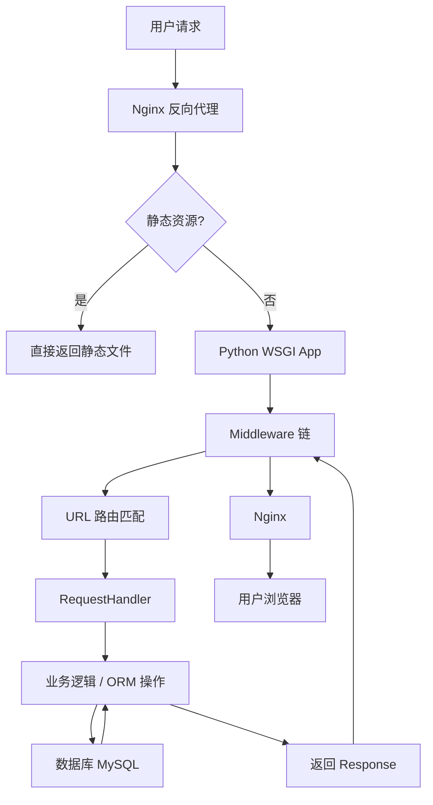

# 《廖雪峰 JavaScript Python Git 教程》章节总结

## 书籍信息
- **书名**：廖雪峰 JavaScript Python Git 教程
- **作者**：廖雪峰
- **来源**：廖雪峰的官方网站
- **协议**：Apache License 2.0
- **PDF 状态**：文本可提取，结构清晰
- **OCR 状态**：无需 OCR，原始数字文本

## 目录说明
- **目录识别情况**：完整识别。本书包含三大部分：JavaScript 教程、Python 教程（含 2.7 和 3.x 版本）、Git 教程。
- **章节对应依据**：严格遵循 PDF 中的层级结构，从基础语法到高级特性，再到实战项目。
- **OCR 修复说明**：部分代码片段中的特殊符号（如 `&lt;`）已还原为正常 HTML/代码符号；部分页眉页脚噪音已去除。

## 全书核心主题
本教程是一份面向初学者的全栈开发入门指南，涵盖了前端核心语言 JavaScript、后端及脚本语言 Python（兼顾 2.7 与 3.x 版本），以及版本控制工具 Git。
1. **JavaScript 部分**：从基本语法、数据类型、面向对象编程（原型链）到浏览器 DOM 操作、AJAX、Promise 异步编程，以及 Node.js 服务端开发基础。强调了 ES6 新特性（如箭头函数、Generator、Module）。
2. **Python 部分**：详细讲解了 Python 的基础语法、高级特性（切片、迭代器、生成器、装饰器）、面向对象编程、模块管理、IO 编程、网络编程、数据库操作（SQLite/MySQL/SQLAlchemy）以及 Web 开发（WSGI/Flask/Django 概念）。特别包含了基于 asyncio 的异步 IO 和协程内容。
3. **Git 部分**：深入浅出地讲解了分布式版本控制的核心概念，包括工作区、暂存区、分支管理、远程仓库协作、标签管理及常用命令。
4. **实战项目**：Python 部分包含一个完整的 Web App 开发实战（Day 1 - Day 16），涵盖从环境搭建、ORM 编写、Web 框架封装、前端 MVVM 实现到部署的全流程。

---

## 第1章：JavaScript 教程

### 1. 核心论点
本章旨在建立 JavaScript 作为 Web 交互核心语言的完整知识体系。作者认为，尽管 JS 易上手，但写出高质量代码需深入理解其原型继承、闭包、异步机制及 ES6 新标准。

### 2. 关键概念
- **原型继承 (Prototype)**：JS 通过原型链实现继承，而非传统的类继承。对象通过 `__proto__` 指向原型对象。
- **闭包 (Closure)**：内部函数引用外部函数变量，形成作用域链，常用于封装私有变量和实现回调。
- **Promise**：解决异步回调地狱的标准方案，提供链式调用和统一错误处理。
- **Node.js**：基于 Chrome V8 引擎的服务端 JS 运行环境，采用事件驱动和非阻塞 I/O 模型。
- **模块化 (CommonJS/ES6 Module)**：解决全局变量污染问题，实现代码复用和管理。

### 3. 逻辑推演
教程从 JS 历史与 ECMAScript 标准入手，快速进入基本语法（变量、类型、运算）。随后深入函数式编程特性（高阶函数、map/reduce/filter），引出闭包和作用域概念。接着讲解面向对象，重点区分传统 OOP 与 JS 原型继承的差异。之后转向浏览器端开发，涵盖 DOM 操作、事件处理、AJAX 通信。最后引入 Node.js，展示 JS 在全栈开发中的应用，并介绍 underscore 等工具库以增强函数式编程能力。

### 4. 经典金句
> “JavaScript 确实很容易上手，但其精髓却不为大多数开发人员所熟知。编写高质量的 JavaScript 代码更是难上加难。”

> “在 Web 世界里，只有 JavaScript 能跨平台、跨浏览器驱动网页，与用户交互。”

---

## 第2章：Python 2.7 教程

### 1. 核心论点
本章针对 Python 2.7 版本，强调其“内置电池”理念和简洁优雅的语法。作者指出 Python 适合快速开发和胶水语言场景，但需注意 2.x 与 3.x 的兼容性差异及编码问题。

### 2. 关键概念
- **动态类型**：变量无需声明类型，赋值即确定类型，灵活但需注意类型错误。
- **列表推导式 (List Comprehensions)**：简洁生成列表的方式，如 `[x * x for x in range(10)]`。
- **生成器 (Generator)**：使用 `yield` 关键字，惰性计算，节省内存，适用于大数据流处理。
- **装饰器 (Decorator)**：在不修改原函数代码的前提下，动态增强函数功能，基于高阶函数实现。
- **GIL (Global Interpreter Lock)**：CPython 解释器的全局锁，导致多线程无法利用多核 CPU，推荐多进程替代。

### 3. 逻辑推演
从安装与环境配置开始，讲解基础数据类型（list, tuple, dict, set）及其操作。随后深入函数定义，详解参数类型（默认、可变、关键字）。接着是高级特性，包括切片、迭代、生成器和函数式编程接口。面向对象部分讲解类、实例、继承及魔术方法（如 `__slots__`, `@property`）。最后涵盖模块管理、异常处理、IO 操作、网络编程及数据库访问，为 Web 开发打下基础。

### 4. 经典金句
> “Python 的哲学就是简单优雅，尽量写容易看明白的代码，尽量写少的代码。”

> “由于 Python 允许使用变量，因此，Python 不是纯函数式编程语言。”

---

## 第3章：Python 3 教程

### 1. 核心论点
本章基于 Python 3.x 版本，修正了 2.x 中的设计缺陷（如 Unicode 默认支持、整数除法行为）。作者强调 3.x 是未来趋势，新学习者应直接选择 3.x。

### 2. 关键概念
- **Unicode 字符串**：Python 3 中 `str` 默认为 Unicode，`bytes` 用于二进制数据，明确区分文本与字节。
- **Async/Await**：原生支持协程，简化异步 IO 编程，替代早期的 `yield from` 语法。
- **Type Hints (隐含)**：虽然教程未深入，但 3.x 生态更倾向于类型提示，增强代码可维护性。
- **Enum (枚举)**：内置 `enum` 模块，提供更安全的常量定义方式。

### 3. 逻辑推演
结构与 2.7 教程类似，但更新了语法细节。重点突出了 `print()` 作为函数而非语句的变化，整数除法 `/` 始终返回浮点数，以及 `range()` 返回迭代器而非列表。在网络编程部分，引入了 `asyncio` 库，详细讲解了事件循环、协程调度及 `aiohttp` 异步 Web 框架的使用，展示了现代 Python 高并发处理能力。

### 4. 经典金句
> “Python 3 的字符串使用 Unicode，直接支持多语言。”

> “异步操作需要在 coroutine 中通过 yield from (或 await) 完成；多个 coroutine 可以封装成一组 Task 然后并发执行。”

---

## 第4章：Python Web 开发实战 (Awesome Python Webapp)

### 1. 核心论点
通过构建一个博客系统，演示从零搭建 Web 应用的全过程。作者主张“造轮子”学习法，通过手写 ORM 和 Web 框架内核，深入理解底层原理，而非仅依赖现成框架。

### 2. 关键概念
- **自定义 ORM**：利用 Metaclass 动态创建类属性与数据库表的映射，实现对象关系映射。
- **WSGI 接口**：Web 服务器网关接口，Python Web 应用的标准入口，分离服务器与应用逻辑。
- **Middleware (中间件)**：拦截请求/响应，处理日志、认证、错误统一返回等通用逻辑。
- **MVVM 前端**：使用 Vue.js 实现前端数据双向绑定，分离视图与逻辑，通过 REST API 与后端交互。
- **自动化部署**：使用 Fabric 脚本实现代码打包、上传、解压及服务重启，体现 DevOps 理念。

### 3. 逻辑推演
- **Day 1-3**：环境搭建，编写异步数据库连接池及 ORM 核心（Metaclass 映射）。
- **Day 4-5**：定义数据模型（User, Blog, Comment），封装 Web 框架（路由注册、RequestHandler、中间件）。
- **Day 6-8**：配置管理，Jinja2 模板集成，前端 UI 框架（UIKit）接入，模板继承优化。
- **Day 9-11**：REST API 设计，用户注册登录（Cookie 加密验证），前端 MVVM 实现表单提交。
- **Day 12-14**：完善管理后台，分页逻辑，CRUD 操作，前后端联调。
- **Day 15-16**：Nginx + Supervisor 部署，Fabric 自动化脚本，移动端适配思路。

### 4. 流程图重建



### 5. 经典金句
> “开弓没有回头箭”：一旦决定使用异步，则系统每一层都必须是异步。

> “Web 开发真正困难的地方在于编写前端页面... MVVM 模式应运而生。”

---

## 第5章：Git 教程

### 1. 核心论点
Git 是最先进的分布式版本控制系统。本章旨在消除初学者对 Git 的恐惧，通过“时光机”比喻，掌握核心工作流：工作区 -> 暂存区 -> 版本库。

### 2. 关键概念
- **分布式 vs 集中式**：每个客户端都有完整版本库，无需联网即可提交，安全性高。
- **暂存区 (Stage/Index)**：Git 特有的概念，用于精确控制哪些修改进入下一次提交。
- **分支 (Branch)**：轻量级的指针移动，合并速度快，鼓励频繁创建/删除分支进行功能开发。
- **HEAD**：指向当前分支的指针，重置 HEAD 可实现版本回退。
- **Stash**：储藏现场，用于临时切换分支而不提交未完成的工作。

### 3. 逻辑推演
从安装配置开始，讲解本地仓库初始化、添加文件、提交修改。随后深入版本回退（`git reset`）、撤销修改（`git checkout`）、删除文件。接着重点讲解分支管理：创建、切换、合并（Fast-forward vs No-ff）、解决冲突。最后扩展到远程仓库（GitHub），讲解克隆、推送、拉取及多人协作流程，以及标签管理和别名配置。

### 4. 流程图重建

```mermaid
graph LR
    A[工作区 Working Dir] -- git add --> B[暂存区 Stage]
    B -- git commit --> C[版本库 Repository/Master]
    C -- git reset HEAD --> B
    A -- git checkout -- file --> A
    B -- git reset HEAD file --> A
```

### 5. 经典金句
> “Git 跟踪并管理的是修改，而非文件。”

> “分支就是科幻电影里面的平行宇宙... Git 的分支是与众不同的，无论创建、切换和删除分支，Git 在 1 秒钟之内就能完成！”

> “有了远程仓库，妈妈再也不用担心我的硬盘了。”