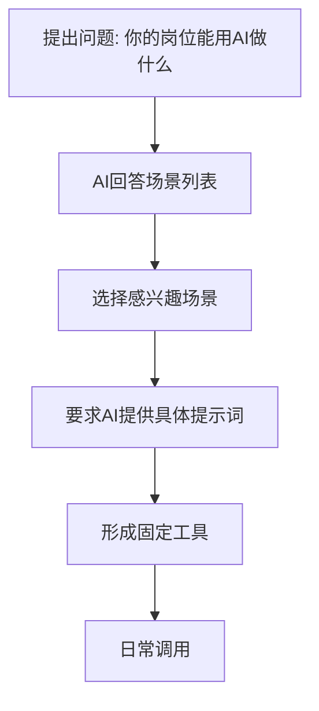
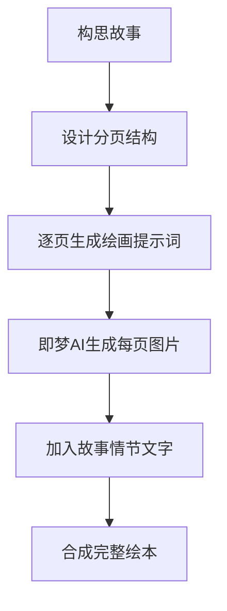
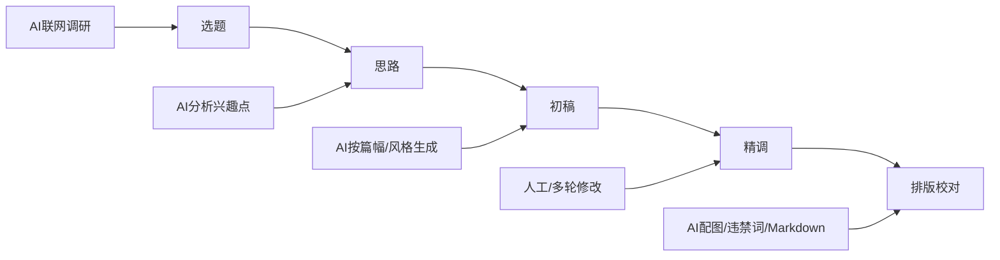
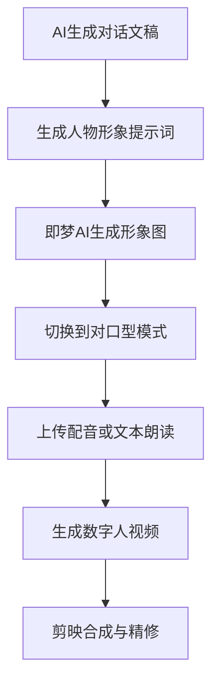
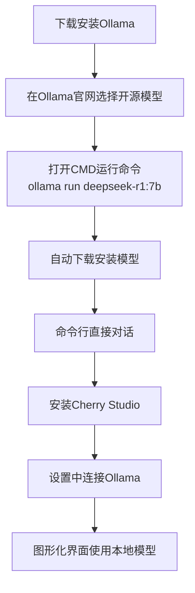
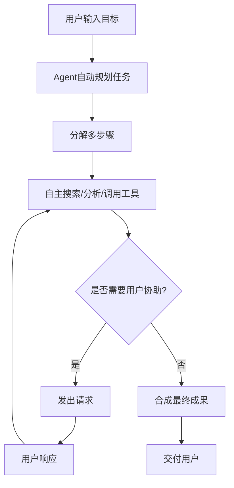

# 《成为AI高手：从DeepSeek开启高效能》章节总结

## 书籍信息
- 书名：《成为AI高手：从DeepSeek开启高效能》
- 作者：常青
- 出版社：人民邮电出版社
- 出版时间：2025年7月
- ISBN：9787115670502
- 字数：77千字
- PDF状态：基于OCR文本，可识别主要内容
- OCR状态：文字基本完整，部分图片/表格缺失或简化

## 目录说明
本书分为序言、三个主要部分（共14章）及结语。章节顺序清晰，无缺失。OCR识别了全部文本内容，图表以文字描述或Mermaid重建方式呈现。

## 全书核心主题
本书以DeepSeek推理型AI为切入点，系统讲解AI应用的方法论、实战技巧及高阶扩展。核心主张包括：区分推理型AI与通用型AI的不同使用范式；通过“角色、问题、目标、要求”四要素及约哈里窗口四策略高效提问；在职场、学习、创作等多元场景中落地AI；进一步探索AI Agent、智能编程、本地部署、通用Agent等前沿领域，帮助读者从零基础进阶为AI应用高手。

---

## 序言

### 核心论点
问题：DeepSeek为何能带来“懂你”的体验？  
观点：DeepSeek采用全新推理范式（思维链），具备类人思考能力，改变了AI使用方式。

### 关键概念/事件
- DeepSeek：2025年1月由深度求索发布，登顶多国App Store榜首。
- 推理型AI vs 通用型AI：推理型AI会先分析问题再回答，效果更精准。
- 组合效应：单一AI工具不足以释放全部潜力，需构建AI生态体系。

### 逻辑推演
作者先回顾ChatGPT的成就，认为DeepSeek再次刷新认知。提出本书三大特色：聚焦场景驱动、解锁全AI生态、系统化学习路径。序言为全书定下基调：从工具到生态，从方法到思维。

### 经典金句/数据
> “这种‘懂你’的体验并非偶然，而是DeepSeek引爆的全新技术范式的魅力所在。” (p.5)

---

# 第一部分 DeepSeek从入门到精通

## 第一章：极速入门：零基础掌握DeepSeek精髓

### 核心论点
问题：DeepSeek为何感觉不一样？如何有效使用？  
观点：因为它是推理型AI，具备思考和推理能力；使用时要开启【深度思考（R1）】模式，并根据问题类型采用不同提示词策略。

### 关键概念/事件
- 通用型AI（指令型AI）：响应快，多模态支持好，但依赖清晰指令，容易“AI味”浓。
- 推理型AI：响应慢，但能理解模糊问题，通过思维链进行推理，输出更具创造性。
- 提示词四要素：立角色、述问题、定目标、补要求。
- 约哈里窗口四种问题场景：开放、盲区、隐藏、未知。
- 四策略：开放问题直接说、盲区问题上案例、隐藏问题补背景、未知问题开放聊。

### 逻辑推演
先对比通用型与推理型AI，指出推理型AI不需要复杂提示词。然后介绍通用提示词四要素（针对通用型AI），但强调推理型AI过度使用会限制发挥。接着引入约哈里窗口模型，将问题分为四类，每类给出精简的提示词策略。最后用表格总结了两种AI的区别。

### 经典金句/数据
> “推理型AI则是妥妥的‘专项冠军’，如同显微镜一样，虽然能力范围窄，但是观测深度惊人。” (p.11)
> “在使用推理型AI的时候，对于那些不太复杂、比较开放的问题场景，……千万不要啰唆，不要写过多的提示词。” (p.22)

---

## 第二章：进阶技巧：四大策略全面释放DeepSeek潜能

### 核心论点
问题：如何更高效地向AI提问、描述问题、提要求、减少幻觉？  
观点：通过反向提问法、多轮调教法、5W2H方法、AI识图/附件/链接技巧、自动生成法，以及设置难度/风格/语气/篇幅/范围/格式，结合慢思考、自我批评、联网校对、多AI交叉验证，可大幅提升效果和可靠性。

### 关键概念/事件
- 反向提问法：让AI告诉你如何提问，然后填空。
- 多轮调教法：先给模糊问题，基于AI初稿逐步细化。
- 5W2H方法：Who, What, Why, When, Where, How, How much。
- AI识图/附件/链接：直接上传图片、文件或链接，让AI处理。
- 自动生成法：让AI帮你写提示词。
- 六种提要求方法：设置难度、风格、语气、篇幅、范围、格式。
- 减少幻觉四方法：慢思考策略、自我批评、联网校对、多AI交叉验证。

### 逻辑推演
先解决“不会提问”的问题，提供反向提问法和多轮调教法。然后解决“不会描述问题”的问题，给出5W2H、AI识图等技巧。接着讲解如何更精准地对AI提要求（难度/风格/语气等）。最后针对AI幻觉提供四种缓解策略。每一部分都配有案例和对比示范。

### 经典金句/数据
> “请用8岁孩子能听懂的方式，解释AI推理模型的思维链是如何工作的。” (p.42)
> “自我批评：要求AI在生成回答后，主动审查自己的内容，找出可能的错误或漏洞。” (p.49)

---

## 第三章：底层思维：一个策略让AI为你创造实际价值

### 核心论点
问题：什么是运用AI的意识？  
观点：核心是“万事不决用AI”，主动将AI嵌入日常问题解决中，比具体技巧更重要。

### 关键概念/事件
- 万事不决用AI：遇到任何问题先问AI，即使不能完全解决也能提供思路。
- 八大类AI应用场景：解答类、信息类、分析类、模拟类、创意类、写作类、娱乐类、工具类。
- 162个实践场景：书中列举了涵盖生活、工作、学习的众多具体提示词示例（如委婉拒绝、共情回应、职业规划、周报生成、竞品分析、时空对话、诗歌创作等）。

### 逻辑推演
强调“意识”是最大障碍，而非技巧。然后按八大类别分别展示大量应用场景，每个场景给出示例提示词（但未展示AI回复）。目的是拓宽读者思路，培养主动使用AI的习惯。

### 经典金句/数据
> “真正让AI发挥价值的，不是花样繁多的提示词使用技巧或对话策略，而是你运用AI的意识和表达能力。” (p.52)
> “万事不决用AI” (p.52)

---

# 第二部分 用AI百倍提升工作效率！

## 第四章：智能助力：让你每天早下班的AI工作流

### 核心论点
问题：在不同岗位中，AI具体能做什么？如何挖掘？  
观点：通过让AI自己挖掘应用场景，然后根据需求打造固定提示词工具，以及利用AI进行工作规划（如生成ICS日历代码）、获取行业资讯、操控软件（如Photoshop脚本）。

### 关键概念/事件
- 挖掘场景三步法：①问AI“你能帮我做什么”；②细化细分场景；③生成工具性提示词。
- ICS日历代码：AI可生成计划并输出.ics文件，导入日历实现提醒。
- 联网搜索获取资讯：让AI整理最新新闻并附来源。
- AI生成软件脚本：例如Photoshop脚本实现批量加滤镜、加水印。

### 逻辑推演
先以新媒体运营为例，展示如何让AI自己生成应用场景列表。然后以健身计划为例，让AI生成详细的每日计划并输出ICS代码。接着展示如何用联网搜索获取投资新闻。最后用Photoshop脚本案例说明AI如何操控软件。

### 方法流程图



### 经典金句/数据
> “我是上班族，正在准备参加公司组织的健身挑战赛，请你帮我制订从3月1日到3月31日的健身计划，并根据计划生成导入日历的ICS代码。” (p.83)

---

## 第五章：文档处理专家：轻松应对各类烦琐文档的AI方案

### 核心论点
问题：如何用AI高效处理Word、Excel、PPT及知识文件？  
观点：使用Office AI助手（免费集成DeepSeek）实现文档操作；使用AI知识库（腾讯ima、Google NotebookLM）管理信息和知识；使用飞书多维表格批量处理任务（如生成50篇小红书文案）。

### 关键概念/事件
- OfficeAI助手：安装后在Office中直接对话完成排版、公式、数据分析等。
- AI知识库：上传各类文档，AI自动梳理关联，支持问答、思维导图、音频博客。
- 飞书多维表格 + DeepSeek R1：以表格行为单位，设置提示词后一键批量生成内容。

### 逻辑推演
先指出Office文档处理的痛点，推荐免费OfficeAI助手。然后介绍AI知识库工具及其四个场景（主题研究、提取笔记、数字分身、文档交叉处理）。最后讲解如何用飞书多维表格批量生成文案：先让AI生成50个标题，再在多维表格中配置DeepSeek R1，设置提示词后一键生成所有文案。

### 批量任务流程图

```mermaid
graph LR
    A[生成50个标题<br/>(用AI)] --> B[新建飞书多维表格]
    B --> C[粘贴标题列]
    C --> D[添加AI字段<br/>选择DeepSeek R1]
    D --> E[设置提示词<br/>引用标题列]
    E --> F[一键生成全列]
    F --> G[获得50篇文案]
```

### 经典金句/数据
> “瞬间你就可以获得50篇高质量小红书文案！” (p.94)

---

## 第六章：专业分析师：从“小白”到专家，AI辅助生成研究报告全攻略

### 核心论点
问题：如何用AI生成高质量、可溯源的研究报告？  
观点：使用Deep Research（DR）类工具（OpenAI DR、Manus、秘塔搜索等），只需提供主题，AI自主规划、搜索、分析、合成，生成详尽报告，每句话可溯源。

### 关键概念/事件
- Deep Research (DR)：自主多步研究型AI，耗时5~30分钟，输出媲美专业咨询机构。
- 工具推荐：OpenAI DR（需Plus）、Genspark DR、Grok DR、Perplexity DR、Manus、秘塔搜索（需开启“长思考R1+研究模式”）。
- 提示词技巧：简单直接，或先用反向追问明确需求。
- 适用场景：投资指导、职业规划、教育选择、大宗消费、健康管理、创业决策、法律咨询。

### 逻辑推演
先介绍DR的能力和优势。然后以“AI对内容创作者的影响”为例，展示如何写提示词、如何用反向追问细化需求。接着等待DR生成报告（可调教）。最后列出7个适用场景并给出提示词示例。

### 经典金句/数据
> “行业专家深度评测后指出，DR生成的研究成果优于市面上多数专业咨询机构提供的。” (p.95)
> “它的参考资料甚至会多达几百份，并且它会把报告中所有用到的信息源给你列出来供你溯源验证。” (p.98)

---

## 第七章：可视化利器：用AI打造完美PPT

### 核心论点
问题：如何用AI高效制作PPT、可视化图表和图片素材？  
观点：先用推理型AI生成PPT内容大纲，再用PPT生成工具（Kimi PPT助手等）一键生成PPT；用AI生成SVG、Mermaid、React图表；用AI绘画工具生成图片素材。

### 关键概念/事件
- PPT生成流程：DeepSeek生成Markdown大纲 → Kimi PPT助手 → 选择模板 → 生成下载。
- 图表类型：SVG（矢量图形）、Mermaid（关系/流程图）、React（动态数据图表）。
- AI绘画提示词优化：让AI帮你补全提示词，然后使用即梦AI等生成图片。

### 逻辑推演
先以30分钟AI分享会为例，让DeepSeek生成Markdown大纲。然后介绍Kimi PPT助手，粘贴大纲后一键生成PPT。接着讲解图表的三种类型及适用场景，并给出大量提示词示例（Logo、表情、流程图、甘特图、雷达图等）。最后讲解如何用AI生成图片素材：先让AI优化提示词，再使用即梦AI出图。

### 图表类型对比表

| 图表类型 | 特点 | 适用场景 |
|---------|------|----------|
| SVG | 代码呈现的矢量图，无限缩放 | 基础图形、图标、简单插图 |
| Mermaid | 文字语法画图 | 流程图、时序图、思维导图 |
| React | 动态交互图表 | 折线图、柱状图、雷达图 |

### 经典金句/数据
> “我是专业的AI绘画提示词专家，擅长对各种类型的绘画提示词进行补全以及优化。” (p.112-113)

---

## 第八章：设计助手：AI让你零基础秒变专业设计师

### 核心论点
问题：如何用AI设计海报、生成故事绘本、一键修图？  
观点：通过AI明确设计需求 → 获取绘画提示词 → 使用即梦AI生成 → 后期调整；绘本创作需先构思故事，再分页生成提示词；修图可使用百度AI图片助手等一键工具。

### 关键概念/事件
- 海报设计五步：明确需求（AI反问引导） → 获取绘画提示词 → 即梦AI生成 → 后期调整（去文字、修图）。
- 绘本设计：AI创作故事 → 分页设计思路 → 逐页生成提示词 → 即梦AI生成分页 → 合成。
- 一键修图工具：百度AI图片助手、佐糖、稿定设计等。

### 逻辑推演
先以中秋节海报为例，展示如何让AI反问梳理需求，然后生成详细的绘画提示词（含主题、核心产品、辅助元素、画风等）。接着用即梦AI生成海报，指出文字乱码问题，建议后期处理。再以儿童故事绘本为例，让AI先构思故事，再设计分页结构和特殊工艺，最后逐页生成提示词。最后推荐修图工具。

### 绘本设计流程图



### 经典金句/数据
> “建议从提示词中删除海报的文字部分，让AI只生成画面，文字部分……后续再逐步处理。” (p.127)

---

## 第九章：内容创作助手：AI高质量文案创作方法论

### 核心论点
问题：如何用AI产出高质量、可商业化的文案？  
观点：遵循五步流程（选题 → 创作思路 → 初稿 → 精调 → 排版校对），并在每一步用AI辅助，最终产出专业级文章。

### 关键概念/事件
- 五步法：
  1. AI辅助选题（联网获取热点趋势）
  2. AI提供创作思路（分析受众兴趣点）
  3. AI生成初稿（明确平台、篇幅、风格）
  4. 对初稿反复调整（过渡、案例、金句）
  5. 后期排版校对（配图建议、违禁词检测、Markdown排版）
- 延伸场景：视频口播稿、分镜头脚本、小红书风格文案、商务公文、广告文案、演讲稿、小说、论文等。

### 逻辑推演
以“个人成长”领域为例，先让AI生成20个选题。选定一个后，让AI提供创作思路。然后要求AI写6000字公众号文章，指定幽默风格。如果AI“偷工减料”，要求完整版。再针对过渡生硬的部分进行修改。最后进行配图建议、违禁词检测和Markdown排版。之后展示如何将文章转为口播稿和分镜头脚本，以及小红书风格。最后列举公文、广告、小说等场景的提示词示例。

### 高质量文案生成五步法流程图



### 经典金句/数据
> “通过这种逐段精调的方式，你最终将得到一篇高质量文案。” (p.144)

---

## 第十章：视频制作加速器：快速制作可变现的高质量视频

### 核心论点
问题：如何用AI快速制作童话故事视频、拆书稿视频、短剧和数字人视频？  
观点：利用AI生成故事文本、翻译、配音（TTS）、画面（文生图/文生视频），再用剪映合成；拆书稿可用剪映一键成片；短剧需分镜生成动态视频；数字人可用即梦AI对口型或HeyGen生成。

### 关键概念/事件
- 童话故事视频流程：AI生成故事 → 翻译英文 → 海螺AI配音 → 即梦AI生成画面 → 剪映合成。
- 拆书稿视频：AI生成拆书稿 → 剪映“AI文案成片”一键生成。
- 短剧视频：AI生成故事剧本 → 分镜提示词 → 即梦AI“故事创作”生成动态画面 → 剪映合成。
- 数字人视频：AI生成对话文稿 → 生成人物形象提示词 → 即梦AI生成形象 → 对口型/配音 → 剪映合成。

### 逻辑推演
先以英文童话故事为例，翻译故事，用海螺AI配音，用即梦AI生成静态画面，剪映合成。再以拆书稿《被讨厌的勇气》为例，用剪映一键成片。然后以悬疑短剧为例，生成剧本，用即梦AI的故事创作功能生成动态视频（可多次尝试）。最后以“老子与苏格拉底对话”为例，生成文稿、形象提示词，用即梦AI对口型生成数字人视频，剪映精修。

### 数字人视频制作流程图



### 经典金句/数据
> “即梦AI自带的音色有限，可能无法满足你的需求。……建议你通过前面提到的海螺AI生成配音文件。” (p.169)

---

# 第三部分 AI自动化与高阶应用

## 第十一章：AI自动化：告别重复劳动的AI自动化方案

### 核心论点
问题：如何让AI自动执行多步骤复杂任务，实现“一键式”操作？  
观点：通过AI Agent（智能体）和“工作流”，将多个任务节点串联，让用户只需输入关键词，AI自动完成全流程。

### 关键概念/事件
- AI Agent：能够自主规划、调用工具、执行多步任务的智能体。
- 主流Agent构建工具：扣子（Coze）、Dify、Make、Zapier、n8n。推荐扣子（免费、内置DeepSeek R1）。
- 工作流：类似工厂流水线，由开始节点、中间节点（大模型、插件等）、结束节点组成。
- 案例：创建封面图生成智能体。实现流程：用户输入关键词 → AI大模型补全绘画提示词 → AI绘画生成图片 → 图片调整亮度对比度 → 添加文字 → 输出封面。

### 逻辑推演
先解释Agent概念和价值。然后介绍扣子平台，说明创建智能体的两种方式（AI创建/标准创建）。重点讲解工作流的配置：以公众号封面图为例，规划需要的工序（大模型、图像生成、图片调整、添加文字）。然后一步步在扣子工作台中添加节点、配置参数（输入、输出、提示词）。最后测试并发布。

### 工作流示例图（封面图生成）


### 经典金句/数据
> “工作流就像工厂的流水线，从开头到结尾，每个环节负责特定任务。” (p.179)

---

## 第十二章：AI编程：零编程基础也能打造可变现软件

### 核心论点
问题：没有编程基础，如何用AI开发工具、网页甚至软件？  
观点：分三个场景：简单小工具（HTML代码在线运行）、网页端程序（Trickle等平台）、软件级程序（Trae等AI编程IDE）。通过AI生成代码或PRD，然后部署运行。

### 关键概念/事件
- 简单场景：用AI生成HTML/CSS/JS代码，在DeepSeek或在线工具中运行。案例：AI新闻日报（自动保存为图片）、业绩汇报PPT（HTML+SVG动画）、天气预报系统。
- 进阶场景：使用Trickle、Bolt等AI驱动平台，粘贴提示词生成完整前端网站（如邮箱收集落地页），支持部署和域名。
- 复杂场景：使用Trae（Builder模式）开发商业级应用。案例：个人计划管理ToDoList程序。流程：AI生成PRD → Trae读取PRD自动编码 → 调试修复bug → 部署运行。

### 逻辑推演
先展示简单HTML案例：生成AI新闻日报并保存为图片。说明可在DeepSeek或在线HTML运行器中使用。接着介绍Trickle，以邮箱收集落地页为例：让DeepSeek生成Trickle提示词，粘贴后生成网站，可部署。最后介绍Trae：以ToDoList为例，让AI生成PRD，然后在Trae中切换到Builder模式，粘贴PRD，AI自动完成编码，用户只需授权和调试。

### 三场景对比表

| 场景 | 工具 | 输出 | 难度 |
|------|------|------|------|
| 简单小工具 | DeepSeek + 在线运行器 | HTML单文件 | 零基础 |
| 网页端程序 | Trickle/Bolt | 全功能网站 | 零基础 |
| 软件级程序 | Trae/Windsurf/Cursor | 可安装应用 | 需少量调试 |

### 经典金句/数据
> “你可以创建精美的小红书图卡，可以直接打印使用的简历；可以创建各种复杂的可视化图形图表、特效，甚至简单的网页游戏。” (p.195)

---

## 第十三章：本地部署：打造完美的私人AI助手

### 核心论点
问题：如何解决数据隐私、功能限制、依赖外网等问题？  
观点：通过调用API部署（保留数据本地，但需付费）或完全本地部署（Ollama + 开源模型）实现AI私有化。

### 关键概念/事件
- API部署：申请厂商API Key（火山引擎等），在本地客户端（Cherry Studio）配置，可调用云端模型，数据相对安全，但有免费额度限制。
- 完全本地部署：安装Ollama作为AI操作系统，下载开源模型（如DeepSeek-R1:7b），然后在命令行或接入Cherry Studio使用，完全离线、免费、隐私。
- 本地部署的好处：多AI并发提问、本地智能体（知识库）、沉淀互动数据打造数字分身。

### 逻辑推演
先对比线上AI的痛点（数据泄露、监管、功能受限）。然后分两步讲解：API部署（以火山引擎+DeepSeek R1为例，获取API Key，在Cherry Studio配置）；完全本地部署（安装Ollama，拉取模型，命令行运行，再接入Cherry Studio提升体验）。最后列举三个好处：多AI并发、本地智能体、数字分身。

### 完全本地部署流程图



### 经典金句/数据
> “只要你主动删除，你与AI的所有互动内容都会被完整保存。长期积累下来，你将拥有一个比你自己更了解你的超级助理。” (p.224)

---

## 第十四章：通用型Agent：Manus彻底解放你的双手

### 核心论点
问题：有没有一种Agent，不需要手动搭建工作流，只需给出结果目标就能自动完成？  
观点：通用型Agent（如Manus、Flowith）是结果导向的，用户只需提出需求，Agent自动规划、搜索、执行、交付成果。

### 关键概念/事件
- 通用型Agent vs 扣子Agent：扣子需手动搭建工作流；通用Agent直接接收任务，自主完成。
- 主流工具：Manus、Flowith、OpenManus、OWL。推荐Manus和Flowith（免费）。
- 使用流程：注册 → 开启Agent模式（Flowith中选“ORACLE MODE”+高计算模式） → 粘贴任务提示词 → 等待自动执行 → 得到结果。
- 人机互动复杂任务：对于需登录或跨平台操作，Agent会请求用户协助（如提供账号密码）。
- 最佳实践案例：游戏开发、视频制作、趣味学习、旅游计划、客户寻找、数据分析、内容策划、商业研究、信息搜集、网站设计。

### 逻辑推演
先比较扣子Agent与通用Agent的区别。然后推荐工具，以Flowith为例演示如何开启Agent模式。接着以股票分析为例，给出详细提示词，Agent自动生成图文并茂的报告。再展示人机协作案例：要求Agent用即梦AI创作视频，Agent会请求登录协助，然后继续执行。最后列出10个高级应用案例，包括游戏开发、网站设计等，证明其强大能力。

### 通用Agent工作流程图



### 经典金句/数据
> “常规AI是问题导向，而通用型Agent则是结果导向。后者能独立完成从任务规划到成果交付的全流程操作。” (p.226)
> “请直接帮我开发一款可以在线游玩的完整游戏，游戏名为《太空射击》。” (p.233)

---

## 结语

### 核心论点
问题：如何开启AI高手之路？  
观点：本书是从启蒙到实践的指南，旨在帮助读者掌握驾驭智能时代的元能力。鼓励读者拥抱智能革命，主动探索AI本质。

### 经典金句/数据
> “只要你能有开放性的头脑，那么AI对你来说永远都是工具，你会凌驾于AI之上，而不是被它取代。” (p.237)
> “扫描右边二维码，回复：《成为AI高手》，获取本书最新加餐以及相关配套工具。” (p.237)

--- 

*本总结基于OCR文本整理，保留了原书结构、核心概念和案例，图表使用Mermaid重建。部分图片缺失处已用文字说明。*