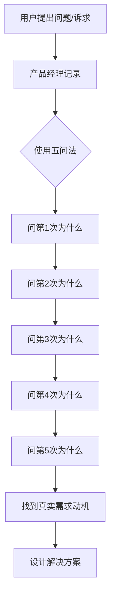
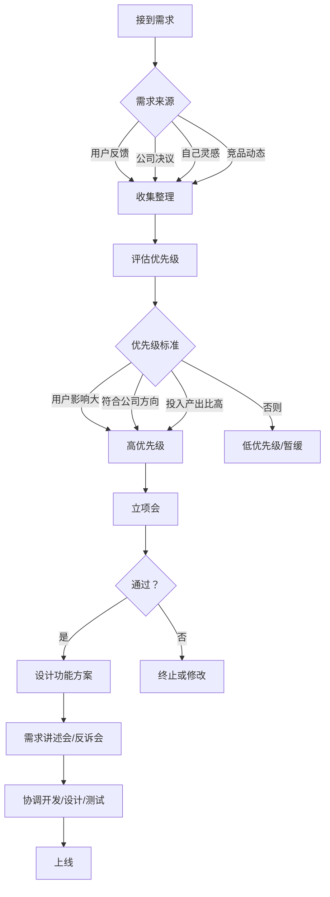
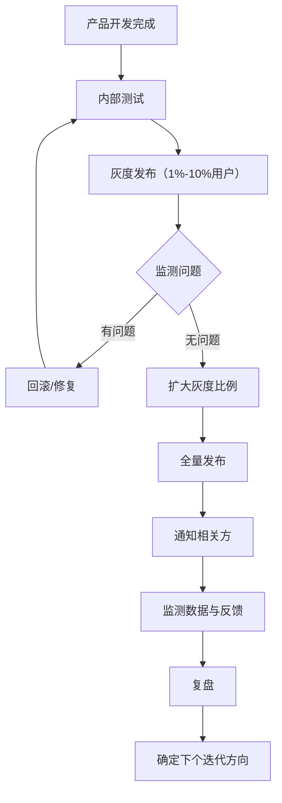
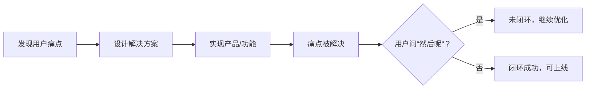
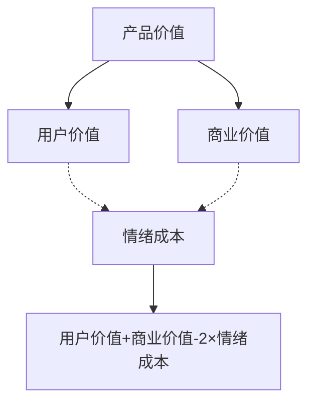

# 《我能做产品经理吗》章节总结

## 书籍信息
- 书名：《我能做产品经理吗》
- 作者：吕志超 编著；邱岳、唐沐、快刀青衣 口述
- 出版社：新星出版社
- 出版时间：2023年4月
- ISBN：9787513349666
- 字数：98千字
- PDF/OCR状态：文本完整，基于 EPUB 内容识别，无 OCR 错漏。

## 目录说明
- 目录识别完整，按以下顺序组织：
  - 总序
  - 序言
  - 第一章 行业地图
  - 第二章 新手上路（含入行准备、前期调研、产品设计、产品上线）
  - 第三章 进阶通道
  - 第四章 高手修养
  - 第五章 行业大神
  - 第六章 行业清单（含行业大事记、行业术语、推荐资料）
  - 后记
- 章节对应依据原书正文，无缺失。
- 流程图根据文本描述重建为 Mermaid 格式。

## 全书核心主题
本书旨在帮助读者判断自己是否适合成为互联网产品经理，并系统介绍产品经理的工作内容、能力要求、成长路径及行业现状。通过三位资深产品经理（快刀青衣、唐沐、邱岳）的口述经验，阐述了产品经理从新手到高手的完整进阶过程，涵盖用户调研、产品设计、团队协作、商业思维等核心能力。书中强调产品经理的核心价值在于发现问题并提供解决方案，同时指出好奇心、共情能力、追求完美、克制等特质的重要性。全书不仅为求职者提供决策参考，也为从业者提供了实践方法论。

---

## 总序

### 核心论点
问题：年轻人如何选择适合自己的职业？  
观点：通过“职业预演”——一本书聚焦一个职业，邀请顶尖高手从入门到进阶手把手带领，只需三小时即可预演一个职业，降低选择的不确定感。

### 关键概念/事件
- **职业预演**：通过真实从业者的经验介绍，让读者提前体验职业的全貌、挑战和成长路径。
- **前途丛书**：本套书的整体策划，旨在解决职业选择焦虑，每本书聚焦一个职业。
- **精品路线**：六章结构（行业地图、新手上路、进阶通道、高手修养、行业大神、行业清单），三小时完成预演。

### 逻辑推演/叙事脉络
从当代年轻人职业选择的困境出发（信息过载但可靠参考不足），引出策划本套书的初衷。通过邀请行业顶尖高手（而非普通写作者）提供一线智慧，并配备“导游”（编著者）辅助理解，让读者快速获得向高手请教一下午的认知水平。强调选择比努力重要，职业选择直接影响生命质量。

### 经典金句/数据
> “我们常常说，选择比努力还要重要。尤其在择业这件事情上，一个选择，将直接影响你或你的孩子成年后20%～60%时间里的生命质量。”

---

## 序言

### 核心论点
问题：什么是互联网产品经理？本书如何帮助不同读者？  
观点：产品经理是互联网产品的第一负责人，负责挖掘需求、设计功能、协调团队。本书通过三位高手口述，帮助大学生、职场新人、转行者、家长等了解这一职业。

### 关键概念/事件
- **B端产品 vs C端产品**：B端服务于企业/机构（如OA、CRM），C端服务于个人（如QQ、微信）。本书以C端为主。
- **产品经理的历史**：21世纪初随移动互联网兴起，乔布斯、张小龙、马斯克、雷军等是杰出代表。
- **三位受访者**：
  - 快刀青衣：得到App联合创始人，中国第一代产品经理。
  - 唐沐：曾任腾讯、小米，现创业，用户体验专家。
  - 邱岳（二爷）：曾任阿里巴巴、丁香园产品总监，现创办无码科技。

### 逻辑推演/叙事脉络
从广义产品经理（任何负责产品的人）切入，聚焦互联网产品经理。介绍三位受访者的背景和特点，说明本书适用人群（大学生、家长、新手、转行者、好奇者）。最后预告各章内容。

### 经典金句/数据
> “你想一辈子卖糖水，还是想得到一个改变世界的机会？” —— 乔布斯  
> “在产品经理的领域没有对错，只有选择的不同。” —— 邱岳

---

## 第一章 行业地图

### 核心论点
问题：产品经理是什么？需要什么特质？薪资、35岁危机、发展趋势如何？  
观点：产品经理是产品的“总负责人”，需要好奇心、强迫症、共情能力、发现“丑”的眼睛等特质。35岁是职业关键节点，但前景广阔，不会被AI完全替代。

### 关键概念/事件
- **产品经理的起源**：20世纪20年代宝洁公司麦古利，负责佳美香皂的品牌和营销，成为第一个产品经理。
- **“人人都是产品经理”的误解**：苏杰的书名指的是人人可以有产品思维，而非人人都能成为产品经理。
- **产品经理在团队中的角色**：像乐队指挥，不需要精通每个乐器，但要懂各工种的能力范围。
- **特质清单**：好奇心、强迫症（追求完美）、讨好型人格（以取悦用户为乐）、发现丑的眼睛（不满足现状）。
- **35岁危机**：30岁前应突破瓶颈，拿出成功产品；35岁后发展道路宽广（继续晋升、创业等）。
- **薪资水平**：全国平均22.3K/月，高级产品专家年薪可达400-600万（含股票/期权）。
- **转行建议**：懂技术、有开发经验、至少具备产品经理所需能力中的一项长板。

### 逻辑推演/叙事脉络
从历史起源讲起，澄清误解。通过乐队指挥比喻说明团队角色。逐一列出适合成为产品经理的特质（好奇心、强迫症、讨好型人格、发现丑）。讨论35岁危机的成因（技能单一、产品未上线无法证明自己）和应对。给出薪资数据和未来趋势判断（产品经理不会消亡，但需提升AI素养）。最后为应届生和转行者提供路径建议。

### 经典金句/数据
> “一个人适不适合做产品经理，我认为，最重要的是看他对生活有没有好奇心，以及对于身边的事是否敏感。” —— 快刀青衣  
> “好的产品经理会逼迫自己把每件事情做到极致。” —— 唐沐  
> “互联网产品经理这个职业在21世纪初随着移动互联网的蓬勃发展而出现。”  
> 薪资数据：4.5K～50K/月，平均22.3K/月（职友集，2022年12月）。

---

## 第二章 新手上路

本章分为四个子部分：入行准备、前期调研、产品设计、产品上线。以下按子部分整理。

### 2.1 入行准备

#### 核心论点
问题：入行前需要做哪些准备？如何面试？如何选择第一份工作？  
观点：具备三项底层能力（沟通、学习、共情）；每周试用产品并正向学习；面试时把自己当作产品经营；选择工作时领导＞机会＞平台＞薪酬；大公司优先于创业公司（除非明确想创业）。

#### 关键概念/事件
- **三项底层能力**：沟通能力（靠强沟通完成目标）、学习能力（快速补短板）、共情能力（代入用户场景）。
- **正向学习法**：每周试用几个产品，只找优点，找到5个可借鉴之处；重点关注微信、抖音、快手、淘宝、京东。
- **面试产品思维**：把简历、面试当作产品经营；研究公司；经得起追问；不造假（产品经理圈子很小）。
- **第一份工作优先级**：领导（专家型） > 机会（不做螺丝钉） > 平台 > 薪酬。
- **大公司 vs 小公司**：建议先到大公司受系统训练，再考虑创业公司；如果犹豫，直接去大公司。
- **职业规划**：找到自己真正感兴趣的产品类型，无限游戏，持续迭代。

#### 逻辑推演/叙事脉络
先讲底层能力（沟通、学习、共情），再讲日常习惯（每周试用产品，正向学习）。面试技巧（研究公司、简历细节、不造假）。选择工作时权衡领导、机会、平台、薪酬，给出明确优先级。最后提醒新人不要急着出方案，先聊天了解业务。

#### 经典金句/数据
> “张小龙有一句话叫‘一秒钟变小白’。”  
> “我每周都会强迫自己下载几个App去试用。”  
> “领导＞机会＞平台＞薪酬。” —— 快刀青衣  
> “如果你心里存在‘去大公司还是创业公司’这个疑问，我劝你直接去大公司。” —— 邱岳

### 2.2 前期调研

#### 核心论点
问题：如何做用户调研和竞品调研？如何挖掘真实需求？  
观点：自己最好是产品的用户；带着产品经理和用户的双重视角；面对面接触用户；用“五问法”挖掘真实需求；不盲目听从用户反馈；竞品分析目的是获得启发，而非批判。

#### 关键概念/事件
- **自己做用户**：只开发自己是用户的产品，这样判断最准确（唐沐）。
- **双重视角**：既当用户又当产品经理，发现可优化点。
- **用户调研方法**：用户观察、焦点小组、问卷法、大数据分析；更推荐直接与用户做朋友（微博互动）。
- **五问法**：连续问五次“为什么”，找到需求背后的真正动机。
- **用户不一定对**：用户不清楚自己的真正需求（如福特汽车例子）；产品经理需要引导。
- **竞品分析**：目的是获得启发，落实到自家产品；用多种语言、不设限搜索，顺藤摸瓜。

#### 逻辑推演/叙事脉络
从用户调研的重要性讲起，强调自己做用户。介绍如何通过双重视角发现问题。给出具体调研技巧（面对面、少问意愿多问行为）。用“五问法”挖掘真实需求。指出用户反馈的局限性（伪装、沉默的大多数）。转到竞品调研，强调目的导向，不抄袭而借鉴理念。最后给出搜索竞品的方法。

#### 流程图

#### 经典金句/数据
> “用户不需要1/4英寸的钻头，他需要的是1/4英寸的洞。”  
> “在汽车出现前，如果你问人们需要什么，他们的答案是一匹更快的马，而绝不会是一辆汽车。” —— 亨利·福特  
> “竞品分析的核心目的是把从竞品身上发现的洞察落实到对自家产品的思考和优化上。” —— 快刀青衣

### 2.3 产品设计

#### 核心论点
问题：如何判断需求优先级？如何开立项会？如何设计功能？如何让其他部门配合？  
观点：需求优先级取决于用户影响、公司方向、投入产出比；立项会需明确目标、资源、评判标准；设计功能时要紧扣问题场景；推动跨部门协作需站在对方立场。

#### 关键概念/事件
- **需求优先级三原则**：用户强烈程度（最不爽的地方）、公司当前方向、投入产出比。
- **立项会 vs 需求评审会**：立项会决定“做不做”，需求评审会决定“怎么做”。
- **立项会关键点**：了解公司立项步骤；明确产品要解决的问题；提前沟通各部门；定义成功指标；分配资源。
- **功能设计要点**：问题意识（每个功能要解决什么具体问题）；场景思维（谁、时间、地点、怎么用）；聚焦真实场景（如智能晾衣架失败案例）。
- **需求讲述会与反诉会**：会前与核心人员达成共识；会上拉齐认知；反诉会发现遗漏场景。
- **跨部门沟通技巧**：站在对方立场，让目标成为共同目标（如用技术胜负欲推动优化）。

#### 逻辑推演/叙事脉络
从需求来源开始，给出优先级判断方法。详细展开立项会的流程和注意事项（案例：补贴无上限导致公司倒闭）。转入功能设计，强调问题意识和场景思维（反例：砍掉“发布并复制”按钮导致效率下降）。介绍需求讲述会和反诉会的作用，强调会前沟通的重要性。最后讲解如何说服其他部门配合（运营看用户增长，技术看胜负欲）。

#### 流程图

#### 经典金句/数据
> “产品经理是一个能够准确定义问题，并对问题提出有效解决方案的人。”  
> “一定要站到使用者的场景中去。” —— 快刀青衣  
> “每一个需求实际上都有最佳答案。” —— 唐沐  
> 案例：用户需要“发布并复制”按钮，产品经理砍掉后遭数百人邮件骂。

### 2.4 产品上线

#### 核心论点
问题：如何保证产品顺利上线？如何避免上线灾难？上线后如何维护口碑？如何复盘？  
观点：上线前需考虑法务、财务、公关等非产品团队；采用灰度发布；确保相关方知情；上线后积极回应用户真问题；复盘分为目标达成检查和下一步迭代方向。

#### 关键概念/事件
- **上线被喊停的原因**：未考虑法务（侵权）、财务（计费复杂）、公关（舆论风险）。
- **灰度发布**：先对1%～10%用户发布，观察问题，逐步扩大，避免全量故障。
- **相关方知情**：技术（依赖服务）、客服（准备话术）、财务/法务/公关。
- **上线成功的标准**：主要场景和逻辑顺利运行，数据正常。
- **口碑维护**：少用“自动回复”，真正解决问题；区分真问题和伪问题（案例：牙医要求跨街用Wi-Fi）。
- **复盘两步法**：第一步看目标是否达成（数据支撑）；第二步找出下一步迭代方向。

#### 逻辑推演/叙事脉络
从上线前的隐患（法务、财务等视角）入手，强调灰度发布的重要性。列出关键相关方（技术、客服、财务、法务、公关）必须知情。通过在线问诊案例说明成功标准。口碑维护部分以唐沐微博互动为例，展示如何解决用户问题（包括上门检修）。最后给出复盘的结构化方法。

#### 流程图

#### 经典金句/数据
> “产品上线时一定要留有灰度。” —— 快刀青衣  
> “一个失败的产品发布通常问题出在‘有人不知道’。” —— 邱岳  
> “少用‘自动回复’式的客套话，真真切切地去了解用户的问题。” —— 唐沐  
> 案例：得到App日更专栏导致财务计费复杂，耗费大量技术资源解决。

---

## 第三章 进阶通道

### 核心论点
问题：如何从无到有做好新产品？如何应对老板的不靠谱需求？如何管理团队和项目？  
观点：新产品是旧资源生长出来的；找到种子用户；设计最小闭环；商业模式决定产品边界；老板的需求要挖掘真实目的；培养团队创新精神；用多重指标锁定目标；对伤害核心目标的项目果断喊停。

### 关键概念/事件
- **新产品诞生条件**：内容、技术、商业模式等各方面成熟（小爱音箱源自腾讯小Q机器人雏形）。
- **种子用户特征**：愿意尝试新鲜事物，愿意参与共建和传播（小米MIUI的100个超级用户）。
- **商业模式制约**：产品经理无法解决所有问题，有时需要改变商业模式（如小米路由器低价无法提供上门服务）。
- **最小闭环**：发现痛点 → 给出解决方案 → 解决痛点；用户不问“然后呢”即为闭环。
- **用户体验全链条**：从第一观感、购买、开箱、使用到售后甚至丢弃。
- **应对老板需求**：挖掘老板的真实目的（如罗胖的“俄罗斯方块”需求实为让用户轻松听完音频）。
- **团队管理**：培养创新（跨行业借鉴、看科幻电影）；让员工有成就感（告知产品意义）。
- **项目进度管理**：每日例会、书面汇报、按里程碑监控。
- **喊停项目**：如果伤害核心目标，即使开发到一半也要停止（得到课程打包案例）。

### 逻辑推演/叙事脉络
从新产品诞生开始，强调不是拍脑袋，而是资源积累的结果。种子用户的选择和口碑传播。商业模式决定产品边界（对比小米和如影智能）。最小闭环理念（先步行再换车）。用户体验全链条（开箱到丢弃）。应对老板不靠谱需求：挖掘真实目的，不机械执行（音频形状需求转化为轻松听完）。团队管理：创新方法（跨行业借鉴、科幻电影）；留人靠成就感而非加薪。项目管理：多重指标锁定目标（分享人数而非次数）、每日同步、对伤害核心目标的项目喊停并妥善沟通。

### 流程图（最小闭环）

### 经典金句/数据
> “好的产品都不是一个平地起高楼的事儿，而是需要内容、技术、商业模式等各方面的准备。” —— 唐沐  
> “闭环指的是，你发现了一个用户的痛点，然后你做了一个产品，给出一个好的解决方法，最后解决了这个痛点。”  
> “如果你认为老板提出的需求或者方案非常不靠谱，那么你就需要去了解他为什么提出这样的想法，挖掘他的根本目的。” —— 快刀青衣  
> 案例：得到App课程打包项目开发三周后被喊停，因伤害核心目标（课程质量）。

---

## 第四章 高手修养

### 核心论点
问题：顶级产品经理如何进行商业布局？有哪些好洞察？需要警惕什么？  
观点：不要利用人性弱点赚钱；给用户超预期体验要算好经济账；产品价值 = 用户价值 + 商业价值 - 2×情绪成本；优秀产品经理要懂得克制；合理分配公司资源；警惕脱离用户。

### 关键概念/事件
- **社会责任**：不利用人性弱点（贪婪、恐惧、攀比）赚钱，正向引导用户（小爱音箱的闲聊数据暴露孤独，但不做收费陪聊）。
- **超预期体验的代价**：小米路由器定价低于成本，靠巨量销售摊薄成本；贾跃亭反例导致崩溃。
- **产品价值公式**：产品价值 = 用户价值 + 商业价值 - 2×情绪成本（以QQ广告位优化为例）。
- **克制**：好的产品经理懂得做减法（谷歌地图 vs 高德地图）。
- **资源分配**：根据公司阶段目标分配资源（得到App从通识课程到训练营到线下学习）。
- **警惕脱离用户**：身居高位后要持续接触用户、理解当下风尚（马化腾的忧虑）。

### 逻辑推演/叙事脉络
从商业伦理出发，反对利用人性弱点（米键救人案例）。超预期体验需算经济账（小米路由器定价策略）。引出产品价值公式，用QQ广告位冲突说明如何减少情绪成本。克制理念（谷歌地图简约风格）。公司资源分配随目标变化（得到App三个阶段）。最后警告高手产品经理不要脱离用户，需主动接触年轻用户和流行文化。

### 流程图（产品价值公式）

（注：原文为两个相交圆，交集体代表情绪成本，非阴影面积为产品价值。此图用Mermaid近似表达。）

### 经典金句/数据
> “如果你毫无忌惮地利用人性的弱点，产品未来的路就会越来越窄，甚至迅速地走向消亡。” —— 唐沐  
> “最优秀的产品经理一定要懂得克制。” —— 快刀青衣  
> “我最担心的就是一些资深的产品经理年纪越来越大，越来越有钱，不知道互联网上的‘新兴人类’想要什么。” —— 马化腾  
> 案例：米键救了东北工人一命；小米路由器定价129元低于成本135元，最终盈利。

---

## 第五章 行业大神

### 核心论点
问题：顶级产品经理（乔布斯、马斯克、张小龙、雷军）是如何工作的？  
观点：乔布斯受感激前人之心驱动“为历史长河加点什么”；马斯克“非常理想，特别现实”，通过拆解实现疯狂目标；张小龙尊重用户、让产品自然演化、坚持工具属性；雷军“和用户交朋友”，做感动人心价格厚道的产品。

### 关键概念/事件
- **乔布斯**：动力是感激前人贡献，为历史长河留点什么；极简主义、追求极致。
- **马斯克**：从本质推演（火箭原材料成本仅2%）；拆解目标（20000=20×10×100）；让人类成为多星球物种。
- **张小龙**：尊重用户（不称“您”、不看聊天记录）；让群体自我演化（不批量导入好友）；好的产品用完即走，走了还会回来。
- **雷军**：和用户交朋友（小米MIUI 100个超级用户）；性价比承诺（硬件净利润率不超过5%）。

### 逻辑推演/叙事脉络
分别介绍四位大神。乔布斯部分强调其动力来源（感激与传承）。马斯克部分展示其理想主义与现实主义结合的方法（成本拆解、任务拆解）。张小龙部分澄清“克制”误解，代之以“用户、演化、工具”三原则。雷军部分突出用户参与和性价比理念。

### 经典金句/数据
> “我们试图用我们仅有的天分去表达我们深层的感受，去表达我们对前人所有贡献的感激，去为历史长河加上一点儿什么。” —— 乔布斯  
> “克制这个词从来没有在我的脑袋里面出现过。” —— 张小龙  
> “好的产品用完即走，走了还会回来。” —— 张小龙  
> “小米向用户承诺，每年整体硬件业务的综合税后净利润率不超过5%。” —— 雷军，2018年

---

## 第六章 行业清单

### 6.1 行业大事记

#### 核心论点
问题：产品经理职业发展历程是怎样的？  
观点：从宝洁公司第一个产品经理，到互联网时代爆发，再到2018年后竞争激烈。

#### 关键事件
- 20世纪20-30年代：宝洁麦古利，第一个产品经理。
- 20世纪90年代：To B产品经理随软件时代诞生。
- 21世纪初：互联网时代，产品经理关注用户体验。
- 2009年前后：周鸿祎、马化腾、乔布斯重新定义产品经理。
- 2012年前后：移动互联网爆发，产品经理门槛降低，大量人员涌入。
- 2018年以后：移动互联网进入平稳期，竞争激烈。

### 6.2 行业术语

#### 核心论点
问题：产品经理常用术语有哪些？  
观点：列出PRD、ROI、DAU、MAU、PV、UV、ARPU、LTV、GMV、MVP、灰度发布等核心术语的定义。

#### 关键术语（节选）
- **PRD**：产品需求文档。
- **DAU/MAU**：日/月活跃用户。
- **GMV**：商品交易总量。
- **MVP**：最小可行产品。
- **灰度发布**：平滑过渡的发布方式，可做AB测试。
- 等20余个术语详见原文。

### 6.3 推荐资料

#### 核心论点
问题：推荐哪些书籍帮助产品经理成长？  
观点：列举了苏杰《人人都是产品经理》、 Marty Cagan《启示录》、俞军《俞军产品方法论》、张小龙相关等20余本。

#### 精选推荐
- 《人人都是产品经理（入行版）》：启蒙读物。
- 《启示录》：定义好产品的模型（价值、可用性、可行性）。
- 《俞军产品方法论》：更高角度理解产品经理。
- 《史蒂夫·乔布斯传》：学习对产品和用户的洞察。
- 《浪潮之巅》：拓宽视野。

---

## 后记

### 核心论点
问题：本书是如何诞生的？感谢哪些人？  
观点：这是一次联合读者、行业高手、审读团的共创实验，感谢所有参与者。

### 关键内容
- 感谢前期调研读者、审读人（上千位）、得到同事。
- 感谢三位受访高手：快刀青衣、唐沐、邱岳。
- 祝愿读者找到一生所爱的事业。

### 经典金句/数据
> “有的人只是做着一份工作，有的人却找到了一生所爱的事业。祝愿读过这套书的你，能成为那个找到事业的人。”

---

# 总结
本书系统性地解构了互联网产品经理这一职业，从行业地图到新手入门、进阶、高手修养，再到行业大神案例和实用资料，构建了完整的知识体系。三位口述者结合自身实战经验，提供了大量具体案例和方法论（五问法、灰度发布、产品价值公式等），既有理想主义（改变世界）也有现实主义（沟通技巧、项目管理）。适合作为产品经理的入行指南和进阶参考。