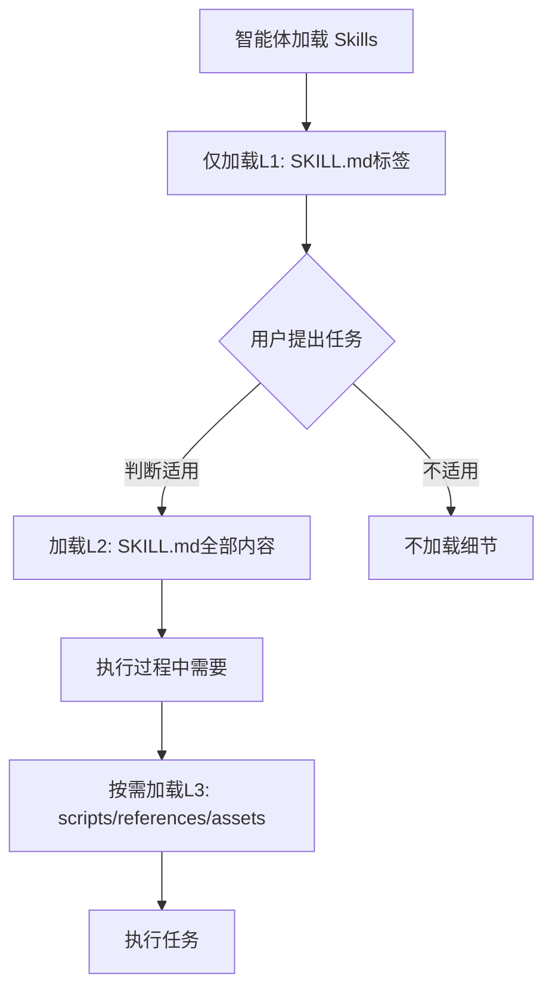
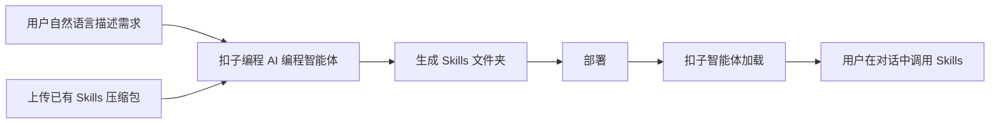
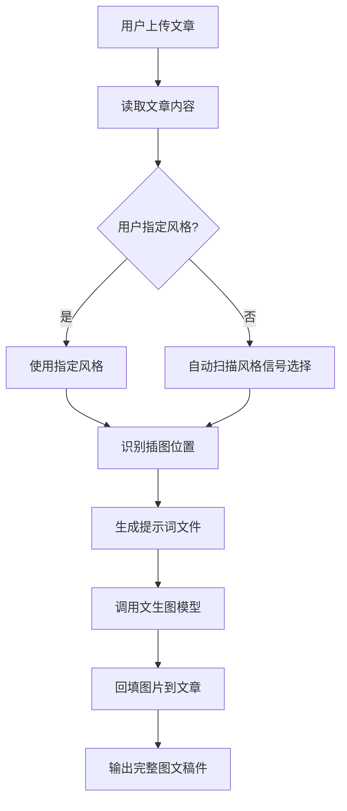
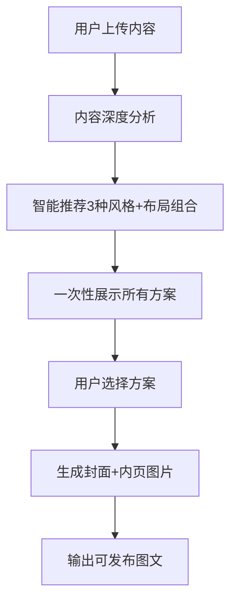
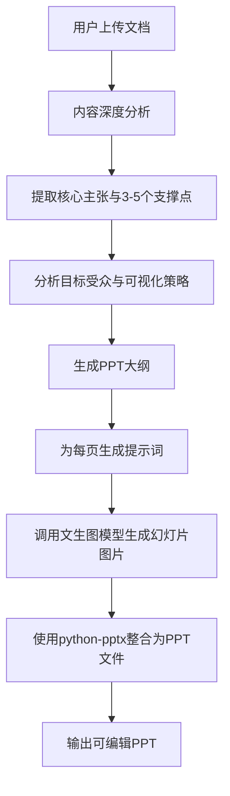
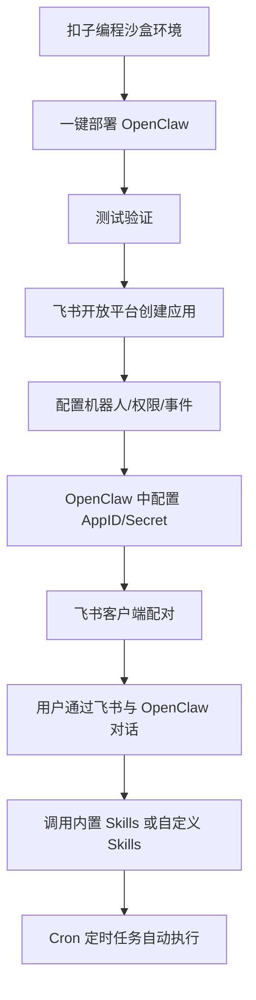

# 《扣子(Coze) Skills+OpenClaw 实战 零基础玩转 AI 智能体》章节总结

## 书籍信息
- **书名**：扣子（Coze）Skills+OpenClaw 实战：零基础玩转 AI 智能体
- **作者**：邢云阳
- **出版社**：人民邮电出版社有限公司
- **出版时间**：2026-03-12
- **ISBN**：9787115694492
- **PDF状态**：文本层基本完整，存在部分 OCR 识别痕迹，图表可识别
- **OCR状态**：整体可读，少量页码标注和图像引用需人工整理

## 目录说明
- 目录识别情况：完整识别，包含5个部分、9个章节及前言、版权信息等
- 章节对应依据：按原书页码顺序和标题层级整理
- OCR修复说明：部分图片描述转换为文本说明，流程图已用 Mermaid 重建

## 全书核心主题
本书系统讲解如何通过国产低代码平台扣子（Coze）及扣子编程，零代码开发与使用 Skills（技能），让通用智能体变身垂直领域专家。全书分为基础入门、纯文字生成 Skills、图文创作 Skills、多模态与多 Skills 协同、OpenClaw 部署集成五大部分，覆盖直播带货话术、股票技术分析、公众号配图、小红书图文、PPT 创作、数字营销 SEO/GEO 等6大高频场景。核心观点：Skills 是专家经验的沉淀与复用，通过自然语言描述即可封装为可复用模块，智能体按需加载，实现“技术退后，创意上前”。

---

## 第1章：快速认识智能体和 Skills

### 核心论点
本章解决“什么是智能体、什么是 Skills”的基础认知问题。作者认为智能体是赋予 AI 大模型目标感、规划能力和工具调用权限的实用方法，而 Skills 则是将专家经验封装为标准化文档，使智能体能够按需加载、专业执行任务。

### 关键概念/事件
- **智能体本质**：让 AI 大模型从被动应答者转变为主动执行者，通过配备可组合、可触发的 Skills。
- **ReAct 模式**：Reasoning + Acting，通过提示词工程引导 AI 具备工具调用能力，无需基本功。
- **Function Calling**：AI 大模型出厂前就练就的基本功，能自然准确地调用工具。
- **深度思考型智能体**：具备意图识别、生成执行计划、反馈人类、执行、反思与记忆能力的高阶形态。
- **上下文污染**：将无关信息塞入有限上下文会干扰模型理解，Skills 通过渐进式按需加载避免此问题。

### 逻辑推演/叙事脉络
从智能体的本质出发，回顾其发展路线：GPT Store 奠定“大模型+工具=智能体”范式 → 国内扣子、Dify 降低门槛 → 发现工具调用无法应对复杂推理 → 引入 ReAct、Plan、Reflection 等设计模式 → 记忆成为新瓶颈 → 多智能体系统（工作流、主从架构）应运而生。随后引出 Skills 作为专家经验沉淀的标准化格式，以 Markdown 为核心，按 L1/L2/L3 三级渐进加载。

### 流程图

#### Skills 工作机制（按需加载）

### 经典金句/数据
> “旧时王谢堂前燕，飞入寻常百姓家。”——智能体从高居技术殿堂走进日常工作生活。
> “Skills 的本质还是编写提示词，只不过有了明确的格式规范，可以将散落的提示词、参考文件、代码进行汇总。”
> “MCP 就像是给 AI 智能体安装了一个标准 USB 接口。”

---

## 第2章：非程序员使用 Skills 的打开方式

### 核心论点
本章解决“非技术用户如何使用 Skills”的问题。作者观点：扣子2.0体系下的扣子编程产品，搭载 AI 编程功能，用户只需自然语言描述需求，即可生成可执行 Skills，彻底告别低代码编排的复杂节点。

### 关键概念/事件
- **扣子编程**：前身是扣子开发平台，新增 AI 编程智能体（深度思考型），用户扮演“老板”，AI 扮演“员工”。
- **Vibe Coding**：通过自然语言对话驱动代码生成，无需理解底层实现。
- **沙箱**：独立隔离空间，确保 Skills 开发与运行的安全性、可复现性。
- **扣子（原扣子空间）**：对标 Manus 的通用智能体，具备意图识别、计划、反思、联网搜索等能力。
- **技能商店**：提供官方、社区或自研 Skills 的加载与使用入口。

### 逻辑推演/叙事脉络
首先介绍扣子编程的功能跃迁：从低代码节点连线到自然语言对话式 AI 编程。以“天气助手智能体”为例，演示如何通过提示词让 AI 自动完成开发、测试。接着展示 Skills 开发：切换到“技能”选项卡，输入需求或上传压缩包，系统自动生成 SKILL.md 及目录结构。然后介绍扣子产品：用户直接输入复杂任务（如大学微积分笔记），智能体多步思考、人类确认框架后生成完整文档。最后说明技能商店的添加与使用流程。

### 流程图

#### Skills 开发、部署与使用架构

### 经典金句/数据
> “从人适配工具走向工具理解人的根本转变。”
> “用户只需扮演‘老板’的角色，而 AI 编程智能体则扮演‘员工’。”
> “真正的零门槛转机，出现在 2025 年年底——Anthropic 公司推出 Skills 功能。”

---

## 第3章：直播带货话术复用 Skills 开发实战

### 核心论点
本章解决“如何将优秀主播的隐性话术经验转化为可复用资产”的问题。作者观点：通过结构化梳理直播环节（聚人、留客、锁客、说服、催单、下单），封装为 Skills，使通用智能体秒变直播带货话术生成专家。

### 关键概念/事件
- **直播六环节**：聚人（吸引眼球）、留客（留住用户）、锁客（建立信任）、说服（传递价值）、催单（制造紧迫感）、引导下单与关注。
- **SKILL.md 结构**：YAML Front Matter 元信息 + 任务目标 + 操作步骤 + 资源索引 + 注意事项 + 使用示例。
- **references 目录**：存放“直播话术指南.md”作为知识依据。
- **环境变量**：部署时为敏感信息（API Key）提供安全配置，本例无需设置。

### 逻辑推演/叙事脉络
首先分析需求：优秀主播“会做不会教”，经验易流失。设计项目方案：系统化沉淀话术结构，实现智能话术生成。前置准备：以聚人环节为例，设计欢迎话术（解读账号、共同话题、福利预告）和宣传话术（时间预告、内容预告、价值预告）。在扣子编程上传“直播话术参考.md”，输入提示词（任务目标+功能要求+输出要求），系统自动生成 Skills。技术拆解：查看文件目录，SKILL.md 核心内容包含收集产品信息、阅读参考文档、按阶段生成话术、整合优化。测试以“红豆薏米茶”为例，输出覆盖完整六环节。最后部署并在扣子中加载使用。

### 经典金句/数据
> “会做不会教”——优秀主播难以结构化表达自己的经验。
> “顶尖主播的经验，转换为团队可复用的核心能力。”
> 话术示例：“欢迎[昵称]宝子进入直播间！想要[产品名称]的不要走开，我们马上就要上架啦！”

---

## 第4章：股票技术分析 Skills 开发实战

### 核心论点
本章解决“普通投资者如何自动化执行短线强势封板股选股策略”的问题。作者观点：将专业的短线技术分析逻辑（封板强度、换手率、板块强度）通过自然语言提示词描述，扣子编程自动生成可执行的 Skills，无需编程能力。

### 关键概念/事件
- **封板股**：股价上涨至涨停价并有大量买单封死，反映市场强烈看多情绪。
- **封板成交比** = 封单金额 / 成交额，比值越高代表封板意愿越强。
- **换手率区间**：10%~20% 为理想活跃度。
- **AKShare**：开源金融数据接口，Skills 自动调用获取涨停股池。

### 逻辑推演/叙事脉络
背景知识：短线强势封板股选股四步骤——获取涨停股池、筛选封板强度（成交额≥1亿元，封板成交比前25名）、过滤换手率（10%~20%）、评估板块强度。项目方案：不适合手工编写 Skills，而用自然语言描述规则。编写提示词（明确数据获取、过滤条件、输出字段），在扣子编程粘贴发送，系统自动引入 AKShare 库、编写脚本。测试输入“2026年1月23日”，返回股票列表，与东方财富网人工核对“汉商集团”验证准确。部署后，扣子智能体调用输出结构化数据及自然语言摘要。

### 经典金句/数据
> “构建高质量智能体 Skills 的核心，并不在于是否掌握编程能力，而在于是否深入理解相关业务逻辑。”
> “精准的业务定义是智能体有效赋能的前提。”
> 封板成交比计算：封单金额 / 成交额，保留三位小数。

---

## 第5章：微信公众号文章配图 Skills 开发实战

### 核心论点
本章解决“公众号作者配图难、效率低”的问题。作者观点：通过手工编写 SKILL.md 及风格模板，构建一个能自动分析文章内容、生成风格一致插图并插入合适位置的 Skills，实现从“人工选图”到“智能生成”的升级。

### 关键概念/事件
- **article-illustrator**：技能名称，含 SKILL.md、prompts/system.md、references/styles/ 下的多种风格（blueprint, watercolor, chalkboard 等）。
- **五步工作流**：识别配图位置 → 匹配插画风格 → 生成提示词文件 → 调用图像生成技能 → 回填图文内容。
- **风格决策规则**：根据内容信号（个人故事→warm，简单禅意→minimal，有趣教程→playful 等）自动选择。
- **文件管理策略**：会话级隔离目录 illustrations/{topic-slug}/，保存源文件、大纲、提示词、图片。

### 逻辑推演/叙事脉络
需求分析：免费图库有限、商用授权贵、文生图需反复调参。项目方案设计五步骤，并决定手工编写（增强控制力）。编写 SKILL.md：YAML 元信息 → 风格库表格 → 自动风格选择规则 → 工作流（分析内容选择风格、识别插图位置、生成图片、插入文章）。编写 prompts/system.md 规范图像规格（16:9 横向、手绘质感、文本手写风格）。编写风格模板（以 blueprint 为例：设计美学、调色板、视觉元素规范、建议与禁忌）。在扣子编程上传 .zip 包，测试文档《上了两个月私教课了，聊聊健身》，发现头图位置错误，通过对话修正提示词后成功。部署后在扣子中调用，选用 Sketch 风格，生成复古速写风格配图并正确插入。

### 流程图

#### 文章配图工作流

### 经典金句/数据
> “插图三个目的：信息补充、概念可视化、想象力引导。”
> “原则：宁多勿少。”
> “头图的意思是要放在文章所有文字的最前面。”（调试修正）

---

## 第6章：小红书图文生成 Skills 开发实战

### 核心论点
本章解决“如何批量生成符合小红书平台风格、兼具视觉吸引力与信息密度的图文笔记”的问题。作者观点：采用迭代式开发，从最小可行样例出发，逐步添加视觉风格模板和布局模板，使智能体能够根据内容推荐方案、生成可发布图文。

### 关键概念/事件
- **爆款笔记四特征**：强视觉首图、高信息密度、明确的利他价值、较强的社交传播属性。
- **视觉风格模板**：fresh（清新自然）、blueprint（科技蓝图）、watercolor（水彩）等，包含调色板、视觉元素、排版、适用场景。
- **布局模板**：balanced（平衡布局）定义信息密度（3~4个关键点）、留白比例（40%~50%）、标题位置等。
- **方案确认机制**：智能体分析内容后推荐三种（风格+布局）组合，一次性展示，由用户选择。

### 逻辑推演/叙事脉络
从灵感出发：编写初版提示词（内容分析、风格适配、自动生成），扣子编程生成初版 Skills。测试《皖南七日旅游攻略》，输出7张图片，但色彩单调、插画同质化、文化表达不足。第一轮迭代：添加视觉风格模板（fresh 等），修改提示词要求智能体推荐三种风格方案并让用户确认。测试后图文审美显著提升，但缺乏文字信息。第二轮迭代：添加布局模板（balanced 等），修改提示词要求组合视觉+布局方案。测试后实现了文字与图像的有机融合（标题、要点清晰）。最终部署，在扣子中测试科技类文档《OpenClaw与Mac mini联动效应分析报告》，选择“流行风格+对比布局”，生成甜酷科技风图文。

### 流程图

#### 小红书图文生成迭代流程

### 经典金句/数据
> “高互动率的笔记通常具备：强视觉首图、高信息密度、明确的利他价值、较强的社交传播属性。”
> “设计驱动智能生成。”
> “通过两轮迭代，图文生成效果实现了从内容准确到视觉吸引，再到叙事清晰、文化浸润的阶段性跃迁。”

---

## 第7章：PPT 创作助手 Skills 开发实战

### 核心论点
本章解决“从文档自动生成排版美观、内容贴合的完整 PPT 文件”的问题。作者观点：PPT 生成的核心难点在于将多张幻灯片整合为可编辑文件，通过扣子编程的 Vibe Coding 能力自动生成整合代码（如 python-pptx），非技术用户也能跨越编程门槛。

### 关键概念/事件
- **PPT 创作五步骤**：内容深度分析 → PPT 大纲生成 → 准备设计美学模板 → 幻灯片图片生成 → 整合为 PPT 文件。
- **内容分析框架**：识别核心主张、支撑要点、行动号召、目标受众、可视化优先级、叙事结构。
- **样式规则**：尊重读者注意力（每张一个想法）、数据可追溯性、自包含提示、无占位符、叙述性标题、避免 AI 陈词滥调、有意义的封底。
- **整合代码**：使用 python-pptx 库将生成的图片合成为 .pptx 文件。

### 逻辑推演/叙事脉络
需求分析：从文档直接生成 PPT，支持多源输入，内置多种风格模板，自动整合文件。设计创作步骤：深度分析 → 大纲生成 → 模板准备 → 图片生成 → 整合。细化内容分析框架（编写 analysis-framework.md 保存到 references）。细化样式规则（标题规范、避免陈词滥调、封底要求、幻灯片结构表格）。在扣子编程中，用户只需描述需求，系统自动生成 SKILL.md 及整合代码。测试验证：上传文档，智能体按步骤生成每页幻灯片图片，最后调用 python-pptx 输出 .pptx 文件。

### 流程图

#### PPT 创作助手工作流

### 经典金句/数据
> “PPT 最忌讳直接粘贴大段文字。”
> “所有统计数据必须包含来源归属。”
> “不仅仅是‘谢谢’或‘有问题吗？’——有意义的封底包括清晰的行动号召、难忘的关键要点、发人深省的结尾陈述。”

---

## 第8章：数字营销 GEO 与 SEO Skills 库开发实战

### 核心论点
本章解决“复杂商业场景中多 Skills 协同工作”的问题。作者观点：基于研究-构建-优化-监控四阶段方法论，构建 16 个可组合的 Skills 库，通过“相关 Skills”字段建立关联索引，使智能体自主串联任务，实现从关键词研究到内容生成再到长期监控的全流程自动化。

### 关键概念/事件
- **SEO vs GEO**：SEO 优化传统搜索引擎排名；GEO 优化生成式 AI 引用（如 AI 概览），从点击转换转向引用归因。
- **四阶段方法论**：研究（关键词、SERP、竞品、内容缺口）→ 构建（深度内容、GEO、元标签、Schema）→ 优化（页面审计、技术诊断、内链、内容刷新）→ 监控（排名追踪、外链分析、决策看板、异常管理）。
- **相关 Skills 机制**：在 SKILL.md 末尾添加 `## 相关 Skills` 列表，让智能体感知可串联的其他技能。
- **长期计划**：扣子提供的定时任务功能，可让智能体 7×24 小时监控关键词排名和 AI 引用率。

### 逻辑推演/叙事脉络
技术背景：搜索生态从索引时代迈向生成时代，流量规则变为引用归因和语义建模。设计四阶段 Skills 库。研究阶段以“关键词研究 Skills”为例：编写 SKILL.md，定义何时使用、功能列表、9 步执行逻辑（业务建模、核心词提取、长尾扩展、意图判定、竞争评估、ROI 评分、AI 引用潜力、主题权威度、报告交付）。构建阶段以“SEO 内容编写器”为例：10 步逻辑（需求锚定、竞品分析、标题优化、元描述、层级架构、页面 SEO 校准、模块化创作、内外部链接、质量把关）。优化阶段以“页面 SEO 审计器”为例：10 个维度（全局锚定、标题标签、元描述、H 标签、内容深度、关键词关联、内链生态、多媒体资产、技术性 SEO、输出审计方案）。监控阶段以“排名跟踪器”为例：7 步逻辑（监控坐标建立、实时位次、异动分析、搜索特征占位、GEO 可见性、市场声量博弈、输出决策报告）。部署时因平台限制需逐个上传 16 个 Skills，但通过“相关 Skills”字段建立关联。最后在扣子中演示：输入“写一篇 2025 年医疗行业 AI 应用落地情况报告”，智能体自动规划调用多个 Skills，并利用“长期计划”创建定时监控任务。

### 流程图

#### 数字营销 GEO/SEO Skills 库四阶段协同

### 经典金句/数据
> “从点击转换转向引用归因。”
> “AI 时代，真正的核心竞争力，不再是会不会用 AI，而是能不能让 AI 为自己所用。”
> “长期计划：将智能体转换为一名 7×24 小时的‘监控员’。”
> 示例：关键词研究 Skills 的 9 步执行逻辑。

---

## 第9章：OpenClaw：基于扣子的部署与 Skills 实战

### 核心论点
本章解决“如何将 Skills 无缝接入企业级业务系统（如飞书）并实现定时自动化任务”的问题。作者观点：通过扣子编程沙盒环境一键部署 OpenClaw，接入飞书后，用户可以像与同事聊天一样指挥 AI 工作，并可基于 Cron 定时调用自定义 Skills（如每日晚间推送选股结果）。

### 关键概念/事件
- **OpenClaw**：AI 助手，能在 PC/服务器上操作文件、使用浏览器、处理邮件，永远在线，可接入微信/钉钉/飞书。
- **三种部署方案**：本地硬件（门槛高、风险大）、传统云服务器（费用高、配置复杂）、扣子沙盒环境（性价比高、免运维、智能排错）。
- **飞书集成**：创建企业自建应用 → 添加机器人 → 批量导入权限 → 发布应用 → 在 OpenClaw 中配置 AppID/AppSecret → 配置事件与回调 → 配对码绑定。
- **Cron 定时任务**：通过自然语言指令（如“在每个交易日的20点定时调用 Skills”），OpenClaw 自动配置 Cron 并执行。
- **内置 Skills**：OpenClaw 预置 59 项 Skills（天气、搜索、文件操作等）。

### 逻辑推演/叙事脉络
介绍 OpenClaw 定位：不是聊天机器人，而是可控制操作系统的 AI 助手，应用场景覆盖生活管家、职场办公、一人公司。权衡三种部署方案后选择扣子沙盒。在扣子编程“优秀案例”中选择 OpenClaw 项目部署模板，一键创建副本。测试验证（回复“你好”）。接入飞书：详细步骤创建企业自建应用、添加机器人、批量导入权限（提供配置代码）、发布版本。在扣子编程中向 OpenClaw 发送配置指令，提供 AppID/AppSecret。配置事件与回调（长连接接收消息、添加“接收消息”事件、开通群聊权限）。在飞书客户端打开应用，发送消息获取配对码，粘贴到扣子编程完成配对。演示内置天气 Skills。进阶实战：上传第4章的股票技术分析 Skills 压缩包，OpenClaw 自动安装。使用自然语言指令“是否能基于 stock-limit-up-screening Skills 帮我实现在每个交易日的20点，定时调用该 Skills…”，OpenClaw 自动解析、配置 Cron 并测试。遇到问题（板块显示未分类）通过对话反馈，OpenClaw 自动修复。

### 流程图

#### OpenClaw 部署与飞书集成架构

#### 自定义 Skills 安装与定时任务流程

### 经典金句/数据
> “OpenClaw 的核心使命是将 AI 从聊天助手演变为连接真实世界的生产力工具。”
> “据 GitHub 最新数据，OpenClaw 在 4 个月的时间内登顶最受欢迎开源软件榜首。”
> “扣子编程沙盒环境：用户遇到的任何问题都可以发送给扣子编程，后台智能体将自动分析并解决。”
> “从今天起，无论是复杂的选股逻辑，还是咨询‘附近的火锅店’，都可以尝试将所有 AI 需求交给飞书里的 OpenClaw。”

---

*本书总结基于 PDF 内容逐章提取，严格遵循原文结构，未添加书中不存在的方法论或观点。所有流程图均根据书中描述用 Mermaid 重建。*