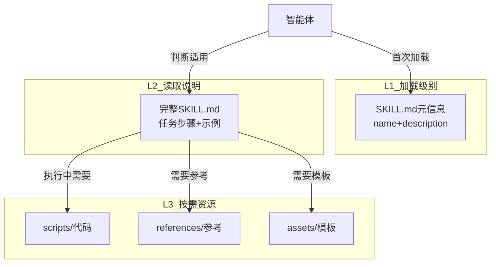
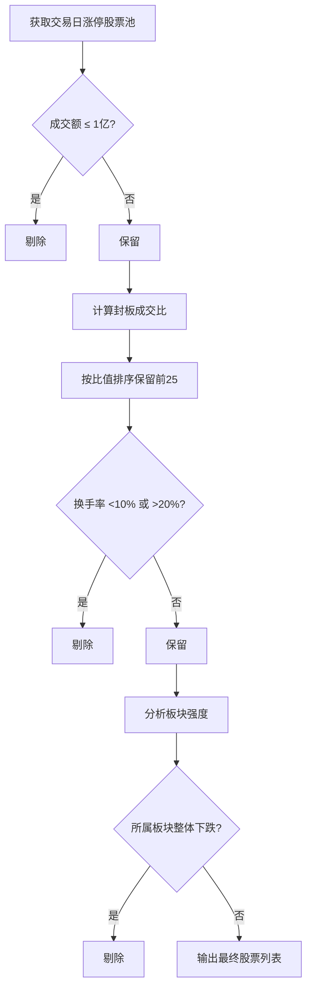
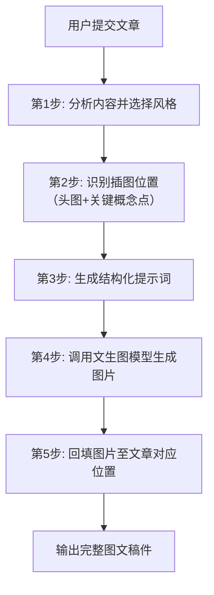
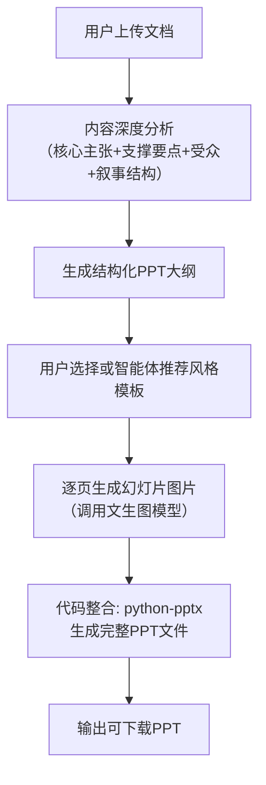
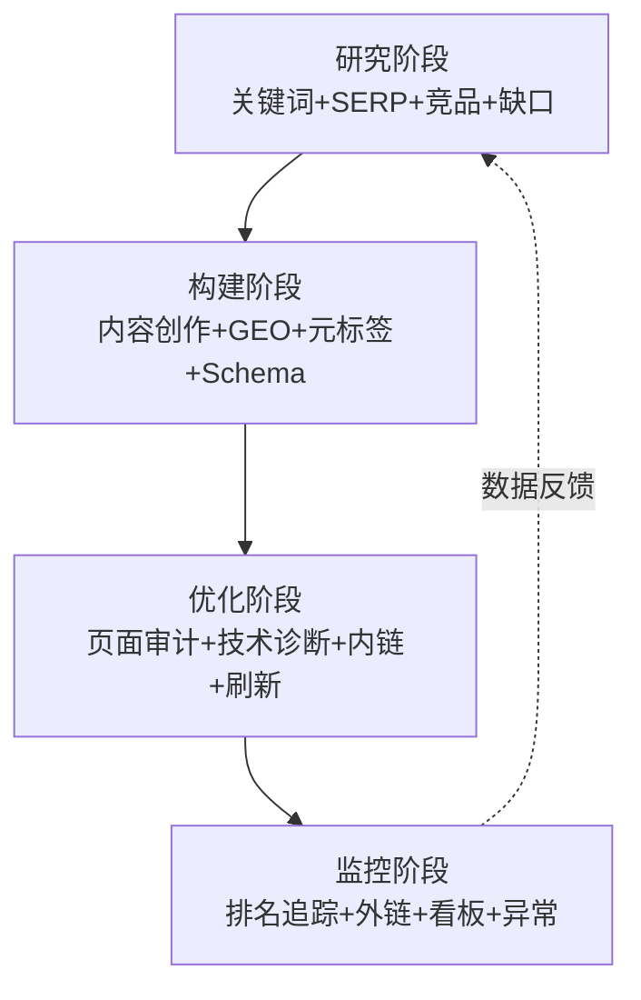
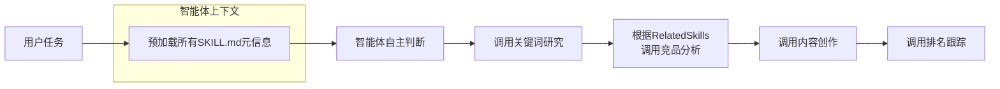
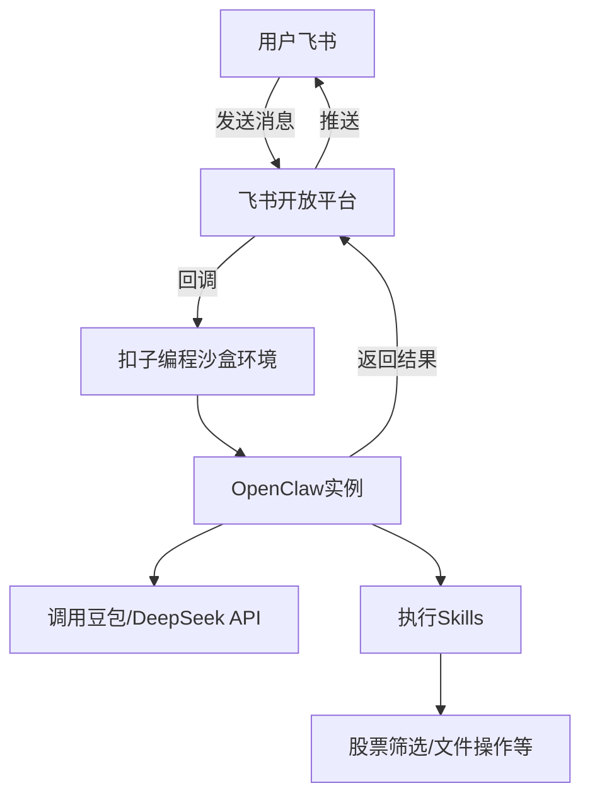

# 《扣子(Coze) Skills+OpenClaw 实战：零基础玩转AI智能体》章节总结

## 书籍信息
- **书名**：扣子（Coze）Skills+OpenClaw 实战：零基础玩转 AI 智能体
- **作者**：邢云阳
- **出版社**：人民邮电出版社有限公司
- **出版时间**：2026-03-12
- **ISBN**：9787115694492
- **PDF 状态**：基于OCR识别，页码连续但部分页面有扫描偏移，整体可读
- **OCR 状态**：识别率较高，少量格式错乱（如表格、代码块），已按原文逻辑还原

## 目录说明
- **目录识别情况**：原书目录完整，分为5个部分共9章，外加前言。本书总结严格按以下顺序输出：
  - 前言
  - 第一部分：基础入门篇（第1章、第2章）
  - 第二部分：纯文字生成Skills实战（第3章、第4章）
  - 第三部分：图文创作Skills实战（第5章、第6章）
  - 第四部分：多模态与多Skills协同实战（第7章、第8章）
  - 第五部分：OpenClaw部署与集成实战（第9章）
- **章节对应依据**：依据PDF正文中的标题层级（如“第1章 快速认识智能体和Skills”）进行定位
- **OCR修复说明**：少数表格（如风格库表格、部署方案表格）在OCR中格式错乱，已根据上下文逻辑重新整理

## 全书核心主题
本书以“零代码”为核心，系统讲解如何利用国产平台“扣子（Coze）”及其开发环境“扣子编程”开发、部署和使用AI Skills（技能）。全书从智能体与Skills的基础概念出发，通过6个高频场景实战项目（直播带货话术复用、股票技术分析、微信公众号配图、小红书图文生成、PPT创作助手、数字营销GEO与SEO技能库），覆盖纯文字生成、图文创作、多Skills协同等层次。最后介绍OpenClaw这一开源AI助手的部署与集成，实现定时任务、即时通信等企业级应用。作者强调：无需编程基础，只需理解业务逻辑并用自然语言描述需求，即可将个人经验转化为可复用的AI能力。

---

## 前言

### 核心论点
- **问题**：AI智能体（Agent）从概念走向应用落地，但低代码平台的工作流编排和MCP技术协议对非技术用户门槛过高，大多数人无法构建垂直领域的专家智能体。
- **观点**：Skills（技能）作为一种零代码、可复用的经验封装范式，能够彻底降低AI应用开发门槛。扣子平台深度集成Skills后，用户只需通过自然语言描述需求，即可让通用智能体变身领域专家。

### 关键概念/事件
- **MCP（模型上下文协议）**：为AI智能体提供统一的工具接入标准，类似“USB接口”，但实现仍需编写代码。
- **Skills**：以Markdown文档形式封装的“专家经验包”，包含任务目标、执行步骤、参考文件等，智能体按需加载使用。
- **扣子编程**：原名“扣子开发平台”，升级后新增AI编程功能，用户通过自然语言对话即可开发智能体、工作流和Skills。
- **扣子（原扣子空间）**：开箱即用的通用深度思考型智能体，支持加载技能商店中的Skills。

### 逻辑推演/叙事脉络
作者从2025年AI智能体落地年的背景出发，指出两大鸿沟：复杂工作流编排和MCP代码编写。随后介绍Anthropic公司推出的Skills功能，但初期仅限Claude产品使用，未能普及。2026年1月Skills开源后，扣子官方快速集成，推出扣子编程和扣子2.0，实现了真正的自然语言编程。本书的使命就是帮助非技术读者跨越代码鸿沟，将个人经验转换为AI资产。

### 经典金句/数据
> “真正的零门槛转机，出现在2025年年底——Anthropic公司推出Skills功能，正式拉开AI应用零代码定制的序幕。”
> “简而言之，扣子编程是用来开发智能体、Skills等的工厂，而扣子本身就是一个开箱即用的通用智能体。” (p.6)
> “AI时代，真正的核心竞争力，不再是会不会用AI，而是能不能让AI为自己所用。” (p.10)

---

## 第一部分：基础入门篇

## 第1章：快速认识智能体和Skills

### 核心论点
- **问题**：什么是智能体？什么是Skills？它们之间是什么关系？
- **观点**：智能体是赋予AI大模型目标感、规划能力和工具调用权限的实用方法；Skills是封装专家经验的结构化文档，智能体通过渐进式加载机制按需使用Skills，从而实现从通用助手到领域专家的升级。

### 关键概念/事件
- **智能体的本质**：通过“锦囊”类比——高人给主角三个锦囊（Skills），主角在适当时机打开执行，从而完成复杂任务。智能体 = 大模型 + 规划 + 工具/Skills。
- **ReAct模式**：Reasoning + Acting，引导大模型显式生成推理步骤和行动计划，提升复杂任务准确性。
- **上下文污染**：将无关信息塞入大模型有限记忆空间，挤占真正有用的知识。Skills通过渐进式加载（L1/L2/L3）避免此问题。
- **Skills的物理结构**：文件夹包含必选的SKILL.md（技能说明书），可选的scripts/（代码）、references/（参考资料）、assets/（静态资源）。

### 逻辑推演/叙事脉络
本章从智能体的演进脉络讲起：早期GPT Store实现工具调用，随后ReAct等设计模式增强推理能力，但上下文成为瓶颈。Skills的出现正是为了解决上下文污染——通过按需加载机制（图1-8），只将必要内容放入大模型记忆。作者详细解释了Skills的加载级别：L1仅加载SKILL.md的元信息（名称、描述），L2加载完整SKILL.md，L3按需加载代码和参考文件。最后介绍了编写SKILL.md所需的Markdown基础语法（标题、列表、表格、YAML Front Matter）。

### 方法流程图

#### 智能体演进脉络

#### Skills工作机制（图1-8）

### 经典金句/数据
> “本质上，智能体是一种让AI大模型更聪明、更能干的实用方法——通过赋予AI大模型目标感、规划能力和工具调用权限，使其从被动应答者转变为主动执行者。” (p.15)
> “Skills设计了渐进式、按需加载的机制……这种按需加载的设计，有效地防止了上下文污染现象。” (p.27-28)

---

## 第2章：非程序员使用Skills的打开方式

### 核心论点
- **问题**：非编程用户如何上手开发和使用Skills？
- **观点**：利用扣子编程平台的AI编程功能，通过自然语言对话即可完成智能体和Skills的开发、测试与部署；扣子（原扣子空间）作为通用智能体，可通过技能商店加载Skills实现即调即用。

### 关键概念/事件
- **扣子编程的AI编程智能体**：深度思考型智能体，用户扮演“老板”用自然语言提出需求，AI自动完成架构设计、代码编写、测试。
- **沙箱（Sandbox）**：独立的隔离运行环境，确保开发过程中的文件操作和代码执行不影响外部系统。
- **技能商店**：扣子平台内置的技能市场，可浏览、添加官方或社区发布的Skills，一键加载到对话中使用。
- **开发 vs 使用**：扣子编程负责开发Skills，扣子负责加载和使用Skills，形成完整生态。

### 逻辑推演/叙事脉络
本章首先介绍扣子编程的转型——从低代码节点编排转向AI原生对话编程。通过一个“天气助手智能体”的实战演示，展示如何使用自然语言描述需求，系统自动生成工具调用逻辑并完成测试。随后介绍Skills的开发：在“技能”选项卡中输入提示词或上传压缩包，系统自动生成SKILL.md和目录结构。最后介绍扣子的基础用法：直接输入复杂任务（如生成微积分笔记），智能体会进行意图识别、计划制定、人类确认后再执行；技能商店的添加和调用也通过@符号完成。

### 流程图

#### Skills开发、部署与使用架构（图2-8）

### 经典金句/数据
> “早期的低代码平台要求用户理解节点、连线、条件分支、数据流转等概念，本质上仍是将人类当作编排者……而今天，最合理、最高效的AI使用方式，就是回归最自然的交互形态——对话。” (p.38-39)
> “扣子（原扣子空间）是一款对标Manus的通用智能体产品，具备意图识别、思考、计划、反思、联网搜索等能力。” (p.43)

---

## 第二部分：纯文字生成Skills实战

## 第3章：直播带货话术复用Skills开发实战

### 核心论点
- **问题**：优秀主播的直播话术经验难以系统化传承，新主播上手成本高。
- **观点**：将高转化率直播的话术结构（聚人、留客、锁客、说服、催单、引导下单）沉淀为结构化模板，封装成Skills，即可让智能体根据产品信息自动生成完整直播脚本。

### 关键概念/事件
- **直播六环节**：聚人（开场暖场）、留客（互动停留）、锁客（建立信任）、说服（传递价值）、催单（制造紧迫感）、引导下单与关注。
- **话术模板**：欢迎话术（解读账号、共同话题、福利预告）和宣传话术（时间预告、内容预告、价值预告、产品包装渲染）。
- **references/目录**：存放“直播话术指南.md”作为智能体生成话术的核心参考依据。
- **SKILL.md结构**：包含YAML Front Matter（name, description）、操作步骤（收集产品信息→阅读参考→按阶段生成→整合优化）、资源索引、注意事项、使用示例。

### 逻辑推演/叙事脉络
本章从直播行业的痛点（会做不会教、经验依赖个人）出发，设计Skill的核心逻辑：系统化沉淀话术模板，实现智能话术生成。具体开发步骤：先准备好“直播话术指南.md”文档，在扣子编程中上传，然后输入提示词描述任务目标、功能要求和输出要求。系统自动生成Skills，并展示文件结构（SKILL.md + references/直播话术指南.md）。测试时以“红豆薏米茶”为例输入产品信息，智能体返回覆盖完整六环节的脚本，产品细节均被准确嵌入。最后在扣子中通过@符号加载技能，即调即用。

### 经典金句/数据
> “聚人环节的话术由欢迎话术与宣传话术两部分构成，通常包含三方面内容：打招呼、讲故事、福利预告/产品预告。” (p.55)
> “从通用型智能助手升级为专注于直播话术生成的专项智能体，真正实现了Skills即插即用的核心价值。” (p.68)

---

## 第4章：股票技术分析Skills开发实战

### 核心论点
- **问题**：短线强势封板股选股策略涉及大量数据处理和多维度分析，人工筛选效率低、易出错。
- **观点**：将短线封板股的筛选逻辑（涨停池→封板强度→换手率→板块强度）提炼为清晰的自然语言提示词，扣子编程即可自动生成可执行的Skills，实现自动化选股。

### 关键概念/事件
- **封板股**：股价上涨至涨停价并有大量买单封住，反映市场强烈看多情绪。
- **封板成交比** = 封单金额 / 成交额，比值越高代表资金封板意愿越强。
- **换手率区间**：10%~20%被认为既有活跃度又不致抛压过大。
- **板块强度**：个股所属板块整体走强时，个股后续继续涨停概率更高。
- **AKShare库**：开源金融数据接口，Skills中自动引入用于获取实时股票数据。

### 逻辑推演/叙事脉络
作者首先解释短线交易者的痛点：需要实时处理海量数据、题材轮动快、易受情绪影响。然后详细拆解选股4步骤：获取涨停池→筛除成交额≤1亿的股票，计算封板成交比保留前25→过滤换手率不在10%~20%的个股→分析板块强度。基于此编写结构化提示词，在扣子编程中发送后，系统自动生成包含Python爬虫脚本的Skills。测试输入“2026年1月23日”，返回符合条件股票列表，与东方财富网人工核对一致。部署后在扣子中调用，智能体不仅返回数据还自动生成分析摘要和结构化报告。

### 方法流程图

#### 短线强势封板股筛选流程

### 经典金句/数据
> “构建高质量智能体Skills的核心，并不在于是否掌握编程能力，而在于是否深入理解相关业务逻辑。” (p.80-81)
> “精准的业务定义是智能体有效赋能的前提。扣子编程的价值，正在于帮助领域专家将其经验落地为可复用的AI资产。” (p.81)

---

## 第三部分：图文创作Skills实战

## 第5章：微信公众号文章配图Skills开发实战

### 核心论点
- **问题**：公众号作者配图难，文生图模型需要反复调提示词，效率低且不稳定。
- **观点**：通过手工编写完整Skills（SKILL.md + 风格库 + 提示词模板），让智能体自动分析文章内容、选择风格、生成插图并插入合适位置，实现从“人工选图”到“智能生成”的升级。

### 关键概念/事件
- **五步工作流**：识别配图位置 → 匹配插画风格 → 生成提示词文件 → 调用图像生成技能 → 回填图文内容。
- **风格库**：存放于references/styles/目录，每个风格为独立.md文件（如blueprint.md, watercolor.md），定义配色、视觉元素、构图特征、适用场景。
- **系统提示词模板**：prompts/system.md，规定图像规格（16:9横向、手绘质感）、核心原则（禁止摄影元素、保持留白）、文本风格等。
- **文件管理规范**：每会话创建独立目录illustrations/{topic-slug}/，保存源文件、大纲、提示词、生成图片，确保可追溯。

### 逻辑推演/叙事脉络
本章选择手工编写而非自然语言生成，以便读者深入理解Skills内部结构。先编写SKILL.md，包含YAML元信息、风格库表格、自动风格选择决策规则、详细五步工作流。然后编写system.md提示词模板，规定生成图像的统一规格。最后编写多个风格定义文件（以blueprint为例，展示设计美学、调色板、视觉元素、约束规则等）。部署时打包上传至扣子编程，系统自动适配。测试使用《上了两个月私教课了，聊聊健身》文章，发现头图未置于最前，通过对话修正SKILL.md描述后问题解决。扣子中加载后选择Sketch风格，成功生成多张符合风格的插图并正确插入文章相应位置。

### 流程图

#### 自动配图五步工作流

### 经典金句/数据
> “Skills本质上是一个可复用的模块化文件夹，其内部结构不仅影响当前任务的清晰度与可维护性，更直接关系到未来在其他项目或场景中的复用效率与兼容性。” (p.105)
> “该Skills可根据用户提交的一篇已完成公众号文章，基于语义理解识别关键段落，结合指定图像风格生成若干张风格一致、内容相关的插图。” (p.86)

---

## 第6章：小红书图文生成Skills开发实战

### 核心论点
- **问题**：小红书笔记需要兼顾视觉美学、信息密度、利他价值和社交传播性，手工制作门槛高。
- **观点**：采用迭代式开发，从最小可行样例开始，逐步加入视觉风格库、布局模板库，并通过多轮测试优化，最终让智能体能自动生成多张图文、提供多方案选择、并将文案与图像深度融合。

### 关键概念/事件
- **迭代开发路径**：初版 → 发现视觉单一问题 → 加入多种视觉风格（fresh, blueprint, sketch等）→ 发现缺少文字信息 → 加入布局结构（balanced, 流式布局等）→ 最终实现多方案选择+图文融合。
- **视觉风格模板**：结构化定义（调色板、视觉元素、排版、适用场景），存放于references/style-guides/。
- **布局模板**：定义信息密度、结构（标题位置、要点分布）、视觉平衡、适用场景，存放于references/layout-templates/。
- **钩子分析、受众分析、互动潜力分析**：可进一步细化的方向，用于提升内容点击率和传播性。

### 逻辑推演/叙事脉络
本章采用真实项目开发路径：先输入一个简单提示词创建初版Skills，测试皖南旅游攻略发现图片色彩单一、插画同质化、缺乏文字信息。然后迭代：加入多种视觉风格文件，修改提示词要求智能体基于内容推荐三种风格方案并让用户选择，测试后图文审美显著提升但仍缺文字。再次迭代：加入布局模板，要求组合“视觉风格+布局方案”，测试后图文兼具美感与信息完整性。最后在扣子中测试科技类文档（OpenClaw与Mac mini联动报告），选择“流行风格+对比布局”，生成高饱和霓虹光效、粗体无衬线字体的甜酷科技风图文。

### 方法流程图

#### 迭代优化过程

### 经典金句/数据
> “这一渐进式优化路径，体现了设计驱动智能生成的核心理念，也为构建可扩展、可复用的智能内容创作框架提供了扎实的实践参考。” (p.123)
> “模板的编写有以下5个技巧：风格名称应简短直观；调色板结构化分主色、背景色、点缀色；视觉元素具象化；排版描述强调字体气质；明确适用场景。” (p.113-114)

---

## 第四部分：多模态与多Skills协同实战

## 第7章：PPT创作助手Skills开发实战

### 核心论点
- **问题**：从文档到精美PPT需要提炼大纲、设计版式、整合图片，传统方式耗时且审美不足。
- **观点**：通过设计内容分析框架、样式规则、风格模板和代码整合（python-pptx），可将文档自动转换为结构清晰、视觉统一的PPT文件。即使无编程基础，也可借助扣子编程生成所需代码。

### 关键概念/事件
- **内容分析框架**：包括核心主张提炼（1句话）、3~5个支撑要点、行动号召、受众分析、可视化内容识别、叙事结构规划（开场钩子、中间组织模式、结尾）。
- **样式规则**：每页只传达一个主要想法、数据必须带来源、无占位符、标题需叙述性而非标签性、避免AI陈词滥调、有意义的封底（行动号召/关键要点/结尾陈述）、一致的视觉语言。
- **幻灯片生成流程**：内容深度分析 → PPT大纲生成 → 准备多种风格美学模板 → 逐页生成图片（16:9，调用文生图模型）→ 整合为PPT文件（使用python-pptx库）。
- **references/analysis-framework.md**：详细的内容分析框架提示词（配套资源提供）。

### 逻辑推演/叙事脉络
作者对比了文档与PPT的本质差异：文档详尽叙述，PPT聚焦要点。为了让智能体完成转换，设计了五步创作流程。重点强调样式规则——通过多次迭代总结出智能体常见的错误（如信息过密、标题混乱），并将修正规则沉淀到模板中。样式规则包含内容规则（尊重注意力、数据可追溯、自包含提示、无占位符）和样式规则（叙述性标题、避免陈词滥调、有意义的封底、一致视觉语言、幻灯片结构规范）。最后说明需要通过代码（python-pptx）将生成的图片整合为可编辑的PPT文件，但扣子编程可自动生成这部分代码。

### 流程图

#### PPT创作助手工作流

### 经典金句/数据
> “样式规则——通过持续的实践与迭代，逐步总结智能体在生成过程中反复出现的例如标题层级混乱、图文比例失衡等问题，并将相应的修正规则不断沉淀到样式模板中。” (p.136-137)
> “标题讲述故事，而非标记内容。” —— 样式规则中的核心理念 (p.137)

---

## 第8章：数字营销GEO与SEO Skills库开发实战

### 核心论点
- **问题**：传统SEO正向GEO（生成式引擎优化）范式转移，单一Skills难以应对复杂的营销全链路（研究→构建→优化→监控）需求。
- **观点**：基于4阶段方法论（研究、构建、优化、监控）拆解为16个可组合的Skills，通过Skills间互相关联（RelatedSkills字段）实现多Skills协同，并利用扣子的“长期计划”功能实现7×24小时监控。

### 关键概念/事件
- **GEO（生成式引擎优化）**：针对AI生成式搜索（如豆包、DeepSeek）的优化，目标是让品牌内容被AI引用为原始素材，流量规则从点击转换转向引用归因。
- **4阶段方法论**：
  - 研究：关键词研究、SERP分析、竞品映射、内容缺口发现
  - 构建：SEO深度内容创作、GEO优化、元标签优化、Schema结构化数据
  - 优化：页面级SEO审计、技术SEO诊断、内链优化、内容周期性刷新
  - 监控：排名追踪、外链分析、经营决策看板、异常指标管理
- **RelatedSkills字段**：在SKILL.md末尾添加相关技能链接（如“[竞品分析]”“[内容差距分析]”），让智能体在完成当前任务后自动感知下一步可调用的Skills。
- **长期计划**：扣子的定时任务功能，可让智能体按日历计划自动执行监控，并在日程页面追溯执行记录。

### 逻辑推演/叙事脉络
本章首先解释搜索生态从传统搜索引擎（点击排名）向生成式AI（引用归因）的范式转移。然后设计4阶段16个Skills的矩阵。由于扣子编程暂不支持多Skills打包，需分别部署每个Skills。部署后，在扣子中所有Skills的元信息自动预加载，智能体可根据用户任务自主选择调用。通过简单问答“你有哪些技能可以调用？”测试智能体对Skills库的掌控。输入“写一篇2025年医疗行业AI应用落地情况报告，进行SEO和GEO优化”，智能体会自动串联关键词研究、竞品分析、内容创作等Skills并执行。最后利用长期计划功能，对该报告设置每周自动排名跟踪，智能体按日程执行并记录结果。

### 方法流程图

#### 数字营销GEO与SEO 4阶段循环

#### 多Skills协同调用架构

### 经典金句/数据
> “当用户习惯于在千问、DeepSeek或豆包中直接获取结构化答案时，流量规则发生了从点击转换转向引用归因、从关键词堆砌转向语义建模的变化。” (p.141)
> “通过普通对话实现内容的快速爆发，通过长期计划实现资产的持续增值，我们最终在扣子平台上实现了一套闭环的数字营销GEO与SEO工作流。” (p.160)

---

## 第五部分：OpenClaw部署与集成实战

## 第9章：OpenClaw：基于扣子的部署与Skills实战

### 核心论点
- **问题**：如何将AI智能体接入企业级业务系统（如飞书），实现7×24小时自动化执行任务？
- **观点**：OpenClaw作为开源AI助手，能够控制操作系统、调用Skills、连接即时通信软件。通过扣子编程的沙盒环境可一键部署OpenClaw，并接入飞书，再通过自然语言配置Cron定时任务，实现如“每晚20点推送短线封板股”等自动化场景。

### 关键概念/事件
- **OpenClaw**：AI助手而非聊天机器人，能在PC/服务器上执行真实操作（文件、浏览器、邮件、调用扣子等），保持永远在线，可接入微信、钉钉、飞书。
- **三种部署方案**：本地硬件部署（技术门槛高、需常开设备）、传统云服务器（月费100元起、需运维）、扣子沙盒环境（首月49元，隔离安全，问题可提交扣子编程自动解决）。
- **飞书接入流程**：创建企业自建应用 → 添加机器人权限 → 配置事件与回调（长连接）→ 在OpenClaw中配置AppID/AppSecret → 配对码确认。
- **Cron定时任务**：通过自然语言指示（如“在每个交易日的20点定时调用股票Skills”），OpenClaw自动解析并配置Cron，实现定时推送。

### 逻辑推演/叙事脉络
本章先介绍OpenClaw的定位与能力（个人生活管家、职场办公利器、一人公司数字团队）。然后对比三种部署方案，推荐扣子沙盒环境。详细演示在扣子编程中一键部署OpenClaw，验证基本对话功能。接着逐步演示飞书接入：创建应用、添加机器人、批量导入权限、发布应用；在OpenClaw中配置飞书渠道；配置事件与回调；最后通过配对码完成双向绑定。集成后，展示内置Skills（共59项）的调用，如天气查询。进阶实战：将第4章的股票Skills打包上传到OpenClaw，通过自然语言配置Cron定时任务，调试过程中出现“板块未分类、封板比显示0”的问题，通过对话反馈让OpenClaw自动修复。最终实现每个交易日20点自动推送选股结果到飞书。

### 架构图

#### 扣子编程OpenClaw部署架构（图9-1）

### 经典金句/数据
> “OpenClaw不是一个聊天机器人，而是一个AI助手。它可以在用户的PC、服务器上，解决真实的问题，如进行文件操作、使用浏览器、处理邮件、回复消息、调用扣子生成深度研究报告等。” (p.166)
> “OpenClaw的出现，标志着智能体从‘应用软件级’进化成了‘操作系统级的工具’。” (p.182)
> “截至2026年3月初，扣子沙盒部署功能面向‘个人高阶版’及以上用户开放，高阶版首月49元。” (p.169)

---

*以上总结基于PDF识别内容整理，少数表格和代码块因OCR格式问题已根据上下文逻辑重建。全部流程图采用Mermaid语法，可在支持Mermaid的Markdown编辑器中渲染。*