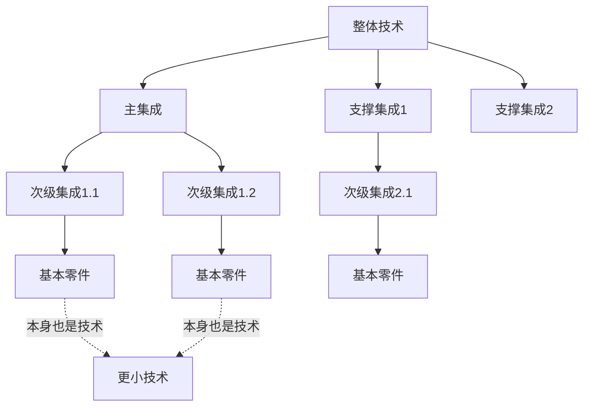
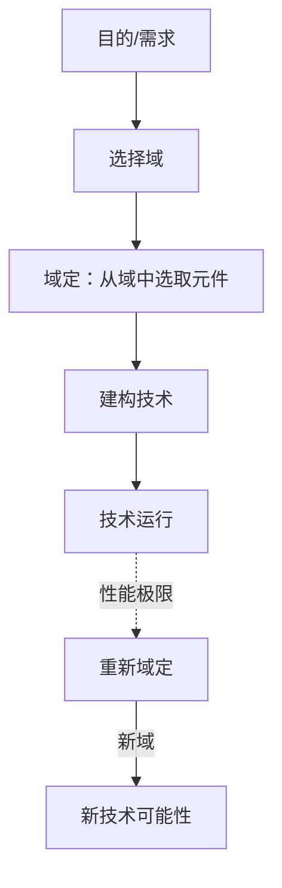
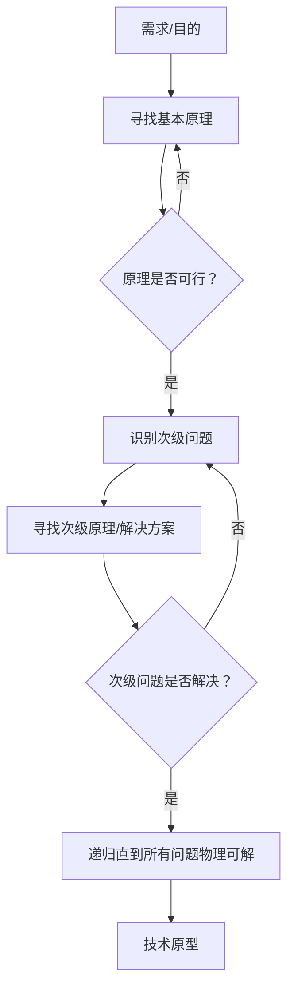
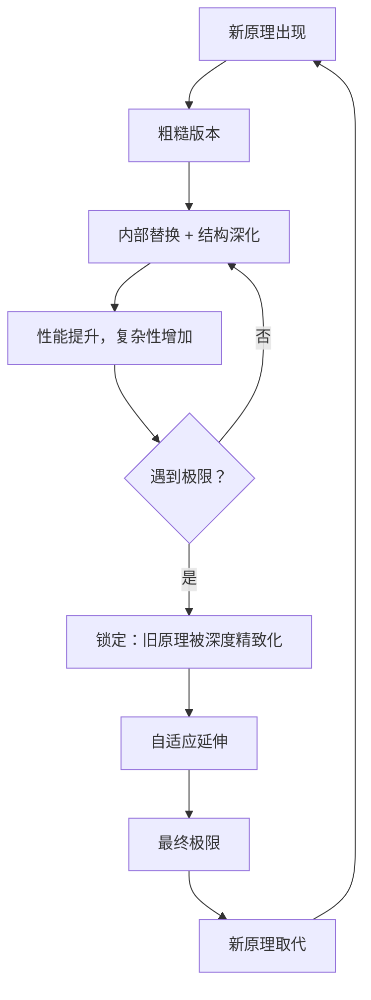
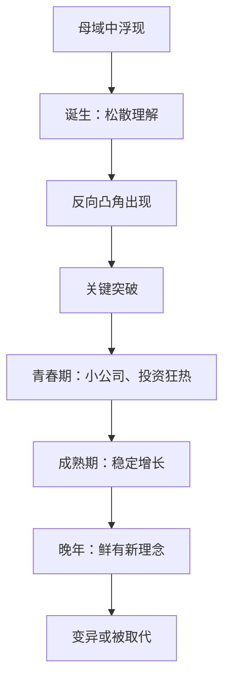
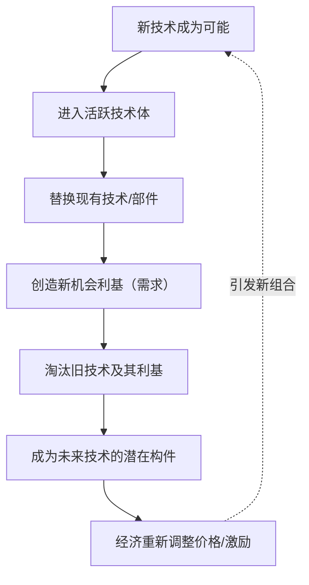
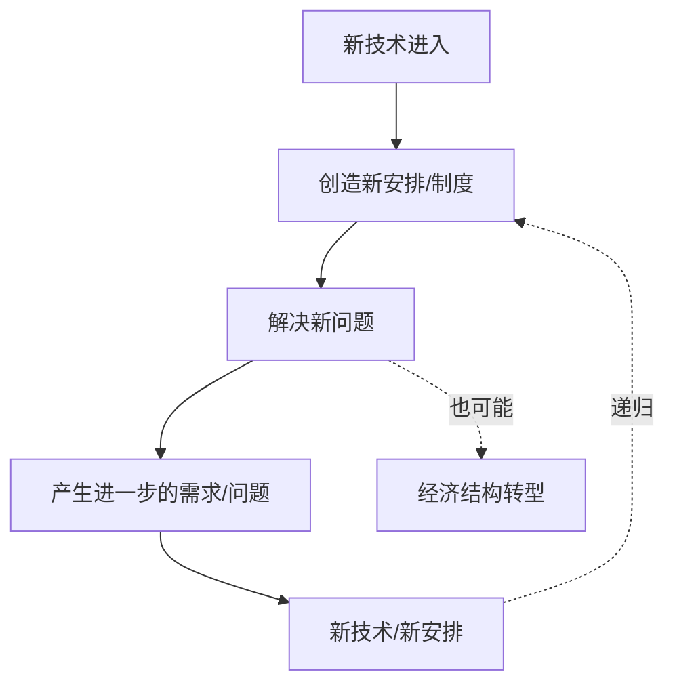

# 《技术的本质》章节总结

## 书籍信息
- 书名：技术的本质：技术是什么，它是如何进化的
- 作者：[美]布莱恩·阿瑟（W. Brian Arthur）
- 译者：曹东溟 王健
- 出版社：浙江科学技术出版社·湛庐
- 出版时间：2023年07月
- PDF 状态：扫描版，OCR 识别基本完整，部分页码缺失，少量文本错位。
- OCR 状态：可读性良好，少数词语/标点需依据上下文修正。

## 目录说明
- 目录识别情况：全书目录完整，包含推荐序、前言、第1章至第11章、注释、译者后记。
- 章节对应依据：严格按照书中标题层级整理。
- OCR 修复说明：部分页边栏“技术思想前沿”内容与正文融合，已按语义拆分；个别页码标注缺失，未伪造。

## 全书核心主题
本书试图建立一门关于技术的理论，回答两个根本问题：技术是什么？技术是如何进化的？作者布莱恩·阿瑟反对将技术简单视为“科学的应用”或“工具”，提出技术是“被捕获并加以利用的现象的集合”，是“对现象有目的的编程”。技术具有递归性结构：技术由技术构成，所有技术都建立在自然现象之上。技术的进化机制是“组合进化”——新技术从已有技术的组合中产生，同时不断捕捉新现象。经济是技术的表达，随技术进化而结构性地重构。全书融合了工程、生物、经济、哲学视角，呈现了一幅技术自我创生、有机进化的图景。

---

## 推荐序一：路径依赖性（汪丁丁）
### 核心论点
问题：为什么人口、经济、技术发展会呈现出“路径依赖性”？观点：人的行为依赖其全部过去的行为，技术演进与制度变迁一样，存在正反馈和锁定效应，可能导致社会或企业被“锁死”在既有路径中。

### 关键概念
- 路径依赖性：早期优势通过收益递增被放大，使后续选择被锁定。
- 收益递增：先发技术获得规模效应、学习效应和协调效应，形成自我增强的循环。
- 锁死：制度或技术路径一旦固化，可能阻碍创新甚至导致消亡。

### 逻辑推演
从阿瑟的学术经历切入，说明收益递增观点曾受主流经济学排斥。诺思将其应用于制度变迁，发现成功的制度有复制自身的冲动，可能导致锁死。技术同样如此：QWERTY键盘虽非最优却统治市场。路径依赖性既是历史的结果，也是未来选择的约束。

> “人的行为依赖于他们过去的全部行为。注意，是‘依赖’而不是‘由此被决定’。”(p.16)

---

## 推荐序二：了不起的阿瑟（张翼成）
### 核心论点
问题：阿瑟对复杂经济学的贡献为何重要？观点：阿瑟揭示了信息不完备、非平衡态下的经济现象，启发了经济物理学等新领域；其对主流经济学的批判具有开创性。

### 关键事件
- 爱尔法鲁酒吧问题：演绎推理与归纳推理的对决，归纳推理完胜。
- 少数者博弈论：受阿瑟启发，物理学家进入经济研究。
- 阿瑟与诺贝尔奖：曾因加入反主流阵营而错失奖项。

> “阿瑟的《复杂经济学》和《技术的本质》……是在建立一个大的新理论框架的过程中不可多得的指路明灯。”(p.20)

---

## 包国光教授推荐
### 核心论点
问题：技术的本质是什么？如何从技术哲学角度理解阿瑟的理论？观点：阿瑟通过“递归性组合”“现象”“自创生”等概念，成功打开了技术黑箱，提出了技术自我创生的进化理论。

### 关键概念
- 递归性结构：技术包含着技术，直至现象层面。
- 自创生：技术从自身生产出新技术，通过人类发明家作为中介。
- 珊瑚礁结构：技术体像珊瑚礁一样，通过微小活动自我建构。

> “技术是由技术构成的”“技术是对现象的编程”。(p.21-23)

---

## 前言：技术的追问
### 核心论点
问题：技术最深的本质是什么？它从何而来，如何进化？观点：技术不是科学的副产品，相反，科学是技术的副产品。技术创造了我们的世界、财富和存在方式。技术的本质是对自然现象的有目的编程。

### 逻辑推演
作者从17岁学习电子工程时开始追问技术的本性。后来研究收益递增，发现新技术不是无中生有的发明，而是已有技术的组合。技术的进化需要遗传机制，即“组合进化”。技术总是为解决问题而存在，但解决问题又引发新问题。同时，人类对技术的希望与对自然的信赖之间存在深层不安。

> “技术给我们带来了舒适的生活和无尽的财富，也成就了经济的繁荣。一句话，我们的世界因技术而改变。” (p.30)
> “技术是如何进化的……如果没有进化，没有某种普遍的关联性，技术看起来就好像是自己独自产生出来，独自改进的。” (p.37)

---

## 第1章：问题
### 核心论点
问题：为什么我们对具体技术知道很多，却对技术的一般性理论知之甚少？观点：缺失的是一套关于技术的理论，包括技术如何形成、如何创新、如何进化。技术的进化不同于达尔文生物进化，根本性新技术的产生不能用微小变异积累解释，而应来自“组合进化”。

### 关键概念
- 技术黑箱：社会科学家常从外部看待技术，忽略内部解剖学关系。
- 组合进化：之前的技术形式作为现在原创技术的组分，当代新技术成为建构更新技术的组件。
- 现象的捕捉：技术不仅来自组合，还来自持续捕捉新的自然现象。

### 逻辑推演
指出技术一直处于科学的阴影之下，缺乏严肃理论研究。达尔文机制应用于技术时遇到困难：根本性新技术（如喷气机）不是先前技术的渐变。组合进化的思路：打开黑箱，看到技术由已有组件组合而成。但组合不能无穷回溯，需要现象作为元起点。

### 技术思想前沿
> “技术的循环：技术总是进行这样的循环，为解决老问题去采用新技术，新技术又引起新问题，新问题的解决又要诉诸更新的技术。” (p.31)
> “进化”的完整含义：某类事物的所有对象联结在一起的过程，而其联结纽带在于它们诞降自相同的先前对象的集合。” (p.37)

---

## 第2章：组合与结构
### 核心论点
问题：技术的共同结构是什么？观点：所有技术都具有递归性结构——技术由技术构成，直到最基础的水平。技术被模块化为功能分组，以简化设计、预防变动、允许分别改进。

### 关键概念
- 技术的三个定义：手段（单数）；实践和元器件的集成（复数）；可供文化利用的装置和工程实践的集合（总体）。
- 递归性：技术包含的集成块是技术，集成块包含的次一级集成块也是技术，如此重复。
- 模块化：将技术分割为功能单元，只有当模块被反复使用时才值得付出代价。

### 逻辑推演
从技术定义的模糊性出发，提出三种定义。以水力发电机、喷气发动机、计算机程序为例，展示技术的基本结构：核心原理 + 主集成 + 支撑次集成。通过两个制表匠的寓言说明模块化的价值。以F-35战斗机为例展示递归性层级结构（从单个零件到战区系统）。技术是高度可重构的、流动的、永不静止。

### 方法流程图（递归性结构）

> “技术具有递归性：结构中包含某种程度的自相似组件，也就是说，技术是由不同等级的技术建构而成的。” (p.60)
> “在真实世界中，技术是高度可重构的，它们是流动的东西，永远不会静止，永远不会完结，永远不会完美。” (p.63)

---

## 第3章：现象
### 核心论点
问题：技术最终依靠什么获得力量？观点：所有技术都建立在自然现象之上。技术的本质是“被捕获并加以利用的现象的集合”，是对现象的有目的的编程。科学不是技术的源泉，相反，科学建构于技术。

### 关键概念
- 现象：独立于人类和技术的自然效应（如碳-14衰变、多普勒效应）。
- 技术 = 对现象的编程：将现象有组织地组合起来，为特定目的服务。
- 现象作为技术的“基因”：每个技术通过对一组固定现象的不同“编程”而创造出来。
- 目的性系统：所有实现目的的手段的总体，包括物理技术与非物理技术（如货币、组织）。

### 逻辑推演
通过放射性碳定年、树轮定年、古地磁定年、系外行星探测等技术，说明每一种都依赖一系列现象。现象需要被“驯服”才能用于技术。技术内部是现象的交响乐。现象簇通过累积式建构：现象被捕获→用于制造设备→进一步揭示新现象。科学与技术共生：科学提供观察现象的手段，但技术也建构了科学本身（望远镜、实验、仪器）。

### 方法流程图（现象→技术）

> “从本质上看，技术是被捕获并加以利用的现象的集合，或者说，技术是对现象有目的的编程。” (p.72)
> “现象是技术赖以产生的必不可少的源泉。” (p.67)
> “科学和技术以一种共生方式进化着，每一方都参与了另一方的创造。” (p.86)

---

## 第4章：域
### 核心论点
问题：为什么个体技术会聚集成群？这些集群如何影响设计和技术变革？观点：共享现象簇、共同目标或理论的技术形成“域”。域是一种语言、一个工具箱、一个可能性的世界。工程设计始于“域定”，重新域定是颠覆性创新的重要来源。

### 关键概念
- 域：技术集群，共享共性（现象、目标或理论），构成表达的语言。
- 域定：为构建设备而从某个域中选择合适元器件的过程。
- 重新域定：以一套不同的内容表达既定目的，带来新的可能性和颠覆性改变。
- 语法：域内元素组合的规则，来源于自然规律和实践经验。

### 逻辑推演
个体技术因共享现象或目标而聚集成域（如电子学、结构工程）。域不同于个体技术：域是工具箱，不完成具体工作；技术是程序，域是编程语言。工程设计从域定开始，重新域定（如从机械液压到电传操纵）带来重大创新。域定义了时代的风格和可能性边界。设计如同语言表达，需要语法和深层知识。域也是一个“世界”——对象进入其中被操作，再返回物理世界。

### 方法流程图（域定与重新域定）

> “工程设计是从选择一个域开始的，也就是要选择一组适合建构一个装置的元器件，这个选择过程，我们称之为‘域定’。” (p.92)
> “重新域定……不仅提供了一套新的、更有效的实现目的的方法，还提供了新的可能性。这意味着技术的颠覆性改变。” (p.93)
> “一个域就相当于一种语言，当某个域在产生一件新的技术产品时，就相当于这个域在以某种语言进行表达。” (p.96)

---

## 第5章：工程和对应的解决方案
### 核心论点
问题：标准工程如何运作？它与技术进化有何关系？观点：标准工程是对已有技术的新版本进行设计、试制和集成。设计就是选择，组合是工程的副产品。解决方案如果被反复使用，就会成为新的模块（技术构件），从而驱动技术进步。

### 关键概念
- 标准工程：在已知可接受的原则下聚集方法和设备，设计已有技术的新版本。
- 解决方案：针对特定工程问题的一套恰适组合。
- 模块化解决方案：被多次使用的解决方案固化为标准模块，成为新技术构件。
- 锁定：偶然事件或早期优势导致某种解决方案主导市场，即使不是最优。

### 逻辑推演
工程师日常工作中大量时间用于解决问题。新项目必然抛出新问题，完整的设计是一系列解决方案。以波音747 JT9D发动机开发为例，说明过程中遇到的次生问题及解决。组合是工程的副产品：工程师先有意向，然后选择合适的组件表达该意向。罗伯特·马亚尔的施万德巴赫大桥展示标准工程中的创造性。解决方案被重复使用后变成模块（如振荡器电路、耦合方法）。正反馈导致锁定：轻水核反应堆因历史偶然成为主导。

### 经典金句/案例
> “一个解决方案如果被使用的次数足够多，它就成了一个模块，并因作为适用于标准用途的模块而具有包容性，它自己也成了一项技术。” (p.119)
> 轻水反应堆案例：美国海军为潜艇选择轻水冷却，后推广至民用，最终81/101个反应堆采用轻水方案，尽管未必最优。(p.121-122)

---

## 第6章：技术的起源
### 核心论点
问题：根本性的新技术（发明）是如何产生的？观点：新技术源于“需求”与“现象”的链接，即找到一个可实现的新原理。发明有两种模式：需求驱动（先有目的，再找原理）和现象驱动（先有现象，再找用途）。发明的核心是心理联想，是对功能性组件的组合与借用。

### 关键概念
- 根本性新技术：针对现有目的采用一个新的或不同的原理来实现的技术。
- 链接过程：需求与现象之间的递归性链接，需要逐级解决次级问题。
- 原理借用：新原理来自已有设备、方法、理论或功能，并非无中生有。
- 灵感：顿悟往往发生在静寂中，是各部分在无意识中组合完成的。

### 逻辑推演
定义根本性新技术：基于新原理。以喷气发动机（替换活塞螺旋桨）、激光打印机（替换行式打印）为例。发明过程是递归的：主原理→次级问题→次级原理……直到物理可解。原理来源：借用（惠特尔）、组合（兰德尔磁电管）、回顾（劳伦斯回旋加速器）、理论。灵感来临后，仍需大量工程工作将概念物化（如斯塔克伟泽激光打印机）。基于现象的发明（如青霉素）同样需要漫长的转化。发明的核心是心理联想，是对功能库的检索和组合。因果性金字塔：任何新技术都站在先前技术、现象、知识构成的金字塔上。

### 方法流程图（发明的链接过程）

> “新技术是针对现有目的而采用一个新的或不同的原理来实现的技术。” (p.126)
> “新技术是在概念当中或实际形态当中，将特定的需求与可开发的现象链接起来的过程。” (p.127)
> “灵感的显现就如同一个疏通堵塞的过程，经常是一下子就通畅了。” (p.133)

---

## 第7章：结构深化
### 核心论点
问题：新技术诞生后如何发展（狭义进化）？观点：技术发展通过两种机制：内部替换（用更好的部件更换阻碍性部件）和结构深化（添加新部件或子系统以突破极限）。技术会逐渐变得复杂，旧原理会被锁定，直到被新原理取代。

### 关键概念
- 内部替换：用更优的组件替换原有组件，克服局限。
- 结构深化：围绕障碍添加新的零部件或系统，使技术更精致、更复杂。
- 锁定：旧原理因性能成熟、周围结构惯性、心理认知失调而难以被替换。
- 自适应延伸：用旧原理“拉伸”去适应新环境，直到极限。

### 逻辑推演
新技术初版粗糙，随后进入发展旅程。通过内部替换（如喷气发动机改用更耐热合金）和结构深化（如为压缩机增加导叶、防喘振系统）提升性能。以喷气发动机为例，零部件从几百增至22000个。锁定原因：旧技术表现更好、更换成本高、从业者不认可新原理、新原理威胁旧知识。自适应延伸（如高空活塞发动机加增压器）最终达到极限，让位于新原理（喷气发动机）。此周期与库恩科学范式更替相似。

### 方法流程图（技术发展周期）

> “技术的两种发展机制：内部替换和结构深化。” (p.150)
> “在新旧原理更替的过程中，旧原理往往已经被锁定了。” (p.158)
> “自适应延伸：对旧有的成功原理的锁定所引起的现象。” (p.159)

---

## 第8章：颠覆性改变与重新域定
### 核心论点
问题：技术体（域）是如何形成、发展并影响经济的？观点：域不是被发明出来的，而是从现象或新技术中结晶而成，经历诞生、青春期、成熟期、晚年。当经济遭遇新域时，不是简单“采用”，而是结构性地“重新域定”，引发颠覆性改变。国家竞争力源于深层次的地方性手艺性认知。

### 关键概念
- 域的诞生：从母域中逐渐浮现，开始是松散的理解和方法堆积。
- 反向凸角：域发展中的关键阻碍，突破后产生可行技术。
- 经济的重新域定：已有产业从新域中提取组件，与自身实践组合，创造新产业或次级产业。
- 深奥的手艺：比知识更深的认知体系，知道什么可能、什么参数、如何挽救，根植于地方文化。

### 逻辑推演
域的形成模式：围绕核心技术联合，或从现象簇中建构。以基因工程为例：从分子生物学中浮现，关键突破（DNA重组）后进入青春期，投资热潮（基因泰克）。成熟期稳定增长，晚年可能被取代或变异（如计算技术多次变异）。经济遭遇新域（如计算技术遭遇金融），产生衍生品交易、风险管理等新产业，这是重新域定。延迟原因：不仅需要采用技术，还需要重构经济结构（如工厂电气化用了40年）。国家竞争力源于深奥手艺的区域集中（如硅谷、剑桥卡文迪许实验室）。

### 方法流程图（域的生命周期）

> “经济的重新域定，是指已有产业去适应新的技术体，从中提取、选择它们所需要的内容，并将其中部分零部件和新领域中的部分零部件组合起来，有时还会创造次生产业。” (p.173)
> “颠覆性改变只发生在对经济有改变的重要的域之中……” (p.174)

---

## 第9章：进化机制
### 核心论点
问题：技术集合（总体意义上的技术）是如何进化的？观点：技术是自创生的——新元素从已有元素中组合而来。组合的指数增长、机会利基的涌现、以及“组合进化”机制共同驱动技术进化。技术具有生命属性：自组织、自创生、适应环境。

### 关键概念
- 自创生：技术从自身生产出新技术，通过人类发明家作为中介。
- 机会利基：技术自身创造的需求（如汽车需要加油站），召唤新技术。
- 组合进化核心步骤：新技术进入活跃技术体→替换旧技术→创造新需求→淘汰旧附件→成为未来构件→经济调整。
- 雪崩式替换：一项技术替换可能引发多米诺骨牌式的崩溃（如汽车消灭铁匠）。

### 逻辑推演
以三极管为例：从信号放大到振荡器到逻辑电路到计算机，技术自己创造了自己。所有技术都源于已有技术（青霉素也需要已有生化方法）。组合的指数增长：N个元素最多有2^N - N -1种组合，超过阈值后爆炸。机会利基大多源于技术自身（诊断需求、火箭需求）。核心机制：新元素进入活跃网络，引发六个步骤，且步骤间可嵌套。通过逻辑电路进化实验（8-bit加法器）证实：垫脚石技术先出现，然后复杂技术自展进化。与生物进化比较：技术中组合是常态，达尔文变异选择是次级。技术是“活”的（珊瑚礁意义上的有机体）。

### 方法流程图（技术进化的核心步骤）

> “技术进化与生物进化的比较……在技术当中，组合则是常态。每个新技术和新的解决方案都是一个组合。” (p.203)
> “有生命的技术：一方面，技术是自组织的……另一方面，技术是自我创生的。” (p.205)

---

## 第10章：技术进化所引发的经济进化
### 核心论点
问题：经济如何随技术进化而进化？观点：经济不是技术的容器，而是技术的表达。经济从技术中浮现，并随技术进化而结构性重构。每个解决方案都会带来新问题，形成“问题-解决”的永恒舞蹈，使经济永远处于自我创造之中。

### 关键概念
- 经济作为技术表达：经济的结构由技术铸造，包括制度、组织、方法，都是广义技术。
- 结构性变化：新技术召唤新安排（工厂、劳动力、法律、工会），引发连锁性结构重构。
- 解决方案带来新问题：每个技术都包含问题的种子（如化石能源带来全球变暖）。
- 经济永远在自我创造：结构变化是分形的、不可阻挡的。

### 逻辑推演
重新定义经济：一套安排和活动，其中安排本身就是技术。经济从技术中浮现，因果循环：技术创造经济结构，经济调节新技术创造。以纺织机械为例：替换手工→召唤工厂制度→需要劳动力、住房、城市化→劳动法、工会→新的社会结构。每个新技术都产生新机会利基，也带来新问题。经济从不静止，始终处于“工业突变”之中。经济是复杂的进化系统，不是简单均衡系统。

### 方法流程图（技术驱动的经济结构变化）

> “众多的技术集合在一起，创造了一种我们称之为‘经济’的东西。经济从它的技术中浮现，并不断从它的技术中创造自己。” (p.207)
> “每个技术都包含着问题的种子，而且通常是很多颗。” (p.215)

---

## 第11章：我们的立场是什么
### 核心论点
问题：我们应该如何看待技术？观点：技术正在变得具有生物属性（自构成、自修复、认知），生物学正在变成技术。经济也变成繁衍性经济。我们需要接受技术作为自然的延伸，而不是与自然分离。如果技术加强了我们与自然的联系，它就肯定了生命和人性的厚爱。

### 关键概念
- 技术具有生物属性：随着复杂性提高，技术表现出感知、适应、自组织等生物特征。
- 繁衍性经济：从优化固定操作转向创造新组合、新配置。
- 纯粹秩序 vs 凌乱活力：机械论世界观让位于有机的、进化的、不完美的整体观。
- 技术与自然的关系：技术是对自然的编程，本质上极度自然，但令人感到不自然。

### 逻辑推演
现代技术不再是固定功能的机器，而是物-物对话的网络，具备认知能力。生物体反过来也是精致的技术（DNA、细胞）。技术与生物开始纠缠。经济从机器态转变为化学态：关注组合、联盟、短暂配置。世界观从笛卡尔/牛顿的纯粹秩序转向文丘里的“凌乱的活力”。海德格尔的担忧：技术将自然视为储备资源。我们的矛盾：信任自然，却寄希望于技术。神话（《星球大战》）表明：我们不排斥技术，但排斥非人性的、奴役意志的技术。我们需要技术与自然融为一体。

> “如果技术将我们与自然分离，它就带给了我们某种类型的死亡。但是如果技术加强了我们和自然的联系，它就肯定了生活，因而也就肯定了我们的人性。” (p.231)
> “我喜欢的元素是杂交的而不是纯种的……凌乱的活力优于明显的统一。” (引自文丘里，p.228)

---

## 译者后记
### 核心要点
- 翻译初衷：希望从本体论角度回答技术是什么、怎样来的问题。
- 理论价值：阿瑟打开了技术黑箱，揭示了技术递归性、现象捕获、自创生等机制。
- 技术体的概念：对理解不同文化、不同发展道路的技术差异具有启发意义。
- 翻译挑战：大量具体技术案例，需平衡专业性与生活化表达。

> “技术由人类创造出来，又基于自然最原初的现象，但开始了疏离‘人类与自然’的进化之旅。” (p.252)

---

## 注释
（书中注释包含参考文献和补充说明，由于篇幅未逐条列出，但已在正文引用中体现主要来源。）

---

*本总结基于《技术的本质》2023年中文版内容，严格遵循原书结构与核心观点，未添加任何外部评价或虚构信息。*