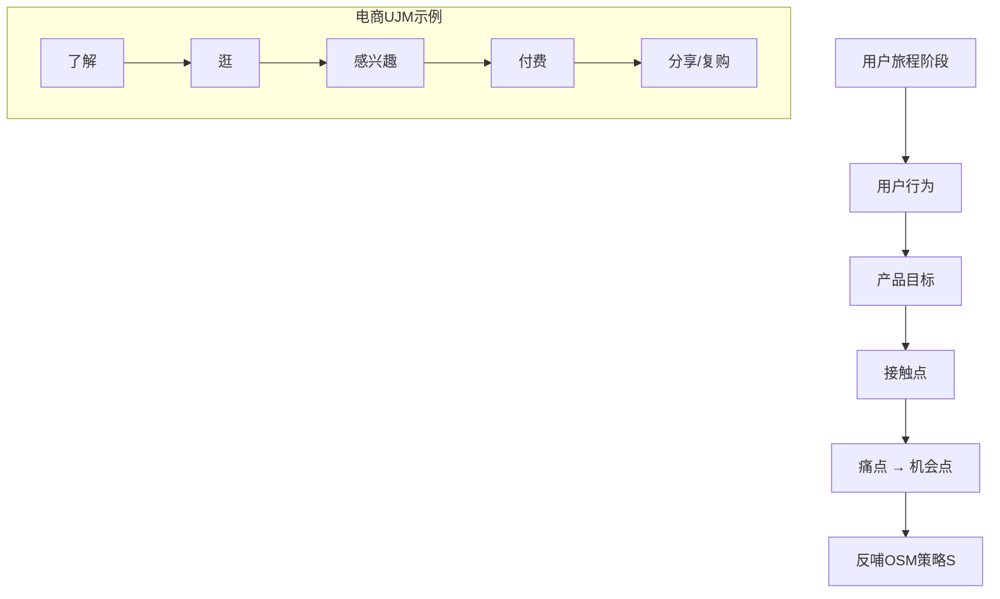
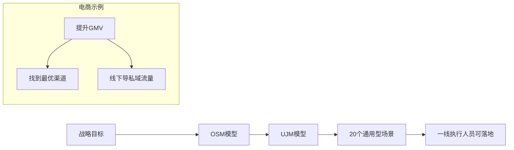
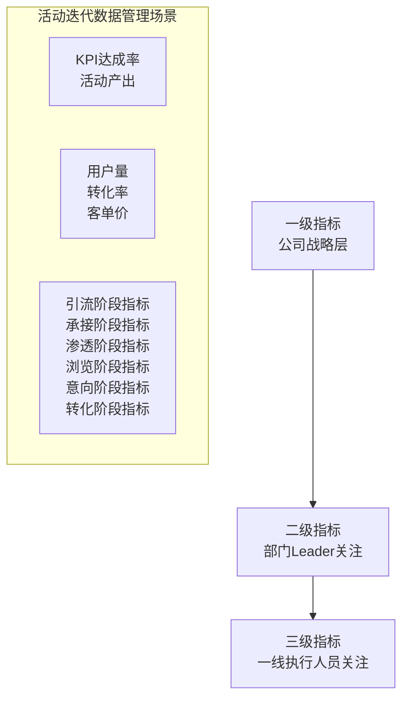
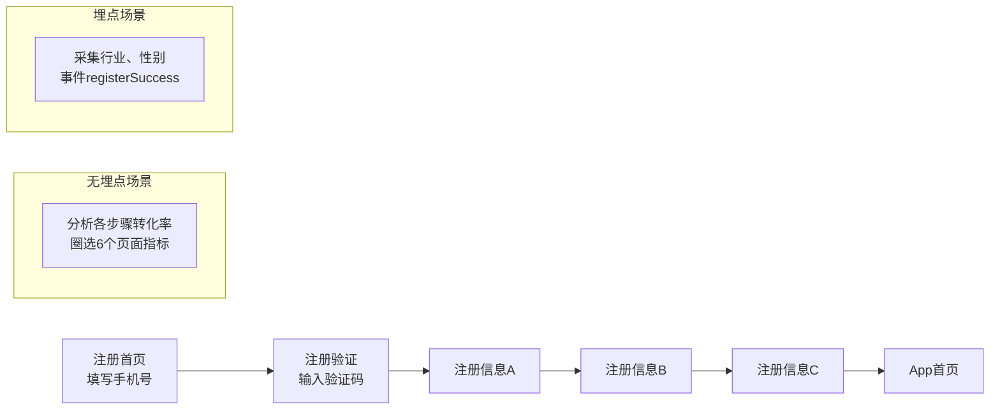
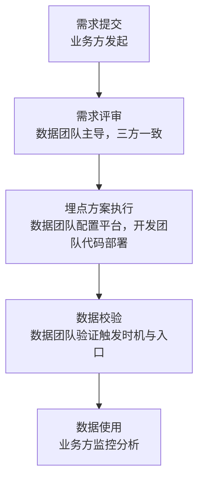
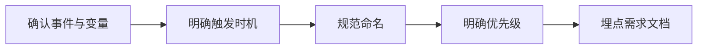
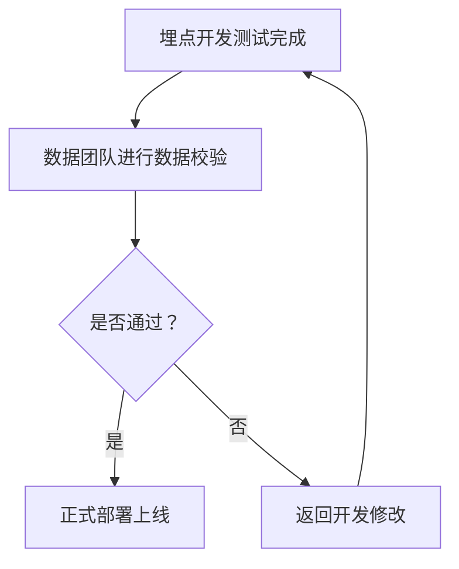
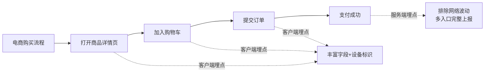
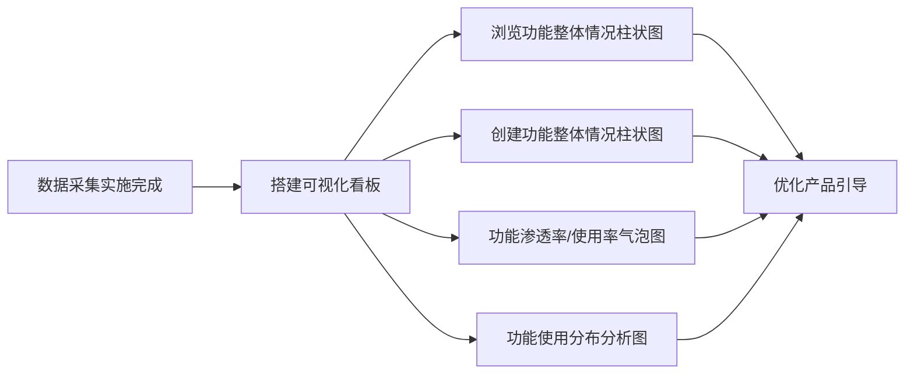

# 《指标体系与数据采集》章节总结

## 书籍信息
- **书名**：指标体系与数据采集
- **副标题**：3 大规划模型、2 种采集方式、1 套协作流程
- **作者**：GrowingIO 团队（叶玕玕、檀润洋、史晓璐、白英斌、李泽明、王汉等）
- **出版/发布方**：GrowingIO（北京易数科技有限公司）
- **PDF 状态**：可识别内容完整，含目录、正文、图表、案例
- **OCR 状态**：识别良好，无重大错漏，页码基于原始书页标注

## 目录说明
- **目录识别情况**：原书目录结构清晰，共四章加前言、推荐序、致谢等附属内容。
- **章节对应依据**：按照原书页码顺序（从推荐序到致谢）逐章整理。
- **OCR 修复说明**：部分图表文字描述已转换为 Mermaid 流程图或表格；所有“说明”部分已标注。

## 全书核心主题
本书系统阐述了企业如何从零搭建数据指标体系并完成高质量数据采集。作者基于服务上千家企业的经验，提出“数据驱动增长”的底层依赖科学的数据规划、采集与管理。核心方法论包括：OSM模型（目标-策略-度量）、UJM模型（用户旅程地图）、场景化拆解以及三级指标体系分级。在采集层面，对比了埋点与无埋点的优劣与适用场景，并给出标准化的团队协作流程、埋点四要素、数据校验方法及客户端/服务端埋点选择策略。全书以电商、App注册、产品功能分析等实战案例收尾，强调“少即是多”的指标设计原则。

---

## 推荐序（Page 2-3）

### 核心论点
问题：企业为何越来越重视数据指标体系搭建？  
观点：随着流量成本倍增、粗放式经营失效，企业需要直连用户、沉淀数据资产，通过指标体系提升各环节转化效率。但搭建数据体系表面是执行问题，背后是流程、用户体验、商业、数据四个维度的集合。

### 关键概念/事件
- **数据指标体系的价值**：帮助管理者获得战略指导，让数据成为公司上下协同的统一语言。
- **常见陷阱**：需求倒逼出单点、散点数据，缺乏整体规划，造成开发重复、系统熵增、效率低下。
- **GrowingIO 的方法论**：抽象提炼出系统的方法论、体系和实践应用，赋能企业少走弯路。

### 逻辑推演/叙事脉络
作者从服务上千家客户的痛点出发，指出企业往往因缺少体系化指标而陷入“数据没有、为什么不对”的追问。GrowingIO 通过拆解20+行业的客户案例，形成了自己的体系和逻辑，并将能力复制给更多企业，使命是“帮助企业提升数据驱动的能力，实现更好的增长”。

### 经典金句/数据
> “数据指标体系搭建，表面看是个执行问题，但背后反映的是流程、用户体验、商业、数据四个维度的集合，是给管理者的战略指导方针。” (p.2)

> “GrowingIO 的使命是‘帮助企业用提升数据驱动的能力，实现更好的增长’。” (p.3)

---

## 前言（Page 4-5）

### 核心论点
问题：数据驱动增长的起点是什么？  
观点：“千里之行，始于足下”，数据驱动增长的企业文化应从建立一套数据指标体系开始。整个框架分为四层：数据规划、数据采集、数据分析和数据决策，底层决定上层的价值。

### 关键概念/事件
- **数据分析金字塔**：从下往上依次为数据规划、数据采集、数据分析和数据决策。越顶层产生直接价值越高，但依赖底层的数据规划和采集。
- **本书四章内容**：科学规划指标体系（OSM+UJM+分级）、高效数据采集（埋点/无埋点、协作流程）、正确管理数据指标（命名、字典、分类、清理）、指标体系实战案例（产品分析）。
- **目标读者**：产品经理、运营、市场、数据分析师等。

### 逻辑推演/叙事脉络
只有正确地规划和采集数据，才能进行正确的分析和决策，真正实现数据驱动增长。本书将方法论与实战结合，帮助读者系统理解“数据指标体系”。

### 经典金句/数据
> “只有正确地规划和采集数据，我们才能够进行正确的数据分析、产出正确的数据决策、从而真正实现数据驱动增长。” (p.4)

---

## 关于 GrowingIO（Page 6）

### 核心论点
GrowingIO 是基于用户行为数据的增长平台，提供客户数据平台、获客分析、产品分析、智能运营等产品和咨询服务。

### 关键概念/事件
- **服务对象**：产品、运营、市场、数据团队及管理者。
- **联系方式**：官网 www.growingio.com，电话 010-50914714。
- **资源入口**：添加增长顾问咨询解决方案，扫码关注服务号领取课程及模板。

---

## 第1章：科学规划指标体系

### 1.1 指标规划阶段常见问题（Page 10）

#### 核心论点
问题：缺少指标体系规划会带来哪些后果？  
观点：企业若不做好指标规划，会出现难以快速定位问题、前期数据未采全后期反复、上下目标没有对齐、数据治理混乱（表多、数多、报表看不懂）等问题。

#### 关键概念/事件
- **难以快速定位问题**：只关注结果性数据，忽略过程性数据，业务异常时无法归因。
- **前期未采全，后期反复**：数到用时方恨少，反复提需求，浪费人力。
- **上下目标未对齐**：公司战略、业务部门、各业务线目标不一致。
- **监控分析阶段没有治理**：数据乱、报表看不懂，效率低下。

### 1.2 规划数据指标体系的三种方法（Page 11）

#### 1.2.1 OSM 模型（Page 11-16）

##### 核心论点
问题：如何从业务目标出发规划指标体系？  
观点：OSM模型包含三层：业务目标（Object）、业务策略（Strategy）、业务度量（Measure）。通过明确“为什么做”“怎么做”“如何衡量”，构建数据监控体系。

##### 关键概念/事件
- **O（Object）**：业务、产品或功能存在的目的，解决用户什么需求。
- **S（Strategy）**：为实现目标采取的业务策略。
- **M（Measure）**：衡量策略有效性的度量，包含KPI（直接衡量）和Target（预设值）。
- **DUMB原则**：切实可行（Doable）、易于理解（Understandable）、可干预可管理（Manageable）、正向有益（Beneficial）。
- **两个误区**：目标过于模糊、过于保守或激进。

##### 逻辑推演/叙事脉络
以非标住宿平台App搜索场景为例：用户视角（高效找到心仪房源）和业务视角（提高搜索成功率→提升下单转化率）设定目标。策略包括：返回匹配结果、有效排序、无结果时推荐。KPI设为搜索→详情页转化率（Target 30%）和详情页→下单转化率（Target 30%）。通过过程性指标（漏斗各步）改善结果性指标（订单金额）。最终搭建出OSM数据监控看板。

##### 流程图

```mermaid
graph LR
    A[业务目标 O] --> B[业务策略 S]
    B --> C[业务度量 M]
    C --> D[KPI + Target]
    D --> E[数据监控看板]
    
    subgraph 案例：非标住宿搜索
        O1[用户视角：高效找到心仪房源<br>业务视角：提高搜索成功率]
        S1[返回匹配结果<br>有效排序<br>无结果推荐]
        M1[搜索→详情页转化率 30%<br>详情页→下单转化率 30%]
    end
```

##### 经典金句/数据
> “过程性指标是可干预的，而且通常是‘用户行为’。” (p.14)

> “结果性指标，比如GMV或订单量，通常是业务漏斗的底部，是一个不可更改的、后验性的指标。” (p.13)

#### 1.2.2 UJM 模型（Page 17-19）

##### 核心论点
问题：如何校准业务目标，确保其与用户实际旅程吻合？  
观点：UJM（用户旅程地图）模型梳理用户从了解到离开的完整生命旅程，拆解每个阶段的用户行为、产品目标、接触点、痛点与机会点，从而反哺OSM模型。

##### 关键概念/事件
- **用户旅程阶段**：了解→逛→感兴趣→付费→分享/复购。
- **接触点**：首页流量位、搜索框、商品类目页等。
- **痛点与机会点**：痛点的反面就是机会点，可反哺OSM中的策略（S）。

##### 逻辑推演/叙事脉络
以电商产品为例：用户经历6个阶段，每个阶段设置目标（如“逛”阶段目标为“高效发现商品”），找到产品与用户的接触点，挖掘痛点（如搜索结果不相关），机会点（优化搜索算法）即成为业务策略。UJM与OSM耦合，使业务目标满足用户需求，策略回答业务问题。

##### 流程图



##### 经典金句/数据
> “痛点的反面就是我们的机会点。” (p.19)

> “融入UJM的价值，使得业务目标能够满足用户需求，策略能够回答业务问题。” (p.19)

#### 1.2.3 场景化（Page 20-22）

##### 核心论点
问题：OSM+UJM框架过于庞大，如何快速落地？  
观点：引入“场景化”概念，将战略目标下沉到一线执行人员的具体工作中。GrowingIO提炼出20个通用型场景，模块化、结构化地切入指标体系落地。

##### 关键概念/事件
- **20个通用型场景**：从拉新到转化到提升客单价，覆盖不同部门需求。
- **电商场景案例**：提升用户基数对应“找到最优渠道”“线下导私域流量”等场景。
- **全景图**：OSM+UJM+场景化三层结合，从战略目标层层拆解到一线可落地的场景。

##### 流程图



### 1.3 指标体系分级（Page 22-27）

#### 1.3.1 指标分级的定义

##### 核心论点
问题：如何高效定位业绩波动原因？  
观点：数据本身是分层的，指标分级（三级指标体系）帮助公司搭建完整体系，无需每次思考要看哪些指标，可快速定位问题。

#### 1.3.2 三级指标体系

##### 核心论点
问题：如何划分不同层级的指标？  
观点：拆分为三个层级——一级指标（公司核心业绩指标，5-8个）、二级指标（一级指标的路径拆解）、三级指标（二级指标的细分，直接指引一线行动）。

##### 关键概念/事件
- **一级指标**：全公司认可的业绩核心指标，如GMV、订单量、日活跃用户数。GrowingIO的一级指标是新注册活跃用户数（创建看板>5个）。
- **二级指标**：流程中的指标，如转化率、客单价、活跃用户数。
- **三级指标**：子流程或个体维度，如iOS客户端转化率、安卓客户端转化率。
- **案例**：GMV提升 → 拆解转化率（二级） → 拆解iOS转化率（三级） → 指导产品迭代。

##### 案例：营销活动指标体系（Page 25-27）

##### 核心论点
活动场景的UJM模型（引流→承接→渗透→浏览→意向→转化），每个阶段对应目标与关键指标，融合OSM+UJM+场景化+分级，形成一级（KPI达成率）、二级（用户量/转化率/客单价）、三级（基于UJM拆解的详细指标）。

##### 流程图



##### 经典金句/数据
> “三级指标能够直接指引一线运营的决策。一线的产品、运营、市场等同学，在看到三级指标的结果后，往往就能够有直接的改变行为产生。” (p.24)

> “只有通过三级指标才能回答为什么发生波动，我们能够做出什么动作。” (p.27)

---

## 第2章：高效进行数据采集

### 2.1 数据采集阶段常见问题（Page 28）

#### 核心论点
问题：数据采集过程中常见哪些问题？  
观点：前期沟通业务不明确、采集时机口径对不齐、采集点没有统一管理、版本更新导致数据变化等，导致数据质量差。

#### 关键概念/事件
- **业务不明确**：程序员不清楚有效点击与无效点击的区别。
- **口径不齐**：采集时机不明确。
- **无统一管理**：埋点方案繁琐无法落地。
- **版本更新**：新旧版本对比无法发现数据变化。

### 2.2 数据采集方式：埋点和无埋点的定义（Page 29-32）

#### 2.2.1 埋点

##### 核心论点
埋点（Capture模式）通过写代码采集数据，数据准确、稳定，可添加业务属性，但需要跨团队协作、不能回溯历史、容易漏埋。

##### 关键概念/事件
- **优势**：数据定义清晰、稳定性高、可添加业务属性支持维度拆解。
- **劣势**：需提前规划、跨团队协作、历史数据不能回溯。
- **团队协作重要性**：埋点需要业务人员、分析师、工程师、数据校验工程师通力合作，跨团队协作常遇到部门墙、沟通问题。

#### 2.2.2 无埋点（Page 31-33）

##### 核心论点
无埋点（Record模式）通过加载SDK自动采集全量数据，可回溯7天数据，无需排期沟通，但受制于开发框架，无法采集部分业务维度和滑动行为。

##### 关键概念/事件
- **优势**：自主性高、灵活采集、支持7天回溯、所见即所得。
- **劣势**：受产品开发框架影响、事件级维度无法拆分、无法采集滑动等行为。
- **原子数据的五个维度**：Who、When、Where、What、How。
- **技术难题**：机型适配、数据存储消耗、开发框架不统一。GrowingIO用机器学习AI算法提升圈选准确率。

##### 经典金句/数据
> “无埋点技术弥补了埋点的劣势，加载SDK即开始全量采集用户行为数据，哪怕之前没有进行圈选的数据，也支持7天回溯。” (p.32)

### 2.3 数据采集方式：埋点和无埋点的适用场景（Page 33-38）

#### 核心论点
问题：什么场景用埋点，什么场景用无埋点？  
观点：探索式数据场景（交互属性强、需求及时、数据周期短）适合无埋点；监控与分析式数据场景（核心KPI、长期监控、深度业务分析）适合埋点。

#### 关键概念/事件
- **无埋点适用场景**：运营活动无排期、衡量大量交互细节、探索用户行为轨迹、快速衡量发版效果、补充漏埋数据。
- **埋点适用场景**：KPI汇报、长期趋势分析、深度业务分析（如SKU转化）、归因分析（各入口销售额）。
- **对比表**：

| 数据采集方式 | 优势 | 劣势 | 适用场景 |
|------------|------|------|----------|
| 埋点 | 数据稳定，可加业务属性 | 需提前规划，不能回溯历史 | 监控与分析式：核心KPI、长期存储、业务属性丰富 |
| 无埋点 | 自主灵活，可回溯7天 | 受开发框架限制，无滑动等行为 | 探索式：交互属性强、快速分析、作为补充数据 |

#### 案例：App注册流数据采集方案（Page 36-38）

##### 核心论点
通过App注册流程（注册首页→短信验证→注册信息A/B/C→App首页），说明无埋点用于快速分析转化率（圈选6个页面指标），埋点用于获取用户填写的行业、性别等业务维度（事件registerSuccess，变量practiceVocation、sex）。

##### 流程图



### 2.4 埋点的团队协作流程（Page 38-44）

#### 核心论点
问题：如何提高埋点协作效率，保证数据准确？  
观点：需要业务方、数据规划师、开发团队三方有序协作，按“需求提交→需求评审→埋点方案执行→数据校验→数据使用”五步流程闭环。

#### 关键概念/事件
- **角色职责**：产品经理/运营提需求，数据规划师整理埋点需求、组织评审、校验数据，开发团队确认可行性和排期、开发测试。
- **需求评审**：三方一致同意才能进入开发。
- **数据校验**：确保触发时机正确、入口覆盖完全。
- **最佳实践周期**：约8周完成一套指标体系高效落地（以汉光百货为例）。

##### 流程图



##### 经典金句/数据
> “快，需要业务方、数据规划师、开发三个团队有序协作；准，需要确保数据的业务含义和数据质量。” (p.39)

### 2.5 埋点方案四要素（Page 44-48）

#### 核心论点
问题：如何设计完整、可执行的埋点方案？  
观点：埋点方案需包含四个要素——确认事件与变量、明确触发时机、规范命名、明确优先级。

#### 关键概念/事件
- **事件与变量**：事件是产品中的操作（如“加入购物车”），变量是描述事件的属性（如商品ID、品类）。
- **触发时机**：点击按钮时 vs 操作成功时，需选择最贴近业务的统计口径，并用MECE原则枚举所有入口。
- **命名规范**：使用“动词+名称”或“名词+动词”，如addToCart，确保团队统一认知。
- **优先级**：资源有限，优先保证核心场景（如站内转化路径追踪）的埋点。

##### 流程图



##### 经典金句/数据
> “MECE原则，即相互独立，完全穷尽：不要重复列举，但要包含所有入口。” (p.46)

### 2.6 数据校验（Page 48-51）

#### 核心论点
问题：如何保证埋点数据准确？  
观点：数据校验重点验证事件是否被正常触发、触发时机是否正确、是否与埋点方案一致。GrowingIO提供Debugger工具（Web/Mobile）打印SDK请求内容，快速验证。

#### 关键概念/事件
- **校验时机**：开发完成测试后、正式上线前。
- **校验工具**：Web Debugger（网站/H5/M站）、Mobile Debugger（App）。
- **数据类型**：cstm（事件及事件级变量）、pvar（页面级变量）、evar（转化变量）、ppl（用户变量）。

##### 流程图



### 2.7 客户端埋点或服务端埋点（Page 51-54）

#### 核心论点
问题：客户端埋点和服务端埋点如何选择？  
观点：客户端埋点适用于用户界面行为上报（如打开详情页、加入购物车），可采集丰富字段和设备标识；服务端埋点适用于业务操作上报（如支付成功），可排除网络不稳定、确保多入口数据完整。两者结合为最佳实践。

#### 关键概念/事件
- **客户端埋点优势**：详细采集用户行为、用户本地设备标识。
- **客户端埋点劣势**：网络不稳定影响上报、多入口易漏埋。
- **服务端埋点优势**：准确采集业务操作、确保数据完整上报。
- **服务端埋点劣势**：缺少用户设备标识、缺少行为上下文。
- **适用案例**：地产中介的400电话拨打（多入口，服务端埋点保证完整）；SaaS公司的业务漏斗（有效线索→商机→付费，服务端埋点）。

##### 流程图



##### 经典金句/数据
> “将客户端埋点与服务端埋点两种埋点方式相结合，互补各自的优劣势，达到数据的完整、准确、高效上报。” (p.53)

---

## 第3章：正确管理数据指标

### 3.1 指标管理阶段常见问题（Page 55）

#### 核心论点
问题：应用指标时常见哪些困境？  
观点：指标命名模糊、无描述解释、未做分级归类、未做日常清理，导致使用者无法理解指标、数量巨大不可寻、真正使用的寥寥无几。

### 3.2 指标命名（Page 55-56）

#### 核心论点
问题：如何保证指标命名清晰可理解？  
观点：统一命名规则（动词+名称/名词+动词），或由数据部门统一提供定义，提升指标使用率。

### 3.3 指标字典（Page 56-57）

#### 核心论点
问题：如何避免指标理解偏差？  
观点：建立指标字典，清晰描述事件触发规则和典型应用场景。GrowingIO提供数据管理功能，在创建图表时提示指标定义。

### 3.4 指标分类（Page 57-58）

#### 核心论点
问题：如何快速找到分析所需指标？  
观点：按级别（核心KPI、部门KPI、个人KPI）或按场景（拉新、激活、活跃、变现、推荐）分类，避免指标冗余。

### 3.5 指标清理（Page 58-59）

#### 核心论点
问题：指标长期堆积如何维护？  
观点：业务变化后及时清除无用指标，尤其是无埋点指标（数量多、时效短）。GrowingIO按天刷新指标状态，提醒失效指标。

##### 经典金句/数据
> “无埋点指标适用于探索场景，特点是数量多、时效短，若不及时清理，将会妨碍正常指标的查找和展现。” (p.59)

---

## 第4章：指标体系实战案例

### 4.1 确定事件和变量（Page 60-62）

#### 核心论点
问题：如何用最少的事件和变量搭建产品分析指标体系？  
观点：只需一个事件（productEngage）和两个变量（engageType事件级变量、engagePage页面级变量），即可覆盖产品浏览功能和创建功能的核心分析。

#### 关键概念/事件
- **浏览功能** ≈ 页面访问，用页面级变量engagePage记录功能名称。
- **创建功能** ≈ 交互行为，用事件productEngage记录创建成功，用事件级变量engageType记录创建功能名称（如“创建分布分析”）。
- **指标表**：

| 指标名称 | 类型 | 标识符 |
|---------|------|--------|
| 产品交互性参与事件 | 埋点事件 | productEngage |
| 交互功能类型 | 事件级变量 | engageType |
| 交互功能页面名称 | 页面级变量 | engagePage |

### 4.2 数据采集实施方式（Page 62-63）

#### 核心论点
实施四步：规划（产品功能说明文档）→整理（数据采集说明文档）→实施沟通（数据实施说明文档）→开发测试（用GrowingIO数据校验）。

### 4.3 可视化样例 - 数据监控和分析（Page 63-67）

#### 核心论点
通过四种图表展示产品分析核心洞察：浏览功能整体情况（柱状图）、创建功能整体情况（柱状图）、功能渗透率和使用率（气泡图）、产品功能用户使用分布分析（分布分析图）。

#### 关键概念/事件
- **横向柱状图**：展示各浏览/创建功能的使用次数和人数。
- **气泡图**：横轴=使用用户数，纵轴=人均使用次数，气泡大小=平均单次使用时长，用于判断功能渗透率、使用率、推广潜力。
- **分布分析**：自定义区间分析高频/低频用户占比，指导产品优化。

##### 流程图



##### 经典金句/数据
> “少即是多，在定义指标体系的过程中，我们并不需要一味追求埋点数量。就如上述方案，一个事件，两个变量，就能完成产品分析的核心工作。” (p.67)

> “大道至简，一个符合产品、业务逻辑的指标体系，才能更好地为后续的分析洞察提供支撑。” (p.68)

---

## 致谢（Page 70）

### 核心论点
本书总结了GrowingIO 5年来服务上千家客户的经验，感谢作者团队、客户伙伴（汉光百货等）、编辑、设计、顾问及特别顾问张溪梦、吴继业、邢昊。

---

## 附录/资源入口（Page 6, 71）

### 扫码资源
- 添加GrowingIO增长顾问：咨询数据指标体系搭建解决方案
- 关注服务号：领取《数据指标体系》课程及模板
- 邮箱：market@growingio.com
- 电话：010-50914714
- 网址：www.growingio.com